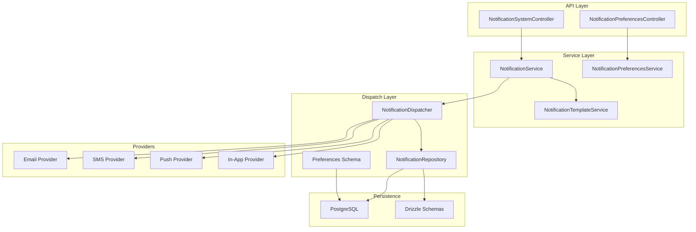
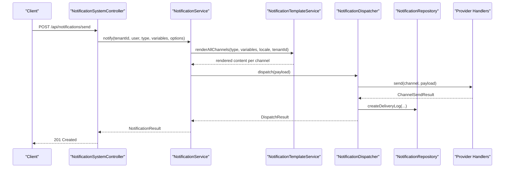
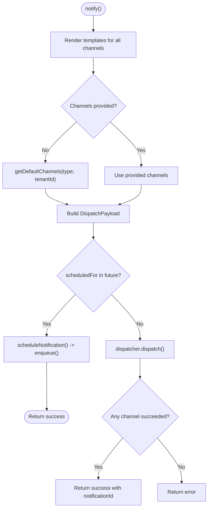
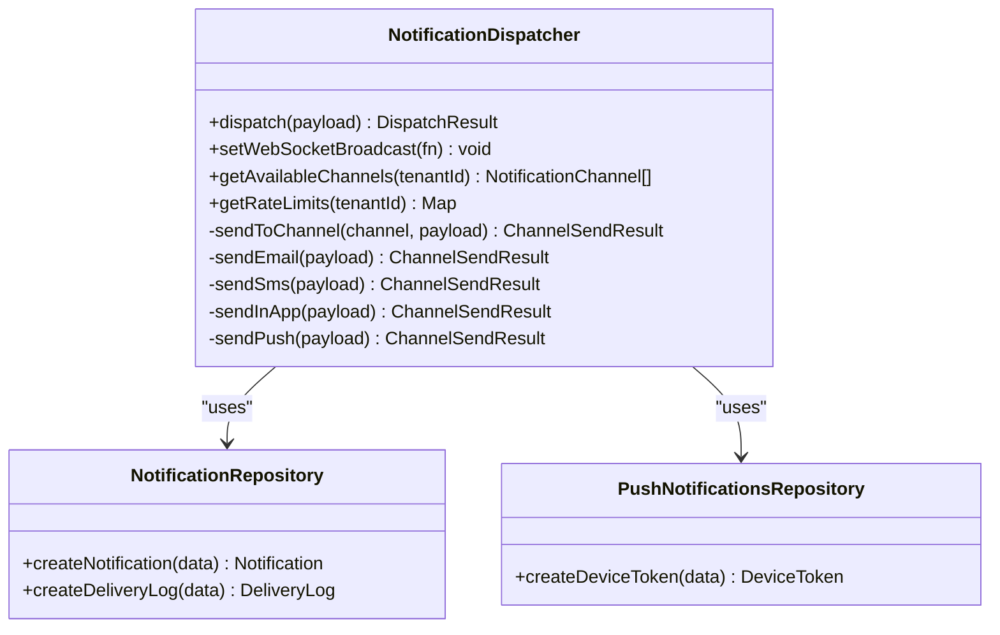
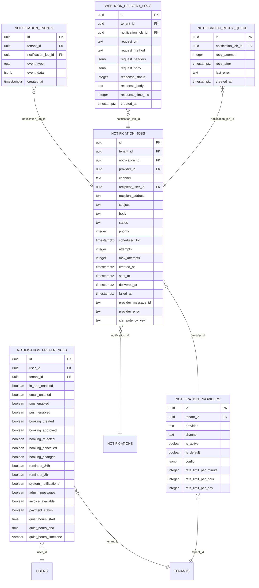
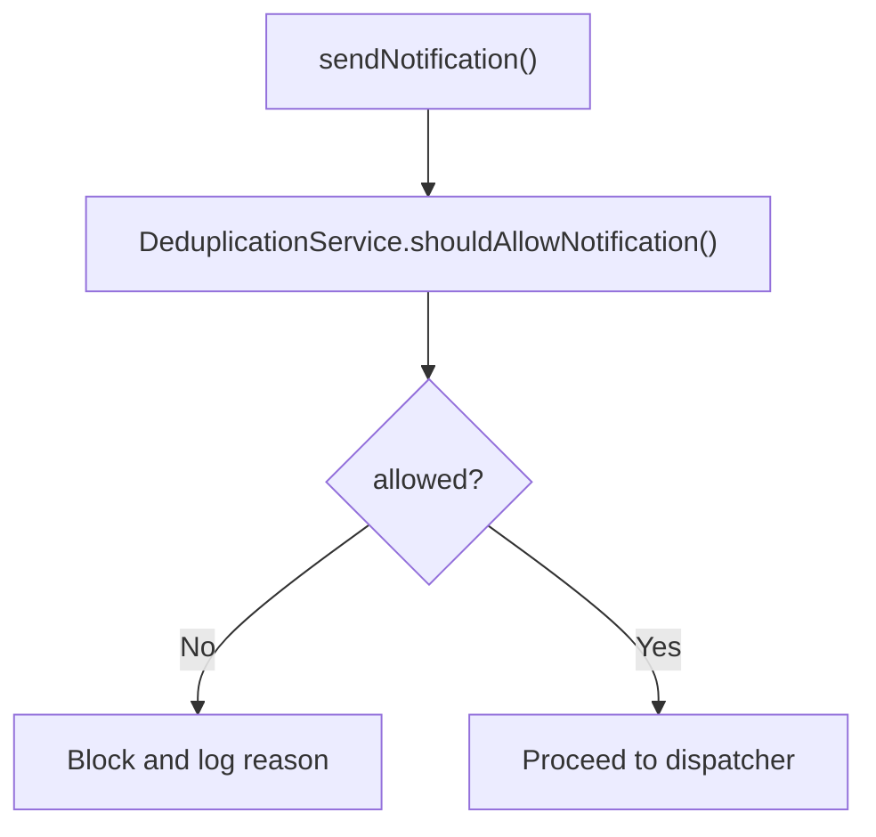
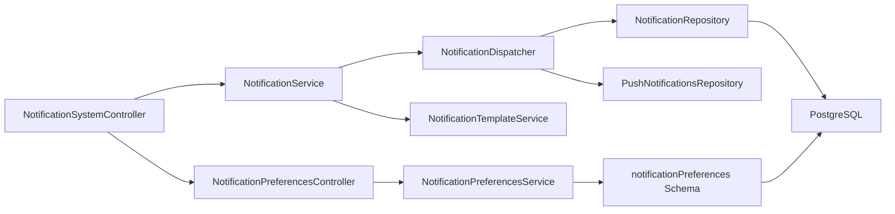

# Notification Engine

<cite>
**Referenced Files in This Document**
- [apps/api/src/modules/notification-system/notification.dispatcher.ts](file://apps/api/src/modules/notification-system/notification.dispatcher.ts)
- [apps/api/src/modules/notification-system/notification.service.ts](file://apps/api/src/modules/notification-system/notification.service.ts)
- [apps/api/src/modules/notification-system/notification.repository.ts](file://apps/api/src/modules/notification-system/notification.repository.ts)
- [apps/api/src/modules/notification-system/notification.types.ts](file://apps/api/src/modules/notification-system/notification.types.ts)
- [apps/api/src/modules/notification-system/notification.controller.ts](file://apps/api/src/modules/notification-system/notification.controller.ts)
- [apps/api/src/modules/notification-system/notification-template.service.ts](file://apps/api/src/modules/notification-system/notification-template.service.ts)
- [apps/api/src/modules/notification-system/notification-preferences.service.ts](file://apps/api/src/modules/notification-system/notification-preferences.service.ts)
- [apps/api/src/modules/notification-system/notification-preferences.controller.ts](file://apps/api/src/modules/notification-system/notification-preferences.controller.ts)
- [apps/api/src/database/schema/notification-preferences.ts](file://apps/api/src/database/schema/notification-preferences.ts)
- [apps/api/drizzle/0002_domain_notifications.sql](file://apps/api/drizzle/0002_domain_notifications.sql)
- [apps/api/drizzle/0020_notification_delivery.sql](file://apps/api/drizzle/0020_notification_delivery.sql)
- [apps/api/drizzle/0032_notification_preferences.sql](file://apps/api/drizzle/0032_notification_preferences.sql)
- [apps/api/src/modules/notifications/notification.service.ts](file://apps/api/src/modules/notifications/notification.service.ts)
- [apps/api/src/modules/notifications/notification.repository.ts](file://apps/api/src/modules/notifications/notification.repository.ts)
- [apps/api/src/modules/notifications/notifications.controller.ts](file://apps/api/src/modules/notifications/notifications.controller.ts)
- [apps/api/tests/integration/notification-deduplication.test.ts](file://apps/api/tests/integration/notification-deduplication.test.ts)
</cite>

## Table of Contents
1. [Introduction](#introduction)
2. [Project Structure](#project-structure)
3. [Core Components](#core-components)
4. [Architecture Overview](#architecture-overview)
5. [Detailed Component Analysis](#detailed-component-analysis)
6. [Dependency Analysis](#dependency-analysis)
7. [Performance Considerations](#performance-considerations)
8. [Troubleshooting Guide](#troubleshooting-guide)
9. [Conclusion](#conclusion)
10. [Appendices](#appendices)

## Introduction
This document describes the notification engine system in the Laravel monorepo. It covers the notification dispatch architecture, delivery service implementation, deduplication mechanisms, notification types, trigger conditions, and delivery channels. It also documents the service layer for notification processing, repository patterns for notification storage, and deduplication strategies. Configuration options for notification preferences, retry mechanisms, and failure handling are explained, along with examples of notification creation, delivery workflows, and monitoring approaches.

## Project Structure
The notification engine is primarily implemented under the notification-system module with supporting components in the legacy notifications module and database schema/migrations. The system exposes REST endpoints via controllers and orchestrates delivery through a dispatcher and repository pattern backed by PostgreSQL.

**Diagram sources**
- [apps/api/src/modules/notification-system/notification.controller.ts](file://apps/api/src/modules/notification-system/notification.controller.ts#L55-L87)
- [apps/api/src/modules/notification-system/notification-preferences.controller.ts](file://apps/api/src/modules/notification-system/notification-preferences.controller.ts#L62-L72)
- [apps/api/src/modules/notification-system/notification.service.ts](file://apps/api/src/modules/notification-system/notification.service.ts#L33-L43)
- [apps/api/src/modules/notification-system/notification.dispatcher.ts](file://apps/api/src/modules/notification-system/notification.dispatcher.ts#L40-L54)
- [apps/api/src/modules/notification-system/notification.repository.ts](file://apps/api/src/modules/notification-system/notification.repository.ts#L26-L27)
- [apps/api/src/database/schema/notification-preferences.ts](file://apps/api/src/database/schema/notification-preferences.ts#L27-L70)
- [apps/api/drizzle/0020_notification_delivery.sql](file://apps/api/drizzle/0020_notification_delivery.sql#L62-L106)
- [apps/api/drizzle/0032_notification_preferences.sql](file://apps/api/drizzle/0032_notification_preferences.sql#L10-L51)

**Section sources**
- [apps/api/src/modules/notification-system/notification.controller.ts](file://apps/api/src/modules/notification-system/notification.controller.ts#L55-L87)
- [apps/api/src/modules/notification-system/notification-preferences.controller.ts](file://apps/api/src/modules/notification-system/notification-preferences.controller.ts#L62-L72)
- [apps/api/src/modules/notification-system/notification.service.ts](file://apps/api/src/modules/notification-system/notification.service.ts#L33-L43)
- [apps/api/src/modules/notification-system/notification.dispatcher.ts](file://apps/api/src/modules/notification-system/notification.dispatcher.ts#L40-L54)
- [apps/api/src/modules/notification-system/notification.repository.ts](file://apps/api/src/modules/notification-system/notification.repository.ts#L26-L27)
- [apps/api/src/database/schema/notification-preferences.ts](file://apps/api/src/database/schema/notification-preferences.ts#L27-L70)
- [apps/api/drizzle/0020_notification_delivery.sql](file://apps/api/drizzle/0020_notification_delivery.sql#L62-L106)
- [apps/api/drizzle/0032_notification_preferences.sql](file://apps/api/drizzle/0032_notification_preferences.sql#L10-L51)

## Core Components
- NotificationService: Orchestrates notification creation, scheduling, and dispatch; integrates template rendering and channel selection.
- NotificationDispatcher: Routes notifications to channels (email, SMS, push, in-app), aggregates results, and records delivery logs.
- NotificationRepository: Implements CRUD and queries for notifications, templates, delivery logs, queue, and provider configs.
- NotificationTemplateService: Manages templates, renders localized content, and validates variables.
- NotificationPreferencesService: Manages user preferences, type enablement, channel enablement, and quiet hours.
- Controllers: Expose REST endpoints for user notifications, admin broadcasts, templates, and preferences.

Key responsibilities:
- Notification types and channels are defined in types.
- Default channel selection is implemented in the service.
- Delivery logs and retry queues are handled in the repository and SQL migrations.
- Preferences are stored in dedicated tables and schemas.

**Section sources**
- [apps/api/src/modules/notification-system/notification.service.ts](file://apps/api/src/modules/notification-system/notification.service.ts#L33-L43)
- [apps/api/src/modules/notification-system/notification.dispatcher.ts](file://apps/api/src/modules/notification-system/notification.dispatcher.ts#L40-L54)
- [apps/api/src/modules/notification-system/notification.repository.ts](file://apps/api/src/modules/notification-system/notification.repository.ts#L26-L27)
- [apps/api/src/modules/notification-system/notification-template.service.ts](file://apps/api/src/modules/notification-system/notification-template.service.ts#L14-L15)
- [apps/api/src/modules/notification-system/notification-preferences.service.ts](file://apps/api/src/modules/notification-system/notification-preferences.service.ts#L41-L42)
- [apps/api/src/modules/notification-system/notification.types.ts](file://apps/api/src/modules/notification-system/notification.types.ts#L10-L31)

## Architecture Overview
The notification engine follows a layered architecture:
- API layer: Controllers expose endpoints for user notifications, admin broadcasts, templates, and preferences.
- Service layer: Services encapsulate business logic for notification orchestration, templating, and preferences.
- Dispatch layer: Dispatcher selects channels, invokes handlers, and records delivery outcomes.
- Persistence: Drizzle ORM schema and PostgreSQL tables manage notifications, templates, delivery logs, queue, and provider configurations.

**Diagram sources**
- [apps/api/src/modules/notification-system/notification.controller.ts](file://apps/api/src/modules/notification-system/notification.controller.ts#L220-L263)
- [apps/api/src/modules/notification-system/notification.service.ts](file://apps/api/src/modules/notification-system/notification.service.ts#L59-L125)
- [apps/api/src/modules/notification-system/notification-template.service.ts](file://apps/api/src/modules/notification-system/notification-template.service.ts#L131-L155)
- [apps/api/src/modules/notification-system/notification.dispatcher.ts](file://apps/api/src/modules/notification-system/notification.dispatcher.ts#L66-L119)
- [apps/api/src/modules/notification-system/notification.repository.ts](file://apps/api/src/modules/notification-system/notification.repository.ts#L244-L250)

## Detailed Component Analysis

### NotificationService
Responsibilities:
- Renders templates for all channels.
- Builds dispatch payloads with title/message/emailSubject/emailHtml.
- Schedules notifications for future delivery.
- Processes the queue (worker-driven).
- Provides user-centric operations: list, read, dismiss, delete, stats.

Key behaviors:
- Default channel selection based on notification type.
- Action URL construction for related entities.
- DTO mapping for external consumption.

**Diagram sources**
- [apps/api/src/modules/notification-system/notification.service.ts](file://apps/api/src/modules/notification-system/notification.service.ts#L59-L125)
- [apps/api/src/modules/notification-system/notification.service.ts](file://apps/api/src/modules/notification-system/notification.service.ts#L130-L147)
- [apps/api/src/modules/notification-system/notification.service.ts](file://apps/api/src/modules/notification-system/notification.service.ts#L295-L314)

**Section sources**
- [apps/api/src/modules/notification-system/notification.service.ts](file://apps/api/src/modules/notification-system/notification.service.ts#L33-L43)
- [apps/api/src/modules/notification-system/notification.service.ts](file://apps/api/src/modules/notification-system/notification.service.ts#L59-L125)
- [apps/api/src/modules/notification-system/notification.service.ts](file://apps/api/src/modules/notification-system/notification.service.ts#L130-L147)
- [apps/api/src/modules/notification-system/notification.service.ts](file://apps/api/src/modules/notification-system/notification.service.ts#L295-L314)

### NotificationDispatcher
Responsibilities:
- Selects and invokes channel handlers (email, SMS, push, in-app).
- Aggregates channel results and creates delivery logs.
- Determines available channels and rate limits per tenant.
- Broadcasts in-app notifications via WebSocket.

Implementation highlights:
- Channel routing switch-case.
- SMS truncation to 160 chars.
- Delivery log creation per channel.

**Diagram sources**
- [apps/api/src/modules/notification-system/notification.dispatcher.ts](file://apps/api/src/modules/notification-system/notification.dispatcher.ts#L40-L54)
- [apps/api/src/modules/notification-system/notification.dispatcher.ts](file://apps/api/src/modules/notification-system/notification.dispatcher.ts#L121-L141)
- [apps/api/src/modules/notification-system/notification.dispatcher.ts](file://apps/api/src/modules/notification-system/notification.dispatcher.ts#L143-L183)
- [apps/api/src/modules/notification-system/notification.dispatcher.ts](file://apps/api/src/modules/notification-system/notification.dispatcher.ts#L185-L210)

**Section sources**
- [apps/api/src/modules/notification-system/notification.dispatcher.ts](file://apps/api/src/modules/notification-system/notification.dispatcher.ts#L40-L54)
- [apps/api/src/modules/notification-system/notification.dispatcher.ts](file://apps/api/src/modules/notification-system/notification.dispatcher.ts#L66-L119)
- [apps/api/src/modules/notification-system/notification.dispatcher.ts](file://apps/api/src/modules/notification-system/notification.dispatcher.ts#L121-L141)
- [apps/api/src/modules/notification-system/notification.dispatcher.ts](file://apps/api/src/modules/notification-system/notification.dispatcher.ts#L143-L183)
- [apps/api/src/modules/notification-system/notification.dispatcher.ts](file://apps/api/src/modules/notification-system/notification.dispatcher.ts#L185-L210)

### NotificationRepository
Responsibilities:
- CRUD for notifications, templates, delivery logs, and queue items.
- Provider configuration retrieval and counters.
- Statistics aggregation (totals, unread counts, recent activity).
- Queue prioritization by urgency and scheduling.

Key operations:
- Enqueue items with priority and scheduled delivery.
- Update queue statuses with retries and completion.
- Increment provider usage counters.

**Section sources**
- [apps/api/src/modules/notification-system/notification.repository.ts](file://apps/api/src/modules/notification-system/notification.repository.ts#L26-L27)
- [apps/api/src/modules/notification-system/notification.repository.ts](file://apps/api/src/modules/notification-system/notification.repository.ts#L316-L322)
- [apps/api/src/modules/notification-system/notification.repository.ts](file://apps/api/src/modules/notification-system/notification.repository.ts#L324-L338)
- [apps/api/src/modules/notification-system/notification.repository.ts](file://apps/api/src/modules/notification-system/notification.repository.ts#L352-L384)
- [apps/api/src/modules/notification-system/notification.repository.ts](file://apps/api/src/modules/notification-system/notification.repository.ts#L405-L447)
- [apps/api/src/modules/notification-system/notification.repository.ts](file://apps/api/src/modules/notification-system/notification.repository.ts#L453-L481)

### NotificationTemplateService
Responsibilities:
- Template CRUD and retrieval.
- Render templates per channel and locale.
- Variable interpolation and validation.

**Section sources**
- [apps/api/src/modules/notification-system/notification-template.service.ts](file://apps/api/src/modules/notification-system/notification-template.service.ts#L14-L15)
- [apps/api/src/modules/notification-system/notification-template.service.ts](file://apps/api/src/modules/notification-system/notification-template.service.ts#L72-L126)
- [apps/api/src/modules/notification-system/notification-template.service.ts](file://apps/api/src/modules/notification-system/notification-template.service.ts#L131-L155)
- [apps/api/src/modules/notification-system/notification-template.service.ts](file://apps/api/src/modules/notification-system/notification-template.service.ts#L161-L173)

### NotificationPreferencesService
Responsibilities:
- Retrieve or create default preferences per user/tenant.
- Update preferences, validate quiet hours, and reset to defaults.
- Enable/disable channels and notification types.
- Quiet hours detection across midnight.

**Section sources**
- [apps/api/src/modules/notification-system/notification-preferences.service.ts](file://apps/api/src/modules/notification-system/notification-preferences.service.ts#L41-L42)
- [apps/api/src/modules/notification-system/notification-preferences.service.ts](file://apps/api/src/modules/notification-system/notification-preferences.service.ts#L47-L69)
- [apps/api/src/modules/notification-system/notification-preferences.service.ts](file://apps/api/src/modules/notification-system/notification-preferences.service.ts#L116-L149)
- [apps/api/src/modules/notification-system/notification-preferences.service.ts](file://apps/api/src/modules/notification-system/notification-preferences.service.ts#L154-L187)
- [apps/api/src/modules/notification-system/notification-preferences.service.ts](file://apps/api/src/modules/notification-system/notification-preferences.service.ts#L232-L265)

### Controllers
- NotificationSystemController: User notifications, admin send/broadcast, templates, channel/rate-limit info.
- NotificationPreferencesController: Get/update/reset user preferences.

**Section sources**
- [apps/api/src/modules/notification-system/notification.controller.ts](file://apps/api/src/modules/notification-system/notification.controller.ts#L55-L87)
- [apps/api/src/modules/notification-system/notification.controller.ts](file://apps/api/src/modules/notification-system/notification.controller.ts#L220-L263)
- [apps/api/src/modules/notification-system/notification.controller.ts](file://apps/api/src/modules/notification-system/notification.controller.ts#L315-L341)
- [apps/api/src/modules/notification-system/notification.controller.ts](file://apps/api/src/modules/notification-system/notification.controller.ts#L432-L457)
- [apps/api/src/modules/notification-system/notification-preferences.controller.ts](file://apps/api/src/modules/notification-system/notification-preferences.controller.ts#L62-L72)
- [apps/api/src/modules/notification-system/notification-preferences.controller.ts](file://apps/api/src/modules/notification-system/notification-preferences.controller.ts#L116-L176)

### Database Schema and Migrations
- Domain extension for in-app notifications and user preferences.
- Delivery system with providers, jobs, events, retry queue, and webhook logs.
- Notification preferences per user/tenant with defaults and quiet hours.

**Diagram sources**
- [apps/api/drizzle/0002_domain_notifications.sql](file://apps/api/drizzle/0002_domain_notifications.sql#L15-L54)
- [apps/api/drizzle/0020_notification_delivery.sql](file://apps/api/drizzle/0020_notification_delivery.sql#L28-L106)
- [apps/api/drizzle/0020_notification_delivery.sql](file://apps/api/drizzle/0020_notification_delivery.sql#L116-L134)
- [apps/api/drizzle/0020_notification_delivery.sql](file://apps/api/drizzle/0020_notification_delivery.sql#L162-L183)
- [apps/api/drizzle/0020_notification_delivery.sql](file://apps/api/drizzle/0020_notification_delivery.sql#L140-L156)
- [apps/api/drizzle/0032_notification_preferences.sql](file://apps/api/drizzle/0032_notification_preferences.sql#L10-L51)

**Section sources**
- [apps/api/drizzle/0002_domain_notifications.sql](file://apps/api/drizzle/0002_domain_notifications.sql#L15-L54)
- [apps/api/drizzle/0020_notification_delivery.sql](file://apps/api/drizzle/0020_notification_delivery.sql#L28-L106)
- [apps/api/drizzle/0020_notification_delivery.sql](file://apps/api/drizzle/0020_notification_delivery.sql#L116-L134)
- [apps/api/drizzle/0020_notification_delivery.sql](file://apps/api/drizzle/0020_notification_delivery.sql#L140-L156)
- [apps/api/drizzle/0020_notification_delivery.sql](file://apps/api/drizzle/0020_notification_delivery.sql#L162-L183)
- [apps/api/drizzle/0032_notification_preferences.sql](file://apps/api/drizzle/0032_notification_preferences.sql#L10-L51)

### Notification Types, Triggers, and Channels
- Notification types include request-related, booking lifecycle, reminders, invoices, payments, and system alerts.
- Default channel selection is implemented per type.
- Channels supported: in_app, email, sms, push.

**Section sources**
- [apps/api/src/modules/notification-system/notification.types.ts](file://apps/api/src/modules/notification-system/notification.types.ts#L10-L22)
- [apps/api/src/modules/notification-system/notification.service.ts](file://apps/api/src/modules/notification-system/notification.service.ts#L295-L314)

### Deduplication Mechanisms
- The legacy notifications module includes a repository with a content hash lookup and a dedicated integration test for deduplication.
- The notification dispatcher and service focus on channel dispatch and delivery logging; deduplication checks are performed upstream in the legacy module’s send method.

**Diagram sources**
- [apps/api/src/modules/notifications/notification.service.ts](file://apps/api/src/modules/notifications/notification.service.ts#L69-L86)
- [apps/api/src/modules/notifications/notification.repository.ts](file://apps/api/src/modules/notifications/notification.repository.ts#L42-L50)
- [apps/api/tests/integration/notification-deduplication.test.ts](file://apps/api/tests/integration/notification-deduplication.test.ts)

**Section sources**
- [apps/api/src/modules/notifications/notification.service.ts](file://apps/api/src/modules/notifications/notification.service.ts#L69-L86)
- [apps/api/src/modules/notifications/notification.repository.ts](file://apps/api/src/modules/notifications/notification.repository.ts#L42-L50)
- [apps/api/tests/integration/notification-deduplication.test.ts](file://apps/api/tests/integration/notification-deduplication.test.ts)

### Delivery Channels and Retry/Failure Handling
- Providers: Email (SendGrid), SMS (Twilio), Push (native/webhook), and internal in-app delivery.
- Outbox pattern with jobs, idempotency keys, and retry queue.
- Delivery events track status transitions.
- Repository manages delivery log updates and retry counts.

**Section sources**
- [apps/api/drizzle/0020_notification_delivery.sql](file://apps/api/drizzle/0020_notification_delivery.sql#L6-L22)
- [apps/api/drizzle/0020_notification_delivery.sql](file://apps/api/drizzle/0020_notification_delivery.sql#L62-L106)
- [apps/api/drizzle/0020_notification_delivery.sql](file://apps/api/drizzle/0020_notification_delivery.sql#L196-L248)
- [apps/api/src/modules/notification-system/notification.repository.ts](file://apps/api/src/modules/notification-system/notification.repository.ts#L244-L310)
- [apps/api/src/modules/notification-system/notification.repository.ts](file://apps/api/src/modules/notification-system/notification.repository.ts#L316-L384)

### Configuration Options for Notification Preferences
- Per-channel enable/disable flags.
- Per-notification-type enable/disable flags.
- Quiet hours with start/end time and timezone.
- Defaults created automatically if missing.

**Section sources**
- [apps/api/src/database/schema/notification-preferences.ts](file://apps/api/src/database/schema/notification-preferences.ts#L27-L70)
- [apps/api/drizzle/0032_notification_preferences.sql](file://apps/api/drizzle/0032_notification_preferences.sql#L10-L51)
- [apps/api/src/modules/notification-system/notification-preferences.service.ts](file://apps/api/src/modules/notification-system/notification-preferences.service.ts#L74-L111)
- [apps/api/src/modules/notification-system/notification-preferences.service.ts](file://apps/api/src/modules/notification-system/notification-preferences.service.ts#L232-L265)

### Examples

#### Example: Creating and Sending a Notification
- Endpoint: POST /api/notifications/send
- Request includes type, variables, optional channels/priority/related entity.
- Service renders templates, builds payload, and dispatches to selected channels.

**Section sources**
- [apps/api/src/modules/notification-system/notification.controller.ts](file://apps/api/src/modules/notification-system/notification.controller.ts#L220-L263)
- [apps/api/src/modules/notification-system/notification.service.ts](file://apps/api/src/modules/notification-system/notification.service.ts#L59-L125)

#### Example: Broadcasting to Multiple Users
- Endpoint: POST /api/notifications/broadcast
- Sends the same notification to a list of users and returns per-user results.

**Section sources**
- [apps/api/src/modules/notification-system/notification.controller.ts](file://apps/api/src/modules/notification-system/notification.controller.ts#L265-L309)

#### Example: Managing Templates
- Endpoints: GET/POST/PUT/DELETE /api/notification-templates and preview endpoint.
- Templates support multiple channels and locales.

**Section sources**
- [apps/api/src/modules/notification-system/notification.controller.ts](file://apps/api/src/modules/notification-system/notification.controller.ts#L315-L341)
- [apps/api/src/modules/notification-system/notification.controller.ts](file://apps/api/src/modules/notification-system/notification.controller.ts#L407-L426)
- [apps/api/src/modules/notification-system/notification-template.service.ts](file://apps/api/src/modules/notification-system/notification-template.service.ts#L21-L66)

#### Example: User Notification Preferences
- Endpoints: GET/PUT/POST /api/notifications/preferences
- Update channel/type preferences and quiet hours.

**Section sources**
- [apps/api/src/modules/notification-system/notification-preferences.controller.ts](file://apps/api/src/modules/notification-system/notification-preferences.controller.ts#L78-L110)
- [apps/api/src/modules/notification-system/notification-preferences.controller.ts](file://apps/api/src/modules/notification-system/notification-preferences.controller.ts#L116-L176)
- [apps/api/src/modules/notification-system/notification-preferences.controller.ts](file://apps/api/src/modules/notification-system/notification-preferences.controller.ts#L182-L215)

#### Example: Monitoring and Stats
- Endpoints: GET /api/notifications/stats, GET /api/notifications/count
- Repository computes totals, unread counts, and recent activity.

**Section sources**
- [apps/api/src/modules/notification-system/notification.controller.ts](file://apps/api/src/modules/notification-system/notification.controller.ts#L127-L134)
- [apps/api/src/modules/notification-system/notification.controller.ts](file://apps/api/src/modules/notification-system/notification.controller.ts#L118-L125)
- [apps/api/src/modules/notification-system/notification.repository.ts](file://apps/api/src/modules/notification-system/notification.repository.ts#L453-L481)

## Dependency Analysis
- NotificationService depends on NotificationDispatcher, NotificationTemplateService, and repositories.
- NotificationDispatcher depends on NotificationRepository and PushNotificationsRepository.
- Controllers depend on services and enforce authorization.
- Database schema defines relationships among preferences, providers, jobs, events, and retry queue.

**Diagram sources**
- [apps/api/src/modules/notification-system/notification.controller.ts](file://apps/api/src/modules/notification-system/notification.controller.ts#L55-L87)
- [apps/api/src/modules/notification-system/notification-preferences.controller.ts](file://apps/api/src/modules/notification-system/notification-preferences.controller.ts#L62-L72)
- [apps/api/src/modules/notification-system/notification.service.ts](file://apps/api/src/modules/notification-system/notification.service.ts#L33-L43)
- [apps/api/src/modules/notification-system/notification.dispatcher.ts](file://apps/api/src/modules/notification-system/notification.dispatcher.ts#L40-L54)
- [apps/api/src/modules/notification-system/notification.repository.ts](file://apps/api/src/modules/notification-system/notification.repository.ts#L26-L27)
- [apps/api/src/database/schema/notification-preferences.ts](file://apps/api/src/database/schema/notification-preferences.ts#L27-L70)

**Section sources**
- [apps/api/src/modules/notification-system/notification.controller.ts](file://apps/api/src/modules/notification-system/notification.controller.ts#L55-L87)
- [apps/api/src/modules/notification-system/notification-preferences.controller.ts](file://apps/api/src/modules/notification-system/notification-preferences.controller.ts#L62-L72)
- [apps/api/src/modules/notification-system/notification.service.ts](file://apps/api/src/modules/notification-system/notification.service.ts#L33-L43)
- [apps/api/src/modules/notification-system/notification.dispatcher.ts](file://apps/api/src/modules/notification-system/notification.dispatcher.ts#L40-L54)
- [apps/api/src/modules/notification-system/notification.repository.ts](file://apps/api/src/modules/notification-system/notification.repository.ts#L26-L27)
- [apps/api/src/database/schema/notification-preferences.ts](file://apps/api/src/database/schema/notification-preferences.ts#L27-L70)

## Performance Considerations
- Queue prioritization by urgency and scheduled time reduces latency for time-sensitive notifications.
- Idempotency keys prevent duplicate sends and reduce redundant work.
- Provider rate limits and per-minute/hour/day counters help avoid throttling.
- Repository operations use indexes on tenant, status, and timestamps for efficient queries.
- Template rendering uses parallelization across channels.

[No sources needed since this section provides general guidance]

## Troubleshooting Guide
Common issues and remedies:
- No template content for any channel: Ensure templates are created and activated for the given type and locale.
- Channel unavailable: Verify provider configuration and rate limits; use GET /api/notifications/channels and GET /api/notifications/rate-limits.
- Delivery failures: Inspect delivery logs and retry queue; repository increments retry counts and moves items accordingly.
- Deduplication blocking: Review deduplication logic and content hashing; ensure subject/body differences are intentional.
- Preferences misconfiguration: Validate quiet hours format and timezone; reset to defaults if needed.

**Section sources**
- [apps/api/src/modules/notification-system/notification.service.ts](file://apps/api/src/modules/notification-system/notification.service.ts#L77-L79)
- [apps/api/src/modules/notification-system/notification.dispatcher.ts](file://apps/api/src/modules/notification-system/notification.dispatcher.ts#L229-L246)
- [apps/api/src/modules/notification-system/notification.dispatcher.ts](file://apps/api/src/modules/notification-system/notification.dispatcher.ts#L251-L267)
- [apps/api/src/modules/notification-system/notification.repository.ts](file://apps/api/src/modules/notification-system/notification.repository.ts#L290-L310)
- [apps/api/src/modules/notification-system/notification-preferences.service.ts](file://apps/api/src/modules/notification-system/notification-preferences.service.ts#L295-L316)

## Conclusion
The notification engine provides a robust, extensible system for managing notifications across channels with strong separation of concerns. It supports templating, preferences, scheduling, delivery logging, and retry mechanisms. The architecture leverages repositories and controllers to maintain clean APIs while ensuring reliable delivery and observability.

[No sources needed since this section summarizes without analyzing specific files]

## Appendices

### API Endpoints Summary
- User notifications: GET /api/notifications, GET /api/notifications/count, GET /api/notifications/stats, GET/PUT/DELETE notification endpoints.
- Admin send/broadcast: POST /api/notifications/send, POST /api/notifications/broadcast.
- Templates: GET/POST/PUT/DELETE /api/notification-templates, POST /api/notification-templates/:code/preview.
- Preferences: GET/PUT/POST /api/notifications/preferences.

**Section sources**
- [apps/api/src/modules/notification-system/notification.controller.ts](file://apps/api/src/modules/notification-system/notification.controller.ts#L61-L87)
- [apps/api/src/modules/notification-system/notification.controller.ts](file://apps/api/src/modules/notification-system/notification.controller.ts#L315-L341)
- [apps/api/src/modules/notification-system/notification.controller.ts](file://apps/api/src/modules/notification-system/notification.controller.ts#L432-L457)