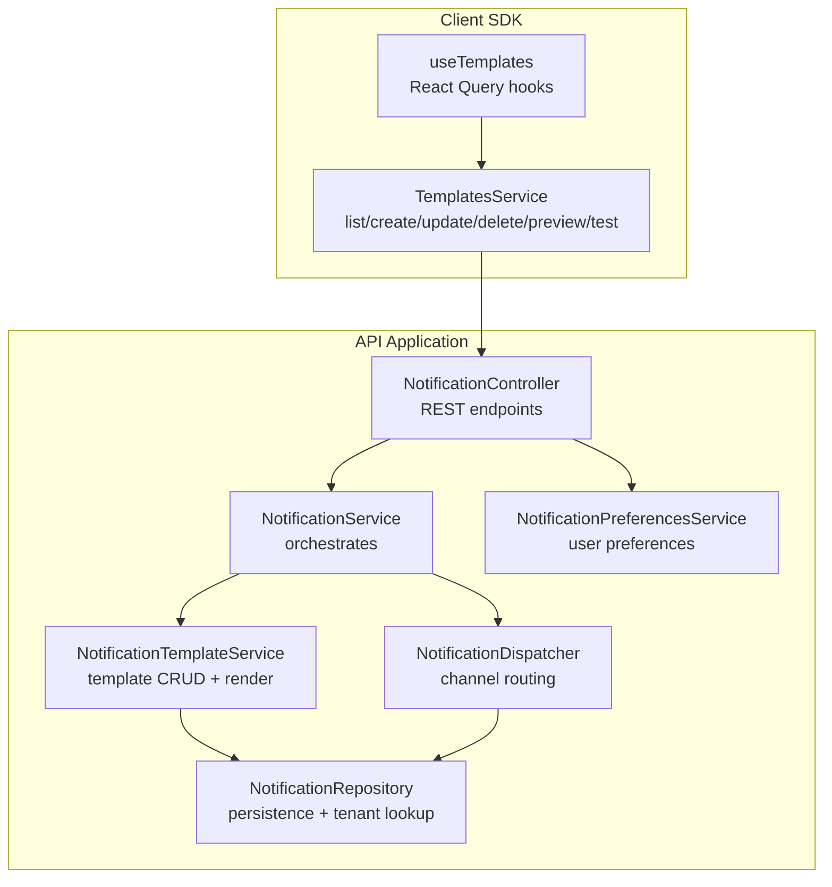
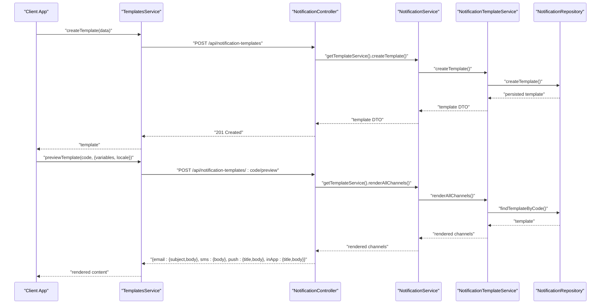
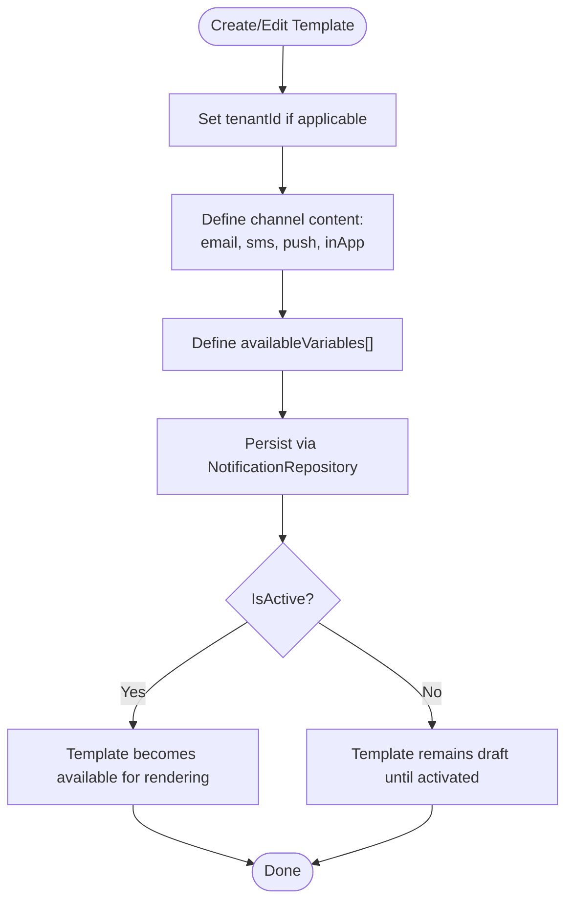
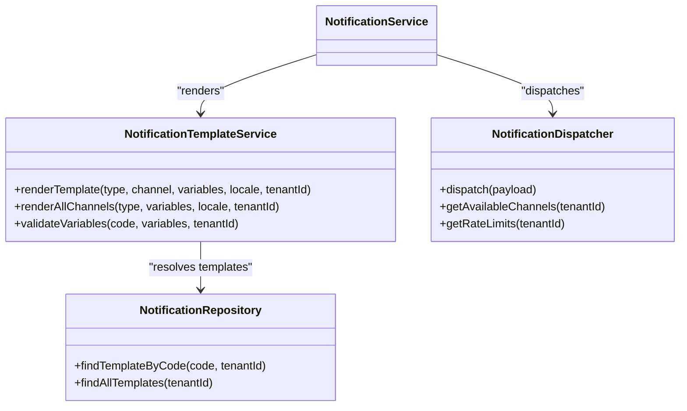
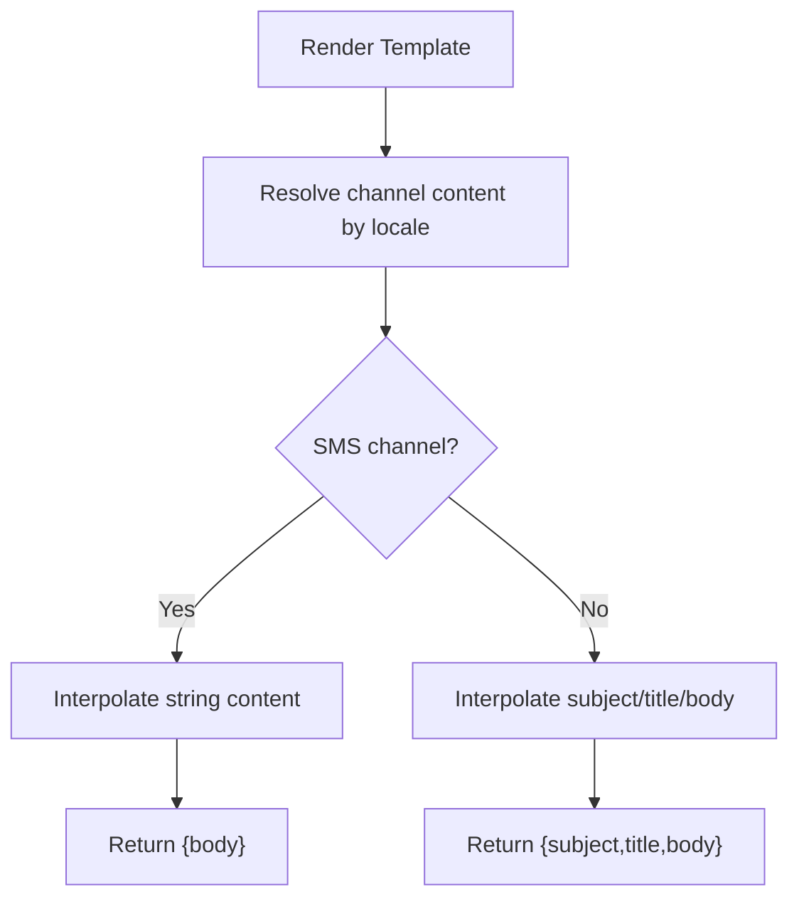
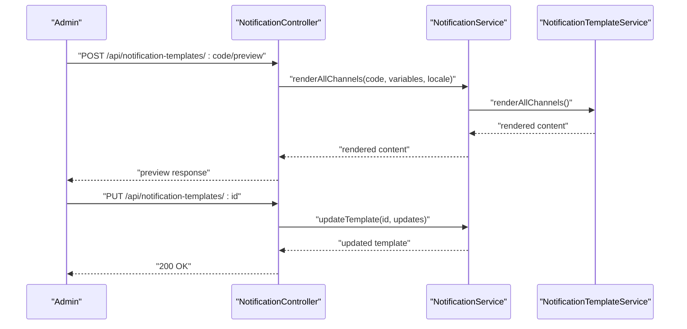
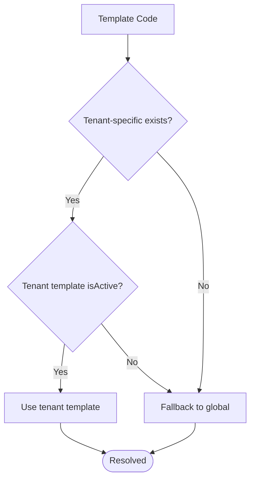
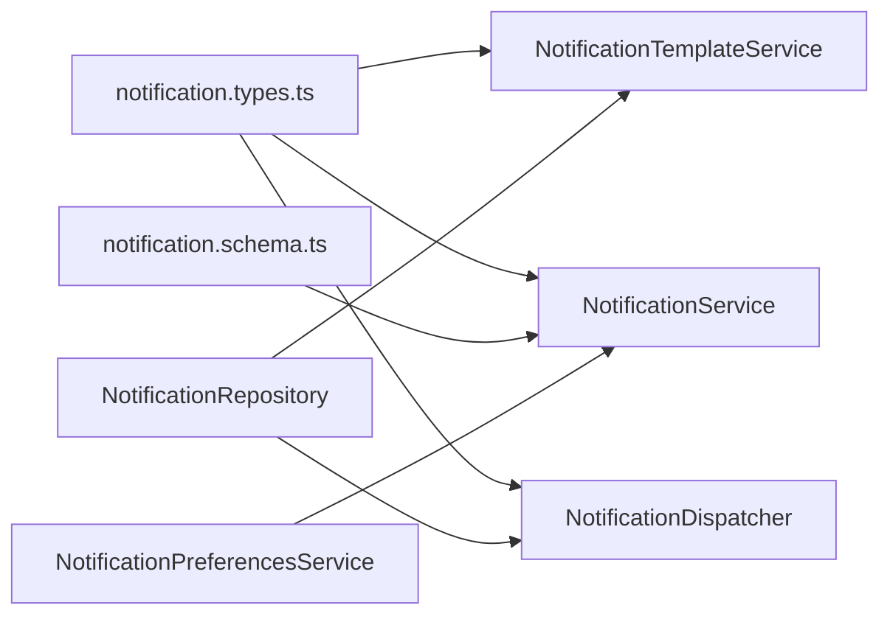

# Notification System Templates

<cite>
**Referenced Files in This Document**
- [notification-template.service.ts](file://apps/api/src/modules/notification-system/notification-template.service.ts)
- [notification.types.ts](file://apps/api/src/modules/notification-system/notification.types.ts)
- [notification.schema.ts](file://apps/api/src/schemas/notification.schema.ts)
- [notification.service.ts](file://apps/api/src/modules/notification-system/notification.service.ts)
- [notification.dispatcher.ts](file://apps/api/src/modules/notification-system/notification.dispatcher.ts)
- [notification.controller.ts](file://apps/api/src/modules/notification-system/notification.controller.ts)
- [notification.repository.ts](file://apps/api/src/modules/notification-system/notification.repository.ts)
- [notification-preferences.service.ts](file://apps/api/src/modules/notification-system/notification-preferences.service.ts)
- [notification-preferences.controller.ts](file://apps/api/src/modules/notification-system/notification-preferences.controller.ts)
- [templates.service.ts](file://packages/client-sdk/src/services/templates.service.ts)
- [use-templates.ts](file://packages/client-sdk/src/hooks/use-templates.ts)
</cite>

## Table of Contents
1. [Introduction](#introduction)
2. [Project Structure](#project-structure)
3. [Core Components](#core-components)
4. [Architecture Overview](#architecture-overview)
5. [Detailed Component Analysis](#detailed-component-analysis)
6. [Dependency Analysis](#dependency-analysis)
7. [Performance Considerations](#performance-considerations)
8. [Troubleshooting Guide](#troubleshooting-guide)
9. [Conclusion](#conclusion)
10. [Appendices](#appendices)

## Introduction
This document describes the notification system template management in the monorepo. It covers how templates are created, edited, versioned, and rendered per channel (email, SMS, push, in-app). It explains template variables, dynamic content injection, localization support, validation, testing workflows, and approval processes. It also documents template inheritance via tenant scoping, reusability patterns, and best practices for maintenance.

## Project Structure
The notification system is implemented in the API application under the notification-system module. It includes:
- Controllers exposing REST endpoints for templates and notifications
- Services orchestrating template rendering and dispatch
- Repository layer for persistence and tenant-scoped template resolution
- Types and schemas defining structure and validation
- Client SDK providing hooks and services for template management

**Diagram sources**
- [notification.controller.ts](file://apps/api/src/modules/notification-system/notification.controller.ts#L55-L87)
- [notification.service.ts](file://apps/api/src/modules/notification-system/notification.service.ts#L33-L43)
- [notification-template.service.ts](file://apps/api/src/modules/notification-system/notification-template.service.ts#L14-L15)
- [notification.dispatcher.ts](file://apps/api/src/modules/notification-system/notification.dispatcher.ts#L40-L54)
- [notification.repository.ts](file://apps/api/src/modules/notification-system/notification.repository.ts#L26-L27)
- [notification-preferences.service.ts](file://apps/api/src/modules/notification-system/notification-preferences.service.ts#L41-L42)
- [templates.service.ts](file://packages/client-sdk/src/services/templates.service.ts#L55-L115)
- [use-templates.ts](file://packages/client-sdk/src/hooks/use-templates.ts#L1-L108)

**Section sources**
- [notification.controller.ts](file://apps/api/src/modules/notification-system/notification.controller.ts#L55-L87)
- [notification.service.ts](file://apps/api/src/modules/notification-system/notification.service.ts#L33-L43)
- [notification-template.service.ts](file://apps/api/src/modules/notification-system/notification-template.service.ts#L14-L15)
- [notification.dispatcher.ts](file://apps/api/src/modules/notification-system/notification.dispatcher.ts#L40-L54)
- [notification.repository.ts](file://apps/api/src/modules/notification-system/notification.repository.ts#L26-L27)
- [notification-preferences.service.ts](file://apps/api/src/modules/notification-system/notification-preferences.service.ts#L41-L42)
- [templates.service.ts](file://packages/client-sdk/src/services/templates.service.ts#L55-L115)
- [use-templates.ts](file://packages/client-sdk/src/hooks/use-templates.ts#L1-L108)

## Core Components
- Template Service: Provides CRUD operations and renders templates per channel and locale, with variable interpolation and validation.
- Notification Service: Coordinates template rendering and dispatch across channels, supports scheduling and queue processing.
- Dispatcher: Routes notifications to channels (email, SMS, in-app, push) and records delivery logs.
- Repository: Persists templates and notifications, resolves tenant-scoped templates, manages queues and provider configs.
- Preferences Service: Manages user preferences and quiet hours to filter channels and avoid unwanted notifications.
- Controllers: Expose REST endpoints for templates, notifications, preferences, and channel configuration.
- Client SDK: Offers services and hooks for listing, creating, updating, deleting, previewing, and testing templates.

**Section sources**
- [notification-template.service.ts](file://apps/api/src/modules/notification-system/notification-template.service.ts#L14-L235)
- [notification.service.ts](file://apps/api/src/modules/notification-system/notification.service.ts#L33-L369)
- [notification.dispatcher.ts](file://apps/api/src/modules/notification-system/notification.dispatcher.ts#L40-L269)
- [notification.repository.ts](file://apps/api/src/modules/notification-system/notification.repository.ts#L26-L483)
- [notification-preferences.service.ts](file://apps/api/src/modules/notification-system/notification-preferences.service.ts#L41-L318)
- [notification.controller.ts](file://apps/api/src/modules/notification-system/notification.controller.ts#L55-L459)
- [templates.service.ts](file://packages/client-sdk/src/services/templates.service.ts#L55-L115)
- [use-templates.ts](file://packages/client-sdk/src/hooks/use-templates.ts#L1-L108)

## Architecture Overview
The template management architecture centers around a tenant-aware template repository, a template service for rendering and validation, and a dispatcher for channel-specific delivery. The client SDK integrates with the API to manage templates and preview/test content.

**Diagram sources**
- [notification.controller.ts](file://apps/api/src/modules/notification-system/notification.controller.ts#L343-L426)
- [notification.service.ts](file://apps/api/src/modules/notification-system/notification.service.ts#L59-L125)
- [notification-template.service.ts](file://apps/api/src/modules/notification-system/notification-template.service.ts#L32-L66)
- [notification.repository.ts](file://apps/api/src/modules/notification-system/notification.repository.ts#L201-L238)

## Detailed Component Analysis

### Template Creation, Editing, and Versioning
- Creation: Templates are created with tenant scoping and optional system flag. They support channel-specific content and a list of available variables.
- Editing: Updates allow partial fields (name, description, channel content, variables, activation status).
- Versioning: The repository supports tenant-specific and global templates. Tenant-specific templates override global ones when active, enabling per-tenant customization without altering shared templates.

**Diagram sources**
- [notification-template.service.ts](file://apps/api/src/modules/notification-system/notification-template.service.ts#L32-L66)
- [notification.repository.ts](file://apps/api/src/modules/notification-system/notification.repository.ts#L201-L238)

**Section sources**
- [notification-template.service.ts](file://apps/api/src/modules/notification-system/notification-template.service.ts#L32-L66)
- [notification.repository.ts](file://apps/api/src/modules/notification-system/notification.repository.ts#L151-L199)

### Channel-Specific Template Handling
- Email: Subject/body localized content per locale.
- SMS: Simple string content per locale; automatic truncation to 160 characters for single segments.
- Push: Title/body localized content per locale.
- In-App: Title/body localized content per locale.

**Diagram sources**
- [notification-template.service.ts](file://apps/api/src/modules/notification-system/notification-template.service.ts#L75-L155)
- [notification.repository.ts](file://apps/api/src/modules/notification-system/notification.repository.ts#L151-L181)
- [notification.dispatcher.ts](file://apps/api/src/modules/notification-system/notification.dispatcher.ts#L66-L119)

**Section sources**
- [notification-template.service.ts](file://apps/api/src/modules/notification-system/notification-template.service.ts#L75-L155)
- [notification.dispatcher.ts](file://apps/api/src/modules/notification-system/notification.dispatcher.ts#L143-L210)

### Template Variables, Dynamic Content Injection, and Localization
- Variable interpolation uses a placeholder pattern with double curly braces. Missing variables are logged and left as-is.
- Available variables are declared per template and validated against provided variables during preview/testing.
- Localization supports Norwegian (nb) and English (en); fallback occurs when a requested locale is missing.

**Diagram sources**
- [notification-template.service.ts](file://apps/api/src/modules/notification-system/notification-template.service.ts#L161-L173)
- [notification-template.service.ts](file://apps/api/src/modules/notification-system/notification-template.service.ts#L107-L126)

**Section sources**
- [notification-template.service.ts](file://apps/api/src/modules/notification-system/notification-template.service.ts#L161-L173)
- [notification-template.service.ts](file://apps/api/src/modules/notification-system/notification-template.service.ts#L187-L195)

### Template Validation, Testing Workflows, and Approval Processes
- Validation: The service validates that all required variables are present before dispatch.
- Testing: Admin endpoints allow previewing templates with provided variables and locale.
- Approval: Templates are created with an activation flag; deletion is blocked for system templates.

**Diagram sources**
- [notification.controller.ts](file://apps/api/src/modules/notification-system/notification.controller.ts#L407-L426)
- [notification.service.ts](file://apps/api/src/modules/notification-system/notification.service.ts#L59-L125)
- [notification-template.service.ts](file://apps/api/src/modules/notification-system/notification-template.service.ts#L49-L62)

**Section sources**
- [notification.controller.ts](file://apps/api/src/modules/notification-system/notification.controller.ts#L407-L426)
- [notification-template.service.ts](file://apps/api/src/modules/notification-system/notification-template.service.ts#L187-L195)
- [notification.repository.ts](file://apps/api/src/modules/notification-system/notification.repository.ts#L221-L238)

### Template Inheritance and Reusability Patterns
- Tenant-scoped templates override global templates when active, enabling per-tenant customization while preserving shared defaults.
- Templates are reusable across notification types; the service selects channels based on type defaults or explicit overrides.

**Diagram sources**
- [notification.repository.ts](file://apps/api/src/modules/notification-system/notification.repository.ts#L151-L181)

**Section sources**
- [notification.repository.ts](file://apps/api/src/modules/notification-system/notification.repository.ts#L151-L181)
- [notification.service.ts](file://apps/api/src/modules/notification-system/notification.service.ts#L295-L314)

### Best Practices for Template Maintenance
- Define available variables per template to enable validation.
- Keep channel-specific content localized with nb/en fallbacks.
- Use tenant-scoped templates for customizations; keep global templates generic.
- Validate and preview templates before activation.
- Avoid system templates for deletion; use deactivation instead.

**Section sources**
- [notification-template.service.ts](file://apps/api/src/modules/notification-system/notification-template.service.ts#L187-L195)
- [notification.repository.ts](file://apps/api/src/modules/notification-system/notification.repository.ts#L221-L238)

## Dependency Analysis
The template system depends on:
- Notification types and schemas for structure and validation
- Repository for persistence and tenant-aware resolution
- Dispatcher for channel routing and delivery logging
- Preferences for filtering channels based on user settings

**Diagram sources**
- [notification.types.ts](file://apps/api/src/modules/notification-system/notification.types.ts#L10-L274)
- [notification.schema.ts](file://apps/api/src/schemas/notification.schema.ts#L10-L116)
- [notification.service.ts](file://apps/api/src/modules/notification-system/notification.service.ts#L33-L43)
- [notification.dispatcher.ts](file://apps/api/src/modules/notification-system/notification.dispatcher.ts#L40-L54)
- [notification.repository.ts](file://apps/api/src/modules/notification-system/notification.repository.ts#L26-L27)
- [notification-preferences.service.ts](file://apps/api/src/modules/notification-system/notification-preferences.service.ts#L41-L42)

**Section sources**
- [notification.types.ts](file://apps/api/src/modules/notification-system/notification.types.ts#L10-L274)
- [notification.schema.ts](file://apps/api/src/schemas/notification.schema.ts#L10-L116)
- [notification.service.ts](file://apps/api/src/modules/notification-system/notification.service.ts#L33-L43)
- [notification.dispatcher.ts](file://apps/api/src/modules/notification-system/notification.dispatcher.ts#L40-L54)
- [notification.repository.ts](file://apps/api/src/modules/notification-system/notification.repository.ts#L26-L27)
- [notification-preferences.service.ts](file://apps/api/src/modules/notification-system/notification-preferences.service.ts#L41-L42)

## Performance Considerations
- Rendering templates concurrently across channels reduces latency.
- SMS content is truncated to 160 characters; consider pre-truncation to avoid provider-side limits.
- Use tenant-scoped templates judiciously to minimize fallback lookups.
- Cache frequently accessed templates at the application level if needed.

[No sources needed since this section provides general guidance]

## Troubleshooting Guide
Common issues and resolutions:
- Missing variables: Interpolation leaves placeholders unresolved; validate variables before dispatch.
- No content for any channel: Ensure at least one channel has content for the selected locale.
- Rate limits exceeded: Use the rate limits endpoint to check remaining quotas per channel.
- Quiet hours: Users may opt out of notifications during configured quiet hours.

**Section sources**
- [notification-template.service.ts](file://apps/api/src/modules/notification-system/notification-template.service.ts#L161-L173)
- [notification.dispatcher.ts](file://apps/api/src/modules/notification-system/notification.dispatcher.ts#L251-L267)
- [notification-preferences.service.ts](file://apps/api/src/modules/notification-system/notification-preferences.service.ts#L232-L265)

## Conclusion
The notification system provides a robust, tenant-aware template management solution with strong localization, validation, and channel-specific rendering. By leveraging tenant-scoped templates, variable validation, and preview/testing workflows, teams can maintain high-quality, reusable templates across email, SMS, push, and in-app channels.

[No sources needed since this section summarizes without analyzing specific files]

## Appendices

### API Endpoints for Templates
- GET /api/notification-templates
- GET /api/notification-templates/:code
- POST /api/notification-templates
- PUT /api/notification-templates/:id
- DELETE /api/notification-templates/:id
- POST /api/notification-templates/:code/preview

**Section sources**
- [notification.controller.ts](file://apps/api/src/modules/notification-system/notification.controller.ts#L76-L82)
- [notification.controller.ts](file://apps/api/src/modules/notification-system/notification.controller.ts#L315-L426)

### Client SDK Template Management
- Listing, getting, creating, updating, deleting templates
- Previewing with variables and locale
- Sending test emails

**Section sources**
- [templates.service.ts](file://packages/client-sdk/src/services/templates.service.ts#L55-L115)
- [use-templates.ts](file://packages/client-sdk/src/hooks/use-templates.ts#L1-L108)