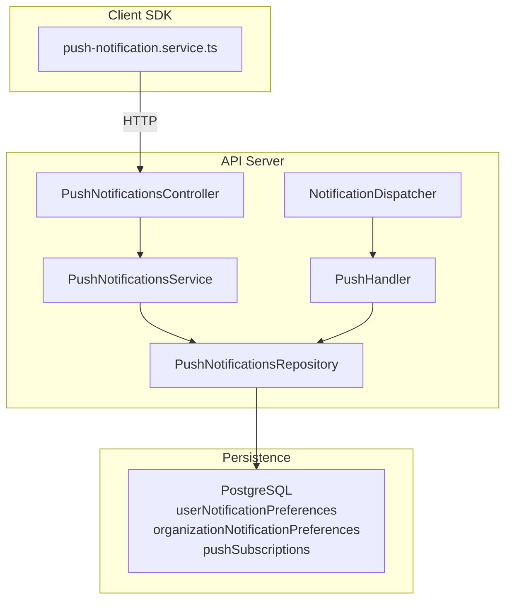
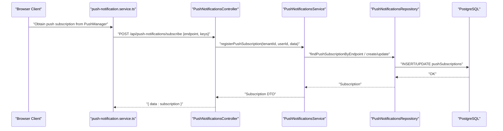
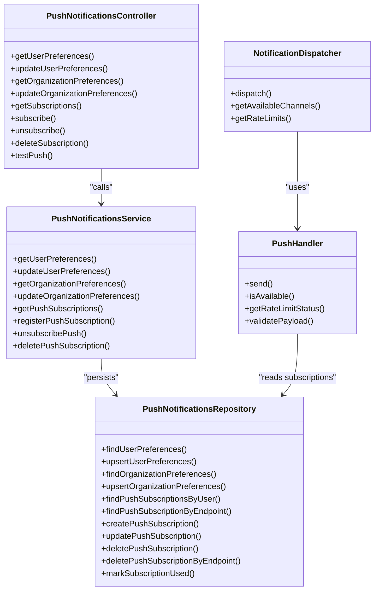
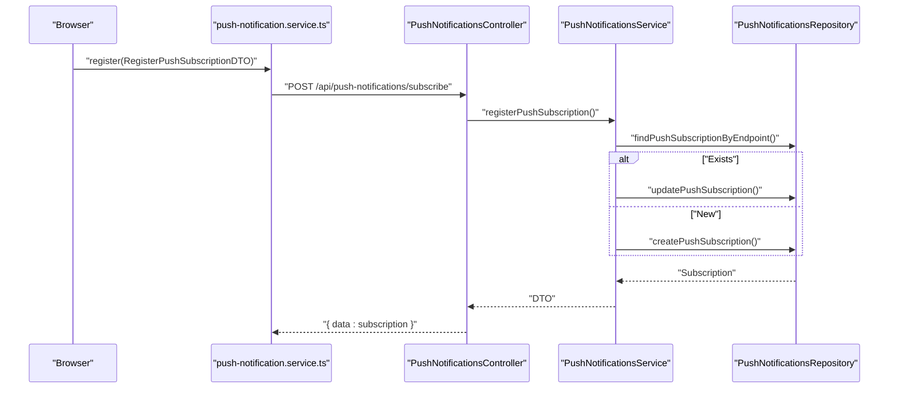
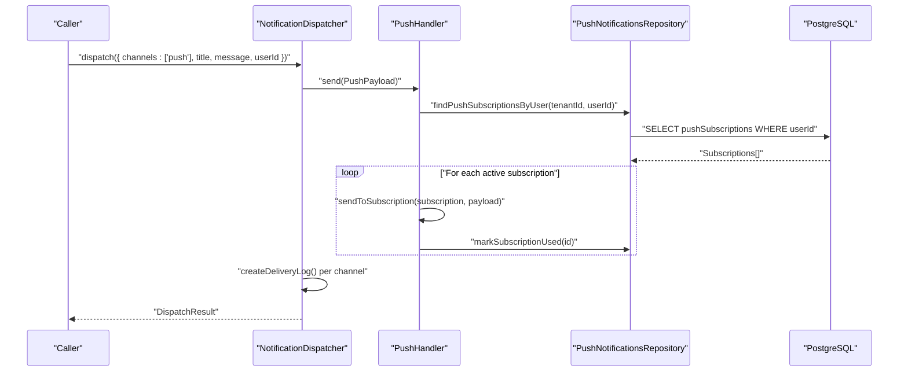
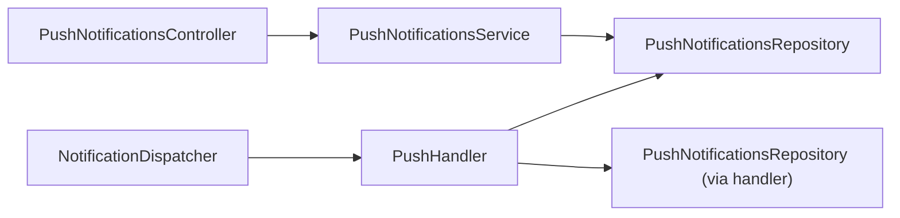

# Push Notifications

<cite>
**Referenced Files in This Document**
- [push-notifications.controller.ts](file://apps/api/src/modules/push-notifications/push-notifications.controller.ts)
- [push-notifications.service.ts](file://apps/api/src/modules/push-notifications/push-notifications.service.ts)
- [push-notifications.repository.ts](file://apps/api/src/modules/push-notifications/push-notifications.repository.ts)
- [push-handler.ts](file://apps/api/src/modules/notification-system/channels/push-handler.ts)
- [notification.dispatcher.ts](file://apps/api/src/modules/notification-system/notification.dispatcher.ts)
- [notification.types.ts](file://apps/api/src/modules/notification-system/notification.types.ts)
- [notification.schema.ts](file://apps/api/src/schemas/notification.schema.ts)
- [.env.example](file://apps/api/.env.example)
- [push-notification.service.ts](file://packages/client-sdk/src/services/push-notification.service.ts)
</cite>

## Table of Contents
1. [Introduction](#introduction)
2. [Project Structure](#project-structure)
3. [Core Components](#core-components)
4. [Architecture Overview](#architecture-overview)
5. [Detailed Component Analysis](#detailed-component-analysis)
6. [Dependency Analysis](#dependency-analysis)
7. [Performance Considerations](#performance-considerations)
8. [Troubleshooting Guide](#troubleshooting-guide)
9. [Conclusion](#conclusion)
10. [Appendices](#appendices)

## Introduction
This document describes the push notification system in the monorepo. It covers the architecture, device registration and subscription lifecycle, delivery mechanisms, controller and service layer responsibilities, repository patterns for storing device tokens, payload formatting, provider configuration (Web Push with VAPID), error handling, and retry strategies. It also includes examples of creating push notifications, device registration workflows, and delivery tracking.

## Project Structure
The push notification system spans backend modules and the client SDK:
- Backend API exposes REST endpoints for push preferences and subscriptions.
- A notification dispatcher routes notifications to channels, including push.
- A dedicated push channel handler integrates with Web Push using VAPID.
- Repositories persist user preferences, organization preferences, and push subscriptions.
- The client SDK provides a service to register browser push subscriptions and test notifications.

**Diagram sources**
- [push-notifications.controller.ts](file://apps/api/src/modules/push-notifications/push-notifications.controller.ts#L37-L299)
- [push-notifications.service.ts](file://apps/api/src/modules/push-notifications/push-notifications.service.ts#L113-L355)
- [push-notifications.repository.ts](file://apps/api/src/modules/push-notifications/push-notifications.repository.ts#L32-L241)
- [notification.dispatcher.ts](file://apps/api/src/modules/notification-system/notification.dispatcher.ts#L40-L269)
- [push-handler.ts](file://apps/api/src/modules/notification-system/channels/push-handler.ts#L9-L163)
- [notification.schema.ts](file://apps/api/src/schemas/notification.schema.ts#L56-L90)

**Section sources**
- [push-notifications.controller.ts](file://apps/api/src/modules/push-notifications/push-notifications.controller.ts#L1-L299)
- [push-notifications.service.ts](file://apps/api/src/modules/push-notifications/push-notifications.service.ts#L1-L355)
- [push-notifications.repository.ts](file://apps/api/src/modules/push-notifications/push-notifications.repository.ts#L1-L241)
- [notification.dispatcher.ts](file://apps/api/src/modules/notification-system/notification.dispatcher.ts#L1-L269)
- [push-handler.ts](file://apps/api/src/modules/notification-system/channels/push-handler.ts#L1-L163)
- [notification.types.ts](file://apps/api/src/modules/notification-system/notification.types.ts#L1-L274)
- [notification.schema.ts](file://apps/api/src/schemas/notification.schema.ts#L1-L116)
- [.env.example](file://apps/api/.env.example#L1-L38)
- [push-notification.service.ts](file://packages/client-sdk/src/services/push-notification.service.ts#L29-L203)

## Core Components
- PushNotificationsController: Exposes REST endpoints for preferences, subscriptions, and testing.
- PushNotificationsService: Implements business logic for preferences and subscriptions, merges notification matrices, and maps DTOs.
- PushNotificationsRepository: Drizzle ORM-backed persistence for preferences and subscriptions.
- PushHandler: Channel handler for Web Push using VAPID keys; sends to all user subscriptions.
- NotificationDispatcher: Orchestrates multi-channel notifications and records delivery logs.
- Client SDK push-notification.service: Registers browser subscriptions, fetches preferences, deletes subscriptions, and triggers test pushes.

**Section sources**
- [push-notifications.controller.ts](file://apps/api/src/modules/push-notifications/push-notifications.controller.ts#L37-L299)
- [push-notifications.service.ts](file://apps/api/src/modules/push-notifications/push-notifications.service.ts#L113-L355)
- [push-notifications.repository.ts](file://apps/api/src/modules/push-notifications/push-notifications.repository.ts#L32-L241)
- [push-handler.ts](file://apps/api/src/modules/notification-system/channels/push-handler.ts#L9-L163)
- [notification.dispatcher.ts](file://apps/api/src/modules/notification-system/notification.dispatcher.ts#L40-L269)
- [push-notification.service.ts](file://packages/client-sdk/src/services/push-notification.service.ts#L29-L203)

## Architecture Overview
The system supports browser-based push notifications via Web Push with VAPID. The flow:
- Client obtains a push subscription from the browser’s PushManager and registers it via the SDK.
- The API validates and persists the subscription, enabling push preferences automatically.
- When dispatching notifications, the dispatcher selects channels (including push), and the push handler resolves all user subscriptions and sends via Web Push.

**Diagram sources**
- [push-notification.service.ts](file://packages/client-sdk/src/services/push-notification.service.ts#L58-L60)
- [push-notifications.controller.ts](file://apps/api/src/modules/push-notifications/push-notifications.controller.ts#L183-L211)
- [push-notifications.service.ts](file://apps/api/src/modules/push-notifications/push-notifications.service.ts#L236-L273)
- [push-notifications.repository.ts](file://apps/api/src/modules/push-notifications/push-notifications.repository.ts#L184-L201)
- [notification.schema.ts](file://apps/api/src/schemas/notification.schema.ts#L56-L90)

## Detailed Component Analysis

### PushNotificationsController
Responsibilities:
- User preferences CRUD: GET/PUT /api/push-notifications/preferences
- Organization preferences CRUD: GET/PUT /api/push-notifications/organizations/:organizationId/preferences
- Subscription management: GET/POST/DELETE /api/push-notifications/subscriptions and /api/push-notifications/subscribe, /api/push-notifications/unsubscribe, /api/push-notifications/subscriptions/:id
- Test push: POST /api/push-notifications/test

Authorization:
- Organization access checks and admin checks are performed before allowing updates.

Validation:
- Endpoint and keys are required for subscription registration.

**Section sources**
- [push-notifications.controller.ts](file://apps/api/src/modules/push-notifications/push-notifications.controller.ts#L47-L269)

### PushNotificationsService
Responsibilities:
- User preferences: create defaults if missing, merge partial updates, maintain notification matrix.
- Organization preferences: similar upsert with defaults.
- Subscriptions: deduplicate by endpoint, update or create, mark last used, enable push preference on registration.
- DTO mapping helpers for preferences and subscriptions.

Key behaviors:
- Notification matrix merging preserves existing values while applying partial updates.
- On successful subscription registration, push is enabled in user preferences.

**Section sources**
- [push-notifications.service.ts](file://apps/api/src/modules/push-notifications/push-notifications.service.ts#L120-L355)

### PushNotificationsRepository
Responsibilities:
- CRUD for user and organization notification preferences with upsert semantics.
- CRUD for push subscriptions, including finding by user or endpoint, updating, deleting, and marking last used.

Defaults:
- Provides a default notification matrix for new preferences.

**Section sources**
- [push-notifications.repository.ts](file://apps/api/src/modules/push-notifications/push-notifications.repository.ts#L39-L241)

### PushHandler (Web Push Channel)
Responsibilities:
- Validates payload shape and checks VAPID key configuration.
- Retrieves all active subscriptions for a user and sends to each.
- Marks subscription lastUsedAt upon successful send.
- Returns aggregated success/failure results.

Availability and rate limiting:
- Availability depends on VAPID keys presence.
- Rate limit status indicates generous limits for push.

Note on implementation:
- The handler simulates sending; production would use the web-push library with VAPID credentials.

**Section sources**
- [push-handler.ts](file://apps/api/src/modules/notification-system/channels/push-handler.ts#L20-L163)

### NotificationDispatcher
Responsibilities:
- Dispatches notifications across channels (email, SMS, in-app, push).
- Creates a notification record if none exists for in-app.
- Logs delivery attempts per channel with status, provider message IDs, and timestamps.
- Reports overall success if any channel succeeds.

Integration:
- Uses PushHandler via PushNotificationsRepository to resolve subscriptions.

**Section sources**
- [notification.dispatcher.ts](file://apps/api/src/modules/notification-system/notification.dispatcher.ts#L66-L269)

### Payload and Type Definitions
- Notification types, channels, priorities, and delivery statuses are defined.
- Channel-specific payloads include PushPayload with title/body/data/actionUrl.
- Templates support localized content per channel.

**Section sources**
- [notification.types.ts](file://apps/api/src/modules/notification-system/notification.types.ts#L10-L274)

### Client SDK Integration
- Registration: POST /api/push-notifications/subscribe with endpoint and keys.
- Preferences: GET /api/push-notifications/preferences.
- Deletion: DELETE /api/push-notifications/subscriptions/:id.
- Test: POST /api/push-notifications/test.

**Section sources**
- [push-notification.service.ts](file://packages/client-sdk/src/services/push-notification.service.ts#L58-L200)

## Architecture Overview

**Diagram sources**
- [push-notifications.controller.ts](file://apps/api/src/modules/push-notifications/push-notifications.controller.ts#L37-L299)
- [push-notifications.service.ts](file://apps/api/src/modules/push-notifications/push-notifications.service.ts#L113-L355)
- [push-notifications.repository.ts](file://apps/api/src/modules/push-notifications/push-notifications.repository.ts#L32-L241)
- [notification.dispatcher.ts](file://apps/api/src/modules/notification-system/notification.dispatcher.ts#L40-L269)
- [push-handler.ts](file://apps/api/src/modules/notification-system/channels/push-handler.ts#L9-L163)

## Detailed Component Analysis

### Device Registration Workflow
- Client obtains a push subscription from the browser and calls the SDK method to register.
- The SDK posts to the API endpoint with endpoint and keys.
- The controller validates and delegates to the service.
- The service checks for existing endpoint, updates or creates subscription, and ensures push is enabled in preferences.
- The repository persists the subscription and returns a DTO.

**Diagram sources**
- [push-notification.service.ts](file://packages/client-sdk/src/services/push-notification.service.ts#L58-L60)
- [push-notifications.controller.ts](file://apps/api/src/modules/push-notifications/push-notifications.controller.ts#L183-L211)
- [push-notifications.service.ts](file://apps/api/src/modules/push-notifications/push-notifications.service.ts#L236-L273)
- [push-notifications.repository.ts](file://apps/api/src/modules/push-notifications/push-notifications.repository.ts#L184-L201)

**Section sources**
- [push-notification.service.ts](file://packages/client-sdk/src/services/push-notification.service.ts#L58-L60)
- [push-notifications.controller.ts](file://apps/api/src/modules/push-notifications/push-notifications.controller.ts#L183-L211)
- [push-notifications.service.ts](file://apps/api/src/modules/push-notifications/push-notifications.service.ts#L236-L273)
- [push-notifications.repository.ts](file://apps/api/src/modules/push-notifications/push-notifications.repository.ts#L184-L201)

### Delivery Mechanisms and Multi-Channel Dispatch
- The dispatcher accepts channels and payload, then routes to handlers.
- PushHandler retrieves all active subscriptions for the user and sends to each.
- Delivery logs are recorded per channel with status, timestamps, and provider message IDs.

**Diagram sources**
- [notification.dispatcher.ts](file://apps/api/src/modules/notification-system/notification.dispatcher.ts#L66-L119)
- [push-handler.ts](file://apps/api/src/modules/notification-system/channels/push-handler.ts#L38-L99)
- [push-notifications.repository.ts](file://apps/api/src/modules/push-notifications/push-notifications.repository.ts#L174-L182)

**Section sources**
- [notification.dispatcher.ts](file://apps/api/src/modules/notification-system/notification.dispatcher.ts#L66-L119)
- [push-handler.ts](file://apps/api/src/modules/notification-system/channels/push-handler.ts#L38-L99)
- [push-notifications.repository.ts](file://apps/api/src/modules/push-notifications/push-notifications.repository.ts#L174-L182)

### Payload Formatting and Templates
- PushPayload requires title and body; optional icon, badge, data, actionUrl.
- Templates support localized content per channel (email, SMS, push, in-app).
- Notification types enumerate standard categories; priorities define urgency.

**Section sources**
- [notification.types.ts](file://apps/api/src/modules/notification-system/notification.types.ts#L207-L223)
- [notification.types.ts](file://apps/api/src/modules/notification-system/notification.types.ts#L10-L52)

### Provider Configuration and Environment
- VAPID keys are required for push availability. They are loaded from environment variables.
- Email/SMS provider configuration exists in types for future integration.

**Section sources**
- [push-handler.ts](file://apps/api/src/modules/notification-system/channels/push-handler.ts#L16-L18)
- [push-handler.ts](file://apps/api/src/modules/notification-system/channels/push-handler.ts#L136-L138)
- [.env.example](file://apps/api/.env.example#L28-L31)
- [notification.types.ts](file://apps/api/src/modules/notification-system/notification.types.ts#L229-L252)

### Error Handling and Retry Strategies
- PushHandler validates payload and checks VAPID configuration; returns structured errors with codes.
- If no subscriptions are found, returns NO_SUBSCRIPTIONS.
- Aggregates per-subscription results; overall success requires at least one success.
- Delivery logs capture error codes and messages for tracking.
- Retry model for notifications exists in the notification system (deduplication and retry tests present).

**Section sources**
- [push-handler.ts](file://apps/api/src/modules/notification-system/channels/push-handler.ts#L20-L99)
- [notification.dispatcher.ts](file://apps/api/src/modules/notification-system/notification.dispatcher.ts#L96-L119)
- [notification.schema.ts](file://apps/api/src/schemas/notification.schema.ts#L79-L115)

## Dependency Analysis

**Diagram sources**
- [push-notifications.controller.ts](file://apps/api/src/modules/push-notifications/push-notifications.controller.ts#L37-L41)
- [push-notifications.service.ts](file://apps/api/src/modules/push-notifications/push-notifications.service.ts#L114-L115)
- [push-notifications.repository.ts](file://apps/api/src/modules/push-notifications/push-notifications.repository.ts#L32-L33)
- [notification.dispatcher.ts](file://apps/api/src/modules/notification-system/notification.dispatcher.ts#L40-L54)
- [push-handler.ts](file://apps/api/src/modules/notification-system/channels/push-handler.ts#L14-L18)

**Section sources**
- [push-notifications.controller.ts](file://apps/api/src/modules/push-notifications/push-notifications.controller.ts#L37-L41)
- [push-notifications.service.ts](file://apps/api/src/modules/push-notifications/push-notifications.service.ts#L114-L115)
- [push-notifications.repository.ts](file://apps/api/src/modules/push-notifications/push-notifications.repository.ts#L32-L33)
- [notification.dispatcher.ts](file://apps/api/src/modules/notification-system/notification.dispatcher.ts#L40-L54)
- [push-handler.ts](file://apps/api/src/modules/notification-system/channels/push-handler.ts#L14-L18)

## Performance Considerations
- PushHandler iterates over all active subscriptions per user; consider batching and backoff for large subscriber lists.
- Repository queries use equality filters; ensure indexes on tenantId, userId, endpoint for optimal lookup.
- Rate limits for push are reported generously; production may enforce stricter limits.

[No sources needed since this section provides general guidance]

## Troubleshooting Guide
Common issues and resolutions:
- VAPID keys not configured: PushHandler returns VAPID_NOT_CONFIGURED. Set VAPID_PUBLIC_KEY and VAPID_PRIVATE_KEY.
- No subscriptions found: PushHandler returns NO_SUBSCRIPTIONS. Ensure the client registered a subscription and the endpoint matches stored records.
- Invalid payload: PushHandler returns INVALID_PAYLOAD. Ensure payload includes userId, title, and body.
- All push attempts failed: PushHandler returns ALL_FAILED. Inspect per-subscription failures and endpoint validity.
- Subscription not found deletion: Controller returns NOT_FOUND when attempting to delete a non-existent subscription.

Operational checks:
- Use POST /api/push-notifications/test to verify endpoint reachability.
- Retrieve preferences via GET /api/push-notifications/preferences to confirm user settings.

**Section sources**
- [push-handler.ts](file://apps/api/src/modules/notification-system/channels/push-handler.ts#L29-L99)
- [push-notifications.controller.ts](file://apps/api/src/modules/push-notifications/push-notifications.controller.ts#L242-L247)
- [push-notifications.controller.ts](file://apps/api/src/modules/push-notifications/push-notifications.controller.ts#L254-L269)

## Conclusion
The push notification system provides a clean separation of concerns: REST endpoints for preferences and subscriptions, a service layer for business logic, repositories for persistence, and a channel handler for Web Push delivery. It supports multi-channel dispatch, robust delivery logging, and extensible templates. The current implementation focuses on browser push with VAPID; future enhancements can integrate APNs and FCM via additional channel handlers and provider configurations.

[No sources needed since this section summarizes without analyzing specific files]

## Appendices

### Example Workflows

- Create a push subscription:
  - Client obtains subscription from PushManager.
  - SDK calls register with endpoint and keys.
  - API stores subscription and enables push in preferences.

- Send a push notification:
  - Dispatcher receives payload and channels.
  - PushHandler resolves user subscriptions and sends to each.
  - Delivery logs are created for tracking.

- Delivery tracking:
  - Review delivery logs per notificationId and channel.
  - Use status, errorCode, and timestamps to diagnose failures.

**Section sources**
- [push-notification.service.ts](file://packages/client-sdk/src/services/push-notification.service.ts#L58-L60)
- [notification.dispatcher.ts](file://apps/api/src/modules/notification-system/notification.dispatcher.ts#L96-L119)
- [push-handler.ts](file://apps/api/src/modules/notification-system/channels/push-handler.ts#L38-L99)
- [notification.schema.ts](file://apps/api/src/schemas/notification.schema.ts#L79-L115)