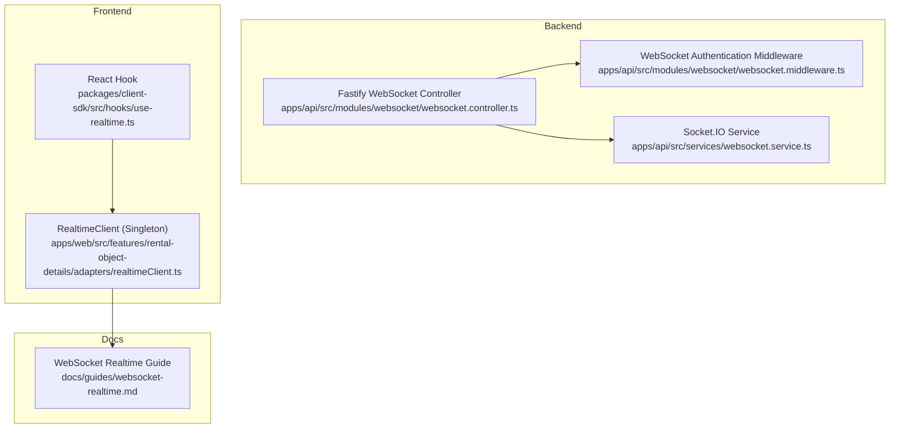
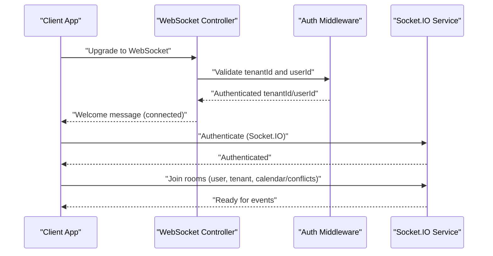
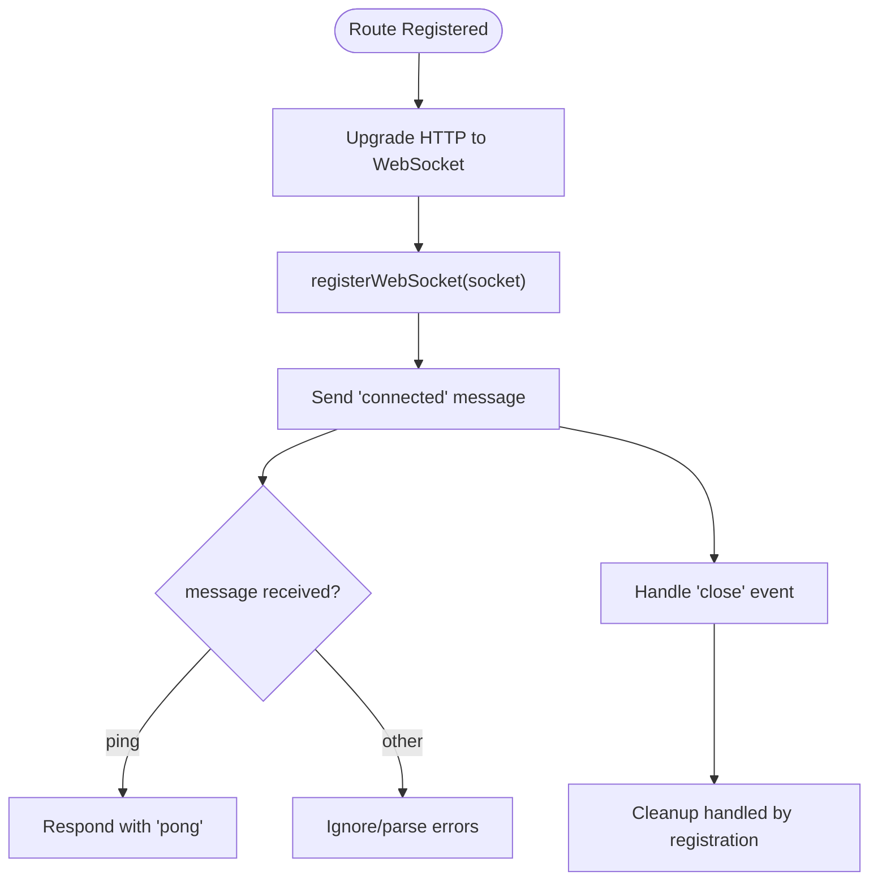
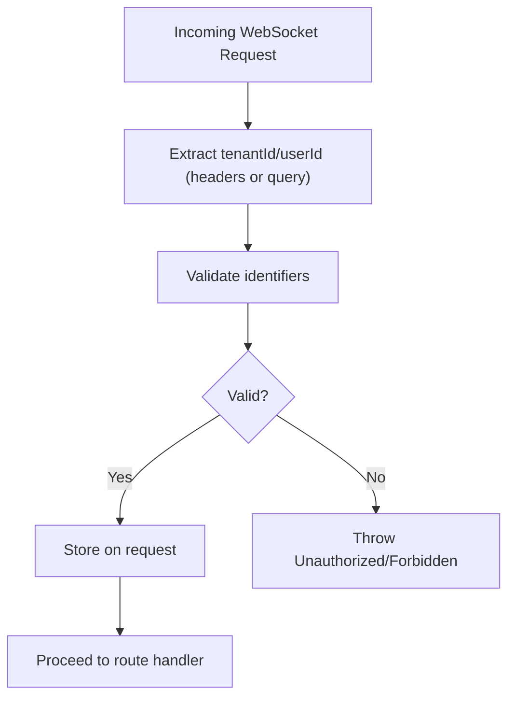
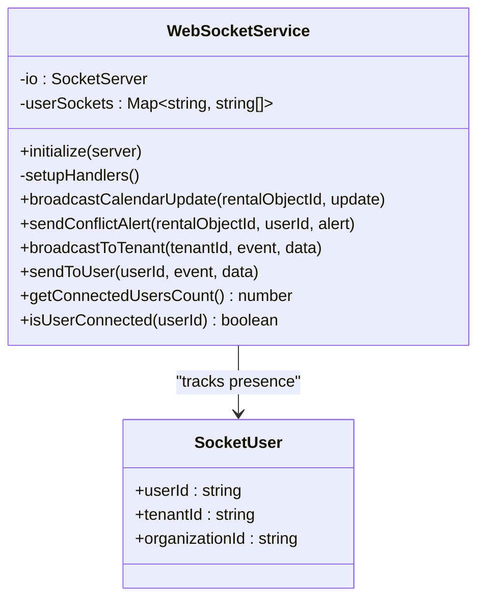
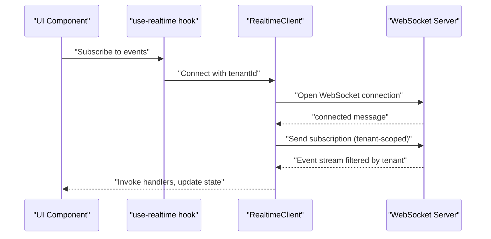
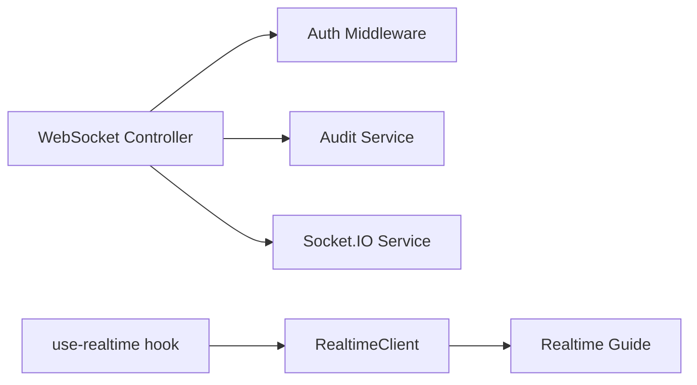

# WebSocket Communication

<cite>
**Referenced Files in This Document**
- [websocket.controller.ts](file://apps/api/src/modules/websocket/websocket.controller.ts)
- [websocket.middleware.ts](file://apps/api/src/modules/websocket/websocket.middleware.ts)
- [websocket.service.ts](file://apps/api/src/services/websocket.service.ts)
- [websocket-realtime.md](file://docs/guides/websocket-realtime.md)
- [use-realtime.ts](file://packages/client-sdk/src/hooks/use-realtime.ts)
- [realtimeClient.ts](file://apps/web/src/features/rental-object-details/adapters/realtimeClient.ts)
- [websocket-auth.test.ts](file://apps/api/tests/security/websocket-auth.test.ts)
- [websocket-latency-performance.test.ts](file://apps/api/tests/integration/websocket-latency-performance.test.ts)
</cite>

## Table of Contents
1. [Introduction](#introduction)
2. [Project Structure](#project-structure)
3. [Core Components](#core-components)
4. [Architecture Overview](#architecture-overview)
5. [Detailed Component Analysis](#detailed-component-analysis)
6. [Dependency Analysis](#dependency-analysis)
7. [Performance Considerations](#performance-considerations)
8. [Troubleshooting Guide](#troubleshooting-guide)
9. [Conclusion](#conclusion)

## Introduction
This document describes the WebSocket communication system used for real-time event streaming across the platform. It covers connection handling, authentication, event broadcasting, room management, and user presence tracking. It also documents the controller implementation for WebSocket endpoints, middleware for connection management, and client-side integration patterns. Security considerations, reconnection behavior, and monitoring approaches are included to guide safe and scalable deployments.

## Project Structure
The WebSocket system spans backend and frontend components:
- Backend Fastify routes and middleware handle WebSocket upgrades and tenant-scoped authentication
- A Socket.IO-based service manages persistent connections, rooms, and event broadcasting
- Frontend client SDK integrates with the backend via a singleton RealtimeClient and React hooks

**Diagram sources**
- [websocket.controller.ts](file://apps/api/src/modules/websocket/websocket.controller.ts#L1-L61)
- [websocket.middleware.ts](file://apps/api/src/modules/websocket/websocket.middleware.ts#L1-L83)
- [websocket.service.ts](file://apps/api/src/services/websocket.service.ts#L1-L188)
- [realtimeClient.ts](file://apps/web/src/features/rental-object-details/adapters/realtimeClient.ts)
- [use-realtime.ts](file://packages/client-sdk/src/hooks/use-realtime.ts)
- [websocket-realtime.md](file://docs/guides/websocket-realtime.md#L1-L120)

**Section sources**
- [websocket.controller.ts](file://apps/api/src/modules/websocket/websocket.controller.ts#L1-L61)
- [websocket.middleware.ts](file://apps/api/src/modules/websocket/websocket.middleware.ts#L1-L83)
- [websocket.service.ts](file://apps/api/src/services/websocket.service.ts#L1-L188)
- [websocket-realtime.md](file://docs/guides/websocket-realtime.md#L1-L120)

## Core Components
- WebSocket Controller: Registers Fastify WebSocket routes for audit and tenant-specific event streams
- Authentication Middleware: Validates tenant and user identifiers for WebSocket upgrades
- Socket.IO Service: Manages connections, rooms, and event broadcasting for calendar, conflicts, and tenant/user targeting
- Realtime Client (Frontend): Singleton client with reconnection logic, event handling, and tenant scoping
- React Hooks: Provide convenient subscription and state management around real-time events

Key responsibilities:
- Connection lifecycle: Upgrade, authentication, welcome messages, ping/pong, graceful disconnect
- Room management: User, tenant, and resource-specific rooms (e.g., calendar/conflicts)
- Event broadcasting: Calendar updates, conflict alerts, tenant-wide and user-specific events
- Presence tracking: User-to-socket mapping for targeted messaging

**Section sources**
- [websocket.controller.ts](file://apps/api/src/modules/websocket/websocket.controller.ts#L10-L61)
- [websocket.middleware.ts](file://apps/api/src/modules/websocket/websocket.middleware.ts#L17-L53)
- [websocket.service.ts](file://apps/api/src/services/websocket.service.ts#L36-L177)
- [websocket-realtime.md](file://docs/guides/websocket-realtime.md#L102-L287)

## Architecture Overview
The system uses two complementary transport layers:
- Fastify WebSocket for lightweight, tenant-scoped event streams (audit and tenant events)
- Socket.IO for richer room-based messaging with authentication, room joins, and targeted broadcasting

**Diagram sources**
- [websocket.controller.ts](file://apps/api/src/modules/websocket/websocket.controller.ts#L14-L41)
- [websocket.middleware.ts](file://apps/api/src/modules/websocket/websocket.middleware.ts#L17-L53)
- [websocket.service.ts](file://apps/api/src/services/websocket.service.ts#L62-L81)

## Detailed Component Analysis

### WebSocket Controller
The controller registers Fastify WebSocket routes and delegates connection registration to the audit service. It supports:
- Audit event stream endpoint
- Tenant-scoped event endpoint with dynamic tenant parameter
- Basic message handling (ping/pong) and connection lifecycle events

**Diagram sources**
- [websocket.controller.ts](file://apps/api/src/modules/websocket/websocket.controller.ts#L14-L41)

**Section sources**
- [websocket.controller.ts](file://apps/api/src/modules/websocket/websocket.controller.ts#L10-L61)

### Authentication Middleware
The middleware enforces tenant and user identification for WebSocket upgrades:
- Accepts credentials via headers or query parameters
- Validates identifiers and stores them on the request object
- Throws appropriate errors for missing or invalid credentials

**Diagram sources**
- [websocket.middleware.ts](file://apps/api/src/modules/websocket/websocket.middleware.ts#L17-L53)

**Section sources**
- [websocket.middleware.ts](file://apps/api/src/modules/websocket/websocket.middleware.ts#L17-L83)

### Socket.IO Service
The Socket.IO service provides:
- Initialization with CORS and path configuration
- Connection lifecycle handling and authentication handshake
- Room management for user, tenant, and resource scopes
- Broadcasting utilities for calendar updates, conflict alerts, tenant-wide, and user-specific events
- Presence tracking via user-to-socket mapping

**Diagram sources**
- [websocket.service.ts](file://apps/api/src/services/websocket.service.ts#L36-L177)

**Section sources**
- [websocket.service.ts](file://apps/api/src/services/websocket.service.ts#L36-L188)

### Client-Side Realtime Integration
The frontend RealtimeClient (singleton) manages:
- Connection lifecycle with reconnection logic
- Multi-tenant scoping and event subscription
- Event parsing, handler invocation, and error handling
- React integration via hooks for seamless subscription and UI updates

**Diagram sources**
- [realtimeClient.ts](file://apps/web/src/features/rental-object-details/adapters/realtimeClient.ts)
- [use-realtime.ts](file://packages/client-sdk/src/hooks/use-realtime.ts)
- [websocket-realtime.md](file://docs/guides/websocket-realtime.md#L102-L287)

**Section sources**
- [websocket-realtime.md](file://docs/guides/websocket-realtime.md#L102-L287)
- [use-realtime.ts](file://packages/client-sdk/src/hooks/use-realtime.ts)

## Dependency Analysis
The WebSocket system exhibits clear separation of concerns:
- Controller depends on middleware for authentication and on the audit service for connection registration
- Socket.IO service encapsulates transport and room management
- Frontend client integrates with backend via documented event types and reconnection behavior

**Diagram sources**
- [websocket.controller.ts](file://apps/api/src/modules/websocket/websocket.controller.ts#L10-L61)
- [websocket.middleware.ts](file://apps/api/src/modules/websocket/websocket.middleware.ts#L17-L53)
- [websocket.service.ts](file://apps/api/src/services/websocket.service.ts#L36-L177)
- [realtimeClient.ts](file://apps/web/src/features/rental-object-details/adapters/realtimeClient.ts)
- [use-realtime.ts](file://packages/client-sdk/src/hooks/use-realtime.ts)
- [websocket-realtime.md](file://docs/guides/websocket-realtime.md#L1-L120)

**Section sources**
- [websocket.controller.ts](file://apps/api/src/modules/websocket/websocket.controller.ts#L10-L61)
- [websocket.middleware.ts](file://apps/api/src/modules/websocket/websocket.middleware.ts#L17-L53)
- [websocket.service.ts](file://apps/api/src/services/websocket.service.ts#L36-L177)
- [websocket-realtime.md](file://docs/guides/websocket-realtime.md#L1-L120)

## Performance Considerations
- Connection limits: The Socket.IO service maintains a user-to-socket mapping; consider scaling horizontally and sharding by tenant
- Room management: Efficiently join/leave rooms to minimize broadcast fan-out
- Reconnection: Frontend uses fixed-interval reconnection; monitor and tune intervals based on environment
- Latency testing: Dedicated performance tests validate latency under load
- Monitoring: Track connection counts, event rates, and error rates; instrument both backend and frontend

[No sources needed since this section provides general guidance]

## Troubleshooting Guide
Common issues and resolutions:
- Authentication failures: Ensure tenantId and userId are present and valid; verify middleware acceptance of headers or query parameters
- Connection loss: Confirm reconnection behavior and intervals; check server availability and network conditions
- Room subscription problems: Verify room names and join/leave sequences; ensure tenant scoping is applied
- Security: Validate access controls and tenant isolation; review test coverage for authentication and authorization

**Section sources**
- [websocket.middleware.ts](file://apps/api/src/modules/websocket/websocket.middleware.ts#L17-L83)
- [websocket-latency-performance.test.ts](file://apps/api/tests/integration/websocket-latency-performance.test.ts)
- [websocket-auth.test.ts](file://apps/api/tests/security/websocket-auth.test.ts)

## Conclusion
The WebSocket system combines Fastify WebSocket for lightweight tenant-scoped streams and Socket.IO for robust room-based messaging. With strong authentication, multi-tenant isolation, and resilient reconnection, it enables scalable real-time experiences. Proper monitoring, room management, and adherence to security practices are essential for reliable operation.