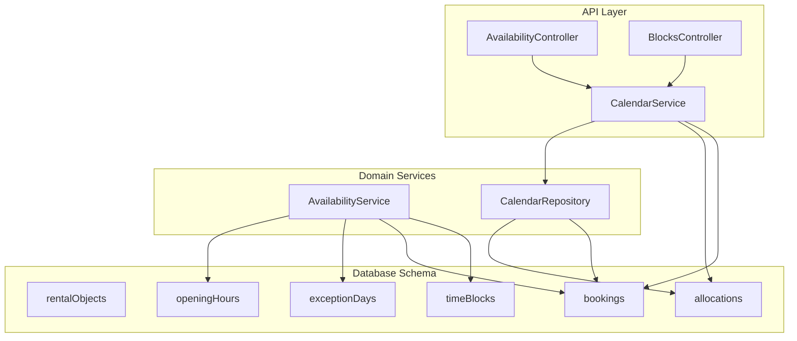
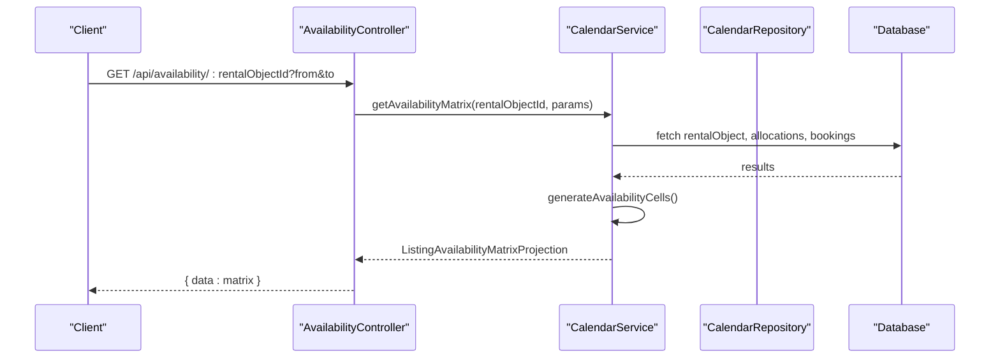
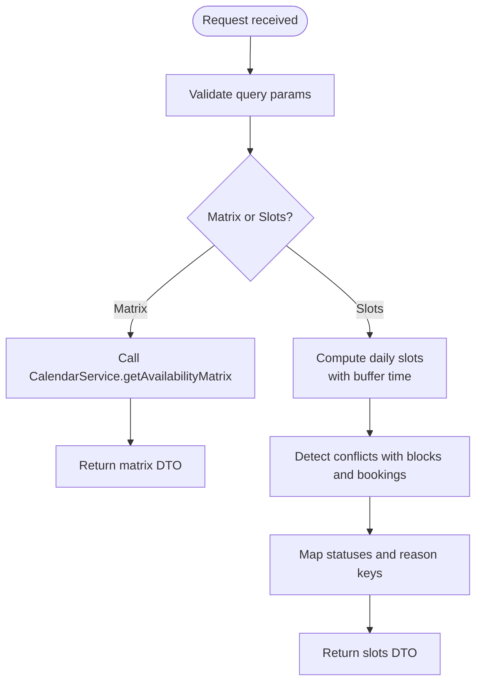
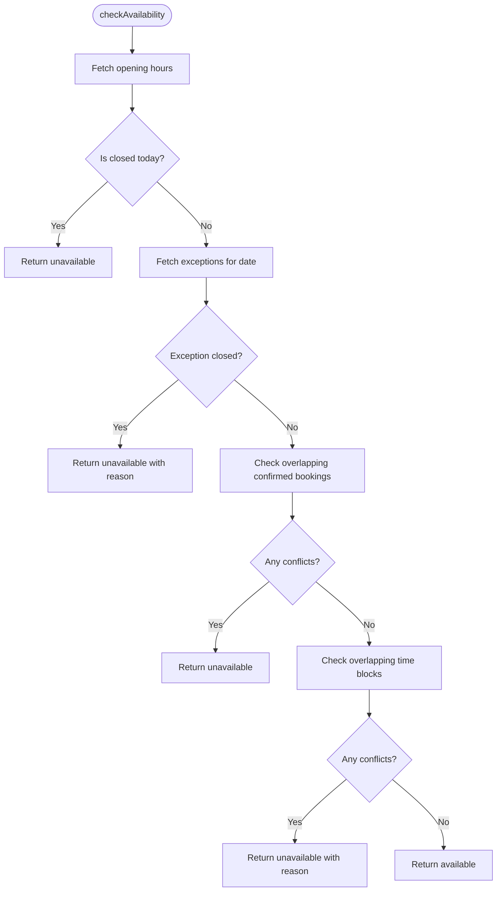
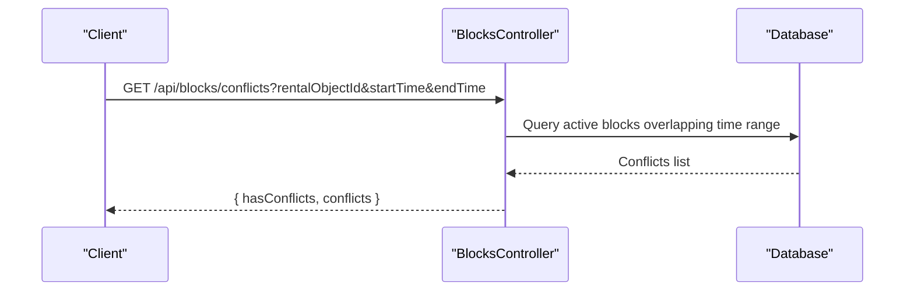
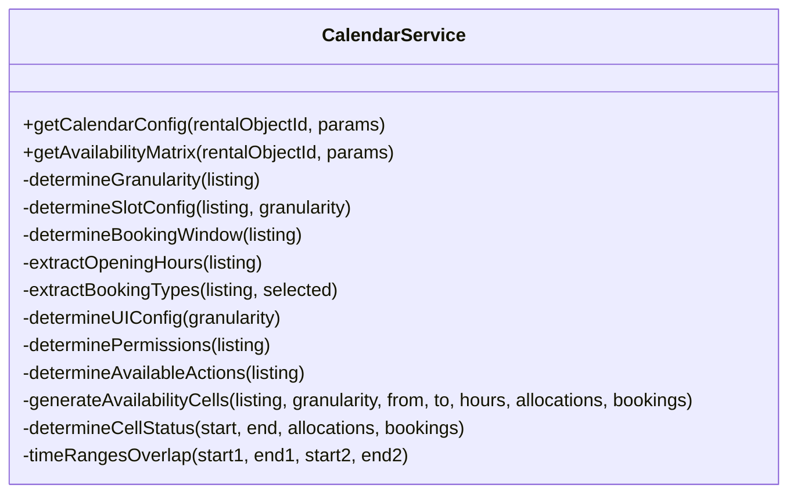
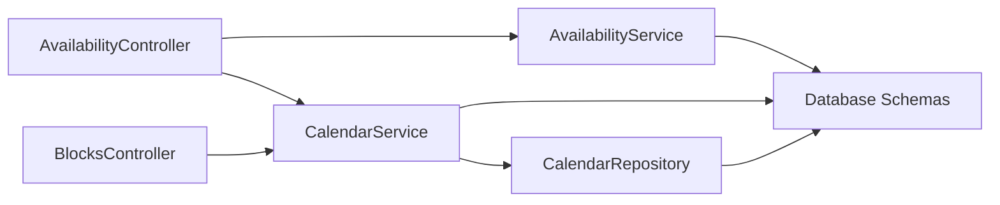

# Availability System

<cite>
**Referenced Files in This Document**
- [availability.controller.ts](file://apps/api/src/modules/availability/availability.controller.ts)
- [availability.service.ts](file://apps/api/src/modules/availability/availability.service.ts)
- [blocks.controller.ts](file://apps/api/src/modules/blocks/blocks.controller.ts)
- [calendar.service.ts](file://apps/api/src/modules/calendar/calendar.service.ts)
- [calendar.repository.ts](file://apps/api/src/modules/calendar/calendar.repository.ts)
- [calendar.schema.ts](file://apps/api/src/schemas/calendar.schema.ts)
- [index.ts](file://apps/api/src/database/schema/index.ts)
</cite>

## Table of Contents
1. [Introduction](#introduction)
2. [Project Structure](#project-structure)
3. [Core Components](#core-components)
4. [Architecture Overview](#architecture-overview)
5. [Detailed Component Analysis](#detailed-component-analysis)
6. [Dependency Analysis](#dependency-analysis)
7. [Performance Considerations](#performance-considerations)
8. [Troubleshooting Guide](#troubleshooting-guide)
9. [Conclusion](#conclusion)

## Introduction
This document describes the availability system responsible for property availability, blocking mechanisms, and capacity control. It covers:
- Availability calculation algorithms and conflict detection
- Real-time updates and calendar integration
- Blocking system for maintenance, holidays, and special events
- Seat limits and capacity management for shared spaces
- Availability queries with date-range filtering and resource-specific checks
- Integration with booking workflows, real-time notifications, and historical tracking

## Project Structure
The availability system spans three primary modules:
- Availability module: exposes endpoints for availability matrices and time-slot checks
- Calendar module: generates calendar configurations and availability matrices
- Blocks module: manages administrative blocks and conflict detection

**Diagram sources**
- [availability.controller.ts](file://apps/api/src/modules/availability/availability.controller.ts#L132-L320)
- [blocks.controller.ts](file://apps/api/src/modules/blocks/blocks.controller.ts#L110-L563)
- [calendar.service.ts](file://apps/api/src/modules/calendar/calendar.service.ts#L74-L668)
- [calendar.repository.ts](file://apps/api/src/modules/calendar/calendar.repository.ts#L63-L277)
- [index.ts](file://apps/api/src/database/schema/index.ts#L36-L148)

**Section sources**
- [availability.controller.ts](file://apps/api/src/modules/availability/availability.controller.ts#L1-L320)
- [availability.service.ts](file://apps/api/src/modules/availability/availability.service.ts#L1-L457)
- [blocks.controller.ts](file://apps/api/src/modules/blocks/blocks.controller.ts#L1-L563)
- [calendar.service.ts](file://apps/api/src/modules/calendar/calendar.service.ts#L1-L668)
- [calendar.repository.ts](file://apps/api/src/modules/calendar/calendar.repository.ts#L1-L277)
- [calendar.schema.ts](file://apps/api/src/schemas/calendar.schema.ts#L1-L300)
- [index.ts](file://apps/api/src/database/schema/index.ts#L1-L170)

## Core Components
- AvailabilityController: Exposes endpoints for availability matrices and legacy slot queries. Delegates matrix generation to CalendarService and legacy slot computation to direct database queries.
- AvailabilityService: Implements business logic for opening hours, exception days, monthly availability calendars, and slot availability checks. Provides conflict detection against bookings and time blocks.
- BlocksController: Manages administrative blocks (maintenance, holidays, blackout periods) with CRUD operations and conflict checks.
- CalendarService: Generates calendar configuration and availability matrices based on listing metadata, opening hours, and allocations/bookings.
- CalendarRepository: Data access layer for allocations and availability queries.
- Calendar Schemas: Strongly typed validation and projection schemas for calendar configuration and availability matrices.

**Section sources**
- [availability.controller.ts](file://apps/api/src/modules/availability/availability.controller.ts#L132-L320)
- [availability.service.ts](file://apps/api/src/modules/availability/availability.service.ts#L32-L457)
- [blocks.controller.ts](file://apps/api/src/modules/blocks/blocks.controller.ts#L110-L563)
- [calendar.service.ts](file://apps/api/src/modules/calendar/calendar.service.ts#L74-L668)
- [calendar.repository.ts](file://apps/api/src/modules/calendar/calendar.repository.ts#L63-L277)
- [calendar.schema.ts](file://apps/api/src/schemas/calendar.schema.ts#L1-L300)

## Architecture Overview
The system integrates controllers, services, repositories, and database schemas to deliver:
- Calendar configuration per listing with granularity, slot sizes, and booking windows
- Availability matrices with status legends and localized reason keys
- Conflict detection across bookings and blocks
- Administrative scoping for org_member and saksbehandler roles

**Diagram sources**
- [availability.controller.ts](file://apps/api/src/modules/availability/availability.controller.ts#L149-L160)
- [calendar.service.ts](file://apps/api/src/modules/calendar/calendar.service.ts#L195-L288)
- [calendar.repository.ts](file://apps/api/src/modules/calendar/calendar.repository.ts#L217-L262)

## Detailed Component Analysis

### AvailabilityController
Responsibilities:
- Matrix endpoint: Validates date range, delegates to CalendarService, and returns ListingAvailabilityMatrixProjection.
- Legacy slot endpoint: Computes time slots for a given date, considering buffer times and operational hours, and determines slot statuses (AVAILABLE, BOOKED, RESERVED, BLOCKED, BLACKOUT, CLOSED).

Key behaviors:
- Maps allocation and booking statuses to slot statuses.
- Applies buffer time around bookings when evaluating slot availability.
- Returns reason keys for localization and optional conflict IDs.

**Diagram sources**
- [availability.controller.ts](file://apps/api/src/modules/availability/availability.controller.ts#L149-L318)

**Section sources**
- [availability.controller.ts](file://apps/api/src/modules/availability/availability.controller.ts#L132-L320)

### AvailabilityService
Responsibilities:
- Opening hours: Bulk set/get weekly opening hours with audit logging.
- Exception days: Add/remove exception days (holidays, closures) with optional override times.
- Monthly availability calendar: Aggregates opening hours, exceptions, bookings, and blocks to produce day-level availability.
- Slot availability check: Validates against opening hours, exceptions, confirmed bookings, and time blocks.

Conflict detection logic:
- Conflicting bookings: Overlap check across confirmed bookings.
- Conflicting blocks: Overlap check across time blocks.

**Diagram sources**
- [availability.service.ts](file://apps/api/src/modules/availability/availability.service.ts#L277-L344)

**Section sources**
- [availability.service.ts](file://apps/api/src/modules/availability/availability.service.ts#L32-L457)

### BlocksController
Responsibilities:
- CRUD operations for administrative blocks with tenant scoping.
- Conflict detection endpoint to prevent overlapping blocks.
- Scope enforcement for org_member and saksbehandler via case_handler_scopes and access_grants.

Key validations:
- Required fields, date range validity, rental object ownership, and role-based scope checks.

**Diagram sources**
- [blocks.controller.ts](file://apps/api/src/modules/blocks/blocks.controller.ts#L508-L559)

**Section sources**
- [blocks.controller.ts](file://apps/api/src/modules/blocks/blocks.controller.ts#L110-L563)

### CalendarService
Responsibilities:
- Calendar configuration: Determines granularity, slot sizes, booking windows, opening hours, booking types, UI hints, permissions, and available actions.
- Availability matrix: Generates cells across a date range, applying opening hours, exceptions, allocations, and bookings.
- Scope enforcement: Validates user access for org_member and saksbehandler via case_handler_scopes.

**Diagram sources**
- [calendar.service.ts](file://apps/api/src/modules/calendar/calendar.service.ts#L74-L668)

**Section sources**
- [calendar.service.ts](file://apps/api/src/modules/calendar/calendar.service.ts#L74-L668)

### CalendarRepository
Responsibilities:
- Event retrieval with filtering by rental object, date range, and status.
- Allocation creation/update/delete.
- Availability aggregation combining allocations and bookings.

**Section sources**
- [calendar.repository.ts](file://apps/api/src/modules/calendar/calendar.repository.ts#L63-L277)

### Calendar Schemas
Responsibilities:
- Define strongly typed validation for calendar configuration and availability matrix projections.
- Enforce formats for opening hours, exceptions, slot status, and query parameters.

**Section sources**
- [calendar.schema.ts](file://apps/api/src/schemas/calendar.schema.ts#L1-L300)

## Dependency Analysis
The availability system relies on:
- Controllers depend on services for business logic.
- Services depend on repositories and database schemas.
- CalendarService orchestrates allocations and bookings to compute availability.
- AvailabilityController delegates matrix generation to CalendarService and performs legacy slot computations directly against bookings and allocations.

**Diagram sources**
- [availability.controller.ts](file://apps/api/src/modules/availability/availability.controller.ts#L132-L320)
- [availability.service.ts](file://apps/api/src/modules/availability/availability.service.ts#L32-L457)
- [blocks.controller.ts](file://apps/api/src/modules/blocks/blocks.controller.ts#L110-L563)
- [calendar.service.ts](file://apps/api/src/modules/calendar/calendar.service.ts#L74-L668)
- [calendar.repository.ts](file://apps/api/src/modules/calendar/calendar.repository.ts#L63-L277)
- [index.ts](file://apps/api/src/database/schema/index.ts#L36-L148)

**Section sources**
- [index.ts](file://apps/api/src/database/schema/index.ts#L1-L170)

## Performance Considerations
- Matrix generation: The CalendarService iterates over the requested date range and generates cells based on granularity. For large ranges, consider pagination or limiting the date span.
- Overlap checks: Both CalendarService and AvailabilityService perform overlap checks against allocations and bookings. Indexes on rentalObjectId, startTime, and endTime improve performance.
- Buffer time: Applying buffer times increases effective overlap windows; tune metadata.bufferBeforeMinutes and bufferAfterMinutes to balance accuracy and performance.
- Scoping: Role-based scope checks in CalendarService and BlocksController add database queries; cache user roles and scopes where appropriate.

## Troubleshooting Guide
Common issues and resolutions:
- Unauthorized access to calendar: Ensure user has active case_handler_scope for the rental object or holds admin/super_admin role.
- Unexpected unavailability: Verify opening hours, exceptions, confirmed bookings, and time blocks for the date/time range.
- Conflicting blocks: Use the conflict detection endpoint to identify overlapping blocks before creating or updating.
- Invalid date range: Ensure from ≤ to and valid YYYY-MM-DD formats for availability matrix queries.

**Section sources**
- [calendar.service.ts](file://apps/api/src/modules/calendar/calendar.service.ts#L84-L141)
- [blocks.controller.ts](file://apps/api/src/modules/blocks/blocks.controller.ts#L508-L559)
- [calendar.schema.ts](file://apps/api/src/schemas/calendar.schema.ts#L268-L277)

## Conclusion
The availability system provides robust calendar integration, conflict detection, and administrative blocking controls. By leveraging strongly typed schemas, modular services, and role-aware scoping, it supports accurate availability queries, real-time updates, and integration with booking workflows. Extending metadata-driven configurations enables flexible capacity management for shared spaces and seat-limited resources.