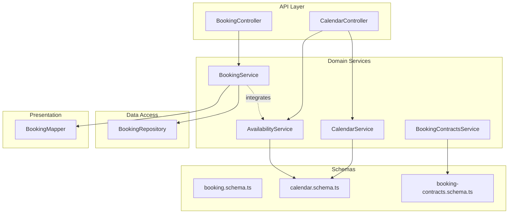
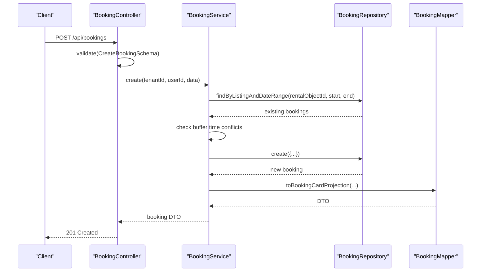
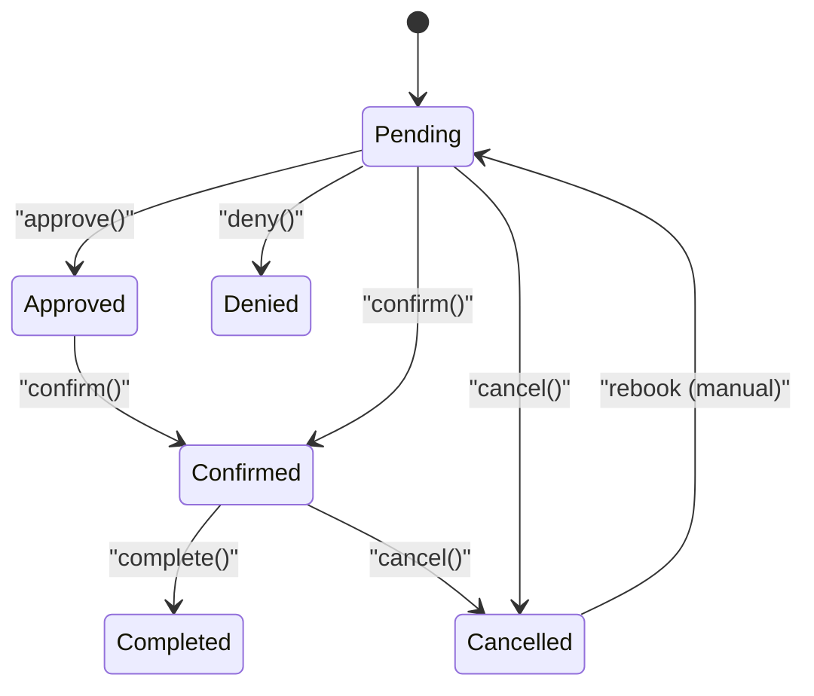
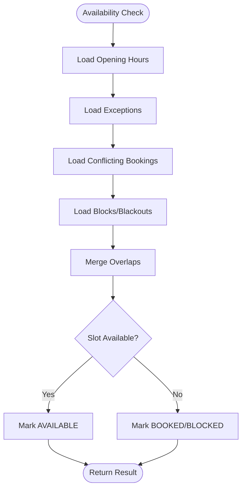
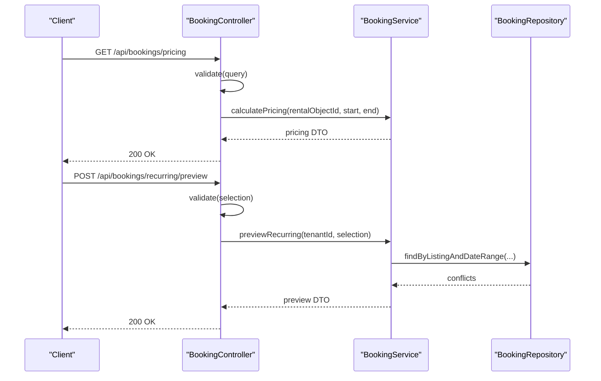
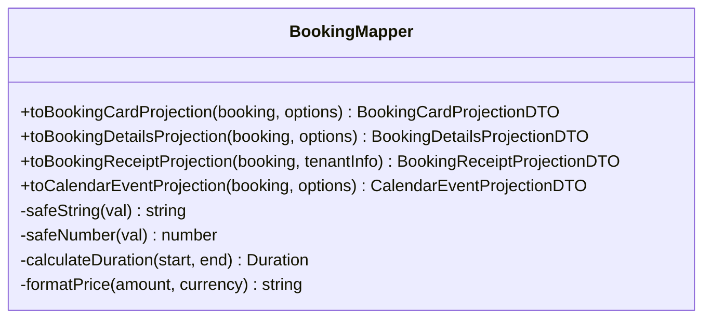
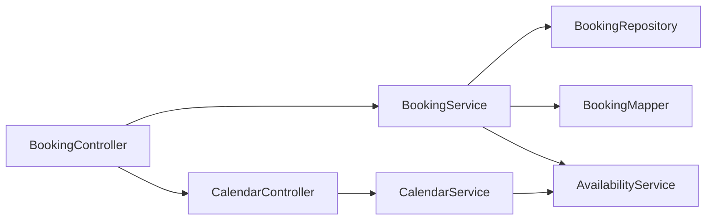

# Booking System

<cite>
**Referenced Files in This Document**
- [booking.service.ts](file://apps/api/src/modules/booking/booking.service.ts)
- [booking.controller.ts](file://apps/api/src/modules/booking/booking.controller.ts)
- [booking.mapper.ts](file://apps/api/src/modules/booking/booking.mapper.ts)
- [booking.repository.ts](file://apps/api/src/modules/booking/booking.repository.ts)
- [booking.schema.ts](file://apps/api/src/schemas/booking.schema.ts)
- [booking-contracts.service.ts](file://apps/api/src/modules/bookings/booking-contracts.service.ts)
- [calendar.service.ts](file://apps/api/src/modules/calendar/calendar.service.ts)
- [availability.service.ts](file://apps/api/src/modules/availability/availability.service.ts)
- [calendar.schema.ts](file://apps/api/src/schemas/calendar.schema.ts)
- [booking-contracts.schema.ts](file://apps/api/src/schemas/booking-contracts.schema.ts)
</cite>

## Table of Contents
1. [Introduction](#introduction)
2. [Project Structure](#project-structure)
3. [Core Components](#core-components)
4. [Architecture Overview](#architecture-overview)
5. [Detailed Component Analysis](#detailed-component-analysis)
6. [Dependency Analysis](#dependency-analysis)
7. [Performance Considerations](#performance-considerations)
8. [Troubleshooting Guide](#troubleshooting-guide)
9. [Conclusion](#conclusion)

## Introduction
This document provides comprehensive documentation for the booking system, covering the complete reservation workflow from initiation to completion. It explains booking states, approval processes, and status transitions; details calendar integration with availability checking and conflict detection; describes the quote generation process and pricing; documents the booking mapper for data transformation and tenant isolation; and outlines error handling for conflicts, capacity limits, and policy violations. It also addresses integration with the availability module and real-time notification system.

## Project Structure
The booking system is organized around a modular architecture with clear separation of concerns:
- Controllers define REST endpoints and enforce RBAC permissions
- Services encapsulate business logic for bookings, quotes, recurring patterns, and approvals
- Repositories manage data access and optimistic locking
- Schemas validate request/response payloads
- Mappers transform database entities into UI-ready projections
- Calendar and availability modules integrate with the booking workflow

**Diagram sources**
- [booking.controller.ts](file://apps/api/src/modules/booking/booking.controller.ts#L21-L418)
- [booking.service.ts](file://apps/api/src/modules/booking/booking.service.ts#L44-L1240)
- [booking.repository.ts](file://apps/api/src/modules/booking/booking.repository.ts#L12-L288)
- [booking.mapper.ts](file://apps/api/src/modules/booking/booking.mapper.ts#L1-L654)
- [calendar.service.ts](file://apps/api/src/modules/calendar/calendar.service.ts#L74-L668)
- [availability.service.ts](file://apps/api/src/modules/availability/availability.service.ts#L32-L457)
- [booking.schema.ts](file://apps/api/src/schemas/booking.schema.ts#L1-L485)
- [calendar.schema.ts](file://apps/api/src/schemas/calendar.schema.ts#L1-L300)
- [booking-contracts.schema.ts](file://apps/api/src/schemas/booking-contracts.schema.ts#L1-L78)

**Section sources**
- [booking.controller.ts](file://apps/api/src/modules/booking/booking.controller.ts#L21-L418)
- [booking.service.ts](file://apps/api/src/modules/booking/booking.service.ts#L44-L1240)
- [booking.repository.ts](file://apps/api/src/modules/booking/booking.repository.ts#L12-L288)
- [booking.mapper.ts](file://apps/api/src/modules/booking/booking.mapper.ts#L1-L654)
- [calendar.service.ts](file://apps/api/src/modules/calendar/calendar.service.ts#L74-L668)
- [availability.service.ts](file://apps/api/src/modules/availability/availability.service.ts#L32-L457)
- [booking.schema.ts](file://apps/api/src/schemas/booking.schema.ts#L1-L485)
- [calendar.schema.ts](file://apps/api/src/schemas/calendar.schema.ts#L1-L300)
- [booking-contracts.schema.ts](file://apps/api/src/schemas/booking-contracts.schema.ts#L1-L78)

## Core Components
- BookingController: Exposes REST endpoints for CRUD, approvals, cancellations, receipts, and recurring previews. Enforces RBAC permissions and tenant/user context.
- BookingService: Implements core booking logic including creation, approval/denial, status transitions, recurring preview and creation, quote generation, and calendar event export.
- BookingRepository: Provides data access with pagination, filters, optimistic locking, and conflict checks.
- BookingMapper: Transforms database entities into UI-ready DTOs for cards, details, receipts, and calendar events.
- CalendarService: Generates calendar configuration and availability matrices, enforces scope for org members and case handlers.
- AvailabilityService: Manages opening hours, exceptions, monthly calendars, and slot availability checks.
- Schemas: Define validation rules for bookings, recurring patterns, quotes, calendar configurations, and contracts.

**Section sources**
- [booking.controller.ts](file://apps/api/src/modules/booking/booking.controller.ts#L21-L418)
- [booking.service.ts](file://apps/api/src/modules/booking/booking.service.ts#L44-L1240)
- [booking.repository.ts](file://apps/api/src/modules/booking/booking.repository.ts#L12-L288)
- [booking.mapper.ts](file://apps/api/src/modules/booking/booking.mapper.ts#L1-L654)
- [calendar.service.ts](file://apps/api/src/modules/calendar/calendar.service.ts#L74-L668)
- [availability.service.ts](file://apps/api/src/modules/availability/availability.service.ts#L32-L457)
- [booking.schema.ts](file://apps/api/src/schemas/booking.schema.ts#L1-L485)
- [calendar.schema.ts](file://apps/api/src/schemas/calendar.schema.ts#L1-L300)
- [booking-contracts.schema.ts](file://apps/api/src/schemas/booking-contracts.schema.ts#L1-L78)

## Architecture Overview
The booking system follows a layered architecture:
- Presentation: Controllers expose endpoints and delegate to services
- Domain: Services encapsulate business rules and orchestrate repositories and mappers
- Persistence: Repositories abstract database operations with optimistic locking
- Integration: Services integrate with calendar and availability modules
- Validation: Zod schemas ensure request/response correctness

**Diagram sources**
- [booking.controller.ts](file://apps/api/src/modules/booking/booking.controller.ts#L73-L80)
- [booking.service.ts](file://apps/api/src/modules/booking/booking.service.ts#L54-L138)
- [booking.repository.ts](file://apps/api/src/modules/booking/booking.repository.ts#L151-L164)
- [booking.mapper.ts](file://apps/api/src/modules/booking/booking.mapper.ts#L429-L481)

**Section sources**
- [booking.controller.ts](file://apps/api/src/modules/booking/booking.controller.ts#L73-L80)
- [booking.service.ts](file://apps/api/src/modules/booking/booking.service.ts#L54-L138)
- [booking.repository.ts](file://apps/api/src/modules/booking/booking.repository.ts#L151-L164)
- [booking.mapper.ts](file://apps/api/src/modules/booking/booking.mapper.ts#L429-L481)

## Detailed Component Analysis

### Booking States, Approval Processes, and Status Transitions
- States: pending, confirmed, cancelled, completed, approved, denied
- Transitions:
  - Creation sets status to pending
  - Approve/Deny require case handler scope and update to approved/denied
  - Confirmed marks successful approval
  - Completed indicates service fulfillment
  - Cancelled allows cancellation with reason
- Scope enforcement:
  - Super admin and admin bypass scope checks
  - Case handlers/org members require active scope for specific rental objects
- Optimistic locking:
  - All updates use version-based concurrency control

**Diagram sources**
- [booking.service.ts](file://apps/api/src/modules/booking/booking.service.ts#L165-L268)
- [booking.service.ts](file://apps/api/src/modules/booking/booking.service.ts#L344-L408)
- [booking.service.ts](file://apps/api/src/modules/booking/booking.repository.ts#L226-L282)

**Section sources**
- [booking.service.ts](file://apps/api/src/modules/booking/booking.service.ts#L165-L268)
- [booking.service.ts](file://apps/api/src/modules/booking/booking.service.ts#L344-L408)
- [booking.repository.ts](file://apps/api/src/modules/booking/booking.repository.ts#L226-L282)

### Calendar Integration, Availability Checking, and Conflict Detection
- Calendar configuration:
  - Determines granularity, slot sizes, booking windows, opening hours, booking types, UI hints, permissions, and actions
  - Enforces scope for org members and case handlers
- Availability matrix:
  - Builds cells for TIME_SLOTS, MULTI_DAY, ALL_DAY granularities
  - Checks allocations (blocked/blackout) and bookings (reserved/confirmed)
  - Applies opening hours and exceptions
- Conflict detection:
  - Booking creation checks buffer time around existing bookings
  - Recurring preview checks occurrences against existing bookings
  - Availability service checks slot conflicts across bookings and blocks

**Diagram sources**
- [calendar.service.ts](file://apps/api/src/modules/calendar/calendar.service.ts#L195-L288)
- [calendar.service.ts](file://apps/api/src/modules/calendar/calendar.service.ts#L488-L646)
- [availability.service.ts](file://apps/api/src/modules/availability/availability.service.ts#L277-L344)

**Section sources**
- [calendar.service.ts](file://apps/api/src/modules/calendar/calendar.service.ts#L74-L668)
- [availability.service.ts](file://apps/api/src/modules/availability/availability.service.ts#L32-L457)
- [booking.service.ts](file://apps/api/src/modules/booking/booking.service.ts#L74-L92)

### Quote Generation, Pricing, and Contract-First Approach
- Quote generation:
  - Uses rental object configuration for pricing units (hour, half_day, day, fixed)
  - Calculates duration and applies rental object constraints (min/max duration, advance booking, buffer time)
  - Determines slot status and available actions (BOOK, REQUEST, WAITLIST, MODIFY)
- Contract-first endpoints:
  - Price preview and recurring preview endpoints return structured DTOs
  - Recurring preview includes occurrence statuses, alternatives, and summary statistics
- Receipt generation:
  - Endpoint returns receipt projection with customer, service, location, timing, and payment details

**Diagram sources**
- [booking.controller.ts](file://apps/api/src/modules/booking/booking.controller.ts#L197-L206)
- [booking.controller.ts](file://apps/api/src/modules/booking/booking.controller.ts#L254-L273)
- [booking.service.ts](file://apps/api/src/modules/booking/booking.service.ts#L502-L518)
- [booking.service.ts](file://apps/api/src/modules/booking/booking.service.ts#L780-L824)
- [booking.repository.ts](file://apps/api/src/modules/booking/booking.repository.ts#L151-L164)

**Section sources**
- [booking.service.ts](file://apps/api/src/modules/booking/booking.service.ts#L502-L518)
- [booking.service.ts](file://apps/api/src/modules/booking/booking.service.ts#L780-L824)
- [booking.controller.ts](file://apps/api/src/modules/booking/booking.controller.ts#L197-L206)
- [booking.controller.ts](file://apps/api/src/modules/booking/booking.controller.ts#L254-L273)
- [booking-contracts.service.ts](file://apps/api/src/modules/bookings/booking-contracts.service.ts#L47-L108)
- [booking-contracts.service.ts](file://apps/api/src/modules/bookings/booking-contracts.service.ts#L114-L186)

### Booking Mapper and Data Transformation
- Anti-corruption layer for transforming raw database entities into UI-ready DTOs
- Projections:
  - Card: list view with status, timing, pricing, flags, actions, permissions
  - Details: extended with timeline, documents, recurring info
  - Receipt: financial receipt with customer, service, location, timing, payment
  - Calendar event: calendar display with color-coded status
- Helpers:
  - Safe parsing of numbers/strings
  - Duration calculations and price formatting
  - Status labels/colors and weekday formatting
  - Action and permission derivation based on flags and user role

**Diagram sources**
- [booking.mapper.ts](file://apps/api/src/modules/booking/booking.mapper.ts#L429-L654)

**Section sources**
- [booking.mapper.ts](file://apps/api/src/modules/booking/booking.mapper.ts#L1-L654)

### Tenant Isolation and Multi-Property Coordination
- Tenant scoping:
  - Controllers and services consistently use tenantId from request context
  - Repository filters ensure tenant isolation
- Organization-scoped access:
  - Query param orgId enables org-scoped filtering via rental object joins
  - Calendar scope enforcement validates case handler scopes for org members
- Multi-property coordination:
  - Recurring series metadata includes seriesId for grouping
  - Calendar exports aggregate tenant-level events

**Section sources**
- [booking.controller.ts](file://apps/api/src/modules/booking/booking.controller.ts#L44-L58)
- [booking.repository.ts](file://apps/api/src/modules/booking/booking.repository.ts#L28-L65)
- [calendar.service.ts](file://apps/api/src/modules/calendar/calendar.service.ts#L84-L141)

### Real-Time Notifications and Broadcasting
- Real-time events:
  - Booking creation, confirmation, cancellation, completion, approval, denial trigger broadcast events
  - Calendar events are exported for calendar views
- Audit logging:
  - All state changes logged with tenant, user, and metadata context

**Section sources**
- [booking.service.ts](file://apps/api/src/modules/booking/booking.service.ts#L125-L136)
- [booking.service.ts](file://apps/api/src/modules/booking/booking.service.ts#L180-L191)
- [booking.service.ts](file://apps/api/src/modules/booking/booking.service.ts#L221-L232)
- [booking.service.ts](file://apps/api/src/modules/booking/booking.service.ts#L255-L266)
- [booking.service.ts](file://apps/api/src/modules/booking/booking.service.ts#L394-L406)
- [booking.service.ts](file://apps/api/src/modules/booking/booking.service.ts#L1172-L1183)

## Dependency Analysis
The booking system exhibits low coupling and high cohesion:
- Controllers depend on Services
- Services depend on Repositories and Mappers
- Schemas validate inputs/outputs
- Calendar and Availability services integrate with Booking logic

**Diagram sources**
- [booking.controller.ts](file://apps/api/src/modules/booking/booking.controller.ts#L21-L418)
- [booking.service.ts](file://apps/api/src/modules/booking/booking.service.ts#L44-L1240)
- [booking.repository.ts](file://apps/api/src/modules/booking/booking.repository.ts#L12-L288)
- [booking.mapper.ts](file://apps/api/src/modules/booking/booking.mapper.ts#L1-L654)
- [calendar.service.ts](file://apps/api/src/modules/calendar/calendar.service.ts#L74-L668)
- [availability.service.ts](file://apps/api/src/modules/availability/availability.service.ts#L32-L457)

**Section sources**
- [booking.controller.ts](file://apps/api/src/modules/booking/booking.controller.ts#L21-L418)
- [booking.service.ts](file://apps/api/src/modules/booking/booking.service.ts#L44-L1240)
- [booking.repository.ts](file://apps/api/src/modules/booking/booking.repository.ts#L12-L288)
- [booking.mapper.ts](file://apps/api/src/modules/booking/booking.mapper.ts#L1-L654)
- [calendar.service.ts](file://apps/api/src/modules/calendar/calendar.service.ts#L74-L668)
- [availability.service.ts](file://apps/api/src/modules/availability/availability.service.ts#L32-L457)

## Performance Considerations
- Pagination and filtering:
  - Repository supports pagination and org-scoped filters to reduce payload sizes
- Optimistic locking:
  - Version-based updates prevent lost updates and reduce contention
- Conflict checks:
  - Buffer time and occurrence conflict checks are O(n) per query; consider indexing on rentalObjectId, startTime, endTime, and status
- Calendar generation:
  - Matrix generation iterates per day/time slot; batch queries minimize round trips
- Quote generation:
  - Uses rental object metadata; cache frequently accessed configs if needed

[No sources needed since this section provides general guidance]

## Troubleshooting Guide
Common issues and resolutions:
- Conflicts during booking creation:
  - Verify buffer time configuration and existing bookings in the time slot
  - Use recurring preview to identify conflicts before creation
- Capacity limits and policy violations:
  - Review rental object constraints (min/max duration, advance booking, cancellation deadline)
  - Check opening hours and exceptions affecting availability
- Scope errors for approvals:
  - Ensure case handler has active scope for the rental object
  - Admin roles bypass scope checks
- Optimistic locking failures:
  - Refresh entity and retry with latest version
- Receipt generation:
  - Ensure booking exists and includes user/rental object details

**Section sources**
- [booking.service.ts](file://apps/api/src/modules/booking/booking.service.ts#L74-L92)
- [booking.service.ts](file://apps/api/src/modules/booking/booking.service.ts#L1055-L1081)
- [booking.service.ts](file://apps/api/src/modules/booking/booking.service.ts#L279-L333)
- [booking.repository.ts](file://apps/api/src/modules/booking/booking.repository.ts#L226-L282)
- [booking.controller.ts](file://apps/api/src/modules/booking/booking.controller.ts#L279-L324)

## Conclusion
The booking system provides a robust, contract-first solution for reservations with strong tenant isolation, comprehensive approval workflows, and integrated calendar/availability management. Its modular design, schema-driven validation, and anti-corruption mapping ensure maintainability and scalability. The real-time broadcasting and audit logging support operational transparency and responsiveness.