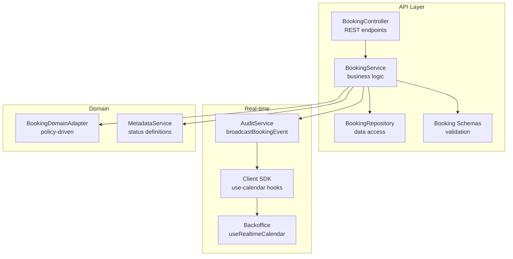
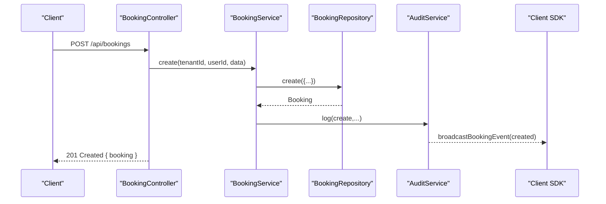
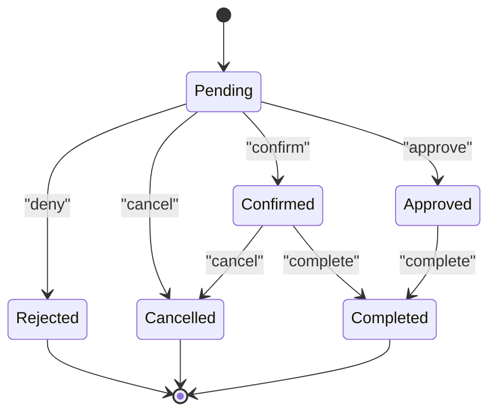
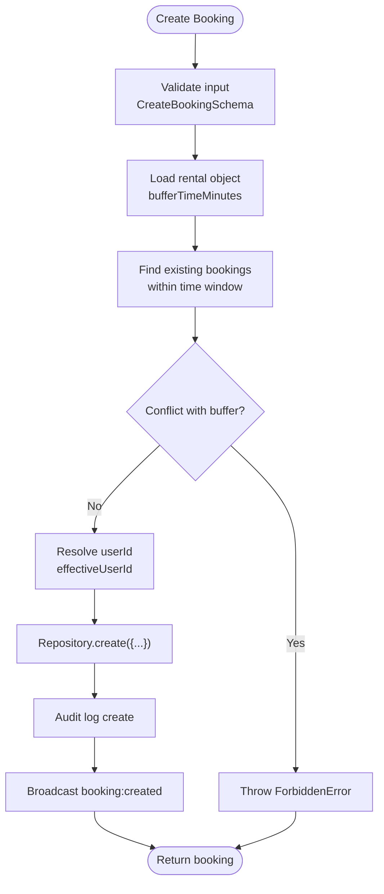
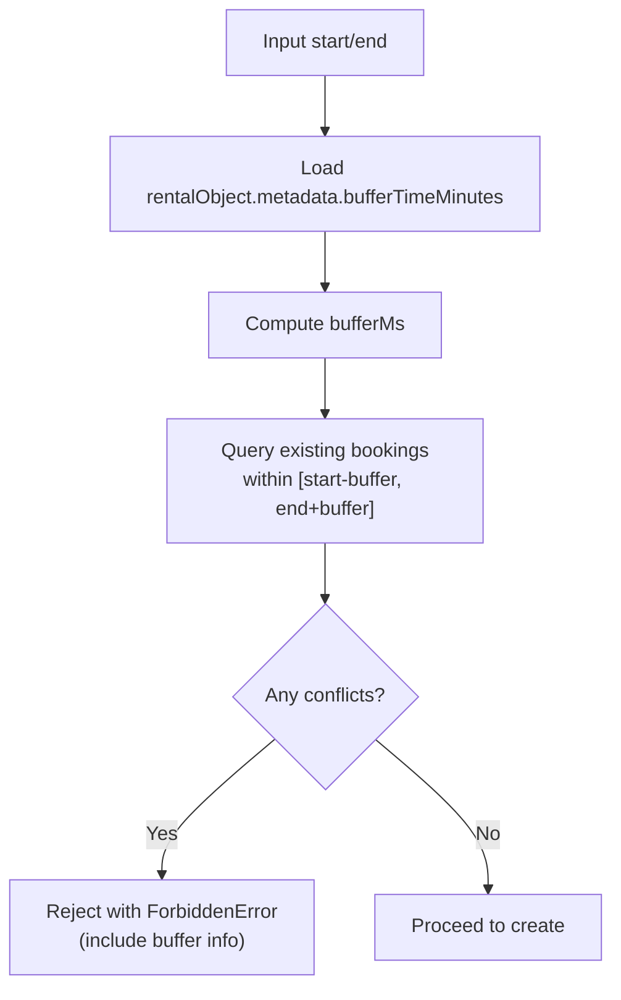
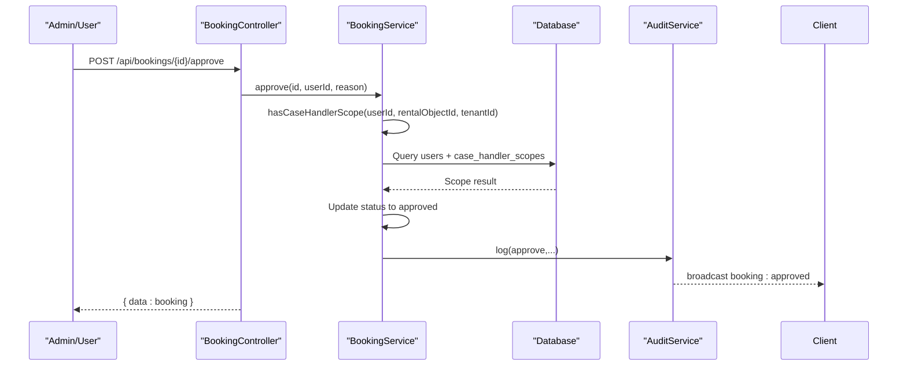
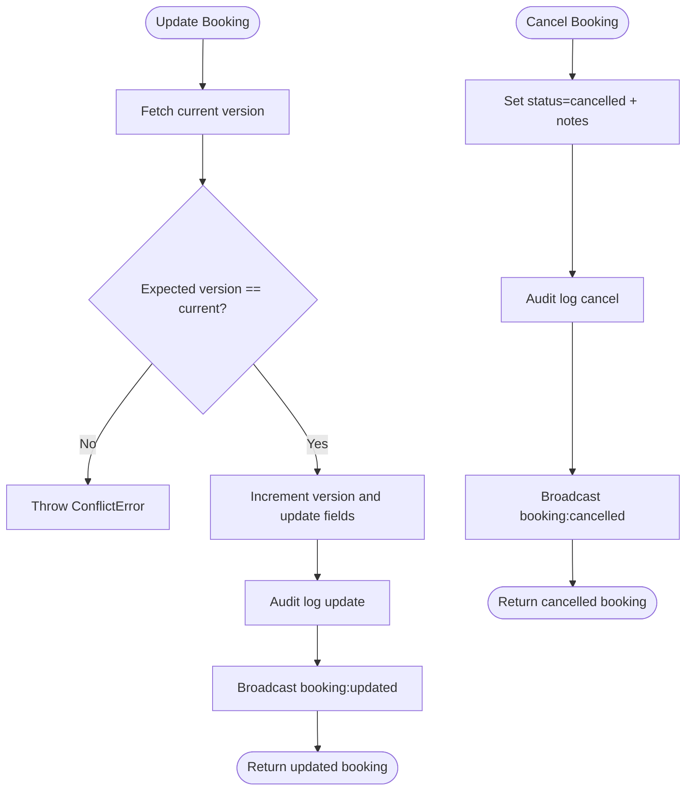
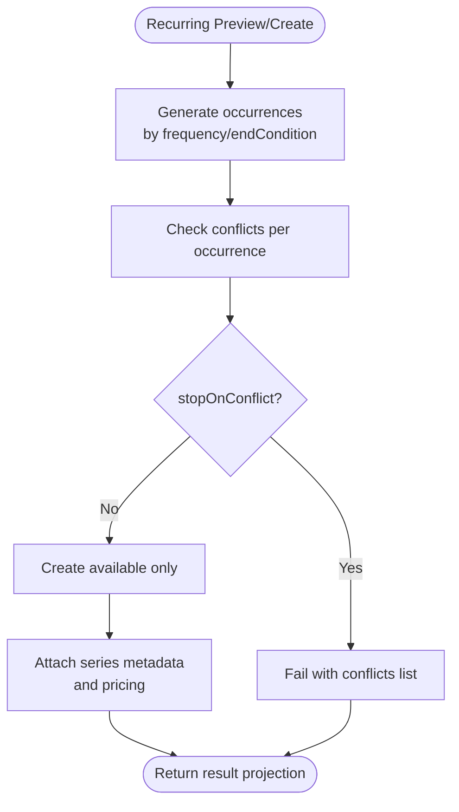
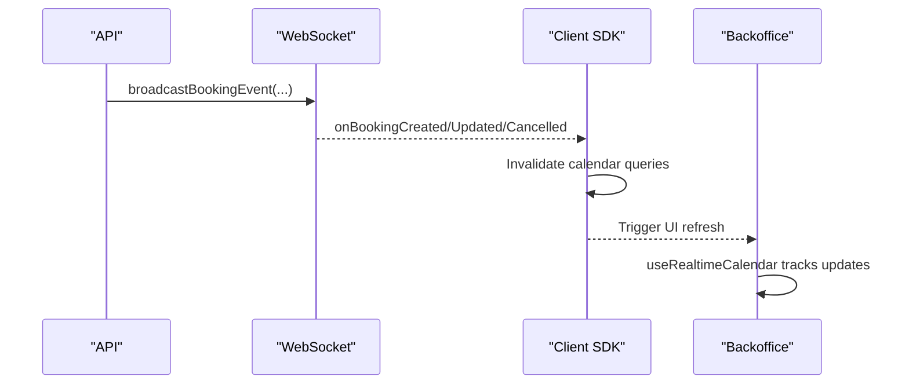
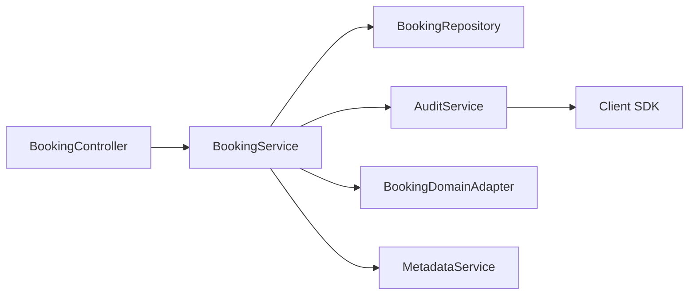

# Booking Workflow

<cite>
**Referenced Files in This Document**
- [booking.service.ts](file://apps/api/src/modules/booking/booking.service.ts)
- [booking.controller.ts](file://apps/api/src/modules/booking/booking.controller.ts)
- [booking.repository.ts](file://apps/api/src/modules/booking/booking.repository.ts)
- [booking.schema.ts](file://apps/api/src/schemas/booking.schema.ts)
- [audit.service.ts](file://apps/api/src/core/audit/audit.service.ts)
- [use-calendar.ts](file://packages/client-sdk/src/hooks/use-calendar.ts)
- [useRealtimeCalendar.ts](file://apps/backoffice/src/features/calendar/hooks/useRealtimeCalendar.ts)
- [booking.adapter.ts](file://apps/api/src/modules/domain/adapters/booking.adapter.ts)
- [metadata.service.ts](file://apps/api/src/modules/metadata/metadata.service.ts)
- [problem-details.ts](file://apps/api/src/core/errors/problem-details.ts)
- [booking-approval.test.ts](file://apps/api/src/modules/booking/__tests__/booking-approval.test.ts)
- [case-handler-scope-enforcement.spec.ts](file://apps/api/tests/e2e/case-handler-scope-enforcement.spec.ts)
- [booking-flow.spec.ts](file://apps/api/tests/e2e/booking-flow.spec.ts)
- [booking-contracts.controller.ts](file://apps/api/src/modules/bookings/booking-contracts.controller.ts)
- [booking-contracts.service.ts](file://apps/api/src/modules/bookings/booking-contracts.service.ts)
- [booking-contracts.spec.ts](file://apps/api/src/modules/bookings/booking-contracts.spec.ts)
- [booking-contracts.schema.ts](file://apps/api/src/schemas/booking-contracts.schema.ts)
</cite>

## Table of Contents
1. [Introduction](#introduction)
2. [Project Structure](#project-structure)
3. [Core Components](#core-components)
4. [Architecture Overview](#architecture-overview)
5. [Detailed Component Analysis](#detailed-component-analysis)
6. [Dependency Analysis](#dependency-analysis)
7. [Performance Considerations](#performance-considerations)
8. [Troubleshooting Guide](#troubleshooting-guide)
9. [Conclusion](#conclusion)

## Introduction
This document describes the booking workflow system that manages the complete lifecycle of reservations from initiation to completion. It covers booking states, validation rules, tenant isolation, user authentication, approval workflows for case handlers and administrators, modification and cancellation procedures, error handling, and integration with calendar systems and real-time updates.

## Project Structure
The booking workflow spans backend services, schemas, repositories, controllers, and real-time integrations:
- Backend API: booking controller, service, repository, and schemas define the booking domain
- Real-time: WebSocket broadcasting and client SDK hooks for calendar updates
- Approval workflow: case handler scope enforcement and permission matrices
- Contracts: optional booking contracts module for legal/commercial terms

**Diagram sources**
- [booking.controller.ts](file://apps/api/src/modules/booking/booking.controller.ts#L21-L418)
- [booking.service.ts](file://apps/api/src/modules/booking/booking.service.ts#L44-L1240)
- [booking.repository.ts](file://apps/api/src/modules/booking/booking.repository.ts#L12-L288)
- [audit.service.ts](file://apps/api/src/core/audit/audit.service.ts#L227-L278)
- [use-calendar.ts](file://packages/client-sdk/src/hooks/use-calendar.ts#L134-L182)
- [useRealtimeCalendar.ts](file://apps/backoffice/src/features/calendar/hooks/useRealtimeCalendar.ts#L24-L78)
- [booking.adapter.ts](file://apps/api/src/modules/domain/adapters/booking.adapter.ts#L82-L265)
- [metadata.service.ts](file://apps/api/src/modules/metadata/metadata.service.ts#L263-L314)

**Section sources**
- [booking.controller.ts](file://apps/api/src/modules/booking/booking.controller.ts#L21-L418)
- [booking.service.ts](file://apps/api/src/modules/booking/booking.service.ts#L44-L1240)
- [booking.repository.ts](file://apps/api/src/modules/booking/booking.repository.ts#L12-L288)
- [audit.service.ts](file://apps/api/src/core/audit/audit.service.ts#L227-L278)
- [use-calendar.ts](file://packages/client-sdk/src/hooks/use-calendar.ts#L134-L182)
- [useRealtimeCalendar.ts](file://apps/backoffice/src/features/calendar/hooks/useRealtimeCalendar.ts#L24-L78)
- [booking.adapter.ts](file://apps/api/src/modules/domain/adapters/booking.adapter.ts#L82-L265)
- [metadata.service.ts](file://apps/api/src/modules/metadata/metadata.service.ts#L263-L314)

## Core Components
- BookingController: Exposes REST endpoints for listing, creating, confirming, cancelling, completing, approving, denying, and querying pricing and receipts. It enforces permissions and tenant/user context.
- BookingService: Implements core business logic including validation, availability checks with buffer time, optimistic locking, status transitions, recurring booking previews and creation, and approval/denial with scope enforcement.
- BookingRepository: Provides data access with filters, org-scoped access, optimistic locking, and conflict detection.
- Booking Schemas: Define validation rules for create/update, query params, recurring selections, and pricing/quotes.
- AuditService: Logs audit events and broadcasts booking events to WebSocket clients for real-time updates.
- Client SDK and Backoffice: Subscribe to real-time booking events and invalidate calendar queries to keep UI synchronized.

**Section sources**
- [booking.controller.ts](file://apps/api/src/modules/booking/booking.controller.ts#L21-L418)
- [booking.service.ts](file://apps/api/src/modules/booking/booking.service.ts#L44-L1240)
- [booking.repository.ts](file://apps/api/src/modules/booking/booking.repository.ts#L12-L288)
- [booking.schema.ts](file://apps/api/src/schemas/booking.schema.ts#L1-L485)
- [audit.service.ts](file://apps/api/src/core/audit/audit.service.ts#L227-L278)
- [use-calendar.ts](file://packages/client-sdk/src/hooks/use-calendar.ts#L134-L182)
- [useRealtimeCalendar.ts](file://apps/backoffice/src/features/calendar/hooks/useRealtimeCalendar.ts#L24-L78)

## Architecture Overview
The booking workflow follows a layered architecture:
- Controllers handle HTTP requests and enforce RBAC
- Services encapsulate business rules and orchestrate repositories and adapters
- Repositories manage persistence and concurrency control
- AuditService ensures traceability and real-time synchronization
- Frontend integrates via SDK hooks for live calendar updates

**Diagram sources**
- [booking.controller.ts](file://apps/api/src/modules/booking/booking.controller.ts#L73-L80)
- [booking.service.ts](file://apps/api/src/modules/booking/booking.service.ts#L54-L138)
- [booking.repository.ts](file://apps/api/src/modules/booking/booking.repository.ts#L226-L282)
- [audit.service.ts](file://apps/api/src/core/audit/audit.service.ts#L247-L276)
- [use-calendar.ts](file://packages/client-sdk/src/hooks/use-calendar.ts#L140-L154)

## Detailed Component Analysis

### Booking States and Transitions
The system defines booking statuses and their allowed transitions. The metadata service enumerates statuses and transitions for UI and validation.

**Diagram sources**
- [metadata.service.ts](file://apps/api/src/modules/metadata/metadata.service.ts#L263-L314)

**Section sources**
- [metadata.service.ts](file://apps/api/src/modules/metadata/metadata.service.ts#L263-L314)

### Booking Creation Process
Creation validates inputs, checks availability with buffer time, determines user identity, persists the booking, logs audit events, and broadcasts real-time updates.

**Diagram sources**
- [booking.service.ts](file://apps/api/src/modules/booking/booking.service.ts#L54-L138)
- [booking.schema.ts](file://apps/api/src/schemas/booking.schema.ts#L41-L54)
- [audit.service.ts](file://apps/api/src/core/audit/audit.service.ts#L247-L276)

**Section sources**
- [booking.service.ts](file://apps/api/src/modules/booking/booking.service.ts#L54-L138)
- [booking.schema.ts](file://apps/api/src/schemas/booking.schema.ts#L41-L54)
- [audit.service.ts](file://apps/api/src/core/audit/audit.service.ts#L247-L276)

### Availability and Buffer Time Policy
Buffer time is derived from rental object metadata and applied when checking conflicts. The adapter also validates slot rules (min/max duration, overnight restrictions) against policy configurations.

**Diagram sources**
- [booking.service.ts](file://apps/api/src/modules/booking/booking.service.ts#L57-L92)
- [booking.adapter.ts](file://apps/api/src/modules/domain/adapters/booking.adapter.ts#L229-L265)

**Section sources**
- [booking.service.ts](file://apps/api/src/modules/booking/booking.service.ts#L57-L92)
- [booking.adapter.ts](file://apps/api/src/modules/domain/adapters/booking.adapter.ts#L229-L265)

### Approval Workflow and Scope Enforcement
Approvals are restricted to authorized users with appropriate scope. The service checks user roles and case handler scopes before allowing approvals or denials.

**Diagram sources**
- [booking.controller.ts](file://apps/api/src/modules/booking/booking.controller.ts#L122-L134)
- [booking.service.ts](file://apps/api/src/modules/booking/booking.service.ts#L279-L333)
- [booking.service.ts](file://apps/api/src/modules/booking/booking.service.ts#L1137-L1186)
- [audit.service.ts](file://apps/api/src/core/audit/audit.service.ts#L247-L276)

**Section sources**
- [booking.controller.ts](file://apps/api/src/modules/booking/booking.controller.ts#L122-L134)
- [booking.service.ts](file://apps/api/src/modules/booking/booking.service.ts#L279-L333)
- [booking.service.ts](file://apps/api/src/modules/booking/booking.service.ts#L1137-L1186)
- [audit.service.ts](file://apps/api/src/core/audit/audit.service.ts#L247-L276)

### Denial Workflow
Denials follow similar scope enforcement and audit/logging patterns, appending denial metadata to the booking.

**Section sources**
- [booking.service.ts](file://apps/api/src/modules/booking/booking.service.ts#L344-L408)
- [booking.controller.ts](file://apps/api/src/modules/booking/booking.controller.ts#L149-L161)

### Modification and Cancellation
- Modifications use optimistic locking via version increments to prevent concurrent edits.
- Cancellations set status to cancelled and optionally attach a reason, with audit and real-time broadcast.

**Diagram sources**
- [booking.repository.ts](file://apps/api/src/modules/booking/booking.repository.ts#L226-L282)
- [booking.service.ts](file://apps/api/src/modules/booking/booking.service.ts#L198-L235)
- [audit.service.ts](file://apps/api/src/core/audit/audit.service.ts#L247-L276)

**Section sources**
- [booking.repository.ts](file://apps/api/src/modules/booking/booking.repository.ts#L226-L282)
- [booking.service.ts](file://apps/api/src/modules/booking/booking.service.ts#L198-L235)
- [audit.service.ts](file://apps/api/src/core/audit/audit.service.ts#L247-L276)

### Recurring Bookings
The system supports recurring booking previews and creation with conflict detection, policy-driven behavior (stopOnConflict vs allowPartial), and series metadata.

**Diagram sources**
- [booking.service.ts](file://apps/api/src/modules/booking/booking.service.ts#L565-L824)
- [booking.schema.ts](file://apps/api/src/schemas/booking.schema.ts#L283-L424)

**Section sources**
- [booking.service.ts](file://apps/api/src/modules/booking/booking.service.ts#L565-L824)
- [booking.schema.ts](file://apps/api/src/schemas/booking.schema.ts#L283-L424)

### Calendar Integration and Real-time Updates
- The API broadcasts booking events over WebSocket for real-time UI updates.
- The client SDK subscribes to booking events and invalidates calendar queries.
- Backoffice hooks track update counts and timestamps for UI feedback.

**Diagram sources**
- [audit.service.ts](file://apps/api/src/core/audit/audit.service.ts#L247-L276)
- [use-calendar.ts](file://packages/client-sdk/src/hooks/use-calendar.ts#L140-L182)
- [useRealtimeCalendar.ts](file://apps/backoffice/src/features/calendar/hooks/useRealtimeCalendar.ts#L24-L78)

**Section sources**
- [audit.service.ts](file://apps/api/src/core/audit/audit.service.ts#L247-L276)
- [use-calendar.ts](file://packages/client-sdk/src/hooks/use-calendar.ts#L140-L182)
- [useRealtimeCalendar.ts](file://apps/backoffice/src/features/calendar/hooks/useRealtimeCalendar.ts#L24-L78)

### Booking Contracts Module
Optional contracts module provides endpoints for managing booking contracts, including creation, retrieval, and validation.

**Section sources**
- [booking-contracts.controller.ts](file://apps/api/src/modules/bookings/booking-contracts.controller.ts)
- [booking-contracts.service.ts](file://apps/api/src/modules/bookings/booking-contracts.service.ts)
- [booking-contracts.spec.ts](file://apps/api/src/modules/bookings/booking-contracts.spec.ts)
- [booking-contracts.schema.ts](file://apps/api/src/schemas/booking-contracts.schema.ts)

## Dependency Analysis
The booking workflow exhibits clear separation of concerns:
- Controller depends on Service for business logic
- Service depends on Repository for persistence and AuditService for logging
- Real-time updates depend on AuditService broadcasting and client SDK subscriptions
- Policy enforcement is delegated to adapters and metadata services

**Diagram sources**
- [booking.controller.ts](file://apps/api/src/modules/booking/booking.controller.ts#L21-L418)
- [booking.service.ts](file://apps/api/src/modules/booking/booking.service.ts#L44-L1240)
- [booking.repository.ts](file://apps/api/src/modules/booking/booking.repository.ts#L12-L288)
- [audit.service.ts](file://apps/api/src/core/audit/audit.service.ts#L227-L278)
- [booking.adapter.ts](file://apps/api/src/modules/domain/adapters/booking.adapter.ts#L82-L265)
- [metadata.service.ts](file://apps/api/src/modules/metadata/metadata.service.ts#L263-L314)

**Section sources**
- [booking.controller.ts](file://apps/api/src/modules/booking/booking.controller.ts#L21-L418)
- [booking.service.ts](file://apps/api/src/modules/booking/booking.service.ts#L44-L1240)
- [booking.repository.ts](file://apps/api/src/modules/booking/booking.repository.ts#L12-L288)
- [audit.service.ts](file://apps/api/src/core/audit/audit.service.ts#L227-L278)
- [booking.adapter.ts](file://apps/api/src/modules/domain/adapters/booking.adapter.ts#L82-L265)
- [metadata.service.ts](file://apps/api/src/modules/metadata/metadata.service.ts#L263-L314)

## Performance Considerations
- Optimistic locking prevents race conditions during updates; ensure clients handle conflict errors gracefully.
- Availability checks with buffer time reduce collisions but may increase query load; consider indexing on rentalObjectId, startTime, and endTime.
- Real-time broadcasting uses WebSocket connections; monitor connection counts and message sizes.
- Recurring previews compute many occurrences; limit max occurrences and provide pagination for large series.

## Troubleshooting Guide
Common issues and resolutions:
- Invalid state transitions: Ensure the current status allows the intended transition; refer to status definitions and transitions.
- Permission violations: Approve/deny actions require proper roles and scope; verify user role and case handler scope assignments.
- Business rule breaches: Duration limits, overnight restrictions, and buffer time violations cause failures; validate inputs against rental object policies.
- Concurrent modifications: Optimistic locking throws conflicts when versions mismatch; instruct users to refresh and retry.
- Real-time updates not appearing: Verify WebSocket connectivity and client SDK subscriptions; ensure broadcast events are sent.

**Section sources**
- [metadata.service.ts](file://apps/api/src/modules/metadata/metadata.service.ts#L263-L314)
- [booking.service.ts](file://apps/api/src/modules/booking/booking.service.ts#L279-L333)
- [booking.service.ts](file://apps/api/src/modules/booking/booking.service.ts#L240-L268)
- [booking.repository.ts](file://apps/api/src/modules/booking/booking.repository.ts#L226-L282)
- [audit.service.ts](file://apps/api/src/core/audit/audit.service.ts#L247-L276)

## Conclusion
The booking workflow system provides a robust, policy-aware, and real-time-enabled reservation lifecycle. It enforces tenant isolation, user authentication, and scope-based approvals while offering flexible recurring booking capabilities and comprehensive audit trails. The modular design enables clear extension points for contracts, advanced policies, and UI integrations.