# Calendar Integration

<cite>
**Referenced Files in This Document**
- [calendar.controller.ts](file://apps/api/src/modules/calendar/calendar.controller.ts)
- [calendar.service.ts](file://apps/api/src/modules/calendar/calendar.service.ts)
- [calendar.repository.ts](file://apps/api/src/modules/calendar/calendar.repository.ts)
- [calendar.schema.ts](file://apps/api/src/schemas/calendar.schema.ts)
- [availability.service.ts](file://apps/api/src/modules/availability/availability.service.ts)
- [conflict-detection.service.ts](file://apps/api/src/services/conflict-detection.service.ts)
- [booking.service.ts](file://apps/api/src/modules/booking/booking.service.ts)
- [websocket.service.ts](file://apps/api/src/services/websocket.service.ts)
- [activity-calendar-feature.md](file://docs/architecture/activity-calendar-feature.md)
</cite>

## Table of Contents
1. [Introduction](#introduction)
2. [Project Structure](#project-structure)
3. [Core Components](#core-components)
4. [Architecture Overview](#architecture-overview)
5. [Detailed Component Analysis](#detailed-component-analysis)
6. [Dependency Analysis](#dependency-analysis)
7. [Performance Considerations](#performance-considerations)
8. [Troubleshooting Guide](#troubleshooting-guide)
9. [Conclusion](#conclusion)

## Introduction
This document describes the calendar integration system responsible for managing booking availability and scheduling across rental objects. It covers calendar event generation, availability checking algorithms, conflict detection mechanisms, integration between the booking system and calendar views, real-time updates and synchronization, the availability service for slot availability and buffer times, and the calendar controller endpoints for event retrieval and filtering. It also documents conflict resolution strategies, alternative suggestion algorithms for recurring bookings, and integration with external calendar systems.

## Project Structure
The calendar integration spans several modules:
- Calendar controllers and services for configuration, availability matrices, and legacy event management
- Availability service for opening hours, exception days, monthly calendars, and slot availability checks
- Conflict detection service for identifying and resolving booking conflicts
- Booking service for creating bookings, handling buffer times, and generating recurring series
- WebSocket service for real-time updates

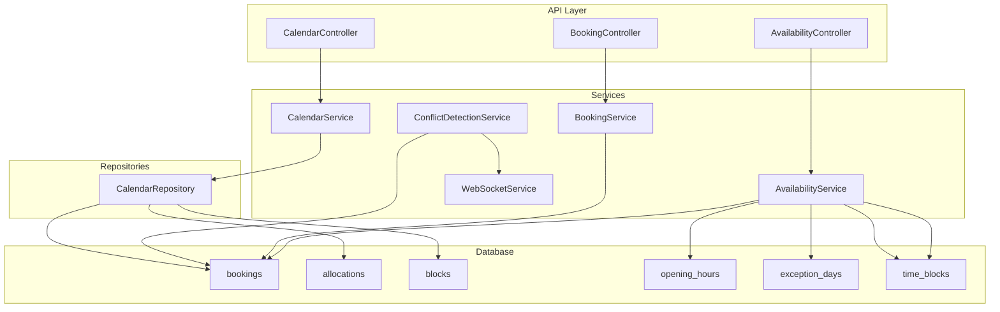

**Diagram sources**
- [calendar.controller.ts](file://apps/api/src/modules/calendar/calendar.controller.ts#L94-L165)
- [calendar.service.ts](file://apps/api/src/modules/calendar/calendar.service.ts#L74-L668)
- [calendar.repository.ts](file://apps/api/src/modules/calendar/calendar.repository.ts#L63-L277)
- [availability.service.ts](file://apps/api/src/modules/availability/availability.service.ts#L32-L457)
- [conflict-detection.service.ts](file://apps/api/src/services/conflict-detection.service.ts#L40-L217)
- [booking.service.ts](file://apps/api/src/modules/booking/booking.service.ts#L44-L800)

**Section sources**
- [calendar.controller.ts](file://apps/api/src/modules/calendar/calendar.controller.ts#L1-L165)
- [calendar.service.ts](file://apps/api/src/modules/calendar/calendar.service.ts#L1-L668)
- [calendar.repository.ts](file://apps/api/src/modules/calendar/calendar.repository.ts#L1-L277)
- [availability.service.ts](file://apps/api/src/modules/availability/availability.service.ts#L1-L457)
- [conflict-detection.service.ts](file://apps/api/src/services/conflict-detection.service.ts#L1-L217)
- [booking.service.ts](file://apps/api/src/modules/booking/booking.service.ts#L1-L800)

## Core Components
- CalendarController: Exposes endpoints for calendar configuration, availability matrix, and legacy calendar events and allocations.
- CalendarService: Generates calendar configurations and availability matrices based on listing metadata, opening hours, allocations, and bookings.
- CalendarRepository: Provides data access for allocations, events, and availability queries.
- AvailabilityService: Manages opening hours, exception days, monthly availability calendars, and slot availability checks.
- ConflictDetectionService: Detects booking conflicts, records them, and supports resolution and real-time alerts.
- BookingService: Creates bookings, applies buffer times, and generates recurring booking series with conflict policies.
- WebSocketService: Enables real-time broadcasting of booking events and conflict alerts.

**Section sources**
- [calendar.controller.ts](file://apps/api/src/modules/calendar/calendar.controller.ts#L27-L165)
- [calendar.service.ts](file://apps/api/src/modules/calendar/calendar.service.ts#L74-L668)
- [calendar.repository.ts](file://apps/api/src/modules/calendar/calendar.repository.ts#L63-L277)
- [availability.service.ts](file://apps/api/src/modules/availability/availability.service.ts#L32-L457)
- [conflict-detection.service.ts](file://apps/api/src/services/conflict-detection.service.ts#L40-L217)
- [booking.service.ts](file://apps/api/src/modules/booking/booking.service.ts#L44-L800)
- [websocket.service.ts](file://apps/api/src/services/websocket.service.ts)

## Architecture Overview
The calendar integration follows a layered architecture:
- Controllers handle HTTP requests and delegate to services.
- Services encapsulate business logic for calendar configuration, availability computation, and conflict detection.
- Repositories abstract database operations.
- Real-time updates are broadcast via WebSocket.

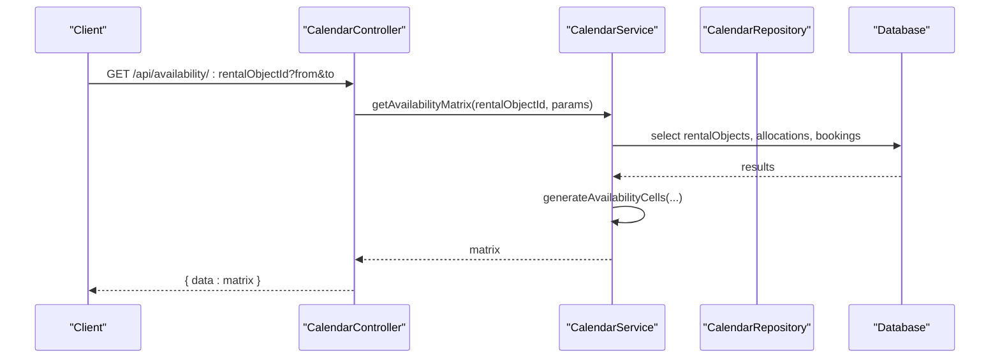

**Diagram sources**
- [calendar.controller.ts](file://apps/api/src/modules/calendar/calendar.controller.ts#L64-L88)
- [calendar.service.ts](file://apps/api/src/modules/calendar/calendar.service.ts#L195-L288)
- [calendar.repository.ts](file://apps/api/src/modules/calendar/calendar.repository.ts#L71-L106)

## Detailed Component Analysis

### Calendar Service: Configuration and Availability Matrix
The CalendarService computes calendar behavior and availability:
- Determines granularity based on listing type and metadata.
- Builds slot configuration, booking windows, opening hours, booking types, UI hints, permissions, and available actions.
- Generates an availability matrix by iterating over the requested date range, checking allocations and bookings, and marking statuses (AVAILABLE, RESERVED, BOOKED, BLOCKED, BLACKOUT, CLOSED).

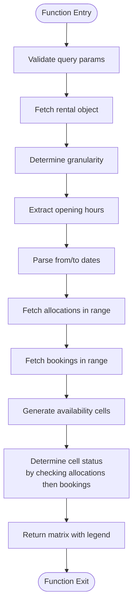

**Diagram sources**
- [calendar.service.ts](file://apps/api/src/modules/calendar/calendar.service.ts#L195-L288)
- [calendar.service.ts](file://apps/api/src/modules/calendar/calendar.service.ts#L488-L578)
- [calendar.service.ts](file://apps/api/src/modules/calendar/calendar.service.ts#L583-L646)

**Section sources**
- [calendar.service.ts](file://apps/api/src/modules/calendar/calendar.service.ts#L147-L189)
- [calendar.service.ts](file://apps/api/src/modules/calendar/calendar.service.ts#L195-L288)
- [calendar.service.ts](file://apps/api/src/modules/calendar/calendar.service.ts#L488-L667)

### Calendar Repository: Data Access
The CalendarRepository provides:
- Finding events/allocations with optional filters by rental object, date range, and status.
- Creating, updating, and deleting allocations.
- Computing availability by combining blocked slots from allocations and bookings.

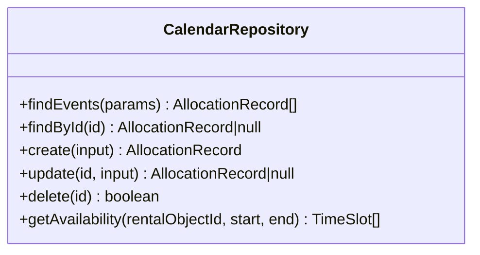

**Diagram sources**
- [calendar.repository.ts](file://apps/api/src/modules/calendar/calendar.repository.ts#L63-L277)

**Section sources**
- [calendar.repository.ts](file://apps/api/src/modules/calendar/calendar.repository.ts#L71-L106)
- [calendar.repository.ts](file://apps/api/src/modules/calendar/calendar.repository.ts#L141-L197)
- [calendar.repository.ts](file://apps/api/src/modules/calendar/calendar.repository.ts#L217-L262)

### Availability Service: Opening Hours, Exceptions, Monthly Calendar, Slot Checks
The AvailabilityService manages:
- Opening hours per day of week and exception days (holidays/closures).
- Monthly availability calendar generation, aggregating bookings and blocks.
- Slot availability checks against opening hours, exceptions, bookings, and blocks.

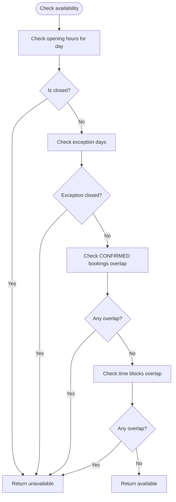

**Diagram sources**
- [availability.service.ts](file://apps/api/src/modules/availability/availability.service.ts#L277-L344)

**Section sources**
- [availability.service.ts](file://apps/api/src/modules/availability/availability.service.ts#L42-L103)
- [availability.service.ts](file://apps/api/src/modules/availability/availability.service.ts#L112-L191)
- [availability.service.ts](file://apps/api/src/modules/availability/availability.service.ts#L200-L272)
- [availability.service.ts](file://apps/api/src/modules/availability/availability.service.ts#L277-L344)

### Conflict Detection Service: Detection, Recording, Resolution, Suggestions
The ConflictDetectionService:
- Identifies overlapping bookings for a rental object within a time range.
- Records conflicts in the database and broadcasts real-time alerts via WebSocket.
- Supports resolution actions and maintains statistics.
- Provides a framework for generating alternative suggestions (placeholder implementation).

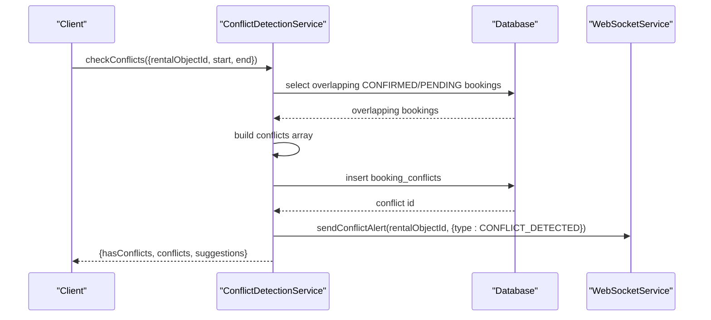

**Diagram sources**
- [conflict-detection.service.ts](file://apps/api/src/services/conflict-detection.service.ts#L44-L81)
- [conflict-detection.service.ts](file://apps/api/src/services/conflict-detection.service.ts#L86-L118)
- [websocket.service.ts](file://apps/api/src/services/websocket.service.ts)

**Section sources**
- [conflict-detection.service.ts](file://apps/api/src/services/conflict-detection.service.ts#L44-L81)
- [conflict-detection.service.ts](file://apps/api/src/services/conflict-detection.service.ts#L86-L156)
- [conflict-detection.service.ts](file://apps/api/src/services/conflict-detection.service.ts#L176-L212)

### Booking Service: Buffer Times, Recurring Series, Real-time Updates
The BookingService:
- Applies buffer times around existing bookings when validating new requests.
- Creates bookings with optimistic locking and broadcasts real-time events.
- Generates recurring booking series with conflict policies (stopOnConflict, allowPartial) and builds summaries and proposed selections.

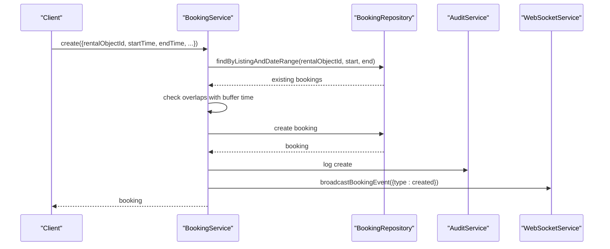

**Diagram sources**
- [booking.service.ts](file://apps/api/src/modules/booking/booking.service.ts#L54-L138)
- [booking.service.ts](file://apps/api/src/modules/booking/booking.service.ts#L413-L423)

**Section sources**
- [booking.service.ts](file://apps/api/src/modules/booking/booking.service.ts#L54-L138)
- [booking.service.ts](file://apps/api/src/modules/booking/booking.service.ts#L565-L774)
- [booking.service.ts](file://apps/api/src/modules/booking/booking.service.ts#L413-L423)

### Calendar Controllers: Endpoints and Filtering
Controllers expose:
- GET /api/rental-objects/:id/calendar-config for calendar configuration.
- GET /api/availability/:rentalObjectId for availability matrices with from/to date range queries.
- Legacy endpoints under /api/calendar for retrieving events, creating allocations, and checking availability.

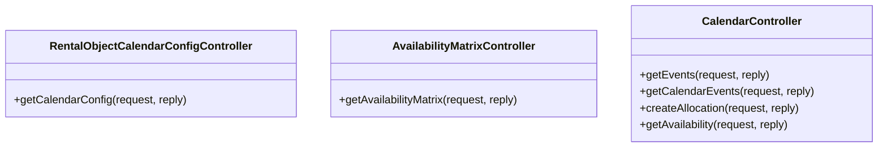

**Diagram sources**
- [calendar.controller.ts](file://apps/api/src/modules/calendar/calendar.controller.ts#L32-L54)
- [calendar.controller.ts](file://apps/api/src/modules/calendar/calendar.controller.ts#L65-L88)
- [calendar.controller.ts](file://apps/api/src/modules/calendar/calendar.controller.ts#L95-L165)

**Section sources**
- [calendar.controller.ts](file://apps/api/src/modules/calendar/calendar.controller.ts#L42-L53)
- [calendar.controller.ts](file://apps/api/src/modules/calendar/calendar.controller.ts#L76-L87)
- [calendar.controller.ts](file://apps/api/src/modules/calendar/calendar.controller.ts#L98-L163)

### Calendar Contracts Service: Blocks Management and Calendar Views
The CalendarContractsService manages:
- Generating calendar data with availability status for day/week/month views.
- Creating and listing maintenance or closure blocks with optional recurring patterns.
- Deleting blocks and annotating time slots with block information.

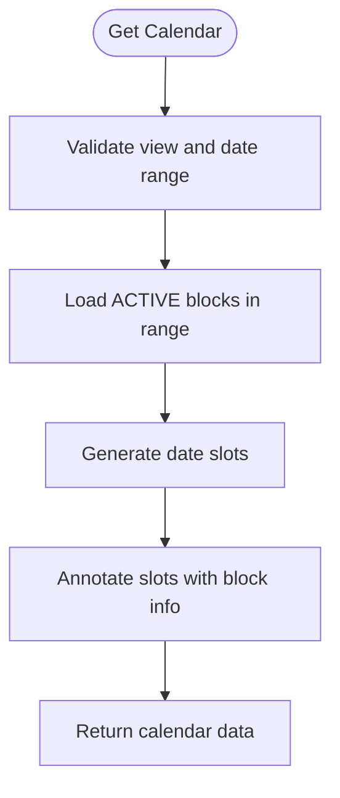

**Diagram sources**
- [calendar-contracts.service.ts](file://apps/api/src/modules/calendar/calendar-contracts.service.ts#L39-L117)

**Section sources**
- [calendar-contracts.service.ts](file://apps/api/src/modules/calendar/calendar-contracts.service.ts#L39-L117)
- [calendar-contracts.service.ts](file://apps/api/src/modules/calendar/calendar-contracts.service.ts#L123-L169)
- [calendar-contracts.service.ts](file://apps/api/src/modules/calendar/calendar-contracts.service.ts#L174-L204)

### External Calendar Systems Integration
The system can be extended to integrate with external calendar systems:
- Unified calendar view combining bookings, activities, and blocked times.
- Conflict detection incorporating activities that block bookings.
- Public activity calendar feature gap analysis outlines required entities, APIs, and integration points.

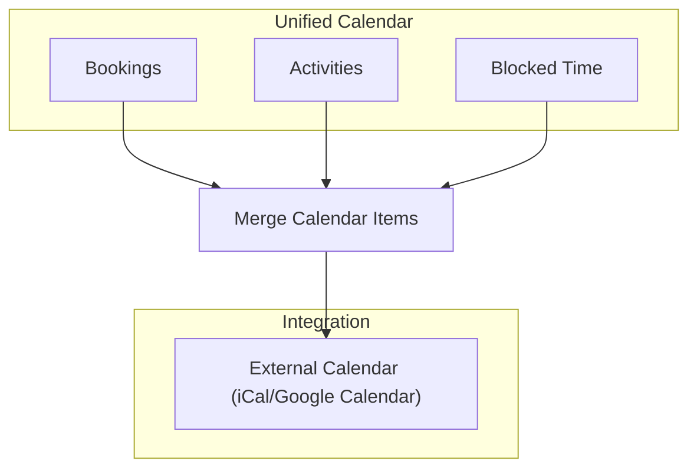

**Diagram sources**
- [activity-calendar-feature.md](file://docs/architecture/activity-calendar-feature.md#L411-L432)

**Section sources**
- [activity-calendar-feature.md](file://docs/architecture/activity-calendar-feature.md#L1-L708)

## Dependency Analysis
The calendar integration exhibits clear separation of concerns:
- Controllers depend on services for business logic.
- Services depend on repositories for data access and on database tables for persistence.
- Conflict detection integrates with WebSocket for real-time alerts.
- Booking service coordinates with audit and WebSocket services for real-time updates.

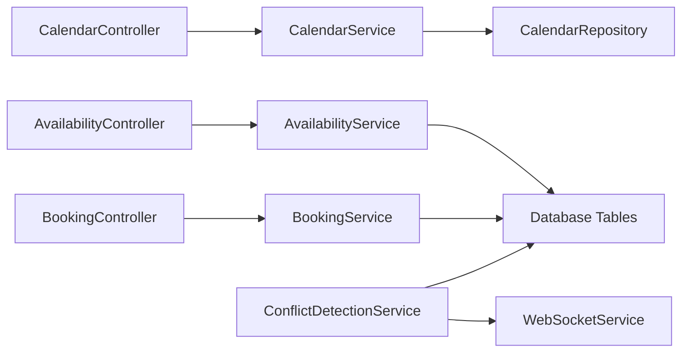

**Diagram sources**
- [calendar.controller.ts](file://apps/api/src/modules/calendar/calendar.controller.ts#L94-L165)
- [calendar.service.ts](file://apps/api/src/modules/calendar/calendar.service.ts#L74-L668)
- [calendar.repository.ts](file://apps/api/src/modules/calendar/calendar.repository.ts#L63-L277)
- [availability.service.ts](file://apps/api/src/modules/availability/availability.service.ts#L32-L457)
- [conflict-detection.service.ts](file://apps/api/src/services/conflict-detection.service.ts#L40-L217)
- [booking.service.ts](file://apps/api/src/modules/booking/booking.service.ts#L44-L800)

**Section sources**
- [calendar.controller.ts](file://apps/api/src/modules/calendar/calendar.controller.ts#L1-L165)
- [calendar.service.ts](file://apps/api/src/modules/calendar/calendar.service.ts#L1-L668)
- [calendar.repository.ts](file://apps/api/src/modules/calendar/calendar.repository.ts#L1-L277)
- [availability.service.ts](file://apps/api/src/modules/availability/availability.service.ts#L1-L457)
- [conflict-detection.service.ts](file://apps/api/src/services/conflict-detection.service.ts#L1-L217)
- [booking.service.ts](file://apps/api/src/modules/booking/booking.service.ts#L1-L800)

## Performance Considerations
- Availability matrix generation iterates over the requested date range and checks allocations and bookings. For large ranges, consider pagination or limiting the maximum range.
- Time range overlap checks are O(n) per cell; ensure indexes exist on time-based columns (start_time, end_time) and rental_object_id.
- Real-time updates via WebSocket should batch events and throttle updates to avoid overwhelming clients.
- Conflict detection queries should leverage appropriate indexes and consider partitioning for large datasets.

## Troubleshooting Guide
Common issues and resolutions:
- Validation errors for missing or invalid query parameters in availability endpoints.
- Scope validation failures for calendar access by org_member and saksbehandler users.
- Buffer time conflicts preventing booking creation; adjust buffer time configuration or propose alternative slots.
- Conflicts detected during recurring series creation; apply stopOnConflict or allowPartial policies and review suggested selections.
- Real-time alerts not received; verify WebSocket service connectivity and conflict alert broadcasting.

**Section sources**
- [calendar.controller.ts](file://apps/api/src/modules/calendar/calendar.controller.ts#L142-L150)
- [booking.service.ts](file://apps/api/src/modules/booking/booking.service.ts#L78-L92)
- [conflict-detection.service.ts](file://apps/api/src/services/conflict-detection.service.ts#L123-L156)

## Conclusion
The calendar integration system provides robust calendar configuration, availability computation, and conflict detection. It supports real-time updates and can be extended to incorporate public activities and external calendar systems. The modular design ensures maintainability and scalability, with clear separation between controllers, services, and repositories.