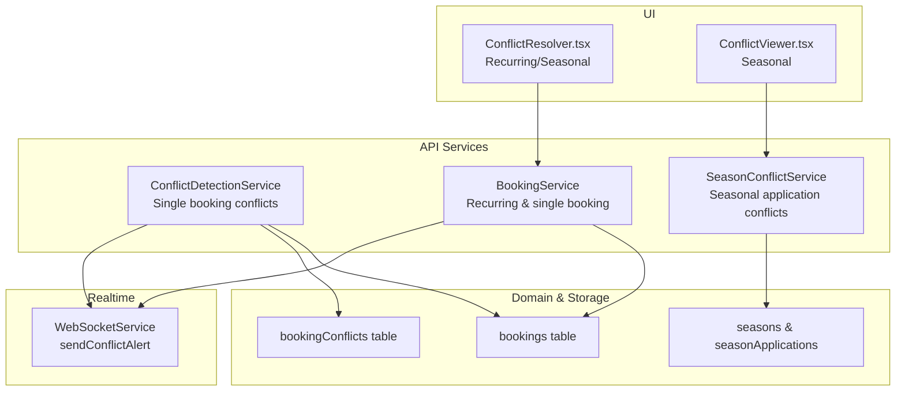
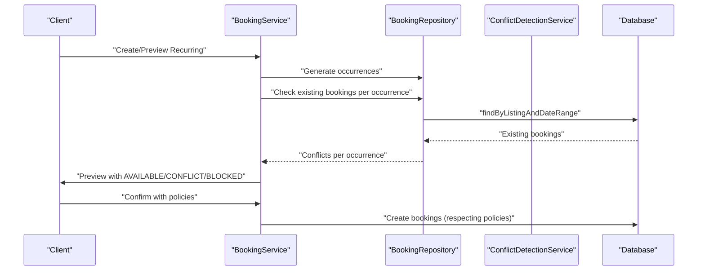
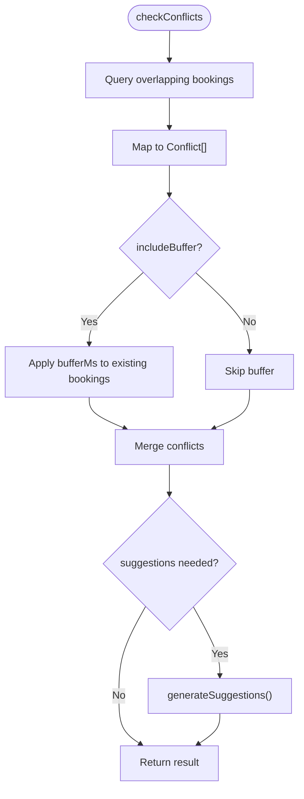
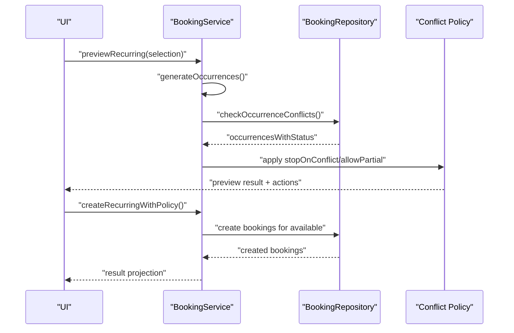
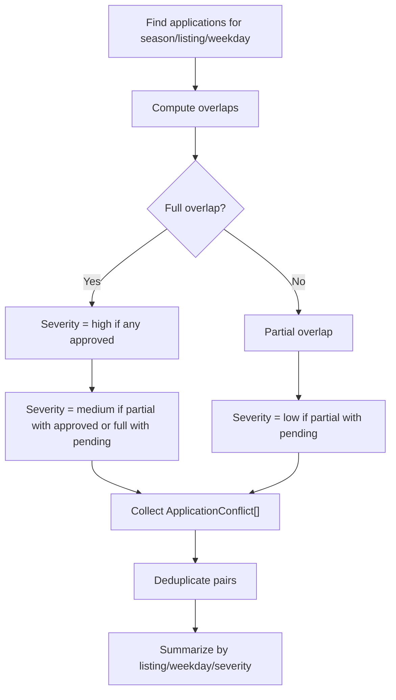
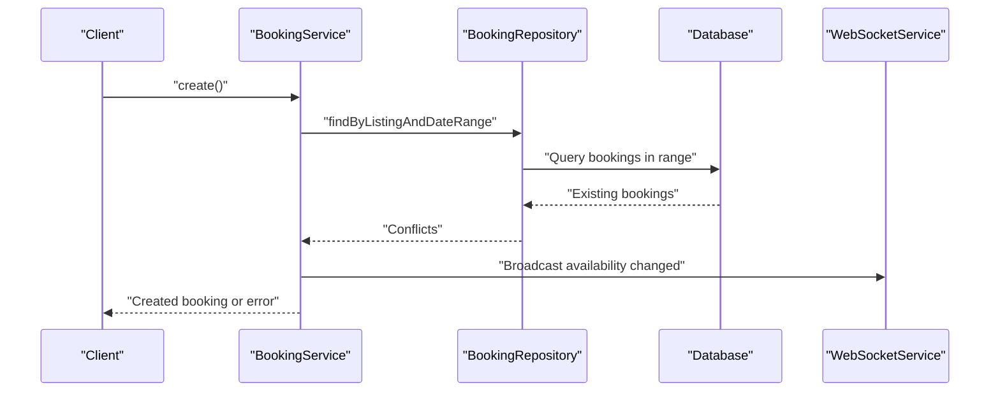
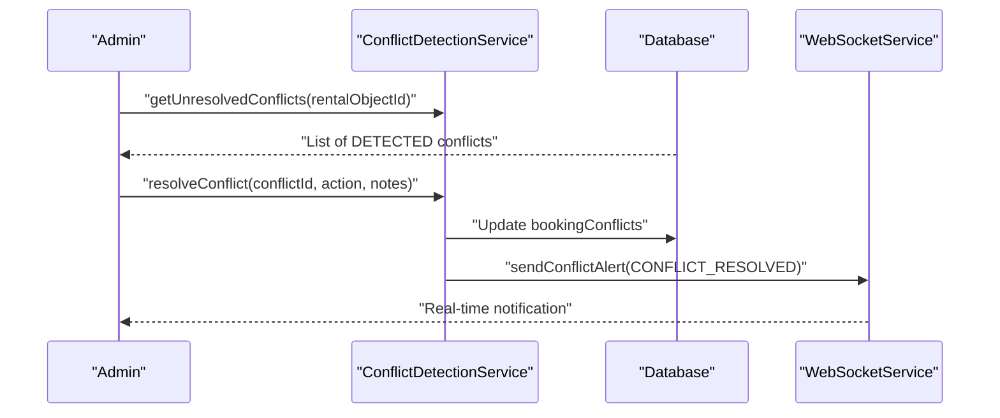
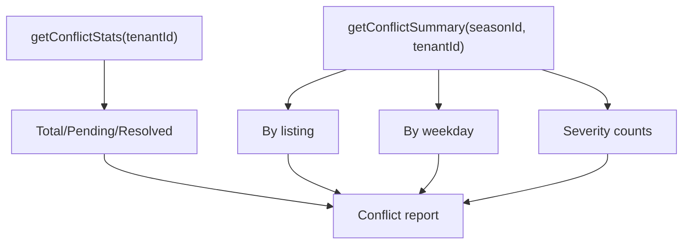
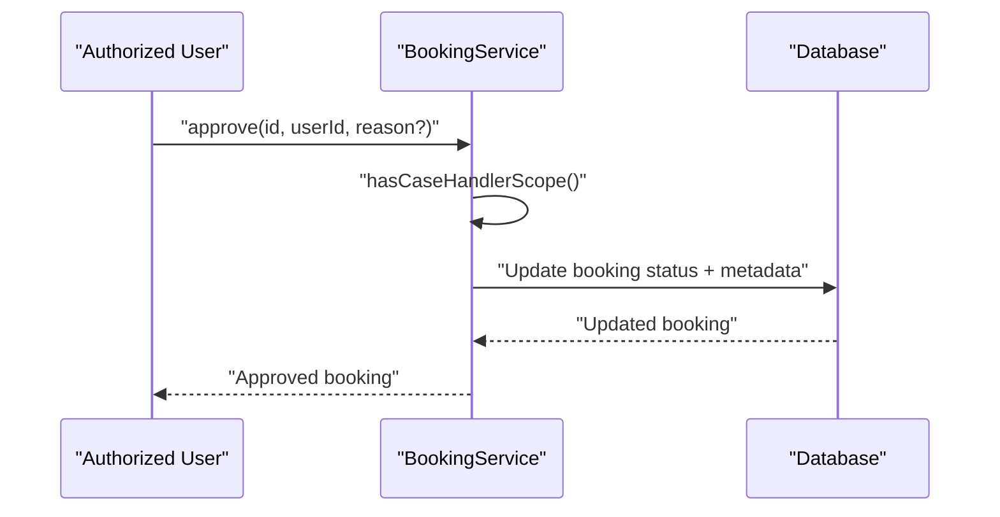
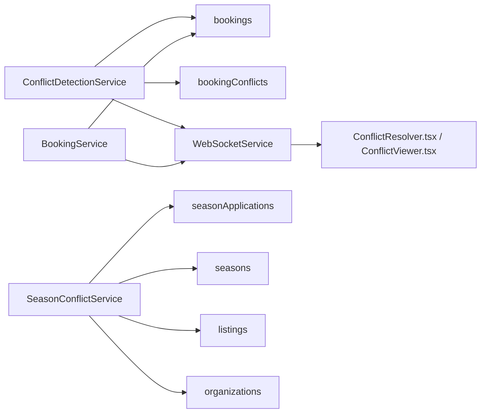

# Conflict Resolution

<cite>
**Referenced Files in This Document**
- [conflict-detection.service.ts](file://apps/api/src/services/conflict-detection.service.ts)
- [booking.service.ts](file://apps/api/src/modules/booking/booking.service.ts)
- [conflict-detection.service.ts (seasons)](file://apps/api/src/modules/seasons/conflict-detection.service.ts)
- [availability.controller.ts](file://apps/api/src/modules/availability/availability.controller.ts)
- [booking.schema.ts](file://apps/api/src/schemas/booking.schema.ts)
- [index.ts (schema exports)](file://apps/api/src/database/schema/index.ts)
- [booking-conflict.md](file://docs/digilist-platform/roles/frontend-web/booking-conflict.md)
- [ConflictResolver.tsx](file://apps/web/src/features/rental-object-details/components/Sidebar/components/ConflictResolver.tsx)
- [ConflictViewer.tsx](file://apps/backoffice/src/components/seasons/ConflictViewer.tsx)
- [websocket-realtime.md](file://docs/guides/websocket-realtime.md)
- [srsd.md](file://docs/digilist-platform/srsd.md)
</cite>

## Table of Contents
1. [Introduction](#introduction)
2. [Project Structure](#project-structure)
3. [Core Components](#core-components)
4. [Architecture Overview](#architecture-overview)
5. [Detailed Component Analysis](#detailed-component-analysis)
6. [Dependency Analysis](#dependency-analysis)
7. [Performance Considerations](#performance-considerations)
8. [Troubleshooting Guide](#troubleshooting-guide)
9. [Conclusion](#conclusion)
10. [Appendices](#appendices)

## Introduction
This document describes the conflict resolution system that detects and handles booking conflicts and scheduling issues across single bookings, recurring series, and seasonal applications. It covers detection algorithms for overlapping bookings, buffer time conflicts, capacity constraints, and policy violations; resolution strategies including alternative time suggestions, resource reallocation, and user notifications; integration with seasonal booking systems and priority-based conflict handling; the conflict service architecture; real-time conflict checking during booking creation; batch conflict resolution for existing bookings; reporting and escalation; and manual override capabilities for administrators.

## Project Structure
The conflict resolution system spans backend services, domain logic, schema definitions, and UI components:
- Backend services: conflict detection and resolution, booking lifecycle, seasonal conflict detection
- Domain logic: recurring booking preview and creation with conflict policies
- Schema and database: booking records, conflict records, and related entities
- Real-time: WebSocket alerts for conflict detection and resolution
- UI: conflict resolver for recurring/seasonal previews and conflict viewer for seasonal applications

**Diagram sources**
- [conflict-detection.service.ts](file://apps/api/src/services/conflict-detection.service.ts#L40-L216)
- [booking.service.ts](file://apps/api/src/modules/booking/booking.service.ts#L44-L1240)
- [conflict-detection.service.ts (seasons)](file://apps/api/src/modules/seasons/conflict-detection.service.ts#L1-L352)
- [index.ts (schema exports)](file://apps/api/src/database/schema/index.ts#L36-L47)
- [ConflictResolver.tsx](file://apps/web/src/features/rental-object-details/components/Sidebar/components/ConflictResolver.tsx#L138-L615)
- [ConflictViewer.tsx](file://apps/backoffice/src/components/seasons/ConflictViewer.tsx#L118-L253)

**Section sources**
- [conflict-detection.service.ts](file://apps/api/src/services/conflict-detection.service.ts#L1-L216)
- [booking.service.ts](file://apps/api/src/modules/booking/booking.service.ts#L1-L1240)
- [conflict-detection.service.ts (seasons)](file://apps/api/src/modules/seasons/conflict-detection.service.ts#L1-L352)
- [index.ts (schema exports)](file://apps/api/src/database/schema/index.ts#L1-L170)

## Core Components
- ConflictDetectionService: central detector for single booking conflicts, records conflicts, and broadcasts real-time alerts. It supports future extensions for buffer, capacity, and activity conflicts.
- BookingService: enforces conflict policies for recurring and single bookings, generates occurrence previews, applies stopOnConflict/allowPartial, and manages series creation.
- SeasonConflictService: identifies overlapping time slots for seasonal applications, computes severity, and aggregates conflict summaries.
- Real-time alerts: WebSocketService emits CONFLICT_DETECTED and CONFLICT_RESOLVED events to tenants and UI clients.
- UI components: ConflictResolver for recurring/seasonal previews and ConflictViewer for seasonal conflict dashboards.

**Section sources**
- [conflict-detection.service.ts](file://apps/api/src/services/conflict-detection.service.ts#L40-L216)
- [booking.service.ts](file://apps/api/src/modules/booking/booking.service.ts#L565-L824)
- [conflict-detection.service.ts (seasons)](file://apps/api/src/modules/seasons/conflict-detection.service.ts#L108-L351)
- [websocket-realtime.md](file://docs/guides/websocket-realtime.md#L4457-L4551)

## Architecture Overview
The system integrates three detection paths:
- Single booking conflicts: overlap detection with buffer time around existing bookings
- Recurring/seasonal conflicts: occurrence-level preview and conflict checks
- Seasonal application conflicts: time-range overlap among applications for the same listing and weekday

**Diagram sources**
- [booking.service.ts](file://apps/api/src/modules/booking/booking.service.ts#L565-L930)
- [booking.service.ts](file://apps/api/src/modules/booking/booking.service.ts#L895-L930)

**Section sources**
- [booking.service.ts](file://apps/api/src/modules/booking/booking.service.ts#L565-L930)

## Detailed Component Analysis

### Single Booking Conflict Detection
- Overlapping bookings: queries bookings within the requested time window and marks conflicts when intervals intersect.
- Buffer time: includes configurable buffer around existing bookings to prevent adjacent use.
- Recording and alerts: inserts conflict records and emits real-time WebSocket alerts.

**Diagram sources**
- [conflict-detection.service.ts](file://apps/api/src/services/conflict-detection.service.ts#L44-L81)

**Section sources**
- [conflict-detection.service.ts](file://apps/api/src/services/conflict-detection.service.ts#L44-L118)

### Recurring and Seasonal Conflict Detection
- Preview: generates occurrences based on frequency and end conditions, checks each occurrence against existing bookings, and returns status per occurrence.
- Policies: stopOnConflict blocks creation if any conflict exists; allowPartial enables partial creation of available occurrences.
- Conflict types and severity: standardized conflict types and severity levels for UI and policy enforcement.

**Diagram sources**
- [booking.service.ts](file://apps/api/src/modules/booking/booking.service.ts#L780-L824)
- [booking.service.ts](file://apps/api/src/modules/booking/booking.service.ts#L895-L930)
- [booking.service.ts](file://apps/api/src/modules/booking/booking.service.ts#L565-L774)
- [booking.schema.ts](file://apps/api/src/schemas/booking.schema.ts#L355-L398)
- [booking-conflict.md](file://docs/digilist-platform/roles/frontend-web/booking-conflict.md#L1-L180)

**Section sources**
- [booking.service.ts](file://apps/api/src/modules/booking/booking.service.ts#L780-L930)
- [booking.schema.ts](file://apps/api/src/schemas/booking.schema.ts#L355-L398)
- [booking-conflict.md](file://docs/digilist-platform/roles/frontend-web/booking-conflict.md#L1-L180)

### Seasonal Application Conflict Detection
- Time overlap: compares time ranges for applications on the same listing and weekday, classifying overlap as full or partial.
- Severity: computes severity based on overlap type and application statuses (approved/pending/allocated).
- Aggregation: deduplicates conflicts and produces summaries by listing and weekday.

**Diagram sources**
- [conflict-detection.service.ts (seasons)](file://apps/api/src/modules/seasons/conflict-detection.service.ts#L108-L300)

**Section sources**
- [conflict-detection.service.ts (seasons)](file://apps/api/src/modules/seasons/conflict-detection.service.ts#L108-L351)
- [ConflictViewer.tsx](file://apps/backoffice/src/components/seasons/ConflictViewer.tsx#L118-L253)

### Real-Time Conflict Checking During Booking Creation
- Single booking: buffer time around existing bookings is considered when validating availability.
- Recurring: occurrence-level checks are performed before creation; policies govern whether to proceed.

**Diagram sources**
- [booking.service.ts](file://apps/api/src/modules/booking/booking.service.ts#L54-L138)
- [availability.controller.ts](file://apps/api/src/modules/availability/availability.controller.ts#L244-L276)
- [websocket-realtime.md](file://docs/guides/websocket-realtime.md#L4457-L4551)

**Section sources**
- [booking.service.ts](file://apps/api/src/modules/booking/booking.service.ts#L54-L138)
- [availability.controller.ts](file://apps/api/src/modules/availability/availability.controller.ts#L244-L276)

### Batch Conflict Resolution for Existing Bookings
- Unresolved conflicts: query unresolved conflicts for a rental object and present them for resolution.
- Resolution actions: cancel new/existing booking, force accept, modify time.
- Notifications: real-time alerts broadcast upon resolution.

**Diagram sources**
- [conflict-detection.service.ts](file://apps/api/src/services/conflict-detection.service.ts#L176-L156)

**Section sources**
- [conflict-detection.service.ts](file://apps/api/src/services/conflict-detection.service.ts#L176-L156)

### Conflict Reporting Mechanisms and Escalation
- Statistics: conflict totals, resolved/pending counts, and per-type breakdowns.
- Seasonal summaries: counts by listing and weekday, severity distribution.
- Escalation: UI enforces explicit resolution choices; administrators can override or escalate via backoffice tools.

**Diagram sources**
- [conflict-detection.service.ts](file://apps/api/src/services/conflict-detection.service.ts#L191-L212)
- [conflict-detection.service.ts (seasons)](file://apps/api/src/modules/seasons/conflict-detection.service.ts#L266-L300)

**Section sources**
- [conflict-detection.service.ts](file://apps/api/src/services/conflict-detection.service.ts#L191-L212)
- [conflict-detection.service.ts (seasons)](file://apps/api/src/modules/seasons/conflict-detection.service.ts#L266-L300)

### Manual Override Capabilities
- Case handlers and administrators can approve/deny bookings within scope; scope enforcement ensures only authorized users act.
- Override actions: approve, deny, reject with reasons; metadata captures who performed the action and when.

**Diagram sources**
- [booking.service.ts](file://apps/api/src/modules/booking/booking.service.ts#L1137-L1186)

**Section sources**
- [booking.service.ts](file://apps/api/src/modules/booking/booking.service.ts#L279-L333)
- [booking.service.ts](file://apps/api/src/modules/booking/booking.service.ts#L1137-L1186)

## Dependency Analysis
- ConflictDetectionService depends on the bookings and bookingConflicts tables and uses WebSocketService for real-time alerts.
- BookingService orchestrates occurrence generation, conflict checks, and policy enforcement; it interacts with repositories and schemas.
- SeasonConflictService depends on seasonApplications, seasons, listings, and organizations to compute overlaps and severity.
- Real-time invalidation maps ensure cache consistency for booking and availability events.

**Diagram sources**
- [conflict-detection.service.ts](file://apps/api/src/services/conflict-detection.service.ts#L7-L10)
- [booking.service.ts](file://apps/api/src/modules/booking/booking.service.ts#L45-L49)
- [conflict-detection.service.ts (seasons)](file://apps/api/src/modules/seasons/conflict-detection.service.ts#L5-L8)
- [index.ts (schema exports)](file://apps/api/src/database/schema/index.ts#L36-L47)

**Section sources**
- [conflict-detection.service.ts](file://apps/api/src/services/conflict-detection.service.ts#L7-L10)
- [booking.service.ts](file://apps/api/src/modules/booking/booking.service.ts#L45-L49)
- [conflict-detection.service.ts (seasons)](file://apps/api/src/modules/seasons/conflict-detection.service.ts#L5-L8)
- [index.ts (schema exports)](file://apps/api/src/database/schema/index.ts#L36-L47)

## Performance Considerations
- Indexing: ensure bookings.startTime, bookings.endTime, and composite indexes on rentalObjectId with time range predicates for efficient overlap queries.
- Buffer time: precompute bufferMs to avoid repeated conversions and comparisons.
- Batch operations: for recurring creation, process available occurrences in batches and leverage optimistic locking to minimize contention.
- Real-time: throttle WebSocket alerts for bulk changes; coalesce frequent updates to reduce client churn.

## Troubleshooting Guide
- Conflicts not detected: verify overlap query conditions and buffer time inclusion; confirm booking status filter includes expected statuses.
- No suggestions generated: generateSuggestions is a placeholder; implement intelligent slot discovery and alternative object suggestions.
- UI not updating: check WebSocket event invalidation maps and ensure cache keys align with emitted events.
- Seasonal conflicts missing: confirm application status filtering excludes cancelled/rejected entries and that time ranges are normalized to minutes since midnight.

**Section sources**
- [conflict-detection.service.ts](file://apps/api/src/services/conflict-detection.service.ts#L44-L81)
- [conflict-detection.service.ts](file://apps/api/src/services/conflict-detection.service.ts#L161-L171)
- [websocket-realtime.md](file://docs/guides/websocket-realtime.md#L4457-L4551)
- [conflict-detection.service.ts (seasons)](file://apps/api/src/modules/seasons/conflict-detection.service.ts#L131-L163)

## Conclusion
The conflict resolution system provides robust detection and resolution for single, recurring, and seasonal bookings. It integrates real-time alerts, policy-driven conflict handling, and administrative overrides. Future enhancements should focus on implementing capacity and activity conflict checks, refining alternative suggestions, and strengthening reporting and escalation pathways.

## Appendices

### Conflict Types and Severity
- Single booking: HARD conflicts with CRITICAL severity; SOFT/BUFFER/CAPACITY placeholders for future expansion.
- Seasonal applications: full/partial overlap with severity computed from statuses.

**Section sources**
- [conflict-detection.service.ts](file://apps/api/src/services/conflict-detection.service.ts#L20-L28)
- [conflict-detection.service.ts (seasons)](file://apps/api/src/modules/seasons/conflict-detection.service.ts#L13-L41)
- [conflict-detection.service.ts (seasons)](file://apps/api/src/modules/seasons/conflict-detection.service.ts#L83-L103)

### Real-Time Event Coverage
- Booking and availability events invalidate appropriate cache keys; conflict-related events should similarly invalidate relevant lists.

**Section sources**
- [websocket-realtime.md](file://docs/guides/websocket-realtime.md#L4457-L4551)

### Schema Constraints and Notes
- Preventing overlaps is noted in schema documentation; implementation may combine conflict queries with transaction locks or exclusion constraints.

**Section sources**
- [srsd.md](file://docs/digilist-platform/srsd.md#L251-L296)