# Contract Management

<cite>
**Referenced Files in This Document**
- [packages/contracts/src/index.ts](file://packages/contracts/src/index.ts)
- [packages/contracts/README.md](file://packages/contracts/README.md)
- [packages/contracts/src/schemas/index.ts](file://packages/contracts/src/schemas/index.ts)
- [packages/contracts/src/schemas/booking.schema.ts](file://packages/contracts/src/schemas/booking.schema.ts)
- [packages/contracts/src/schemas/rental-object.schema.ts](file://packages/contracts/src/schemas/rental-object.schema.ts)
- [packages/contracts/src/projections/index.ts](file://packages/contracts/src/projections/index.ts)
- [packages/contracts/src/projections/booking.projection.ts](file://packages/contracts/src/projections/booking.projection.ts)
- [packages/contracts/src/projections/rental-object.projection.ts](file://packages/contracts/src/projections/rental-object.projection.ts)
- [packages/contracts/src/storage.ts](file://packages/contracts/src/storage.ts)
- [apps/api/src/modules/booking/booking.mapper.ts](file://apps/api/src/modules/booking/booking.mapper.ts)
- [packages/client-sdk/src/services/booking.service.ts](file://packages/client-sdk/src/services/booking.service.ts)
</cite>

## Table of Contents
1. [Introduction](#introduction)
2. [Project Structure](#project-structure)
3. [Core Components](#core-components)
4. [Architecture Overview](#architecture-overview)
5. [Detailed Component Analysis](#detailed-component-analysis)
6. [Dependency Analysis](#dependency-analysis)
7. [Performance Considerations](#performance-considerations)
8. [Troubleshooting Guide](#troubleshooting-guide)
9. [Conclusion](#conclusion)
10. [Appendices](#appendices)

## Introduction
This document describes the contract management system for booking agreements and legal documentation within the platform. It explains how contracts are modeled, validated, projected for UI, and integrated with booking and calendar systems. It also covers template management, digital signature workflows, validation rules, expiration handling, renewals, controller endpoints for retrieval and status tracking, amendment procedures, storage and versioning, audit trails, and the relationships to booking approvals, payment terms, and cancellation policies.

## Project Structure
The contract management system is centered around a shared contracts package that defines:
- Zod schemas for validation and runtime checks
- TypeScript types derived from schemas
- UI-ready projection schemas
- Storage contracts for file uploads and metadata
- Modules and monitoring DTOs

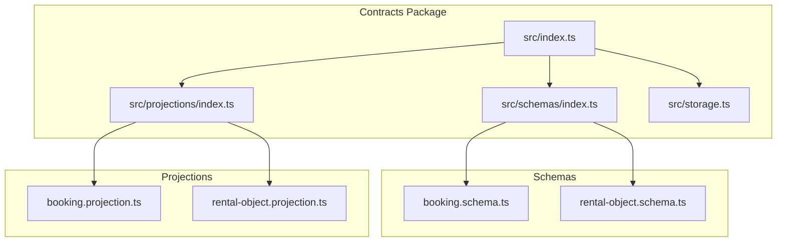

**Diagram sources**
- [packages/contracts/src/index.ts](file://packages/contracts/src/index.ts#L34-L51)
- [packages/contracts/src/schemas/index.ts](file://packages/contracts/src/schemas/index.ts#L7-L17)
- [packages/contracts/src/projections/index.ts](file://packages/contracts/src/projections/index.ts#L7-L11)
- [packages/contracts/src/schemas/booking.schema.ts](file://packages/contracts/src/schemas/booking.schema.ts#L43-L63)
- [packages/contracts/src/schemas/rental-object.schema.ts](file://packages/contracts/src/schemas/rental-object.schema.ts#L148-L170)
- [packages/contracts/src/projections/booking.projection.ts](file://packages/contracts/src/projections/booking.projection.ts#L12-L42)
- [packages/contracts/src/projections/rental-object.projection.ts](file://packages/contracts/src/projections/rental-object.projection.ts#L13-L37)

**Section sources**
- [packages/contracts/src/index.ts](file://packages/contracts/src/index.ts#L1-L142)
- [packages/contracts/README.md](file://packages/contracts/README.md#L76-L97)

## Core Components
- Contract schemas define canonical data models for bookings and rental objects, including enums, validation rules, and query parameters.
- Projection schemas provide UI-ready DTOs with pre-computed fields, permissions, and localized labels.
- Storage contracts define file upload and metadata management for supporting documents.
- The contracts package acts as the single source of truth for API contracts across the API server, SDK, and frontend applications.

**Section sources**
- [packages/contracts/src/schemas/booking.schema.ts](file://packages/contracts/src/schemas/booking.schema.ts#L1-L162)
- [packages/contracts/src/schemas/rental-object.schema.ts](file://packages/contracts/src/schemas/rental-object.schema.ts#L1-L246)
- [packages/contracts/src/projections/booking.projection.ts](file://packages/contracts/src/projections/booking.projection.ts#L1-L195)
- [packages/contracts/src/projections/rental-object.projection.ts](file://packages/contracts/src/projections/rental-object.projection.ts#L1-L130)
- [packages/contracts/src/storage.ts](file://packages/contracts/src/storage.ts#L1-L76)
- [packages/contracts/src/index.ts](file://packages/contracts/src/index.ts#L34-L51)

## Architecture Overview
The contract management architecture ensures strong typing and validation across the stack:
- API server validates requests and responses using schemas
- SDK consumes schemas and projections for type-safe interactions
- Frontend renders UI using projection schemas
- Storage contracts enable consistent file handling for contracts and supporting documents

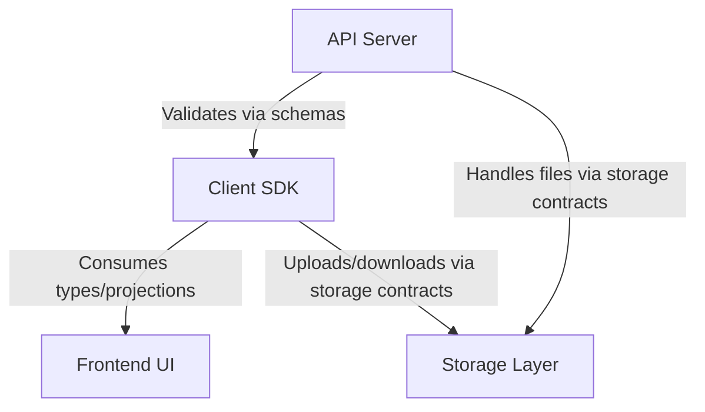

[No sources needed since this diagram shows conceptual workflow, not actual code structure]

## Detailed Component Analysis

### Contract Creation Process
Contract creation is driven by booking lifecycle events and templates. The process involves:
- Validating booking inputs using schemas
- Generating contract documents based on templates
- Storing documents via storage contracts
- Emitting audit events for traceability

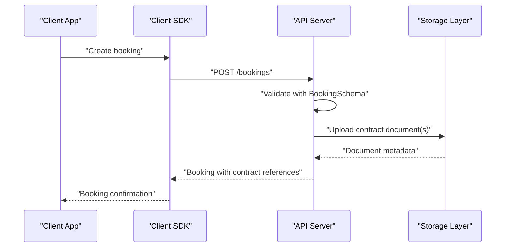

**Diagram sources**
- [packages/contracts/src/schemas/booking.schema.ts](file://packages/contracts/src/schemas/booking.schema.ts#L69-L83)
- [packages/contracts/src/storage.ts](file://packages/contracts/src/storage.ts#L7-L29)
- [packages/client-sdk/src/services/booking.service.ts](file://packages/client-sdk/src/services/booking.service.ts#L218-L245)

**Section sources**
- [packages/contracts/src/schemas/booking.schema.ts](file://packages/contracts/src/schemas/booking.schema.ts#L69-L83)
- [packages/contracts/src/storage.ts](file://packages/contracts/src/storage.ts#L7-L29)
- [packages/client-sdk/src/services/booking.service.ts](file://packages/client-sdk/src/services/booking.service.ts#L218-L245)

### Template Management
Templates are managed as part of the document lifecycle and stored via storage contracts. The system supports:
- Category-based categorization for documents
- Entity linkage (booking, rental object, organization, user)
- Metadata fields for alt text and captions
- Listing and pagination of uploaded files

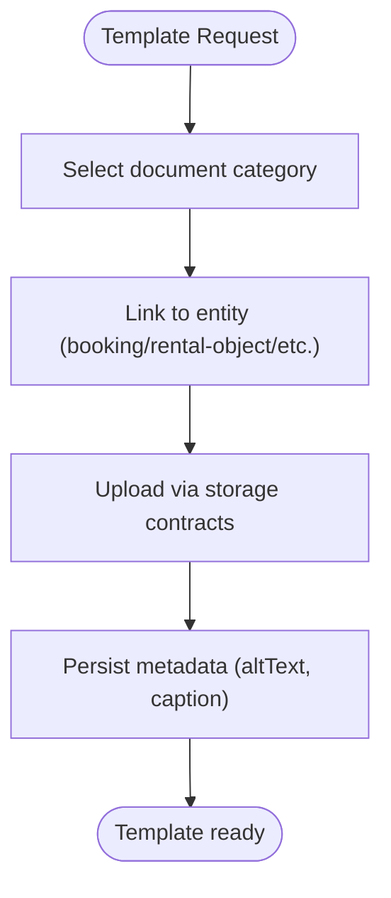

**Diagram sources**
- [packages/contracts/src/storage.ts](file://packages/contracts/src/storage.ts#L7-L29)
- [packages/contracts/src/storage.ts](file://packages/contracts/src/storage.ts#L41-L58)

**Section sources**
- [packages/contracts/src/storage.ts](file://packages/contracts/src/storage.ts#L7-L29)
- [packages/contracts/src/storage.ts](file://packages/contracts/src/storage.ts#L41-L58)

### Digital Signature Workflows
Digital signatures are integrated into the contract lifecycle:
- Contract documents are generated and stored
- Signature initiation occurs through dedicated endpoints
- Signed documents are retrieved and linked to the booking record
- Audit trail captures signature events

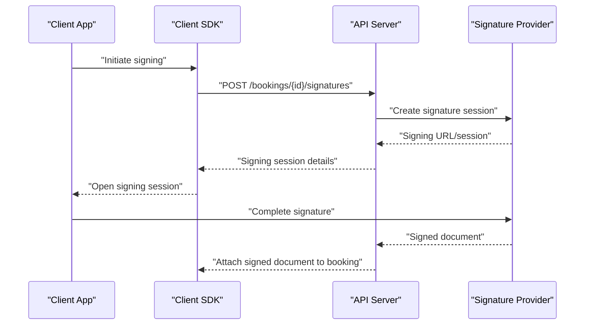

**Diagram sources**
- [packages/client-sdk/src/services/booking.service.ts](file://packages/client-sdk/src/services/booking.service.ts#L218-L245)
- [apps/api/src/modules/booking/booking.mapper.ts](file://apps/api/src/modules/booking/booking.mapper.ts#L486-L522)

**Section sources**
- [packages/client-sdk/src/services/booking.service.ts](file://packages/client-sdk/src/services/booking.service.ts#L218-L245)
- [apps/api/src/modules/booking/booking.mapper.ts](file://apps/api/src/modules/booking/booking.mapper.ts#L486-L522)

### Integration Between Booking Contracts and Calendar Contracts
Calendar contracts are represented via calendar event projections that link to bookings:
- Calendar events include booking identifiers and status
- UI projections expose editable/clickable flags for calendar integration
- Timeline and document lists enrich calendar entries with booking history and attachments

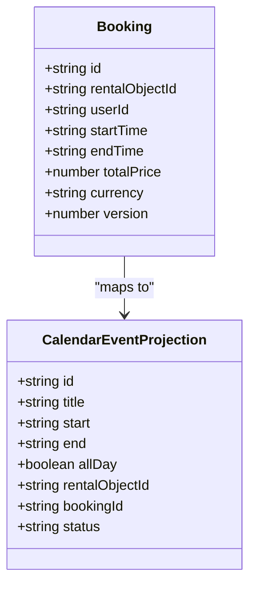

**Diagram sources**
- [packages/contracts/src/schemas/booking.schema.ts](file://packages/contracts/src/schemas/booking.schema.ts#L43-L63)
- [packages/contracts/src/projections/booking.projection.ts](file://packages/contracts/src/projections/booking.projection.ts#L166-L192)

**Section sources**
- [packages/contracts/src/projections/booking.projection.ts](file://packages/contracts/src/projections/booking.projection.ts#L166-L192)
- [packages/contracts/src/schemas/booking.schema.ts](file://packages/contracts/src/schemas/booking.schema.ts#L43-L63)

### Contract Validation Rules
Validation rules ensure data integrity and business correctness:
- Time range validation enforces end time after start time
- Non-negative totals and currency codes
- Enumerated statuses for bookings and payments
- Query parameters support pagination, sorting, and filtering

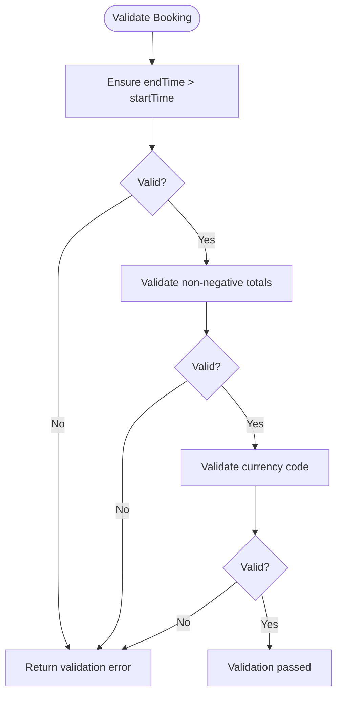

**Diagram sources**
- [packages/contracts/src/schemas/booking.schema.ts](file://packages/contracts/src/schemas/booking.schema.ts#L58-L61)
- [packages/contracts/src/schemas/booking.schema.ts](file://packages/contracts/src/schemas/booking.schema.ts#L78-L81)

**Section sources**
- [packages/contracts/src/schemas/booking.schema.ts](file://packages/contracts/src/schemas/booking.schema.ts#L58-L61)
- [packages/contracts/src/schemas/booking.schema.ts](file://packages/contracts/src/schemas/booking.schema.ts#L78-L81)

### Expiration Handling and Renewal Processes
Expiration and renewal are governed by:
- Quote responses indicating validity windows
- Cancellation policies embedded in rental object rules
- Recurring booking patterns for repeated contracts

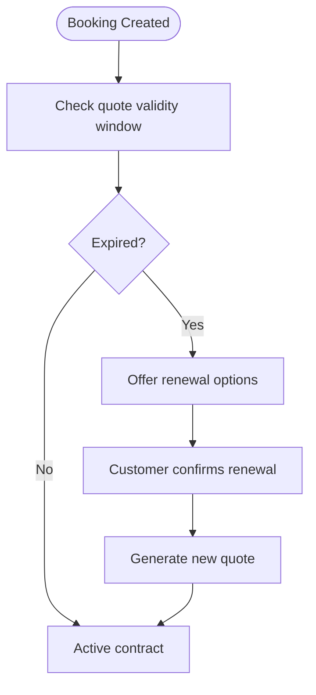

**Diagram sources**
- [packages/contracts/src/schemas/booking.schema.ts](file://packages/contracts/src/schemas/booking.schema.ts#L142-L159)
- [packages/contracts/src/schemas/rental-object.schema.ts](file://packages/contracts/src/schemas/rental-object.schema.ts#L136-L139)

**Section sources**
- [packages/contracts/src/schemas/booking.schema.ts](file://packages/contracts/src/schemas/booking.schema.ts#L142-L159)
- [packages/contracts/src/schemas/rental-object.schema.ts](file://packages/contracts/src/schemas/rental-object.schema.ts#L136-L139)

### Contract Controller Endpoints
Endpoints for contract retrieval, status tracking, and amendments:
- Retrieve booking with documents and timeline
- Get booking receipt
- Request changes requiring approval
- Manage recurring bookings
- Quote pricing and availability

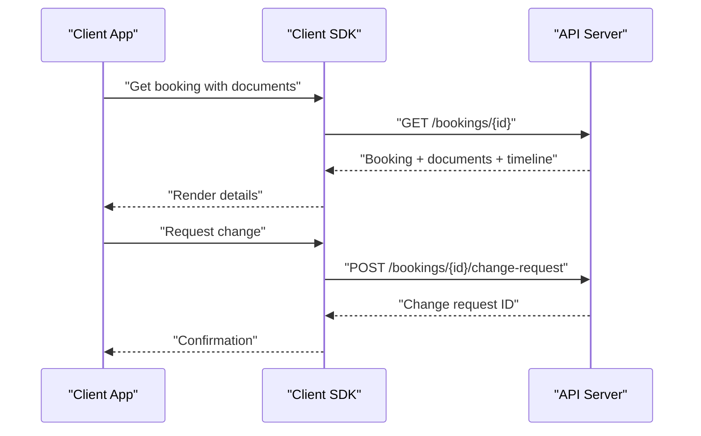

**Diagram sources**
- [packages/client-sdk/src/services/booking.service.ts](file://packages/client-sdk/src/services/booking.service.ts#L218-L245)
- [packages/client-sdk/src/services/booking.service.ts](file://packages/client-sdk/src/services/booking.service.ts#L309-L316)

**Section sources**
- [packages/client-sdk/src/services/booking.service.ts](file://packages/client-sdk/src/services/booking.service.ts#L218-L245)
- [packages/client-sdk/src/services/booking.service.ts](file://packages/client-sdk/src/services/booking.service.ts#L309-L316)

### Storage, Versioning, and Audit Trail
- Versioning: Bookings include a version field to support optimistic concurrency control
- Storage: File upload metadata standardized across categories and entities
- Audit trail: Timeline arrays capture actions, timestamps, actors, and details

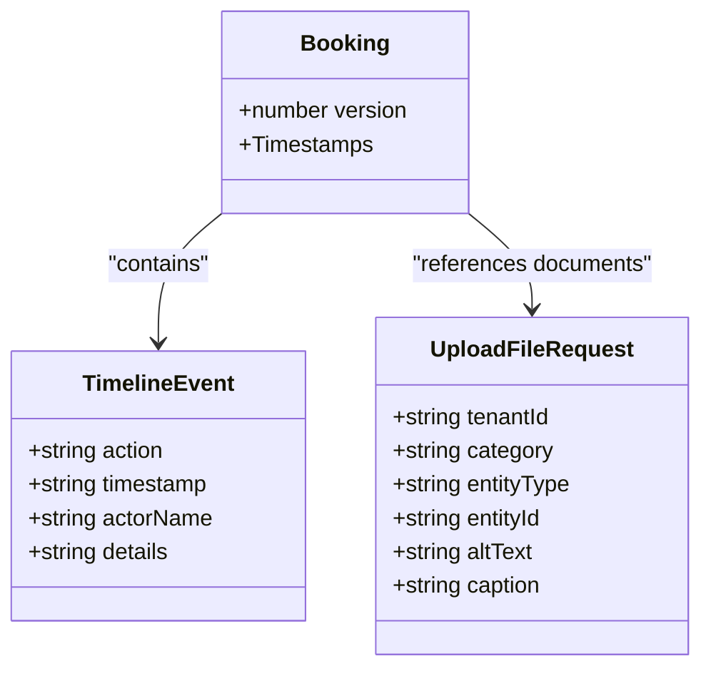

**Diagram sources**
- [packages/contracts/src/schemas/booking.schema.ts](file://packages/contracts/src/schemas/booking.schema.ts#L57-L61)
- [apps/api/src/modules/booking/booking.mapper.ts](file://apps/api/src/modules/booking/booking.mapper.ts#L500-L516)
- [packages/contracts/src/storage.ts](file://packages/contracts/src/storage.ts#L7-L29)

**Section sources**
- [packages/contracts/src/schemas/booking.schema.ts](file://packages/contracts/src/schemas/booking.schema.ts#L57-L61)
- [apps/api/src/modules/booking/booking.mapper.ts](file://apps/api/src/modules/booking/booking.mapper.ts#L500-L516)
- [packages/contracts/src/storage.ts](file://packages/contracts/src/storage.ts#L7-L29)

### Relationship to Booking Approvals, Payment Terms, and Cancellation Policies
- Booking approvals: Change requests and timelines reflect approval workflows
- Payment terms: Payment status and breakdown are part of projections and receipts
- Cancellation policies: Cancellation notice and refund percent are embedded in rental object rules

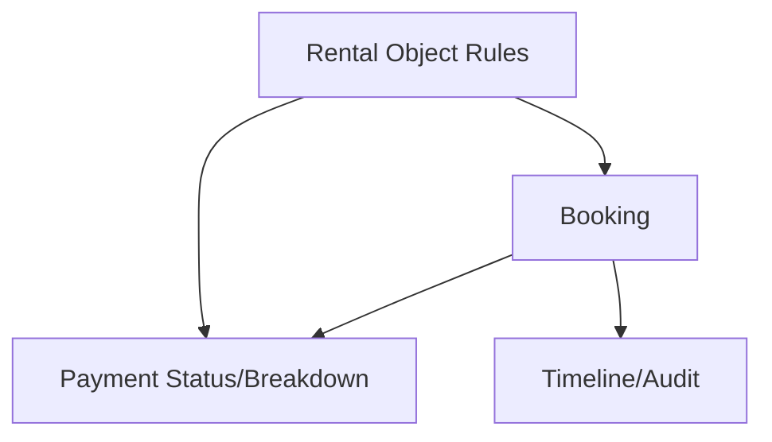

**Diagram sources**
- [packages/contracts/src/projections/booking.projection.ts](file://packages/contracts/src/projections/booking.projection.ts#L76-L86)
- [packages/contracts/src/schemas/rental-object.schema.ts](file://packages/contracts/src/schemas/rental-object.schema.ts#L136-L139)
- [apps/api/src/modules/booking/booking.mapper.ts](file://apps/api/src/modules/booking/booking.mapper.ts#L500-L516)

**Section sources**
- [packages/contracts/src/projections/booking.projection.ts](file://packages/contracts/src/projections/booking.projection.ts#L76-L86)
- [packages/contracts/src/schemas/rental-object.schema.ts](file://packages/contracts/src/schemas/rental-object.schema.ts#L136-L139)
- [apps/api/src/modules/booking/booking.mapper.ts](file://apps/api/src/modules/booking/booking.mapper.ts#L500-L516)

## Dependency Analysis
The contracts package re-exports schemas, projections, storage, monitoring, and modules, ensuring a centralized contract surface across the platform.

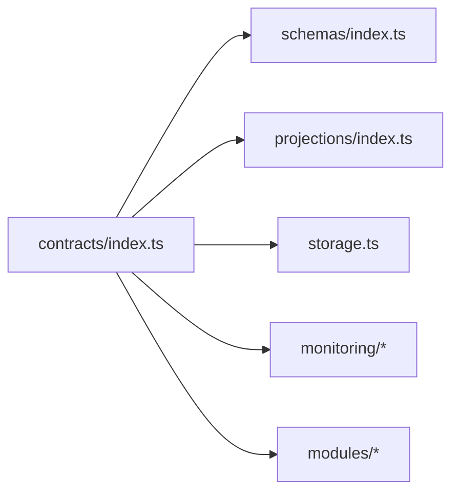

**Diagram sources**
- [packages/contracts/src/index.ts](file://packages/contracts/src/index.ts#L34-L51)
- [packages/contracts/src/schemas/index.ts](file://packages/contracts/src/schemas/index.ts#L7-L17)
- [packages/contracts/src/projections/index.ts](file://packages/contracts/src/projections/index.ts#L7-L11)

**Section sources**
- [packages/contracts/src/index.ts](file://packages/contracts/src/index.ts#L34-L51)
- [packages/contracts/src/schemas/index.ts](file://packages/contracts/src/schemas/index.ts#L7-L17)
- [packages/contracts/src/projections/index.ts](file://packages/contracts/src/projections/index.ts#L7-L11)

## Performance Considerations
- Prefer projection schemas for UI rendering to minimize computation overhead
- Use query parameters for efficient filtering and pagination
- Batch file uploads and leverage metadata to reduce round trips
- Cache frequently accessed schemas and types at the SDK boundary

[No sources needed since this section provides general guidance]

## Troubleshooting Guide
Common issues and resolutions:
- Validation failures: Ensure inputs satisfy schema constraints (times, amounts, currency codes)
- Missing documents: Verify upload metadata and entity linkage
- Audit gaps: Confirm timeline events are populated during state transitions

**Section sources**
- [packages/contracts/src/schemas/booking.schema.ts](file://packages/contracts/src/schemas/booking.schema.ts#L58-L61)
- [packages/contracts/src/storage.ts](file://packages/contracts/src/storage.ts#L7-L29)
- [apps/api/src/modules/booking/booking.mapper.ts](file://apps/api/src/modules/booking/booking.mapper.ts#L500-L516)

## Conclusion
The contract management system leverages a shared contracts package to enforce strong typing, validation, and UI-ready projections. It integrates seamlessly with booking and calendar systems, supports template and document management, and provides robust workflows for digital signatures, approvals, payments, and cancellations. Versioning, storage contracts, and audit trails ensure traceability and reliability across the contract lifecycle.

[No sources needed since this section summarizes without analyzing specific files]

## Appendices
- OpenAPI generation from schemas is supported via the provided tooling
- Adding new contracts follows a structured process: create schema, create projection, export in indices, and update types

**Section sources**
- [packages/contracts/README.md](file://packages/contracts/README.md#L161-L170)
- [packages/contracts/README.md](file://packages/contracts/README.md#L114-L159)