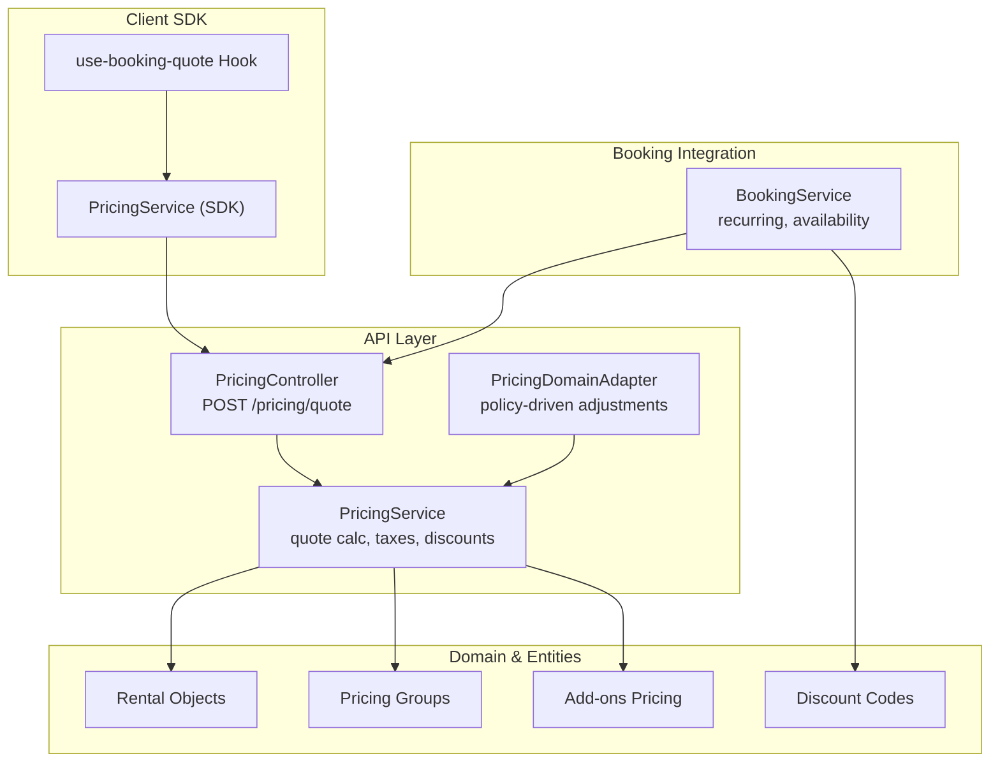
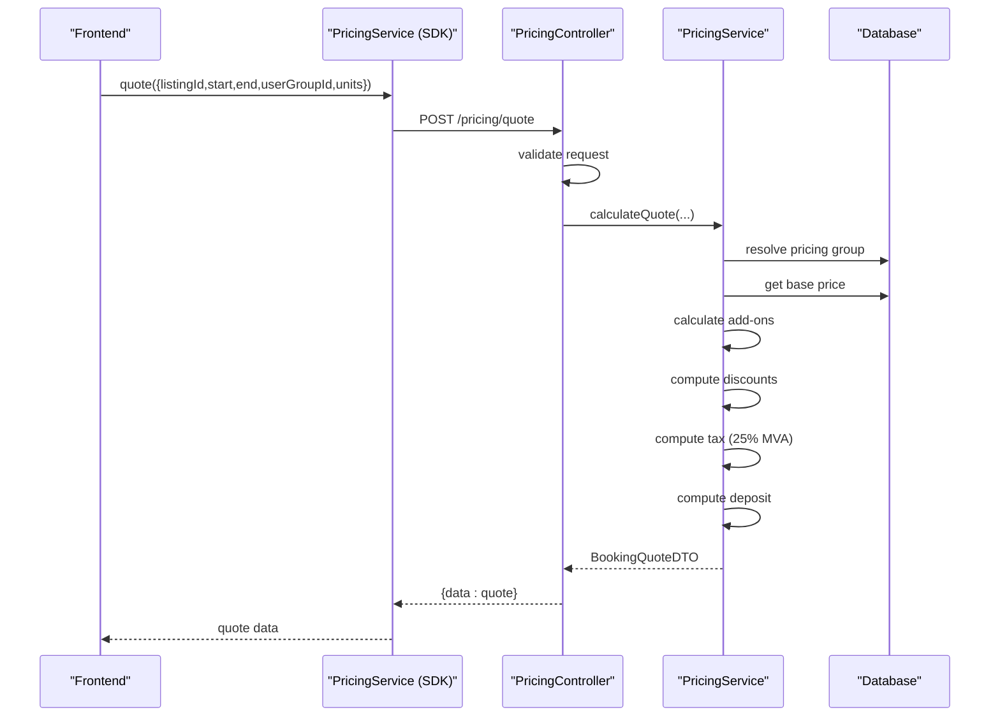
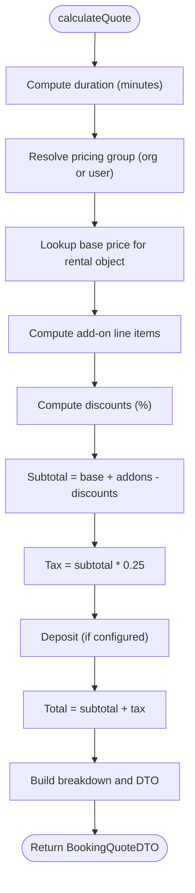
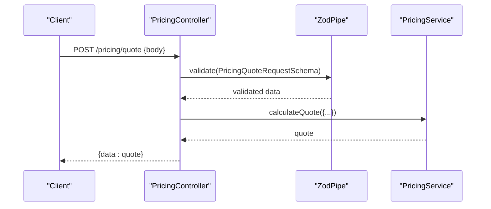
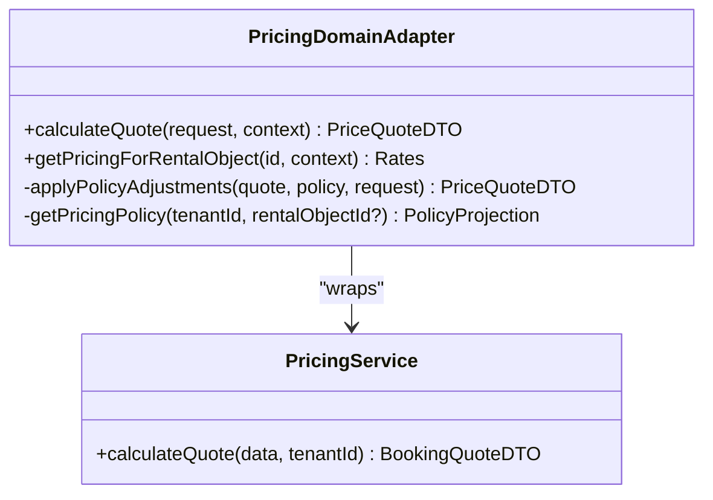
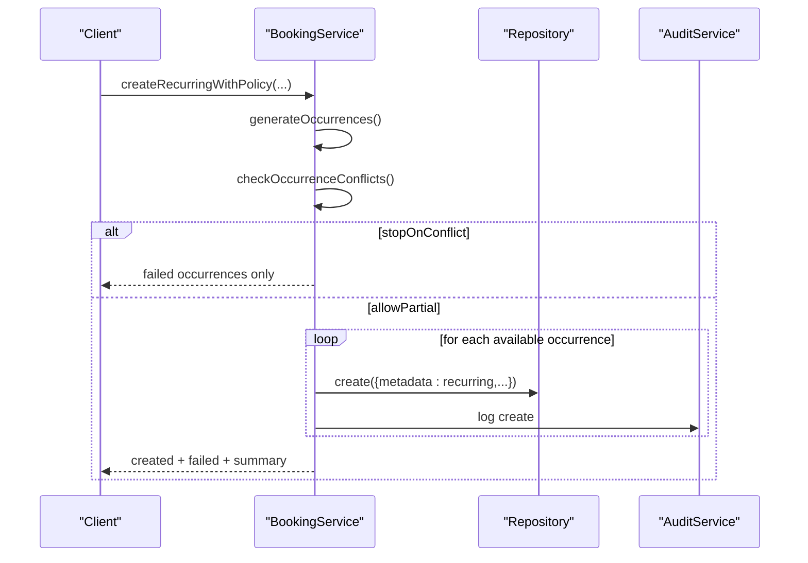
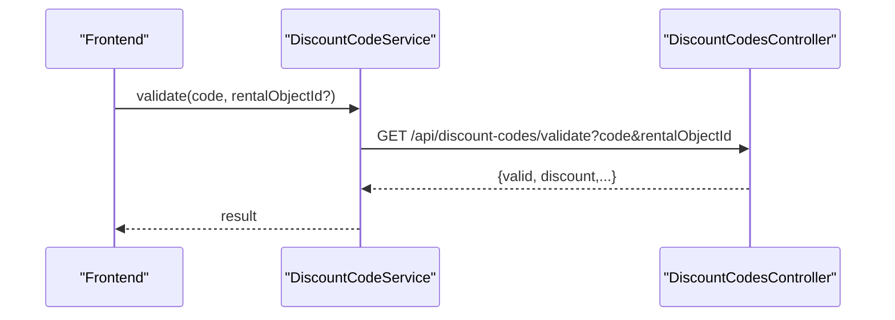
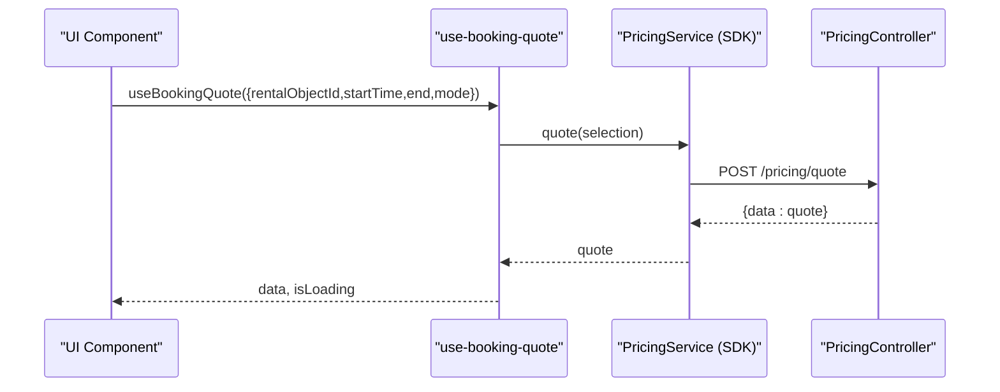
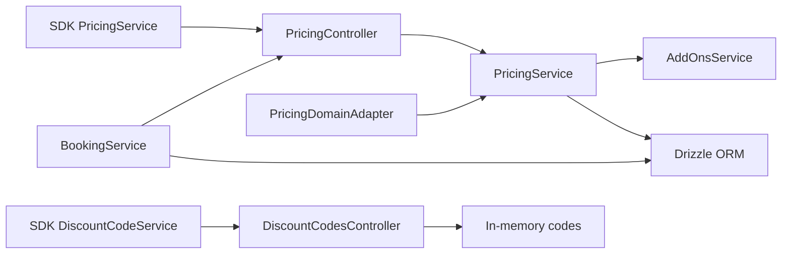

# Pricing & Quote System

<cite>
**Referenced Files in This Document**
- [pricing.controller.ts](file://apps/api/src/modules/pricing/pricing.controller.ts)
- [pricing.service.ts](file://apps/api/src/modules/pricing/pricing.service.ts)
- [pricing.schema.ts](file://apps/api/src/schemas/pricing.schema.ts)
- [pricing.adapter.ts](file://apps/api/src/modules/domain/adapters/pricing.adapter.ts)
- [booking.service.ts](file://apps/api/src/modules/booking/booking.service.ts)
- [pricing.service.ts (client-sdk)](file://packages/client-sdk/src/services/pricing.service.ts)
- [use-booking-quote.ts](file://packages/client-sdk/src/hooks/use-booking-quote.ts)
- [discount-codes.controller.ts](file://apps/api/src/modules/discount-codes/discount-codes.controller.ts)
- [discount-code.service.ts](file://packages/client-sdk/src/services/discount-code.service.ts)
- [openapi.yaml](file://apps/api/docs/openapi.yaml)
</cite>

## Table of Contents
1. [Introduction](#introduction)
2. [Project Structure](#project-structure)
3. [Core Components](#core-components)
4. [Architecture Overview](#architecture-overview)
5. [Detailed Component Analysis](#detailed-component-analysis)
6. [Dependency Analysis](#dependency-analysis)
7. [Performance Considerations](#performance-considerations)
8. [Troubleshooting Guide](#troubleshooting-guide)
9. [Conclusion](#conclusion)
10. [Appendices](#appendices)

## Introduction
This document describes the pricing and quote generation system responsible for calculating booking costs and displaying pricing information. It covers the pricing engine architecture, rule-based calculation algorithms, and dynamic pricing models. It also explains the quote generation process including tax calculations, discount application, and seasonal pricing adjustments, along with integration with rental object categories, availability periods, and promotional codes. The document details the pricing controller endpoints for real-time quote calculation, price validation, and cost breakdown display, and outlines support for recurring bookings, partial cancellations, and prorated charges. Finally, it documents integration points with payment processing and invoice generation.

## Project Structure
The pricing system spans backend APIs, domain adapters, client SDKs, and discount code management. The primary backend components are:
- Pricing controller and service for quote calculation
- Pricing adapter for policy-driven adjustments
- Booking service for recurring and availability-related operations
- Client SDK services and hooks for front-end integration
- Discount codes controller and client SDK service for promotional code validation

**Diagram sources**
- [pricing.controller.ts](file://apps/api/src/modules/pricing/pricing.controller.ts#L14-L62)
- [pricing.service.ts](file://apps/api/src/modules/pricing/pricing.service.ts#L198-L317)
- [pricing.adapter.ts](file://apps/api/src/modules/domain/adapters/pricing.adapter.ts#L105-L152)
- [booking.service.ts](file://apps/api/src/modules/booking/booking.service.ts#L565-L774)
- [pricing.service.ts (client-sdk)](file://packages/client-sdk/src/services/pricing.service.ts#L61-L178)
- [use-booking-quote.ts](file://packages/client-sdk/src/hooks/use-booking-quote.ts#L61-L82)

**Section sources**
- [pricing.controller.ts](file://apps/api/src/modules/pricing/pricing.controller.ts#L1-L65)
- [pricing.service.ts](file://apps/api/src/modules/pricing/pricing.service.ts#L1-L485)
- [pricing.adapter.ts](file://apps/api/src/modules/domain/adapters/pricing.adapter.ts#L1-L252)
- [booking.service.ts](file://apps/api/src/modules/booking/booking.service.ts#L1-L1240)
- [pricing.service.ts (client-sdk)](file://packages/client-sdk/src/services/pricing.service.ts#L1-L202)
- [use-booking-quote.ts](file://packages/client-sdk/src/hooks/use-booking-quote.ts#L1-L204)

## Core Components
- PricingController: Exposes a POST endpoint to calculate quotes server-side with strict request validation and error handling.
- PricingService: Implements the quote calculation pipeline including pricing group resolution, base price lookup, add-on line items, discount computation, tax calculation (25% MVA), deposit determination, and cost breakdown assembly.
- PricingDomainAdapter: Wraps the PricingService with policy-aware behavior, applying member discounts and overriding rates when policies are present.
- BookingService: Provides recurring booking creation and conflict handling, including preview and series metadata, and integrates with pricing for totals.
- Client SDK PricingService and use-booking-quote hook: Enable front-end quote retrieval and recurring previews with caching and invalidation.
- Discount Codes: In-memory controller and SDK service for listing, validating, and managing promotional codes.

**Section sources**
- [pricing.controller.ts](file://apps/api/src/modules/pricing/pricing.controller.ts#L14-L62)
- [pricing.service.ts](file://apps/api/src/modules/pricing/pricing.service.ts#L198-L317)
- [pricing.adapter.ts](file://apps/api/src/modules/domain/adapters/pricing.adapter.ts#L105-L250)
- [booking.service.ts](file://apps/api/src/modules/booking/booking.service.ts#L565-L774)
- [pricing.service.ts (client-sdk)](file://packages/client-sdk/src/services/pricing.service.ts#L61-L178)
- [use-booking-quote.ts](file://packages/client-sdk/src/hooks/use-booking-quote.ts#L61-L82)
- [discount-codes.controller.ts](file://apps/api/src/modules/discount-codes/discount-codes.controller.ts#L41-L59)
- [discount-code.service.ts](file://packages/client-sdk/src/services/discount-code.service.ts#L52-L117)

## Architecture Overview
The system follows a layered architecture:
- Presentation: PricingController validates requests and delegates to PricingService.
- Application: PricingService orchestrates pricing logic and interacts with repositories and add-ons.
- Domain: PricingDomainAdapter applies policy-driven adjustments on top of PricingService.
- Persistence: Drizzle ORM-backed tables for pricing groups, rental object pricing, and related entities.
- Client Integration: SDK services and React Query hooks for real-time quote retrieval and recurring previews.

**Diagram sources**
- [pricing.controller.ts](file://apps/api/src/modules/pricing/pricing.controller.ts#L26-L61)
- [pricing.service.ts](file://apps/api/src/modules/pricing/pricing.service.ts#L201-L317)
- [pricing.schema.ts](file://apps/api/src/schemas/pricing.schema.ts#L10-L18)
- [pricing.service.ts (client-sdk)](file://packages/client-sdk/src/services/pricing.service.ts#L163-L178)

## Detailed Component Analysis

### Pricing Engine and Quote Calculation
The PricingService performs the following steps:
- Duration calculation in minutes
- Pricing group resolution (organization or user)
- Base price lookup per rental object and pricing group
- Add-on line items computed via AddOnsService
- Discounts derived from rental object pricing percentage
- Subtotal, tax (25% MVA), and deposit computation
- Full price breakdown and currency formatting

**Diagram sources**
- [pricing.service.ts](file://apps/api/src/modules/pricing/pricing.service.ts#L201-L317)

**Section sources**
- [pricing.service.ts](file://apps/api/src/modules/pricing/pricing.service.ts#L198-L317)

### Pricing Controller Endpoints
- POST /pricing/quote: Validates request payload and returns a quote. Errors are handled with Problem Details responses.

**Diagram sources**
- [pricing.controller.ts](file://apps/api/src/modules/pricing/pricing.controller.ts#L26-L61)
- [pricing.schema.ts](file://apps/api/src/schemas/pricing.schema.ts#L10-L18)

**Section sources**
- [pricing.controller.ts](file://apps/api/src/modules/pricing/pricing.controller.ts#L14-L62)
- [pricing.schema.ts](file://apps/api/src/schemas/pricing.schema.ts#L1-L76)

### Policy-Driven Pricing Adjustments
The PricingDomainAdapter augments PricingService with:
- Policy retrieval for tenant and optional rental object
- Member discount application when user group is present
- Rate overrides for base hourly/daily rates when policy defines defaults

**Diagram sources**
- [pricing.adapter.ts](file://apps/api/src/modules/domain/adapters/pricing.adapter.ts#L105-L250)
- [pricing.service.ts](file://apps/api/src/modules/pricing/pricing.service.ts#L198-L317)

**Section sources**
- [pricing.adapter.ts](file://apps/api/src/modules/domain/adapters/pricing.adapter.ts#L101-L250)

### Recurring Bookings and Conflict Policies
The BookingService supports:
- Recurring series creation with frequency and end conditions
- Conflict detection and policy-driven handling (stopOnConflict, allowPartial)
- Series metadata and summary for created/failed occurrences
- Integration with pricing for totals

**Diagram sources**
- [booking.service.ts](file://apps/api/src/modules/booking/booking.service.ts#L565-L774)

**Section sources**
- [booking.service.ts](file://apps/api/src/modules/booking/booking.service.ts#L565-L774)

### Discount Codes Integration
- Backend: DiscountCodesController exposes listing and validation endpoints (in-memory).
- Frontend: SDK service supports listing, validating, toggling activation, and creating/updating discount codes.

**Diagram sources**
- [discount-codes.controller.ts](file://apps/api/src/modules/discount-codes/discount-codes.controller.ts#L41-L59)
- [discount-code.service.ts](file://packages/client-sdk/src/services/discount-code.service.ts#L100-L107)
- [openapi.yaml](file://apps/api/docs/openapi.yaml#L927-L949)

**Section sources**
- [discount-codes.controller.ts](file://apps/api/src/modules/discount-codes/discount-codes.controller.ts#L1-L59)
- [discount-code.service.ts](file://packages/client-sdk/src/services/discount-code.service.ts#L52-L117)
- [openapi.yaml](file://apps/api/docs/openapi.yaml#L924-L949)

### Client SDK Integration
- PricingService (SDK): Provides quote retrieval and pricing group operations.
- use-booking-quote hook: Fetches quote projections with caching and enables/disables based on selection criteria.

**Diagram sources**
- [use-booking-quote.ts](file://packages/client-sdk/src/hooks/use-booking-quote.ts#L61-L82)
- [pricing.service.ts (client-sdk)](file://packages/client-sdk/src/services/pricing.service.ts#L163-L178)
- [pricing.controller.ts](file://apps/api/src/modules/pricing/pricing.controller.ts#L26-L61)

**Section sources**
- [pricing.service.ts (client-sdk)](file://packages/client-sdk/src/services/pricing.service.ts#L61-L178)
- [use-booking-quote.ts](file://packages/client-sdk/src/hooks/use-booking-quote.ts#L61-L82)

## Dependency Analysis
- PricingController depends on PricingService and Zod validation.
- PricingService depends on Drizzle ORM, AddOnsService, and DTOs.
- PricingDomainAdapter depends on PricingService and a PolicyServiceInterface.
- BookingService depends on BookingRepository, RentalObjectRepository, and PricingService for totals.
- Client SDK PricingService depends on HTTP client and base service utilities.
- Discount code endpoints depend on in-memory storage; SDK depends on HTTP client.

**Diagram sources**
- [pricing.controller.ts](file://apps/api/src/modules/pricing/pricing.controller.ts#L16-L18)
- [pricing.service.ts](file://apps/api/src/modules/pricing/pricing.service.ts#L36-L42)
- [pricing.adapter.ts](file://apps/api/src/modules/domain/adapters/pricing.adapter.ts#L105-L115)
- [booking.service.ts](file://apps/api/src/modules/booking/booking.service.ts#L45-L49)
- [discount-codes.controller.ts](file://apps/api/src/modules/discount-codes/discount-codes.controller.ts#L14-L15)
- [discount-code.service.ts](file://packages/client-sdk/src/services/discount-code.service.ts#L52-L117)

**Section sources**
- [pricing.controller.ts](file://apps/api/src/modules/pricing/pricing.controller.ts#L1-L65)
- [pricing.service.ts](file://apps/api/src/modules/pricing/pricing.service.ts#L1-L485)
- [pricing.adapter.ts](file://apps/api/src/modules/domain/adapters/pricing.adapter.ts#L1-L252)
- [booking.service.ts](file://apps/api/src/modules/booking/booking.service.ts#L1-L1240)
- [discount-codes.controller.ts](file://apps/api/src/modules/discount-codes/discount-codes.controller.ts#L1-L59)
- [discount-code.service.ts](file://packages/client-sdk/src/services/discount-code.service.ts#L52-L117)

## Performance Considerations
- Quote calculation is CPU-bound and lightweight; cache results for short-lived selections.
- Use optimistic concurrency for booking updates to reduce contention.
- Keep discount and add-on computations minimal; defer heavy operations to background jobs if needed.
- Monitor database queries for pricing group and rental object pricing lookups.

## Troubleshooting Guide
- Validation errors: The PricingController returns structured Problem Details for invalid requests.
- Internal errors: Unhandled exceptions are caught and returned as internal server errors.
- Availability conflicts: BookingService throws descriptive errors when buffer time overlaps occur.
- Policy failures: PricingDomainAdapter logs warnings when policy retrieval fails and falls back to legacy behavior.

**Section sources**
- [pricing.controller.ts](file://apps/api/src/modules/pricing/pricing.controller.ts#L43-L60)
- [booking.service.ts](file://apps/api/src/modules/booking/booking.service.ts#L87-L92)
- [pricing.adapter.ts](file://apps/api/src/modules/domain/adapters/pricing.adapter.ts#L206-L212)

## Conclusion
The pricing and quote system provides a robust, policy-aware foundation for calculating booking costs. It supports tiered pricing, add-ons, discounts, taxes, and deposits while integrating with recurring bookings and promotional codes. The SDK ensures seamless front-end integration with caching and real-time previews. Extending the system to include advanced seasonal pricing, prorated charges, and payment/invoice integration is straightforward through the existing adapters and service boundaries.

## Appendices

### API Endpoints Summary
- POST /pricing/quote: Real-time quote calculation with validation and error handling.
- GET /api/discount-codes: List discount codes.
- GET /api/discount-codes/validate: Validate a discount code against a rental object.

**Section sources**
- [pricing.controller.ts](file://apps/api/src/modules/pricing/pricing.controller.ts#L26-L61)
- [openapi.yaml](file://apps/api/docs/openapi.yaml#L927-L949)
- [discount-codes.controller.ts](file://apps/api/src/modules/discount-codes/discount-codes.controller.ts#L41-L59)