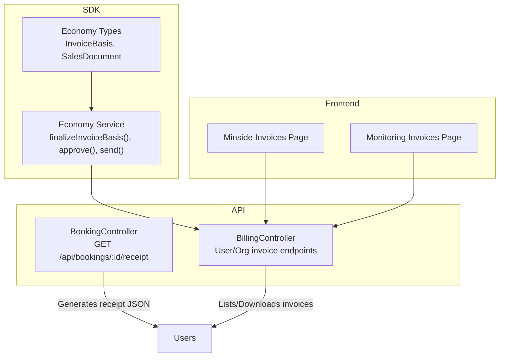
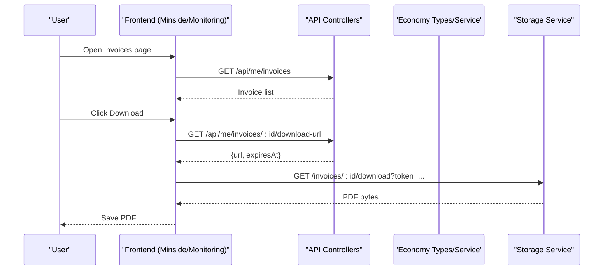
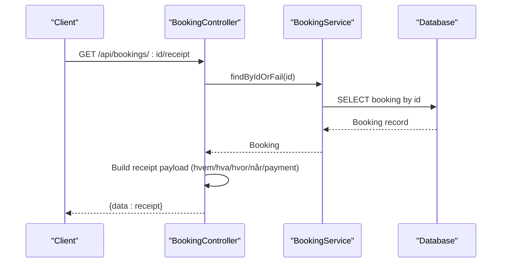
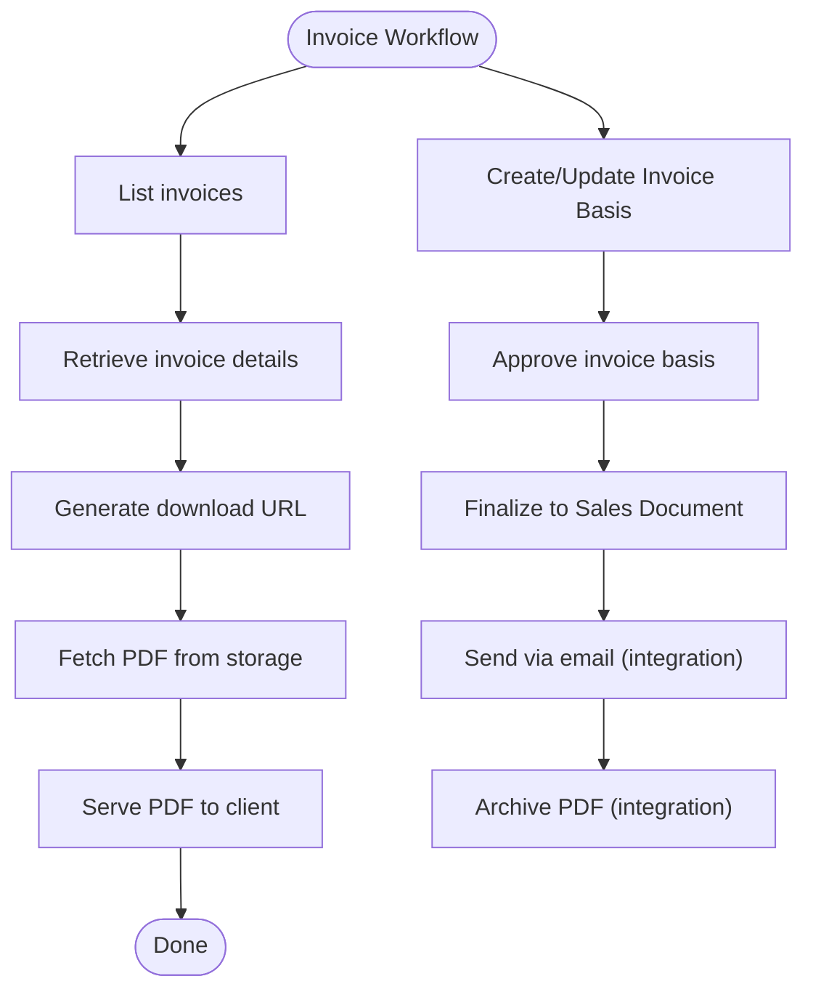
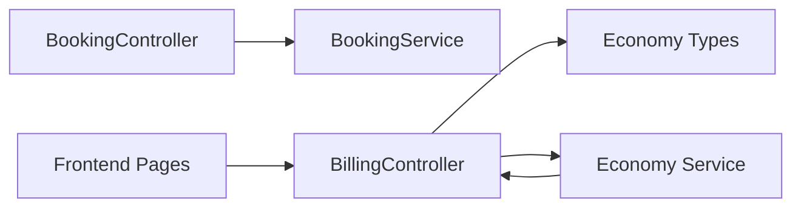

# Receipt & Invoice Generation

<cite>
**Referenced Files in This Document**
- [booking.controller.ts](file://apps/api/src/modules/booking/booking.controller.ts)
- [booking.service.ts](file://apps/api/src/modules/booking/booking.service.ts)
- [billing.controller.ts](file://apps/api/src/modules/billing/billing.controller.ts)
- [booking-receipt.test.ts](file://apps/api/tests/integration/booking-receipt.test.ts)
- [economy.ts](file://packages/client-sdk/src/types/economy.ts)
- [economy.service.ts](file://packages/client-sdk/src/services/economy.service.ts)
- [invoices.tsx (minside)](file://apps/minside/src/routes/org/invoices.tsx)
- [billing.tsx (minside)](file://apps/minside/src/routes/billing.tsx)
- [invoices.tsx (monitoring)](file://apps/monitoring/src/routes/org/invoices.tsx)
- [billing.tsx (monitoring)](file://apps/monitoring/src/routes/billing.tsx)
</cite>

## Table of Contents
1. [Introduction](#introduction)
2. [Project Structure](#project-structure)
3. [Core Components](#core-components)
4. [Architecture Overview](#architecture-overview)
5. [Detailed Component Analysis](#detailed-component-analysis)
6. [Dependency Analysis](#dependency-analysis)
7. [Performance Considerations](#performance-considerations)
8. [Troubleshooting Guide](#troubleshooting-guide)
9. [Conclusion](#conclusion)
10. [Appendices](#appendices)

## Introduction
This document describes the receipt and invoice generation system that produces official booking documentation. It covers:
- Receipt creation process: numbering schemes, customer information formatting, and service details compilation
- Invoice generation workflow: accounting-ready structure, line items, totals, taxes, and payment tracking
- Controller endpoints for PDF generation, download URLs, email delivery hooks, and archival storage
- Integration with billing systems for payment confirmation and financial reporting
- Templates, custom branding, and multi-language support
- Compliance requirements for fiscal documentation and audit trail preservation

## Project Structure
The system spans backend controllers, frontend UIs, and SDK types/services that model the economy domain. The most relevant areas are:
- Backend receipts: booking controller endpoint for generating receipt data
- Backend invoices: billing controller for listing, retrieving, and downloading invoices
- Economy domain types and services: modeling invoice bases, sales documents, and finalize/send workflows
- Frontend invoice lists and download actions

**Diagram sources**
- [booking.controller.ts](file://apps/api/src/modules/booking/booking.controller.ts#L275-L324)
- [billing.controller.ts](file://apps/api/src/modules/billing/billing.controller.ts#L126-L227)
- [economy.ts](file://packages/client-sdk/src/types/economy.ts#L41-L135)
- [economy.service.ts](file://packages/client-sdk/src/services/economy.service.ts#L89-L125)
- [invoices.tsx (minside)](file://apps/minside/src/routes/org/invoices.tsx#L167-L202)
- [billing.tsx (minside)](file://apps/minside/src/routes/billing.tsx#L223-L293)
- [invoices.tsx (monitoring)](file://apps/monitoring/src/routes/org/invoices.tsx#L167-L202)
- [billing.tsx (monitoring)](file://apps/monitoring/src/routes/billing.tsx#L223-L293)

**Section sources**
- [booking.controller.ts](file://apps/api/src/modules/booking/booking.controller.ts#L275-L324)
- [billing.controller.ts](file://apps/api/src/modules/billing/billing.controller.ts#L126-L227)
- [economy.ts](file://packages/client-sdk/src/types/economy.ts#L41-L135)
- [economy.service.ts](file://packages/client-sdk/src/services/economy.service.ts#L89-L125)
- [invoices.tsx (minside)](file://apps/minside/src/routes/org/invoices.tsx#L167-L202)
- [billing.tsx (minside)](file://apps/minside/src/routes/billing.tsx#L223-L293)
- [invoices.tsx (monitoring)](file://apps/monitoring/src/routes/org/invoices.tsx#L167-L202)
- [billing.tsx (monitoring)](file://apps/monitoring/src/routes/billing.tsx#L223-L293)

## Core Components
- Receipt generation endpoint: builds a receipt payload with standardized sections (who, what, where, when) and payment details
- Invoice endpoints: list, retrieve, and download invoices; provide temporary download URLs
- Economy domain: models invoice bases and sales documents, supports finalization and approval workflows
- Frontend pages: render invoice lists and trigger downloads

Key responsibilities:
- Receipt numbering scheme and temporal fields
- Customer and service details formatting
- Line item composition and totals for invoices
- Payment status and due date tracking
- PDF generation and archival integration
- Multi-language and branding hooks

**Section sources**
- [booking.controller.ts](file://apps/api/src/modules/booking/booking.controller.ts#L275-L324)
- [billing.controller.ts](file://apps/api/src/modules/billing/billing.controller.ts#L126-L227)
- [economy.ts](file://packages/client-sdk/src/types/economy.ts#L41-L135)
- [economy.service.ts](file://packages/client-sdk/src/services/economy.service.ts#L89-L125)

## Architecture Overview
The system integrates controllers, domain types, and UIs to produce and manage official documents.

**Diagram sources**
- [billing.controller.ts](file://apps/api/src/modules/billing/billing.controller.ts#L126-L227)
- [economy.ts](file://packages/client-sdk/src/types/economy.ts#L41-L135)
- [economy.service.ts](file://packages/client-sdk/src/services/economy.service.ts#L89-L125)
- [billing.tsx (minside)](file://apps/minside/src/routes/billing.tsx#L223-L293)
- [invoices.tsx (minside)](file://apps/minside/src/routes/org/invoices.tsx#L167-L202)
- [billing.tsx (monitoring)](file://apps/monitoring/src/routes/billing.tsx#L223-L293)
- [invoices.tsx (monitoring)](file://apps/monitoring/src/routes/org/invoices.tsx#L167-L202)

## Detailed Component Analysis

### Receipt Creation Workflow
The receipt endpoint compiles a structured payload aligned with accounting requirements (who, what, where, when) and payment details.

Receipt fields include:
- Numbering scheme: prefix plus booking identifier
- Customer: user and tenant identifiers
- Service: rental object, description, and duration
- Location: tenant and rental object identifiers
- Timing: booking date, service date, and receipt generation timestamp
- Payment: amount, currency, and status

**Diagram sources**
- [booking.controller.ts](file://apps/api/src/modules/booking/booking.controller.ts#L275-L324)
- [booking.service.ts](file://apps/api/src/modules/booking/booking.service.ts#L140-L152)

**Section sources**
- [booking.controller.ts](file://apps/api/src/modules/booking/booking.controller.ts#L275-L324)
- [booking.service.ts](file://apps/api/src/modules/booking/booking.service.ts#L140-L152)
- [booking-receipt.test.ts](file://apps/api/tests/integration/booking-receipt.test.ts#L28-L94)

### Invoice Generation Workflow
The invoice endpoints expose listing, retrieval, and download capabilities. The economy domain models invoice bases and sales documents, enabling finalization and approval.

Invoice data model highlights:
- Invoice number, booking association, organization, amounts, currency, status, due date, issued/paid timestamps
- Line items with description, quantity, unit price, amount, VAT rate
- Status lifecycle: draft, sent, paid, overdue, cancelled

**Diagram sources**
- [billing.controller.ts](file://apps/api/src/modules/billing/billing.controller.ts#L126-L227)
- [economy.ts](file://packages/client-sdk/src/types/economy.ts#L41-L135)
- [economy.service.ts](file://packages/client-sdk/src/services/economy.service.ts#L89-L125)

**Section sources**
- [billing.controller.ts](file://apps/api/src/modules/billing/billing.controller.ts#L126-L227)
- [economy.ts](file://packages/client-sdk/src/types/economy.ts#L41-L135)
- [economy.service.ts](file://packages/client-sdk/src/services/economy.service.ts#L89-L125)

### Receipt Controller Endpoints
- GET /api/bookings/:id/receipt
  - Returns receipt payload with numbering scheme, customer info, service details, location, timing, and payment fields
  - Validates booking existence and responds with appropriate HTTP status codes

Integration notes:
- PDF generation: endpoint returns JSON receipt payload; PDF generation is indicated as a future enhancement
- Email delivery: not implemented in the receipt endpoint; intended for later integration
- Archival storage: not implemented in the receipt endpoint; intended for later integration

**Section sources**
- [booking.controller.ts](file://apps/api/src/modules/booking/booking.controller.ts#L275-L324)
- [booking-receipt.test.ts](file://apps/api/tests/integration/booking-receipt.test.ts#L28-L117)

### Invoice Controller Endpoints
- GET /api/me/billing/summary
- GET /api/me/invoices
- GET /api/me/invoices/:id
- GET /api/me/invoices/:id/download
- GET /api/me/invoices/:id/download-url
- GET /api/orgs/:orgId/billing/summary
- GET /api/orgs/:orgId/invoices
- GET /api/orgs/:orgId/invoices/:id
- GET /api/orgs/:orgId/invoices/:id/download

Behavior:
- Listing and retrieval endpoints return invoice data
- Download endpoints return PDF content or a temporary signed URL
- Mock implementations indicate production-ready placeholders for PDF generation and storage integration

**Section sources**
- [billing.controller.ts](file://apps/api/src/modules/billing/billing.controller.ts#L104-L327)

### Frontend Integration
- Minside and Monitoring invoice pages display invoice lists and enable downloads
- Actions trigger download URL retrieval and subsequent PDF fetching from storage

**Section sources**
- [invoices.tsx (minside)](file://apps/minside/src/routes/org/invoices.tsx#L167-L202)
- [billing.tsx (minside)](file://apps/minside/src/routes/billing.tsx#L223-L293)
- [invoices.tsx (monitoring)](file://apps/monitoring/src/routes/org/invoices.tsx#L167-L202)
- [billing.tsx (monitoring)](file://apps/monitoring/src/routes/billing.tsx#L223-L293)

### Economy Domain: Invoice Bases and Sales Documents
The SDK defines:
- InvoiceBasis: aggregation of bookings, line items, totals, currency, status, and generation source
- SalesDocument: finalized invoice with invoice number, organization details, line items, totals, status, dates, payment terms, and optional PDF URL
- Operations: approve, finalize to sales document, send sales document, mark as paid

These types and operations underpin the invoice generation workflow and align with accounting requirements.

**Section sources**
- [economy.ts](file://packages/client-sdk/src/types/economy.ts#L41-L135)
- [economy.service.ts](file://packages/client-sdk/src/services/economy.service.ts#L89-L125)

## Dependency Analysis
The receipt and invoice system exhibits clear separation of concerns:
- Controllers depend on services for business logic
- Services rely on repositories and schemas for data access and validation
- Economy types and services define the financial domain contracts
- Frontends consume controllers and SDK services

**Diagram sources**
- [booking.controller.ts](file://apps/api/src/modules/booking/booking.controller.ts#L21-L25)
- [booking.service.ts](file://apps/api/src/modules/booking/booking.service.ts#L43-L49)
- [billing.controller.ts](file://apps/api/src/modules/billing/billing.controller.ts#L17-L18)
- [economy.ts](file://packages/client-sdk/src/types/economy.ts#L41-L135)
- [economy.service.ts](file://packages/client-sdk/src/services/economy.service.ts#L89-L125)

**Section sources**
- [booking.controller.ts](file://apps/api/src/modules/booking/booking.controller.ts#L21-L25)
- [booking.service.ts](file://apps/api/src/modules/booking/booking.service.ts#L43-L49)
- [billing.controller.ts](file://apps/api/src/modules/billing/billing.controller.ts#L17-L18)
- [economy.ts](file://packages/client-sdk/src/types/economy.ts#L41-L135)
- [economy.service.ts](file://packages/client-sdk/src/services/economy.service.ts#L89-L125)

## Performance Considerations
- Receipt endpoint: lightweight JSON payload; minimal computation
- Invoice endpoints: pagination and filtering supported; consider indexing on invoice status and dates for efficient queries
- PDF generation: offload to background jobs or external services to avoid blocking requests
- Download URL generation: cache short-lived tokens to reduce repeated signing operations

## Troubleshooting Guide
Common issues and resolutions:
- Non-existent booking ID: receipt endpoint returns 404; ensure valid UUIDs and tenant scoping
- Invalid UUID format: endpoint returns 400 or 404; validate input early
- Invoice not found: invoice endpoints return 404 with structured problem details; verify IDs and tenant context
- Download failures: check storage service connectivity and token validity; ensure signed URL expiration is handled gracefully

**Section sources**
- [booking-receipt.test.ts](file://apps/api/tests/integration/booking-receipt.test.ts#L108-L117)
- [billing.controller.ts](file://apps/api/src/modules/billing/billing.controller.ts#L160-L174)
- [billing.controller.ts](file://apps/api/src/modules/billing/billing.controller.ts#L207-L226)

## Conclusion
The system provides a solid foundation for receipt and invoice generation:
- Receipts are structured and include all required sections for accounting
- Invoices are modeled with line items, totals, and statuses suitable for financial reporting
- Controllers expose endpoints for listing, retrieving, and downloading invoices
- Economy types and services define a clear path to finalize and send invoices
Future enhancements should focus on PDF generation, email delivery, archival storage, template customization, branding, and multi-language support.

## Appendices

### Receipt Payload Fields
- receiptNumber: numbering scheme with prefix and booking identifier
- bookingId: associated booking identifier
- generatedAt: timestamp of receipt generation
- customer: user and tenant identifiers
- service: rental object, description, duration
- location: tenant and rental object identifiers
- timing: booking date, service date, receipt date
- payment: amount, currency, status

**Section sources**
- [booking.controller.ts](file://apps/api/src/modules/booking/booking.controller.ts#L284-L321)

### Invoice Data Model Highlights
- Invoice number, booking association, organization, amounts, currency, status, due date, issued/paid timestamps
- Line items with description, quantity, unit price, amount, VAT rate
- Status lifecycle: draft, sent, paid, overdue, cancelled

**Section sources**
- [billing.controller.ts](file://apps/api/src/modules/billing/billing.controller.ts#L37-L50)
- [economy.ts](file://packages/client-sdk/src/types/economy.ts#L41-L135)

### Economy Operations
- Approve invoice basis
- Finalize invoice basis to sales document
- Send sales document
- Mark as paid

**Section sources**
- [economy.service.ts](file://packages/client-sdk/src/services/economy.service.ts#L89-L125)