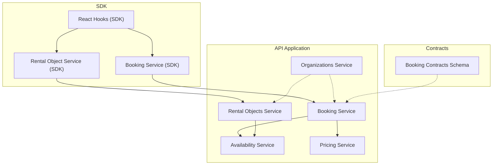
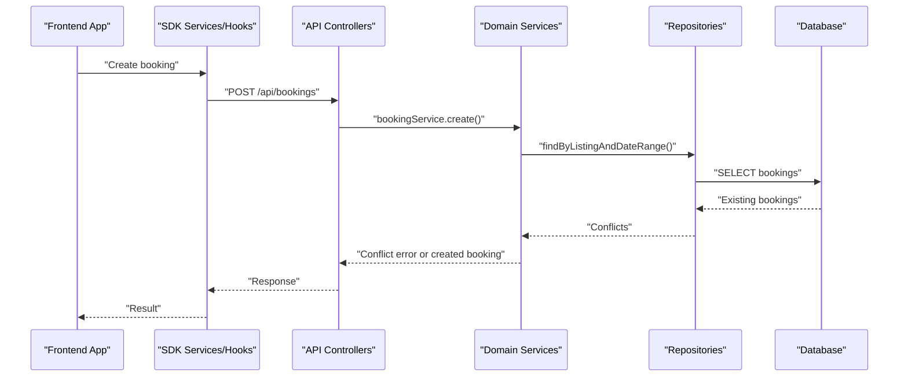
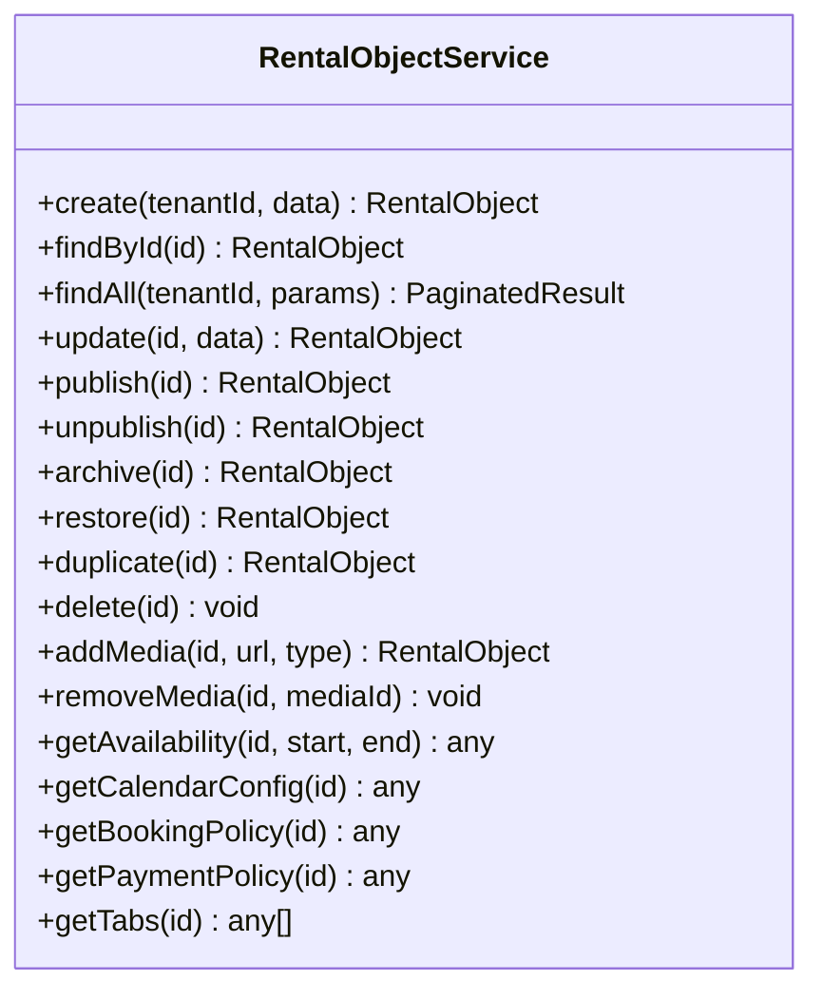
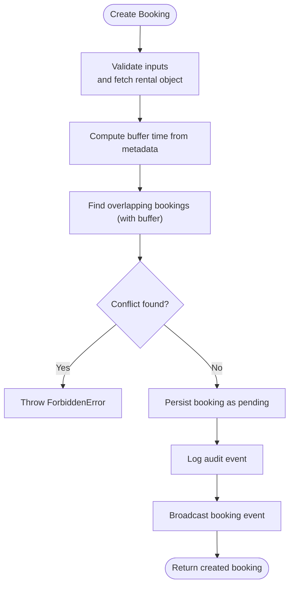
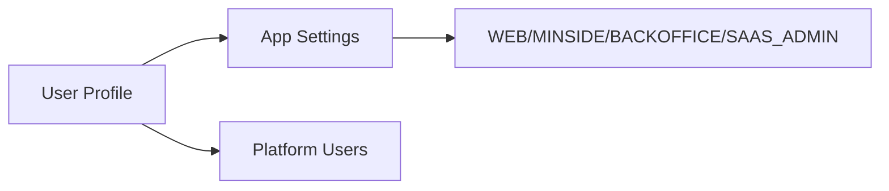
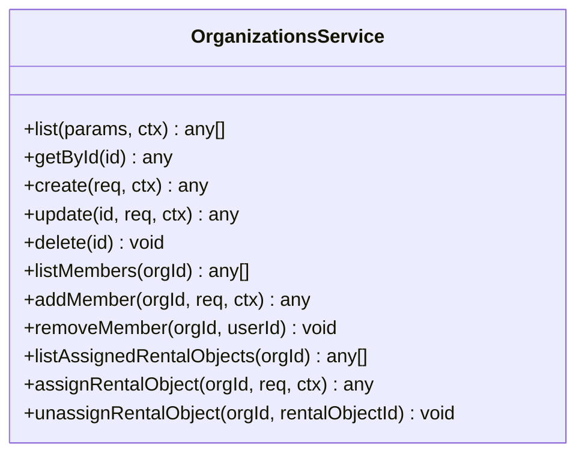
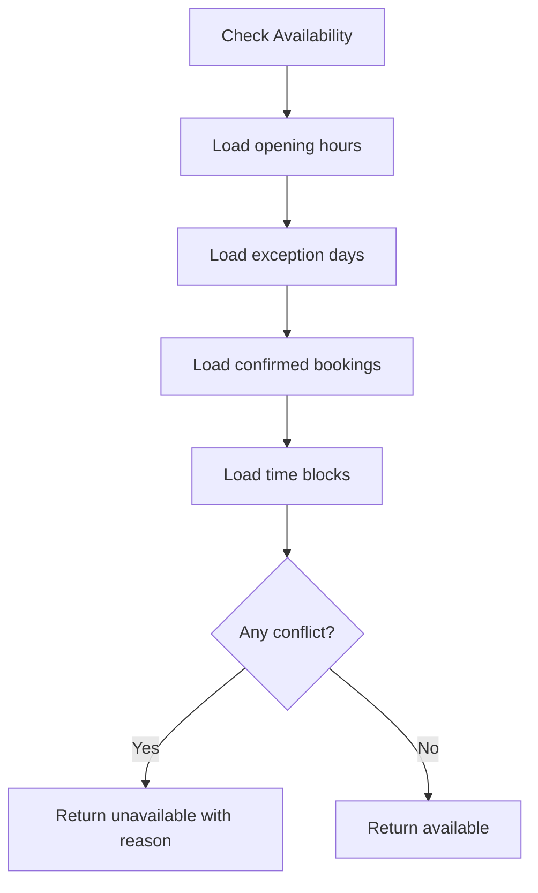
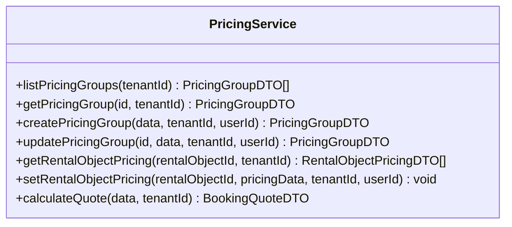
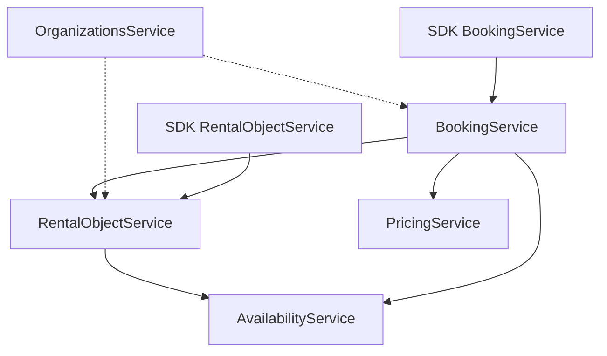

# Core Business Domains

<cite>
**Referenced Files in This Document**
- [rental-object.service.ts](file://apps/api/src/modules/rental-objects/rental-object.service.ts)
- [booking.service.ts](file://apps/api/src/modules/booking/booking.service.ts)
- [organizations.service.ts](file://apps/api/src/modules/organizations/organizations.service.ts)
- [availability.service.ts](file://apps/api/src/modules/availability/availability.service.ts)
- [pricing.service.ts](file://apps/api/src/modules/pricing/pricing.service.ts)
- [pricingschema.ts](file://packages/contracts/src/schemas/booking.schema.ts)
- [booking.md](file://docs/digilist-platform/roles/frontend-web/booking.md)
- [prdid.md](file://docs/digilist-platform/roles/prd.md)
- [tenant-admin-prd.md](file://docs/digilist-platform/roles/tenant-admin-backoffice/prd.md)
- [use-rental-objects.ts](file://packages/client-sdk/src/hooks/use-rental-objects.ts)
- [rental-object.service.ts](file://packages/client-sdk/src/services/rental-object.service.ts)
- [booking.service.ts](file://packages/client-sdk/src/services/booking.service.ts)
- [index.ts](file://apps/api/src/modules/rental-objects/index.ts)
- [index.ts](file://apps/api/src/modules/booking/index.ts)
- [index.ts](file://apps/api/src/modules/organizations/index.ts)
- [index.ts](file://apps/api/src/modules/availability/index.ts)
- [index.ts](file://apps/api/src/modules/pricing/index.ts)
</cite>

## Table of Contents
1. [Introduction](#introduction)
2. [Project Structure](#project-structure)
3. [Core Components](#core-components)
4. [Architecture Overview](#architecture-overview)
5. [Detailed Component Analysis](#detailed-component-analysis)
6. [Dependency Analysis](#dependency-analysis)
7. [Performance Considerations](#performance-considerations)
8. [Troubleshooting Guide](#troubleshooting-guide)
9. [Conclusion](#conclusion)

## Introduction
This document describes the core business domains that underpin the rental property management platform. It focuses on:
- Rental Objects: catalog management, media handling, categorization, and policy exposure
- Booking System: reservation workflows, calendar integration, booking states, and recurring series
- User Management: registration, profiles, and membership systems
- Organizations: multi-entity governance and operational structures
- Availability Management: opening hours, exceptions, calendar views, and conflict detection
- Pricing Engine: pricing groups, quotes, discounts, taxes, and deposits
- Inventory Control: capacity and asset-based availability
It also documents domain models, business rules, and integration patterns across the API and SDK.

## Project Structure
The platform is organized as a monorepo with separate applications and shared packages:
- API application: domain services, repositories, controllers, and database migrations
- Client SDK: typed services and hooks for frontend consumption
- Shared contracts and types: cross-cutting schemas and DTOs
- Documentation: PRDs, roles, and guides that define the business model

**Diagram sources**
- [index.ts](file://apps/api/src/modules/rental-objects/index.ts)
- [index.ts](file://apps/api/src/modules/booking/index.ts)
- [index.ts](file://apps/api/src/modules/organizations/index.ts)
- [index.ts](file://apps/api/src/modules/availability/index.ts)
- [index.ts](file://apps/api/src/modules/pricing/index.ts)
- [rental-object.service.ts](file://packages/client-sdk/src/services/rental-object.service.ts)
- [booking.service.ts](file://packages/client-sdk/src/services/booking.service.ts)
- [use-rental-objects.ts](file://packages/client-sdk/src/hooks/use-rental-objects.ts)
- [pricingschema.ts](file://packages/contracts/src/schemas/booking.schema.ts)

**Section sources**
- [index.ts](file://apps/api/src/modules/rental-objects/index.ts)
- [index.ts](file://apps/api/src/modules/booking/index.ts)
- [index.ts](file://apps/api/src/modules/organizations/index.ts)
- [index.ts](file://apps/api/src/modules/availability/index.ts)
- [index.ts](file://apps/api/src/modules/pricing/index.ts)

## Core Components
This section outlines the principal domain services and their responsibilities.

- Rental Objects Service
  - Catalog lifecycle: create, update, publish/unpublish, archive/restore, duplicate, delete
  - Media management: add/remove images
  - Policy exposure: booking policy, payment policy, tabs configuration, calendar configuration
  - Availability queries and statistics
- Booking Service
  - Reservation lifecycle: create, confirm, cancel, complete, update, update status
  - Approval scope enforcement for case handlers
  - Calendar integration and event projections
  - Pricing calculation stub and recurring series creation with conflict policies
- Organizations Service
  - Multi-entity governance: create/update/delete, member management, and rental object assignments
  - Role-based scoping: tenant admin vs. organization admin visibility
- Availability Service
  - Opening hours, exception days, monthly availability calendar
  - Conflict detection across bookings and blocks
- Pricing Service
  - Pricing groups, rental object pricing per group
  - Quote calculation with add-ons, discounts, taxes, and deposit
- SDK Services and Hooks
  - Typed services for rentals, bookings, availability, and categories
  - React hooks for lists, mutations, and media operations

**Section sources**
- [rental-object.service.ts](file://apps/api/src/modules/rental-objects/rental-object.service.ts)
- [booking.service.ts](file://apps/api/src/modules/booking/booking.service.ts)
- [organizations.service.ts](file://apps/api/src/modules/organizations/organizations.service.ts)
- [availability.service.ts](file://apps/api/src/modules/availability/availability.service.ts)
- [pricing.service.ts](file://apps/api/src/modules/pricing/pricing.service.ts)
- [rental-object.service.ts](file://packages/client-sdk/src/services/rental-object.service.ts)
- [booking.service.ts](file://packages/client-sdk/src/services/booking.service.ts)
- [use-rental-objects.ts](file://packages/client-sdk/src/hooks/use-rental-objects.ts)

## Architecture Overview
The system follows a layered architecture:
- Controllers orchestrate requests and delegate to Services
- Services encapsulate business logic and coordinate Repositories
- Repositories interact with the database via Drizzle ORM
- SDK clients consume REST endpoints and React hooks
- Contracts define shared schemas for consistency

**Diagram sources**
- [booking.service.ts](file://apps/api/src/modules/booking/booking.service.ts)
- [booking.service.ts](file://packages/client-sdk/src/services/booking.service.ts)

## Detailed Component Analysis

### Rental Objects Module
The Rental Objects module manages the property catalog, categorization, media, and policy exposure.

- Catalog lifecycle
  - Create with defaults, update, publish/unpublish, archive/restore, duplicate, delete
  - Slug generation and uniqueness enforced at service level
- Media handling
  - Add/remove images via service methods; SDK exposes hooks for uploads/removal
- Categorization and policies
  - Categories/subcategories exposed via dedicated endpoints
  - Booking policy, payment policy, tabs configuration, and calendar configuration returned as Contract-First DTOs
- Calendar configuration
  - Time mode influences granularity and allowed actions

**Diagram sources**
- [rental-object.service.ts](file://apps/api/src/modules/rental-objects/rental-object.service.ts)

**Section sources**
- [rental-object.service.ts](file://apps/api/src/modules/rental-objects/rental-object.service.ts)
- [use-rental-objects.ts](file://packages/client-sdk/src/hooks/use-rental-objects.ts)
- [rental-object.service.ts](file://packages/client-sdk/src/services/rental-object.service.ts)

### Booking System
The Booking System orchestrates reservations, approvals, and recurring series with robust conflict detection and state transitions.

- Reservation workflows
  - Create validates buffer time around existing bookings; supports optimistic locking
  - Confirm/cancel/complete with audit logging and real-time event broadcasting
- Approval and scope enforcement
  - Case handlers must have active scope for the rental object; admins bypass scope
- Calendar integration
  - Calendar events derived from bookings; mapper projects to calendar DTOs
- Recurring series
  - Conflict policy: stopOnConflict vs allowPartial; preview and creation projections
- Pricing integration
  - Quote endpoint and pricing calculation stub; integrates with Pricing Service

**Diagram sources**
- [booking.service.ts](file://apps/api/src/modules/booking/booking.service.ts)

**Section sources**
- [booking.service.ts](file://apps/api/src/modules/booking/booking.service.ts)
- [booking.md](file://docs/digilist-platform/roles/frontend-web/booking.md)
- [booking.service.ts](file://packages/client-sdk/src/services/booking.service.ts)

### User Management and Membership Systems
User management spans profiles, app settings, and membership organization representation.

- User Profiles and App Settings
  - Per-tenant, per-user profile and per-app settings persisted in domain tables
- Membership Organization Representation
  - MinSide role model distinguishes membership orgs from backoffice orgs; users may act as individuals or org representatives
- Integration
  - SDK exposes typed services and hooks for listing and mutating rental objects and related metadata

**Diagram sources**
- [0005_domain_profiles.sql](file://apps/api/drizzle/0005_domain_profiles.sql)
- [master-prompt.md](file://docs/digilist-platform/roles/end-user-minside/master-prompt.md)

**Section sources**
- [0005_domain_profiles.sql](file://apps/api/drizzle/0005_domain_profiles.sql)
- [master-prompt.md](file://docs/digilist-platform/roles/end-user-minside/master-prompt.md)
- [rental-object.service.ts](file://packages/client-sdk/src/services/rental-object.service.ts)

### Organizations Management
Organizations define multi-entity governance structures with role-based scoping and rental object assignments.

- Organization lifecycle
  - Create, update, soft-delete by archival, list with role-based scoping
- Member management
  - Add/remove members with roles and capability metadata
- Rental object assignments
  - Grant access with assignment types and capability flags (edit, approve, manage availability/pricing)
- Governance separation
  - Back-office organizations vs. tenant-admin controlled structures

**Diagram sources**
- [organizations.service.ts](file://apps/api/src/modules/organizations/organizations.service.ts)

**Section sources**
- [organizations.service.ts](file://apps/api/src/modules/organizations/organizations.service.ts)
- [prdid.md](file://docs/digilist-platform/roles/prd.md)
- [tenant-admin-prd.md](file://docs/digilist-platform/roles/tenant-admin-backoffice/prd.md)

### Availability Management
Availability Management controls opening hours, exceptions, and calendar views while preventing conflicts.

- Opening hours
  - Weekly schedule per rental object; bulk replacement supported
- Exception days
  - Closed days and override hours for specific dates
- Monthly availability calendar
  - Aggregates opening hours, exceptions, bookings, and blocks
- Conflict detection
  - Validates slot availability against bookings and blocks

**Diagram sources**
- [availability.service.ts](file://apps/api/src/modules/availability/availability.service.ts)

**Section sources**
- [availability.service.ts](file://apps/api/src/modules/availability/availability.service.ts)

### Pricing Engine
The Pricing Engine calculates quotes, applies discounts, computes taxes, and handles deposits.

- Pricing groups
  - Tenant-scoped groups; resolution prioritizes organization, then user, then default
- Rental object pricing
  - Base prices per group; configurable discount percentages
- Quote calculation
  - Duration-based computation, add-ons, discounts, 25% tax (MVA), optional deposit
- Integration
  - Pricing Service collaborates with Add-ons Service and Audit Service

**Diagram sources**
- [pricing.service.ts](file://apps/api/src/modules/pricing/pricing.service.ts)

**Section sources**
- [pricing.service.ts](file://apps/api/src/modules/pricing/pricing.service.ts)

### Inventory Control
Inventory control is primarily reflected in:
- Capacity and fixed location metadata on rental objects
- Availability calendar and conflict detection preventing overbookings
- Category-specific features (e.g., activity services) influencing tabs and policies

**Section sources**
- [rental-object.service.ts](file://apps/api/src/modules/rental-objects/rental-object.service.ts)
- [availability.service.ts](file://apps/api/src/modules/availability/availability.service.ts)

## Dependency Analysis
The following diagram highlights key dependencies among domain services and their integration points.

**Diagram sources**
- [rental-object.service.ts](file://apps/api/src/modules/rental-objects/rental-object.service.ts)
- [booking.service.ts](file://apps/api/src/modules/booking/booking.service.ts)
- [availability.service.ts](file://apps/api/src/modules/availability/availability.service.ts)
- [pricing.service.ts](file://apps/api/src/modules/pricing/pricing.service.ts)
- [organizations.service.ts](file://apps/api/src/modules/organizations/organizations.service.ts)
- [rental-object.service.ts](file://packages/client-sdk/src/services/rental-object.service.ts)
- [booking.service.ts](file://packages/client-sdk/src/services/booking.service.ts)

**Section sources**
- [rental-object.service.ts](file://apps/api/src/modules/rental-objects/rental-object.service.ts)
- [booking.service.ts](file://apps/api/src/modules/booking/booking.service.ts)
- [availability.service.ts](file://apps/api/src/modules/availability/availability.service.ts)
- [pricing.service.ts](file://apps/api/src/modules/pricing/pricing.service.ts)
- [organizations.service.ts](file://apps/api/src/modules/organizations/organizations.service.ts)

## Performance Considerations
- Use pagination and filtering consistently in listing endpoints to avoid large result sets
- Prefer batch operations for bulk updates (e.g., opening hours) to minimize round trips
- Cache frequently accessed metadata (categories, pricing units) at the application layer
- Optimize conflict checks by narrowing date ranges and leveraging indexes on timestamps
- Use optimistic locking to reduce contention during concurrent updates

## Troubleshooting Guide
- Booking creation failures
  - Conflicts with existing bookings (including buffer time) result in ForbiddenError; verify rental object buffer time and existing bookings
  - Scope errors for case handlers: ensure active scope entries for the rental object
- Availability issues
  - Closed days or exception overrides take precedence over opening hours; confirm exception days and override hours
  - Conflicting blocks prevent availability; review time blocks for the date range
- Pricing discrepancies
  - Verify pricing group resolution and rental object pricing records; ensure add-ons and discounts are configured correctly
- Organization scoping
  - Role-based visibility: tenant admins see all, organization admins see only their org; confirm user roles and memberships

**Section sources**
- [booking.service.ts](file://apps/api/src/modules/booking/booking.service.ts)
- [availability.service.ts](file://apps/api/src/modules/availability/availability.service.ts)
- [pricing.service.ts](file://apps/api/src/modules/pricing/pricing.service.ts)
- [organizations.service.ts](file://apps/api/src/modules/organizations/organizations.service.ts)

## Conclusion
The platform’s core domains are designed around clear separation of concerns:
- Rental Objects define catalog, categorization, and policy
- Booking coordinates reservations, approvals, and recurring series
- Organizations govern multi-entity structures and access
- Availability and Pricing enforce operational constraints and financial calculations
- The SDK provides typed integrations for frontend consumption

This architecture enables extensibility, maintainability, and consistent behavior across applications while preserving strong typing and contract-first design.