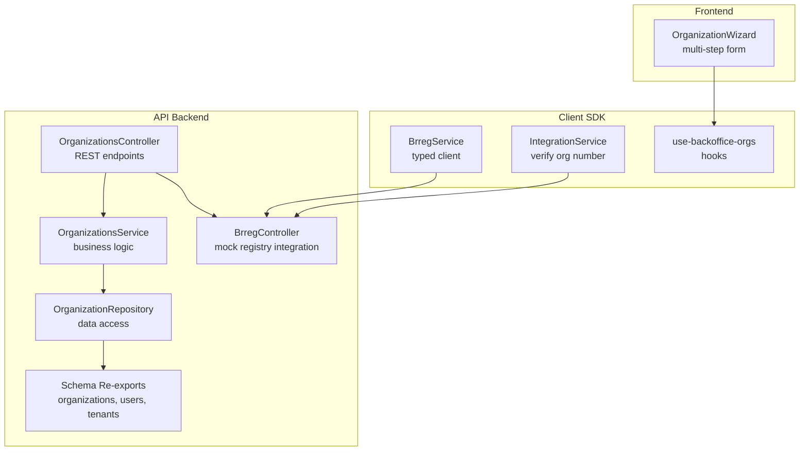
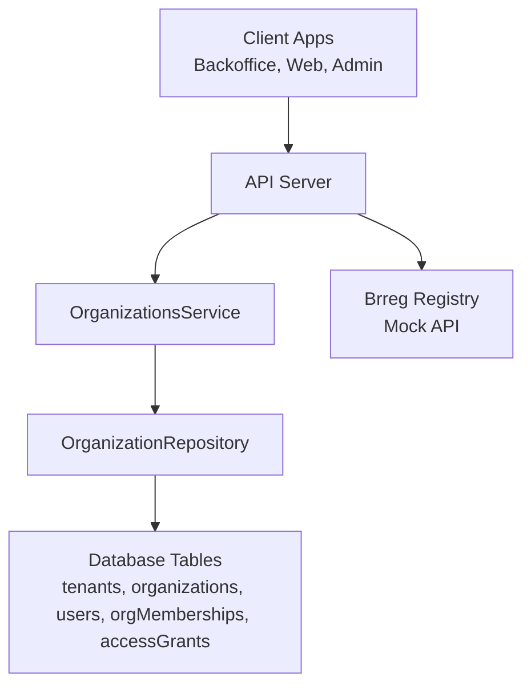
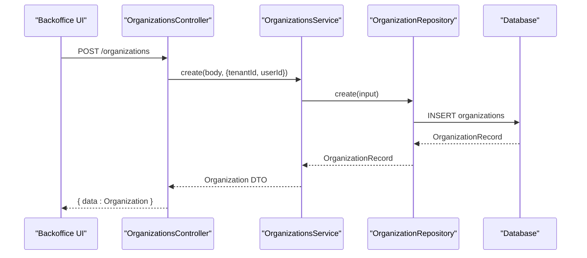
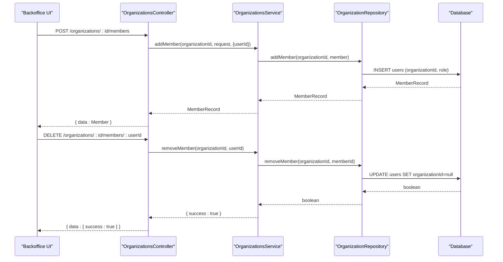
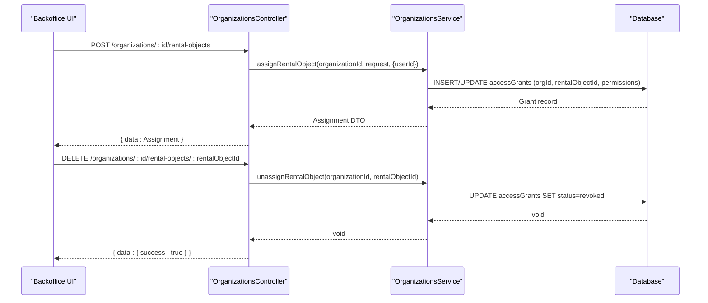
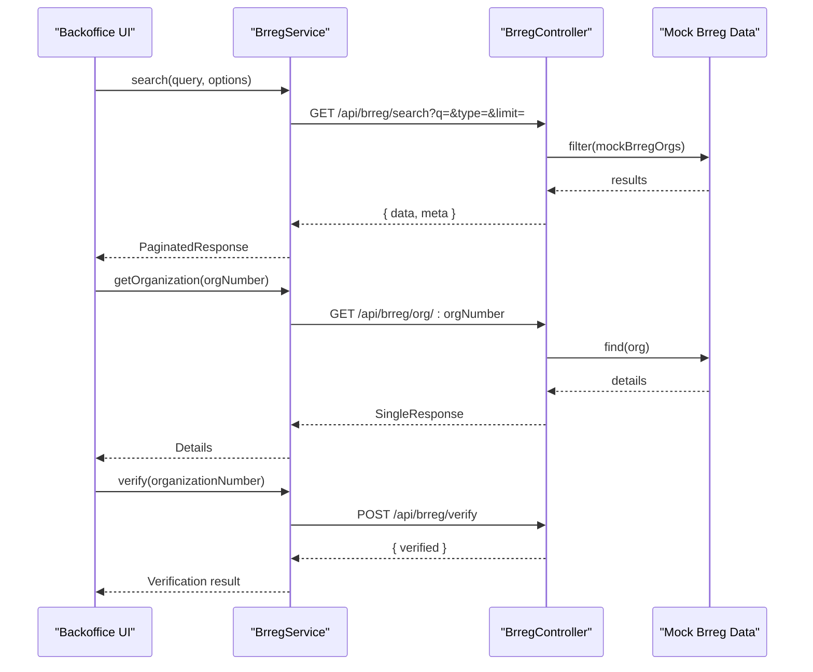
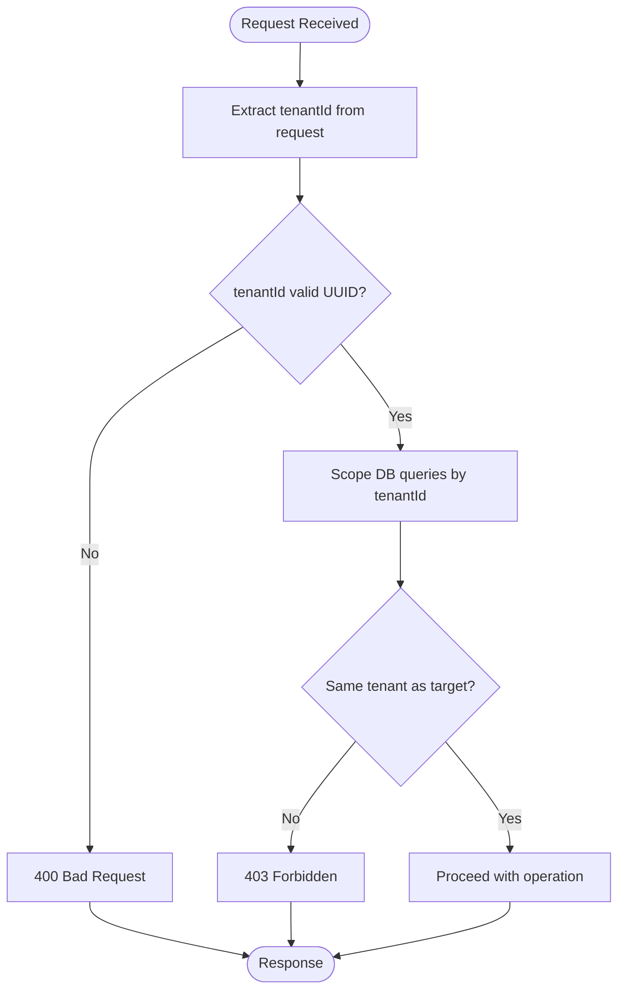
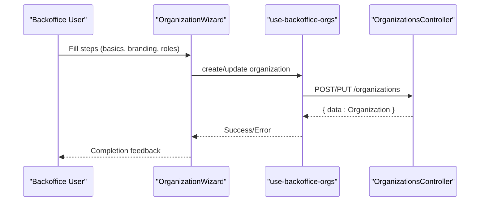
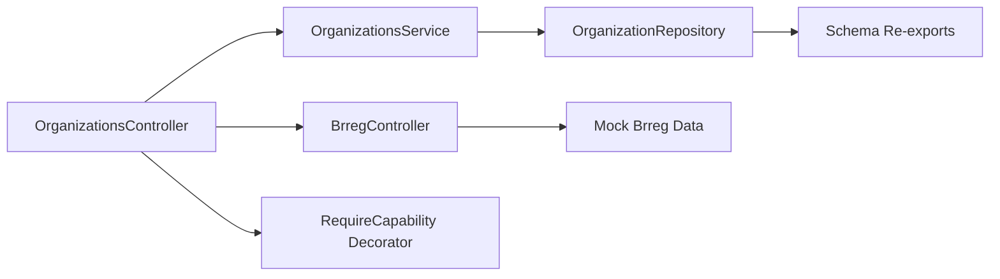
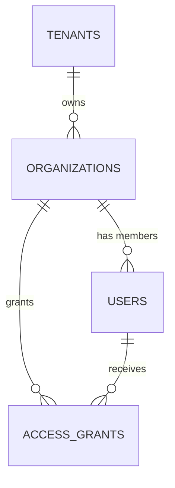

# Organization Management

<cite>
**Referenced Files in This Document**
- [organization.repository.ts](file://apps/api/src/modules/organizations/organization.repository.ts)
- [organizations.service.ts](file://apps/api/src/modules/organizations/organizations.service.ts)
- [organizations.controller.ts](file://apps/api/src/modules/organizations/organizations.controller.ts)
- [brreg.controller.ts](file://apps/api/src/modules/organizations/brreg.controller.ts)
- [brreg.service.ts](file://packages/client-sdk/src/services/brreg.service.ts)
- [integration.service.ts](file://packages/client-sdk/src/services/integration.service.ts)
- [index.ts (schema re-exports)](file://apps/api/src/database/schema/index.ts)
- [index.ts (database-schema package)](file://packages/database-schema/src/index.ts)
- [tenant.ts (validation)](file://apps/api/src/core/validation/tenant.ts)
- [require-capability.ts](file://apps/api/src/core/decorators/require-capability.ts)
- [OrganizationWizard.tsx](file://apps/backoffice/src/components/organizations/OrganizationWizard.tsx)
- [tenant-isolation.test.ts](file://tests/integration/saas/tenant-isolation.test.ts)
- [rental-object-custody-delegation.md](file://docs/architecture/rental-object-custody-delegation.md)
- [master-prompt.md (org-admin-backoffice)](file://docs/digilist-platform/roles/org-admin-backoffice/master-prompt.md)
- [use-backoffice-orgs.ts](file://packages/client-sdk/src/hooks/use-backoffice-orgs.ts)
</cite>

## Table of Contents
1. [Introduction](#introduction)
2. [Project Structure](#project-structure)
3. [Core Components](#core-components)
4. [Architecture Overview](#architecture-overview)
5. [Detailed Component Analysis](#detailed-component-analysis)
6. [Dependency Analysis](#dependency-analysis)
7. [Performance Considerations](#performance-considerations)
8. [Troubleshooting Guide](#troubleshooting-guide)
9. [Conclusion](#conclusion)
10. [Appendices](#appendices)

## Introduction
This document explains the organization management subsystem, focusing on multi-entity structures, organizational hierarchies, and tenant isolation. It covers the organization creation workflow, member management, role assignment patterns, integration with Brreg (Norwegian Register), and the multi-tenancy architecture. It also documents the organization setup service, data mapping patterns, administrative interfaces, and the relationships among organizations, users, and rental objects.

## Project Structure
Organization management spans the API backend, client SDK, and front-end applications:
- Backend API modules implement controllers, services, repositories, and schema re-exports.
- The client SDK provides typed services for Brreg integration and organization operations.
- Front-end components include the organization wizard and settings integrations.

**Diagram sources**
- [organizations.controller.ts](file://apps/api/src/modules/organizations/organizations.controller.ts#L1-L208)
- [organizations.service.ts](file://apps/api/src/modules/organizations/organizations.service.ts#L1-L408)
- [organization.repository.ts](file://apps/api/src/modules/organizations/organization.repository.ts#L1-L372)
- [index.ts (schema re-exports)](file://apps/api/src/database/schema/index.ts#L1-L170)
- [brreg.controller.ts](file://apps/api/src/modules/organizations/brreg.controller.ts#L20-L219)
- [brreg.service.ts](file://packages/client-sdk/src/services/brreg.service.ts#L1-L102)
- [integration.service.ts](file://packages/client-sdk/src/services/integration.service.ts#L320-L351)
- [OrganizationWizard.tsx](file://apps/backoffice/src/components/organizations/OrganizationWizard.tsx#L1-L110)
- [use-backoffice-orgs.ts](file://packages/client-sdk/src/hooks/use-backoffice-orgs.ts#L51-L77)

**Section sources**
- [organizations.controller.ts](file://apps/api/src/modules/organizations/organizations.controller.ts#L1-L208)
- [organizations.service.ts](file://apps/api/src/modules/organizations/organizations.service.ts#L1-L408)
- [organization.repository.ts](file://apps/api/src/modules/organizations/organization.repository.ts#L1-L372)
- [index.ts (schema re-exports)](file://apps/api/src/database/schema/index.ts#L1-L170)
- [brreg.controller.ts](file://apps/api/src/modules/organizations/brreg.controller.ts#L20-L219)
- [brreg.service.ts](file://packages/client-sdk/src/services/brreg.service.ts#L1-L102)
- [integration.service.ts](file://packages/client-sdk/src/services/integration.service.ts#L320-L351)
- [OrganizationWizard.tsx](file://apps/backoffice/src/components/organizations/OrganizationWizard.tsx#L1-L110)
- [use-backoffice-orgs.ts](file://packages/client-sdk/src/hooks/use-backoffice-orgs.ts#L51-L77)

## Core Components
- OrganizationsController: Exposes REST endpoints for listing, retrieving, creating, updating, deleting organizations, and managing members and rental object assignments.
- OrganizationsService: Implements business logic for organization lifecycle, member management, and rental object assignment.
- OrganizationRepository: Provides data access patterns for organizations, members, branding, and membership operations.
- BrregController and BrregService: Integrate with the Norwegian organization registry for search, details, and validation.
- Schema Re-exports: Centralizes database table definitions for tenants, organizations, users, and platform tables.
- Frontend OrganizationWizard: Multi-step wizard for creating and configuring organizations in the backoffice.

**Section sources**
- [organizations.controller.ts](file://apps/api/src/modules/organizations/organizations.controller.ts#L1-L208)
- [organizations.service.ts](file://apps/api/src/modules/organizations/organizations.service.ts#L1-L408)
- [organization.repository.ts](file://apps/api/src/modules/organizations/organization.repository.ts#L1-L372)
- [brreg.controller.ts](file://apps/api/src/modules/organizations/brreg.controller.ts#L20-L219)
- [brreg.service.ts](file://packages/client-sdk/src/services/brreg.service.ts#L1-L102)
- [index.ts (schema re-exports)](file://apps/api/src/database/schema/index.ts#L1-L170)
- [OrganizationWizard.tsx](file://apps/backoffice/src/components/organizations/OrganizationWizard.tsx#L1-L110)

## Architecture Overview
The system follows a layered architecture:
- Presentation: Controllers expose REST endpoints.
- Application: Services encapsulate business rules.
- Persistence: Repository abstracts database operations.
- Data: Schema re-exports define core entities.
- Integration: Brreg endpoints and SDK services enable official organization verification.

**Diagram sources**
- [organizations.controller.ts](file://apps/api/src/modules/organizations/organizations.controller.ts#L1-L208)
- [organizations.service.ts](file://apps/api/src/modules/organizations/organizations.service.ts#L1-L408)
- [organization.repository.ts](file://apps/api/src/modules/organizations/organization.repository.ts#L1-L372)
- [index.ts (schema re-exports)](file://apps/api/src/database/schema/index.ts#L1-L170)
- [brreg.controller.ts](file://apps/api/src/modules/organizations/brreg.controller.ts#L20-L219)

## Detailed Component Analysis

### Organization Creation Workflow
The creation workflow is handled by the controller and service, with repository persistence and tenant scoping.

**Diagram sources**
- [organizations.controller.ts](file://apps/api/src/modules/organizations/organizations.controller.ts#L66-L77)
- [organizations.service.ts](file://apps/api/src/modules/organizations/organizations.service.ts#L1-L408)
- [organization.repository.ts](file://apps/api/src/modules/organizations/organization.repository.ts#L188-L207)

**Section sources**
- [organizations.controller.ts](file://apps/api/src/modules/organizations/organizations.controller.ts#L66-L77)
- [organizations.service.ts](file://apps/api/src/modules/organizations/organizations.service.ts#L1-L408)
- [organization.repository.ts](file://apps/api/src/modules/organizations/organization.repository.ts#L188-L207)

### Member Management and Role Assignment Patterns
Member management supports adding/removing members and assigning rental objects with granular permissions.

**Diagram sources**
- [organizations.controller.ts](file://apps/api/src/modules/organizations/organizations.controller.ts#L127-L158)
- [organizations.service.ts](file://apps/api/src/modules/organizations/organizations.service.ts#L1-L408)
- [organization.repository.ts](file://apps/api/src/modules/organizations/organization.repository.ts#L292-L343)

**Section sources**
- [organizations.controller.ts](file://apps/api/src/modules/organizations/organizations.controller.ts#L127-L158)
- [organization.repository.ts](file://apps/api/src/modules/organizations/organization.repository.ts#L292-L343)

### Rental Object Assignment and Delegation
Organizations can be assigned rental objects with permission flags. The custody delegation model supports hierarchical sub-delegation and ABAC overlays on RBAC.

**Diagram sources**
- [organizations.controller.ts](file://apps/api/src/modules/organizations/organizations.controller.ts#L174-L206)
- [organizations.service.ts](file://apps/api/src/modules/organizations/organizations.service.ts#L369-L387)
- [rental-object-custody-delegation.md](file://docs/architecture/rental-object-custody-delegation.md#L1-L27)

**Section sources**
- [organizations.controller.ts](file://apps/api/src/modules/organizations/organizations.controller.ts#L174-L206)
- [organizations.service.ts](file://apps/api/src/modules/organizations/organizations.service.ts#L369-L387)
- [rental-object-custody-delegation.md](file://docs/architecture/rental-object-custody-delegation.md#L1-L27)

### Integration with Brreg (Norwegian Register)
The system integrates with Brreg via a mock API and typed client services. Clients can search organizations, fetch details, and verify organization numbers.

**Diagram sources**
- [brreg.controller.ts](file://apps/api/src/modules/organizations/brreg.controller.ts#L86-L125)
- [brreg.controller.ts](file://apps/api/src/modules/organizations/brreg.controller.ts#L173-L207)
- [brreg.controller.ts](file://apps/api/src/modules/organizations/brreg.controller.ts#L212-L219)
- [brreg.service.ts](file://packages/client-sdk/src/services/brreg.service.ts#L89-L102)
- [integration.service.ts](file://packages/client-sdk/src/services/integration.service.ts#L338-L340)

**Section sources**
- [brreg.controller.ts](file://apps/api/src/modules/organizations/brreg.controller.ts#L86-L125)
- [brreg.controller.ts](file://apps/api/src/modules/organizations/brreg.controller.ts#L173-L207)
- [brreg.controller.ts](file://apps/api/src/modules/organizations/brreg.controller.ts#L212-L219)
- [brreg.service.ts](file://packages/client-sdk/src/services/brreg.service.ts#L89-L102)
- [integration.service.ts](file://packages/client-sdk/src/services/integration.service.ts#L338-L340)

### Tenant Isolation and Multi-Tenancy
Tenant isolation ensures users can only access resources within their own tenant. Tests demonstrate cross-tenant access prevention and SaaS admin privileges.

**Diagram sources**
- [tenant.ts (validation)](file://apps/api/src/core/validation/tenant.ts#L30-L60)
- [organizations.controller.ts](file://apps/api/src/modules/organizations/organizations.controller.ts#L27-L43)
- [tenant-isolation.test.ts](file://tests/integration/saas/tenant-isolation.test.ts#L52-L100)

**Section sources**
- [tenant.ts (validation)](file://apps/api/src/core/validation/tenant.ts#L30-L60)
- [organizations.controller.ts](file://apps/api/src/modules/organizations/organizations.controller.ts#L27-L43)
- [tenant-isolation.test.ts](file://tests/integration/saas/tenant-isolation.test.ts#L52-L100)

### Administrative Interfaces and Organization Setup
The backoffice includes an organization wizard and settings tabs for integrations.

- OrganizationWizard: Multi-step form supporting basics, branding, and roles.
- Settings Integrations Tab: Toggle and manage Brreg integration.
- Client SDK Hooks: Provide typed operations for organization member and rental object management.

**Diagram sources**
- [OrganizationWizard.tsx](file://apps/backoffice/src/components/organizations/OrganizationWizard.tsx#L71-L110)
- [use-backoffice-orgs.ts](file://packages/client-sdk/src/hooks/use-backoffice-orgs.ts#L51-L77)
- [organizations.controller.ts](file://apps/api/src/modules/organizations/organizations.controller.ts#L66-L96)

**Section sources**
- [OrganizationWizard.tsx](file://apps/backoffice/src/components/organizations/OrganizationWizard.tsx#L1-L110)
- [use-backoffice-orgs.ts](file://packages/client-sdk/src/hooks/use-backoffice-orgs.ts#L51-L77)
- [organizations.controller.ts](file://apps/api/src/modules/organizations/organizations.controller.ts#L66-L96)

## Dependency Analysis
The organization module depends on shared schema definitions and enforces RBAC via decorators.

**Diagram sources**
- [organizations.controller.ts](file://apps/api/src/modules/organizations/organizations.controller.ts#L1-L208)
- [organizations.service.ts](file://apps/api/src/modules/organizations/organizations.service.ts#L1-L408)
- [organization.repository.ts](file://apps/api/src/modules/organizations/organization.repository.ts#L1-L372)
- [index.ts (schema re-exports)](file://apps/api/src/database/schema/index.ts#L1-L170)
- [brreg.controller.ts](file://apps/api/src/modules/organizations/brreg.controller.ts#L20-L219)
- [require-capability.ts](file://apps/api/src/core/decorators/require-capability.ts#L72-L124)

**Section sources**
- [organizations.controller.ts](file://apps/api/src/modules/organizations/organizations.controller.ts#L1-L208)
- [organizations.service.ts](file://apps/api/src/modules/organizations/organizations.service.ts#L1-L408)
- [organization.repository.ts](file://apps/api/src/modules/organizations/organization.repository.ts#L1-L372)
- [index.ts (schema re-exports)](file://apps/api/src/database/schema/index.ts#L1-L170)
- [brreg.controller.ts](file://apps/api/src/modules/organizations/brreg.controller.ts#L20-L219)
- [require-capability.ts](file://apps/api/src/core/decorators/require-capability.ts#L72-L124)

## Performance Considerations
- Pagination and filtering: Repository methods accept page and limit parameters to control result sets.
- Conditional queries: Repository composes WHERE clauses dynamically to avoid unnecessary scans.
- Batch operations: Prefer bulk inserts/updates for member operations when scaling.
- Caching: Consider caching frequently accessed organization metadata and member counts.

[No sources needed since this section provides general guidance]

## Troubleshooting Guide
Common issues and resolutions:
- Validation errors for Brreg search: Ensure query length meets minimum requirements.
- Unauthorized or forbidden responses: Confirm capability grants and role alignment.
- Tenant isolation failures: Verify tenantId extraction and UUID format validation.
- Member removal failures: Ensure the member belongs to the organization before removal.

**Section sources**
- [brreg.controller.ts](file://apps/api/src/modules/organizations/brreg.controller.ts#L88-L98)
- [require-capability.ts](file://apps/api/src/core/decorators/require-capability.ts#L88-L124)
- [tenant.ts (validation)](file://apps/api/src/core/validation/tenant.ts#L30-L60)
- [organization.repository.ts](file://apps/api/src/modules/organizations/organization.repository.ts#L333-L343)

## Conclusion
The organization management subsystem provides a robust foundation for multi-entity structures, tenant isolation, and RBAC-driven access control. It integrates with Brreg for official organization verification, supports member management and rental object delegation, and exposes typed client SDK operations for seamless front-end integration.

[No sources needed since this section summarizes without analyzing specific files]

## Appendices

### Data Model Overview
The system relies on shared schema definitions for tenants, organizations, users, and platform tables.

**Diagram sources**
- [index.ts (database-schema package)](file://packages/database-schema/src/index.ts#L1-L32)
- [index.ts (schema re-exports)](file://apps/api/src/database/schema/index.ts#L14-L84)

**Section sources**
- [index.ts (database-schema package)](file://packages/database-schema/src/index.ts#L1-L32)
- [index.ts (schema re-exports)](file://apps/api/src/database/schema/index.ts#L14-L84)

### RBAC and Role Definitions
- Organization Admin cannot create/modify tenant-wide configuration or access non-assigned rental objects.
- SaaS Admins can access all tenants; KOMMUNE_ADMIN has broad tenant-level privileges; ORG_ADMIN scope is limited to their organization.

**Section sources**
- [master-prompt.md (org-admin-backoffice)](file://docs/digilist-platform/roles/org-admin-backoffice/master-prompt.md#L27-L34)
- [require-capability.ts](file://apps/api/src/core/decorators/require-capability.ts#L50-L63)