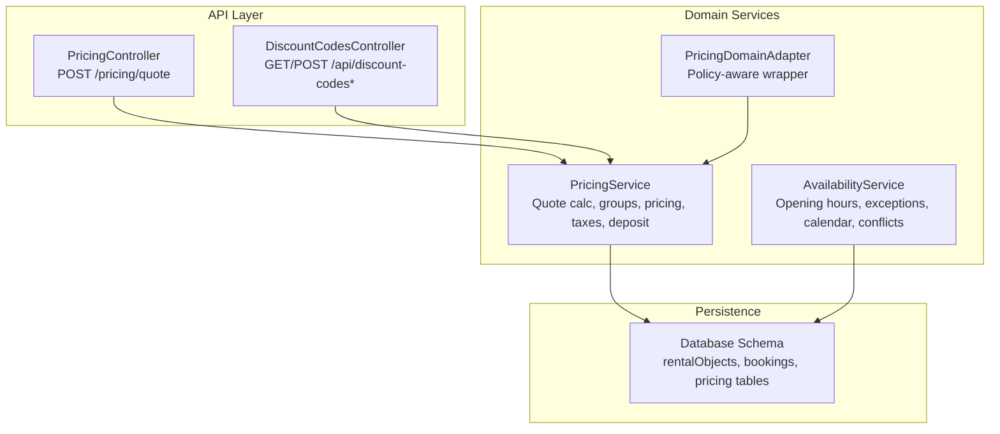
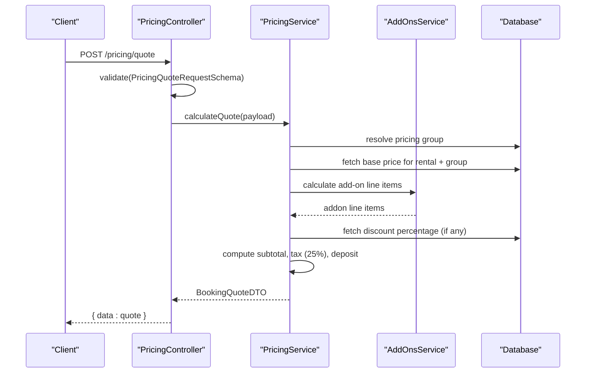
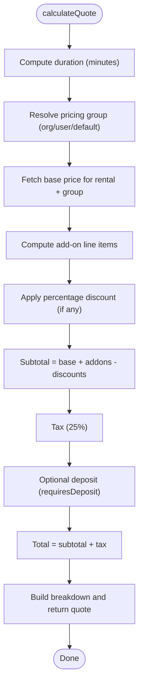
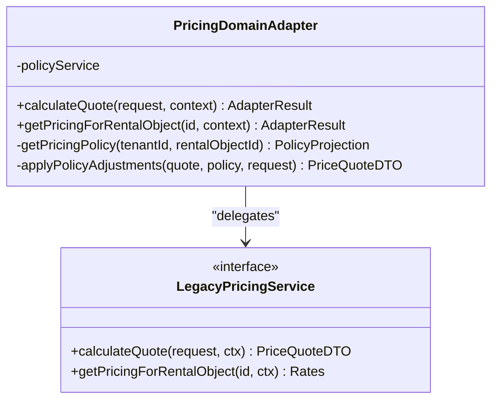
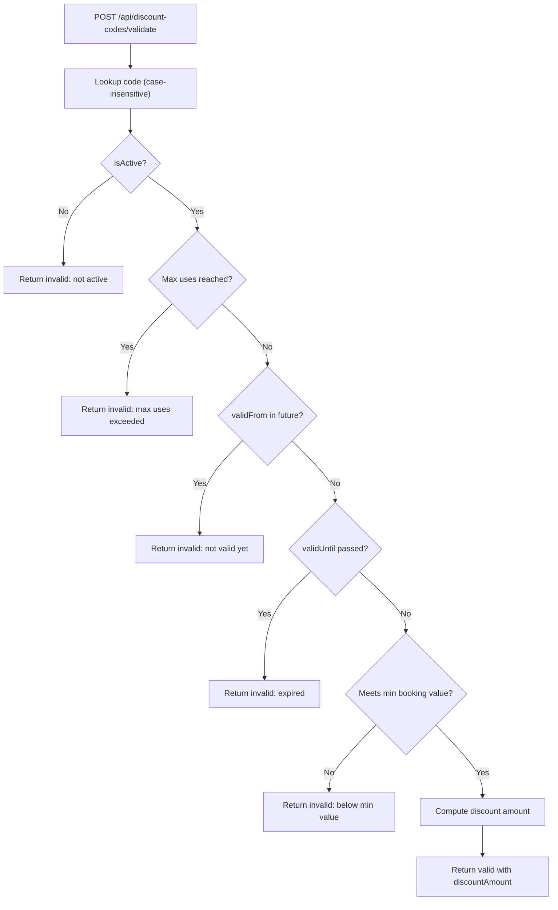
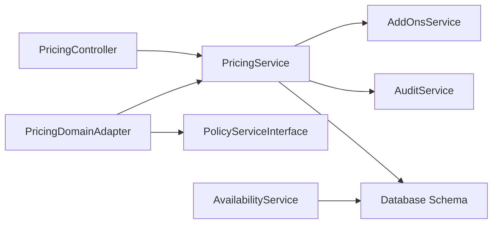

# Pricing Engine

<cite>
**Referenced Files in This Document**
- [pricing.service.ts](file://apps/api/src/modules/pricing/pricing.service.ts)
- [pricing.controller.ts](file://apps/api/src/modules/pricing/pricing.controller.ts)
- [pricing.schema.ts](file://apps/api/src/schemas/pricing.schema.ts)
- [pricing.adapter.ts](file://apps/api/src/modules/domain/adapters/pricing.adapter.ts)
- [availability.service.ts](file://apps/api/src/modules/availability/availability.service.ts)
- [discount-codes.controller.ts](file://apps/api/src/modules/discount-codes/discount-codes.controller.ts)
- [index.ts](file://apps/api/src/database/schema/index.ts)
</cite>

## Table of Contents
1. [Introduction](#introduction)
2. [Project Structure](#project-structure)
3. [Core Components](#core-components)
4. [Architecture Overview](#architecture-overview)
5. [Detailed Component Analysis](#detailed-component-analysis)
6. [Dependency Analysis](#dependency-analysis)
7. [Performance Considerations](#performance-considerations)
8. [Troubleshooting Guide](#troubleshooting-guide)
9. [Conclusion](#conclusion)

## Introduction
This document describes the pricing engine that powers dynamic pricing, discount management, and cost calculation workflows. It explains how pricing groups, rental object pricing, add-ons, taxes, deposits, and discount codes are orchestrated. It also documents the integration with availability checks for real-time pricing updates, the policy-driven adapter layer, and the relationships among pricing rules, availability constraints, and booking workflows. Guidance on caching strategies, error handling, and payment/invoice alignment is included.

## Project Structure
The pricing engine spans several modules and adapters:
- Pricing service encapsulates quote calculation, pricing groups, and rental object pricing.
- Pricing controller exposes a server-side endpoint for quote requests.
- Pricing adapter wraps the pricing service with policy-aware behavior and falls back to legacy logic.
- Availability service provides real-time availability and conflict detection used by booking workflows.
- Discount codes controller manages promo/discount code lifecycle and validation.
- Database schema re-exports domain tables used by pricing and availability.

**Diagram sources**
- [pricing.controller.ts](file://apps/api/src/modules/pricing/pricing.controller.ts#L14-L62)
- [pricing.service.ts](file://apps/api/src/modules/pricing/pricing.service.ts#L38-L484)
- [pricing.adapter.ts](file://apps/api/src/modules/domain/adapters/pricing.adapter.ts#L105-L251)
- [availability.service.ts](file://apps/api/src/modules/availability/availability.service.ts#L32-L456)
- [discount-codes.controller.ts](file://apps/api/src/modules/discount-codes/discount-codes.controller.ts#L41-L244)
- [index.ts](file://apps/api/src/database/schema/index.ts#L36-L47)

**Section sources**
- [pricing.controller.ts](file://apps/api/src/modules/pricing/pricing.controller.ts#L1-L65)
- [pricing.service.ts](file://apps/api/src/modules/pricing/pricing.service.ts#L1-L485)
- [pricing.adapter.ts](file://apps/api/src/modules/domain/adapters/pricing.adapter.ts#L1-L252)
- [availability.service.ts](file://apps/api/src/modules/availability/availability.service.ts#L1-L457)
- [discount-codes.controller.ts](file://apps/api/src/modules/discount-codes/discount-codes.controller.ts#L1-L245)
- [index.ts](file://apps/api/src/database/schema/index.ts#L1-L170)

## Core Components
- PricingService: Central quote calculator that resolves pricing groups, fetches base prices, computes add-ons, applies discounts, calculates taxes, and determines deposit requirements.
- PricingController: Validates incoming quote requests and delegates to PricingService.
- PricingDomainAdapter: Policy-aware wrapper around PricingService that conditionally adjusts quotes and base rates based on policy projections.
- AvailabilityService: Provides opening hours, exceptions, monthly calendars, and conflict checks used by booking workflows.
- DiscountCodesController: Manages discount code lifecycle and validates codes against activation, usage limits, validity windows, and minimum booking thresholds.

Key responsibilities:
- Dynamic pricing via pricing groups and per-item overrides.
- Add-on line items computed from selections and duration.
- Taxes (25% MVA) and optional deposits.
- Policy-driven adjustments (member discounts) and fallback to legacy logic.
- Real-time availability integration for accurate pricing windows.

**Section sources**
- [pricing.service.ts](file://apps/api/src/modules/pricing/pricing.service.ts#L38-L484)
- [pricing.controller.ts](file://apps/api/src/modules/pricing/pricing.controller.ts#L14-L62)
- [pricing.adapter.ts](file://apps/api/src/modules/domain/adapters/pricing.adapter.ts#L105-L251)
- [availability.service.ts](file://apps/api/src/modules/availability/availability.service.ts#L32-L456)
- [discount-codes.controller.ts](file://apps/api/src/modules/discount-codes/discount-codes.controller.ts#L41-L244)

## Architecture Overview
The pricing engine follows a layered architecture:
- API layer: Controllers validate and route requests.
- Domain services: PricingService and AvailabilityService encapsulate business logic.
- Adapter layer: PricingDomainAdapter adds policy-driven behavior with graceful fallback.
- Persistence: Shared schema re-exports domain tables for rentals, bookings, and pricing.

**Diagram sources**
- [pricing.controller.ts](file://apps/api/src/modules/pricing/pricing.controller.ts#L26-L61)
- [pricing.service.ts](file://apps/api/src/modules/pricing/pricing.service.ts#L201-L317)

## Detailed Component Analysis

### PricingService
Responsibilities:
- Pricing groups CRUD and resolution (organization/user precedence).
- Rental object pricing retrieval and updates.
- Quote calculation pipeline: duration, base price, add-ons, discounts, taxes, deposit.
- Money formatting and consistent currency representation.

Quote calculation flow:
1. Compute duration in minutes.
2. Resolve pricing group (org > user > default).
3. Fetch base price for the rental object and group.
4. Compute add-on line items via AddOnsService.
5. Apply percentage discount from rental object pricing.
6. Compute subtotal, tax (25% MVA), and optional deposit.
7. Build price breakdown and return structured quote.

**Diagram sources**
- [pricing.service.ts](file://apps/api/src/modules/pricing/pricing.service.ts#L201-L317)

**Section sources**
- [pricing.service.ts](file://apps/api/src/modules/pricing/pricing.service.ts#L38-L484)

### PricingController
- Exposes POST /pricing/quote.
- Validates payload using Zod schema.
- Returns Problem Details on validation or internal errors.

**Section sources**
- [pricing.controller.ts](file://apps/api/src/modules/pricing/pricing.controller.ts#L14-L62)
- [pricing.schema.ts](file://apps/api/src/schemas/pricing.schema.ts#L10-L18)

### PricingDomainAdapter
- Wraps PricingService with policy-aware behavior.
- Retrieves policy projections and applies adjustments (e.g., member discount).
- Falls back to legacy PricingService when policy is unavailable.
- Overrides base rates with policy defaults when zero or unspecified.

**Diagram sources**
- [pricing.adapter.ts](file://apps/api/src/modules/domain/adapters/pricing.adapter.ts#L105-L251)

**Section sources**
- [pricing.adapter.ts](file://apps/api/src/modules/domain/adapters/pricing.adapter.ts#L105-L251)

### AvailabilityService
- Opening hours CRUD and monthly calendar generation.
- Exception days (holidays/closures) with override semantics.
- Conflict detection across bookings and time blocks.
- Slot availability checks with precise overlap logic.

Integration with pricing:
- AvailabilityService informs booking workflows; pricing is recalculated after availability confirms a valid slot.
- Monthly calendar and conflict checks prevent quoting invalid time windows.

**Section sources**
- [availability.service.ts](file://apps/api/src/modules/availability/availability.service.ts#L32-L456)

### DiscountCodesController
- Manages discount codes in memory (placeholder for persistence).
- Supports listing, creation, update, deletion, and validation.
- Validation checks include active status, usage caps, validity window, and minimum booking value.
- Calculates discount amount based on type (percentage/fixed) and booking value.

**Diagram sources**
- [discount-codes.controller.ts](file://apps/api/src/modules/discount-codes/discount-codes.controller.ts#L190-L243)

**Section sources**
- [discount-codes.controller.ts](file://apps/api/src/modules/discount-codes/discount-codes.controller.ts#L41-L244)

## Dependency Analysis
- PricingService depends on:
  - Drizzle ORM for database queries.
  - AddOnsService for add-on line item computation.
  - AuditService for logging pricing changes.
- PricingController depends on:
  - Zod validation schema for request payloads.
  - PricingService for quote calculation.
- PricingDomainAdapter depends on:
  - Legacy PricingService.
  - PolicyServiceInterface for projections.
- AvailabilityService depends on:
  - Drizzle ORM for opening hours, exceptions, bookings, and blocks.
- Database schema re-exports domain tables used by pricing and availability.

**Diagram sources**
- [pricing.controller.ts](file://apps/api/src/modules/pricing/pricing.controller.ts#L16-L18)
- [pricing.service.ts](file://apps/api/src/modules/pricing/pricing.service.ts#L35-L42)
- [pricing.adapter.ts](file://apps/api/src/modules/domain/adapters/pricing.adapter.ts#L105-L115)
- [availability.service.ts](file://apps/api/src/modules/availability/availability.service.ts#L32-L33)
- [index.ts](file://apps/api/src/database/schema/index.ts#L36-L47)

**Section sources**
- [pricing.service.ts](file://apps/api/src/modules/pricing/pricing.service.ts#L15-L42)
- [pricing.controller.ts](file://apps/api/src/modules/pricing/pricing.controller.ts#L6-L18)
- [pricing.adapter.ts](file://apps/api/src/modules/domain/adapters/pricing.adapter.ts#L105-L115)
- [availability.service.ts](file://apps/api/src/modules/availability/availability.service.ts#L14-L33)
- [index.ts](file://apps/api/src/database/schema/index.ts#L36-L47)

## Performance Considerations
- Quote calculation is O(1) database reads per quote with joins limited to pricing groups and rental object pricing.
- Add-on computation scales linearly with selection count; batch add-on queries recommended.
- Availability calendar generation scans bookings/blocks for the target month; consider pagination or caching for large datasets.
- Policy-driven adjustments are lightweight; ensure policy service caching to avoid repeated projections.
- Consider caching:
  - Pricing group membership resolution.
  - Base price lookups per rental object/group.
  - Availability calendars for short-term windows (e.g., next 30 days).
- Use connection pooling and limit concurrent quote requests during peak periods.

[No sources needed since this section provides general guidance]

## Troubleshooting Guide
Common issues and resolutions:
- Validation errors on quote requests:
  - Ensure UUIDs, ISO datetime strings, and positive units are provided.
  - Controller returns Problem Details with explicit status and title.
- Pricing group not found:
  - Verify organization/user pricing group associations and tenant scoping.
- Base price missing:
  - Confirm rental object pricing exists for the requested group or default fallback.
- Add-on computation failures:
  - Validate addon selections and ensure addon durations align with quote duration.
- Discount code validation failures:
  - Check code existence, active status, usage caps, validity window, and minimum booking value.
- Availability conflicts:
  - Review overlapping bookings and time blocks; adjust requested slot or availability rules.

**Section sources**
- [pricing.controller.ts](file://apps/api/src/modules/pricing/pricing.controller.ts#L42-L61)
- [pricing.service.ts](file://apps/api/src/modules/pricing/pricing.service.ts#L323-L376)
- [discount-codes.controller.ts](file://apps/api/src/modules/discount-codes/discount-codes.controller.ts#L190-L243)
- [availability.service.ts](file://apps/api/src/modules/availability/availability.service.ts#L277-L344)

## Conclusion
The pricing engine integrates pricing groups, rental object pricing, add-ons, taxes, and deposits into a robust quote calculation pipeline. The policy-aware adapter layer enables gradual adoption of centralized pricing rules while maintaining backward compatibility. AvailabilityService ensures real-time constraints are respected, preventing invalid quotes. Discount codes provide flexible promotional mechanisms with comprehensive validation. Together, these components form a scalable, maintainable pricing system aligned with booking workflows and tenant needs.