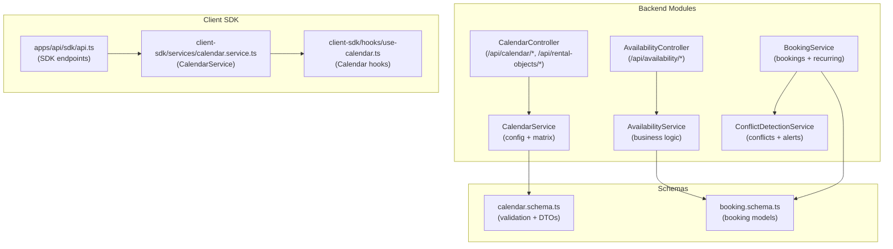
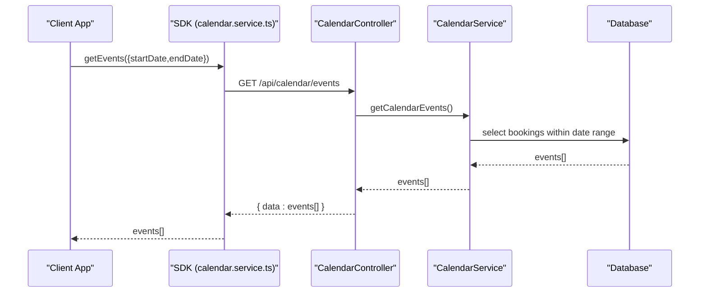
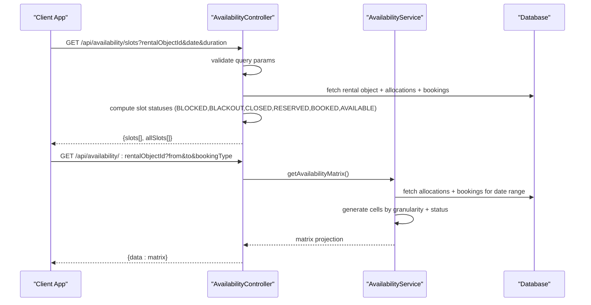
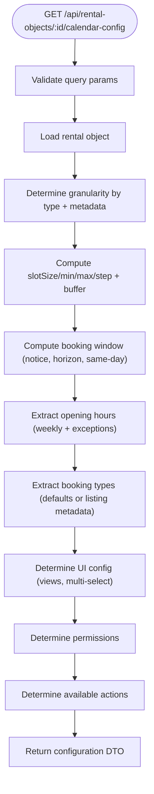
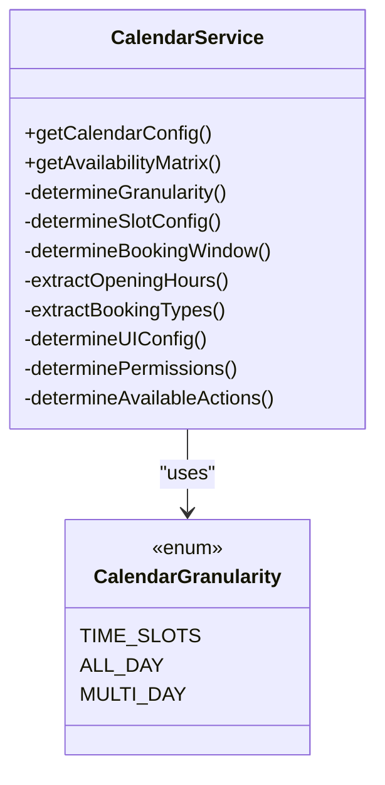
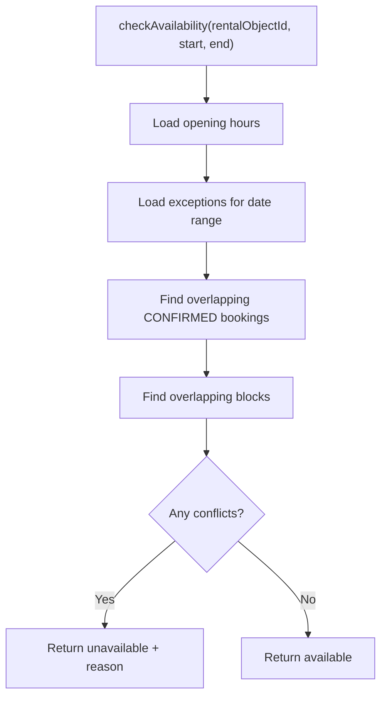
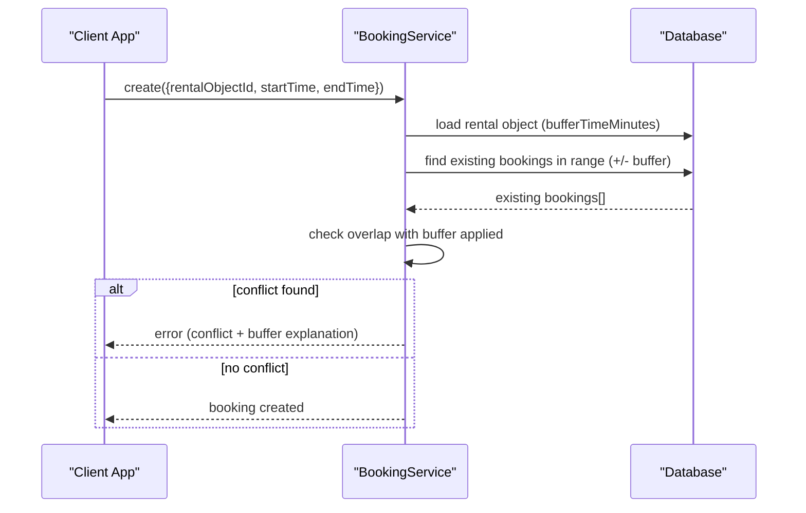
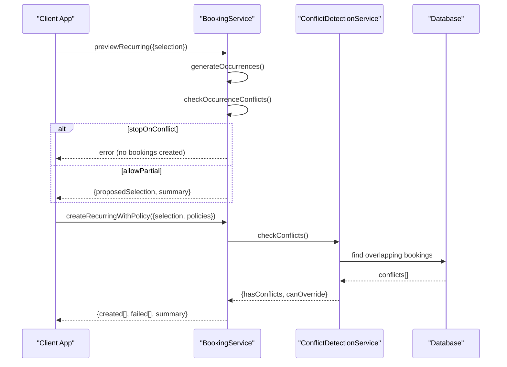
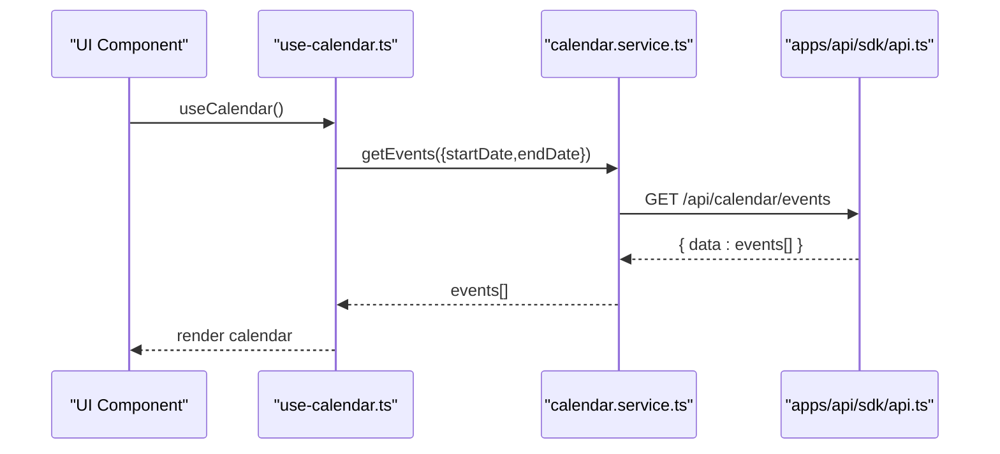
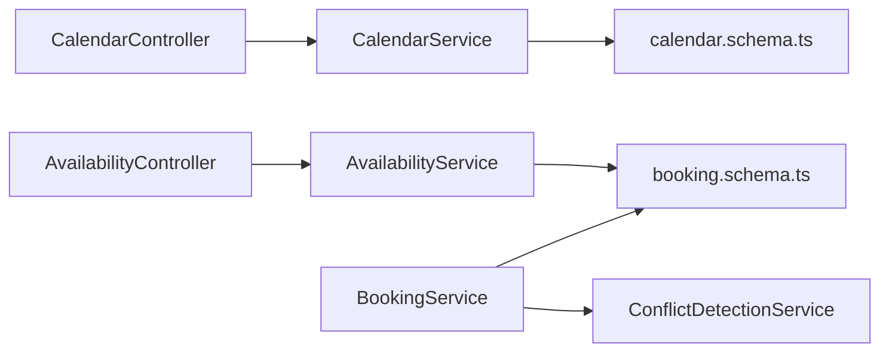

# Availability & Calendar System

<cite>
**Referenced Files in This Document**
- [availability.controller.ts](file://apps/api/src/modules/availability/availability.controller.ts)
- [availability.service.ts](file://apps/api/src/modules/availability/availability.service.ts)
- [calendar.controller.ts](file://apps/api/src/modules/calendar/calendar.controller.ts)
- [calendar.service.ts](file://apps/api/src/modules/calendar/calendar.service.ts)
- [calendar.schema.ts](file://apps/api/src/schemas/calendar.schema.ts)
- [booking.service.ts](file://apps/api/src/modules/booking/booking.service.ts)
- [conflict-detection.service.ts](file://apps/api/src/services/conflict-detection.service.ts)
- [booking.schema.ts](file://apps/api/src/schemas/booking.schema.ts)
- [api.ts](file://apps/api/sdk/api.ts)
- [calendar.service.ts](file://packages/client-sdk/src/services/calendar.service.ts)
- [use-calendar.ts](file://packages/client-sdk/src/hooks/use-calendar.ts)
</cite>

## Table of Contents
1. [Introduction](#introduction)
2. [Project Structure](#project-structure)
3. [Core Components](#core-components)
4. [Architecture Overview](#architecture-overview)
5. [Detailed Component Analysis](#detailed-component-analysis)
6. [Dependency Analysis](#dependency-analysis)
7. [Performance Considerations](#performance-considerations)
8. [Troubleshooting Guide](#troubleshooting-guide)
9. [Conclusion](#conclusion)

## Introduction
This document explains the availability and calendar system powering the booking platform. It covers:
- Availability query endpoints and date-range filtering
- Calendar configuration APIs and booking modes
- Integration with the availability service and booking conflict detection
- Real-time availability updates and buffer time enforcement
- How different categories influence calendar behavior

The system separates concerns across controllers, services, and schemas, with robust validation and flexible calendar configurations per rental object category.

## Project Structure
The availability and calendar system spans backend modules and client SDKs:
- Backend modules: availability, calendar, booking, conflict detection
- Schemas: calendar and booking domain models
- Client SDK: services and hooks for calendar and availability queries

**Diagram sources**
- [availability.controller.ts](file://apps/api/src/modules/availability/availability.controller.ts#L1-L320)
- [availability.service.ts](file://apps/api/src/modules/availability/availability.service.ts#L1-L457)
- [calendar.controller.ts](file://apps/api/src/modules/calendar/calendar.controller.ts#L1-L165)
- [calendar.service.ts](file://apps/api/src/modules/calendar/calendar.service.ts#L1-L668)
- [calendar.schema.ts](file://apps/api/src/schemas/calendar.schema.ts#L1-L300)
- [booking.service.ts](file://apps/api/src/modules/booking/booking.service.ts#L1-L800)
- [conflict-detection.service.ts](file://apps/api/src/services/conflict-detection.service.ts#L1-L217)
- [api.ts](file://apps/api/sdk/api.ts#L390-L414)
- [calendar.service.ts](file://packages/client-sdk/src/services/calendar.service.ts#L346-L372)
- [use-calendar.ts](file://packages/client-sdk/src/hooks/use-calendar.ts)

**Section sources**
- [availability.controller.ts](file://apps/api/src/modules/availability/availability.controller.ts#L1-L320)
- [calendar.controller.ts](file://apps/api/src/modules/calendar/calendar.controller.ts#L1-L165)
- [calendar.schema.ts](file://apps/api/src/schemas/calendar.schema.ts#L1-L300)
- [api.ts](file://apps/api/sdk/api.ts#L390-L414)

## Core Components
- AvailabilityController: exposes availability endpoints, including legacy slot retrieval and matrix projection
- AvailabilityService: computes availability calendars, checks slot availability, and aggregates opening hours and exceptions
- CalendarController: provides calendar configuration and availability matrix endpoints
- CalendarService: generates calendar configuration and availability matrices based on listing type and metadata
- BookingService: integrates with availability via buffer time and conflict detection
- ConflictDetectionService: detects and records booking conflicts with real-time alerts
- Schemas: define validation and DTOs for calendar and booking domains

**Section sources**
- [availability.controller.ts](file://apps/api/src/modules/availability/availability.controller.ts#L132-L320)
- [availability.service.ts](file://apps/api/src/modules/availability/availability.service.ts#L32-L457)
- [calendar.controller.ts](file://apps/api/src/modules/calendar/calendar.controller.ts#L24-L165)
- [calendar.service.ts](file://apps/api/src/modules/calendar/calendar.service.ts#L74-L668)
- [booking.service.ts](file://apps/api/src/modules/booking/booking.service.ts#L54-L138)
- [conflict-detection.service.ts](file://apps/api/src/services/conflict-detection.service.ts#L40-L217)
- [calendar.schema.ts](file://apps/api/src/schemas/calendar.schema.ts#L1-L300)

## Architecture Overview
The system follows a layered architecture:
- Controllers handle HTTP requests and delegate to services
- Services encapsulate business logic and coordinate repositories
- Schemas enforce validation and define DTOs
- Client SDKs consume backend endpoints for calendar and availability

**Diagram sources**
- [calendar.service.ts](file://apps/api/src/modules/calendar/calendar.service.ts#L413-L423)
- [calendar.controller.ts](file://apps/api/src/modules/calendar/calendar.controller.ts#L94-L116)
- [calendar.service.ts](file://packages/client-sdk/src/services/calendar.service.ts#L367-L371)

## Detailed Component Analysis

### Availability Endpoints and Matrix Projection
- Legacy slot endpoint: returns time slots for a single date with detailed status and optional conflict metadata
- Matrix endpoint: returns cell-by-cell availability for a date range, supporting TIME_SLOTS, ALL_DAY, and MULTI_DAY granularities

**Diagram sources**
- [availability.controller.ts](file://apps/api/src/modules/availability/availability.controller.ts#L149-L318)
- [availability.service.ts](file://apps/api/src/modules/availability/availability.service.ts#L196-L344)

**Section sources**
- [availability.controller.ts](file://apps/api/src/modules/availability/availability.controller.ts#L149-L318)
- [availability.service.ts](file://apps/api/src/modules/availability/availability.service.ts#L196-L344)

### Calendar Configuration APIs
- Endpoint: GET /api/rental-objects/:id/calendar-config
- Purpose: Returns calendar behavior configuration derived from listing type and metadata
- Configuration includes granularity, slot rules, booking windows, opening hours, booking types, UI hints, permissions, and available actions

**Diagram sources**
- [calendar.controller.ts](file://apps/api/src/modules/calendar/calendar.controller.ts#L31-L54)
- [calendar.service.ts](file://apps/api/src/modules/calendar/calendar.service.ts#L147-L189)

**Section sources**
- [calendar.controller.ts](file://apps/api/src/modules/calendar/calendar.controller.ts#L31-L54)
- [calendar.service.ts](file://apps/api/src/modules/calendar/calendar.service.ts#L147-L189)
- [calendar.schema.ts](file://apps/api/src/schemas/calendar.schema.ts#L156-L195)

### Booking Modes and Category Influence
- Booking modes: SINGLE_SLOT, IN_GAME, RECURRING
- Calendar granularity: TIME_SLOTS (resource-like), ALL_DAY (event-like), MULTI_DAY (accommodation-like)
- Category influence: CalendarService determines granularity from listing.type and metadata overrides

**Diagram sources**
- [calendar.service.ts](file://apps/api/src/modules/calendar/calendar.service.ts#L292-L483)
- [calendar.schema.ts](file://apps/api/src/schemas/calendar.schema.ts#L14-L15)

**Section sources**
- [calendar.service.ts](file://apps/api/src/modules/calendar/calendar.service.ts#L292-L483)
- [booking.schema.ts](file://apps/api/src/schemas/booking.schema.ts#L133-L141)

### Availability Checking Workflows
- Slot availability: checks opening hours, exceptions, bookings, and blocks; supports buffer time around existing bookings
- Calendar matrix: generates cells per day or per slot based on granularity and status mapping

**Diagram sources**
- [availability.service.ts](file://apps/api/src/modules/availability/availability.service.ts#L277-L344)

**Section sources**
- [availability.service.ts](file://apps/api/src/modules/availability/availability.service.ts#L277-L344)

### Blocking Dates and Buffer Time Enforcement
- Buffer time: configurable per listing; enforced when checking availability and creating bookings
- Blocks: administrative blocks and blackouts take precedence over bookings

**Diagram sources**
- [booking.service.ts](file://apps/api/src/modules/booking/booking.service.ts#L54-L138)
- [conflict-detection.service.ts](file://apps/api/src/services/conflict-detection.service.ts#L44-L81)

**Section sources**
- [booking.service.ts](file://apps/api/src/modules/booking/booking.service.ts#L54-L138)
- [conflict-detection.service.ts](file://apps/api/src/services/conflict-detection.service.ts#L44-L81)

### Integration with Booking System for Conflict Resolution
- Recurring booking previews: generate occurrences and check availability; apply STOP_ON_CONFLICT or ALLOW_PARTIAL policies
- Conflict detection: records conflicts and sends real-time alerts; supports resolution actions

**Diagram sources**
- [booking.service.ts](file://apps/api/src/modules/booking/booking.service.ts#L780-L800)
- [booking.service.ts](file://apps/api/src/modules/booking/booking.service.ts#L565-L774)
- [conflict-detection.service.ts](file://apps/api/src/services/conflict-detection.service.ts#L44-L81)

**Section sources**
- [booking.service.ts](file://apps/api/src/modules/booking/booking.service.ts#L780-L800)
- [booking.service.ts](file://apps/api/src/modules/booking/booking.service.ts#L565-L774)
- [conflict-detection.service.ts](file://apps/api/src/services/conflict-detection.service.ts#L44-L81)

### Client SDK Integration
- SDK endpoints: calendar events and availability slots
- Client services/hooks: typed access to calendar and availability data

**Diagram sources**
- [use-calendar.ts](file://packages/client-sdk/src/hooks/use-calendar.ts)
- [calendar.service.ts](file://packages/client-sdk/src/services/calendar.service.ts#L367-L371)
- [api.ts](file://apps/api/sdk/api.ts#L394-L401)

**Section sources**
- [api.ts](file://apps/api/sdk/api.ts#L394-L410)
- [calendar.service.ts](file://packages/client-sdk/src/services/calendar.service.ts#L346-L372)
- [use-calendar.ts](file://packages/client-sdk/src/hooks/use-calendar.ts)

## Dependency Analysis
- Controllers depend on services for business logic
- Services depend on schemas for validation and DTOs
- BookingService integrates with ConflictDetectionService and applies buffer time from rental object metadata
- CalendarService depends on listing metadata to derive configuration

**Diagram sources**
- [availability.controller.ts](file://apps/api/src/modules/availability/availability.controller.ts#L132-L136)
- [calendar.controller.ts](file://apps/api/src/modules/calendar/calendar.controller.ts#L32-L35)
- [booking.service.ts](file://apps/api/src/modules/booking/booking.service.ts#L45-L49)
- [conflict-detection.service.ts](file://apps/api/src/services/conflict-detection.service.ts#L40-L41)
- [calendar.schema.ts](file://apps/api/src/schemas/calendar.schema.ts#L1-L300)
- [booking.schema.ts](file://apps/api/src/schemas/booking.schema.ts#L1-L485)

**Section sources**
- [availability.controller.ts](file://apps/api/src/modules/availability/availability.controller.ts#L132-L136)
- [calendar.controller.ts](file://apps/api/src/modules/calendar/calendar.controller.ts#L32-L35)
- [booking.service.ts](file://apps/api/src/modules/booking/booking.service.ts#L45-L49)
- [conflict-detection.service.ts](file://apps/api/src/services/conflict-detection.service.ts#L40-L41)
- [calendar.schema.ts](file://apps/api/src/schemas/calendar.schema.ts#L1-L300)
- [booking.schema.ts](file://apps/api/src/schemas/booking.schema.ts#L1-L485)

## Performance Considerations
- Matrix generation: iterate by day or slot depending on granularity; avoid unnecessary allocations by filtering date ranges
- Buffer time: apply only when needed; cache rental object metadata where appropriate
- Conflict detection: limit overlapping booking queries to relevant time ranges and statuses
- Pagination: use query parameters for large datasets (e.g., calendar events)

## Troubleshooting Guide
- Validation errors: ensure from/to dates are valid and from ≤ to; verify bookingType if provided
- Scope access: org_member and saksbehandler users require active case_handler_scope for calendar access
- Buffer time conflicts: when creating bookings, conflicts may arise due to buffer time around existing bookings
- Real-time alerts: conflicts trigger WebSocket alerts; verify WebSocket service configuration

**Section sources**
- [calendar.schema.ts](file://apps/api/src/schemas/calendar.schema.ts#L268-L277)
- [calendar.service.ts](file://apps/api/src/modules/calendar/calendar.service.ts#L84-L141)
- [booking.service.ts](file://apps/api/src/modules/booking/booking.service.ts#L78-L92)
- [conflict-detection.service.ts](file://apps/api/src/services/conflict-detection.service.ts#L109-L115)

## Conclusion
The availability and calendar system provides a robust, extensible foundation for managing rental object availability across multiple booking modes. It enforces buffer times, integrates with conflict detection, and offers flexible calendar configurations per listing category. The client SDK simplifies consumption of calendar and availability data, enabling real-time updates and seamless booking experiences.