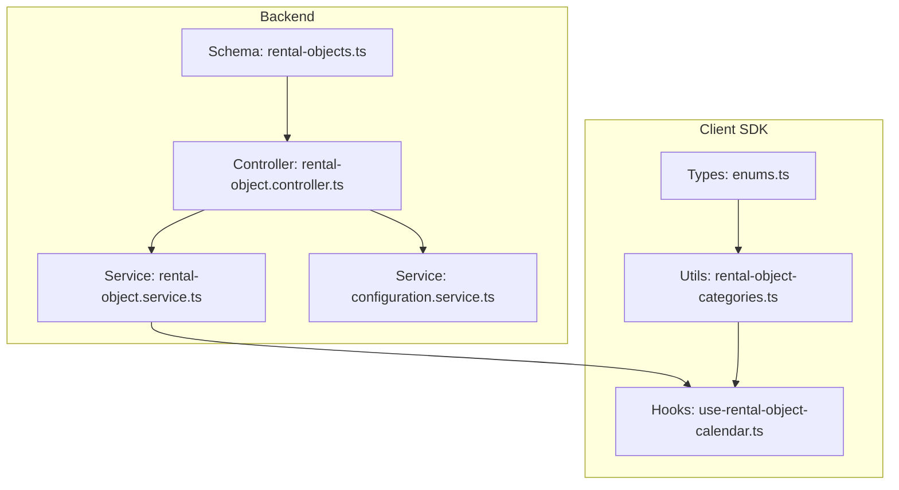
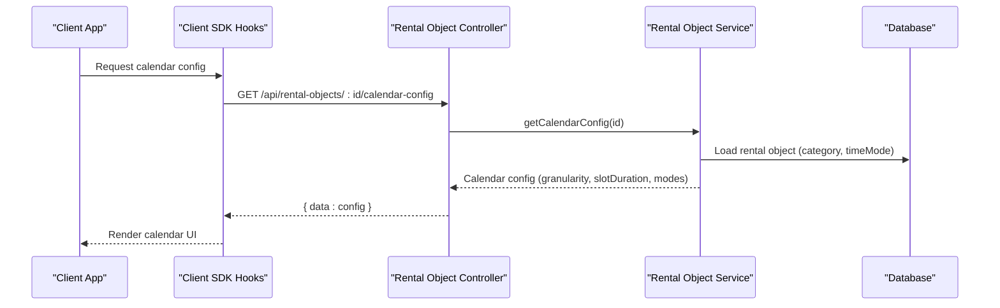
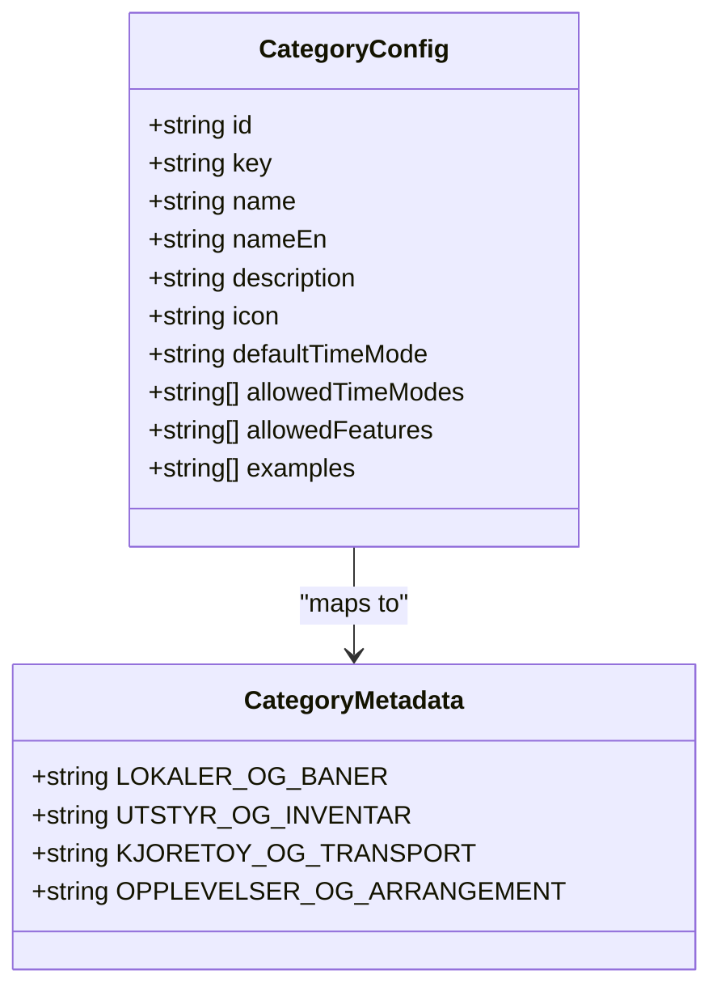
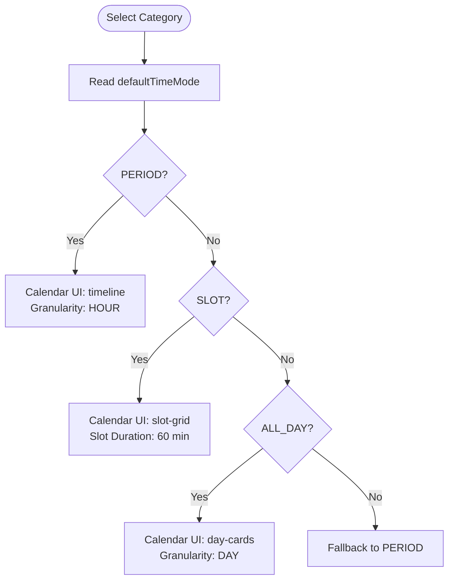
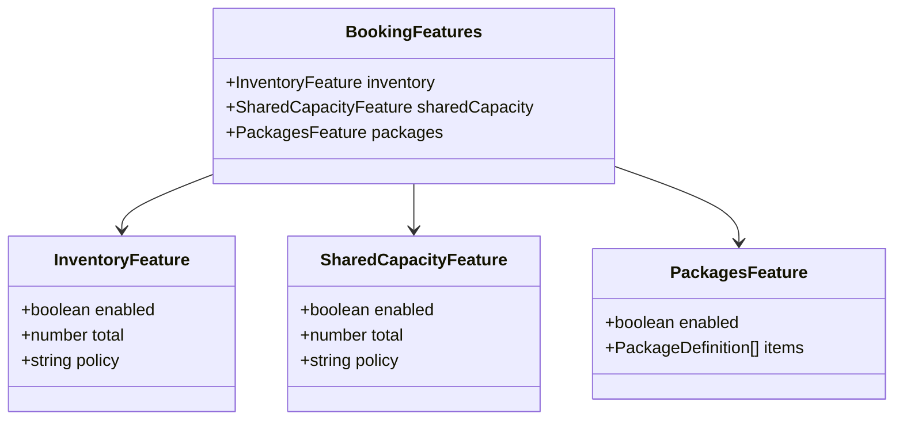
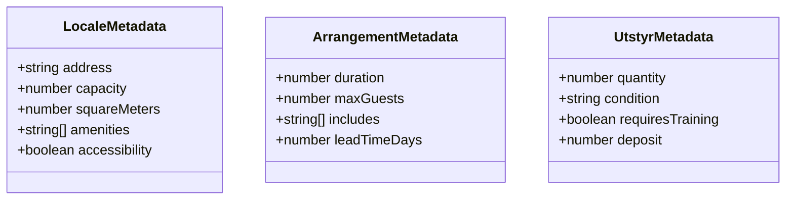
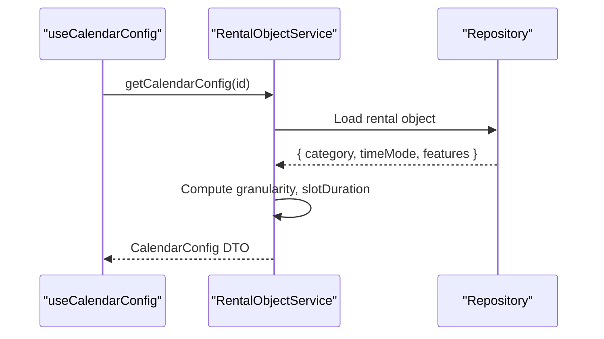
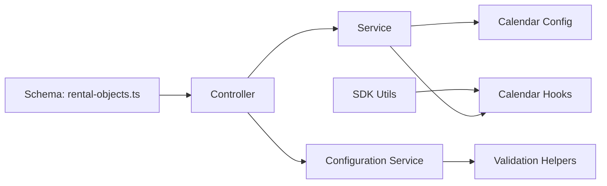

# Category System Management

<cite>
**Referenced Files in This Document**
- [category-metadata.ts](file://apps/api/src/modules/rental-objects/category-metadata.ts)
- [rental-object-categories.ts](file://packages/client-sdk/src/utils/rental-object-categories.ts)
- [rental-objects.ts](file://apps/api/src/database/schema/rental-objects.ts)
- [rental-object.schema.ts](file://apps/api/src/schemas/rental-object.schema.ts)
- [rental-object.service.ts](file://apps/api/src/modules/rental-objects/rental-object.service.ts)
- [rental-object.controller.ts](file://apps/api/src/modules/rental-objects/rental-object.controller.ts)
- [configuration.service.ts](file://apps/api/src/modules/configuration/configuration.service.ts)
- [use-rental-object-calendar.ts](file://packages/client-sdk/src/hooks/use-rental-object-calendar.ts)
- [enums.ts](file://packages/client-sdk/src/types/enums.ts)
</cite>

## Table of Contents
1. [Introduction](#introduction)
2. [Project Structure](#project-structure)
3. [Core Components](#core-components)
4. [Architecture Overview](#architecture-overview)
5. [Detailed Component Analysis](#detailed-component-analysis)
6. [Dependency Analysis](#dependency-analysis)
7. [Performance Considerations](#performance-considerations)
8. [Troubleshooting Guide](#troubleshooting-guide)
9. [Conclusion](#conclusion)

## Introduction
This document explains the rental object category system used to classify municipal assets available for booking. It covers the four main categories (venues and courts, equipment and inventory, vehicles and transport, experiences and events), booking modes (period, slot, all-day), allowed features (inventory tracking, shared capacity, packages), category metadata, icon systems, and how categories drive UI behavior. It also documents category-specific configurations, inheritance patterns, feature combinations, and integration with the calendar configuration system.

## Project Structure
The category system spans backend schemas, controllers, services, and client-side SDK utilities:

- Backend schema defines canonical category, time mode, and feature definitions
- Controllers expose category metadata and configuration endpoints
- Services implement business logic for calendar configuration and policies
- Client SDK provides category utilities, icons, and calendar hooks

**Diagram sources**
- [rental-objects.ts](file://apps/api/src/database/schema/rental-objects.ts#L27-L152)
- [rental-object.controller.ts](file://apps/api/src/modules/rental-objects/rental-object.controller.ts#L20-L245)
- [rental-object.service.ts](file://apps/api/src/modules/rental-objects/rental-object.service.ts#L287-L356)
- [configuration.service.ts](file://apps/api/src/modules/configuration/configuration.service.ts#L96-L114)
- [rental-object-categories.ts](file://packages/client-sdk/src/utils/rental-object-categories.ts#L18-L86)
- [use-rental-object-calendar.ts](file://packages/client-sdk/src/hooks/use-rental-object-calendar.ts#L27-L119)
- [enums.ts](file://packages/client-sdk/src/types/enums.ts#L20-L71)

**Section sources**
- [rental-objects.ts](file://apps/api/src/database/schema/rental-objects.ts#L27-L152)
- [rental-object.controller.ts](file://apps/api/src/modules/rental-objects/rental-object.controller.ts#L20-L245)
- [rental-object.service.ts](file://apps/api/src/modules/rental-objects/rental-object.service.ts#L287-L356)
- [configuration.service.ts](file://apps/api/src/modules/configuration/configuration.service.ts#L96-L114)
- [rental-object-categories.ts](file://packages/client-sdk/src/utils/rental-object-categories.ts#L18-L86)
- [use-rental-object-calendar.ts](file://packages/client-sdk/src/hooks/use-rental-object-calendar.ts#L27-L119)
- [enums.ts](file://packages/client-sdk/src/types/enums.ts#L20-L71)

## Core Components
- Categories: Four top-level categories define asset types and default behaviors
- Booking modes: Period, Slot, and All-day modes determine calendar UI and selection behavior
- Features: Inventory tracking, shared capacity, and packages enable advanced booking scenarios
- Metadata: Category-specific metadata supports rich content per category
- Icons and labels: Consistent UI presentation via standardized icon names and i18n keys
- Calendar integration: Category drives calendar configuration, slot durations, and UI variants

**Section sources**
- [rental-object-categories.ts](file://packages/client-sdk/src/utils/rental-object-categories.ts#L18-L86)
- [rental-object.schema.ts](file://apps/api/src/schemas/rental-object.schema.ts#L126-L157)
- [rental-objects.ts](file://apps/api/src/database/schema/rental-objects.ts#L27-L60)
- [enums.ts](file://packages/client-sdk/src/types/enums.ts#L20-L71)

## Architecture Overview
The category system is schema-driven and integrates with controllers, services, and client SDKs:

**Diagram sources**
- [rental-object.controller.ts](file://apps/api/src/modules/rental-objects/rental-object.controller.ts#L207-L211)
- [rental-object.service.ts](file://apps/api/src/modules/rental-objects/rental-object.service.ts#L287-L314)
- [use-rental-object-calendar.ts](file://packages/client-sdk/src/hooks/use-rental-object-calendar.ts#L27-L37)

## Detailed Component Analysis

### Categories and Allowed Features
Each category defines:
- Default booking time mode
- Allowed time modes
- Allowed features
- Icon and labels for UI

**Diagram sources**
- [rental-object.controller.ts](file://apps/api/src/modules/rental-objects/rental-object.controller.ts#L258-L307)
- [rental-object-categories.ts](file://packages/client-sdk/src/utils/rental-object-categories.ts#L57-L86)

**Section sources**
- [rental-object.controller.ts](file://apps/api/src/modules/rental-objects/rental-object.controller.ts#L258-L307)
- [rental-object-categories.ts](file://packages/client-sdk/src/utils/rental-object-categories.ts#L57-L86)

### Booking Modes and Calendar Behavior
Booking modes influence calendar UI and slot behavior:
- Period: Timeline drag-select with flexible start/end
- Slot: Grid selection with predefined durations
- All-day: Day cards with multi-day picker

**Diagram sources**
- [rental-object.controller.ts](file://apps/api/src/modules/rental-objects/rental-object.controller.ts#L316-L344)
- [rental-object.service.ts](file://apps/api/src/modules/rental-objects/rental-object.service.ts#L293-L296)

**Section sources**
- [rental-object.controller.ts](file://apps/api/src/modules/rental-objects/rental-object.controller.ts#L316-L344)
- [rental-object.service.ts](file://apps/api/src/modules/rental-objects/rental-object.service.ts#L293-L296)

### Features: Inventory, Shared Capacity, Packages
Features enable advanced booking scenarios:
- Inventory: Track available units with FIFO or concurrent policies
- Shared capacity: Track available places per slot or per day
- Packages: Offer bundled services during checkout

**Diagram sources**
- [rental-object.schema.ts](file://apps/api/src/schemas/rental-object.schema.ts#L126-L157)
- [enums.ts](file://packages/client-sdk/src/types/enums.ts#L30-L65)

**Section sources**
- [rental-object.schema.ts](file://apps/api/src/schemas/rental-object.schema.ts#L126-L157)
- [enums.ts](file://packages/client-sdk/src/types/enums.ts#L30-L65)

### Category Metadata Structure
Categories support category-specific metadata and defaults:
- Facilities (LOCALE): Address, capacity, square meters, amenities, accessibility
- Arrangements (ARRANGEMENT): Duration, max guests, includes, lead time
- Equipment (UTSTYR): Quantity, condition, training requirement, deposit

**Diagram sources**
- [category-metadata.ts](file://apps/api/src/modules/rental-objects/category-metadata.ts#L17-L40)

**Section sources**
- [category-metadata.ts](file://apps/api/src/modules/rental-objects/category-metadata.ts#L17-L40)

### Icons and Labels
- Icons: building, package, car, calendar
- Labels: i18n keys for Norwegian and English translations
- Deprecated legacy exports preserved for backward compatibility

**Section sources**
- [rental-object-categories.ts](file://packages/client-sdk/src/utils/rental-object-categories.ts#L81-L86)
- [rental-object-categories.ts](file://packages/client-sdk/src/utils/rental-object-categories.ts#L57-L76)

### Calendar Configuration Integration
The service constructs calendar configuration based on category and time mode:
- Granularity derived from time mode (DAY vs HOUR)
- Slot duration defaults differ by mode
- Available actions and permissions returned for UI rendering

**Diagram sources**
- [use-rental-object-calendar.ts](file://packages/client-sdk/src/hooks/use-rental-object-calendar.ts#L27-L37)
- [rental-object.service.ts](file://apps/api/src/modules/rental-objects/rental-object.service.ts#L287-L314)

**Section sources**
- [use-rental-object-calendar.ts](file://packages/client-sdk/src/hooks/use-rental-object-calendar.ts#L27-L37)
- [rental-object.service.ts](file://apps/api/src/modules/rental-objects/rental-object.service.ts#L287-L314)

### Category Inheritance and Feature Combinations
- Categories inherit allowed time modes and features from category definitions
- Feature combinations are additive; multiple features can be enabled simultaneously
- Examples demonstrate typical combinations per category

**Section sources**
- [rental-object.controller.ts](file://apps/api/src/modules/rental-objects/rental-object.controller.ts#L258-L307)
- [rental-object.schema.ts](file://apps/api/src/schemas/rental-object.schema.ts#L126-L157)

## Dependency Analysis
The category system depends on:
- Database schema for canonical definitions
- Configuration service for dynamic validation and lookup
- Client SDK for UI presentation and calendar hooks

**Diagram sources**
- [rental-objects.ts](file://apps/api/src/database/schema/rental-objects.ts#L27-L152)
- [rental-object.controller.ts](file://apps/api/src/modules/rental-objects/rental-object.controller.ts#L20-L245)
- [configuration.service.ts](file://apps/api/src/modules/configuration/configuration.service.ts#L341-L377)
- [rental-object-categories.ts](file://packages/client-sdk/src/utils/rental-object-categories.ts#L18-L86)
- [use-rental-object-calendar.ts](file://packages/client-sdk/src/hooks/use-rental-object-calendar.ts#L27-L119)

**Section sources**
- [rental-objects.ts](file://apps/api/src/database/schema/rental-objects.ts#L27-L152)
- [configuration.service.ts](file://apps/api/src/modules/configuration/configuration.service.ts#L341-L377)
- [rental-object-categories.ts](file://packages/client-sdk/src/utils/rental-object-categories.ts#L18-L86)
- [use-rental-object-calendar.ts](file://packages/client-sdk/src/hooks/use-rental-object-calendar.ts#L27-L119)

## Performance Considerations
- Calendar configuration caching: Config queries are cached for 5 minutes to reduce load
- Availability queries refresh frequently (every 30 seconds) to reflect real-time changes
- Use lazy loading and pagination for listing endpoints to minimize payload sizes

[No sources needed since this section provides general guidance]

## Troubleshooting Guide
Common issues and resolutions:
- Invalid category or time mode: Use validation helpers from the configuration service to check validity
- Calendar UI mismatch: Verify category default time mode and allowed modes align with expectations
- Feature not appearing: Confirm the category allows the feature and the rental object enables it

**Section sources**
- [configuration.service.ts](file://apps/api/src/modules/configuration/configuration.service.ts#L341-L377)
- [rental-object.service.ts](file://apps/api/src/modules/rental-objects/rental-object.service.ts#L287-L314)

## Conclusion
The category system provides a robust, schema-driven foundation for rental object classification, enabling flexible booking modes, advanced features, and consistent UI behavior. By leveraging category metadata, icons, and calendar integration, applications can deliver tailored booking experiences while maintaining operational control and extensibility.