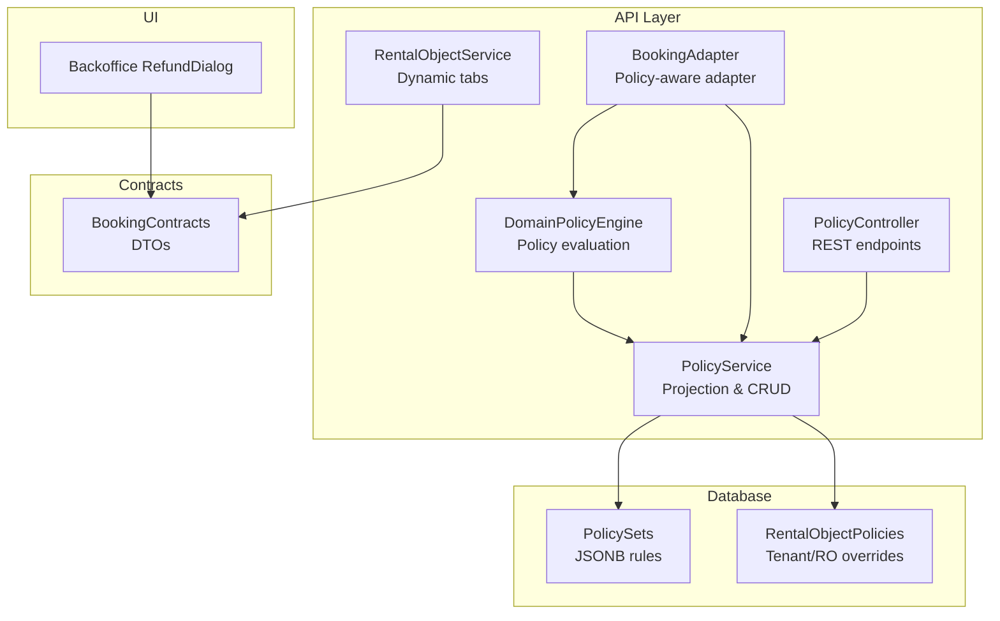
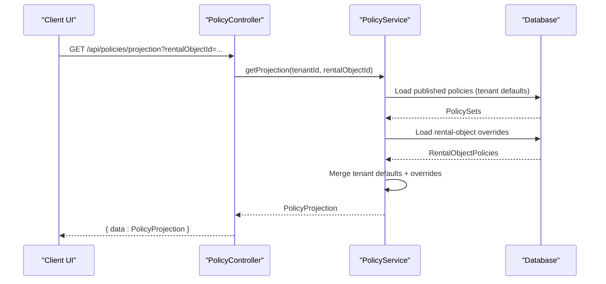
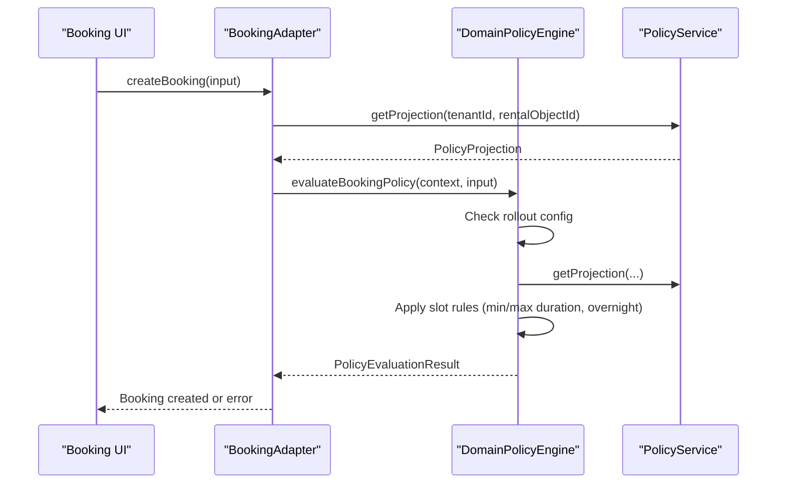
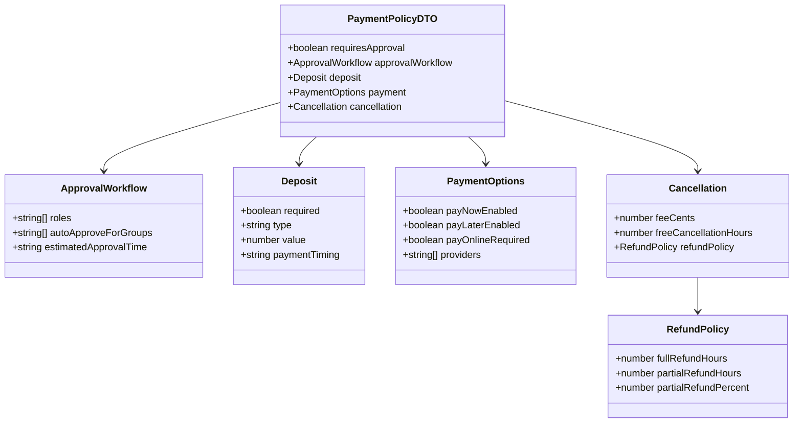
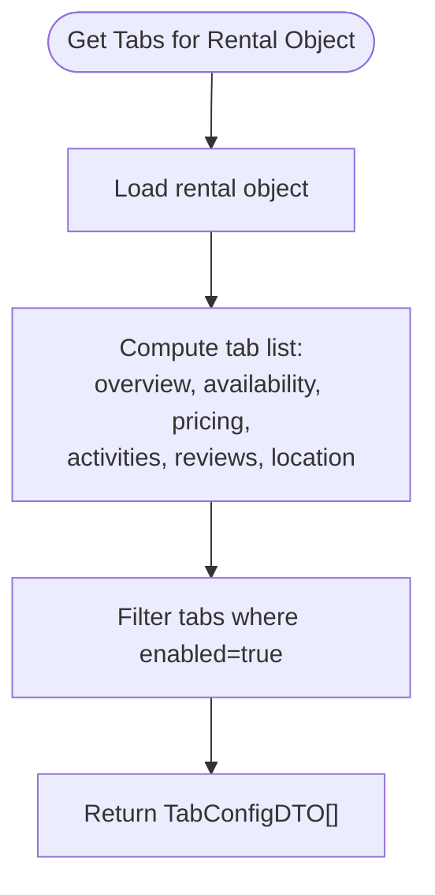
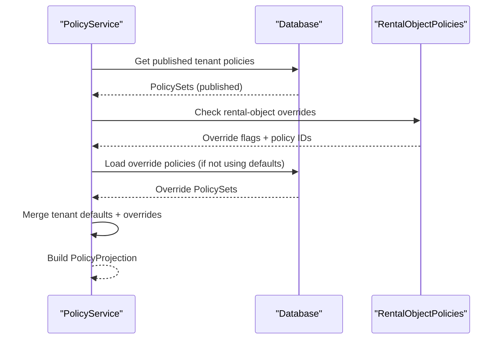
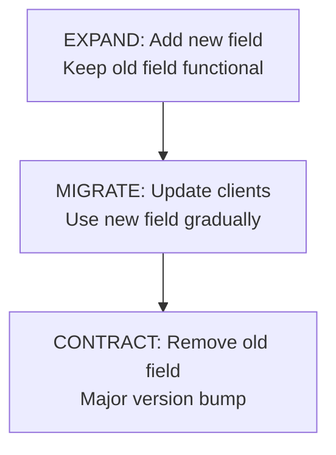
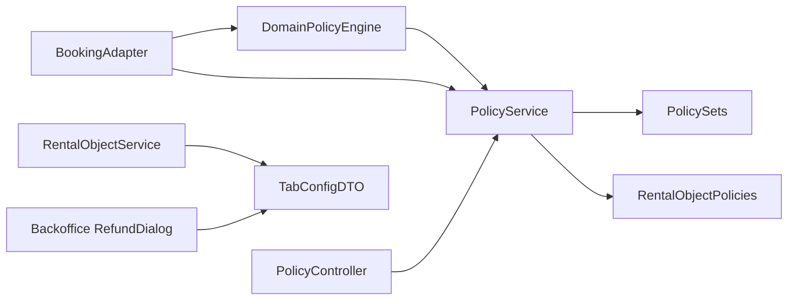

# Contract-First Policy System

<cite>
**Referenced Files in This Document**
- [policy-engine.ts](file://apps/api/src/modules/domain/policy-engine.ts)
- [booking.adapter.ts](file://apps/api/src/modules/domain/adapters/booking.adapter.ts)
- [policy.service.ts](file://apps/api/src/modules/policy/policy.service.ts)
- [policy.controller.ts](file://apps/api/src/modules/policy/policy.controller.ts)
- [policy.ts](file://apps/api/src/database/schema/policy.ts)
- [rental-object.service.ts](file://apps/api/src/modules/rental-objects/rental-object.service.ts)
- [booking-contracts.ts](file://packages/client-sdk/src/types/booking-contracts.ts)
- [RefundDialog.tsx](file://apps/backoffice/src/components/RefundDialog.tsx)
- [contract-evolution.md](file://docs/architecture/contract-evolution.md)
- [EXPAND_CONTRACT_PLAYBOOK.md](file://docs/reports/EXPAND_CONTRACT_PLAYBOOK.md)
</cite>

## Table of Contents
1. [Introduction](#introduction)
2. [Project Structure](#project-structure)
3. [Core Components](#core-components)
4. [Architecture Overview](#architecture-overview)
5. [Detailed Component Analysis](#detailed-component-analysis)
6. [Dependency Analysis](#dependency-analysis)
7. [Performance Considerations](#performance-considerations)
8. [Troubleshooting Guide](#troubleshooting-guide)
9. [Conclusion](#conclusion)

## Introduction
This document describes the contract-first policy system that governs booking, pricing, approval, and payment behaviors across the platform. It explains how policy rules are defined, projected, enforced, and surfaced to the UI via strongly-typed contracts. The system supports gradual rollout, tenant-specific overrides, and contract evolution patterns to maintain backward compatibility during schema and API changes.

## Project Structure
The policy system spans backend services, domain adapters, database schemas, and client SDK contracts:

- Policy definition and enforcement live in the API module under domain and policy modules
- Rental object services expose dynamic tab configuration following contract-first principles
- Client SDK defines canonical contracts for booking, payment, pricing preview, and tab configuration
- Backoffice UI components consume payment policy data for refund workflows

**Diagram sources**
- [policy-engine.ts](file://apps/api/src/modules/domain/policy-engine.ts#L66-L207)
- [policy.service.ts](file://apps/api/src/modules/policy/policy.service.ts#L415-L471)
- [policy.controller.ts](file://apps/api/src/modules/policy/policy.controller.ts#L61-L213)
- [booking.adapter.ts](file://apps/api/src/modules/domain/adapters/booking.adapter.ts#L85-L224)
- [rental-object.service.ts](file://apps/api/src/modules/rental-objects/rental-object.service.ts#L407-L466)
- [booking-contracts.ts](file://packages/client-sdk/src/types/booking-contracts.ts#L19-L380)

**Section sources**
- [policy-engine.ts](file://apps/api/src/modules/domain/policy-engine.ts#L1-L237)
- [policy.service.ts](file://apps/api/src/modules/policy/policy.service.ts#L70-L471)
- [policy.controller.ts](file://apps/api/src/modules/policy/policy.controller.ts#L1-L216)
- [booking.adapter.ts](file://apps/api/src/modules/domain/adapters/booking.adapter.ts#L1-L265)
- [rental-object.service.ts](file://apps/api/src/modules/rental-objects/rental-object.service.ts#L400-L468)
- [booking-contracts.ts](file://packages/client-sdk/src/types/booking-contracts.ts#L1-L380)

## Core Components
- DomainPolicyEngine: Centralized policy evaluator with rollout controls and rule application
- PolicyService: Loads published policies, merges tenant/rental-object overrides, and projects rules
- PolicyController: Exposes REST endpoints for policy lifecycle management
- BookingAdapter: Policy-aware wrapper around legacy booking operations
- RentalObjectService: Computes dynamic tabs based on rental object features and category
- Client SDK Contracts: Strongly-typed DTOs defining booking policy, payment policy, pricing preview, recurring preview, tab configuration, and calendar data

Key responsibilities:
- Policy evaluation and gradual rollout
- Tenant and rental-object policy inheritance
- UI-driven contract exposure for booking and payment behaviors
- Dynamic tab visibility and ordering

**Section sources**
- [policy-engine.ts](file://apps/api/src/modules/domain/policy-engine.ts#L66-L207)
- [policy.service.ts](file://apps/api/src/modules/policy/policy.service.ts#L415-L471)
- [policy.controller.ts](file://apps/api/src/modules/policy/policy.controller.ts#L61-L213)
- [booking.adapter.ts](file://apps/api/src/modules/domain/adapters/booking.adapter.ts#L85-L224)
- [rental-object.service.ts](file://apps/api/src/modules/rental-objects/rental-object.service.ts#L407-L466)
- [booking-contracts.ts](file://packages/client-sdk/src/types/booking-contracts.ts#L19-L380)

## Architecture Overview
The policy system follows a contract-first approach: UI consumes canonical DTOs, and backend enforces business rules derived from published policy sets. Policies are merged from tenant defaults and rental-object-specific overrides, then projected into runtime-friendly structures.

**Diagram sources**
- [policy.controller.ts](file://apps/api/src/modules/policy/policy.controller.ts#L120-L128)
- [policy.service.ts](file://apps/api/src/modules/policy/policy.service.ts#L415-L471)

## Detailed Component Analysis

### Booking Policy API and Enforcement
The booking policy API returns all booking rules and constraints that drive the booking UI. The system evaluates policies at runtime and enforces constraints such as duration limits, overnight bookings, and blackout dates.

- Policy evaluation considers rollout configuration per policy type
- Slot rules enforce minimum/maximum durations and overnight restrictions
- Adapter validates input against policy rules before delegating to legacy service

**Diagram sources**
- [booking.adapter.ts](file://apps/api/src/modules/domain/adapters/booking.adapter.ts#L97-L126)
- [policy-engine.ts](file://apps/api/src/modules/domain/policy-engine.ts#L148-L177)
- [policy-engine.ts](file://apps/api/src/modules/domain/policy-engine.ts#L213-L237)

**Section sources**
- [booking.adapter.ts](file://apps/api/src/modules/domain/adapters/booking.adapter.ts#L97-L126)
- [booking.adapter.ts](file://apps/api/src/modules/domain/adapters/booking.adapter.ts#L229-L265)
- [policy-engine.ts](file://apps/api/src/modules/domain/policy-engine.ts#L94-L139)
- [policy-engine.ts](file://apps/api/src/modules/domain/policy-engine.ts#L148-L177)
- [policy-engine.ts](file://apps/api/src/modules/domain/policy-engine.ts#L213-L237)

### Payment Policy System
Payment policies define deposit requirements, cancellation penalties, and refund rules. The system exposes a payment policy DTO consumed by the UI and backoffice components.

**Diagram sources**
- [booking-contracts.ts](file://packages/client-sdk/src/types/booking-contracts.ts#L83-L128)

**Section sources**
- [booking-contracts.ts](file://packages/client-sdk/src/types/booking-contracts.ts#L83-L128)
- [RefundDialog.tsx](file://apps/backoffice/src/components/RefundDialog.tsx#L176-L220)

### Dynamic Tab Configuration System
The dynamic tab configuration system determines which tabs appear on rental object details pages. It is driven by the rental object's features and category, ensuring only relevant tabs are shown.

- Tabs include overview, availability, pricing, activities, reviews, and location
- Visibility depends on pricing presence, category, and feature flags
- Backoffice UI consumes the same contracts for consistent behavior

**Diagram sources**
- [rental-object.service.ts](file://apps/api/src/modules/rental-objects/rental-object.service.ts#L407-L466)
- [booking-contracts.ts](file://packages/client-sdk/src/types/booking-contracts.ts#L279-L287)

**Section sources**
- [rental-object.service.ts](file://apps/api/src/modules/rental-objects/rental-object.service.ts#L407-L466)
- [booking-contracts.ts](file://packages/client-sdk/src/types/booking-contracts.ts#L279-L287)

### Policy Inheritance and Projection
Policy inheritance merges tenant defaults with rental-object-specific overrides. Published policies are projected into runtime-friendly structures for domain modules.

- Tenant defaults are loaded when no specific override is configured
- Rental-object policies can disable tenant defaults and load specific policy sets
- Projection includes booking, pricing, approval, payment, and availability rules

**Diagram sources**
- [policy.service.ts](file://apps/api/src/modules/policy/policy.service.ts#L415-L471)

**Section sources**
- [policy.service.ts](file://apps/api/src/modules/policy/policy.service.ts#L415-L471)
- [policy.ts](file://apps/api/src/database/schema/policy.ts#L28-L339)
- [policy.ts](file://apps/api/src/database/schema/policy.ts#L341-L387)

### Contract Evolution Patterns
The platform employs expand/contract patterns to evolve contracts safely without breaking changes. This ensures UI and SDK remain functional during transitions.

- Dual-field support during migration maintains backward compatibility
- Validation schemas accept both old and new fields
- Documentation and checklists guide safe transitions

**Diagram sources**
- [EXPAND_CONTRACT_PLAYBOOK.md](file://docs/reports/EXPAND_CONTRACT_PLAYBOOK.md#L28-L36)
- [contract-evolution.md](file://docs/architecture/contract-evolution.md#L214-L230)

**Section sources**
- [EXPAND_CONTRACT_PLAYBOOK.md](file://docs/reports/EXPAND_CONTRACT_PLAYBOOK.md#L1-L866)
- [contract-evolution.md](file://docs/architecture/contract-evolution.md#L214-L230)

## Dependency Analysis
The policy system exhibits clear separation of concerns with well-defined dependencies:

- DomainPolicyEngine depends on PolicyService for projections
- BookingAdapter orchestrates policy evaluation and falls back to legacy logic
- PolicyController delegates to PolicyService for all policy operations
- RentalObjectService produces tab configuration aligned with contracts
- Backoffice UI consumes payment policy contracts for refund flows

**Diagram sources**
- [policy-engine.ts](file://apps/api/src/modules/domain/policy-engine.ts#L66-L75)
- [booking.adapter.ts](file://apps/api/src/modules/domain/adapters/booking.adapter.ts#L85-L92)
- [policy.controller.ts](file://apps/api/src/modules/policy/policy.controller.ts#L61-L62)
- [rental-object.service.ts](file://apps/api/src/modules/rental-objects/rental-object.service.ts#L407-L466)
- [booking-contracts.ts](file://packages/client-sdk/src/types/booking-contracts.ts#L279-L287)

**Section sources**
- [policy-engine.ts](file://apps/api/src/modules/domain/policy-engine.ts#L66-L75)
- [booking.adapter.ts](file://apps/api/src/modules/domain/adapters/booking.adapter.ts#L85-L92)
- [policy.controller.ts](file://apps/api/src/modules/policy/policy.controller.ts#L61-L62)
- [rental-object.service.ts](file://apps/api/src/modules/rental-objects/rental-object.service.ts#L407-L466)
- [booking-contracts.ts](file://packages/client-sdk/src/types/booking-contracts.ts#L279-L287)

## Performance Considerations
- Gradual rollout reduces risk and allows incremental monitoring
- Policy projections are cached to minimize repeated database queries
- Adapter fallback ensures graceful degradation when policy services are unavailable
- Filtering tabs at the service layer avoids unnecessary UI rendering

## Troubleshooting Guide
Common issues and resolutions:
- Policy evaluation fails: Verify rollout configuration and tenant ID inclusion/exclusion lists
- Missing booking policy: Confirm published policy exists and rental-object overrides are configured correctly
- Tab visibility problems: Check rental object features and category values driving tab enablement
- Payment policy discrepancies: Validate deposit requirements, cancellation windows, and refund rules in the projection

**Section sources**
- [policy-engine.ts](file://apps/api/src/modules/domain/policy-engine.ts#L94-L139)
- [policy.service.ts](file://apps/api/src/modules/policy/policy.service.ts#L415-L471)
- [rental-object.service.ts](file://apps/api/src/modules/rental-objects/rental-object.service.ts#L407-L466)
- [RefundDialog.tsx](file://apps/backoffice/src/components/RefundDialog.tsx#L176-L220)

## Conclusion
The contract-first policy system provides a robust, evolvable foundation for governing booking, pricing, approval, and payment behaviors. By defining canonical contracts, enforcing policies at runtime, and supporting gradual rollout and inheritance, the system ensures consistent UI behavior across property categories while enabling safe schema and API evolution.