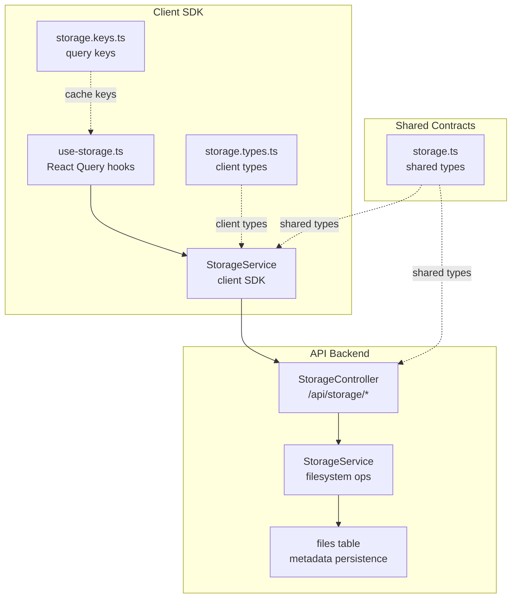
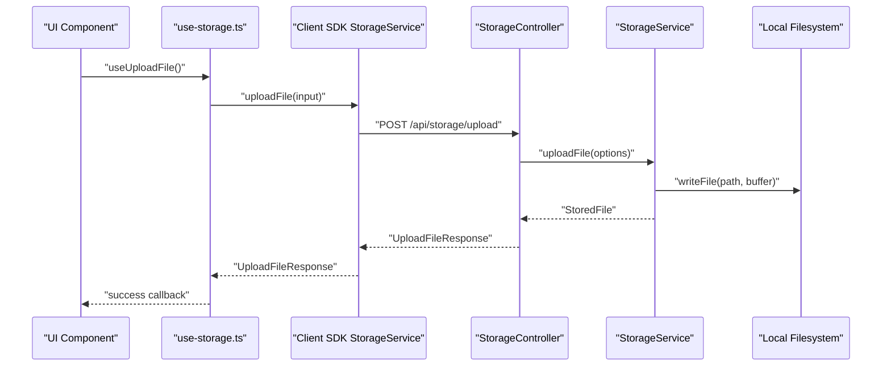
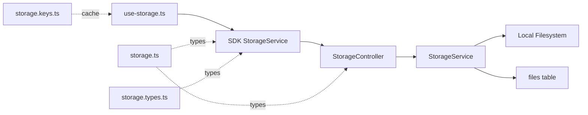

# Media Management

<cite>
**Referenced Files in This Document**
- [files.ts](file://apps/api/src/database/schema/files.ts)
- [storage.controller.ts](file://apps/api/src/modules/storage/storage.controller.ts)
- [storage.service.ts](file://apps/api/src/modules/storage/storage.service.ts)
- [storage.dto.ts](file://apps/api/src/modules/storage/storage.dto.ts)
- [storage.ts](file://packages/contracts/src/storage.ts)
- [use-storage.ts](file://packages/client-sdk/src/hooks/use-storage.ts)
- [storage.service.ts](file://packages/client-sdk/src/services/storage.service.ts)
- [storage.types.ts](file://packages/client-sdk/src/types/storage.types.ts)
- [storage.keys.ts](file://packages/client-sdk/src/query-keys/storage.keys.ts)
- [rental-object.service.ts](file://packages/client-sdk/src/services/rental-object.service.ts)
- [use-rental-objects.ts](file://packages/client-sdk/src/hooks/use-rental-objects.ts)
- [RentalObjectImageUpload.example.tsx](file://docs/examples/RentalObjectImageUpload.example.tsx)
- [deploy-storage-migration.sh](file://scripts/deploy-storage-migration.sh)
</cite>

## Table of Contents
1. [Introduction](#introduction)
2. [Project Structure](#project-structure)
3. [Core Components](#core-components)
4. [Architecture Overview](#architecture-overview)
5. [Detailed Component Analysis](#detailed-component-analysis)
6. [Dependency Analysis](#dependency-analysis)
7. [Performance Considerations](#performance-considerations)
8. [Security Considerations](#security-considerations)
9. [Troubleshooting Guide](#troubleshooting-guide)
10. [Conclusion](#conclusion)

## Introduction
This document describes the media management system for rental objects, focusing on image uploads, document management, and media lifecycle operations. It explains the upload endpoints, supported file types, local storage integration, and validation rules. It also covers the deletion workflow, cleanup processes, and integration with the storage service. The document details media types (images and documents), metadata handling, and thumbnail generation. Finally, it includes security considerations, validation rules, and best practices for media optimization and CDN integration.

## Project Structure
The media management system spans the API backend, shared contracts, and the client SDK:
- API backend defines storage endpoints, validation, and local filesystem storage.
- Shared contracts define cross-package types for upload and management.
- Client SDK provides React Query hooks and services to interact with the API.

**Diagram sources**
- [storage.controller.ts](file://apps/api/src/modules/storage/storage.controller.ts#L18-L310)
- [storage.service.ts](file://apps/api/src/modules/storage/storage.service.ts#L30-L196)
- [files.ts](file://apps/api/src/database/schema/files.ts#L13-L63)
- [storage.ts](file://packages/contracts/src/storage.ts#L7-L76)
- [use-storage.ts](file://packages/client-sdk/src/hooks/use-storage.ts#L18-L166)
- [storage.service.ts](file://packages/client-sdk/src/services/storage.service.ts#L17-L111)
- [storage.types.ts](file://packages/client-sdk/src/types/storage.types.ts#L6-L63)
- [storage.keys.ts](file://packages/client-sdk/src/query-keys/storage.keys.ts#L8-L17)

**Section sources**
- [storage.controller.ts](file://apps/api/src/modules/storage/storage.controller.ts#L18-L310)
- [storage.service.ts](file://apps/api/src/modules/storage/storage.service.ts#L30-L196)
- [files.ts](file://apps/api/src/database/schema/files.ts#L13-L63)
- [storage.ts](file://packages/contracts/src/storage.ts#L7-L76)
- [use-storage.ts](file://packages/client-sdk/src/hooks/use-storage.ts#L18-L166)
- [storage.service.ts](file://packages/client-sdk/src/services/storage.service.ts#L17-L111)
- [storage.types.ts](file://packages/client-sdk/src/types/storage.types.ts#L6-L63)
- [storage.keys.ts](file://packages/client-sdk/src/query-keys/storage.keys.ts#L8-L17)

## Core Components
- Storage controller exposes endpoints for uploading, listing, updating metadata, and deleting files.
- Storage service handles file validation, filesystem writes, and URL generation.
- Shared contracts define upload and response types used by both API and SDK.
- Client SDK provides React Query hooks and a service to call the API endpoints.
- Files table schema defines metadata storage for uploaded files.

Key responsibilities:
- Validation: size limits and allowed MIME types.
- Storage: local filesystem layout per tenant and category.
- Metadata: alt text, captions, polymorphic associations, and JSON metadata.
- Lifecycle: upload, list, update metadata, delete.

**Section sources**
- [storage.controller.ts](file://apps/api/src/modules/storage/storage.controller.ts#L26-L116)
- [storage.service.ts](file://apps/api/src/modules/storage/storage.service.ts#L52-L92)
- [storage.dto.ts](file://apps/api/src/modules/storage/storage.dto.ts#L11-L19)
- [storage.ts](file://packages/contracts/src/storage.ts#L7-L29)
- [use-storage.ts](file://packages/client-sdk/src/hooks/use-storage.ts#L38-L117)
- [files.ts](file://apps/api/src/database/schema/files.ts#L13-L63)

## Architecture Overview
The system follows a layered architecture:
- Presentation layer: client SDK with React Query hooks.
- Application layer: API controller and service.
- Persistence layer: files table for metadata and local filesystem for content.

**Diagram sources**
- [use-storage.ts](file://packages/client-sdk/src/hooks/use-storage.ts#L38-L48)
- [storage.service.ts](file://packages/client-sdk/src/services/storage.service.ts#L25-L39)
- [storage.controller.ts](file://apps/api/src/modules/storage/storage.controller.ts#L26-L116)
- [storage.service.ts](file://apps/api/src/modules/storage/storage.service.ts#L52-L92)

## Detailed Component Analysis

### Storage Controller
Endpoints:
- POST /api/storage/upload: Single file upload with multipart form data.
- POST /api/storage/upload-multiple: Multiple file upload.
- GET /api/storage/files: List files (schema-defined but not fully implemented).
- PATCH /api/storage/files/:id: Update file metadata (altText, caption).
- DELETE /api/storage/files/:id: Delete file (not fully implemented).

Validation:
- Uses Zod schemas for request/response contracts.
- Enforces tenant context and category enums.

Lifecycle notes:
- Some endpoints are placeholders awaiting database integration (TODO comments).

**Section sources**
- [storage.controller.ts](file://apps/api/src/modules/storage/storage.controller.ts#L26-L116)
- [storage.controller.ts](file://apps/api/src/modules/storage/storage.controller.ts#L122-L187)
- [storage.controller.ts](file://apps/api/src/modules/storage/storage.controller.ts#L194-L231)
- [storage.controller.ts](file://apps/api/src/modules/storage/storage.controller.ts#L274-L308)
- [storage.controller.ts](file://apps/api/src/modules/storage/storage.controller.ts#L238-L267)

### Storage Service (API)
Responsibilities:
- Validates file size and MIME type.
- Generates unique filenames to avoid collisions.
- Writes files to a tenant-specific directory structure.
- Produces URLs for access.

Constraints:
- Max file size is enforced.
- Allowed MIME types include images and PDFs.
- Directory structure: storage/{tenantId}/{category}/{filename}.

Initialization:
- Ensures base storage directory and seed-images categories exist.

**Section sources**
- [storage.service.ts](file://apps/api/src/modules/storage/storage.service.ts#L52-L92)
- [storage.service.ts](file://apps/api/src/modules/storage/storage.service.ts#L97-L110)
- [storage.service.ts](file://apps/api/src/modules/storage/storage.service.ts#L115-L138)
- [storage.service.ts](file://apps/api/src/modules/storage/storage.service.ts#L143-L158)
- [storage.service.ts](file://apps/api/src/modules/storage/storage.service.ts#L179-L194)

### DTOs and Contracts
- UploadFileRequestSchema validates multipart fields: tenantId, category, entityType, entityId, altText, caption.
- UploadFileResponseSchema defines the response shape.
- ListFilesQuerySchema supports pagination and filtering.
- UpdateFileMetadataRequestSchema supports altText and caption updates.
- Shared contracts mirror these types for cross-package usage.

**Section sources**
- [storage.dto.ts](file://apps/api/src/modules/storage/storage.dto.ts#L11-L19)
- [storage.dto.ts](file://apps/api/src/modules/storage/storage.dto.ts#L26-L42)
- [storage.dto.ts](file://apps/api/src/modules/storage/storage.dto.ts#L61-L71)
- [storage.dto.ts](file://apps/api/src/modules/storage/storage.dto.ts#L100-L103)
- [storage.ts](file://packages/contracts/src/storage.ts#L7-L29)

### Client SDK Storage Hooks and Service
- use-upload-file: Mutation hook to upload a single file.
- use-upload-multiple-files: Mutation hook to upload multiple files.
- use-list-files: Query hook to list files with optional filters.
- use-delete-file: Mutation hook to delete a file.
- use-update-file-metadata: Mutation hook to update altText/caption.
- StorageService (client): Implements upload, list, delete, update, and URL resolution.

Client-side URL handling:
- getFileUrl resolves relative paths to absolute URLs using base configuration.

**Section sources**
- [use-storage.ts](file://packages/client-sdk/src/hooks/use-storage.ts#L38-L48)
- [use-storage.ts](file://packages/client-sdk/src/hooks/use-storage.ts#L62-L71)
- [use-storage.ts](file://packages/client-sdk/src/hooks/use-storage.ts#L85-L94)
- [use-storage.ts](file://packages/client-sdk/src/hooks/use-storage.ts#L108-L117)
- [use-storage.ts](file://packages/client-sdk/src/hooks/use-storage.ts#L137-L151)
- [storage.service.ts](file://packages/client-sdk/src/services/storage.service.ts#L25-L39)
- [storage.service.ts](file://packages/client-sdk/src/services/storage.service.ts#L60-L65)
- [storage.service.ts](file://packages/client-sdk/src/services/storage.service.ts#L70-L85)
- [storage.service.ts](file://packages/client-sdk/src/services/storage.service.ts#L91-L109)

### Files Table Schema
Purpose:
- Persist metadata for uploaded files across tenants and entities.

Fields:
- Identity: id, tenantId, uploadedBy.
- File info: filename, originalFilename, mimetype, sizeBytes.
- Storage info: storageProvider, storagePath, storageUrl.
- Categorization: category (e.g., rental-object-image, rental-object-document).
- Polymorphic association: entityType, entityId.
- Metadata: altText, caption, metadata (JSONB).
- Lifecycle: createdAt, updatedAt, deletedAt (soft delete).

Indexes:
- Tenant, entity, category, uploader for performance.

**Section sources**
- [files.ts](file://apps/api/src/database/schema/files.ts#L13-L63)

### Rental Object Media Integration
- Rental object service exposes uploadMedia and removeMedia endpoints.
- Client hooks orchestrate compression and mutation, then invalidate queries.
- Example usage demonstrates attaching uploaded images to rental objects.

**Section sources**
- [rental-object.service.ts](file://packages/client-sdk/src/services/rental-object.service.ts#L160-L162)
- [rental-object.service.ts](file://packages/client-sdk/src/services/rental-object.service.ts#L167-L169)
- [use-rental-objects.ts](file://packages/client-sdk/src/hooks/use-rental-objects.ts#L405-L432)
- [use-rental-objects.ts](file://packages/client-sdk/src/hooks/use-rental-objects.ts#L437-L448)
- [RentalObjectImageUpload.example.tsx](file://docs/examples/RentalObjectImageUpload.example.tsx#L76-L118)

## Dependency Analysis
High-level dependencies:
- API controller depends on StorageService.
- StorageService depends on filesystem APIs and environment configuration.
- Client SDK StorageService depends on API endpoints.
- Shared contracts unify types across packages.
- Client hooks depend on query keys for caching invalidation.

**Diagram sources**
- [storage.controller.ts](file://apps/api/src/modules/storage/storage.controller.ts#L18-L310)
- [storage.service.ts](file://apps/api/src/modules/storage/storage.service.ts#L30-L196)
- [files.ts](file://apps/api/src/database/schema/files.ts#L13-L63)
- [use-storage.ts](file://packages/client-sdk/src/hooks/use-storage.ts#L18-L166)
- [storage.service.ts](file://packages/client-sdk/src/services/storage.service.ts#L17-L111)
- [storage.ts](file://packages/contracts/src/storage.ts#L7-L76)
- [storage.types.ts](file://packages/client-sdk/src/types/storage.types.ts#L6-L63)
- [storage.keys.ts](file://packages/client-sdk/src/query-keys/storage.keys.ts#L8-L17)

**Section sources**
- [storage.controller.ts](file://apps/api/src/modules/storage/storage.controller.ts#L18-L310)
- [storage.service.ts](file://apps/api/src/modules/storage/storage.service.ts#L30-L196)
- [storage.service.ts](file://packages/client-sdk/src/services/storage.service.ts#L17-L111)
- [storage.ts](file://packages/contracts/src/storage.ts#L7-L76)
- [storage.types.ts](file://packages/client-sdk/src/types/storage.types.ts#L6-L63)
- [storage.keys.ts](file://packages/client-sdk/src/query-keys/storage.keys.ts#L8-L17)

## Performance Considerations
- File size limits reduce memory pressure during upload and disk IO overhead.
- Unique filename hashing prevents directory hotspots and avoids collisions.
- Directory structure organizes files by tenant and category for efficient listing and cleanup.
- Client-side compression reduces payload sizes for images, improving upload throughput.
- Query keys enable targeted cache invalidation after mutations.

[No sources needed since this section provides general guidance]

## Security Considerations
- Tenant isolation: All storage paths include tenantId to prevent cross-tenant access.
- Validation: Strict MIME type checks and size limits mitigate malicious uploads.
- Access control: Controllers require tenant context; ensure middleware enforces authorization.
- Cleanup: Delete operations should verify ownership and soft-delete records to preserve audit trails.
- Environment configuration: STORAGE_BASE_URL controls public URLs; ensure it points to trusted origins.

**Section sources**
- [storage.service.ts](file://apps/api/src/modules/storage/storage.service.ts#L33-L39)
- [storage.service.ts](file://apps/api/src/modules/storage/storage.service.ts#L55-L63)
- [storage.controller.ts](file://apps/api/src/modules/storage/storage.controller.ts#L31-L39)
- [storage.controller.ts](file://apps/api/src/modules/storage/storage.controller.ts#L242-L243)

## Troubleshooting Guide
Common issues and resolutions:
- Validation errors on upload:
  - Ensure multipart fields match the schema and MIME types are allowed.
  - Confirm tenantId is present and valid.
- File not found on delete:
  - Verify the file exists under the tenant and category path.
  - Check that the filename matches stored records.
- URL resolution problems:
  - Use getFileUrl to convert relative paths to absolute URLs based on base configuration.
- Migration and initialization:
  - Run the storage migration script to set up the files table and indexes.
  - Ensure the base storage directory exists and is writable.

**Section sources**
- [storage.dto.ts](file://apps/api/src/modules/storage/storage.dto.ts#L11-L19)
- [storage.controller.ts](file://apps/api/src/modules/storage/storage.controller.ts#L41-L52)
- [storage.service.ts](file://apps/api/src/modules/storage/storage.service.ts#L97-L110)
- [storage.service.ts](file://packages/client-sdk/src/services/storage.service.ts#L91-L109)
- [deploy-storage-migration.sh](file://scripts/deploy-storage-migration.sh)

## Conclusion
The media management system provides a robust foundation for rental object images and documents. It enforces validation, isolates tenants, and integrates with a local filesystem while offering a clear path to expand to cloud storage. The client SDK simplifies integration with React applications via typed hooks and services. Future enhancements should focus on implementing database-backed metadata persistence, thumbnail generation, and CDN integration for scalable delivery.