# Property CRUD Operations

<cite>
**Referenced Files in This Document**
- [rental-object.ts](file://apps/api/src/domain/rental-objects/rental-object.ts)
- [rental-object.service.ts](file://apps/api/src/modules/rental-objects/rental-object.service.ts)
- [rental-object.controller.ts](file://apps/api/src/modules/rental-objects/rental-object.controller.ts)
- [rental-object.repository.ts](file://apps/api/src/modules/rental-objects/rental-object.repository.ts)
- [rental-object.schema.ts](file://apps/api/src/schemas/rental-object.schema.ts)
- [rental-objects.ts](file://apps/api/src/database/schema/rental-objects.ts)
- [rental-object.projections.ts](file://apps/api/src/modules/rental-objects/rental-object.projections.ts)
- [rental-objects.spec.ts](file://apps/api/src/__tests__/integration/rental-objects.spec.ts)
</cite>

## Table of Contents
1. [Introduction](#introduction)
2. [Project Structure](#project-structure)
3. [Core Components](#core-components)
4. [Architecture Overview](#architecture-overview)
5. [Detailed Component Analysis](#detailed-component-analysis)
6. [Dependency Analysis](#dependency-analysis)
7. [Performance Considerations](#performance-considerations)
8. [Troubleshooting Guide](#troubleshooting-guide)
9. [Conclusion](#conclusion)
10. [Appendices](#appendices)

## Introduction
This document explains the complete lifecycle of property (rental object) CRUD operations in the system. It covers creation with validation schemas, updates with custody enforcement, multi-step publishing workflows, archiving/restoration, duplication, and permanent deletion. It also documents tenant isolation patterns, REST API endpoints with request/response schemas, error handling, and integration with the projection system for optimized data retrieval.

## Project Structure
The property management feature spans domain, service, controller, repository, schema, and projection layers, plus database schema definitions and integration tests.

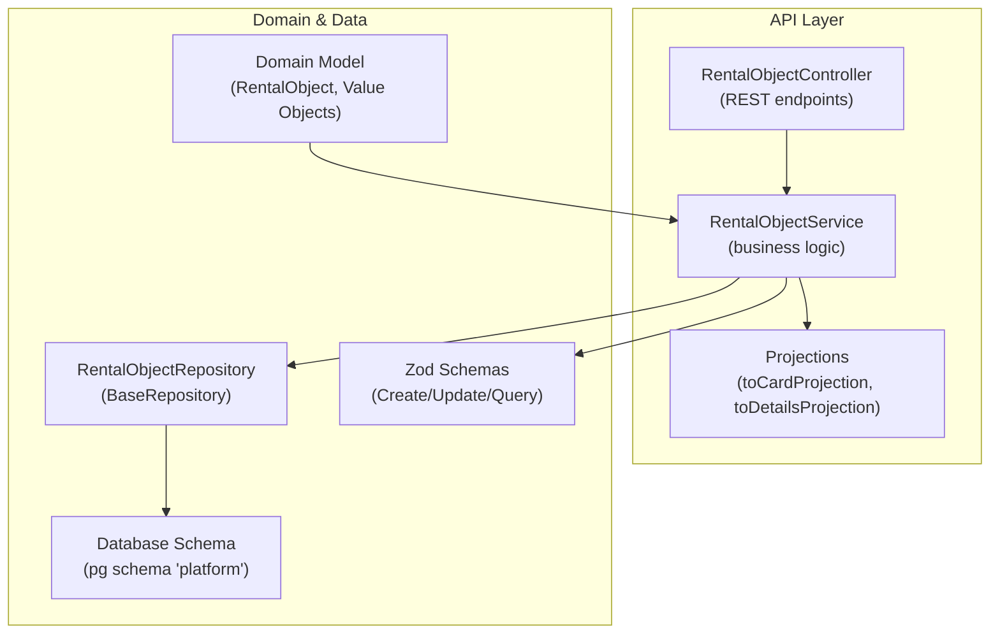

**Diagram sources**
- [rental-object.controller.ts](file://apps/api/src/modules/rental-objects/rental-object.controller.ts#L20-L245)
- [rental-object.service.ts](file://apps/api/src/modules/rental-objects/rental-object.service.ts#L20-L468)
- [rental-object.repository.ts](file://apps/api/src/modules/rental-objects/rental-object.repository.ts#L10-L185)
- [rental-object.schema.ts](file://apps/api/src/schemas/rental-object.schema.ts#L9-L351)
- [rental-objects.ts](file://apps/api/src/database/schema/rental-objects.ts#L79-L119)
- [rental-object.projections.ts](file://apps/api/src/modules/rental-objects/rental-object.projections.ts#L362-L582)

**Section sources**
- [rental-object.controller.ts](file://apps/api/src/modules/rental-objects/rental-object.controller.ts#L20-L245)
- [rental-object.service.ts](file://apps/api/src/modules/rental-objects/rental-object.service.ts#L20-L468)
- [rental-object.repository.ts](file://apps/api/src/modules/rental-objects/rental-object.repository.ts#L10-L185)
- [rental-object.schema.ts](file://apps/api/src/schemas/rental-object.schema.ts#L9-L351)
- [rental-objects.ts](file://apps/api/src/database/schema/rental-objects.ts#L79-L119)
- [rental-object.projections.ts](file://apps/api/src/modules/rental-objects/rental-object.projections.ts#L362-L582)

## Core Components
- Domain model and value objects define the canonical business representation and validation rules.
- Service encapsulates business logic, applies schemas, and orchestrates repository operations.
- Controller exposes REST endpoints with tenant isolation and custody enforcement decorators.
- Repository handles database queries and tenant-aware filtering.
- Projections transform raw entities into UI-ready DTOs.
- Database schema defines the persistent structure under the platform schema.

**Section sources**
- [rental-object.ts](file://apps/api/src/domain/rental-objects/rental-object.ts#L193-L289)
- [rental-object.service.ts](file://apps/api/src/modules/rental-objects/rental-object.service.ts#L20-L468)
- [rental-object.controller.ts](file://apps/api/src/modules/rental-objects/rental-object.controller.ts#L20-L245)
- [rental-object.repository.ts](file://apps/api/src/modules/rental-objects/rental-object.repository.ts#L10-L185)
- [rental-object.projections.ts](file://apps/api/src/modules/rental-objects/rental-object.projections.ts#L362-L582)
- [rental-objects.ts](file://apps/api/src/database/schema/rental-objects.ts#L79-L119)

## Architecture Overview
The system follows a layered architecture:
- Controllers handle HTTP requests and apply tenant and custody checks.
- Services enforce business rules, validate inputs via Zod, and manage state transitions.
- Repositories abstract persistence and implement tenant isolation.
- Projections normalize data for clients.
- Domain validation ensures invariants at runtime.

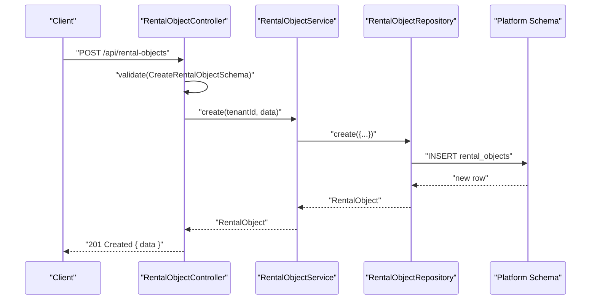

**Diagram sources**
- [rental-object.controller.ts](file://apps/api/src/modules/rental-objects/rental-object.controller.ts#L65-L71)
- [rental-object.service.ts](file://apps/api/src/modules/rental-objects/rental-object.service.ts#L30-L65)
- [rental-object.repository.ts](file://apps/api/src/modules/rental-objects/rental-object.repository.ts#L18-L20)
- [rental-objects.ts](file://apps/api/src/database/schema/rental-objects.ts#L79-L119)

## Detailed Component Analysis

### Domain Model and Validation
- Defines the canonical RentalObject entity and value objects (Location, Pricing, Capacity, Image, ContactInfo, OpeningHours, BookingConfig, Amenity, Equipment, Rule, FaqEntry, AdditionalService).
- Includes domain validation rules for name, capacity, inventory/shared capacity features, and publication readiness.

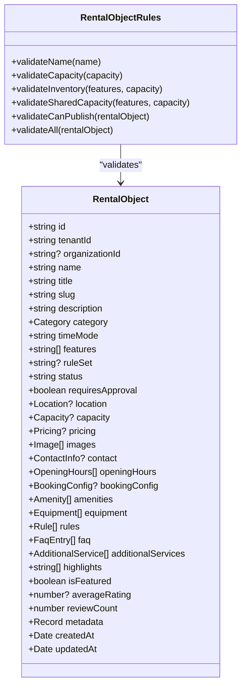

**Diagram sources**
- [rental-object.ts](file://apps/api/src/domain/rental-objects/rental-object.ts#L193-L289)
- [rental-object.ts](file://apps/api/src/domain/rental-objects/rental-object.ts#L328-L434)

**Section sources**
- [rental-object.ts](file://apps/api/src/domain/rental-objects/rental-object.ts#L193-L289)
- [rental-object.ts](file://apps/api/src/domain/rental-objects/rental-object.ts#L328-L434)

### Service Layer: Business Logic and Workflows
- Creation: Validates input, generates slug if missing, persists as draft.
- Updates: Validates partial updates, logs audit events.
- Publishing: Transitions status to published; integrates with audit logging.
- Archiving/Restoration: Moves between draft/archived states.
- Duplication: Clones an existing object with modified identifiers and status.
- Availability/Pricing/Policy/Tabs: Provides calendar and policy configurations.

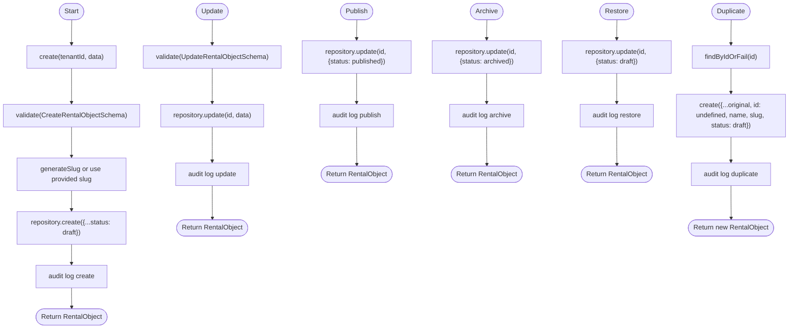

**Diagram sources**
- [rental-object.service.ts](file://apps/api/src/modules/rental-objects/rental-object.service.ts#L30-L233)

**Section sources**
- [rental-object.service.ts](file://apps/api/src/modules/rental-objects/rental-object.service.ts#L20-L468)

### Controller Layer: REST Endpoints and Security
- Tenant isolation: Uses tenant-aware request parsing and optional tenant scoping.
- Custody enforcement: Decorators protect sensitive endpoints (edit, media).
- Endpoints:
  - GET /api/rental-objects — list with pagination and filters
  - GET /api/rental-objects/:id — read by ID
  - POST /api/rental-objects — create
  - PUT /api/rental-objects/:id — update
  - PUT /api/rental-objects/:id/publish — publish
  - PUT /api/rental-objects/:id/unpublish — unpublish
  - POST /api/rental-objects/:id/duplicate — duplicate
  - PUT /api/rental-objects/:id/archive — archive
  - PUT /api/rental-objects/:id/restore — restore
  - DELETE /api/rental-objects/:id — delete
  - GET /api/rental-objects/slug/:slug — read by slug
  - GET /api/rental-objects/:id/availability — availability window
  - POST /api/rental-objects/:id/media — add media
  - DELETE /api/rental-objects/:id/media/:mediaId — remove media
  - GET /api/rental-objects/:id/stats — reporting stats
  - GET /api/rental-objects/:id/calendar-config — calendar config
  - GET /api/rental-objects/:id/booking-policy — booking policy
  - GET /api/rental-objects/:id/payment-policy — payment policy
  - GET /api/rental-objects/:id/tabs — dynamic tabs

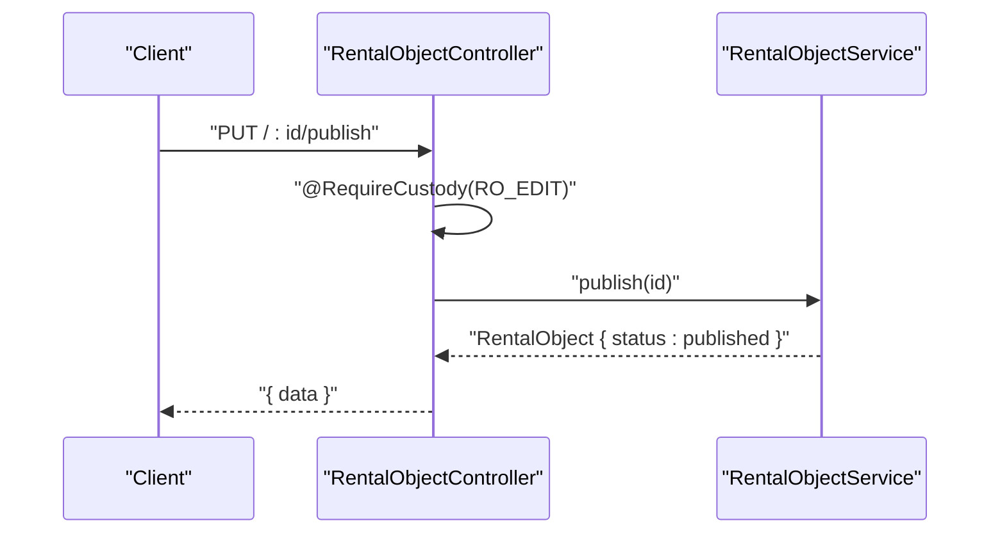

**Diagram sources**
- [rental-object.controller.ts](file://apps/api/src/modules/rental-objects/rental-object.controller.ts#L86-L92)
- [rental-object.service.ts](file://apps/api/src/modules/rental-objects/rental-object.service.ts#L118-L131)

**Section sources**
- [rental-object.controller.ts](file://apps/api/src/modules/rental-objects/rental-object.controller.ts#L20-L245)

### Repository and Tenant Isolation
- Tenant-aware filtering: when tenantId is absent, only published objects are returned (public access).
- Rich query filters: status, category, subcategory, timeMode, organizationId, search, capacity range, city/municipality, price range.
- Post-filtering for JSON fields (e.g., metadata.location.city) and pagination adjustments.

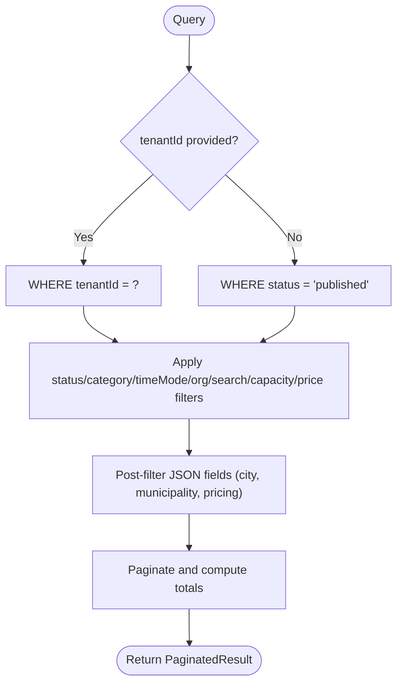

**Diagram sources**
- [rental-object.repository.ts](file://apps/api/src/modules/rental-objects/rental-object.repository.ts#L36-L139)

**Section sources**
- [rental-object.repository.ts](file://apps/api/src/modules/rental-objects/rental-object.repository.ts#L10-L185)

### Schemas and Validation
- Zod schemas define strict request/response shapes:
  - CreateRentalObjectSchema: required fields, optional slug pattern, category/timeMode defaults, pricing defaults, optional metadata.
  - UpdateRentalObjectSchema: partial fields, nested optional pricing.
  - RentalObjectQuerySchema: filters, sorting, pagination.
- Dynamic enums: category, timeMode, status, pricing unit schemas accept database-driven values; factory helpers create refined schemas with runtime-validated sets.

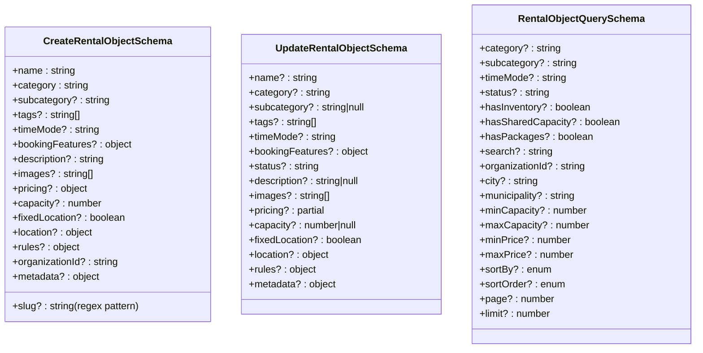

**Diagram sources**
- [rental-object.schema.ts](file://apps/api/src/schemas/rental-object.schema.ts#L237-L331)

**Section sources**
- [rental-object.schema.ts](file://apps/api/src/schemas/rental-object.schema.ts#L9-L351)

### Database Schema (Platform Schema)
- Entities:
  - rental_objects: main entity with tenantId, organizationId, categoryKey, timeMode, features, status, requiresApproval, capacity, inventoryTotal, images, pricing, metadata, timestamps.
  - rental_object_categories, booking_time_modes, rental_object_features, rule_sets: seed/reference tables for configuration.
  - blackouts: calendar blocking entries.
- Indexes: tenantId, categoryKey, timeMode, status, composite slug index.

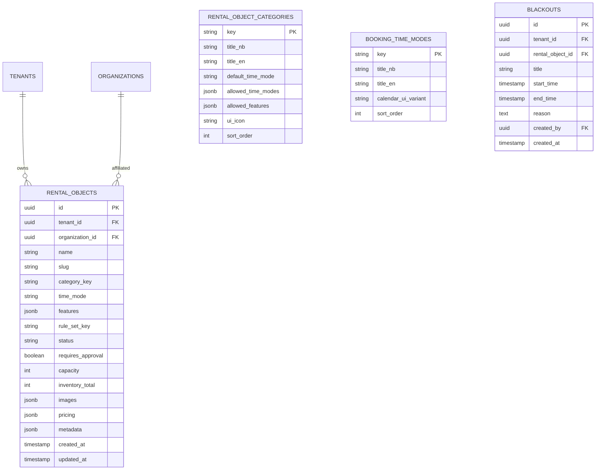

**Diagram sources**
- [rental-objects.ts](file://apps/api/src/database/schema/rental-objects.ts#L79-L138)

**Section sources**
- [rental-objects.ts](file://apps/api/src/database/schema/rental-objects.ts#L27-L138)

### Projections and Optimized Retrieval
- toCardProjection: flattens DB entity into a card DTO with pricing, location, images, ratings, and feature flags.
- toDetailsProjection: expands card into a detailed DTO with images, amenities, opening hours, rules, FAQ, highlights, and booking policy fields.
- Translation keys: labels are i18n keys; consumers translate on the client.
- Absolute URL conversion for images.

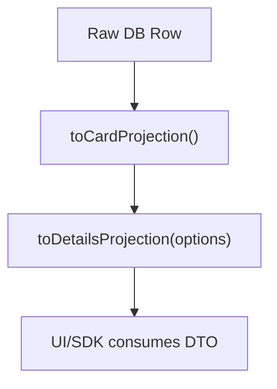

**Diagram sources**
- [rental-object.projections.ts](file://apps/api/src/modules/rental-objects/rental-object.projections.ts#L362-L582)

**Section sources**
- [rental-object.projections.ts](file://apps/api/src/modules/rental-objects/rental-object.projections.ts#L362-L582)

### REST API Endpoints and Request/Response Schemas
- Base path: /api/rental-objects
- Authentication: Requires tenant header; some endpoints require custody scopes.
- Responses: Standardized envelope { data } for single resources; { data, meta } for lists.

Endpoints summary:
- GET /api/rental-objects — list with filters, pagination, sorting
- GET /api/rental-objects/:id — read by ID
- POST /api/rental-objects — create
- PUT /api/rental-objects/:id — update
- PUT /api/rental-objects/:id/publish — publish
- PUT /api/rental-objects/:id/unpublish — unpublish
- POST /api/rental-objects/:id/duplicate — duplicate
- PUT /api/rental-objects/:id/archive — archive
- PUT /api/rental-objects/:id/restore — restore
- DELETE /api/rental-objects/:id — delete
- GET /api/rental-objects/slug/:slug — read by slug
- GET /api/rental-objects/:id/availability — availability window
- POST /api/rental-objects/:id/media — add media
- DELETE /api/rental-objects/:id/media/:mediaId — remove media
- GET /api/rental-objects/:id/stats — reporting stats
- GET /api/rental-objects/:id/calendar-config — calendar config
- GET /api/rental-objects/:id/booking-policy — booking policy
- GET /api/rental-objects/:id/payment-policy — payment policy
- GET /api/rental-objects/:id/tabs — dynamic tabs

Request/response examples (paths):
- Create: [CreateRentalObjectSchema](file://apps/api/src/schemas/rental-object.schema.ts#L237-L261)
- Update: [UpdateRentalObjectSchema](file://apps/api/src/schemas/rental-object.schema.ts#L267-L284)
- List query: [RentalObjectQuerySchema](file://apps/api/src/schemas/rental-object.schema.ts#L290-L331)

**Section sources**
- [rental-object.controller.ts](file://apps/api/src/modules/rental-objects/rental-object.controller.ts#L20-L245)
- [rental-object.schema.ts](file://apps/api/src/schemas/rental-object.schema.ts#L237-L331)

### Tenant Isolation Patterns
- Controllers extract tenantId from request headers; optional tenant scoping allows public reads (published objects only).
- Repository filters by tenantId when present; otherwise restricts to published objects.
- This ensures multi-tenancy and prevents cross-tenant data leakage.

**Section sources**
- [rental-object.controller.ts](file://apps/api/src/modules/rental-objects/rental-object.controller.ts#L30-L51)
- [rental-object.repository.ts](file://apps/api/src/modules/rental-objects/rental-object.repository.ts#L36-L45)

### Multi-Step Publishing Workflow
- Draft creation: status defaults to draft.
- Publish: sets status to published; domain rules validate required fields for publication.
- Unpublish: reverts to draft.
- Audit trail: logs are emitted for each state change.

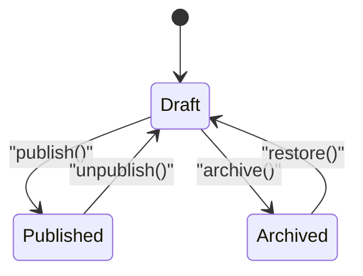

**Diagram sources**
- [rental-object.service.ts](file://apps/api/src/modules/rental-objects/rental-object.service.ts#L118-L186)
- [rental-object.ts](file://apps/api/src/domain/rental-objects/rental-object.ts#L398-L419)

**Section sources**
- [rental-object.service.ts](file://apps/api/src/modules/rental-objects/rental-object.service.ts#L118-L186)
- [rental-object.ts](file://apps/api/src/domain/rental-objects/rental-object.ts#L398-L419)

### Duplication Functionality
- Loads original by ID, clears identity fields, appends suffix to name/slug, resets timestamps, and persists as draft.
- Emits audit log with original ID and name.

**Section sources**
- [rental-object.service.ts](file://apps/api/src/modules/rental-objects/rental-object.service.ts#L191-L215)

### Bulk Operations
- Listing supports pagination and rich filters; clients can implement bulk actions client-side (e.g., batch publish/archive).
- Repository supports multiple filter conditions and post-filtering for JSON fields.

**Section sources**
- [rental-object.repository.ts](file://apps/api/src/modules/rental-objects/rental-object.repository.ts#L36-L139)
- [rental-object.schema.ts](file://apps/api/src/schemas/rental-object.schema.ts#L290-L331)

### Integration with Projection System
- Controllers return projections for detailed views; repositories supply raw entities; service orchestrates transformations.
- Projections centralize formatting and i18n key mapping for UI consumption.

**Section sources**
- [rental-object.controller.ts](file://apps/api/src/modules/rental-objects/rental-object.controller.ts#L153-L154)
- [rental-object.projections.ts](file://apps/api/src/modules/rental-objects/rental-object.projections.ts#L416-L582)

## Dependency Analysis
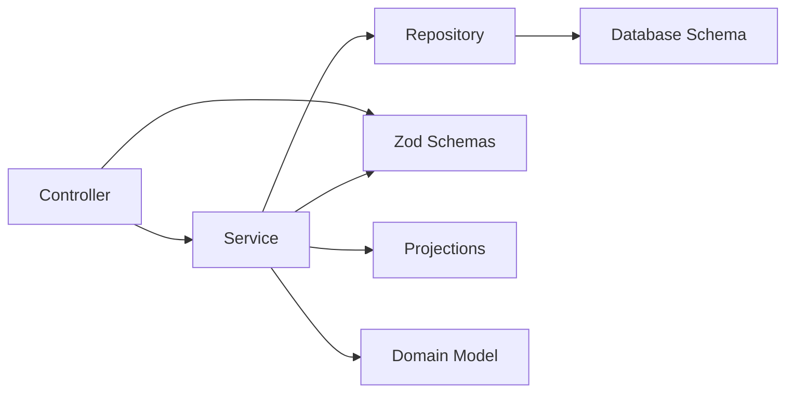

**Diagram sources**
- [rental-object.controller.ts](file://apps/api/src/modules/rental-objects/rental-object.controller.ts#L20-L245)
- [rental-object.service.ts](file://apps/api/src/modules/rental-objects/rental-object.service.ts#L20-L468)
- [rental-object.repository.ts](file://apps/api/src/modules/rental-objects/rental-object.repository.ts#L10-L185)
- [rental-object.schema.ts](file://apps/api/src/schemas/rental-object.schema.ts#L9-L351)
- [rental-object.projections.ts](file://apps/api/src/modules/rental-objects/rental-object.projections.ts#L362-L582)
- [rental-objects.ts](file://apps/api/src/database/schema/rental-objects.ts#L79-L119)

**Section sources**
- [rental-object.controller.ts](file://apps/api/src/modules/rental-objects/rental-object.controller.ts#L20-L245)
- [rental-object.service.ts](file://apps/api/src/modules/rental-objects/rental-object.service.ts#L20-L468)
- [rental-object.repository.ts](file://apps/api/src/modules/rental-objects/rental-object.repository.ts#L10-L185)
- [rental-object.schema.ts](file://apps/api/src/schemas/rental-object.schema.ts#L9-L351)
- [rental-object.projections.ts](file://apps/api/src/modules/rental-objects/rental-object.projections.ts#L362-L582)
- [rental-objects.ts](file://apps/api/src/database/schema/rental-objects.ts#L79-L119)

## Performance Considerations
- Tenant filtering and indexes on tenantId, categoryKey, timeMode, status, and slug improve query performance.
- Post-filtering for JSON fields (e.g., city/municipality/pricing) may reduce index effectiveness; consider denormalized columns if needed.
- Projections are computed once per request; cacheable DTOs can be introduced at the edge if appropriate.
- Pagination defaults and limits prevent unbounded queries.

[No sources needed since this section provides general guidance]

## Troubleshooting Guide
Common issues and resolutions:
- Validation errors on create/update: ensure fields conform to Zod schemas; check slug regex and pricing defaults.
- Publishing failures: verify required fields for publication; confirm domain rules pass.
- Tenant isolation: ensure x-tenant-id header is set; public reads only return published objects.
- Media operations: require RO_MEDIA custody scope; verify media URLs and types.
- Audit logs: confirm audit service is initialized; verify tenantId propagation.

**Section sources**
- [rental-object.schema.ts](file://apps/api/src/schemas/rental-object.schema.ts#L237-L331)
- [rental-object.ts](file://apps/api/src/domain/rental-objects/rental-object.ts#L398-L419)
- [rental-object.controller.ts](file://apps/api/src/modules/rental-objects/rental-object.controller.ts#L76-L191)

## Conclusion
The property CRUD system provides a robust, tenant-isolated, and projection-driven architecture. It enforces validation at both schema and domain levels, supports multi-step publishing, and offers duplication and archival workflows. The REST API is well-defined with standardized envelopes and comprehensive endpoints for listing, querying, and managing rental objects.

[No sources needed since this section summarizes without analyzing specific files]

## Appendices

### Practical Examples

- Creating a property (draft):
  - Endpoint: POST /api/rental-objects
  - Request: [CreateRentalObjectSchema](file://apps/api/src/schemas/rental-object.schema.ts#L237-L261)
  - Response: { data: RentalObject }

- Publishing a property:
  - Endpoint: PUT /api/rental-objects/:id/publish
  - Request: none (body optional)
  - Response: { data: RentalObject with status: published }

- Listing properties with filters:
  - Endpoint: GET /api/rental-objects
  - Query: [RentalObjectQuerySchema](file://apps/api/src/schemas/rental-object.schema.ts#L290-L331)
  - Response: { data: RentalObject[], meta: pagination }

- Duplicating a property:
  - Endpoint: POST /api/rental-objects/:id/duplicate
  - Response: { data: new RentalObject, status: draft }

- Deleting a property:
  - Endpoint: DELETE /api/rental-objects/:id
  - Response: { success: true }

**Section sources**
- [rental-object.controller.ts](file://apps/api/src/modules/rental-objects/rental-object.controller.ts#L65-L141)
- [rental-object.schema.ts](file://apps/api/src/schemas/rental-object.schema.ts#L237-L331)
- [rental-object.service.ts](file://apps/api/src/modules/rental-objects/rental-object.service.ts#L191-L233)

### Integration Tests Coverage
- Lists, filters, pagination, authentication, CRUD operations, and publish/unpublish flows are covered by integration tests.

**Section sources**
- [rental-objects.spec.ts](file://apps/api/src/__tests__/integration/rental-objects.spec.ts#L9-L403)