# Rental Objects Management

<cite>
**Referenced Files in This Document**
- [apps/api/src/domain/rental-objects/index.ts](file://apps/api/src/domain/rental-objects/index.ts)
- [apps/api/src/domain/rental-objects/rental-object.ts](file://apps/api/src/domain/rental-objects/rental-object.ts)
- [apps/api/src/modules/rental-objects/rental-object.controller.ts](file://apps/api/src/modules/rental-objects/rental-object.controller.ts)
- [apps/api/src/modules/rental-objects/rental-object.service.ts](file://apps/api/src/modules/rental-objects/rental-object.service.ts)
- [apps/api/src/modules/rental-objects/rental-object.repository.ts](file://apps/api/src/modules/rental-objects/rental-object.repository.ts)
- [apps/api/src/modules/rental-objects/rental-object.projections.ts](file://apps/api/src/modules/rental-objects/rental-object.projections.ts)
- [apps/api/src/modules/rental-objects/category-metadata.ts](file://apps/api/src/modules/rental-objects/category-metadata.ts)
- [apps/api/src/schemas/rental-object.schema.ts](file://apps/api/src/schemas/rental-object.schema.ts)
- [apps/api/src/acl/rental-objects/rental-object.mapper.ts](file://apps/api/src/acl/rental-objects/rental-object.mapper.ts)
- [apps/api/src/acl/rental-objects/index.ts](file://apps/api/src/acl/rental-objects/index.ts)
- [apps/api/drizzle/0034_rental_object_categories_enum.sql](file://apps/api/drizzle/0034_rental_object_categories_enum.sql)
- [apps/api/drizzle/0039_rental_object_custody.sql](file://apps/api/drizzle/0039_rental_object_custody.sql)
</cite>

## Table of Contents
1. [Introduction](#introduction)
2. [Project Structure](#project-structure)
3. [Core Components](#core-components)
4. [Architecture Overview](#architecture-overview)
5. [Detailed Component Analysis](#detailed-component-analysis)
6. [Dependency Analysis](#dependency-analysis)
7. [Performance Considerations](#performance-considerations)
8. [Troubleshooting Guide](#troubleshooting-guide)
9. [Conclusion](#conclusion)

## Introduction
This document provides comprehensive documentation for the rental objects management domain. It covers the complete CRUD lifecycle for rental properties, including creation, updates, publishing, archiving, duplication, and deletion. It explains the contract-first approach for booking and payment policies, plus tab configurations. It details the category system with property types (venues, equipment, vehicles, experiences) and their booking modes (period, slot, all-day). Media management for images and documents, availability queries, and statistical reporting are documented alongside tenant isolation patterns, custody delegation scopes, and real-time synchronization mechanisms. The projection system for optimized data retrieval and validation schemas for data integrity are also explained.

## Project Structure
The rental objects domain is implemented as a cohesive module within the API application, with clear separation of concerns across domain modeling, validation, persistence, projections, and controllers. Supporting database migrations define canonical categories and custody delegation tables.

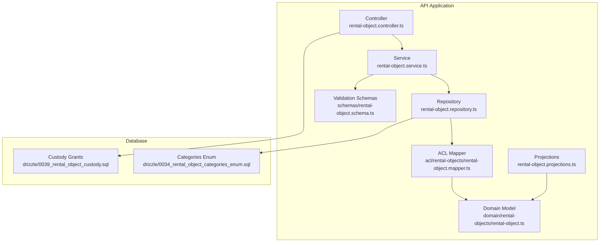

**Diagram sources**
- [apps/api/src/modules/rental-objects/rental-object.controller.ts](file://apps/api/src/modules/rental-objects/rental-object.controller.ts#L20-L245)
- [apps/api/src/modules/rental-objects/rental-object.service.ts](file://apps/api/src/modules/rental-objects/rental-object.service.ts#L20-L468)
- [apps/api/src/modules/rental-objects/rental-object.repository.ts](file://apps/api/src/modules/rental-objects/rental-object.repository.ts#L10-L185)
- [apps/api/src/acl/rental-objects/rental-object.mapper.ts](file://apps/api/src/acl/rental-objects/rental-object.mapper.ts#L1-L778)
- [apps/api/src/modules/rental-objects/rental-object.projections.ts](file://apps/api/src/modules/rental-objects/rental-object.projections.ts#L1-L590)
- [apps/api/src/domain/rental-objects/rental-object.ts](file://apps/api/src/domain/rental-objects/rental-object.ts#L1-L435)
- [apps/api/src/schemas/rental-object.schema.ts](file://apps/api/src/schemas/rental-object.schema.ts#L1-L351)
- [apps/api/drizzle/0034_rental_object_categories_enum.sql](file://apps/api/drizzle/0034_rental_object_categories_enum.sql#L1-L72)
- [apps/api/drizzle/0039_rental_object_custody.sql](file://apps/api/drizzle/0039_rental_object_custody.sql#L1-L105)

**Section sources**
- [apps/api/src/modules/rental-objects/rental-object.controller.ts](file://apps/api/src/modules/rental-objects/rental-object.controller.ts#L20-L245)
- [apps/api/src/modules/rental-objects/rental-object.service.ts](file://apps/api/src/modules/rental-objects/rental-object.service.ts#L20-L468)
- [apps/api/src/modules/rental-objects/rental-object.repository.ts](file://apps/api/src/modules/rental-objects/rental-object.repository.ts#L10-L185)
- [apps/api/src/acl/rental-objects/rental-object.mapper.ts](file://apps/api/src/acl/rental-objects/rental-object.mapper.ts#L1-L778)
- [apps/api/src/modules/rental-objects/rental-object.projections.ts](file://apps/api/src/modules/rental-objects/rental-object.projections.ts#L1-L590)
- [apps/api/src/domain/rental-objects/rental-object.ts](file://apps/api/src/domain/rental-objects/rental-object.ts#L1-L435)
- [apps/api/src/schemas/rental-object.schema.ts](file://apps/api/src/schemas/rental-object.schema.ts#L1-L351)
- [apps/api/drizzle/0034_rental_object_categories_enum.sql](file://apps/api/drizzle/0034_rental_object_categories_enum.sql#L1-L72)
- [apps/api/drizzle/0039_rental_object_custody.sql](file://apps/api/drizzle/0039_rental_object_custody.sql#L1-L105)

## Core Components
- Domain model: Defines the canonical business representation of rental objects, including value objects for location, pricing, capacity, images, contact info, opening hours, booking configuration, amenities, equipment, rules, FAQs, and additional services. It includes domain events and validation rules.
- Service layer: Implements business operations such as create, update, publish, unpublish, archive, restore, duplicate, delete, availability queries, media management, and policy/tab generation.
- Repository: Handles data access with tenant-aware filtering, public listing, slug-based lookup, availability computation stubs, and statistics stubs.
- Controller: Exposes REST endpoints for CRUD operations, availability, media, statistics, and policy/tab endpoints with custody scope enforcement.
- Projections: Transforms domain entities into display-ready DTOs for cards and details, handling i18n keys and computed fields.
- ACL Mapper: Bridges persistence and domain, parsing database JSONB fields into domain types and serializing domain back to persistence format.
- Validation schemas: Zod-based schemas for create/update DTOs, query parameters, and category/time-mode/status/pricing-unit validation with dynamic enums.
- Database migrations: Canonical category enumeration and custody delegation tables.

**Section sources**
- [apps/api/src/domain/rental-objects/rental-object.ts](file://apps/api/src/domain/rental-objects/rental-object.ts#L1-L435)
- [apps/api/src/modules/rental-objects/rental-object.service.ts](file://apps/api/src/modules/rental-objects/rental-object.service.ts#L20-L468)
- [apps/api/src/modules/rental-objects/rental-object.repository.ts](file://apps/api/src/modules/rental-objects/rental-object.repository.ts#L10-L185)
- [apps/api/src/modules/rental-objects/rental-object.controller.ts](file://apps/api/src/modules/rental-objects/rental-object.controller.ts#L20-L245)
- [apps/api/src/modules/rental-objects/rental-object.projections.ts](file://apps/api/src/modules/rental-objects/rental-object.projections.ts#L1-L590)
- [apps/api/src/acl/rental-objects/rental-object.mapper.ts](file://apps/api/src/acl/rental-objects/rental-object.mapper.ts#L1-L778)
- [apps/api/src/schemas/rental-object.schema.ts](file://apps/api/src/schemas/rental-object.schema.ts#L1-L351)
- [apps/api/drizzle/0034_rental_object_categories_enum.sql](file://apps/api/drizzle/0034_rental_object_categories_enum.sql#L1-L72)
- [apps/api/drizzle/0039_rental_object_custody.sql](file://apps/api/drizzle/0039_rental_object_custody.sql#L1-L105)

## Architecture Overview
The system follows a layered architecture with explicit separation between domain, service, repository, controller, projections, and ACL mapping. The domain model is schema-agnostic and independent of database or API concerns. Validation schemas enforce data integrity at the boundaries. The projection system ensures consistent presentation across clients. Custody delegation and tenant isolation are enforced via decorators and database constraints.

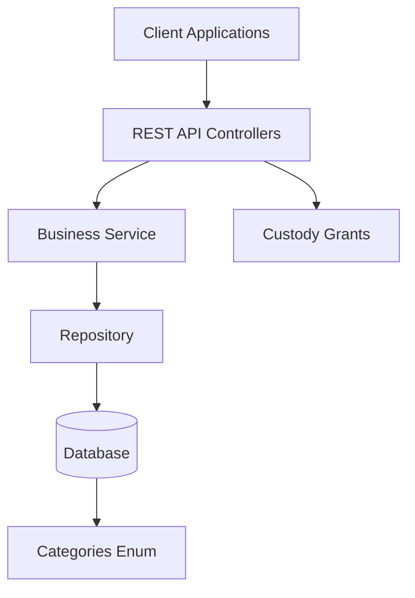

**Diagram sources**
- [apps/api/src/modules/rental-objects/rental-object.controller.ts](file://apps/api/src/modules/rental-objects/rental-object.controller.ts#L20-L245)
- [apps/api/src/modules/rental-objects/rental-object.service.ts](file://apps/api/src/modules/rental-objects/rental-object.service.ts#L20-L468)
- [apps/api/src/modules/rental-objects/rental-object.repository.ts](file://apps/api/src/modules/rental-objects/rental-object.repository.ts#L10-L185)
- [apps/api/drizzle/0034_rental_object_categories_enum.sql](file://apps/api/drizzle/0034_rental_object_categories_enum.sql#L1-L72)
- [apps/api/drizzle/0039_rental_object_custody.sql](file://apps/api/drizzle/0039_rental_object_custody.sql#L1-L105)

## Detailed Component Analysis

### Domain Model and Validation
The domain model defines a rich, immutable representation of rental objects with value objects for location, pricing, capacity, images, contact info, opening hours, booking configuration, amenities, equipment, rules, FAQs, and additional services. It includes domain events and validation rules that ensure business invariants such as required fields for publishing, capacity constraints, and feature dependencies.

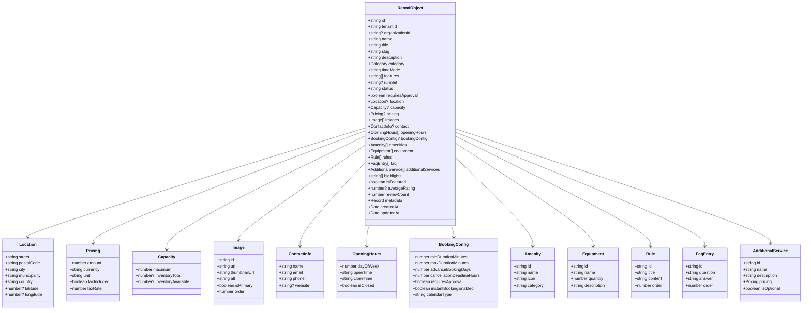

**Diagram sources**
- [apps/api/src/domain/rental-objects/rental-object.ts](file://apps/api/src/domain/rental-objects/rental-object.ts#L193-L289)

**Section sources**
- [apps/api/src/domain/rental-objects/rental-object.ts](file://apps/api/src/domain/rental-objects/rental-object.ts#L1-L435)

### Service Layer Operations
The service layer orchestrates business operations, applying validation, enforcing rules, and emitting audit logs. It supports:
- Creation with slug generation and default values
- Updates with partial field updates
- Publishing/unpublishing with validation
- Archiving/restoring with status transitions
- Duplication preserving most fields except identity and timestamps
- Availability queries and statistics (placeholders)
- Policy and tab generation for contract-first UI behavior

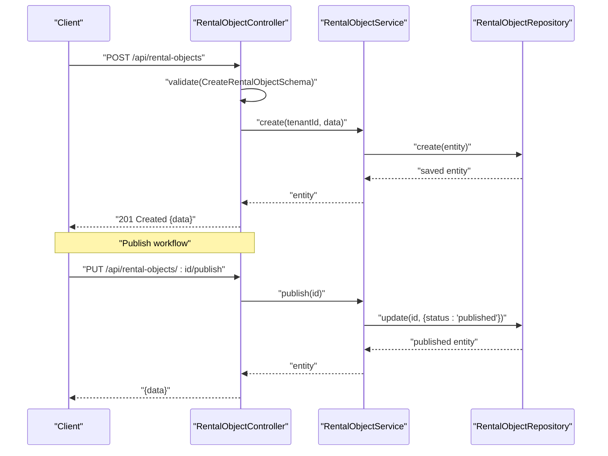

**Diagram sources**
- [apps/api/src/modules/rental-objects/rental-object.controller.ts](file://apps/api/src/modules/rental-objects/rental-object.controller.ts#L65-L92)
- [apps/api/src/modules/rental-objects/rental-object.service.ts](file://apps/api/src/modules/rental-objects/rental-object.service.ts#L30-L65)
- [apps/api/src/modules/rental-objects/rental-object.repository.ts](file://apps/api/src/modules/rental-objects/rental-object.repository.ts#L10-L21)

**Section sources**
- [apps/api/src/modules/rental-objects/rental-object.service.ts](file://apps/api/src/modules/rental-objects/rental-object.service.ts#L20-L468)

### Repository and Tenant Isolation
The repository implements tenant-aware filtering, public listing restrictions, and flexible query parameters including category, subcategory, time mode, organization, search, capacity, and price ranges. It also handles JSON field post-filtering for city/municipality and pricing ranges.

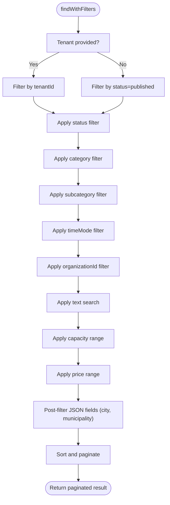

**Diagram sources**
- [apps/api/src/modules/rental-objects/rental-object.repository.ts](file://apps/api/src/modules/rental-objects/rental-object.repository.ts#L36-L139)

**Section sources**
- [apps/api/src/modules/rental-objects/rental-object.repository.ts](file://apps/api/src/modules/rental-objects/rental-object.repository.ts#L10-L185)

### Contract-First Policies and Tabs
The service exposes contract-first endpoints for booking policy, payment policy, and tab configuration. These DTOs encode UI behavior and constraints derived from the rental object’s category, time mode, and booking features.

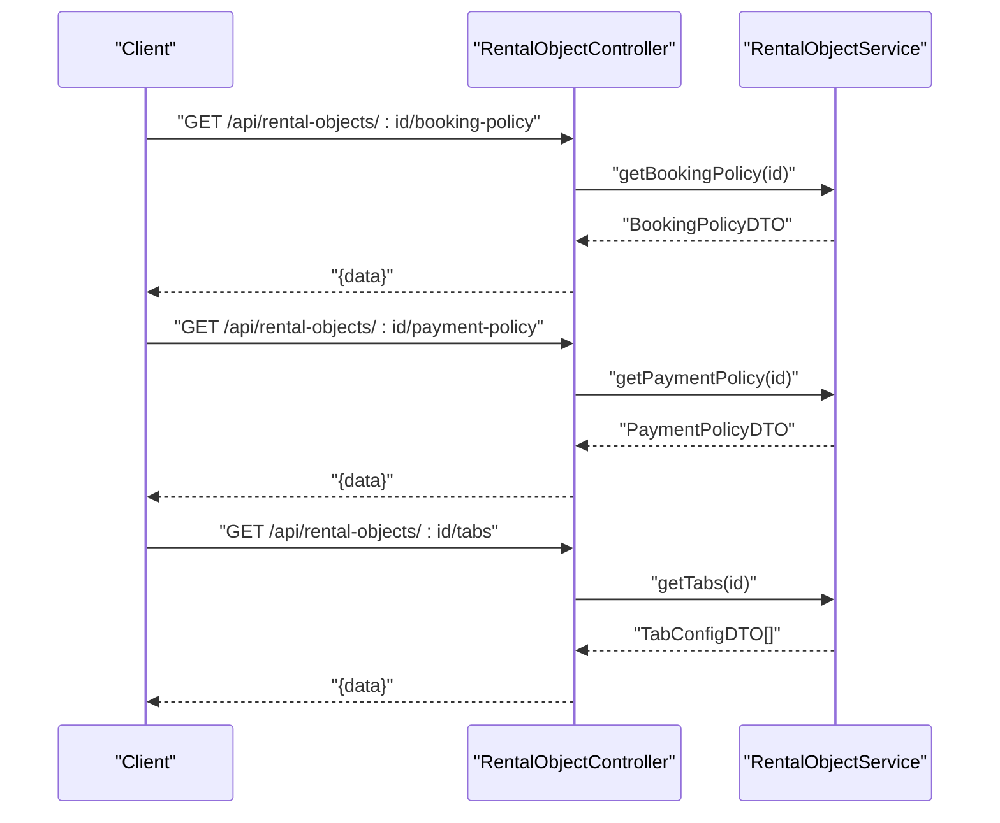

**Diagram sources**
- [apps/api/src/modules/rental-objects/rental-object.controller.ts](file://apps/api/src/modules/rental-objects/rental-object.controller.ts#L214-L244)
- [apps/api/src/modules/rental-objects/rental-object.service.ts](file://apps/api/src/modules/rental-objects/rental-object.service.ts#L316-L466)

**Section sources**
- [apps/api/src/modules/rental-objects/rental-object.service.ts](file://apps/api/src/modules/rental-objects/rental-object.service.ts#L316-L466)

### Category System and Booking Modes
The system defines canonical categories enforced at the database level and supports three booking modes: PERIOD, SLOT, and ALL_DAY. The category metadata provides defaults and structures for different property types.

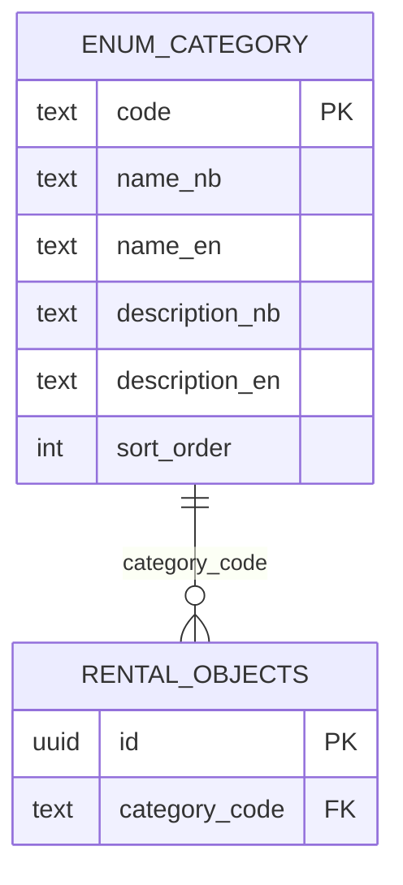

**Diagram sources**
- [apps/api/drizzle/0034_rental_object_categories_enum.sql](file://apps/api/drizzle/0034_rental_object_categories_enum.sql#L16-L64)

**Section sources**
- [apps/api/drizzle/0034_rental_object_categories_enum.sql](file://apps/api/drizzle/0034_rental_object_categories_enum.sql#L1-L72)
- [apps/api/src/modules/rental-objects/category-metadata.ts](file://apps/api/src/modules/rental-objects/category-metadata.ts#L1-L77)

### Media Management
The controller exposes endpoints for uploading and deleting media associated with a rental object. The service adds/removes media URLs from the images collection.

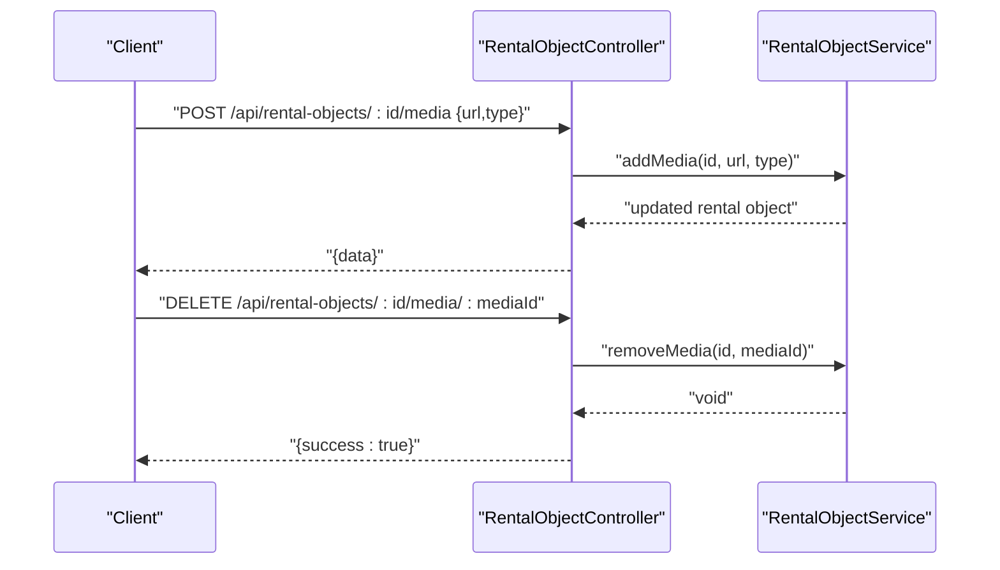

**Diagram sources**
- [apps/api/src/modules/rental-objects/rental-object.controller.ts](file://apps/api/src/modules/rental-objects/rental-object.controller.ts#L171-L191)
- [apps/api/src/modules/rental-objects/rental-object.service.ts](file://apps/api/src/modules/rental-objects/rental-object.service.ts#L259-L275)

**Section sources**
- [apps/api/src/modules/rental-objects/rental-object.controller.ts](file://apps/api/src/modules/rental-objects/rental-object.controller.ts#L171-L191)
- [apps/api/src/modules/rental-objects/rental-object.service.ts](file://apps/api/src/modules/rental-objects/rental-object.service.ts#L259-L275)

### Availability Queries and Statistics
The controller exposes availability and statistics endpoints. The repository currently returns stubbed results; these can be extended to integrate with availability and pricing engines.

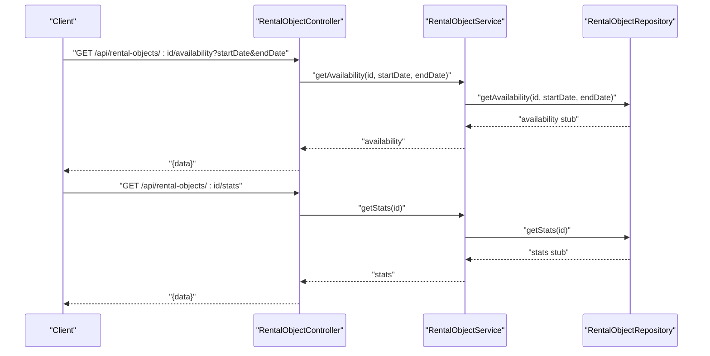

**Diagram sources**
- [apps/api/src/modules/rental-objects/rental-object.controller.ts](file://apps/api/src/modules/rental-objects/rental-object.controller.ts#L157-L201)
- [apps/api/src/modules/rental-objects/rental-object.service.ts](file://apps/api/src/modules/rental-objects/rental-object.service.ts#L254-L282)
- [apps/api/src/modules/rental-objects/rental-object.repository.ts](file://apps/api/src/modules/rental-objects/rental-object.repository.ts#L155-L179)

**Section sources**
- [apps/api/src/modules/rental-objects/rental-object.controller.ts](file://apps/api/src/modules/rental-objects/rental-object.controller.ts#L157-L201)
- [apps/api/src/modules/rental-objects/rental-object.repository.ts](file://apps/api/src/modules/rental-objects/rental-object.repository.ts#L155-L179)

### Projection System
The projection system converts domain entities into display-ready DTOs for cards and details, handling i18n keys, computed fields, and flexible image formats. It ensures consistent presentation across clients.

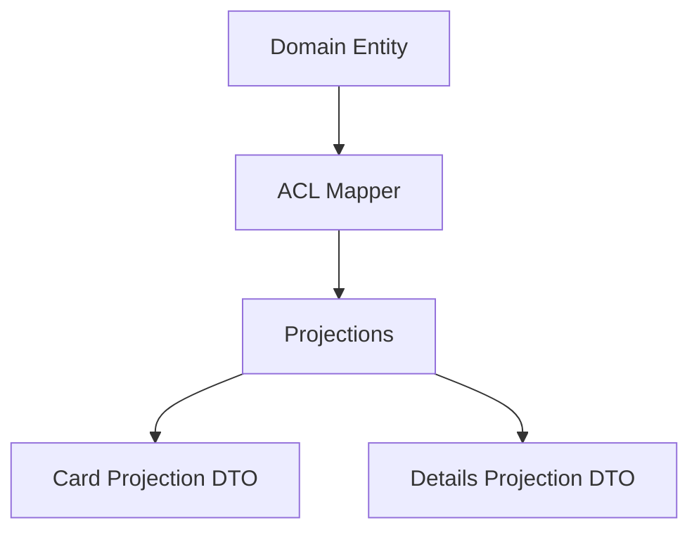

**Diagram sources**
- [apps/api/src/acl/rental-objects/rental-object.mapper.ts](file://apps/api/src/acl/rental-objects/rental-object.mapper.ts#L81-L157)
- [apps/api/src/modules/rental-objects/rental-object.projections.ts](file://apps/api/src/modules/rental-objects/rental-object.projections.ts#L362-L582)

**Section sources**
- [apps/api/src/acl/rental-objects/rental-object.mapper.ts](file://apps/api/src/acl/rental-objects/rental-object.mapper.ts#L1-L778)
- [apps/api/src/modules/rental-objects/rental-object.projections.ts](file://apps/api/src/modules/rental-objects/rental-object.projections.ts#L1-L590)

### Validation Schemas
Zod schemas define strict validation for create/update DTOs, query parameters, and category/time-mode/status/pricing-unit codes. They support dynamic validation against database-defined enums and enforce business rules.

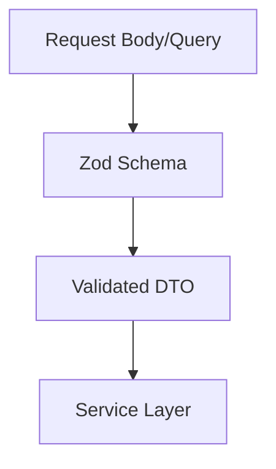

**Diagram sources**
- [apps/api/src/schemas/rental-object.schema.ts](file://apps/api/src/schemas/rental-object.schema.ts#L237-L332)

**Section sources**
- [apps/api/src/schemas/rental-object.schema.ts](file://apps/api/src/schemas/rental-object.schema.ts#L1-L351)

### Tenant Isolation and Custody Delegation
Tenant isolation is enforced in queries and public listings. Custody delegation scopes are applied via decorators on endpoints, and the custody grants/subgrants tables define hierarchical delegation with effective dates, scopes, and revocation.

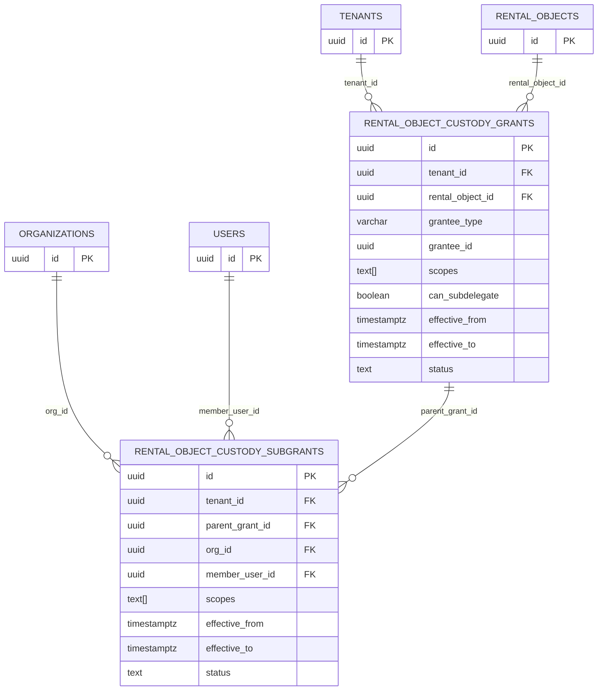

**Diagram sources**
- [apps/api/drizzle/0039_rental_object_custody.sql](file://apps/api/drizzle/0039_rental_object_custody.sql#L5-L105)

**Section sources**
- [apps/api/drizzle/0039_rental_object_custody.sql](file://apps/api/drizzle/0039_rental_object_custody.sql#L1-L105)
- [apps/api/src/modules/rental-objects/rental-object.controller.ts](file://apps/api/src/modules/rental-objects/rental-object.controller.ts#L76-L138)

## Dependency Analysis
The module exhibits strong cohesion within the domain and service layers, with clear decoupling from persistence via the ACL mapper and projections. Dependencies flow downward from controllers to services to repositories, with validation schemas and domain models at the center.

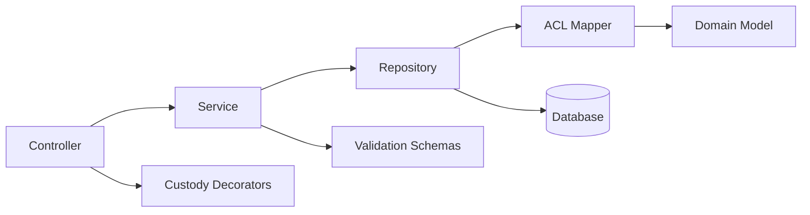

**Diagram sources**
- [apps/api/src/modules/rental-objects/rental-object.controller.ts](file://apps/api/src/modules/rental-objects/rental-object.controller.ts#L20-L245)
- [apps/api/src/modules/rental-objects/rental-object.service.ts](file://apps/api/src/modules/rental-objects/rental-object.service.ts#L20-L468)
- [apps/api/src/modules/rental-objects/rental-object.repository.ts](file://apps/api/src/modules/rental-objects/rental-object.repository.ts#L10-L185)
- [apps/api/src/acl/rental-objects/rental-object.mapper.ts](file://apps/api/src/acl/rental-objects/rental-object.mapper.ts#L1-L778)
- [apps/api/src/schemas/rental-object.schema.ts](file://apps/api/src/schemas/rental-object.schema.ts#L1-L351)

**Section sources**
- [apps/api/src/modules/rental-objects/rental-object.controller.ts](file://apps/api/src/modules/rental-objects/rental-object.controller.ts#L20-L245)
- [apps/api/src/modules/rental-objects/rental-object.service.ts](file://apps/api/src/modules/rental-objects/rental-object.service.ts#L20-L468)
- [apps/api/src/modules/rental-objects/rental-object.repository.ts](file://apps/api/src/modules/rental-objects/rental-object.repository.ts#L10-L185)
- [apps/api/src/acl/rental-objects/rental-object.mapper.ts](file://apps/api/src/acl/rental-objects/rental-object.mapper.ts#L1-L778)
- [apps/api/src/schemas/rental-object.schema.ts](file://apps/api/src/schemas/rental-object.schema.ts#L1-L351)

## Performance Considerations
- Indexing: Category filtering and tenant scoping benefit from database indices on category_code and tenant_id.
- Pagination: Repository applies pagination and sorting; avoid selecting unnecessary fields in projections.
- JSONB queries: Post-filtering on JSON fields (city, municipality, pricing) may impact performance; consider denormalized columns for frequent filters.
- Projections: Computation-heavy transformations should be minimized; cache where appropriate.
- Audit logging: Logging within service operations is lightweight but consider batching for high-volume writes.

[No sources needed since this section provides general guidance]

## Troubleshooting Guide
Common issues and resolutions:
- Validation errors: Ensure request payloads conform to Zod schemas; check category/time-mode/status/pricing-unit codes against database-defined enums.
- Publishing failures: Verify required fields (name, description, images, pricing) per domain validation rules.
- Tenant visibility: Public listings only return published objects; tenant-scoped queries require proper tenant context.
- Media operations: Confirm custody scopes (RO_MEDIA) for media endpoints; ensure URLs are accessible.
- Custody delegation: Verify active grants and subgrants for delegated actions; check effective dates and scopes.

**Section sources**
- [apps/api/src/schemas/rental-object.schema.ts](file://apps/api/src/schemas/rental-object.schema.ts#L1-L351)
- [apps/api/src/domain/rental-objects/rental-object.ts](file://apps/api/src/domain/rental-objects/rental-object.ts#L328-L434)
- [apps/api/src/modules/rental-objects/rental-object.controller.ts](file://apps/api/src/modules/rental-objects/rental-object.controller.ts#L76-L138)
- [apps/api/drizzle/0039_rental_object_custody.sql](file://apps/api/drizzle/0039_rental_object_custody.sql#L40-L49)

## Conclusion
The rental objects management domain is built on a robust, contract-first foundation with clear separation of concerns, tenant isolation, and custody delegation. The domain model, validation schemas, projections, and service/repository layers work together to support a comprehensive CRUD lifecycle, policy-driven UI behavior, and extensible category and booking mode systems. The projection system ensures consistent presentation, while the custody and tenant isolation patterns safeguard data access and delegation. Extending availability and statistics to integrate with dedicated engines will further enhance operational insights and user experience.