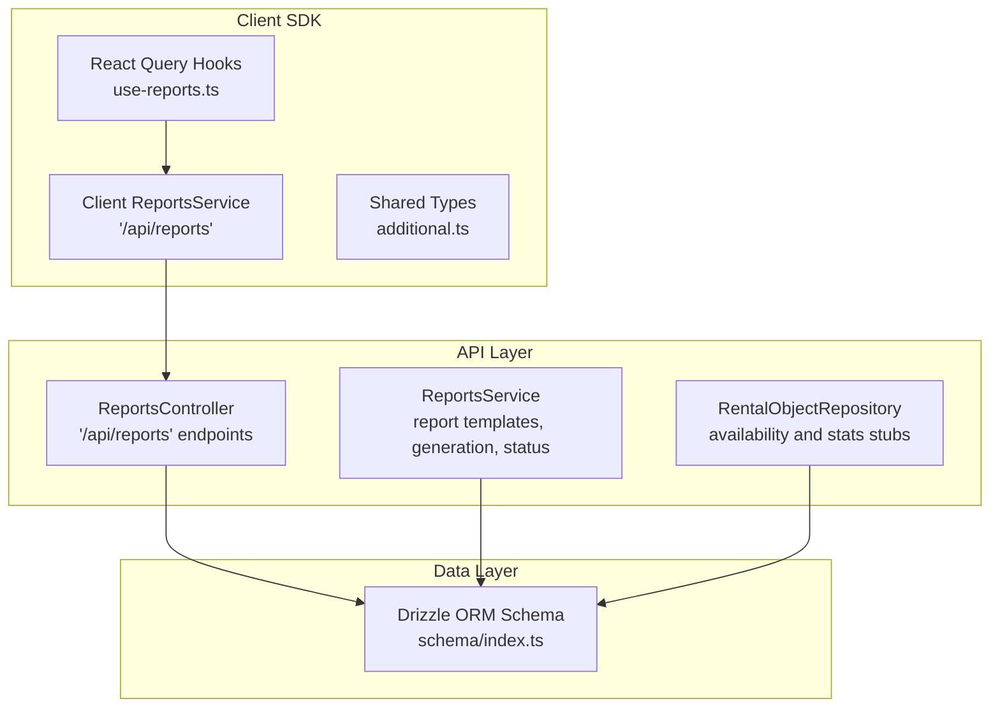
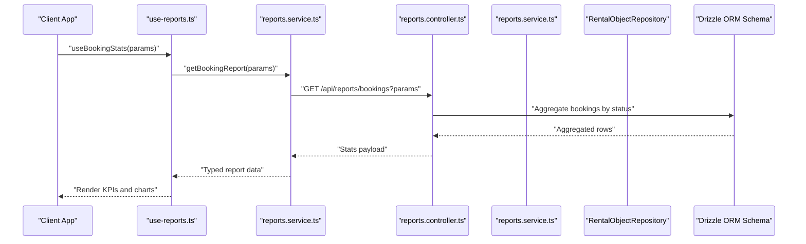
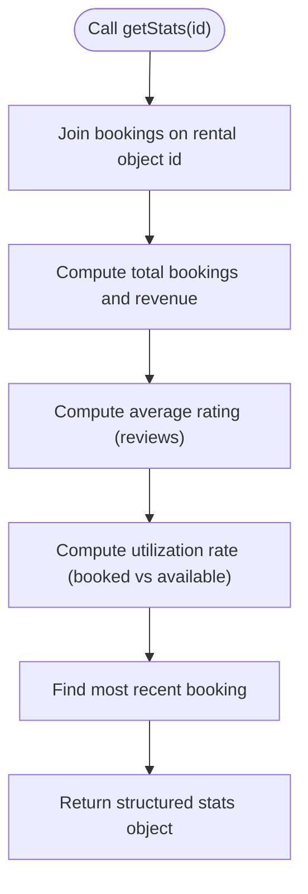
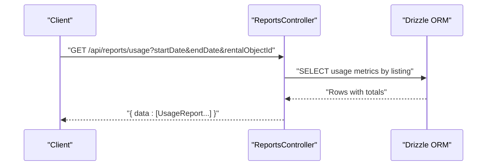
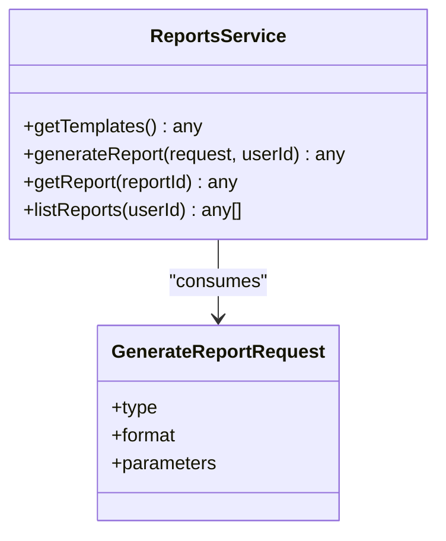
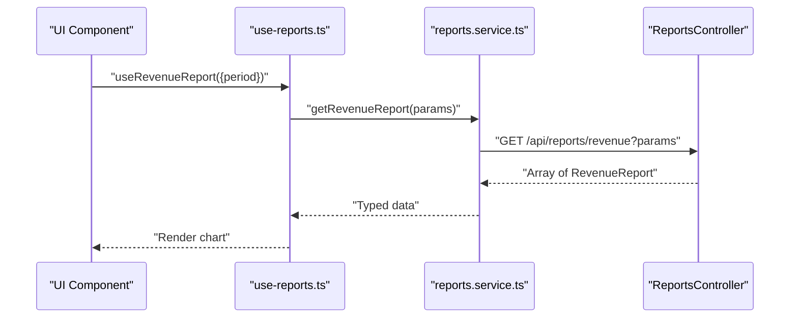
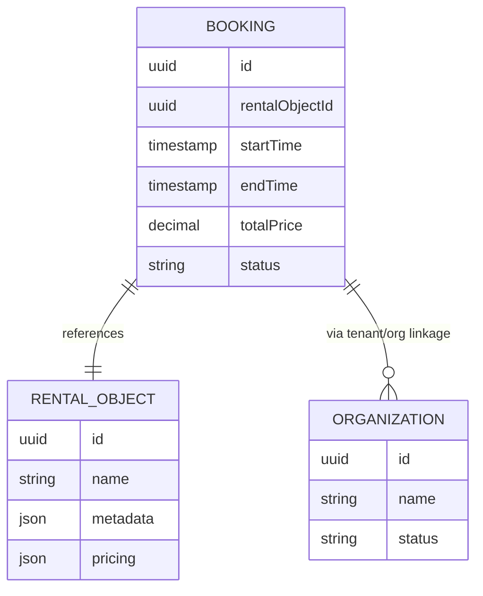
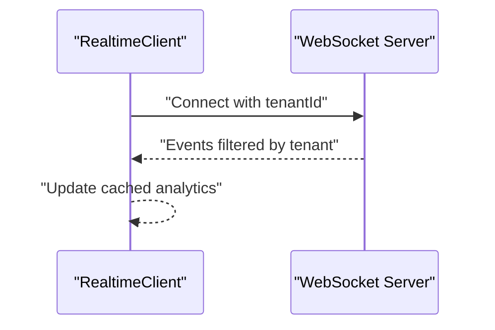
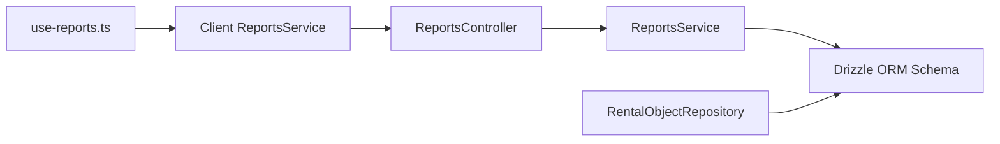

# Statistics & Analytics

<cite>
**Referenced Files in This Document**
- [rental-object.repository.ts](file://apps/api/src/modules/rental-objects/rental-object.repository.ts)
- [reports.controller.ts](file://apps/api/src/modules/reports/reports.controller.ts)
- [reports.service.ts](file://apps/api/src/modules/reports/reports.service.ts)
- [reports.service.ts (client-sdk)](file://packages/client-sdk/src/services/reports.service.ts)
- [use-reports.ts](file://packages/client-sdk/src/hooks/use-reports.ts)
- [additional.ts](file://packages/client-sdk/src/types/additional.ts)
- [index.ts](file://apps/api/src/database/schema/index.ts)
- [websocket-realtime.md](file://docs/guides/websocket-realtime.md)
</cite>

## Table of Contents
1. [Introduction](#introduction)
2. [Project Structure](#project-structure)
3. [Core Components](#core-components)
4. [Architecture Overview](#architecture-overview)
5. [Detailed Component Analysis](#detailed-component-analysis)
6. [Dependency Analysis](#dependency-analysis)
7. [Performance Considerations](#performance-considerations)
8. [Troubleshooting Guide](#troubleshooting-guide)
9. [Conclusion](#conclusion)
10. [Appendices](#appendices)

## Introduction
This document explains the statistics and analytics capabilities for rental objects within the platform. It covers the statistics API endpoints, data aggregation patterns, reporting features, and how analytics data points are surfaced for each rental object. It also documents integration with the reporting system, data export capabilities, and outlines pathways for real-time analytics. Privacy and tenant isolation considerations are addressed alongside practical examples of common statistical queries, trend analysis, and integration with business intelligence tools.

## Project Structure
The analytics and statistics functionality spans backend controllers and services, client-side SDK services and hooks, and shared type definitions. The backend leverages Drizzle ORM to query relational data, while the client SDK exposes typed APIs and React Query hooks for consumption in applications.

**Diagram sources**
- [reports.controller.ts](file://apps/api/src/modules/reports/reports.controller.ts#L17-L201)
- [reports.service.ts](file://apps/api/src/modules/reports/reports.service.ts#L22-L140)
- [rental-object.repository.ts](file://apps/api/src/modules/rental-objects/rental-object.repository.ts#L10-L185)
- [reports.service.ts (client-sdk)](file://packages/client-sdk/src/services/reports.service.ts#L48-L287)
- [use-reports.ts](file://packages/client-sdk/src/hooks/use-reports.ts#L10-L182)
- [additional.ts](file://packages/client-sdk/src/types/additional.ts#L200-L399)
- [index.ts](file://apps/api/src/database/schema/index.ts#L14-L170)

**Section sources**
- [reports.controller.ts](file://apps/api/src/modules/reports/reports.controller.ts#L17-L201)
- [reports.service.ts](file://apps/api/src/modules/reports/reports.service.ts#L22-L140)
- [rental-object.repository.ts](file://apps/api/src/modules/rental-objects/rental-object.repository.ts#L10-L185)
- [reports.service.ts (client-sdk)](file://packages/client-sdk/src/services/reports.service.ts#L48-L287)
- [use-reports.ts](file://packages/client-sdk/src/hooks/use-reports.ts#L10-L182)
- [additional.ts](file://packages/client-sdk/src/types/additional.ts#L200-L399)
- [index.ts](file://apps/api/src/database/schema/index.ts#L14-L170)

## Core Components
- Rental Object Statistics Stub: The repository exposes a method to retrieve per-listing statistics, currently returning placeholder values. This is the foundation for future integration with actual booking and revenue data.
- Reporting Endpoints: The controller implements usage, revenue, booking, and organization analytics endpoints, aggregating data via SQL joins and grouping.
- Report Templates and Generation: The service defines available report templates and outlines the report generation pipeline (queued for background processing).
- Client SDK Services and Hooks: The SDK provides typed methods for fetching analytics data and exporting reports, plus React Query hooks for caching and refetching.
- Shared Types: Strongly typed models define analytics payloads, filters, and report structures.

**Section sources**
- [rental-object.repository.ts](file://apps/api/src/modules/rental-objects/rental-object.repository.ts#L167-L179)
- [reports.controller.ts](file://apps/api/src/modules/reports/reports.controller.ts#L66-L199)
- [reports.service.ts](file://apps/api/src/modules/reports/reports.service.ts#L28-L103)
- [reports.service.ts (client-sdk)](file://packages/client-sdk/src/services/reports.service.ts#L48-L287)
- [use-reports.ts](file://packages/client-sdk/src/hooks/use-reports.ts#L10-L182)
- [additional.ts](file://packages/client-sdk/src/types/additional.ts#L200-L399)

## Architecture Overview
The analytics architecture follows a layered design:
- Controllers orchestrate requests and delegate to services.
- Services encapsulate business logic and coordinate with the database adapter.
- Repositories and schema define the data model and relationships.
- The client SDK consumes endpoints and exposes hooks for UI integration.

**Diagram sources**
- [reports.controller.ts](file://apps/api/src/modules/reports/reports.controller.ts#L140-L171)
- [reports.service.ts (client-sdk)](file://packages/client-sdk/src/services/reports.service.ts#L86-L93)
- [use-reports.ts](file://packages/client-sdk/src/hooks/use-reports.ts#L99-L106)
- [index.ts](file://apps/api/src/database/schema/index.ts#L36-L47)

## Detailed Component Analysis

### Rental Object Statistics Endpoint
- Purpose: Provide per-listing analytics such as total bookings, revenue, ratings, utilization, and recency of bookings.
- Current Implementation: Returns placeholder values; intended to be backed by actual booking and pricing data.
- Extensibility: Extend the repository method to join bookings and pricing tables, compute aggregates, and apply tenant scoping.

**Diagram sources**
- [rental-object.repository.ts](file://apps/api/src/modules/rental-objects/rental-object.repository.ts#L167-L179)

**Section sources**
- [rental-object.repository.ts](file://apps/api/src/modules/rental-objects/rental-object.repository.ts#L167-L179)

### Reporting Endpoints and Aggregation Patterns
- Usage Report: Aggregates total bookings, total hours, and revenue per listing, grouped by listing and ordered by booking count.
- Revenue Report: Computes total and top listings’ revenue, with percentages and counts.
- Booking Stats: Counts bookings by status and computes confirmation and cancellation rates.
- Organization Report: Lists organizations with placeholders for bookings, spending, and seasonal leases.

**Diagram sources**
- [reports.controller.ts](file://apps/api/src/modules/reports/reports.controller.ts#L66-L96)

**Section sources**
- [reports.controller.ts](file://apps/api/src/modules/reports/reports.controller.ts#L66-L199)

### Report Templates and Generation Pipeline
- Templates: Define supported report types (bookings, revenue, usage, audit), formats, required/optional parameters, and estimated generation times.
- Generation: Queues report creation and returns a report descriptor with status and metadata.
- Future Work: Persist report records and expose download URLs.

**Diagram sources**
- [reports.service.ts](file://apps/api/src/modules/reports/reports.service.ts#L9-L19)
- [reports.service.ts](file://apps/api/src/modules/reports/reports.service.ts#L28-L103)

**Section sources**
- [reports.service.ts](file://apps/api/src/modules/reports/reports.service.ts#L28-L103)

### Client SDK Analytics APIs and Hooks
- Methods: Dashboard stats, booking report, revenue report, utilization, occupancy, heatmap, seasonal patterns, comparisons, and export.
- Hooks: React Query wrappers for caching, staleness, and conditional fetching based on date or period parameters.
- Types: Strongly typed payloads for analytics, filters, and report outputs.

**Diagram sources**
- [use-reports.ts](file://packages/client-sdk/src/hooks/use-reports.ts#L111-L117)
- [reports.service.ts (client-sdk)](file://packages/client-sdk/src/services/reports.service.ts#L111-L118)
- [reports.controller.ts](file://apps/api/src/modules/reports/reports.controller.ts#L98-L138)

**Section sources**
- [reports.service.ts (client-sdk)](file://packages/client-sdk/src/services/reports.service.ts#L48-L287)
- [use-reports.ts](file://packages/client-sdk/src/hooks/use-reports.ts#L10-L182)
- [additional.ts](file://packages/client-sdk/src/types/additional.ts#L200-L399)

### Data Models for Analytics
- Dashboard KPIs: Active listings, pending requests, daily/weekly/monthly bookings, revenue metrics, and top listings.
- Usage Report: Per-period or per-listing totals for bookings, hours, utilization, and revenue.
- Revenue Report: Periodic revenue and transaction counts.
- Booking Report: Totals and breakdowns by status with per-date series.
- Heatmap: Time-slot patterns by day-of-week and hour.
- Seasonal Pattern: Yearly and periodic booking and revenue trends.
- Comparison: Period-over-period metrics with percentage changes.

**Diagram sources**
- [index.ts](file://apps/api/src/database/schema/index.ts#L36-L47)

**Section sources**
- [additional.ts](file://packages/client-sdk/src/types/additional.ts#L200-L399)
- [index.ts](file://apps/api/src/database/schema/index.ts#L36-L47)

### Real-Time Analytics and Integration
- Real-time client: A WebSocket-based client supports multi-tenant event filtering and reconnection behavior suitable for streaming analytics updates.
- Integration: Use the client to subscribe to relevant events and update analytics dashboards reactively.

**Diagram sources**
- [websocket-realtime.md](file://docs/guides/websocket-realtime.md#L4155-L4352)

**Section sources**
- [websocket-realtime.md](file://docs/guides/websocket-realtime.md#L4155-L4352)

## Dependency Analysis
- Controllers depend on services for business logic and on the database adapter for queries.
- Services depend on the database adapter and schema definitions.
- Client SDK depends on typed models and exposes hooks for UI integration.
- Tenant scoping and RLS policies should be enforced at the database level to ensure tenant isolation.

**Diagram sources**
- [reports.controller.ts](file://apps/api/src/modules/reports/reports.controller.ts#L17-L201)
- [reports.service.ts](file://apps/api/src/modules/reports/reports.service.ts#L22-L140)
- [reports.service.ts (client-sdk)](file://packages/client-sdk/src/services/reports.service.ts#L48-L287)
- [use-reports.ts](file://packages/client-sdk/src/hooks/use-reports.ts#L10-L182)
- [rental-object.repository.ts](file://apps/api/src/modules/rental-objects/rental-object.repository.ts#L10-L185)
- [index.ts](file://apps/api/src/database/schema/index.ts#L14-L170)

**Section sources**
- [reports.controller.ts](file://apps/api/src/modules/reports/reports.controller.ts#L17-L201)
- [reports.service.ts](file://apps/api/src/modules/reports/reports.service.ts#L22-L140)
- [reports.service.ts (client-sdk)](file://packages/client-sdk/src/services/reports.service.ts#L48-L287)
- [use-reports.ts](file://packages/client-sdk/src/hooks/use-reports.ts#L10-L182)
- [rental-object.repository.ts](file://apps/api/src/modules/rental-objects/rental-object.repository.ts#L10-L185)
- [index.ts](file://apps/api/src/database/schema/index.ts#L14-L170)

## Performance Considerations
- Prefer indexed columns in filters (e.g., rental object id, booking timestamps) to optimize aggregation queries.
- Use LIMIT and ORDER BY appropriately to cap result sets for top lists.
- Apply tenant scoping early in queries to minimize dataset size.
- Cache frequently accessed dashboard KPIs using the client SDK’s query hooks with sensible stale times.
- Offload heavy report generation to background jobs and expose status and download endpoints.

## Troubleshooting Guide
- Empty or placeholder stats: Verify that the rental object statistics method is extended to join bookings and pricing tables and that tenant scoping is applied.
- Incorrect totals: Confirm aggregation functions and grouping align with intended business logic; validate date filters and timezone handling.
- Missing reports: Ensure report generation is queued and persisted; confirm download URL expiry and access controls.
- Tenant isolation: Enforce RLS policies and tenantId filters at the database level; verify that multi-tenant identifiers are passed to the real-time client.

**Section sources**
- [reports.controller.ts](file://apps/api/src/modules/reports/reports.controller.ts#L66-L199)
- [reports.service.ts](file://apps/api/src/modules/reports/reports.service.ts#L87-L103)
- [websocket-realtime.md](file://docs/guides/websocket-realtime.md#L4155-L4352)

## Conclusion
The platform provides a solid foundation for rental object analytics through dedicated endpoints, typed client SDKs, and extensible report templates. Current implementations include usage, revenue, booking, and organization analytics, with placeholders for per-listing statistics. The client SDK offers hooks for efficient caching and UI integration, while the WebSocket guide outlines real-time capabilities. To achieve full functionality, extend the statistics method to compute accurate metrics, enforce tenant isolation, and implement robust report generation and export pipelines.

## Appendices

### Common Statistical Queries and Examples
- Monthly revenue by listing: Use the revenue endpoint with a monthly grouping parameter.
- Daily booking trends: Use the booking report endpoint with daily grouping.
- Top-performing listings: Use the usage endpoint and sort by revenue or booking count.
- Occupancy rates: Use the occupancy endpoint with weekly or monthly grouping.
- Seasonal trends: Use the seasonal patterns endpoint to analyze recurring demand.
- Period comparison: Use the comparison endpoint to contrast current vs previous periods.

**Section sources**
- [reports.service.ts (client-sdk)](file://packages/client-sdk/src/services/reports.service.ts#L111-L118)
- [reports.service.ts (client-sdk)](file://packages/client-sdk/src/services/reports.service.ts#L164-L171)
- [reports.service.ts (client-sdk)](file://packages/client-sdk/src/services/reports.service.ts#L213-L220)
- [reports.service.ts (client-sdk)](file://packages/client-sdk/src/services/reports.service.ts#L239-L246)

### Data Privacy and Tenant Isolation
- Tenant scoping: Controllers and repositories should filter data by tenantId to prevent cross-tenant analytics leakage.
- RLS policies: Enforce row-level security to ensure users only access data within their tenant.
- Real-time events: Use the tenantId parameter in the real-time client to scope event streams.
- Audit logs: Include audit endpoints for compliance and traceability.

**Section sources**
- [reports.controller.ts](file://apps/api/src/modules/reports/reports.controller.ts#L12-L15)
- [websocket-realtime.md](file://docs/guides/websocket-realtime.md#L4155-L4352)