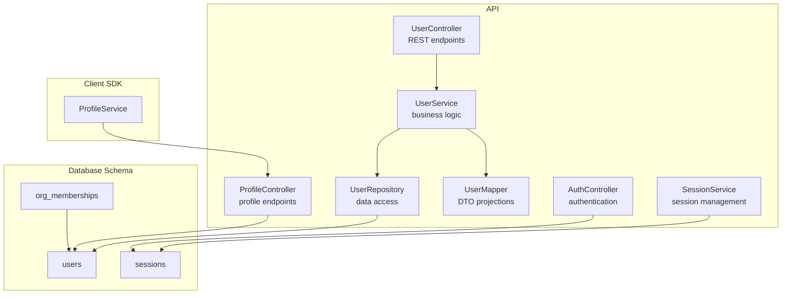
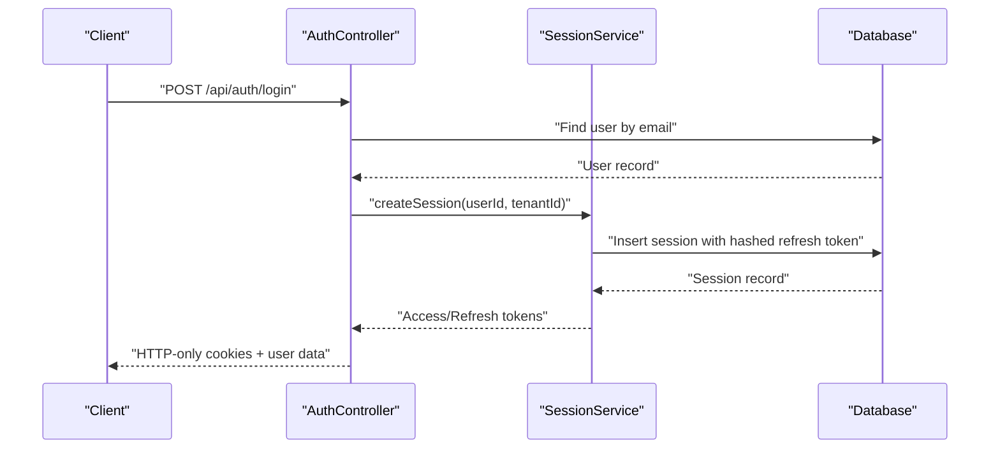
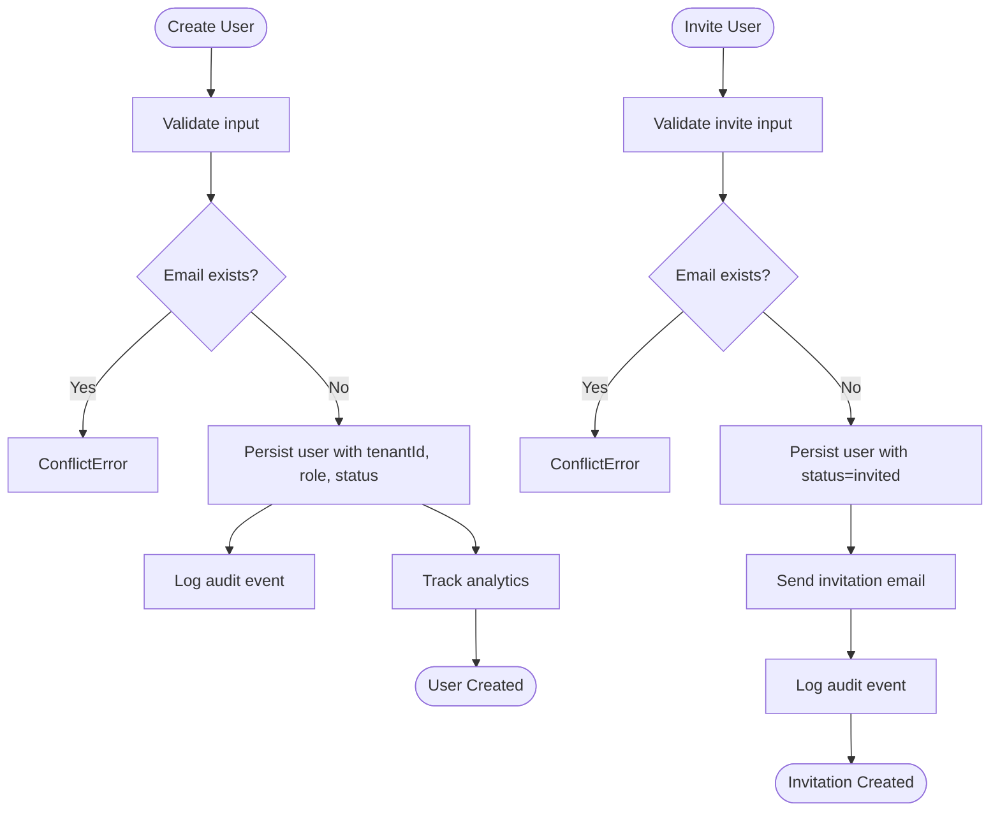
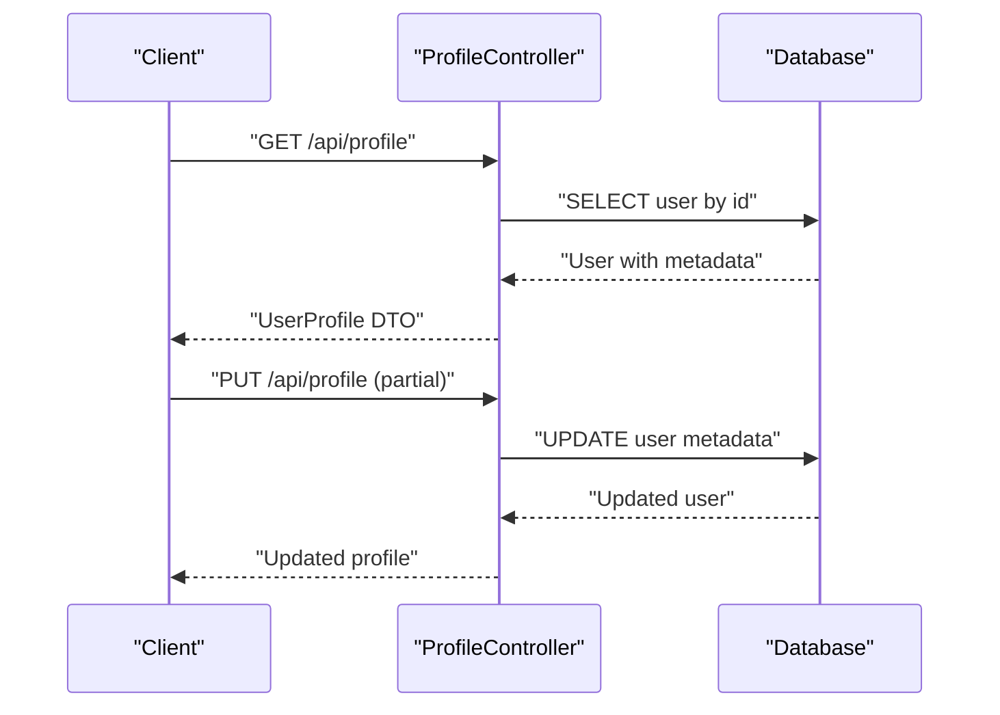
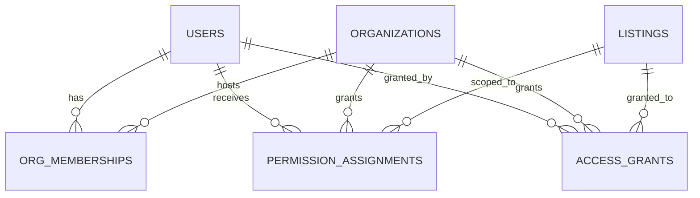
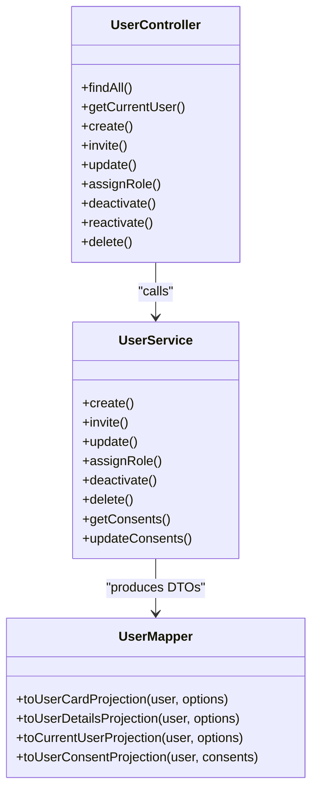
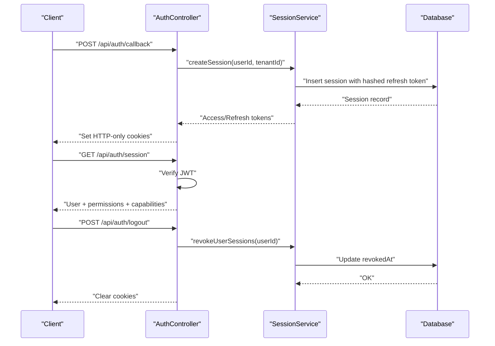
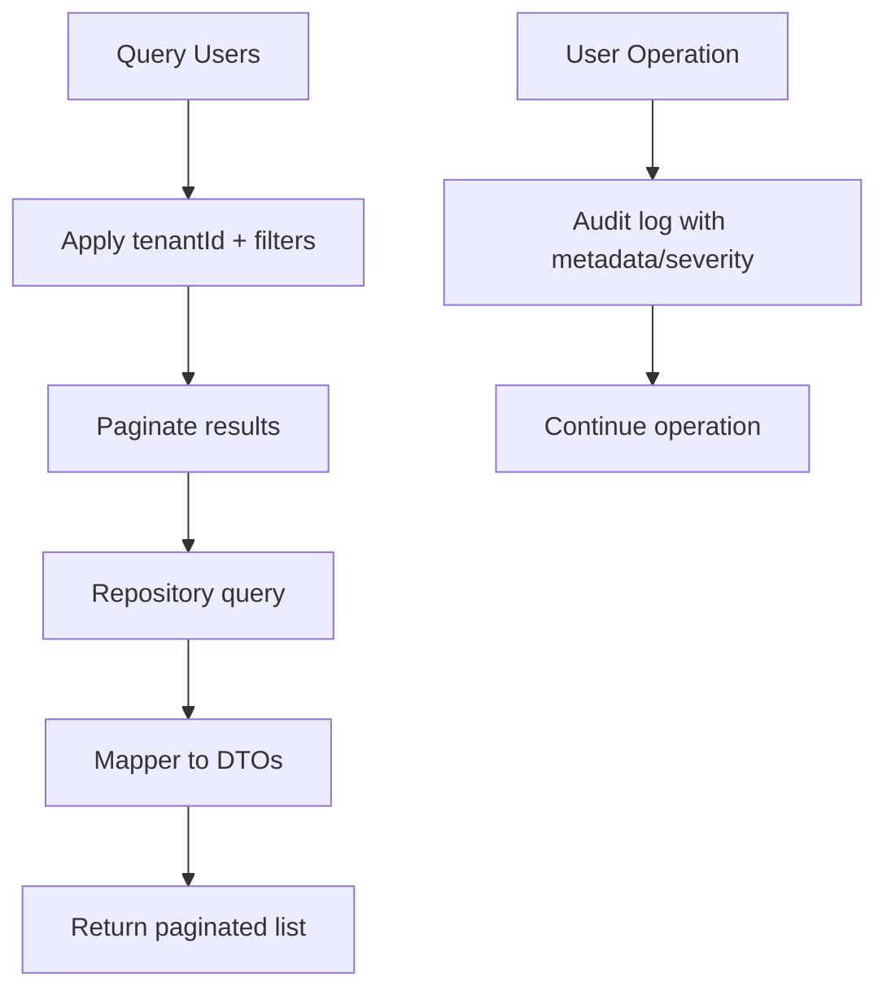
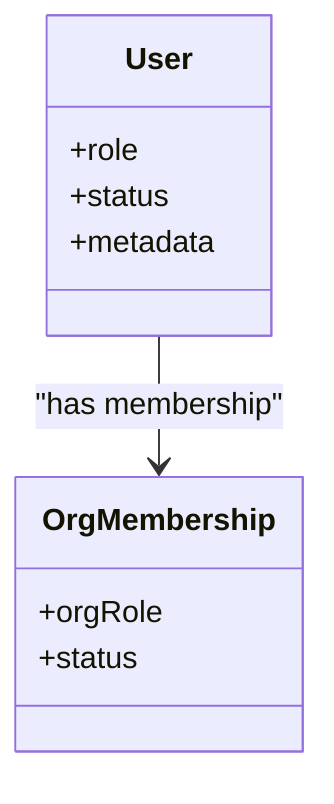
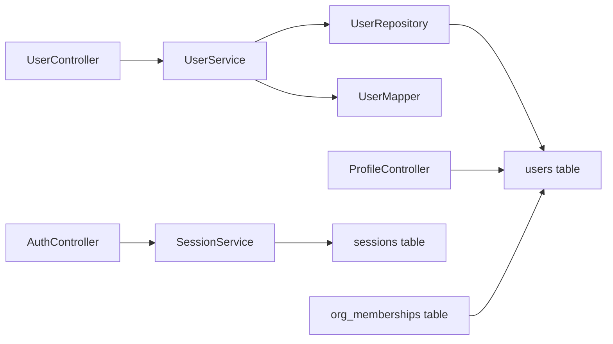

# User Management

<cite>
**Referenced Files in This Document**
- [apps/api/src/modules/user/user.controller.ts](file://apps/api/src/modules/user/user.controller.ts)
- [apps/api/src/modules/user/user.service.ts](file://apps/api/src/modules/user/user.service.ts)
- [apps/api/src/modules/user/user.repository.ts](file://apps/api/src/modules/user/user.repository.ts)
- [apps/api/src/modules/user/user.mapper.ts](file://apps/api/src/modules/user/user.mapper.ts)
- [apps/api/src/schemas/user.schema.ts](file://apps/api/src/schemas/user.schema.ts)
- [packages/database-schema/src/core/users.ts](file://packages/database-schema/src/core/users.ts)
- [apps/api/src/modules/profile/profile.controller.ts](file://apps/api/src/modules/profile/profile.controller.ts)
- [packages/client-sdk/src/services/profile.service.ts](file://packages/client-sdk/src/services/profile.service.ts)
- [apps/api/src/modules/auth/auth.controller.ts](file://apps/api/src/modules/auth/auth.controller.ts)
- [apps/api/src/modules/auth/session.service.ts](file://apps/api/src/modules/auth/session.service.ts)
- [packages/database-schema/src/platform/sessions.ts](file://packages/database-schema/src/platform/sessions.ts)
- [packages/database-schema/src/platform/memberships.ts](file://packages/database-schema/src/platform/memberships.ts)
- [apps/api/tests/integration/user.api.test.ts](file://apps/api/tests/integration/user.api.test.ts)
- [apps/api/tests/unit/services/user.service.test.ts](file://apps/api/tests/unit/services/user.service.test.ts)
- [apps/api/tests/unit/repositories/user.repository.test.ts](file://apps/api/tests/unit/repositories/user.repository.test.ts)
- [tests/e2e/backoffice/crud/users.spec.ts](file://tests/e2e/backoffice/crud/users.spec.ts)
- [tests/e2e/minside/membership-org.spec.ts](file://tests/e2e/minside/membership-org.spec.ts)
</cite>

## Table of Contents
1. [Introduction](#introduction)
2. [Project Structure](#project-structure)
3. [Core Components](#core-components)
4. [Architecture Overview](#architecture-overview)
5. [Detailed Component Analysis](#detailed-component-analysis)
6. [Dependency Analysis](#dependency-analysis)
7. [Performance Considerations](#performance-considerations)
8. [Troubleshooting Guide](#troubleshooting-guide)
9. [Conclusion](#conclusion)
10. [Appendices](#appendices)

## Introduction
This document provides comprehensive documentation for user management across the platform. It covers user registration, profile management, membership workflows, user lifecycle (registration through active participation and deactivation), the profile system (personal information, preferences, and notification settings), user mapping patterns for data transformation and tenant isolation, integration with external identity providers and session management, user search and filtering, audit trails, GDPR compliance features, and the relationship between users and organizations, role assignments, and permission inheritance patterns.

## Project Structure
User management spans the API backend, database schema, and client SDK:
- API modules: user, profile, auth, and session management
- Database schema: users, sessions, memberships
- Client SDK: profile service

**Diagram sources**
- [apps/api/src/modules/user/user.controller.ts](file://apps/api/src/modules/user/user.controller.ts#L1-L159)
- [apps/api/src/modules/user/user.service.ts](file://apps/api/src/modules/user/user.service.ts#L1-L305)
- [apps/api/src/modules/user/user.repository.ts](file://apps/api/src/modules/user/user.repository.ts#L1-L131)
- [apps/api/src/modules/user/user.mapper.ts](file://apps/api/src/modules/user/user.mapper.ts#L1-L672)
- [apps/api/src/modules/profile/profile.controller.ts](file://apps/api/src/modules/profile/profile.controller.ts#L1-L253)
- [apps/api/src/modules/auth/auth.controller.ts](file://apps/api/src/modules/auth/auth.controller.ts#L1-L743)
- [apps/api/src/modules/auth/session.service.ts](file://apps/api/src/modules/auth/session.service.ts#L1-L323)
- [packages/database-schema/src/core/users.ts](file://packages/database-schema/src/core/users.ts#L1-L38)
- [packages/database-schema/src/platform/sessions.ts](file://packages/database-schema/src/platform/sessions.ts#L1-L37)
- [packages/database-schema/src/platform/memberships.ts](file://packages/database-schema/src/platform/memberships.ts#L1-L95)
- [packages/client-sdk/src/services/profile.service.ts](file://packages/client-sdk/src/services/profile.service.ts#L1-L67)

**Section sources**
- [apps/api/src/modules/user/user.controller.ts](file://apps/api/src/modules/user/user.controller.ts#L1-L159)
- [apps/api/src/modules/user/user.service.ts](file://apps/api/src/modules/user/user.service.ts#L1-L305)
- [apps/api/src/modules/user/user.repository.ts](file://apps/api/src/modules/user/user.repository.ts#L1-L131)
- [apps/api/src/modules/user/user.mapper.ts](file://apps/api/src/modules/user/user.mapper.ts#L1-L672)
- [apps/api/src/modules/profile/profile.controller.ts](file://apps/api/src/modules/profile/profile.controller.ts#L1-L253)
- [apps/api/src/modules/auth/auth.controller.ts](file://apps/api/src/modules/auth/auth.controller.ts#L1-L743)
- [apps/api/src/modules/auth/session.service.ts](file://apps/api/src/modules/auth/session.service.ts#L1-L323)
- [packages/database-schema/src/core/users.ts](file://packages/database-schema/src/core/users.ts#L1-L38)
- [packages/database-schema/src/platform/sessions.ts](file://packages/database-schema/src/platform/sessions.ts#L1-L37)
- [packages/database-schema/src/platform/memberships.ts](file://packages/database-schema/src/platform/memberships.ts#L1-L95)
- [packages/client-sdk/src/services/profile.service.ts](file://packages/client-sdk/src/services/profile.service.ts#L1-L67)

## Core Components
- User Controller: Exposes REST endpoints for listing, retrieving, creating, inviting, updating, assigning roles, deactivating/reactivating, and deleting users. It enforces tenant isolation and applies validation schemas.
- User Service: Implements business logic including creation, invitations, updates, role assignment, deactivation, deletion, consent retrieval/updates, and audit logging.
- User Repository: Provides CRUD operations against the users table with tenant-aware filtering and pagination.
- User Mapper: Transforms database entities into UI-ready DTOs (list cards, detail profiles, current user, consent projections) with role/status label/color mapping, permissions, and GDPR consent handling.
- Profile Controller: Manages user profile and preferences persistence in the users metadata JSONB field.
- Auth Controller: Handles authentication flows (login, OAuth callback, demo token, national ID), session verification, refresh, and logout with HTTP-only cookies and audit logging.
- Session Service: Implements industry-grade session management with refresh token rotation, hashing, revocation, and cleanup.
- Database Schema: Defines users, sessions, and memberships tables with appropriate indices and foreign keys.

**Section sources**
- [apps/api/src/modules/user/user.controller.ts](file://apps/api/src/modules/user/user.controller.ts#L1-L159)
- [apps/api/src/modules/user/user.service.ts](file://apps/api/src/modules/user/user.service.ts#L1-L305)
- [apps/api/src/modules/user/user.repository.ts](file://apps/api/src/modules/user/user.repository.ts#L1-L131)
- [apps/api/src/modules/user/user.mapper.ts](file://apps/api/src/modules/user/user.mapper.ts#L1-L672)
- [apps/api/src/modules/profile/profile.controller.ts](file://apps/api/src/modules/profile/profile.controller.ts#L1-L253)
- [apps/api/src/modules/auth/auth.controller.ts](file://apps/api/src/modules/auth/auth.controller.ts#L1-L743)
- [apps/api/src/modules/auth/session.service.ts](file://apps/api/src/modules/auth/session.service.ts#L1-L323)
- [packages/database-schema/src/core/users.ts](file://packages/database-schema/src/core/users.ts#L1-L38)
- [packages/database-schema/src/platform/sessions.ts](file://packages/database-schema/src/platform/sessions.ts#L1-L37)
- [packages/database-schema/src/platform/memberships.ts](file://packages/database-schema/src/platform/memberships.ts#L1-L95)

## Architecture Overview
The user management architecture follows clean layers:
- Presentation: Controllers expose REST endpoints and delegate to services.
- Application: Services encapsulate business rules, validation, audit logging, and adapter interactions.
- Persistence: Repository abstracts database operations with tenant-aware queries.
- Mapping: Mapper converts database records to UI DTOs and handles consent, preferences, and permissions.
- Authentication: Auth and Session services manage secure sessions and token rotation.
- Data Model: Users, Sessions, and Memberships tables define the domain model.

**Diagram sources**
- [apps/api/src/modules/auth/auth.controller.ts](file://apps/api/src/modules/auth/auth.controller.ts#L30-L102)
- [apps/api/src/modules/auth/session.service.ts](file://apps/api/src/modules/auth/session.service.ts#L88-L131)
- [packages/database-schema/src/platform/sessions.ts](file://packages/database-schema/src/platform/sessions.ts#L14-L33)

**Section sources**
- [apps/api/src/modules/auth/auth.controller.ts](file://apps/api/src/modules/auth/auth.controller.ts#L1-L743)
- [apps/api/src/modules/auth/session.service.ts](file://apps/api/src/modules/auth/session.service.ts#L1-L323)
- [packages/database-schema/src/platform/sessions.ts](file://packages/database-schema/src/platform/sessions.ts#L1-L37)

## Detailed Component Analysis

### User Registration and Lifecycle
- Registration: Create a new user with tenantId, email, name, optional role/status/organizationId/metadata. Duplicate emails are prevented. Audit logs and analytics events are emitted.
- Invitation: Create a pending user with status set to invited and metadata tracking invitation timestamp. An invitation identifier is returned and an email adapter is invoked.
- Lifecycle states: active, inactive (soft delete via status), suspended, deleted. Deactivation and deletion are logged with severity.
- Search and filtering: Listing supports pagination, status, role, organizationId, and search parameters.

**Diagram sources**
- [apps/api/src/modules/user/user.service.ts](file://apps/api/src/modules/user/user.service.ts#L38-L75)
- [apps/api/src/modules/user/user.service.ts](file://apps/api/src/modules/user/user.service.ts#L80-L120)
- [apps/api/src/modules/user/user.repository.ts](file://apps/api/src/modules/user/user.repository.ts#L89-L96)

**Section sources**
- [apps/api/src/modules/user/user.controller.ts](file://apps/api/src/modules/user/user.controller.ts#L90-L157)
- [apps/api/src/modules/user/user.service.ts](file://apps/api/src/modules/user/user.service.ts#L38-L120)
- [apps/api/src/modules/user/user.repository.ts](file://apps/api/src/modules/user/user.repository.ts#L89-L129)
- [apps/api/src/schemas/user.schema.ts](file://apps/api/src/schemas/user.schema.ts#L37-L97)
- [packages/database-schema/src/core/users.ts](file://packages/database-schema/src/core/users.ts#L16-L34)

### Profile Management
- Profile retrieval and updates: Endpoint reads/writes user metadata (personal info, avatar, address, preferences) stored in the users table.
- Preferences: Language, notification channels (email, SMS, push), and theme are persisted in metadata with defaults.
- SDK integration: ProfileService exposes typed methods for getting/setting profile and preferences.

**Diagram sources**
- [apps/api/src/modules/profile/profile.controller.ts](file://apps/api/src/modules/profile/profile.controller.ts#L67-L168)
- [packages/client-sdk/src/services/profile.service.ts](file://packages/client-sdk/src/services/profile.service.ts#L20-L46)

**Section sources**
- [apps/api/src/modules/profile/profile.controller.ts](file://apps/api/src/modules/profile/profile.controller.ts#L1-L253)
- [packages/client-sdk/src/services/profile.service.ts](file://packages/client-sdk/src/services/profile.service.ts#L1-L67)
- [packages/database-schema/src/core/users.ts](file://packages/database-schema/src/core/users.ts#L16-L28)

### Membership Workflows and Organization Relationships
- Organization membership: Users can be associated with organizations via orgMemberships, enabling role-based access and permissions scoped to organizations.
- Access grants and permission assignments: Fine-grained permissions can be assigned per rental object or case handler scopes.
- Membership UI tests demonstrate organization membership flows.

**Diagram sources**
- [packages/database-schema/src/platform/memberships.ts](file://packages/database-schema/src/platform/memberships.ts#L16-L95)

**Section sources**
- [packages/database-schema/src/platform/memberships.ts](file://packages/database-schema/src/platform/memberships.ts#L1-L95)
- [tests/e2e/minside/membership-org.spec.ts](file://tests/e2e/minside/membership-org.spec.ts)

### User Mapping Patterns and Tenant Isolation
- Anti-corruption mapper: Centralized transformation from database entities to UI DTOs (list cards, detail profiles, current user, consent projections).
- Tenant isolation: Controllers and services consistently derive tenantId from requests and filter queries by tenantId.
- Role/status labeling: Mapped to i18n keys with color coding for UI rendering.
- Permissions and capabilities: Derived from viewer role and user ownership, enabling fine-grained UI and API controls.

**Diagram sources**
- [apps/api/src/modules/user/user.mapper.ts](file://apps/api/src/modules/user/user.mapper.ts#L486-L672)
- [apps/api/src/modules/user/user.controller.ts](file://apps/api/src/modules/user/user.controller.ts#L19-L159)
- [apps/api/src/modules/user/user.service.ts](file://apps/api/src/modules/user/user.service.ts#L28-L305)

**Section sources**
- [apps/api/src/modules/user/user.mapper.ts](file://apps/api/src/modules/user/user.mapper.ts#L1-L672)
- [apps/api/src/modules/user/user.controller.ts](file://apps/api/src/modules/user/user.controller.ts#L1-L159)
- [apps/api/src/modules/user/user.service.ts](file://apps/api/src/modules/user/user.service.ts#L1-L305)

### External Identity Providers and Session Management
- Authentication flows: Login via email/password, OAuth callback, demo token, and national ID (test). All flows set HTTP-only cookies for access/refresh/CSRF tokens.
- Session management: Opaque refresh tokens stored as SHA-256 hashes, one-time use rotation, revocation, and cleanup of expired sessions.
- Session verification: Self-verifying endpoint validates JWT directly without middleware reliance.
- Logout: Revokes user sessions and clears cookies.

**Diagram sources**
- [apps/api/src/modules/auth/auth.controller.ts](file://apps/api/src/modules/auth/auth.controller.ts#L108-L238)
- [apps/api/src/modules/auth/auth.controller.ts](file://apps/api/src/modules/auth/auth.controller.ts#L244-L332)
- [apps/api/src/modules/auth/auth.controller.ts](file://apps/api/src/modules/auth/auth.controller.ts#L338-L381)
- [apps/api/src/modules/auth/session.service.ts](file://apps/api/src/modules/auth/session.service.ts#L88-L131)
- [apps/api/src/modules/auth/session.service.ts](file://apps/api/src/modules/auth/session.service.ts#L225-L241)

**Section sources**
- [apps/api/src/modules/auth/auth.controller.ts](file://apps/api/src/modules/auth/auth.controller.ts#L1-L743)
- [apps/api/src/modules/auth/session.service.ts](file://apps/api/src/modules/auth/session.service.ts#L1-L323)
- [packages/database-schema/src/platform/sessions.ts](file://packages/database-schema/src/platform/sessions.ts#L1-L37)

### User Search, Filtering, and Audit Trails
- Search and filtering: Listing endpoints accept organizationId, role, status, search, page, and limit with tenant isolation.
- Audit logging: All user mutations (create/update/delete/role change/consents) and auth events (login, logout, token refresh) are audited with metadata and severity.
- GDPR consent handling: Consent preferences are stored in metadata and exposed via dedicated endpoints and projections.

**Diagram sources**
- [apps/api/src/modules/user/user.repository.ts](file://apps/api/src/modules/user/user.repository.ts#L43-L85)
- [apps/api/src/modules/user/user.controller.ts](file://apps/api/src/modules/user/user.controller.ts#L28-L43)
- [apps/api/src/modules/user/user.service.ts](file://apps/api/src/modules/user/user.service.ts#L59-L65)
- [apps/api/src/modules/user/user.service.ts](file://apps/api/src/modules/user/user.service.ts#L168-L174)
- [apps/api/src/modules/user/user.service.ts](file://apps/api/src/modules/user/user.service.ts#L207-L214)
- [apps/api/src/modules/user/user.service.ts](file://apps/api/src/modules/user/user.service.ts#L227-L234)
- [apps/api/src/modules/user/user.service.ts](file://apps/api/src/modules/user/user.service.ts#L289-L300)

**Section sources**
- [apps/api/src/modules/user/user.repository.ts](file://apps/api/src/modules/user/user.repository.ts#L1-L131)
- [apps/api/src/modules/user/user.controller.ts](file://apps/api/src/modules/user/user.controller.ts#L1-L159)
- [apps/api/src/modules/user/user.service.ts](file://apps/api/src/modules/user/user.service.ts#L1-L305)
- [apps/api/src/schemas/user.schema.ts](file://apps/api/src/schemas/user.schema.ts#L86-L97)

### Role Assignments and Permission Inheritance
- Roles: Defined in schemas and mapped to UI labels/colors; role-based permissions computed in the mapper for available actions and permissions.
- Capabilities: Computed per session and merged from modules and capabilities.
- Organization roles: Managed via orgMemberships with orgRole and status.

**Diagram sources**
- [apps/api/src/schemas/user.schema.ts](file://apps/api/src/schemas/user.schema.ts#L10-L17)
- [apps/api/src/modules/user/user.mapper.ts](file://apps/api/src/modules/user/user.mapper.ts#L353-L398)
- [packages/database-schema/src/platform/memberships.ts](file://packages/database-schema/src/platform/memberships.ts#L16-L29)

**Section sources**
- [apps/api/src/schemas/user.schema.ts](file://apps/api/src/schemas/user.schema.ts#L1-L136)
- [apps/api/src/modules/user/user.mapper.ts](file://apps/api/src/modules/user/user.mapper.ts#L236-L398)
- [packages/database-schema/src/platform/memberships.ts](file://packages/database-schema/src/platform/memberships.ts#L1-L95)

## Dependency Analysis
- Controllers depend on services for business logic.
- Services depend on repositories for persistence and on adapters (logging/analytics/email) via injection.
- Repositories depend on database schema definitions.
- Mappers transform domain entities to DTOs consumed by UI and SDK.
- Auth and Session services coordinate secure session lifecycle.

**Diagram sources**
- [apps/api/src/modules/user/user.controller.ts](file://apps/api/src/modules/user/user.controller.ts#L19-L23)
- [apps/api/src/modules/user/user.service.ts](file://apps/api/src/modules/user/user.service.ts#L28-L33)
- [apps/api/src/modules/user/user.repository.ts](file://apps/api/src/modules/user/user.repository.ts#L9-L14)
- [apps/api/src/modules/user/user.mapper.ts](file://apps/api/src/modules/user/user.mapper.ts#L486-L672)
- [apps/api/src/modules/profile/profile.controller.ts](file://apps/api/src/modules/profile/profile.controller.ts#L61-L62)
- [apps/api/src/modules/auth/auth.controller.ts](file://apps/api/src/modules/auth/auth.controller.ts#L24-L25)
- [apps/api/src/modules/auth/session.service.ts](file://apps/api/src/modules/auth/session.service.ts#L56-L83)
- [packages/database-schema/src/core/users.ts](file://packages/database-schema/src/core/users.ts#L16-L34)
- [packages/database-schema/src/platform/sessions.ts](file://packages/database-schema/src/platform/sessions.ts#L14-L33)
- [packages/database-schema/src/platform/memberships.ts](file://packages/database-schema/src/platform/memberships.ts#L16-L29)

**Section sources**
- [apps/api/src/modules/user/user.controller.ts](file://apps/api/src/modules/user/user.controller.ts#L1-L159)
- [apps/api/src/modules/user/user.service.ts](file://apps/api/src/modules/user/user.service.ts#L1-L305)
- [apps/api/src/modules/user/user.repository.ts](file://apps/api/src/modules/user/user.repository.ts#L1-L131)
- [apps/api/src/modules/user/user.mapper.ts](file://apps/api/src/modules/user/user.mapper.ts#L1-L672)
- [apps/api/src/modules/profile/profile.controller.ts](file://apps/api/src/modules/profile/profile.controller.ts#L1-L253)
- [apps/api/src/modules/auth/auth.controller.ts](file://apps/api/src/modules/auth/auth.controller.ts#L1-L743)
- [apps/api/src/modules/auth/session.service.ts](file://apps/api/src/modules/auth/session.service.ts#L1-L323)
- [packages/database-schema/src/core/users.ts](file://packages/database-schema/src/core/users.ts#L1-L38)
- [packages/database-schema/src/platform/sessions.ts](file://packages/database-schema/src/platform/sessions.ts#L1-L37)
- [packages/database-schema/src/platform/memberships.ts](file://packages/database-schema/src/platform/memberships.ts#L1-L95)

## Performance Considerations
- Indexes: Tenant and composite indexes on users and sessions improve query performance for tenant isolation and lookups.
- Pagination: Listing endpoints enforce limits and pagination to control payload sizes.
- Metadata storage: JSONB fields enable flexible preferences and consent storage but should be queried carefully to avoid scanning entire documents.
- Session cleanup: Periodic cleanup of expired sessions reduces table growth and improves performance.

[No sources needed since this section provides general guidance]

## Troubleshooting Guide
- Authentication failures: Ensure HTTP-only cookies are accepted and SameSite settings are configured. Verify token verification and session revocation on logout.
- User not found errors: Confirm tenantId derivation and user existence checks in controllers and services.
- Audit gaps: Verify audit service integration and metadata completeness for user operations and auth events.
- Test coverage: Integration and unit tests validate user CRUD, service logic, and repository behavior.

**Section sources**
- [apps/api/src/modules/auth/auth.controller.ts](file://apps/api/src/modules/auth/auth.controller.ts#L244-L381)
- [apps/api/src/modules/user/user.controller.ts](file://apps/api/src/modules/user/user.controller.ts#L48-L57)
- [apps/api/src/modules/user/user.service.ts](file://apps/api/src/modules/user/user.service.ts#L132-L138)
- [apps/api/tests/integration/user.api.test.ts](file://apps/api/tests/integration/user.api.test.ts)
- [apps/api/tests/unit/services/user.service.test.ts](file://apps/api/tests/unit/services/user.service.test.ts)
- [apps/api/tests/unit/repositories/user.repository.test.ts](file://apps/api/tests/unit/repositories/user.repository.test.ts)
- [tests/e2e/backoffice/crud/users.spec.ts](file://tests/e2e/backoffice/crud/users.spec.ts)

## Conclusion
The user management subsystem provides a robust, tenant-aware foundation for user lifecycle management, profile handling, and secure session orchestration. It integrates external identity providers, enforces strict tenant isolation, and offers comprehensive audit trails and GDPR consent features. The mapping layer ensures consistent UI DTOs, while organization memberships and permission assignments enable scalable role-based access control.

[No sources needed since this section summarizes without analyzing specific files]

## Appendices

### API Endpoints Summary
- Users
  - GET /api/users
  - GET /api/users/me
  - GET /api/users/:id
  - POST /api/users
  - POST /api/users/invite
  - PUT /api/users/:id
  - PUT /api/users/:id/role
  - PUT /api/users/:id/deactivate
  - PUT /api/users/:id/reactivate
  - DELETE /api/users/:id
- Profile
  - GET /api/profile
  - PUT /api/profile
  - GET /api/profile/preferences
  - PUT /api/profile/preferences
- Auth
  - POST /api/auth/login
  - POST /api/auth/callback
  - GET /api/auth/session
  - POST /api/auth/logout
  - POST /api/auth/refresh
  - GET /api/auth/csrf
  - POST /api/auth/demo-token
  - POST /api/auth/email
  - POST /api/auth/national-id
  - GET /api/auth/providers

**Section sources**
- [apps/api/src/modules/user/user.controller.ts](file://apps/api/src/modules/user/user.controller.ts#L1-L159)
- [apps/api/src/modules/profile/profile.controller.ts](file://apps/api/src/modules/profile/profile.controller.ts#L1-L253)
- [apps/api/src/modules/auth/auth.controller.ts](file://apps/api/src/modules/auth/auth.controller.ts#L1-L743)