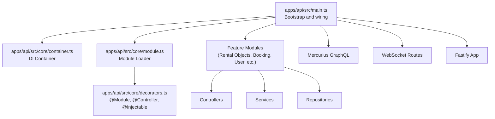
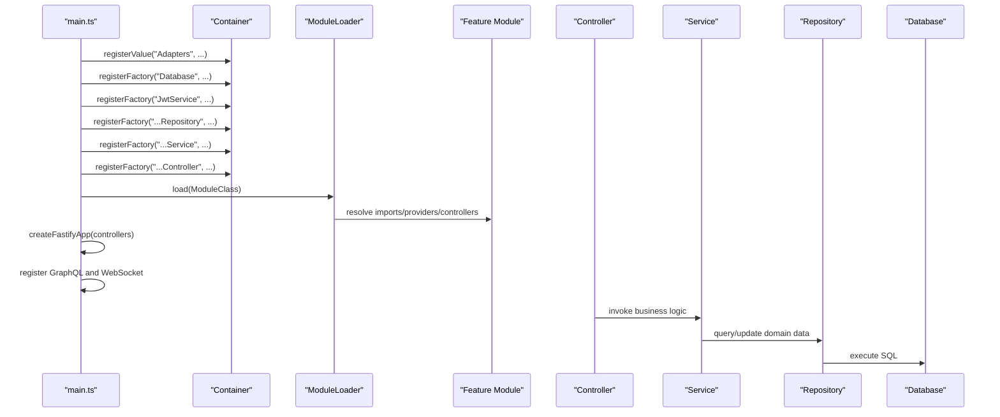
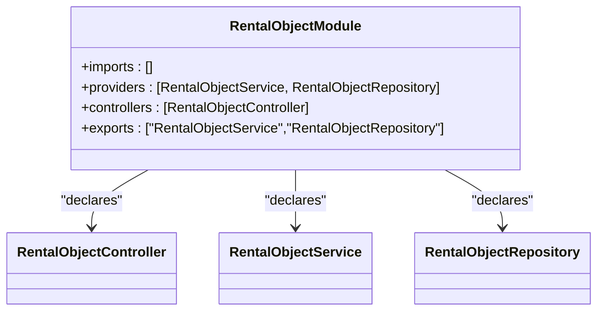
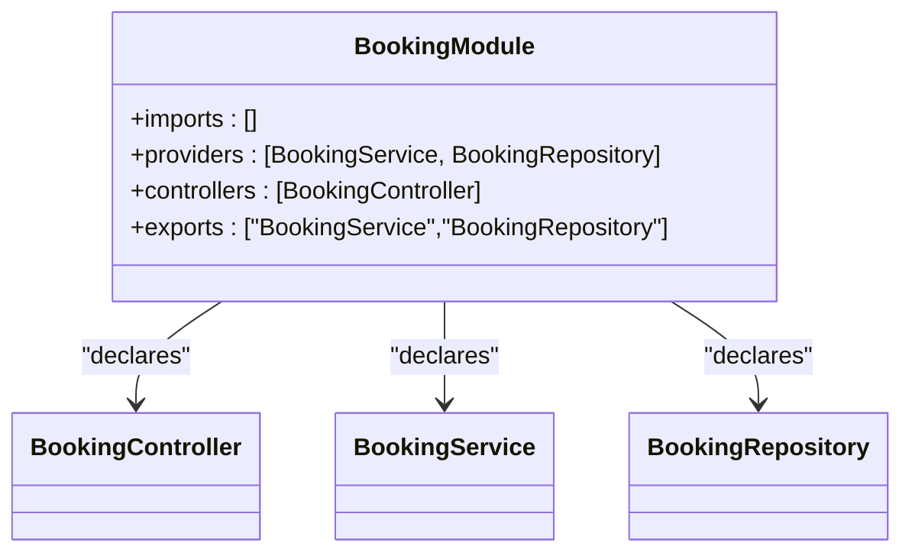
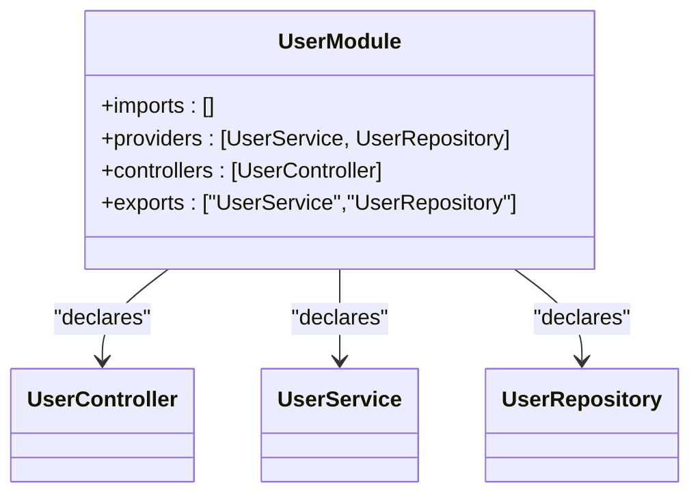
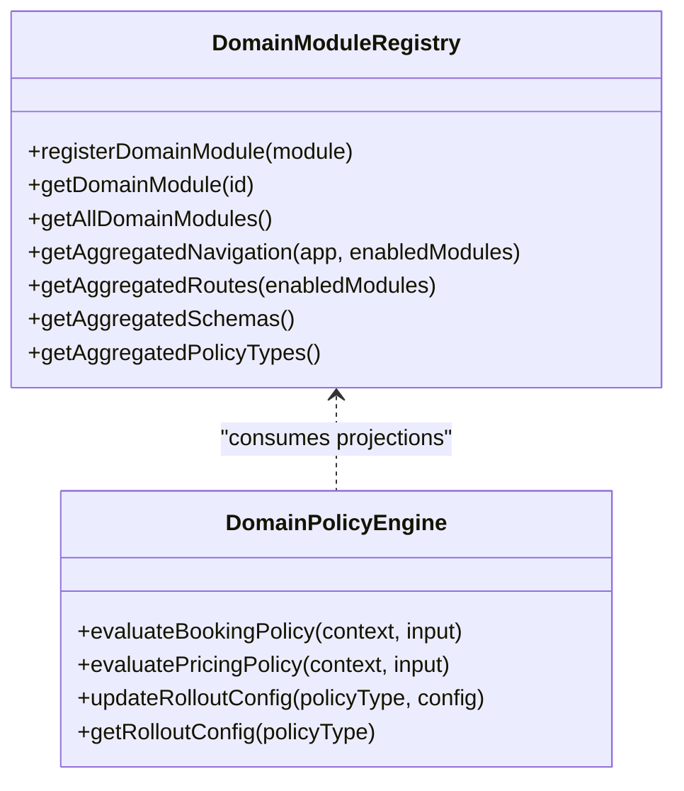
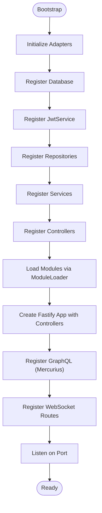
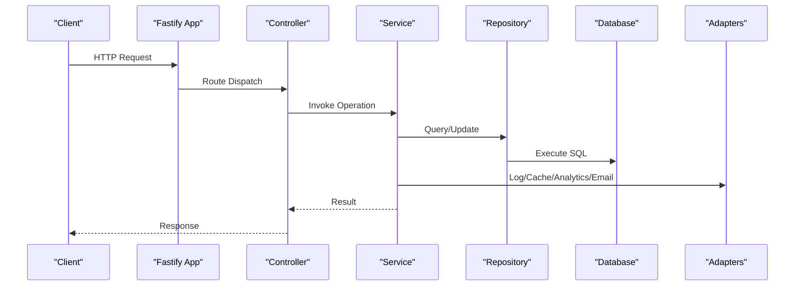
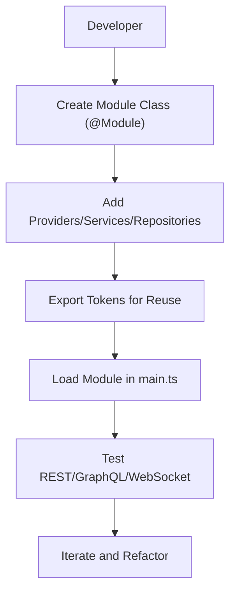
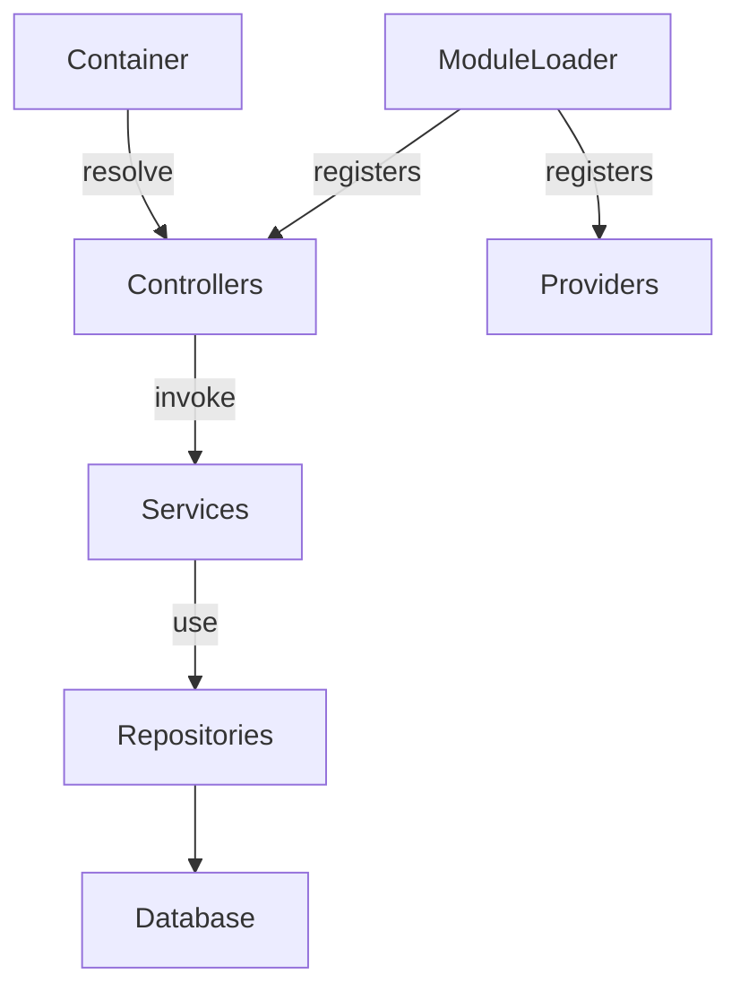

# Feature Modules

<cite>
**Referenced Files in This Document**
- [apps/api/src/main.ts](file://apps/api/src/main.ts)
- [apps/api/src/core/container.ts](file://apps/api/src/core/container.ts)
- [apps/api/src/core/module.ts](file://apps/api/src/core/module.ts)
- [apps/api/src/core/decorators.ts](file://apps/api/src/core/decorators.ts)
- [apps/api/src/modules/rental-objects/index.ts](file://apps/api/src/modules/rental-objects/index.ts)
- [apps/api/src/modules/booking/index.ts](file://apps/api/src/modules/booking/index.ts)
- [apps/api/src/modules/user/index.ts](file://apps/api/src/modules/user/index.ts)
- [apps/api/src/modules/domain/index.ts](file://apps/api/src/modules/domain/index.ts)
- [apps/api/src/modules/domain/registry.ts](file://apps/api/src/modules/domain/registry.ts)
- [apps/api/src/modules/domain/policy-engine.ts](file://apps/api/src/modules/domain/policy-engine.ts)
- [apps/api/package.json](file://apps/api/package.json)
</cite>

## Table of Contents
1. [Introduction](#introduction)
2. [Project Structure](#project-structure)
3. [Core Components](#core-components)
4. [Architecture Overview](#architecture-overview)
5. [Detailed Component Analysis](#detailed-component-analysis)
6. [Dependency Analysis](#dependency-analysis)
7. [Performance Considerations](#performance-considerations)
8. [Troubleshooting Guide](#troubleshooting-guide)
9. [Conclusion](#conclusion)
10. [Appendices](#appendices)

## Introduction
This document explains the modular architecture of the API server, focusing on how feature modules are organized, how business domains are bounded, and how integration patterns are implemented. It covers the rental objects management, booking system, user management, and access control modules. It also documents the module loading mechanism, dependency injection, and service coordination. Domain-driven design principles, CQRS patterns, and event-driven architecture are explained with practical examples and diagrams. Guidance is included for extending existing modules and creating new feature modules.

## Project Structure
The API server is a modular Fastify application with a custom dependency injection container and a NestJS-inspired module system. Modules encapsulate domain features and expose controllers and services. The main entry point initializes adapters, registers repositories and services, loads modules, and wires REST, GraphQL, and WebSocket endpoints.

**Diagram sources**
- [apps/api/src/main.ts](file://apps/api/src/main.ts#L112-L365)
- [apps/api/src/core/container.ts](file://apps/api/src/core/container.ts#L19-L164)
- [apps/api/src/core/module.ts](file://apps/api/src/core/module.ts#L19-L84)
- [apps/api/src/core/decorators.ts](file://apps/api/src/core/decorators.ts#L50-L152)

**Section sources**
- [apps/api/src/main.ts](file://apps/api/src/main.ts#L1-L366)
- [apps/api/package.json](file://apps/api/package.json#L1-L73)

## Core Components
- Dependency Injection Container: A lightweight, NestJS-style container supporting singleton/transient lifetimes, factories, and constructor injection via reflection metadata.
- Module Loader: Loads modules and their imports in dependency order, registering providers and controllers into the container.
- Decorators: Provide @Module, @Controller, @Injectable, and GraphQL decorators to define module composition and routing.
- Feature Modules: Rental Objects, Booking, User, and others, each exporting a module class and related controllers/services/repositories.
- Domain Module System: Central registry and policy engine enabling domain-driven extensibility and policy evaluation with gradual rollout.

**Section sources**
- [apps/api/src/core/container.ts](file://apps/api/src/core/container.ts#L19-L164)
- [apps/api/src/core/module.ts](file://apps/api/src/core/module.ts#L19-L84)
- [apps/api/src/core/decorators.ts](file://apps/api/src/core/decorators.ts#L50-L152)
- [apps/api/src/modules/rental-objects/index.ts](file://apps/api/src/modules/rental-objects/index.ts#L10-L15)
- [apps/api/src/modules/booking/index.ts](file://apps/api/src/modules/booking/index.ts#L9-L14)
- [apps/api/src/modules/user/index.ts](file://apps/api/src/modules/user/index.ts#L9-L14)
- [apps/api/src/modules/domain/index.ts](file://apps/api/src/modules/domain/index.ts#L10-L53)

## Architecture Overview
The API server follows a layered, modular architecture:
- Entry point initializes adapters, database, JWT service, repositories, services, controllers, loads modules, and registers routes.
- Controllers depend on services; services depend on repositories and adapters.
- Modules are orchestrated by the module loader and decorated with @Module to declare imports/providers/controllers.
- GraphQL resolvers are integrated via Mercurius; WebSocket routes are registered for real-time events.

**Diagram sources**
- [apps/api/src/main.ts](file://apps/api/src/main.ts#L112-L365)
- [apps/api/src/core/module.ts](file://apps/api/src/core/module.ts#L25-L58)
- [apps/api/src/core/container.ts](file://apps/api/src/core/container.ts#L63-L137)

## Detailed Component Analysis

### Rental Objects Management Module
The Rental Objects module encapsulates CRUD and projection operations for rental objects. It exports a module class, controller, service, and repository. The module declares providers and controllers for DI registration.

**Diagram sources**
- [apps/api/src/modules/rental-objects/index.ts](file://apps/api/src/modules/rental-objects/index.ts#L10-L15)

**Section sources**
- [apps/api/src/modules/rental-objects/index.ts](file://apps/api/src/modules/rental-objects/index.ts#L1-L21)

### Booking System Module
The Booking module manages booking lifecycle operations. It defines a module with its controller, service, and repository, and exports them for use by other modules.

**Diagram sources**
- [apps/api/src/modules/booking/index.ts](file://apps/api/src/modules/booking/index.ts#L9-L14)

**Section sources**
- [apps/api/src/modules/booking/index.ts](file://apps/api/src/modules/booking/index.ts#L1-L17)

### User Management Module
The User module provides user-related operations and exposes a controller, service, and repository for DI.

**Diagram sources**
- [apps/api/src/modules/user/index.ts](file://apps/api/src/modules/user/index.ts#L9-L14)

**Section sources**
- [apps/api/src/modules/user/index.ts](file://apps/api/src/modules/user/index.ts#L1-L17)

### Domain Module System and Policy Engine
The domain module system provides a registry for domain modules and a centralized policy engine. The registry aggregates navigation, routes, schemas, and policy types from enabled modules. The policy engine evaluates domain policies with gradual rollout controls.

**Diagram sources**
- [apps/api/src/modules/domain/registry.ts](file://apps/api/src/modules/domain/registry.ts#L27-L117)
- [apps/api/src/modules/domain/policy-engine.ts](file://apps/api/src/modules/domain/policy-engine.ts#L66-L280)

**Section sources**
- [apps/api/src/modules/domain/index.ts](file://apps/api/src/modules/domain/index.ts#L10-L53)
- [apps/api/src/modules/domain/registry.ts](file://apps/api/src/modules/domain/registry.ts#L1-L195)
- [apps/api/src/modules/domain/policy-engine.ts](file://apps/api/src/modules/domain/policy-engine.ts#L1-L325)

### Module Loading Mechanism and Dependency Injection
The module loader traverses module imports recursively, registering providers and controllers into the container. The container supports factories, singletons, and constructor injection. The main entry point wires adapters, database, JWT service, repositories, services, controllers, loads modules, and registers routes.

**Diagram sources**
- [apps/api/src/main.ts](file://apps/api/src/main.ts#L112-L365)
- [apps/api/src/core/module.ts](file://apps/api/src/core/module.ts#L25-L58)
- [apps/api/src/core/container.ts](file://apps/api/src/core/container.ts#L63-L137)

**Section sources**
- [apps/api/src/main.ts](file://apps/api/src/main.ts#L112-L365)
- [apps/api/src/core/module.ts](file://apps/api/src/core/module.ts#L19-L84)
- [apps/api/src/core/container.ts](file://apps/api/src/core/container.ts#L19-L164)

### Service Coordination and Integration Patterns
Controllers coordinate service calls, which in turn use repositories and adapters. The main entry point registers adapters (logging, caching, analytics, email) and makes them available via the container. REST routes are registered from controllers, and GraphQL resolvers are bound to the container.

**Diagram sources**
- [apps/api/src/main.ts](file://apps/api/src/main.ts#L112-L365)
- [apps/api/src/core/container.ts](file://apps/api/src/core/container.ts#L63-L137)

**Section sources**
- [apps/api/src/main.ts](file://apps/api/src/main.ts#L84-L107)
- [apps/api/src/main.ts](file://apps/api/src/main.ts#L148-L233)

### Domain-Driven Design Principles
- Bounded contexts: Each module encapsulates a bounded context (e.g., rental objects, bookings, users).
- Entities and repositories: Services operate on domain entities via repositories, keeping persistence details out of business logic.
- Aggregates and invariants: Policies and projections enforce invariants (e.g., minimum booking duration).
- Policy-driven evolution: The policy engine allows gradual rollout of policy changes without breaking deployments.

**Section sources**
- [apps/api/src/modules/domain/policy-engine.ts](file://apps/api/src/modules/domain/policy-engine.ts#L149-L207)
- [apps/api/src/modules/domain/registry.ts](file://apps/api/src/modules/domain/registry.ts#L100-L117)

### CQRS Patterns
- Command/Query separation: Controllers handle commands (mutations), while services encapsulate business logic and may expose projections for queries.
- Projections: Domain modules contribute schemas and projections consumed by the policy engine and UI.
- Eventual consistency: Projections and policies are evaluated against current state, enabling eventual consistency across modules.

**Section sources**
- [apps/api/src/modules/domain/registry.ts](file://apps/api/src/modules/domain/registry.ts#L164-L175)
- [apps/api/src/modules/domain/policy-engine.ts](file://apps/api/src/modules/domain/policy-engine.ts#L151-L207)

### Event-Driven Architecture
- Real-time events: WebSocket routes are registered for real-time audit and notifications.
- Notifications: Notification system modules dispatch and deliver events to users.
- Observability: Monitoring and audit modules capture operational events and logs.

**Section sources**
- [apps/api/src/main.ts](file://apps/api/src/main.ts#L318-L320)
- [apps/api/src/main.ts](file://apps/api/src/main.ts#L52-L53)

### Extending Existing Modules and Creating New Feature Modules
- Extend an existing module: Add new providers/services/repositories to the module’s providers array and export them. Update the module’s controller to expose new routes.
- Create a new feature module: Define a new module class with @Module, declare controllers and providers, export tokens for reuse, and load it via moduleLoader in the main entry point.
- Domain module extension: Register domain modules in the registry and contribute schemas, routes, navigation, and policy types.

**Diagram sources**
- [apps/api/src/core/decorators.ts](file://apps/api/src/core/decorators.ts#L50-L55)
- [apps/api/src/core/module.ts](file://apps/api/src/core/module.ts#L25-L58)
- [apps/api/src/main.ts](file://apps/api/src/main.ts#L235-L242)

**Section sources**
- [apps/api/src/core/decorators.ts](file://apps/api/src/core/decorators.ts#L50-L55)
- [apps/api/src/core/module.ts](file://apps/api/src/core/module.ts#L25-L58)
- [apps/api/src/main.ts](file://apps/api/src/main.ts#L235-L242)

## Dependency Analysis
The API server exhibits low coupling between modules through DI and clear module boundaries. Controllers depend on services, services on repositories, and repositories on the database. The module loader ensures deterministic loading order and prevents duplicate registrations.

**Diagram sources**
- [apps/api/src/core/container.ts](file://apps/api/src/core/container.ts#L63-L137)
- [apps/api/src/core/module.ts](file://apps/api/src/core/module.ts#L39-L55)

**Section sources**
- [apps/api/src/core/container.ts](file://apps/api/src/core/container.ts#L19-L164)
- [apps/api/src/core/module.ts](file://apps/api/src/core/module.ts#L19-L84)

## Performance Considerations
- Singleton services reduce overhead; ensure thread safety for shared resources.
- Use factories for per-request scoped dependencies when needed.
- Keep controllers thin; delegate business logic to services.
- Leverage GraphQL for efficient data fetching and reduce roundtrips.
- Monitor and cache expensive computations via adapters.

## Troubleshooting Guide
- Circular dependencies: The container detects circular dependencies during resolution and throws an error. Review provider registrations and module imports.
- Missing provider: If a dependency cannot be resolved, ensure the provider is registered or decorated with @Injectable and properly exported.
- Module not loaded: Verify the module is passed to moduleLoader.load(...) in the main entry point.
- GraphQL context: Ensure resolvers are registered with the container and context is provided.

**Section sources**
- [apps/api/src/core/container.ts](file://apps/api/src/core/container.ts#L63-L103)
- [apps/api/src/main.ts](file://apps/api/src/main.ts#L235-L242)

## Conclusion
The API server employs a robust, modular architecture with clear domain boundaries, DI, and module orchestration. The domain module system and policy engine enable scalable, policy-driven evolution. Controllers, services, and repositories form a clean separation of concerns, while GraphQL and WebSocket routes provide flexible integration patterns. The documented extension patterns allow teams to evolve features safely and incrementally.

## Appendices
- Environment variables required: DATABASE_URL, JWT_SECRET.
- Ports and endpoints: Health, GraphQL, REST endpoints, and WebSocket routes are logged at startup.

**Section sources**
- [apps/api/src/main.ts](file://apps/api/src/main.ts#L123-L142)
- [apps/api/src/main.ts](file://apps/api/src/main.ts#L343-L360)