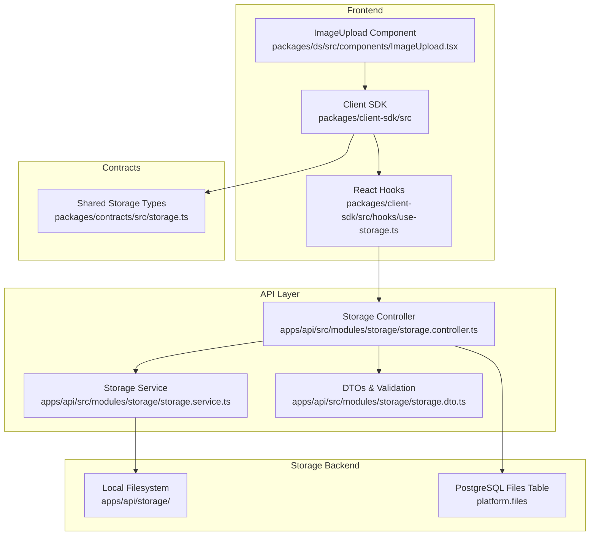
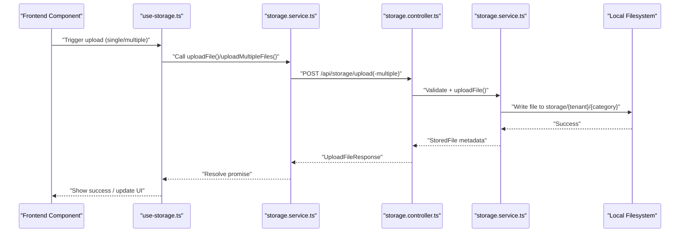
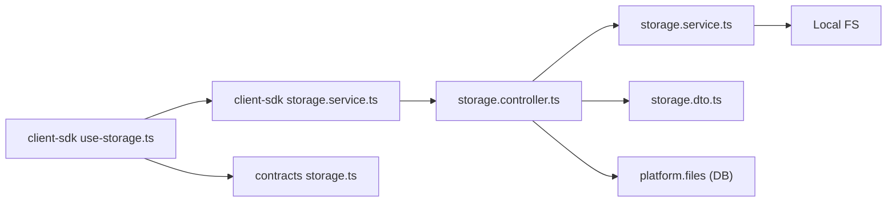

# File Storage Integrations

<cite>
**Referenced Files in This Document**
- [STORAGE_SYSTEM_COMPLETE.md](file://apps/api/STORAGE_SYSTEM_COMPLETE.md)
- [FILE_MANAGEMENT_PLAN.md](file://apps/api/FILE_MANAGEMENT_PLAN.md)
- [STORAGE_SYSTEM.md](file://docs/architecture/STORAGE_SYSTEM.md)
- [STORAGE_SYSTEM_FINAL_SUMMARY.md](file://docs/archive/2026-Q1/deployment-reports/STORAGE_SYSTEM_FINAL_SUMMARY.md)
- [storage.controller.ts](file://apps/api/src/modules/storage/storage.controller.ts)
- [storage.service.ts](file://apps/api/src/modules/storage/storage.service.ts)
- [storage.dto.ts](file://apps/api/src/modules/storage/storage.dto.ts)
- [storage.service.ts (client-sdk)](file://packages/client-sdk/src/services/storage.service.ts)
- [use-storage.ts](file://packages/client-sdk/src/hooks/use-storage.ts)
- [storage.ts (contracts)](file://packages/contracts/src/storage.ts)
- [RentalObjectImageUpload.example.tsx](file://docs/examples/RentalObjectImageUpload.example.tsx)
- [0037_add_files_table.sql](file://apps/api/drizzle/0037_add_files_table.sql)
</cite>

## Table of Contents
1. [Introduction](#introduction)
2. [Project Structure](#project-structure)
3. [Core Components](#core-components)
4. [Architecture Overview](#architecture-overview)
5. [Detailed Component Analysis](#detailed-component-analysis)
6. [Dependency Analysis](#dependency-analysis)
7. [Performance Considerations](#performance-considerations)
8. [Troubleshooting Guide](#troubleshooting-guide)
9. [Conclusion](#conclusion)
10. [Appendices](#appendices)

## Introduction
This document describes the file storage integrations and management system built for the Digilist Platform. It covers cloud storage providers, file upload mechanisms, media processing workflows, storage service architecture, file metadata management, and access control. It also documents validation, compression, optimization strategies, integration patterns for different storage backends, CDN configurations, backup procedures, security considerations, encryption at rest, secure file sharing, API endpoints for file operations, batch processing, cleanup procedures, implementation examples, and troubleshooting guidance.

## Project Structure
The storage system is implemented as a cohesive module with clear separation of concerns across the API, contracts, and client SDK. The architecture follows a contract-first, type-safe, enterprise-ready pattern with multi-tenant isolation and extensibility for cloud storage adapters.

**Diagram sources**
- [storage.controller.ts](file://apps/api/src/modules/storage/storage.controller.ts#L1-L310)
- [storage.service.ts](file://apps/api/src/modules/storage/storage.service.ts#L1-L196)
- [storage.dto.ts](file://apps/api/src/modules/storage/storage.dto.ts#L1-L106)
- [storage.service.ts (client-sdk)](file://packages/client-sdk/src/services/storage.service.ts#L1-L111)
- [use-storage.ts](file://packages/client-sdk/src/hooks/use-storage.ts#L1-L166)
- [storage.ts (contracts)](file://packages/contracts/src/storage.ts#L1-L76)
- [0037_add_files_table.sql](file://apps/api/drizzle/0037_add_files_table.sql#L1-L61)

**Section sources**
- [STORAGE_SYSTEM_COMPLETE.md](file://apps/api/STORAGE_SYSTEM_COMPLETE.md#L59-L89)
- [STORAGE_SYSTEM.md](file://docs/architecture/STORAGE_SYSTEM.md)

## Core Components
- API Layer
  - Storage Controller: Provides endpoints for upload, multiple upload, listing, deletion, and metadata update.
  - Storage Service: Implements file validation, multi-tenant isolation, local filesystem storage, and helper methods for listing and retrieval.
  - DTOs & Validation: Zod schemas define strict request/response contracts for all operations.
- Contracts Package
  - Shared TypeScript interfaces ensure type safety across API and client SDK.
- Client SDK
  - Storage Service: HTTP client for file operations with FormData support.
  - React Hooks: useUploadFile, useUploadMultipleFiles, useListFiles, useDeleteFile, useUpdateFileMetadata, useFileUrl.
- Integration Examples
  - Rental object image upload, drag-and-drop, and URL resolution examples.

**Section sources**
- [STORAGE_SYSTEM_COMPLETE.md](file://apps/api/STORAGE_SYSTEM_COMPLETE.md#L7-L48)
- [storage.controller.ts](file://apps/api/src/modules/storage/storage.controller.ts#L18-L310)
- [storage.service.ts](file://apps/api/src/modules/storage/storage.service.ts#L30-L196)
- [storage.dto.ts](file://apps/api/src/modules/storage/storage.dto.ts#L1-L106)
- [storage.service.ts (client-sdk)](file://packages/client-sdk/src/services/storage.service.ts#L17-L111)
- [use-storage.ts](file://packages/client-sdk/src/hooks/use-storage.ts#L18-L166)
- [storage.ts (contracts)](file://packages/contracts/src/storage.ts#L1-L76)
- [RentalObjectImageUpload.example.tsx](file://docs/examples/RentalObjectImageUpload.example.tsx#L1-L190)

## Architecture Overview
The system follows a layered architecture:
- Frontend integrates via React hooks and the client SDK.
- API layer validates and orchestrates file operations.
- Storage service persists files to the local filesystem under tenant-specific directories.
- Contracts ensure shared types across the stack.
- Database tracks file metadata and supports multi-tenancy with row-level security.

**Diagram sources**
- [storage.controller.ts](file://apps/api/src/modules/storage/storage.controller.ts#L26-L116)
- [storage.service.ts](file://apps/api/src/modules/storage/storage.service.ts#L52-L92)
- [storage.service.ts (client-sdk)](file://packages/client-sdk/src/services/storage.service.ts#L25-L55)

**Section sources**
- [STORAGE_SYSTEM.md](file://docs/architecture/STORAGE_SYSTEM.md)
- [STORAGE_SYSTEM_FINAL_SUMMARY.md](file://docs/archive/2026-Q1/deployment-reports/STORAGE_SYSTEM_FINAL_SUMMARY.md#L47-L75)

## Detailed Component Analysis

### Storage Controller
Responsibilities:
- Enforce tenant context and validate multipart/form-data.
- Upload single and multiple files with robust error handling.
- List, delete, and update file metadata (placeholders for DB integration).
- Return standardized error responses for validation and internal errors.

Key behaviors:
- Extracts tenantId from request context and rejects unauthorized requests.
- Validates metadata using Zod schemas.
- Streams multipart parts for batch uploads.
- Returns structured responses with upload results and aggregated errors.

**Section sources**
- [storage.controller.ts](file://apps/api/src/modules/storage/storage.controller.ts#L22-L116)
- [storage.controller.ts](file://apps/api/src/modules/storage/storage.controller.ts#L118-L187)
- [storage.controller.ts](file://apps/api/src/modules/storage/storage.controller.ts#L189-L231)
- [storage.controller.ts](file://apps/api/src/modules/storage/storage.controller.ts#L233-L267)
- [storage.controller.ts](file://apps/api/src/modules/storage/storage.controller.ts#L269-L308)

### Storage Service
Responsibilities:
- Validate file size and MIME type.
- Generate unique filenames to avoid collisions.
- Create tenant/category directories and write files atomically.
- Provide helpers for listing, retrieving, and deleting files.
- Initialize seed images directory structure.

Security and isolation:
- Multi-tenant directory layout prevents cross-tenant access.
- Filename hashing reduces predictable path exposure.
- Access checks and unlink operations guard against unauthorized deletions.

**Section sources**
- [storage.service.ts](file://apps/api/src/modules/storage/storage.service.ts#L30-L92)
- [storage.service.ts](file://apps/api/src/modules/storage/storage.service.ts#L94-L110)
- [storage.service.ts](file://apps/api/src/modules/storage/storage.service.ts#L112-L158)
- [storage.service.ts](file://apps/api/src/modules/storage/storage.service.ts#L175-L194)

### DTOs and Validation
Responsibilities:
- Define strict request/response schemas for upload, listing, and metadata updates.
- Enforce enums for categories and optional polymorphic associations.
- Provide type-safe contracts for client SDK and API.

**Section sources**
- [storage.dto.ts](file://apps/api/src/modules/storage/storage.dto.ts#L11-L19)
- [storage.dto.ts](file://apps/api/src/modules/storage/storage.dto.ts#L26-L42)
- [storage.dto.ts](file://apps/api/src/modules/storage/storage.dto.ts#L46-L56)
- [storage.dto.ts](file://apps/api/src/modules/storage/storage.dto.ts#L61-L85)
- [storage.dto.ts](file://apps/api/src/modules/storage/storage.dto.ts#L100-L105)

### Client SDK Storage Service and Hooks
Responsibilities:
- Build FormData for uploads and forward to API endpoints.
- Provide typed hooks for mutations and queries.
- Resolve absolute URLs from relative paths for display.

Patterns:
- BaseService pattern encapsulates HTTP client configuration.
- React Query hooks manage caching, invalidation, and optimistic updates.
- URL helper centralizes base URL resolution and path normalization.

**Section sources**
- [storage.service.ts (client-sdk)](file://packages/client-sdk/src/services/storage.service.ts#L17-L111)
- [use-storage.ts](file://packages/client-sdk/src/hooks/use-storage.ts#L38-L48)
- [use-storage.ts](file://packages/client-sdk/src/hooks/use-storage.ts#L62-L71)
- [use-storage.ts](file://packages/client-sdk/src/hooks/use-storage.ts#L85-L94)
- [use-storage.ts](file://packages/client-sdk/src/hooks/use-storage.ts#L108-L117)
- [use-storage.ts](file://packages/client-sdk/src/hooks/use-storage.ts#L137-L151)
- [use-storage.ts](file://packages/client-sdk/src/hooks/use-storage.ts#L163-L165)

### Contracts Package
Responsibilities:
- Define shared interfaces for upload, listing, and metadata operations.
- Ensure consistency between API and client SDK types.

**Section sources**
- [storage.ts (contracts)](file://packages/contracts/src/storage.ts#L7-L29)
- [storage.ts (contracts)](file://packages/contracts/src/storage.ts#L31-L39)
- [storage.ts (contracts)](file://packages/contracts/src/storage.ts#L41-L58)
- [storage.ts (contracts)](file://packages/contracts/src/storage.ts#L60-L75)

### Integration Examples
Responsibilities:
- Demonstrate end-to-end workflows for creating/updating rental objects with images.
- Show drag-and-drop upload and URL resolution patterns.

**Section sources**
- [RentalObjectImageUpload.example.tsx](file://docs/examples/RentalObjectImageUpload.example.tsx#L13-L66)
- [RentalObjectImageUpload.example.tsx](file://docs/examples/RentalObjectImageUpload.example.tsx#L71-L118)
- [RentalObjectImageUpload.example.tsx](file://docs/examples/RentalObjectImageUpload.example.tsx#L123-L138)
- [RentalObjectImageUpload.example.tsx](file://docs/examples/RentalObjectImageUpload.example.tsx#L143-L189)

## Dependency Analysis
The system exhibits low coupling and high cohesion:
- Controller depends on StorageService and DTOs.
- Client SDK depends on contracts and BaseService.
- StorageService depends on filesystem APIs and path utilities.
- Database schema supports multi-tenancy and polymorphic associations.

**Diagram sources**
- [storage.controller.ts](file://apps/api/src/modules/storage/storage.controller.ts#L1-L310)
- [storage.service.ts](file://apps/api/src/modules/storage/storage.service.ts#L1-L196)
- [storage.dto.ts](file://apps/api/src/modules/storage/storage.dto.ts#L1-L106)
- [storage.service.ts (client-sdk)](file://packages/client-sdk/src/services/storage.service.ts#L1-L111)
- [use-storage.ts](file://packages/client-sdk/src/hooks/use-storage.ts#L1-L166)
- [storage.ts (contracts)](file://packages/contracts/src/storage.ts#L1-L76)
- [0037_add_files_table.sql](file://apps/api/drizzle/0037_add_files_table.sql#L1-L61)

**Section sources**
- [STORAGE_SYSTEM.md](file://docs/architecture/STORAGE_SYSTEM.md)
- [STORAGE_SYSTEM_FINAL_SUMMARY.md](file://docs/archive/2026-Q1/deployment-reports/STORAGE_SYSTEM_FINAL_SUMMARY.md#L47-L75)

## Performance Considerations
- File size limits and MIME-type validation reduce unnecessary processing and storage overhead.
- Unique filename generation prevents collisions and enables safe concurrent uploads.
- Directory structure organizes files by tenant and category for efficient listing and pruning.
- Batch upload endpoint aggregates results and returns per-file errors for resilience.
- Future optimizations include image resizing, thumbnail generation, and CDN integration.

[No sources needed since this section provides general guidance]

## Troubleshooting Guide
Common issues and resolutions:
- Unauthorized requests: Ensure tenant context is present in the request; controller returns 401 when missing.
- Validation errors: Confirm multipart metadata matches Zod schemas; controller returns 400 with details.
- File not found during delete: Storage service throws when file does not exist; verify tenant/category/path.
- URL resolution problems: Use the client SDK’s URL helper to normalize relative paths to absolute URLs.
- Static file serving: Ensure static routes are configured for the storage directory so seeded images are accessible.

Operational checks:
- Verify storage directory initialization and seed images placement.
- Confirm database migration for file metadata is applied.
- Test batch upload behavior and error aggregation.

**Section sources**
- [storage.controller.ts](file://apps/api/src/modules/storage/storage.controller.ts#L32-L39)
- [storage.controller.ts](file://apps/api/src/modules/storage/storage.controller.ts#L45-L52)
- [storage.controller.ts](file://apps/api/src/modules/storage/storage.controller.ts#L99-L115)
- [storage.service.ts](file://apps/api/src/modules/storage/storage.service.ts#L97-L110)
- [storage.service.ts (client-sdk)](file://packages/client-sdk/src/services/storage.service.ts#L91-L109)
- [FILE_MANAGEMENT_PLAN.md](file://apps/api/FILE_MANAGEMENT_PLAN.md#L18-L23)
- [0037_add_files_table.sql](file://apps/api/drizzle/0037_add_files_table.sql#L1-L61)

## Conclusion
The file storage system provides a robust, contract-first foundation for uploading, managing, and serving files across tenants. It includes strong validation, multi-tenant isolation, and a clear path toward database-backed metadata, cloud storage adapters, and advanced media processing. The client SDK and React hooks streamline integration for frontend applications, while the architecture supports future enhancements such as CDN integration, virus scanning, and encryption at rest.

[No sources needed since this section summarizes without analyzing specific files]

## Appendices

### API Endpoints for File Operations
- POST /api/storage/upload
  - Purpose: Upload a single file.
  - Request: multipart/form-data with file and optional metadata.
  - Response: UploadFileResponse with id, url, filename, mimetype, sizeBytes, category, altText, caption, createdAt.
- POST /api/storage/upload-multiple
  - Purpose: Upload multiple files.
  - Request: multipart/form-data with multiple files.
  - Response: UploadMultipleFilesResponse with files, totalUploaded, totalFailed, and optional errors.
- GET /api/storage/files
  - Purpose: List files with optional filters (category, entityType, entityId, page, limit).
  - Response: ListFilesResponse with data and pagination metadata.
- DELETE /api/storage/files/:id
  - Purpose: Delete a file.
  - Response: 204 No Content on success.
- PATCH /api/storage/files/:id
  - Purpose: Update file metadata (altText, caption).
  - Response: UploadFileResponse reflecting updates.

**Section sources**
- [STORAGE_SYSTEM_COMPLETE.md](file://apps/api/STORAGE_SYSTEM_COMPLETE.md#L210-L259)
- [storage.controller.ts](file://apps/api/src/modules/storage/storage.controller.ts#L26-L116)
- [storage.controller.ts](file://apps/api/src/modules/storage/storage.controller.ts#L122-L187)
- [storage.controller.ts](file://apps/api/src/modules/storage/storage.controller.ts#L193-L231)
- [storage.controller.ts](file://apps/api/src/modules/storage/storage.controller.ts#L237-L267)
- [storage.controller.ts](file://apps/api/src/modules/storage/storage.controller.ts#L273-L308)

### File Metadata Management and Access Control
- Database schema (platform.files) stores:
  - Tenant isolation, polymorphic associations, storage provider and paths, categorization, metadata, audit fields, and lifecycle markers.
  - Row-level security policy enforces tenant isolation using current tenant setting.
- Access control:
  - Private files require signed URLs or time-limited tokens.
  - RBAC integration ensures only authorized users can upload or modify associated entities.
  - IP-based restrictions and audit logs support compliance.

**Section sources**
- [0037_add_files_table.sql](file://apps/api/drizzle/0037_add_files_table.sql#L5-L61)
- [FILE_MANAGEMENT_PLAN.md](file://apps/api/FILE_MANAGEMENT_PLAN.md#L73-L79)

### Media Processing Workflows
- Current state: Local filesystem storage with validation and unique filenames.
- Planned enhancements:
  - Image optimization (resize, format conversion, quality tuning).
  - Thumbnail generation.
  - Document preview generation and text extraction.
  - Antivirus scanning integration.

**Section sources**
- [STORAGE_SYSTEM_COMPLETE.md](file://apps/api/STORAGE_SYSTEM_COMPLETE.md#L187-L207)
- [FILE_MANAGEMENT_PLAN.md](file://apps/api/FILE_MANAGEMENT_PLAN.md#L93-L96)

### Cloud Storage Integration Patterns
- Adapter interface design supports pluggable storage backends.
- S3-compatible adapters enable DigitalOcean Spaces and Backblaze B2.
- CDN integration and automatic backups planned.

**Section sources**
- [STORAGE_SYSTEM_COMPLETE.md](file://apps/api/STORAGE_SYSTEM_COMPLETE.md#L194-L210)
- [FILE_MANAGEMENT_PLAN.md](file://apps/api/FILE_MANAGEMENT_PLAN.md#L196-L210)

### Backup Procedures
- Local storage: Regular filesystem snapshots and offsite backups.
- Cloud storage: Enable versioning and cross-region replication.
- Database backups: Include platform.files metadata for full restore capability.

**Section sources**
- [FILE_MANAGEMENT_PLAN.md](file://apps/api/FILE_MANAGEMENT_PLAN.md#L212-L217)

### Security Considerations
- File validation: Magic-byte verification, extension whitelisting, size limits.
- Access control: Signed URLs, time-limited tokens, IP restrictions, RBAC.
- Encryption at rest: AES-256 for cloud providers; filesystem encryption for local storage.
- Secure file sharing: Pre-signed URLs with short TTLs; watermarking for sensitive images.

**Section sources**
- [FILE_MANAGEMENT_PLAN.md](file://apps/api/FILE_MANAGEMENT_PLAN.md#L222-L239)

### Implementation Examples
- Create rental object with images: Upload multiple files, then create the object with returned URLs.
- Update rental object images: Upload single file and append to existing images array.
- Display images with correct URLs: Use the URL helper to resolve relative paths.
- Drag-and-drop upload: Accept dropped images, filter by type, and upload in batches.

**Section sources**
- [RentalObjectImageUpload.example.tsx](file://docs/examples/RentalObjectImageUpload.example.tsx#L13-L66)
- [RentalObjectImageUpload.example.tsx](file://docs/examples/RentalObjectImageUpload.example.tsx#L71-L118)
- [RentalObjectImageUpload.example.tsx](file://docs/examples/RentalObjectImageUpload.example.tsx#L123-L138)
- [RentalObjectImageUpload.example.tsx](file://docs/examples/RentalObjectImageUpload.example.tsx#L143-L189)

### Cleanup Procedures
- Soft delete files in database with deleted_at timestamp.
- Remove physical files from storage after retention period.
- Purge unused thumbnails and temporary uploads.
- Audit logs for compliance and incident response.

**Section sources**
- [0037_add_files_table.sql](file://apps/api/drizzle/0037_add_files_table.sql#L38-L41)