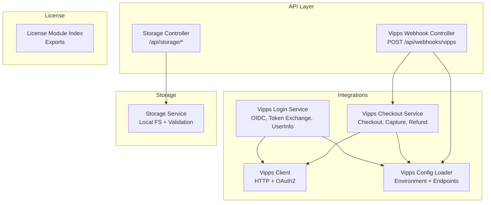
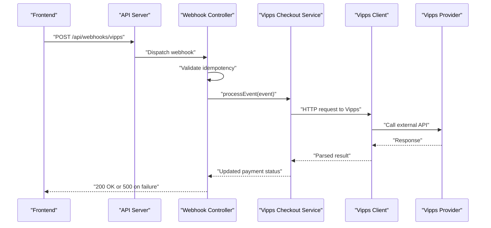
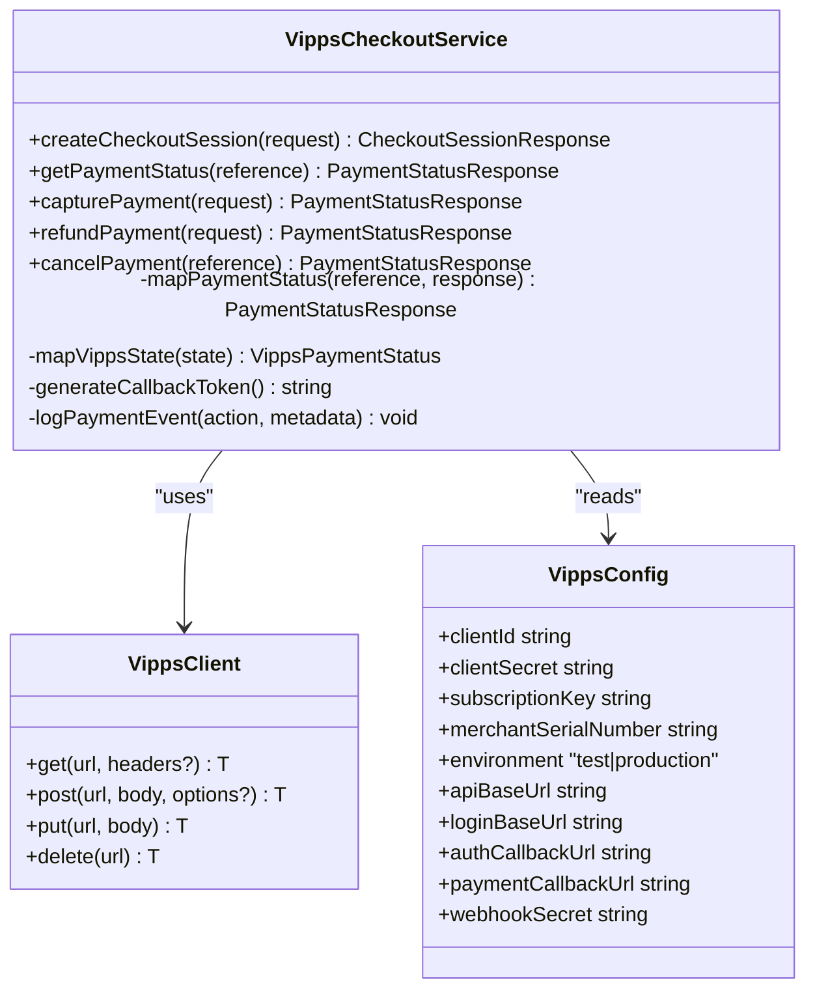
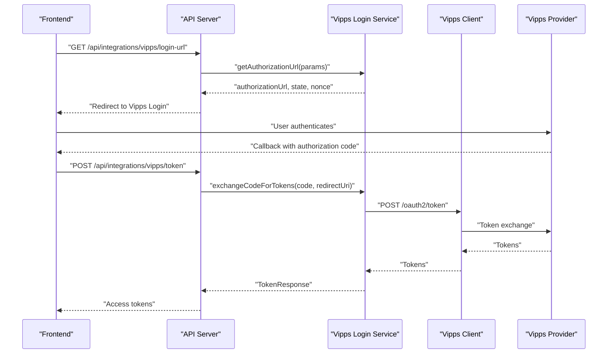
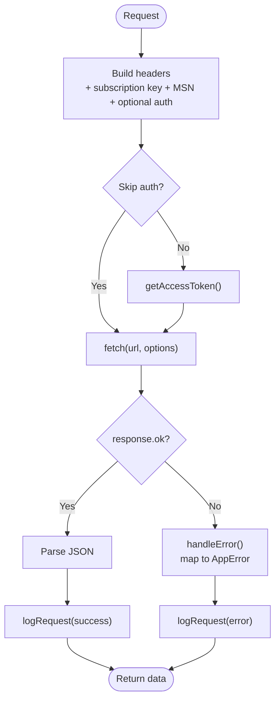
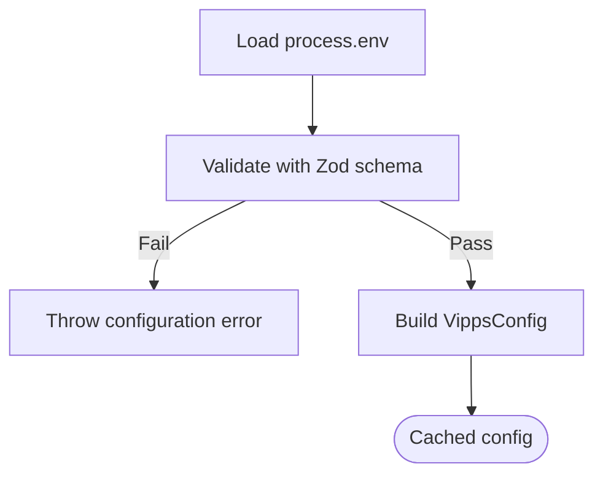
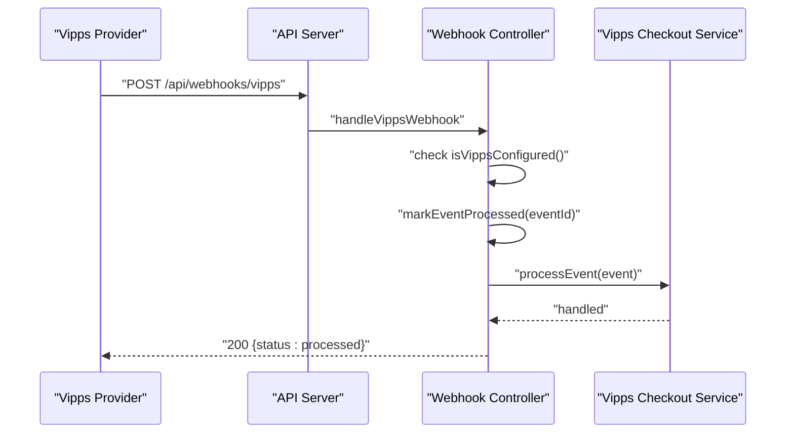
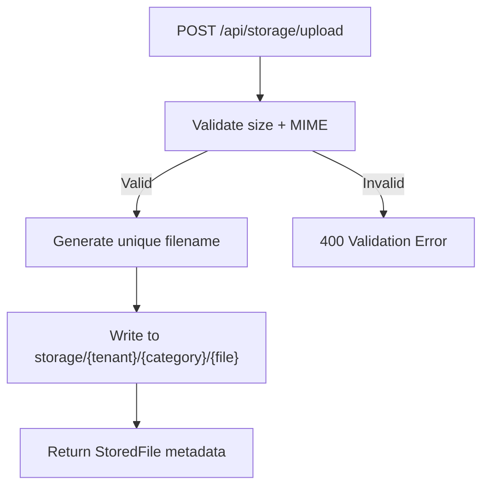
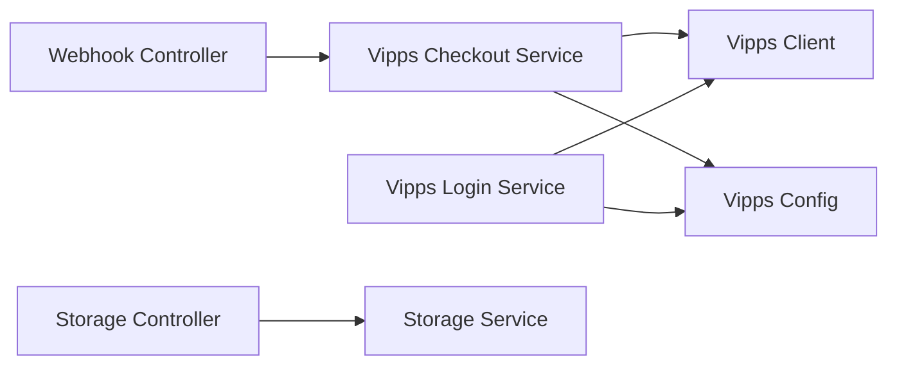

# Integration & External Services

<cite>
**Referenced Files in This Document**
- [apps/api/src/integrations/vipps/index.ts](file://apps/api/src/integrations/vipps/index.ts)
- [apps/api/src/integrations/vipps/vipps-checkout.service.ts](file://apps/api/src/integrations/vipps/vipps-checkout.service.ts)
- [apps/api/src/integrations/vipps/vipps-login.service.ts](file://apps/api/src/integrations/vipps/vipps-login.service.ts)
- [apps/api/src/integrations/vipps/vipps.client.ts](file://apps/api/src/integrations/vipps/vipps.client.ts)
- [apps/api/src/config/vipps.config.ts](file://apps/api/src/config/vipps.config.ts)
- [apps/api/src/modules/webhooks/vipps-webhook.controller.ts](file://apps/api/src/modules/webhooks/vipps-webhook.controller.ts)
- [apps/api/src/modules/storage/storage.service.ts](file://apps/api/src/modules/storage/storage.service.ts)
- [apps/api/src/modules/storage/storage.controller.ts](file://apps/api/src/modules/storage/storage.controller.ts)
- [apps/api/.env.example](file://apps/api/.env.example)
- [tests/journeys/vipps-payment.spec.ts](file://tests/journeys/vipps-payment.spec.ts)
- [docs/architecture/STORAGE_SYSTEM.md](file://docs/architecture/STORAGE_SYSTEM.md)
- [apps/api/src/modules/license/index.ts](file://apps/api/src/modules/license/index.ts)
</cite>

## Table of Contents
1. [Introduction](#introduction)
2. [Project Structure](#project-structure)
3. [Core Components](#core-components)
4. [Architecture Overview](#architecture-overview)
5. [Detailed Component Analysis](#detailed-component-analysis)
6. [Dependency Analysis](#dependency-analysis)
7. [Performance Considerations](#performance-considerations)
8. [Troubleshooting Guide](#troubleshooting-guide)
9. [Conclusion](#conclusion)
10. [Appendices](#appendices)

## Introduction
This document explains external service integrations and third-party connections in the monorepo, focusing on:
- Payment processing integrations (Vipps Checkout and Login)
- File storage services (local filesystem-based storage)
- License management systems (tenant license key lifecycle)
- Webhook handling and event-driven integrations
- API connectors and configuration patterns
- Metadata management and external data synchronization
- Service orchestration, error handling, and monitoring

It targets both technical and non-technical readers, providing diagrams, configuration guidance, security considerations, and troubleshooting steps.

## Project Structure
The integration surface spans three primary areas:
- Vipps integrations under apps/api/src/integrations/vipps
- Storage subsystem under apps/api/src/modules/storage
- License management under apps/api/src/modules/license
- Webhooks under apps/api/src/modules/webhooks

**Diagram sources**
- [apps/api/src/modules/webhooks/vipps-webhook.controller.ts](file://apps/api/src/modules/webhooks/vipps-webhook.controller.ts#L91-L239)
- [apps/api/src/modules/storage/storage.controller.ts](file://apps/api/src/modules/storage/storage.controller.ts#L18-L310)
- [apps/api/src/integrations/vipps/vipps.client.ts](file://apps/api/src/integrations/vipps/vipps.client.ts#L113-L309)
- [apps/api/src/integrations/vipps/vipps-checkout.service.ts](file://apps/api/src/integrations/vipps/vipps-checkout.service.ts#L147-L431)
- [apps/api/src/integrations/vipps/vipps-login.service.ts](file://apps/api/src/integrations/vipps/vipps-login.service.ts#L224-L504)
- [apps/api/src/config/vipps.config.ts](file://apps/api/src/config/vipps.config.ts#L107-L221)
- [apps/api/src/modules/storage/storage.service.ts](file://apps/api/src/modules/storage/storage.service.ts#L30-L196)
- [apps/api/src/modules/license/index.ts](file://apps/api/src/modules/license/index.ts#L1-L12)

**Section sources**
- [apps/api/src/integrations/vipps/index.ts](file://apps/api/src/integrations/vipps/index.ts#L1-L7)
- [apps/api/src/integrations/vipps/vipps-checkout.service.ts](file://apps/api/src/integrations/vipps/vipps-checkout.service.ts#L1-L431)
- [apps/api/src/integrations/vipps/vipps-login.service.ts](file://apps/api/src/integrations/vipps/vipps-login.service.ts#L1-L504)
- [apps/api/src/integrations/vipps/vipps.client.ts](file://apps/api/src/integrations/vipps/vipps.client.ts#L1-L309)
- [apps/api/src/config/vipps.config.ts](file://apps/api/src/config/vipps.config.ts#L1-L257)
- [apps/api/src/modules/webhooks/vipps-webhook.controller.ts](file://apps/api/src/modules/webhooks/vipps-webhook.controller.ts#L91-L239)
- [apps/api/src/modules/storage/storage.service.ts](file://apps/api/src/modules/storage/storage.service.ts#L1-L196)
- [apps/api/src/modules/storage/storage.controller.ts](file://apps/api/src/modules/storage/storage.controller.ts#L1-L310)
- [apps/api/src/modules/license/index.ts](file://apps/api/src/modules/license/index.ts#L1-L12)

## Core Components
- Vipps Checkout Service: Manages payment lifecycle (create session, capture, refund, cancel) and maps statuses to internal state.
- Vipps Login Service: Implements OIDC discovery, authorization URL generation, token exchange, ID token validation, and userinfo retrieval.
- Vipps Client: Encapsulates HTTP transport, OAuth2 client credentials flow, subscription key signing, idempotency, and error mapping.
- Vipps Config: Loads and validates environment variables, constructs endpoints, and exposes configuration and status constants.
- Vipps Webhook Controller: Receives and processes Vipps webhook events, enforces idempotency, logs audit events, and returns appropriate HTTP responses.
- Storage Service and Controller: Local filesystem-based file upload, validation, and metadata scaffolding; serves as a model for external storage integration.
- License Module: Exports license key management services and types for tenant license lifecycle.

**Section sources**
- [apps/api/src/integrations/vipps/vipps-checkout.service.ts](file://apps/api/src/integrations/vipps/vipps-checkout.service.ts#L147-L431)
- [apps/api/src/integrations/vipps/vipps-login.service.ts](file://apps/api/src/integrations/vipps/vipps-login.service.ts#L224-L504)
- [apps/api/src/integrations/vipps/vipps.client.ts](file://apps/api/src/integrations/vipps/vipps.client.ts#L113-L309)
- [apps/api/src/config/vipps.config.ts](file://apps/api/src/config/vipps.config.ts#L107-L221)
- [apps/api/src/modules/webhooks/vipps-webhook.controller.ts](file://apps/api/src/modules/webhooks/vipps-webhook.controller.ts#L91-L239)
- [apps/api/src/modules/storage/storage.service.ts](file://apps/api/src/modules/storage/storage.service.ts#L30-L196)
- [apps/api/src/modules/storage/storage.controller.ts](file://apps/api/src/modules/storage/storage.controller.ts#L18-L310)
- [apps/api/src/modules/license/index.ts](file://apps/api/src/modules/license/index.ts#L1-L12)

## Architecture Overview
The system orchestrates external integrations through dedicated services and controllers:
- Controllers expose HTTP endpoints and delegate to services.
- Services encapsulate business logic and interact with external APIs via a shared client.
- Configuration is centralized and validated at runtime.
- Webhooks enable event-driven synchronization with external providers.

**Diagram sources**
- [apps/api/src/modules/webhooks/vipps-webhook.controller.ts](file://apps/api/src/modules/webhooks/vipps-webhook.controller.ts#L91-L239)
- [apps/api/src/integrations/vipps/vipps-checkout.service.ts](file://apps/api/src/integrations/vipps/vipps-checkout.service.ts#L155-L217)
- [apps/api/src/integrations/vipps/vipps.client.ts](file://apps/api/src/integrations/vipps/vipps.client.ts#L139-L182)

## Detailed Component Analysis

### Vipps Checkout Service
Implements payment lifecycle operations:
- Create checkout session with callback and return URLs
- Retrieve payment status and map provider states to internal status
- Capture authorized payments with idempotency
- Issue refunds and cancellations
- Audit logging for all operations

**Diagram sources**
- [apps/api/src/integrations/vipps/vipps-checkout.service.ts](file://apps/api/src/integrations/vipps/vipps-checkout.service.ts#L147-L431)
- [apps/api/src/integrations/vipps/vipps.client.ts](file://apps/api/src/integrations/vipps/vipps.client.ts#L113-L309)
- [apps/api/src/config/vipps.config.ts](file://apps/api/src/config/vipps.config.ts#L23-L143)

**Section sources**
- [apps/api/src/integrations/vipps/vipps-checkout.service.ts](file://apps/api/src/integrations/vipps/vipps-checkout.service.ts#L147-L431)

### Vipps Login Service
Handles OIDC-based authentication:
- OIDC discovery and JWKS caching
- Authorization URL construction with state and nonce
- Token exchange with subscription key and merchant serial number
- ID token validation (issuer, audience, expiry, nonce)
- User info retrieval

**Diagram sources**
- [apps/api/src/integrations/vipps/vipps-login.service.ts](file://apps/api/src/integrations/vipps/vipps-login.service.ts#L245-L337)
- [apps/api/src/integrations/vipps/vipps.client.ts](file://apps/api/src/integrations/vipps/vipps.client.ts#L139-L182)

**Section sources**
- [apps/api/src/integrations/vipps/vipps-login.service.ts](file://apps/api/src/integrations/vipps/vipps-login.service.ts#L224-L504)

### Vipps Client
Encapsulates HTTP communication:
- Access token management via client credentials flow with caching and expiry buffer
- Subscription key and merchant serial number headers
- Idempotency support for POST requests
- RFC 7807 error mapping and audit logging
- Request/response lifecycle with timing and success/error tracking

**Diagram sources**
- [apps/api/src/integrations/vipps/vipps.client.ts](file://apps/api/src/integrations/vipps/vipps.client.ts#L139-L242)

**Section sources**
- [apps/api/src/integrations/vipps/vipps.client.ts](file://apps/api/src/integrations/vipps/vipps.client.ts#L113-L309)

### Vipps Configuration
Centralized configuration loader:
- Validates environment variables using schema validation
- Provides environment-specific base URLs and defaults
- Generates endpoints for Login, Checkout, ePayment, Webhooks, and Access Token
- Exposes status constants and scopes for OIDC

**Diagram sources**
- [apps/api/src/config/vipps.config.ts](file://apps/api/src/config/vipps.config.ts#L107-L144)

**Section sources**
- [apps/api/src/config/vipps.config.ts](file://apps/api/src/config/vipps.config.ts#L107-L221)

### Vipps Webhook Controller
Receives and processes Vipps webhook events:
- Enforces idempotency using event IDs
- Logs audit entries for received and failed events
- Routes events to specific handlers (authorized, captured, refunded, etc.)
- Returns 500 on processing failures to trigger provider retries

**Diagram sources**
- [apps/api/src/modules/webhooks/vipps-webhook.controller.ts](file://apps/api/src/modules/webhooks/vipps-webhook.controller.ts#L91-L239)
- [apps/api/src/integrations/vipps/vipps-checkout.service.ts](file://apps/api/src/integrations/vipps/vipps-checkout.service.ts#L224-L336)

**Section sources**
- [apps/api/src/modules/webhooks/vipps-webhook.controller.ts](file://apps/api/src/modules/webhooks/vipps-webhook.controller.ts#L91-L239)

### Storage Service and Controller
Local filesystem-based file storage:
- Validates file size and MIME types
- Generates unique filenames to avoid collisions
- Organizes files by tenant and category
- Provides upload, delete, list, and metadata update endpoints
- Serves as a reference for integrating cloud storage providers

**Diagram sources**
- [apps/api/src/modules/storage/storage.controller.ts](file://apps/api/src/modules/storage/storage.controller.ts#L26-L116)
- [apps/api/src/modules/storage/storage.service.ts](file://apps/api/src/modules/storage/storage.service.ts#L52-L92)

**Section sources**
- [apps/api/src/modules/storage/storage.service.ts](file://apps/api/src/modules/storage/storage.service.ts#L30-L196)
- [apps/api/src/modules/storage/storage.controller.ts](file://apps/api/src/modules/storage/storage.controller.ts#L18-L310)
- [docs/architecture/STORAGE_SYSTEM.md](file://docs/architecture/STORAGE_SYSTEM.md#L530-L551)

### License Management
Exports license key management services and types for tenant license lifecycle, enabling rotation and verification operations from admin interfaces.

**Section sources**
- [apps/api/src/modules/license/index.ts](file://apps/api/src/modules/license/index.ts#L1-L12)

## Dependency Analysis
- Vipps Checkout Service depends on Vipps Client and Vipps Config.
- Vipps Login Service depends on Vipps Client and Vipps Config; it also performs OIDC discovery and JWKS fetching.
- Webhook Controller depends on Vipps Checkout Service and configuration to process events.
- Storage Controller depends on Storage Service for file operations.
- All services rely on audit logging for observability.

**Diagram sources**
- [apps/api/src/modules/webhooks/vipps-webhook.controller.ts](file://apps/api/src/modules/webhooks/vipps-webhook.controller.ts#L91-L239)
- [apps/api/src/integrations/vipps/vipps-checkout.service.ts](file://apps/api/src/integrations/vipps/vipps-checkout.service.ts#L147-L431)
- [apps/api/src/integrations/vipps/vipps-login.service.ts](file://apps/api/src/integrations/vipps/vipps-login.service.ts#L224-L504)
- [apps/api/src/integrations/vipps/vipps.client.ts](file://apps/api/src/integrations/vipps/vipps.client.ts#L113-L309)
- [apps/api/src/modules/storage/storage.controller.ts](file://apps/api/src/modules/storage/storage.controller.ts#L18-L310)
- [apps/api/src/modules/storage/storage.service.ts](file://apps/api/src/modules/storage/storage.service.ts#L30-L196)

**Section sources**
- [apps/api/src/integrations/vipps/index.ts](file://apps/api/src/integrations/vipps/index.ts#L1-L7)

## Performance Considerations
- Vipps Client caches access tokens with a safety buffer to reduce overhead.
- OIDC and JWKS configurations are cached for 1 hour to minimize network calls.
- Storage operations are synchronous; consider asynchronous processing for large files and concurrent uploads.
- Webhook processing should remain lightweight; offload heavy tasks to background jobs if needed.
- Monitor request durations and error rates via audit logs emitted by the Vipps Client.

[No sources needed since this section provides general guidance]

## Troubleshooting Guide
Common issues and resolutions:
- Vipps not configured: Ensure required environment variables are set and valid; the webhook controller returns a 503 when not configured.
- Webhook idempotency: Duplicate events with the same ID are handled gracefully; subsequent attempts return an already processed status.
- Token exchange failures: Verify subscription key, merchant serial number, and client credentials; the client clears token cache on 401.
- File upload validation errors: Respect max file size and allowed MIME types; adjust client-side constraints accordingly.
- OIDC discovery and JWKS fetch failures: Confirm provider endpoints and network connectivity; cached configurations expire after 1 hour.

**Section sources**
- [apps/api/src/modules/webhooks/vipps-webhook.controller.ts](file://apps/api/src/modules/webhooks/vipps-webhook.controller.ts#L110-L119)
- [tests/journeys/vipps-payment.spec.ts](file://tests/journeys/vipps-payment.spec.ts#L135-L163)
- [apps/api/src/integrations/vipps/vipps.client.ts](file://apps/api/src/integrations/vipps/vipps.client.ts#L187-L211)
- [apps/api/src/modules/storage/storage.service.ts](file://apps/api/src/modules/storage/storage.service.ts#L55-L63)
- [apps/api/src/integrations/vipps/vipps-login.service.ts](file://apps/api/src/integrations/vipps/vipps-login.service.ts#L153-L167)

## Conclusion
The integration layer provides robust, event-driven, and auditable connections to external services:
- Vipps Checkout and Login services offer a complete payment and authentication solution with strong error handling and observability.
- Webhooks enable reliable event-driven synchronization with idempotent processing.
- Storage services demonstrate a clear pattern for validating, persisting, and managing metadata for external data.
- License management supports tenant-level key lifecycle operations.
Future enhancements can include cloud storage integration, retry infrastructure, and richer monitoring dashboards.

[No sources needed since this section summarizes without analyzing specific files]

## Appendices

### Configuration Examples
- Vipps environment variables include client credentials, subscription key, merchant serial number, environment, and callback URLs. Defaults are derived from the environment setting.
- Storage base URL and local directory are configurable; ensure proper permissions and volume mounts in containerized deployments.

**Section sources**
- [apps/api/.env.example](file://apps/api/.env.example#L1-L38)
- [apps/api/src/config/vipps.config.ts](file://apps/api/src/config/vipps.config.ts#L107-L144)
- [apps/api/src/modules/storage/storage.service.ts](file://apps/api/src/modules/storage/storage.service.ts#L41-L46)

### Security Considerations
- Use HTTPS for all external endpoints and callbacks.
- Validate and sanitize all webhook payloads; consider signature verification if enabled.
- Store secrets securely and rotate regularly; leverage license key rotation for tenant access control.
- Apply least privilege for API credentials and restrict callback URLs to trusted domains.

[No sources needed since this section provides general guidance]