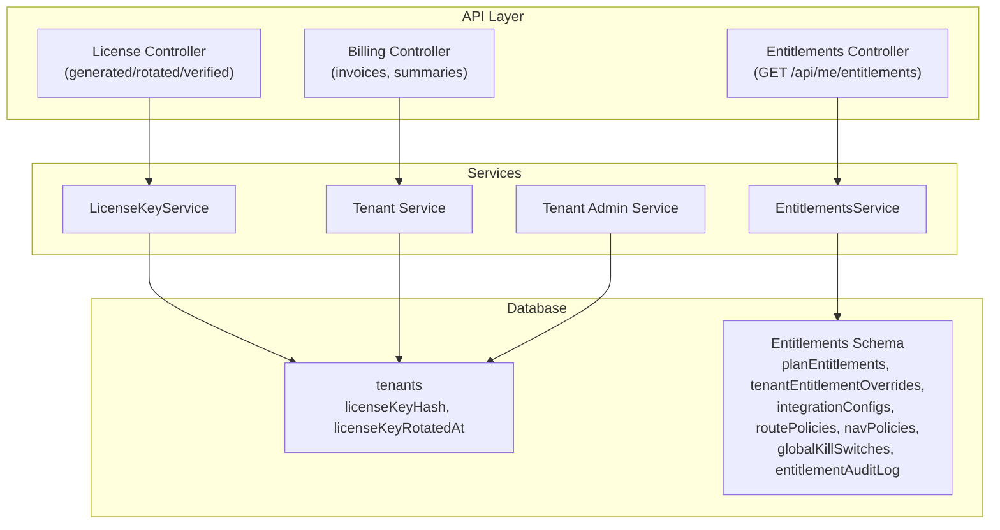
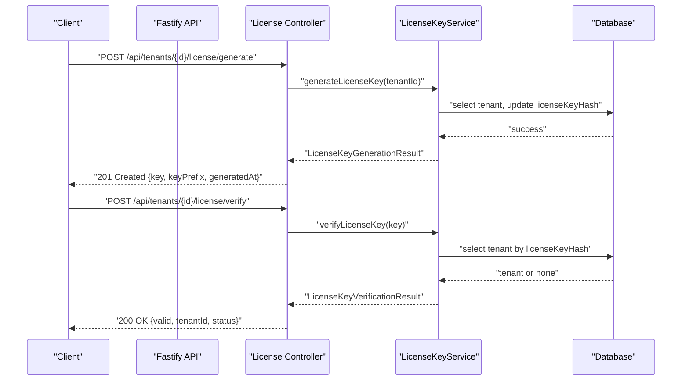
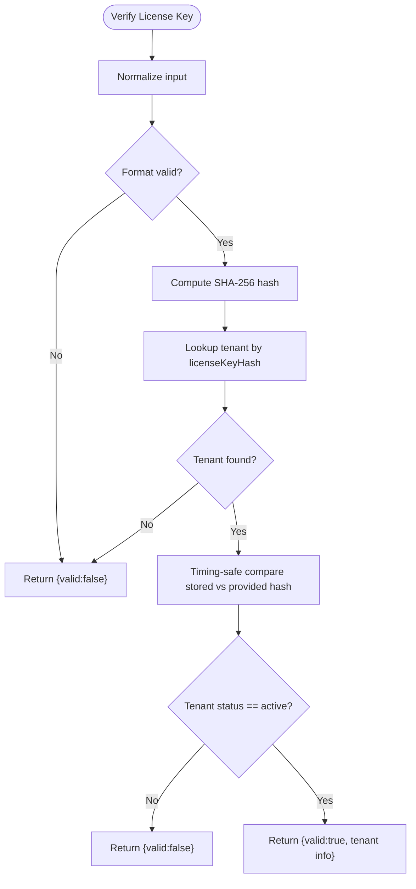
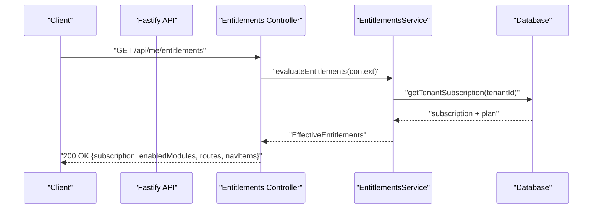
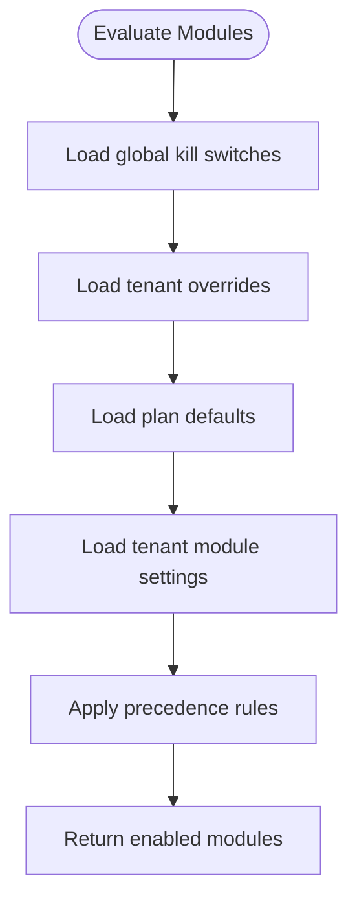
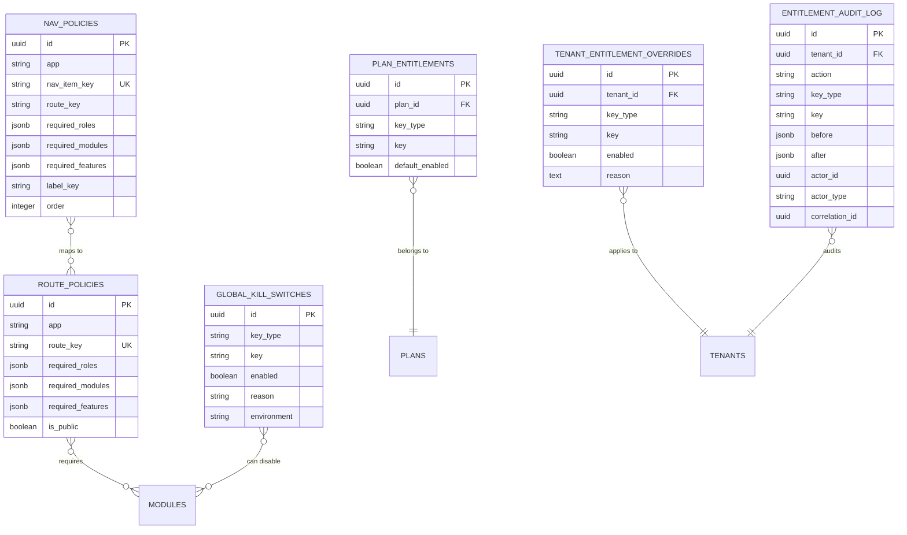
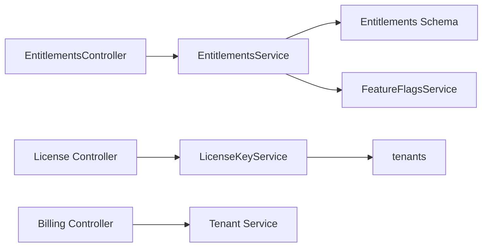

# License & Subscription Management

<cite>
**Referenced Files in This Document**
- [license.service.ts](file://apps/api/src/modules/license/license.service.ts)
- [entitlements.service.ts](file://apps/api/src/modules/entitlements/entitlements.service.ts)
- [entitlements.controller.ts](file://apps/api/src/modules/entitlements/entitlements.controller.ts)
- [billing.controller.ts](file://apps/api/src/modules/billing/billing.controller.ts)
- [entitlements.ts](file://apps/api/src/database/schema/entitlements.ts)
- [entitlements.ts](file://packages/database-schema/src/saas/entitlements.ts)
- [schema-index.ts](file://apps/api/src/database/schema/index.ts)
- [plan-entitlements.json](file://packages/database-schema/seeds/plan-entitlements.json)
- [tenant.service.ts](file://apps/api/src/modules/tenant/tenant.service.ts)
- [tenant.controller.ts](file://apps/api/src/modules/tenant/tenant.controller.ts)
- [tenant-admin.controller.ts](file://apps/api/src/modules/tenant-admin/tenant-admin.controller.ts)
- [tenant-admin.service.ts](file://apps/api/src/modules/tenant-admin/tenant-admin.service.ts)
- [tenant.schema.ts](file://apps/api/schemas/tenant.schema.ts)
- [tenant.ts](file://packages/database-schema/src/core/tenants.ts)
- [license-key.test.ts](file://tests/unit/saas/license-key.test.ts)
- [vipps-payment.test.ts](file://apps/api/src/__tests__/integration/vipps-payment.test.ts)
- [use-billing.ts](file://packages/client-sdk/src/hooks/use-billing.ts)
- [billing.service.ts](file://packages/client-sdk/src/services/billing.service.ts)
</cite>

## Table of Contents
1. [Introduction](#introduction)
2. [Project Structure](#project-structure)
3. [Core Components](#core-components)
4. [Architecture Overview](#architecture-overview)
5. [Detailed Component Analysis](#detailed-component-analysis)
6. [Dependency Analysis](#dependency-analysis)
7. [Performance Considerations](#performance-considerations)
8. [Troubleshooting Guide](#troubleshooting-guide)
9. [Conclusion](#conclusion)
10. [Appendices](#appendices)

## Introduction
This document explains the license management and subscription integration systems implemented in the monorepo. It covers license key generation, validation, rotation, and revocation; subscription lifecycle management; entitlement evaluation and enforcement; plan-based access control; billing integration; and practical guidance for offline validation, activation limits, and compliance monitoring. It also documents the API endpoints for license operations, subscription management, and entitlement queries, and provides implementation examples and troubleshooting guidance.

## Project Structure
The license and subscription systems span several modules:
- License management: server-side generation, hashing, verification, and revocation
- Entitlements: unified evaluation engine for modules, features, integrations, routes, and navigation
- Billing: user and organization billing summaries and invoice operations
- Tenant and admin services: tenant lifecycle and administrative controls
- Database schema: canonical entitlements schema and seeding for plan entitlements

**Diagram sources**
- [license.service.ts](file://apps/api/src/modules/license/license.service.ts#L52-L384)
- [entitlements.service.ts](file://apps/api/src/modules/entitlements/entitlements.service.ts#L41-L579)
- [billing.controller.ts](file://apps/api/src/modules/billing/billing.controller.ts#L104-L330)
- [schema-index.ts](file://apps/api/src/database/schema/index.ts#L68-L148)
- [entitlements.ts](file://packages/database-schema/src/saas/entitlements.ts#L14-L154)

**Section sources**
- [license.service.ts](file://apps/api/src/modules/license/license.service.ts#L1-L400)
- [entitlements.service.ts](file://apps/api/src/modules/entitlements/entitlements.service.ts#L1-L579)
- [billing.controller.ts](file://apps/api/src/modules/billing/billing.controller.ts#L1-L330)
- [schema-index.ts](file://apps/api/src/database/schema/index.ts#L1-L170)
- [entitlements.ts](file://packages/database-schema/src/saas/entitlements.ts#L1-L154)

## Core Components
- LicenseKeyService: generates, rotates, verifies, and revokes license keys; stores only hashed keys; logs actions via audit service
- EntitlementsService: evaluates effective entitlements for modules, features, integrations, routes, and navigation; applies precedence rules and caches results
- EntitlementsController: exposes GET /api/me/entitlements and GET /api/nav/:app with ETag caching
- BillingController: provides billing summaries and invoice operations for users and organizations
- Tenant/Tenant Admin Services: manage tenant lifecycle and administrative controls
- Database schema: canonical entitlements schema and plan entitlements seeding

**Section sources**
- [license.service.ts](file://apps/api/src/modules/license/license.service.ts#L52-L384)
- [entitlements.service.ts](file://apps/api/src/modules/entitlements/entitlements.service.ts#L41-L119)
- [entitlements.controller.ts](file://apps/api/src/modules/entitlements/entitlements.controller.ts#L10-L143)
- [billing.controller.ts](file://apps/api/src/modules/billing/billing.controller.ts#L104-L330)
- [entitlements.ts](file://packages/database-schema/src/saas/entitlements.ts#L14-L154)

## Architecture Overview
The system integrates license management with entitlement evaluation and billing:
- License keys are stored as SHA-256 hashes in the tenants table
- EntitlementsService evaluates effective permissions using plan defaults, tenant overrides, and global kill switches
- Controllers expose endpoints for entitlements and billing; services encapsulate business logic
- Database schema defines canonical tables for entitlements and seeding for plan entitlements

**Diagram sources**
- [license.service.ts](file://apps/api/src/modules/license/license.service.ts#L102-L160)
- [license.service.ts](file://apps/api/src/modules/license/license.service.ts#L233-L292)

## Detailed Component Analysis

### License Management
- Key generation: creates a formatted key (prefix + four groups of four characters) and stores only the SHA-256 hash
- Rotation: invalidates the previous key and issues a new one; records previous rotation metadata
- Verification: validates format, computes hash, compares timing-safely, checks tenant status
- Revocation: clears the stored hash; logs critical action
- Metadata retrieval: exposes whether a tenant has a key and last rotation date without exposing sensitive data

**Diagram sources**
- [license.service.ts](file://apps/api/src/modules/license/license.service.ts#L233-L292)

**Section sources**
- [license.service.ts](file://apps/api/src/modules/license/license.service.ts#L52-L384)
- [license-key.test.ts](file://tests/unit/saas/license-key.test.ts#L1-L200)

### Subscription Lifecycle and Renewal
- Subscription and plan data are integrated into entitlement evaluation; the entitlements service fetches the current subscription and plan for a tenant
- Billing endpoints provide summaries and invoice operations for users and organizations; payment integrations (e.g., Vipps) are represented in entitlements and tests
- Renewal workflows are not explicitly implemented in the examined files; however, the presence of subscription and plan tables enables future extension

**Diagram sources**
- [entitlements.controller.ts](file://apps/api/src/modules/entitlements/entitlements.controller.ts#L21-L70)
- [entitlements.service.ts](file://apps/api/src/modules/entitlements/entitlements.service.ts#L504-L518)

**Section sources**
- [entitlements.service.ts](file://apps/api/src/modules/entitlements/entitlements.service.ts#L74-L119)
- [billing.controller.ts](file://apps/api/src/modules/billing/billing.controller.ts#L104-L330)
- [vipps-payment.test.ts](file://apps/api/src/__tests__/integration/vipps-payment.test.ts#L1-L200)

### Entitlement Enforcement and Plan-Based Access Control
- Precedence rules: global kill switches → tenant overrides → plan defaults → module defaults
- Evaluations include modules, features (via feature flags service), integrations, routes, and navigation items
- Caching: results are cached per tenant/session/environment with ETag support
- Audit logging: entitlement changes are logged and cache invalidated

**Diagram sources**
- [entitlements.service.ts](file://apps/api/src/modules/entitlements/entitlements.service.ts#L125-L231)

**Section sources**
- [entitlements.service.ts](file://apps/api/src/modules/entitlements/entitlements.service.ts#L56-L119)
- [entitlements.controller.ts](file://apps/api/src/modules/entitlements/entitlements.controller.ts#L17-L70)

### Database Schema and Seeding
- Canonical entitlements schema defines plan entitlements, tenant overrides, integration configurations, route and navigation policies, global kill switches, and audit logs
- Plan entitlements seeding maps plan names to modules, features, and integrations with default enabled flags

**Diagram sources**
- [entitlements.ts](file://packages/database-schema/src/saas/entitlements.ts#L14-L154)
- [schema-index.ts](file://apps/api/src/database/schema/index.ts#L68-L148)

**Section sources**
- [entitlements.ts](file://packages/database-schema/src/saas/entitlements.ts#L1-L154)
- [plan-entitlements.json](file://packages/database-schema/seeds/plan-entitlements.json#L1-L213)

### API Endpoints for License Operations, Subscription Management, and Entitlement Queries
- License operations (example paths):
  - POST /api/tenants/{id}/license/generate
  - POST /api/tenants/{id}/license/rotate
  - POST /api/tenants/{id}/license/verify
  - DELETE /api/tenants/{id}/license/revoke
- Subscription and billing:
  - GET /api/me/billing/summary
  - GET /api/me/invoices
  - GET /api/me/invoices/{id}
  - GET /api/me/invoices/{id}/download
  - GET /api/me/invoices/{id}/download-url
  - GET /api/orgs/{orgId}/billing/summary
  - GET /api/orgs/{orgId}/invoices
  - GET /api/orgs/{orgId}/invoices/{id}
  - GET /api/orgs/{orgId}/invoices/{id}/download
- Entitlements:
  - GET /api/me/entitlements (with ETag caching)
  - GET /api/nav/{app}

Note: Specific route handlers and bindings are registered in controllers and exported route registration functions.

**Section sources**
- [license.service.ts](file://apps/api/src/modules/license/license.service.ts#L102-L341)
- [billing.controller.ts](file://apps/api/src/modules/billing/billing.controller.ts#L104-L330)
- [entitlements.controller.ts](file://apps/api/src/modules/entitlements/entitlements.controller.ts#L124-L142)

### Implementation Examples for Licensing Models
- Time-based license model: combine license key verification with subscription status to gate features; use entitlement evaluation to enforce plan-based access
- Seat-based license model: enforce tenant membership and roles alongside license verification; use route and navigation policies to restrict access
- Feature flag gating: use entitlements evaluation to enable/disable features per plan; apply kill switches for emergency overrides
- Payment-integrated license model: link license issuance to successful payment events; store payment references and subscription status for entitlement evaluation

[No sources needed since this section provides conceptual examples]

### Offline Validation and Compliance Monitoring
- Offline validation: clients can locally compute SHA-256 of a license key and compare against stored hashes; server-side verification remains authoritative
- Compliance monitoring: leverage entitlement audit logs and global kill switches to track and enforce policy changes; monitor integration statuses for compliance

[No sources needed since this section provides general guidance]

## Dependency Analysis
- LicenseKeyService depends on the database schema for tenants and audit logging
- EntitlementsService depends on entitlements schema tables and feature flags service; caches results and invalidates on changes
- Controllers depend on services and Fastify request/response handling
- Database schema re-exports from the shared package ensure a single source of truth

**Diagram sources**
- [license.service.ts](file://apps/api/src/modules/license/license.service.ts#L52-L57)
- [entitlements.service.ts](file://apps/api/src/modules/entitlements/entitlements.service.ts#L41-L54)
- [entitlements.ts](file://packages/database-schema/src/saas/entitlements.ts#L14-L154)

**Section sources**
- [license.service.ts](file://apps/api/src/modules/license/license.service.ts#L52-L57)
- [entitlements.service.ts](file://apps/api/src/modules/entitlements/entitlements.service.ts#L12-L28)
- [schema-index.ts](file://apps/api/src/database/schema/index.ts#L68-L148)

## Performance Considerations
- Caching: entitlements evaluation caches results for 5 minutes and uses ETag headers to reduce load
- Asynchronous evaluation: entitlements evaluation runs multiple sub-evaluations concurrently
- Hashing and timing-safe comparisons: SHA-256 hashing and constant-time comparison minimize risk and overhead
- Indexing: entitlements schema includes indexes on frequently queried columns (plan+key, tenant+key, status)

[No sources needed since this section provides general guidance]

## Troubleshooting Guide
- License verification fails:
  - Ensure the key matches the expected format and is not expired or revoked
  - Confirm the tenant status is active
  - Check audit logs for rotation or revocation events
- Entitlements not updating:
  - Clear cache or wait for TTL; entitlement changes invalidate cache
  - Verify plan entitlements seeding and tenant overrides
- Billing endpoints return errors:
  - Confirm authentication and authorization headers
  - Validate invoice existence and status

**Section sources**
- [license.service.ts](file://apps/api/src/modules/license/license.service.ts#L233-L292)
- [entitlements.service.ts](file://apps/api/src/modules/entitlements/entitlements.service.ts#L542-L577)
- [entitlements.controller.ts](file://apps/api/src/modules/entitlements/entitlements.controller.ts#L21-L70)
- [billing.controller.ts](file://apps/api/src/modules/billing/billing.controller.ts#L110-L123)

## Conclusion
The system provides robust license management with secure key handling and comprehensive entitlement evaluation. Subscription and billing capabilities are present and can be extended to support renewal and advanced licensing models. The canonical entitlements schema and seeding enable plan-based access control, while controllers expose efficient, cache-aware endpoints for clients.

[No sources needed since this section summarizes without analyzing specific files]

## Appendices

### Appendix A: Tenant and Admin Services
- Tenant service and controller manage tenant lifecycle and data
- Tenant admin controller and service provide administrative controls for tenants

**Section sources**
- [tenant.service.ts](file://apps/api/src/modules/tenant/tenant.service.ts#L1-L200)
- [tenant.controller.ts](file://apps/api/src/modules/tenant/tenant.controller.ts#L1-L200)
- [tenant-admin.controller.ts](file://apps/api/src/modules/tenant-admin/tenant-admin.controller.ts#L1-L200)
- [tenant-admin.service.ts](file://apps/api/src/modules/tenant-admin/tenant-admin.service.ts#L1-L200)

### Appendix B: Client SDK Integration
- Billing hooks and services for client SDKs support invoice and billing summary queries

**Section sources**
- [use-billing.ts](file://packages/client-sdk/src/hooks/use-billing.ts#L1-L200)
- [billing.service.ts](file://packages/client-sdk/src/services/billing.service.ts#L1-L200)