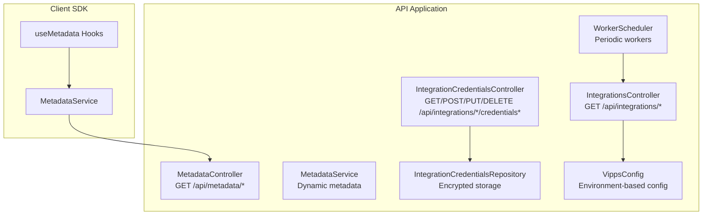
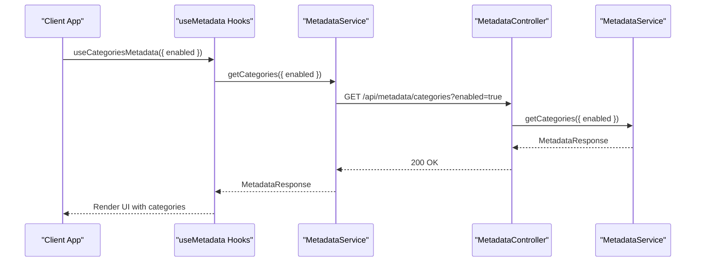
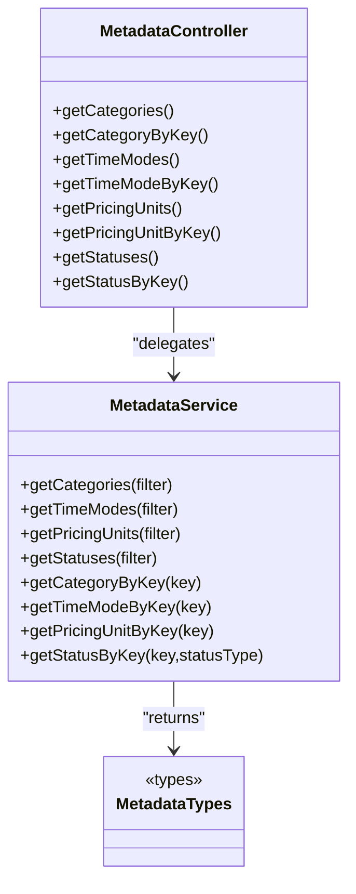
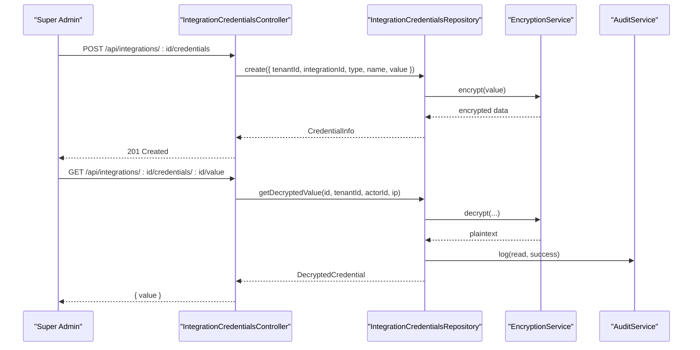
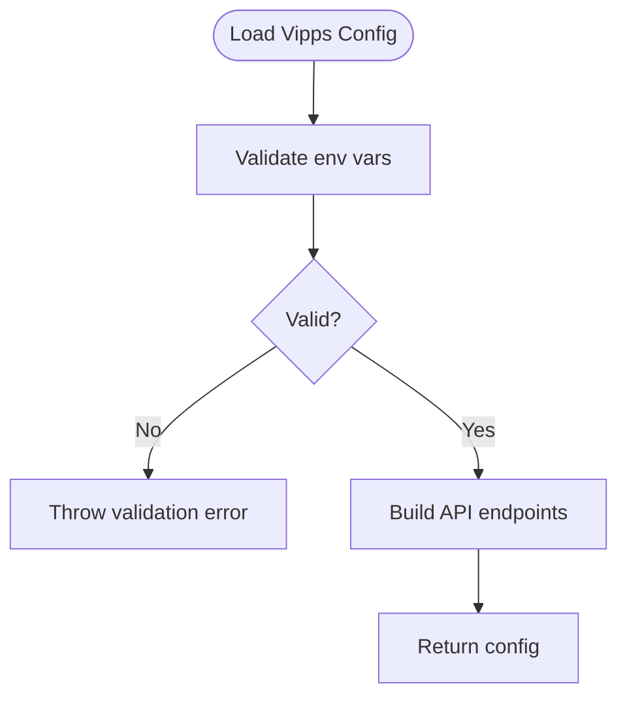
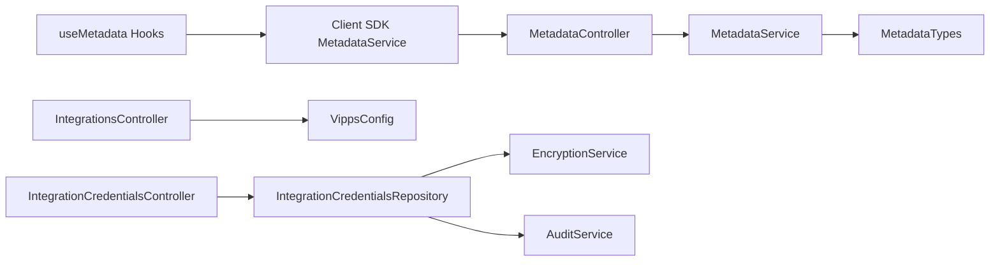

# Metadata & Data Synchronization

<cite>
**Referenced Files in This Document**
- [metadata.controller.ts](file://apps/api/src/modules/metadata/metadata.controller.ts)
- [metadata.service.ts](file://apps/api/src/modules/metadata/metadata.service.ts)
- [metadata.types.ts](file://apps/api/src/modules/metadata/metadata.types.ts)
- [category-metadata.ts](file://apps/api/src/modules/rental-objects/category-metadata.ts)
- [metadata.service.ts](file://packages/client-sdk/src/services/metadata.service.ts)
- [use-metadata.ts](file://packages/client-sdk/src/hooks/use-metadata.ts)
- [integrations.controller.ts](file://apps/api/src/modules/integrations/integrations.controller.ts)
- [integration-credentials.controller.ts](file://apps/api/src/modules/integrations/integration-credentials.controller.ts)
- [integration-credentials.repository.ts](file://apps/api/src/modules/integrations/integration-credentials.repository.ts)
- [vipps.config.ts](file://apps/api/src/config/vipps.config.ts)
- [scheduler.ts](file://apps/api/src/workers/scheduler.ts)
- [rate-limit.middleware.ts](file://apps/api/src/core/middleware/rate-limit.middleware.ts)
- [health.ts](file://apps/api/src/monitoring/health.ts)
- [monitoring.controller.ts](file://apps/api/src/monitoring/monitoring.controller.ts)
- [openapi.yaml](file://apps/api/docs/openapi.yaml)
- [requirements.json](file://apps/api/docs/requirements.json)
- [traceability.json](file://apps/api/docs/traceability.json)
</cite>

## Table of Contents
1. [Introduction](#introduction)
2. [Project Structure](#project-structure)
3. [Core Components](#core-components)
4. [Architecture Overview](#architecture-overview)
5. [Detailed Component Analysis](#detailed-component-analysis)
6. [Dependency Analysis](#dependency-analysis)
7. [Performance Considerations](#performance-considerations)
8. [Troubleshooting Guide](#troubleshooting-guide)
9. [Conclusion](#conclusion)
10. [Appendices](#appendices)

## Introduction
This document describes the metadata management and external data synchronization systems in the monorepo. It covers dynamic metadata schemas, client-side consumption via SDK hooks, integration credential management, API authentication, and validation processes. It also documents synchronization strategies, bidirectional patterns, conflict resolution, data consistency mechanisms, enrichment workflows, external API connectors, transformation pipelines, configuration management for multiple external systems, rate limiting, error recovery, monitoring, and troubleshooting.

## Project Structure
The metadata and integration subsystems are implemented in the API application and consumed by the client SDK. The structure emphasizes separation of concerns:
- Metadata domain: controller, service, and shared types
- Client SDK: typed services and React Query hooks
- Integrations: controllers for external providers, credentials management, and configuration
- Workers: background scheduling for maintenance tasks
- Monitoring: health checks and observability endpoints

**Diagram sources**
- [metadata.controller.ts](file://apps/api/src/modules/metadata/metadata.controller.ts#L1-L214)
- [metadata.service.ts](file://apps/api/src/modules/metadata/metadata.service.ts#L1-L364)
- [integrations.controller.ts](file://apps/api/src/modules/integrations/integrations.controller.ts#L1-L563)
- [integration-credentials.controller.ts](file://apps/api/src/modules/integrations/integration-credentials.controller.ts#L1-L448)
- [integration-credentials.repository.ts](file://apps/api/src/modules/integrations/integration-credentials.repository.ts#L1-L467)
- [vipps.config.ts](file://apps/api/src/config/vipps.config.ts#L1-L257)
- [scheduler.ts](file://apps/api/src/workers/scheduler.ts#L1-L117)
- [metadata.service.ts](file://packages/client-sdk/src/services/metadata.service.ts#L1-L236)
- [use-metadata.ts](file://packages/client-sdk/src/hooks/use-metadata.ts#L1-L274)

**Section sources**
- [metadata.controller.ts](file://apps/api/src/modules/metadata/metadata.controller.ts#L1-L214)
- [metadata.service.ts](file://apps/api/src/modules/metadata/metadata.service.ts#L1-L364)
- [integrations.controller.ts](file://apps/api/src/modules/integrations/integrations.controller.ts#L1-L563)
- [integration-credentials.controller.ts](file://apps/api/src/modules/integrations/integration-credentials.controller.ts#L1-L448)
- [integration-credentials.repository.ts](file://apps/api/src/modules/integrations/integration-credentials.repository.ts#L1-L467)
- [vipps.config.ts](file://apps/api/src/config/vipps.config.ts#L1-L257)
- [scheduler.ts](file://apps/api/src/workers/scheduler.ts#L1-L117)
- [metadata.service.ts](file://packages/client-sdk/src/services/metadata.service.ts#L1-L236)
- [use-metadata.ts](file://packages/client-sdk/src/hooks/use-metadata.ts#L1-L274)

## Core Components
- Metadata domain: exposes endpoints for categories, time modes, pricing units, and statuses with filtering and typed responses.
- Client SDK: provides typed services and React Query hooks for consuming metadata with caching and refetching.
- Integrations: orchestrates external provider connections (RCO, Visma, BRREG, Vipps, Calendar) with mock implementations and Vipps configuration.
- Credentials management: secure storage and rotation of integration credentials with encryption and audit logging.
- Configuration: environment-driven Vipps configuration with validation and endpoint mapping.
- Workers: scheduled background tasks for DSAR processing and report generation.

**Section sources**
- [metadata.controller.ts](file://apps/api/src/modules/metadata/metadata.controller.ts#L1-L214)
- [metadata.service.ts](file://apps/api/src/modules/metadata/metadata.service.ts#L1-L364)
- [metadata.types.ts](file://apps/api/src/modules/metadata/metadata.types.ts#L1-L76)
- [category-metadata.ts](file://apps/api/src/modules/rental-objects/category-metadata.ts#L1-L77)
- [metadata.service.ts](file://packages/client-sdk/src/services/metadata.service.ts#L1-L236)
- [use-metadata.ts](file://packages/client-sdk/src/hooks/use-metadata.ts#L1-L274)
- [integrations.controller.ts](file://apps/api/src/modules/integrations/integrations.controller.ts#L1-L563)
- [integration-credentials.controller.ts](file://apps/api/src/modules/integrations/integration-credentials.controller.ts#L1-L448)
- [integration-credentials.repository.ts](file://apps/api/src/modules/integrations/integration-credentials.repository.ts#L1-L467)
- [vipps.config.ts](file://apps/api/src/config/vipps.config.ts#L1-L257)
- [scheduler.ts](file://apps/api/src/workers/scheduler.ts#L1-L117)

## Architecture Overview
The system follows a layered architecture:
- Presentation: Fastify routes and controllers
- Domain: Services implementing business logic
- Persistence: Drizzle ORM-backed repositories for credentials
- Configuration: Environment-based providers and endpoints
- Observability: Health checks, monitoring, and audit logging

**Diagram sources**
- [use-metadata.ts](file://packages/client-sdk/src/hooks/use-metadata.ts#L67-L76)
- [metadata.service.ts](file://packages/client-sdk/src/services/metadata.service.ts#L101-L116)
- [metadata.controller.ts](file://apps/api/src/modules/metadata/metadata.controller.ts#L47-L63)
- [metadata.service.ts](file://apps/api/src/modules/metadata/metadata.service.ts#L28-L110)

**Section sources**
- [metadata.controller.ts](file://apps/api/src/modules/metadata/metadata.controller.ts#L1-L214)
- [metadata.service.ts](file://apps/api/src/modules/metadata/metadata.service.ts#L1-L364)
- [metadata.service.ts](file://packages/client-sdk/src/services/metadata.service.ts#L1-L236)
- [use-metadata.ts](file://packages/client-sdk/src/hooks/use-metadata.ts#L1-L274)

## Detailed Component Analysis

### Metadata Management
- Endpoint coverage: categories, time modes, pricing units, statuses with optional filters (enabled, parentKey, statusType).
- Filtering: server-side filtering reduces payload size and client-side computation.
- Response envelope: includes items, totalCount, lastUpdated, and version for cache invalidation.
- Client SDK: typed interfaces and convenience methods for common queries; React Query hooks provide caching and refetching.

**Diagram sources**
- [metadata.controller.ts](file://apps/api/src/modules/metadata/metadata.controller.ts#L35-L214)
- [metadata.service.ts](file://apps/api/src/modules/metadata/metadata.service.ts#L22-L364)
- [metadata.types.ts](file://apps/api/src/modules/metadata/metadata.types.ts#L10-L76)

**Section sources**
- [metadata.controller.ts](file://apps/api/src/modules/metadata/metadata.controller.ts#L1-L214)
- [metadata.service.ts](file://apps/api/src/modules/metadata/metadata.service.ts#L1-L364)
- [metadata.types.ts](file://apps/api/src/modules/metadata/metadata.types.ts#L1-L76)
- [category-metadata.ts](file://apps/api/src/modules/rental-objects/category-metadata.ts#L1-L77)
- [metadata.service.ts](file://packages/client-sdk/src/services/metadata.service.ts#L1-L236)
- [use-metadata.ts](file://packages/client-sdk/src/hooks/use-metadata.ts#L1-L274)

### External Integrations and Credentials
- Integrations controller: endpoints for RCO, Visma, BRREG, NIF, Vipps, and Calendar with mock implementations and status reporting.
- Credentials controller: secure CRUD operations for integration credentials with role gating (super_admin), masking, and audit logging.
- Credentials repository: encrypted storage, decryption on demand, and audit trail for all operations.
- Vipps configuration: environment validation, endpoint mapping, and runtime checks for configuration presence.

**Diagram sources**
- [integration-credentials.controller.ts](file://apps/api/src/modules/integrations/integration-credentials.controller.ts#L107-L166)
- [integration-credentials.repository.ts](file://apps/api/src/modules/integrations/integration-credentials.repository.ts#L116-L148)
- [integration-credentials.repository.ts](file://apps/api/src/modules/integrations/integration-credentials.repository.ts#L282-L345)
- [vipps.config.ts](file://apps/api/src/config/vipps.config.ts#L111-L144)

**Section sources**
- [integrations.controller.ts](file://apps/api/src/modules/integrations/integrations.controller.ts#L1-L563)
- [integration-credentials.controller.ts](file://apps/api/src/modules/integrations/integration-credentials.controller.ts#L1-L448)
- [integration-credentials.repository.ts](file://apps/api/src/modules/integrations/integration-credentials.repository.ts#L1-L467)
- [vipps.config.ts](file://apps/api/src/config/vipps.config.ts#L1-L257)

### API Authentication and Validation
- Vipps configuration loading validates environment variables and constructs endpoints; includes fallback callback URLs and environment-specific base URLs.
- Integration endpoints guard against unconfigured providers and return appropriate HTTP status codes with structured error payloads.
- Rate limiting middleware provides request throttling to protect downstream systems.

**Diagram sources**
- [vipps.config.ts](file://apps/api/src/config/vipps.config.ts#L77-L144)

**Section sources**
- [vipps.config.ts](file://apps/api/src/config/vipps.config.ts#L1-L257)
- [integrations.controller.ts](file://apps/api/src/modules/integrations/integrations.controller.ts#L284-L355)
- [rate-limit.middleware.ts](file://apps/api/src/core/middleware/rate-limit.middleware.ts#L1-L200)

### Synchronization Strategies and Data Consistency
- Current state: integrations controller endpoints are mock implementations; no real-time or bidirectional sync is implemented.
- Recommended patterns:
  - Event-driven ingestion: queue events from external systems and apply idempotent transformations.
  - Conflict resolution: last-write-wins with metadata versioning or merge strategies with explicit transitions.
  - Data consistency: transactional writes, optimistic concurrency with ETags, and compensating actions for partial failures.
  - Health monitoring: periodic checks and alerting for sync gaps and latency.

[No sources needed since this section provides general guidance]

### Metadata Enrichment Workflows
- Dynamic metadata enables server-driven customization of categories, time modes, pricing units, and statuses.
- Client SDK caches metadata with long TTLs; version field supports cache invalidation.
- Enrichment can include tenant-specific overrides, multi-language labels, and derived computed fields.

**Section sources**
- [metadata.controller.ts](file://apps/api/src/modules/metadata/metadata.controller.ts#L1-L214)
- [metadata.service.ts](file://apps/api/src/modules/metadata/metadata.service.ts#L1-L364)
- [metadata.service.ts](file://packages/client-sdk/src/services/metadata.service.ts#L1-L236)
- [use-metadata.ts](file://packages/client-sdk/src/hooks/use-metadata.ts#L1-L274)

### External API Connectors and Transformation Pipelines
- Connector pattern: each provider has a dedicated controller with status and action endpoints.
- Transformation pipeline: normalize external payloads to internal metadata/status models; validate and enrich before persistence.
- Error handling: structured errors with HTTP status codes and audit logs for failed operations.

**Section sources**
- [integrations.controller.ts](file://apps/api/src/modules/integrations/integrations.controller.ts#L1-L563)

### Configuration Management for Multiple External Systems
- Environment-based configuration with validation and caching.
- Provider-specific endpoints and credentials stored securely with rotation and audit trails.
- Role-based access ensures only authorized administrators can manage credentials.

**Section sources**
- [vipps.config.ts](file://apps/api/src/config/vipps.config.ts#L1-L257)
- [integration-credentials.controller.ts](file://apps/api/src/modules/integrations/integration-credentials.controller.ts#L1-L448)
- [integration-credentials.repository.ts](file://apps/api/src/modules/integrations/integration-credentials.repository.ts#L1-L467)

### Rate Limiting and Error Recovery
- Rate limiting middleware protects endpoints from abuse and downstream provider throttling.
- Error recovery: structured error responses, audit logging, and retry strategies for transient failures.

**Section sources**
- [rate-limit.middleware.ts](file://apps/api/src/core/middleware/rate-limit.middleware.ts#L1-L200)
- [integrations.controller.ts](file://apps/api/src/modules/integrations/integrations.controller.ts#L334-L355)
- [integration-credentials.repository.ts](file://apps/api/src/modules/integrations/integration-credentials.repository.ts#L332-L345)

### Monitoring and Health
- Health endpoints and monitoring controllers provide system status and metrics.
- Worker scheduler runs periodic maintenance tasks and logs health status.

**Section sources**
- [health.ts](file://apps/api/src/monitoring/health.ts#L1-L200)
- [monitoring.controller.ts](file://apps/api/src/monitoring/monitoring.controller.ts#L1-L200)
- [scheduler.ts](file://apps/api/src/workers/scheduler.ts#L1-L117)

## Dependency Analysis
The metadata and integration components depend on shared types, encryption services, and configuration modules. Controllers delegate to services, which encapsulate business logic and persistence.

**Diagram sources**
- [metadata.controller.ts](file://apps/api/src/modules/metadata/metadata.controller.ts#L20-L41)
- [metadata.service.ts](file://apps/api/src/modules/metadata/metadata.service.ts#L13-L21)
- [metadata.types.ts](file://apps/api/src/modules/metadata/metadata.types.ts#L10-L76)
- [metadata.service.ts](file://packages/client-sdk/src/services/metadata.service.ts#L21-L22)
- [use-metadata.ts](file://packages/client-sdk/src/hooks/use-metadata.ts#L20-L22)
- [integrations.controller.ts](file://apps/api/src/modules/integrations/integrations.controller.ts#L5-L11)
- [integration-credentials.controller.ts](file://apps/api/src/modules/integrations/integration-credentials.controller.ts#L17-L22)
- [integration-credentials.repository.ts](file://apps/api/src/modules/integrations/integration-credentials.repository.ts#L10-L21)
- [vipps.config.ts](file://apps/api/src/config/vipps.config.ts#L15-L16)

**Section sources**
- [metadata.controller.ts](file://apps/api/src/modules/metadata/metadata.controller.ts#L1-L214)
- [metadata.service.ts](file://apps/api/src/modules/metadata/metadata.service.ts#L1-L364)
- [metadata.types.ts](file://apps/api/src/modules/metadata/metadata.types.ts#L1-L76)
- [metadata.service.ts](file://packages/client-sdk/src/services/metadata.service.ts#L1-L236)
- [use-metadata.ts](file://packages/client-sdk/src/hooks/use-metadata.ts#L1-L274)
- [integrations.controller.ts](file://apps/api/src/modules/integrations/integrations.controller.ts#L1-L563)
- [integration-credentials.controller.ts](file://apps/api/src/modules/integrations/integration-credentials.controller.ts#L1-L448)
- [integration-credentials.repository.ts](file://apps/api/src/modules/integrations/integration-credentials.repository.ts#L1-L467)
- [vipps.config.ts](file://apps/api/src/config/vipps.config.ts#L1-L257)

## Performance Considerations
- Client caching: React Query provides caching and garbage collection policies tailored for infrequent metadata changes.
- Server filtering: filter parameters reduce payload sizes and improve responsiveness.
- Worker scheduling: background tasks run at fixed intervals to avoid peak load.

[No sources needed since this section provides general guidance]

## Troubleshooting Guide
- Metadata not loading: verify endpoints, filters, and client-side caching; check response envelopes and version fields.
- Integration failures: inspect structured error responses, audit logs, and provider status endpoints.
- Credentials issues: confirm encryption service availability, masked values, and audit entries for read attempts.
- Vipps configuration errors: validate environment variables and use configuration health checks.

**Section sources**
- [metadata.controller.ts](file://apps/api/src/modules/metadata/metadata.controller.ts#L194-L212)
- [integrations.controller.ts](file://apps/api/src/modules/integrations/integrations.controller.ts#L334-L408)
- [integration-credentials.controller.ts](file://apps/api/src/modules/integrations/integration-credentials.controller.ts#L234-L263)
- [integration-credentials.repository.ts](file://apps/api/src/modules/integrations/integration-credentials.repository.ts#L332-L345)
- [vipps.config.ts](file://apps/api/src/config/vipps.config.ts#L111-L144)

## Conclusion
The system provides a robust foundation for dynamic metadata and integration credential management. While current integration endpoints are mock-based, the architecture supports secure, audited, and configurable external system connectivity. Extending to real-time synchronization, conflict resolution, and comprehensive monitoring will further strengthen operational reliability and data consistency.

## Appendices
- API documentation: OpenAPI specification and requirement traceability are maintained alongside the codebase.
- Requirements coverage: traceability matrices link features to requirements and verification outcomes.

**Section sources**
- [openapi.yaml](file://apps/api/docs/openapi.yaml#L1-L200)
- [requirements.json](file://apps/api/docs/requirements.json#L1-L200)
- [traceability.json](file://apps/api/docs/traceability.json#L1-L200)