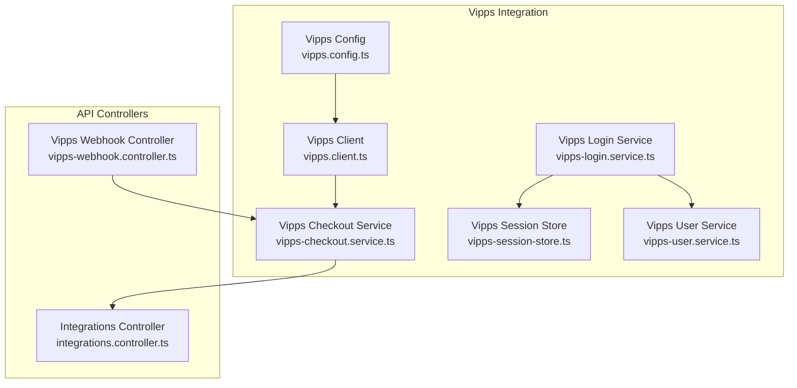
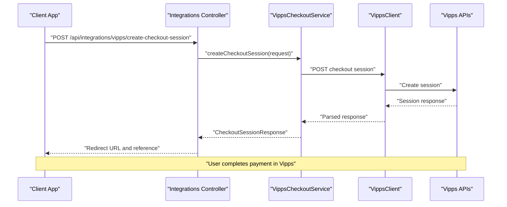
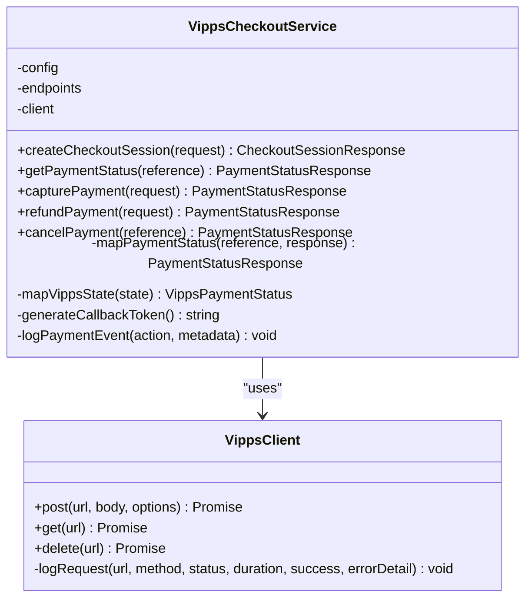
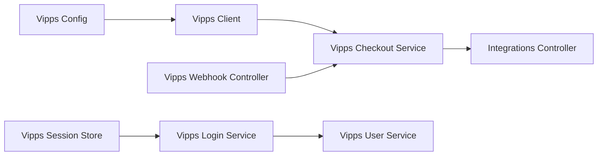
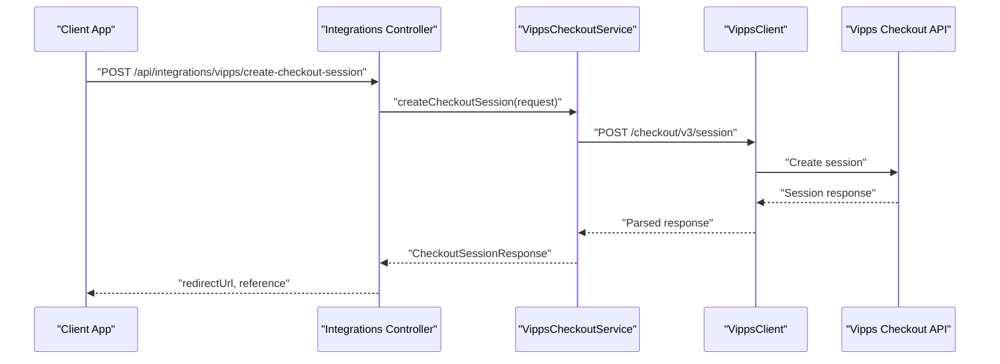
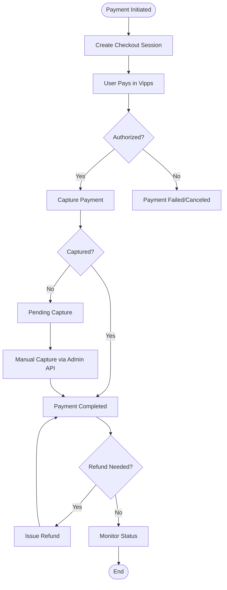

# Payment Processing Integrations

<cite>
**Referenced Files in This Document**
- [vipps-checkout.service.ts](file://apps/api/src/integrations/vipps/vipps-checkout.service.ts)
- [vipps.client.ts](file://apps/api/src/integrations/vipps/vipps.client.ts)
- [vipps.config.ts](file://apps/api/src/config/vipps.config.ts)
- [vipps-webhook.controller.ts](file://apps/api/src/modules/webhooks/vipps-webhook.controller.ts)
- [integrations.controller.ts](file://apps/api/src/modules/integrations/integrations.controller.ts)
- [vipps-session-store.ts](file://apps/api/src/modules/auth/vipps-session-store.ts)
- [vipps-login.service.ts](file://apps/api/src/integrations/vipps/vipps-login.service.ts)
- [vipps-user.service.ts](file://apps/api/src/modules/auth/vipps-user.service.ts)
- [vipps-payment.test.ts](file://apps/api/src/__tests__/integration/vipps-payment.test.ts)
- [vipps-webhook.test.ts](file://apps/api/src/__tests__/integration/vipps-webhook.test.ts)
</cite>

## Table of Contents
1. [Introduction](#introduction)
2. [Project Structure](#project-structure)
3. [Core Components](#core-components)
4. [Architecture Overview](#architecture-overview)
5. [Detailed Component Analysis](#detailed-component-analysis)
6. [Dependency Analysis](#dependency-analysis)
7. [Performance Considerations](#performance-considerations)
8. [Security and Compliance](#security-and-compliance)
9. [Configuration and Environment Variables](#configuration-and-environment-variables)
10. [Payment Lifecycle and Workflows](#payment-lifecycle-and-workflows)
11. [API Endpoints](#api-endpoints)
12. [Webhook Handling](#webhook-handling)
13. [Transaction Logging and Audit Trails](#transaction-logging-and-audit-trails)
14. [Reconciliation Processes](#reconciliation-processes)
15. [Troubleshooting Guide](#troubleshooting-guide)
16. [Conclusion](#conclusion)

## Introduction
This document provides comprehensive documentation for payment processing integrations with the Vipps payment gateway. It covers the complete payment lifecycle from initiation to completion, including checkout session creation, payment authorization, capture, refund, and status monitoring. It also explains the VippsCheckoutService implementation, API endpoints, webhook handling, security considerations, PCI compliance, error handling strategies, configuration requirements, environment variables, integration patterns, transaction logging, audit trails, and reconciliation processes.

## Project Structure
The payment integration is implemented within the API application under the integrations and modules namespaces. Key areas include:
- Vipps configuration and endpoints
- Vipps client for API communication
- Vipps checkout service for payment operations
- Webhook controller for inbound event processing
- Integration controller for admin-facing payment operations
- Authentication session store and user service for Vipps Login

**Diagram sources**
- [vipps.config.ts](file://apps/api/src/config/vipps.config.ts#L1-L257)
- [vipps.client.ts](file://apps/api/src/integrations/vipps/vipps.client.ts#L1-L309)
- [vipps-checkout.service.ts](file://apps/api/src/integrations/vipps/vipps-checkout.service.ts#L1-L431)
- [vipps-login.service.ts](file://apps/api/src/integrations/vipps/vipps-login.service.ts#L1-L504)
- [vipps-session-store.ts](file://apps/api/src/modules/auth/vipps-session-store.ts#L1-L149)
- [vipps-user.service.ts](file://apps/api/src/modules/auth/vipps-user.service.ts#L1-L349)
- [integrations.controller.ts](file://apps/api/src/modules/integrations/integrations.controller.ts#L370-L563)
- [vipps-webhook.controller.ts](file://apps/api/src/modules/webhooks/vipps-webhook.controller.ts#L1-L439)

**Section sources**
- [vipps.config.ts](file://apps/api/src/config/vipps.config.ts#L1-L257)
- [vipps.client.ts](file://apps/api/src/integrations/vipps/vipps.client.ts#L1-L309)
- [vipps-checkout.service.ts](file://apps/api/src/integrations/vipps/vipps-checkout.service.ts#L1-L431)
- [vipps-login.service.ts](file://apps/api/src/integrations/vipps/vipps-login.service.ts#L1-L504)
- [vipps-session-store.ts](file://apps/api/src/modules/auth/vipps-session-store.ts#L1-L149)
- [vipps-user.service.ts](file://apps/api/src/modules/auth/vipps-user.service.ts#L1-L349)
- [integrations.controller.ts](file://apps/api/src/modules/integrations/integrations.controller.ts#L370-L563)
- [vipps-webhook.controller.ts](file://apps/api/src/modules/webhooks/vipps-webhook.controller.ts#L1-L439)

## Core Components
- VippsCheckoutService: Manages checkout sessions, payment status retrieval, captures, refunds, and cancellations. Provides idempotent operations and audit logging.
- VippsClient: Handles OAuth2 client credentials flow, token caching, request signing, and error mapping to standardized AppError responses.
- VippsConfig: Centralized configuration loader and endpoint builder for Vipps APIs, supporting test and production environments.
- VippsWebhookController: Validates signatures, ensures idempotency, and processes payment events to update booking statuses.
- IntegrationsController: Exposes admin endpoints for payment status, capture, and refund operations.
- VippsLoginService and VippsUserService: Support Vipps Login integration for user authentication and user management.
- VippsSessionStore: Redis-backed session storage for OAuth state management.

**Section sources**
- [vipps-checkout.service.ts](file://apps/api/src/integrations/vipps/vipps-checkout.service.ts#L147-L431)
- [vipps.client.ts](file://apps/api/src/integrations/vipps/vipps.client.ts#L113-L309)
- [vipps.config.ts](file://apps/api/src/config/vipps.config.ts#L107-L221)
- [vipps-webhook.controller.ts](file://apps/api/src/modules/webhooks/vipps-webhook.controller.ts#L91-L439)
- [integrations.controller.ts](file://apps/api/src/modules/integrations/integrations.controller.ts#L370-L563)
- [vipps-login.service.ts](file://apps/api/src/integrations/vipps/vipps-login.service.ts#L224-L504)
- [vipps-user.service.ts](file://apps/api/src/modules/auth/vipps-user.service.ts#L57-L349)
- [vipps-session-store.ts](file://apps/api/src/modules/auth/vipps-session-store.ts#L71-L149)

## Architecture Overview
The Vipps integration follows a layered architecture:
- Configuration layer: Loads environment variables and builds API endpoints.
- Client layer: Manages authentication, token caching, and HTTP requests with standardized error handling.
- Service layer: Orchestrates payment operations and maps Vipps responses to internal formats.
- Controller layer: Exposes endpoints for payment operations and handles inbound webhooks.
- Persistence and audit: Uses database updates and audit logs for transaction records.

**Diagram sources**
- [integrations.controller.ts](file://apps/api/src/modules/integrations/integrations.controller.ts#L370-L409)
- [vipps-checkout.service.ts](file://apps/api/src/integrations/vipps/vipps-checkout.service.ts#L155-L217)
- [vipps.client.ts](file://apps/api/src/integrations/vipps/vipps.client.ts#L139-L182)

## Detailed Component Analysis

### VippsCheckoutService
Responsibilities:
- Create checkout sessions with idempotency
- Retrieve payment status and map to internal status codes
- Capture authorized payments (full or partial)
- Issue refunds (full or partial)
- Cancel payments before capture
- Audit logging for all operations

Key implementation patterns:
- Idempotency via idempotency keys for capture and refund requests
- Reference parsing to extract booking IDs
- State mapping from Vipps states to internal status codes
- Audit logging for all actions

**Diagram sources**
- [vipps-checkout.service.ts](file://apps/api/src/integrations/vipps/vipps-checkout.service.ts#L147-L431)
- [vipps.client.ts](file://apps/api/src/integrations/vipps/vipps.client.ts#L113-L309)

**Section sources**
- [vipps-checkout.service.ts](file://apps/api/src/integrations/vipps/vipps-checkout.service.ts#L147-L431)

### VippsClient
Responsibilities:
- OAuth2 client credentials flow with token caching
- Request signing with subscription key and merchant serial number
- Idempotency header support for POST requests
- Standardized error mapping to AppError
- Monitoring and audit logging for API requests

Key implementation patterns:
- Token cache with 60-second buffer for freshness
- RFC 7807 error mapping
- Request/response logging for monitoring

**Section sources**
- [vipps.client.ts](file://apps/api/src/integrations/vipps/vipps.client.ts#L57-L107)
- [vipps.client.ts](file://apps/api/src/integrations/vipps/vipps.client.ts#L139-L283)

### Vipps Configuration
Responsibilities:
- Validate and load environment variables
- Build environment-specific endpoints
- Provide configuration for OIDC and Checkout APIs
- Support test and production environments

Key implementation patterns:
- Zod schema validation for environment variables
- Default callback URLs based on environment
- Endpoint builders for all Vipps API surfaces

**Section sources**
- [vipps.config.ts](file://apps/api/src/config/vipps.config.ts#L107-L144)
- [vipps.config.ts](file://apps/api/src/config/vipps.config.ts#L149-L183)

### Vipps Webhook Controller
Responsibilities:
- Validate webhook signatures using HMAC-SHA256
- Ensure idempotency to prevent duplicate processing
- Process payment events to update booking statuses
- Audit logging for webhook reception and processing

Key implementation patterns:
- Signature validation against webhook secret
- In-memory idempotency store with TTL
- Event type routing to appropriate handlers

**Section sources**
- [vipps-webhook.controller.ts](file://apps/api/src/modules/webhooks/vipps-webhook.controller.ts#L108-L219)
- [vipps-webhook.controller.ts](file://apps/api/src/modules/webhooks/vipps-webhook.controller.ts#L224-L413)

### Integrations Controller
Responsibilities:
- Expose admin endpoints for payment status, capture, and refund
- Validate request parameters and configuration
- Return standardized error responses
- Audit logging for payment operations

Key implementation patterns:
- Route handlers for payment operations
- Error handling with specific error codes
- Integration with VippsCheckoutService

**Section sources**
- [integrations.controller.ts](file://apps/api/src/modules/integrations/integrations.controller.ts#L374-L409)
- [integrations.controller.ts](file://apps/api/src/modules/integrations/integrations.controller.ts#L414-L461)
- [integrations.controller.ts](file://apps/api/src/modules/integrations/integrations.controller.ts#L466-L527)

### Vipps Login Service and User Service
Responsibilities:
- OIDC discovery, authorization URL generation, token exchange
- ID token validation and user info retrieval
- User creation, linking, and management for Vipps Login

Key implementation patterns:
- OIDC configuration and JWKS caching
- Stateless authorization flow with session store
- User mapping and metadata management

**Section sources**
- [vipps-login.service.ts](file://apps/api/src/integrations/vipps/vipps-login.service.ts#L245-L283)
- [vipps-login.service.ts](file://apps/api/src/integrations/vipps/vipps-login.service.ts#L288-L337)
- [vipps-login.service.ts](file://apps/api/src/integrations/vipps/vipps-login.service.ts#L343-L411)
- [vipps-user.service.ts](file://apps/api/src/modules/auth/vipps-user.service.ts#L72-L137)

## Dependency Analysis
The Vipps integration exhibits low coupling and high cohesion:
- VippsCheckoutService depends on VippsClient and configuration
- VippsClient depends on configuration and uses token caching
- Webhook controller depends on configuration and audit service
- Integration controller depends on VippsCheckoutService
- Login service and user service are separate concerns

**Diagram sources**
- [vipps.config.ts](file://apps/api/src/config/vipps.config.ts#L107-L221)
- [vipps.client.ts](file://apps/api/src/integrations/vipps/vipps.client.ts#L113-L135)
- [vipps-checkout.service.ts](file://apps/api/src/integrations/vipps/vipps-checkout.service.ts#L147-L151)
- [integrations.controller.ts](file://apps/api/src/modules/integrations/integrations.controller.ts#L374-L376)
- [vipps-webhook.controller.ts](file://apps/api/src/modules/webhooks/vipps-webhook.controller.ts#L121-L122)
- [vipps-login.service.ts](file://apps/api/src/integrations/vipps/vipps-login.service.ts#L224-L227)
- [vipps-user.service.ts](file://apps/api/src/modules/auth/vipps-user.service.ts#L57-L62)
- [vipps-session-store.ts](file://apps/api/src/modules/auth/vipps-session-store.ts#L71-L73)

**Section sources**
- [vipps-checkout.service.ts](file://apps/api/src/integrations/vipps/vipps-checkout.service.ts#L147-L151)
- [vipps.client.ts](file://apps/api/src/integrations/vipps/vipps.client.ts#L113-L135)
- [vipps-webhook.controller.ts](file://apps/api/src/modules/webhooks/vipps-webhook.controller.ts#L121-L122)
- [integrations.controller.ts](file://apps/api/src/modules/integrations/integrations.controller.ts#L374-L376)

## Performance Considerations
- Token caching: VippsClient caches access tokens with a 60-second buffer to reduce API calls.
- Idempotency: Idempotency keys prevent duplicate operations and reduce retries.
- Request logging: Built-in monitoring logs request durations and outcomes for observability.
- Session store: Redis-backed session storage with in-memory fallback for development.

[No sources needed since this section provides general guidance]

## Security and Compliance
- PCI DSS: Payment instrument data is handled by Vipps; the system stores only non-sensitive identifiers and metadata.
- OAuth2: Secure state and nonce parameters for CSRF and replay protection.
- Signature validation: HMAC-SHA256 verification for webhook authenticity.
- Token management: Client credentials flow with subscription key and merchant serial number.
- Audit logging: Comprehensive audit trail for all payment operations and webhook events.
- Error handling: Standardized error responses without sensitive data exposure.

**Section sources**
- [vipps.client.ts](file://apps/api/src/integrations/vipps/vipps.client.ts#L57-L100)
- [vipps-webhook.controller.ts](file://apps/api/src/modules/webhooks/vipps-webhook.controller.ts#L138-L160)
- [vipps-login.service.ts](file://apps/api/src/integrations/vipps/vipps-login.service.ts#L231-L240)

## Configuration and Environment Variables
Required environment variables:
- VIPPS_CLIENT_ID: OAuth2 client ID
- VIPPS_CLIENT_SECRET: OAuth2 client secret
- VIPPS_SUBSCRIPTION_KEY: Ocp-Apim-Subscription-Key
- VIPPS_MSN: Merchant Serial Number
- VIPPS_ENVIRONMENT: 'test' | 'production'
- VIPPS_AUTH_CALLBACK_URL: Optional override for OAuth callback
- VIPPS_PAYMENT_CALLBACK_URL: Optional override for payment callback
- VIPPS_WEBHOOK_SECRET: Optional webhook signature verification secret
- REDIS_URL: Redis connection string for session store (optional)

Configuration behavior:
- Environment-specific base URLs for API and Login
- Default callback URLs derived from environment and APP_URL
- Validation via Zod schema with detailed error reporting

**Section sources**
- [vipps.config.ts](file://apps/api/src/config/vipps.config.ts#L77-L86)
- [vipps.config.ts](file://apps/api/src/config/vipps.config.ts#L123-L131)
- [vipps.config.ts](file://apps/api/src/config/vipps.config.ts#L107-L144)

## Payment Lifecycle and Workflows

### Checkout Session Creation

**Diagram sources**
- [integrations.controller.ts](file://apps/api/src/modules/integrations/integrations.controller.ts#L374-L409)
- [vipps-checkout.service.ts](file://apps/api/src/integrations/vipps/vipps-checkout.service.ts#L155-L217)
- [vipps.client.ts](file://apps/api/src/integrations/vipps/vipps.client.ts#L139-L182)

### Payment Authorization, Capture, Refund, and Status Monitoring

**Diagram sources**
- [vipps-checkout.service.ts](file://apps/api/src/integrations/vipps/vipps-checkout.service.ts#L222-L336)
- [integrations.controller.ts](file://apps/api/src/modules/integrations/integrations.controller.ts#L414-L527)

**Section sources**
- [vipps-checkout.service.ts](file://apps/api/src/integrations/vipps/vipps-checkout.service.ts#L222-L336)
- [integrations.controller.ts](file://apps/api/src/modules/integrations/integrations.controller.ts#L414-L527)

## API Endpoints
Admin endpoints exposed by the Integrations Controller:
- POST /api/integrations/vipps/create-checkout-session
- GET /api/integrations/vipps/status/{orderId}
- POST /api/integrations/vipps/capture
- POST /api/integrations/vipps/refund

These endpoints delegate to VippsCheckoutService for payment operations and return standardized responses with error codes and messages.

**Section sources**
- [integrations.controller.ts](file://apps/api/src/modules/integrations/integrations.controller.ts#L374-L409)
- [integrations.controller.ts](file://apps/api/src/modules/integrations/integrations.controller.ts#L414-L461)
- [integrations.controller.ts](file://apps/api/src/modules/integrations/integrations.controller.ts#L466-L527)

## Webhook Handling
Webhook endpoint:
- POST /api/webhooks/vipps

Processing steps:
- Validate Vipps configuration
- Log incoming webhook
- Validate signature (if webhook secret configured)
- Validate required fields
- Check idempotency
- Process event based on type
- Update booking status accordingly
- Log processing outcome

Supported event types:
- checkout.session.completed
- checkout.session.paymentAuthorized
- checkout.session.paymentCaptured
- checkout.session.paymentRefunded
- checkout.session.paymentCancelled
- checkout.session.paymentFailed

**Section sources**
- [vipps-webhook.controller.ts](file://apps/api/src/modules/webhooks/vipps-webhook.controller.ts#L108-L219)
- [vipps-webhook.controller.ts](file://apps/api/src/modules/webhooks/vipps-webhook.controller.ts#L224-L257)

## Transaction Logging and Audit Trails
- Payment events are logged via the audit service for checkout session creation, capture attempts, refund attempts, and cancellations.
- API requests and errors are logged for monitoring and debugging.
- Webhook reception and processing are audited with event IDs and metadata.
- User and booking updates include timestamps and payment metadata.

**Section sources**
- [vipps-checkout.service.ts](file://apps/api/src/integrations/vipps/vipps-checkout.service.ts#L191-L216)
- [vipps-checkout.service.ts](file://apps/api/src/integrations/vipps/vipps-checkout.service.ts#L263-L276)
- [vipps-checkout.service.ts](file://apps/api/src/integrations/vipps/vipps-checkout.service.ts#L300-L314)
- [vipps.client.ts](file://apps/api/src/integrations/vipps/vipps.client.ts#L215-L242)
- [vipps-webhook.controller.ts](file://apps/api/src/modules/webhooks/vipps-webhook.controller.ts#L124-L136)
- [vipps-webhook.controller.ts](file://apps/api/src/modules/webhooks/vipps-webhook.controller.ts#L198-L208)

## Reconciliation Processes
- Payment status monitoring: Use GET /api/integrations/vipps/status/{orderId} to reconcile payment state.
- Audit logs: Review audit entries for payment operations and webhook processing.
- Booking synchronization: Webhook handlers update booking statuses based on payment events.
- Manual operations: Admin endpoints enable capture and refund operations for reconciliation.

**Section sources**
- [integrations.controller.ts](file://apps/api/src/modules/integrations/integrations.controller.ts#L374-L409)
- [vipps-webhook.controller.ts](file://apps/api/src/modules/webhooks/vipps-webhook.controller.ts#L262-L328)

## Troubleshooting Guide
Common issues and resolutions:
- Configuration validation errors: Ensure all required environment variables are set and valid according to Zod schema.
- Token acquisition failures: Check client credentials, subscription key, and merchant serial number; verify network connectivity to Vipps endpoints.
- Webhook signature validation failures: Confirm webhook secret matches configuration and payload.
- Payment not found errors: Verify reference format and existence in Vipps system.
- Idempotency conflicts: Retry with a new idempotency key for capture or refund operations.
- Session store failures: Verify Redis connectivity or rely on in-memory fallback during development.

Testing resources:
- Integration tests cover checkout session creation, payment status retrieval, capture, refund, webhook signature validation, and idempotency behavior.

**Section sources**
- [vipps.config.ts](file://apps/api/src/config/vipps.config.ts#L114-L117)
- [vipps.client.ts](file://apps/api/src/integrations/vipps/vipps.client.ts#L76-L84)
- [vipps-webhook.controller.ts](file://apps/api/src/modules/webhooks/vipps-webhook.controller.ts#L138-L160)
- [vipps-payment.test.ts](file://apps/api/src/__tests__/integration/vipps-payment.test.ts#L118-L148)
- [vipps-webhook.test.ts](file://apps/api/src/__tests__/integration/vipps-webhook.test.ts#L33-L68)

## Conclusion
The Vipps payment integration provides a robust, secure, and auditable payment processing solution with comprehensive support for checkout sessions, authorization, capture, refund, and webhook-driven reconciliation. The implementation emphasizes idempotency, standardized error handling, and detailed audit logging while maintaining low coupling and high cohesion across components.