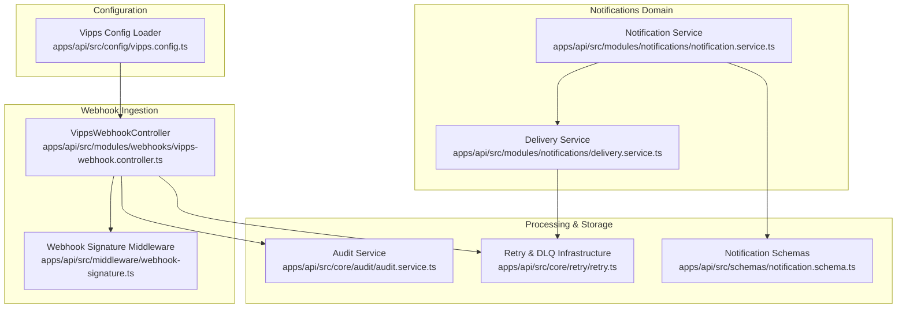
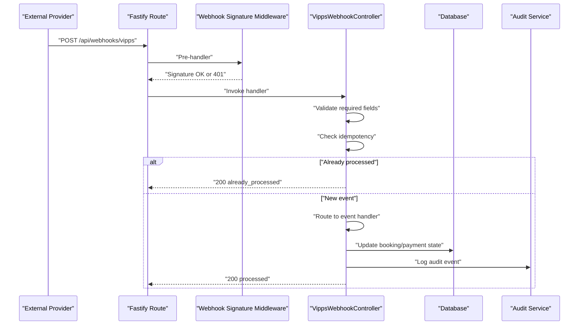
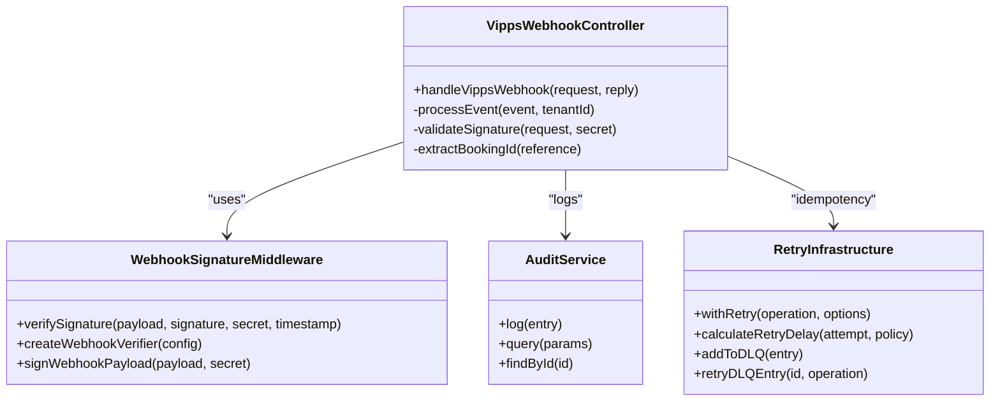

# Webhook & Event Systems

<cite>
**Referenced Files in This Document**
- [vipps-webhook.controller.ts](file://apps/api/src/modules/webhooks/vipps-webhook.controller.ts)
- [webhook-signature.ts](file://apps/api/src/middleware/webhook-signature.ts)
- [vipps.config.ts](file://apps/api/src/config/vipps.config.ts)
- [audit.service.ts](file://apps/api/src/core/audit/audit.service.ts)
- [retry.ts](file://apps/api/src/core/retry/retry.ts)
- [notification.schema.ts](file://apps/api/src/schemas/notification.schema.ts)
- [notification.service.ts](file://apps/api/src/modules/notifications/notification.service.ts)
- [delivery.service.ts](file://apps/api/src/modules/notifications/delivery.service.ts)
- [vipps-webhook.test.ts](file://apps/api/src/__tests__/integration/vipps-webhook.test.ts)
- [notification-retry.test.ts](file://apps/api/tests/integration/notification-retry.test.ts)
- [flow-context.ts](file://packages/client-sdk/src/utils/flow-context.ts)
</cite>

## Table of Contents
1. [Introduction](#introduction)
2. [Project Structure](#project-structure)
3. [Core Components](#core-components)
4. [Architecture Overview](#architecture-overview)
5. [Detailed Component Analysis](#detailed-component-analysis)
6. [Dependency Analysis](#dependency-analysis)
7. [Performance Considerations](#performance-considerations)
8. [Troubleshooting Guide](#troubleshooting-guide)
9. [Conclusion](#conclusion)
10. [Appendices](#appendices)

## Introduction
This document explains the webhook and event-driven integration systems in the monorepo, focusing on:
- Webhook payload formats and signature verification
- Event routing and idempotency
- Event sourcing patterns and message queuing
- Asynchronous processing and retry policies
- Security controls (HMAC signatures, replay attack prevention)
- Delivery guarantees and monitoring
- Integration examples, filtering, and transformation patterns
- Debugging techniques and implementation guides for custom handlers

## Project Structure
The webhook and event systems span several modules:
- Webhook ingestion and processing: Vipps webhook controller and signature middleware
- Configuration and constants: Vipps integration settings
- Audit and observability: Audit service for logging and broadcasting
- Retry and DLQ: Generic retry infrastructure with dead letter queue
- Notifications domain: Delivery attempts, retry scheduling, and reporting
- Tests: Integration and retry behavior validation

**Diagram sources**
- [vipps-webhook.controller.ts](file://apps/api/src/modules/webhooks/vipps-webhook.controller.ts#L90-L219)
- [webhook-signature.ts](file://apps/api/src/middleware/webhook-signature.ts#L78-L173)
- [vipps.config.ts](file://apps/api/src/config/vipps.config.ts#L195-L220)
- [audit.service.ts](file://apps/api/src/core/audit/audit.service.ts#L84-L120)
- [retry.ts](file://apps/api/src/core/retry/retry.ts#L223-L350)
- [notification.schema.ts](file://apps/api/src/schemas/notification.schema.ts#L55-L90)
- [notification.service.ts](file://apps/api/src/modules/notifications/notification.service.ts#L197-L205)
- [delivery.service.ts](file://apps/api/src/modules/notifications/delivery.service.ts#L167-L182)

**Section sources**
- [vipps-webhook.controller.ts](file://apps/api/src/modules/webhooks/vipps-webhook.controller.ts#L1-L439)
- [webhook-signature.ts](file://apps/api/src/middleware/webhook-signature.ts#L1-L210)
- [vipps.config.ts](file://apps/api/src/config/vipps.config.ts#L1-L257)
- [audit.service.ts](file://apps/api/src/core/audit/audit.service.ts#L1-L278)
- [retry.ts](file://apps/api/src/core/retry/retry.ts#L1-L644)
- [notification.schema.ts](file://apps/api/src/schemas/notification.schema.ts#L1-L116)
- [notification.service.ts](file://apps/api/src/modules/notifications/notification.service.ts#L171-L205)
- [delivery.service.ts](file://apps/api/src/modules/notifications/delivery.service.ts#L153-L199)

## Core Components
- Vipps webhook controller: Receives and validates webhook events, performs idempotent processing, and routes to event-specific handlers.
- Webhook signature middleware: Verifies HMAC signatures and prevents replay attacks using timestamp freshness checks.
- Vipps configuration: Centralized loader for Vipps endpoints, secrets, and environment settings.
- Audit service: Persists and broadcasts audit events for webhook lifecycle and business outcomes.
- Retry and DLQ: Generic retry infrastructure with exponential backoff, jitter, and dead letter queue handling.
- Notifications domain: Delivery attempts, retry scheduling, and reporting for outbound notifications.

**Section sources**
- [vipps-webhook.controller.ts](file://apps/api/src/modules/webhooks/vipps-webhook.controller.ts#L90-L219)
- [webhook-signature.ts](file://apps/api/src/middleware/webhook-signature.ts#L78-L173)
- [vipps.config.ts](file://apps/api/src/config/vipps.config.ts#L195-L220)
- [audit.service.ts](file://apps/api/src/core/audit/audit.service.ts#L84-L120)
- [retry.ts](file://apps/api/src/core/retry/retry.ts#L223-L350)
- [notification.schema.ts](file://apps/api/src/schemas/notification.schema.ts#L55-L90)

## Architecture Overview
The webhook pipeline integrates external provider callbacks with internal processing and auditing. It enforces security, idempotency, and resilience.

**Diagram sources**
- [vipps-webhook.controller.ts](file://apps/api/src/modules/webhooks/vipps-webhook.controller.ts#L108-L219)
- [webhook-signature.ts](file://apps/api/src/middleware/webhook-signature.ts#L86-L172)
- [audit.service.ts](file://apps/api/src/core/audit/audit.service.ts#L84-L120)

## Detailed Component Analysis

### Vipps Webhook Controller
Responsibilities:
- Validate configuration and presence of webhook secret
- Verify HMAC signature when configured
- Enforce required fields (eventId, eventType, data.reference)
- Enforce idempotency using in-memory store with TTL
- Route to event-specific handlers (authorized, captured, refunded, failed/cancelled)
- Persist audit logs for received, validated, processed, and failed events
- Return appropriate HTTP status codes to drive external provider retries

Key payload shape:
- eventId: string
- eventType: string (checkout.session.* variants)
- timestamp: ISO string
- data: object with reference and optional fields (pspReference, amount, success)

Idempotency:
- Tracks processed event IDs with 24-hour TTL
- Periodic cleanup when size threshold is exceeded

Security:
- Validates HMAC signature using shared secret
- Logs invalid signature attempts for audit

Routing:
- Switches on eventType to call appropriate handler
- Handlers update booking state and metadata

**Section sources**
- [vipps-webhook.controller.ts](file://apps/api/src/modules/webhooks/vipps-webhook.controller.ts#L28-L47)
- [vipps-webhook.controller.ts](file://apps/api/src/modules/webhooks/vipps-webhook.controller.ts#L57-L85)
- [vipps-webhook.controller.ts](file://apps/api/src/modules/webhooks/vipps-webhook.controller.ts#L108-L219)
- [vipps-webhook.controller.ts](file://apps/api/src/modules/webhooks/vipps-webhook.controller.ts#L224-L257)
- [vipps-webhook.controller.ts](file://apps/api/src/modules/webhooks/vipps-webhook.controller.ts#L262-L413)

### Webhook Signature Middleware
Purpose:
- Verify HMAC-SHA256 signatures for incoming webhooks
- Prevent replay attacks by enforcing timestamp freshness
- Provide standardized error responses

Headers:
- x-webhook-signature: Hex-encoded HMAC signature
- x-webhook-timestamp: Unix timestamp (seconds)

Validation steps:
- Extract signature and timestamp from headers
- Reject missing headers with 401
- Validate timestamp age (default maxAge: 300s)
- Compute expected signature and compare using constant-time comparison
- Return 401 for invalid signature; otherwise, proceed to handler

Outgoing signing utility:
- Generates signature for outbound payloads using timestamp and payload

**Section sources**
- [webhook-signature.ts](file://apps/api/src/middleware/webhook-signature.ts#L18-L41)
- [webhook-signature.ts](file://apps/api/src/middleware/webhook-signature.ts#L60-L73)
- [webhook-signature.ts](file://apps/api/src/middleware/webhook-signature.ts#L86-L173)
- [webhook-signature.ts](file://apps/api/src/middleware/webhook-signature.ts#L180-L189)

### Vipps Configuration
- Loads and validates environment variables for Vipps integration
- Provides endpoints for Checkout, ePayment, Login, and Webhooks APIs
- Supplies webhookSecret for signature verification
- Supports test and production environments with per-tenant overrides

**Section sources**
- [vipps.config.ts](file://apps/api/src/config/vipps.config.ts#L77-L86)
- [vipps.config.ts](file://apps/api/src/config/vipps.config.ts#L111-L144)
- [vipps.config.ts](file://apps/api/src/config/vipps.config.ts#L149-L183)
- [vipps.config.ts](file://apps/api/src/config/vipps.config.ts#L195-L220)

### Audit Service
- Persists audit entries with tenantId, userId, action, resource, resourceId, severity, metadata, IP, and User-Agent
- Broadcasts audit events via WebSocket for real-time dashboards
- Provides query, find-by-id, and convenience methods for common actions
- Used extensively in webhook controller for lifecycle events

**Section sources**
- [audit.service.ts](file://apps/api/src/core/audit/audit.service.ts#L24-L48)
- [audit.service.ts](file://apps/api/src/core/audit/audit.service.ts#L84-L120)
- [audit.service.ts](file://apps/api/src/core/audit/audit.service.ts#L247-L276)

### Retry Infrastructure and Dead Letter Queue
Capabilities:
- Exponential backoff with jitter to avoid thundering herd
- Configurable retry policies (maxAttempts, initialDelayMs, maxDelayMs, backoffMultiplier, jitterFactor)
- Idempotency key generation for idempotent operations
- DLQ for failed operations with statistics and manual retry
- HTTP fetch wrapper with retry and idempotency headers

Key behaviors:
- calculateRetryDelay computes capped exponential delay plus jitter
- isRetryableError inspects AppError status codes and network error codes
- withRetry executes operation with timeout and retry loop
- addToDLQ, getDLQEntries, retryDLQEntry, getDLQStats manage DLQ lifecycle

**Section sources**
- [retry.ts](file://apps/api/src/core/retry/retry.ts#L24-L43)
- [retry.ts](file://apps/api/src/core/retry/retry.ts#L155-L169)
- [retry.ts](file://apps/api/src/core/retry/retry.ts#L174-L199)
- [retry.ts](file://apps/api/src/core/retry/retry.ts#L223-L350)
- [retry.ts](file://apps/api/src/core/retry/retry.ts#L365-L422)
- [retry.ts](file://apps/api/src/core/retry/retry.ts#L467-L497)

### Notifications Domain: Delivery Attempts and Retry
- DeliveryAttemptSchema captures attemptNumber, status, error, retriedAt, nextRetryAt
- DeliveryService calculates exponential backoff delays (1, 2, 4, 8, 16 minutes)
- Retry logic schedules next attempts based on current attempt number
- NotificationService aggregates delivery status and attempts for reporting

**Section sources**
- [notification.schema.ts](file://apps/api/src/schemas/notification.schema.ts#L79-L90)
- [notification.schema.ts](file://apps/api/src/schemas/notification.schema.ts#L107-L115)
- [delivery.service.ts](file://apps/api/src/modules/notifications/delivery.service.ts#L167-L182)
- [notification.service.ts](file://apps/api/src/modules/notifications/notification.service.ts#L197-L205)

### Client SDK Signing Utilities
- generateHMAC supports Web Crypto API for secure HMAC-SHA256
- Falls back to simple hash when crypto is unavailable (non-cryptographic)
- Demonstrates signing patterns for outbound webhooks

**Section sources**
- [flow-context.ts](file://packages/client-sdk/src/utils/flow-context.ts#L341-L363)

## Dependency Analysis

**Diagram sources**
- [vipps-webhook.controller.ts](file://apps/api/src/modules/webhooks/vipps-webhook.controller.ts#L90-L219)
- [webhook-signature.ts](file://apps/api/src/middleware/webhook-signature.ts#L78-L173)
- [audit.service.ts](file://apps/api/src/core/audit/audit.service.ts#L84-L120)
- [retry.ts](file://apps/api/src/core/retry/retry.ts#L223-L350)

**Section sources**
- [vipps-webhook.controller.ts](file://apps/api/src/modules/webhooks/vipps-webhook.controller.ts#L90-L219)
- [webhook-signature.ts](file://apps/api/src/middleware/webhook-signature.ts#L78-L173)
- [audit.service.ts](file://apps/api/src/core/audit/audit.service.ts#L84-L120)
- [retry.ts](file://apps/api/src/core/retry/retry.ts#L223-L350)

## Performance Considerations
- Signature verification uses constant-time comparison to mitigate timing attacks without significant overhead.
- Idempotency store uses in-memory Map; for production scale, replace with Redis or database-backed store.
- Retry backoff uses exponential growth with jitter to reduce contention; tune maxAttempts and delays for SLAs.
- Audit logging serializes metadata; keep metadata minimal to reduce payload sizes.
- DLQ operations are in-memory for development; production requires durable storage.

[No sources needed since this section provides general guidance]

## Troubleshooting Guide
Common failure modes and diagnostics:
- Missing or invalid signature: 401 responses with structured error details; inspect headers and shared secret.
- Expired timestamp: Rejected if outside maxAge window; adjust system clock or increase maxAge temporarily.
- Missing required fields: 400 responses; ensure eventId, eventType, and data.reference are present.
- Replay attacks: Signature middleware rejects stale timestamps; ensure clocks are synchronized.
- Idempotency collisions: Duplicates return success immediately; verify TTL and cleanup thresholds.
- Processing failures: Controller returns 500 to trigger external provider retries; check audit logs for error metadata.
- DLQ overflow: Review DLQ statistics and reprocess entries; ensure onDLQ handler is configured.

Monitoring and debugging:
- Audit logs: Query by tenantId, action, resource, and time range; use WebSocket broadcasts for live dashboards.
- DLQ stats: Inspect totals, distribution by operation type and tenant, and oldest entry timestamps.
- Notification delivery reports: Validate retry windows, attempt counts, and nextRetryAt fields.

**Section sources**
- [webhook-signature.ts](file://apps/api/src/middleware/webhook-signature.ts#L92-L171)
- [vipps-webhook.controller.ts](file://apps/api/src/modules/webhooks/vipps-webhook.controller.ts#L138-L218)
- [audit.service.ts](file://apps/api/src/core/audit/audit.service.ts#L125-L177)
- [retry.ts](file://apps/api/src/core/retry/retry.ts#L467-L497)
- [notification-retry.test.ts](file://apps/api/tests/integration/notification-retry.test.ts#L330-L420)

## Conclusion
The webhook and event systems combine secure ingestion, strict validation, idempotent processing, and resilient retry/delivery mechanisms. The architecture supports external provider integrations (e.g., Vipps) while maintaining strong auditability and observability. For production, replace in-memory stores with durable alternatives, configure robust DLQ handling, and enforce strict operational procedures for secrets and replay protection.

[No sources needed since this section summarizes without analyzing specific files]

## Appendices

### Webhook Payload Formats
- Inbound (Vipps):
  - eventId: string
  - eventType: string (checkout.session.*) 
  - timestamp: ISO string
  - data.reference: string
  - Optional: data.pspReference, data.amount.value/currency, data.success

- Outbound (when signing payloads):
  - Use signWebhookPayload to generate signature and timestamp

**Section sources**
- [vipps-webhook.controller.ts](file://apps/api/src/modules/webhooks/vipps-webhook.controller.ts#L28-L47)
- [webhook-signature.ts](file://apps/api/src/middleware/webhook-signature.ts#L180-L189)

### Signature Verification Details
- Algorithm: HMAC-SHA256
- Secret: From Vipps configuration
- Data: JSON stringified payload
- Headers: x-vipps-signature (inbound), x-webhook-signature and x-webhook-timestamp (middleware)
- Timing-safe comparison prevents timing attacks

**Section sources**
- [vipps-webhook.controller.ts](file://apps/api/src/modules/webhooks/vipps-webhook.controller.ts#L427-L437)
- [webhook-signature.ts](file://apps/api/src/middleware/webhook-signature.ts#L46-L73)
- [flow-context.ts](file://packages/client-sdk/src/utils/flow-context.ts#L341-L363)

### Replay Attack Prevention
- Timestamp freshness enforced (default maxAge: 300s)
- Future timestamps rejected
- Signature verification ensures authenticity

**Section sources**
- [webhook-signature.ts](file://apps/api/src/middleware/webhook-signature.ts#L121-L142)

### Retry Policies and Delivery Guarantees
- Exponential backoff with jitter (1, 2, 4, 8, 16 minutes)
- Max attempts configurable; DLQ for exhaustion
- Idempotency keys prevent duplicate effects
- Delivery attempts tracked with status and nextRetryAt

**Section sources**
- [retry.ts](file://apps/api/src/core/retry/retry.ts#L155-L169)
- [retry.ts](file://apps/api/src/core/retry/retry.ts#L223-L350)
- [delivery.service.ts](file://apps/api/src/modules/notifications/delivery.service.ts#L167-L182)
- [notification.schema.ts](file://apps/api/src/schemas/notification.schema.ts#L79-L90)

### Event Routing and Transformation Patterns
- Route by eventType to dedicated handlers
- Transform external identifiers (e.g., reference parsing) to internal IDs
- Update domain state (e.g., booking status) and persist audit logs

**Section sources**
- [vipps-webhook.controller.ts](file://apps/api/src/modules/webhooks/vipps-webhook.controller.ts#L224-L257)
- [vipps-webhook.controller.ts](file://apps/api/src/modules/webhooks/vipps-webhook.controller.ts#L419-L422)

### Integration Examples
- External provider sends webhook to POST /api/webhooks/vipps
- Include x-vipps-signature header when secret configured
- Ensure data.reference follows expected format for ID extraction
- Monitor audit logs and DLQ for failures

**Section sources**
- [vipps-webhook.controller.ts](file://apps/api/src/modules/webhooks/vipps-webhook.controller.ts#L90-L107)
- [vipps-webhook.controller.ts](file://apps/api/src/modules/webhooks/vipps-webhook.controller.ts#L138-L171)

### Implementation Guides
- Custom webhook handler:
  - Define payload interface and required fields
  - Implement signature verification using provided middleware
  - Enforce idempotency with TTL-based store
  - Route to domain-specific handlers and persist audit logs
  - Return appropriate HTTP status codes to external provider

- Custom event processor:
  - Use retry infrastructure for idempotent operations
  - Configure DLQ handler for post-processing
  - Track delivery attempts and nextRetryAt for observability

**Section sources**
- [webhook-signature.ts](file://apps/api/src/middleware/webhook-signature.ts#L78-L173)
- [retry.ts](file://apps/api/src/core/retry/retry.ts#L223-L350)
- [audit.service.ts](file://apps/api/src/core/audit/audit.service.ts#L84-L120)

### Tests and Validation
- Signature correctness and invalid signature rejection
- Idempotency TTL and duplicate detection
- Booking ID extraction from reference
- Event type recognition and status mapping
- Notification retry delay calculations and max attempts

**Section sources**
- [vipps-webhook.test.ts](file://apps/api/src/__tests__/integration/vipps-webhook.test.ts#L33-L68)
- [vipps-webhook.test.ts](file://apps/api/src/__tests__/integration/vipps-webhook.test.ts#L70-L99)
- [vipps-webhook.test.ts](file://apps/api/src/__tests__/integration/vipps-webhook.test.ts#L101-L125)
- [vipps-webhook.test.ts](file://apps/api/src/__tests__/integration/vipps-webhook.test.ts#L127-L156)
- [notification-retry.test.ts](file://apps/api/tests/integration/notification-retry.test.ts#L226-L265)
- [notification-retry.test.ts](file://apps/api/tests/integration/notification-retry.test.ts#L357-L374)