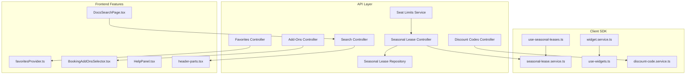
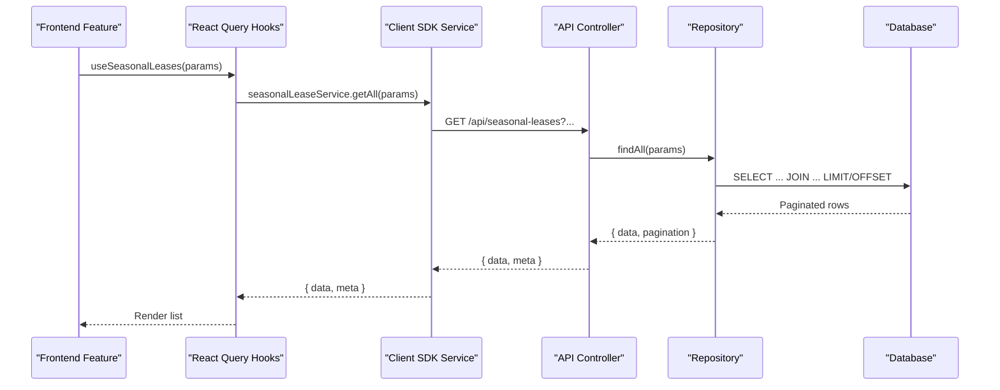
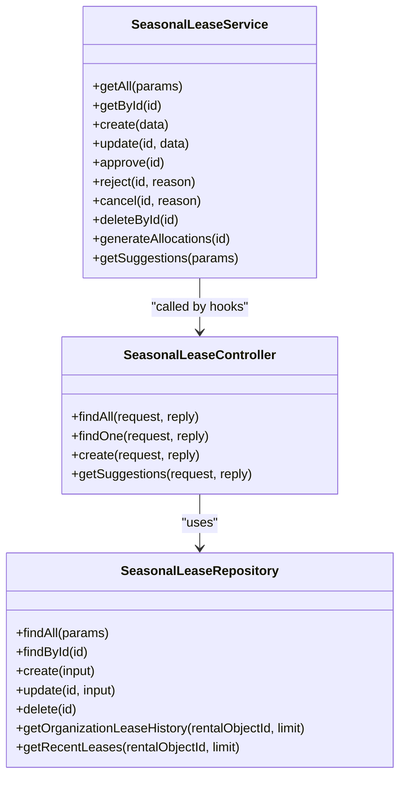
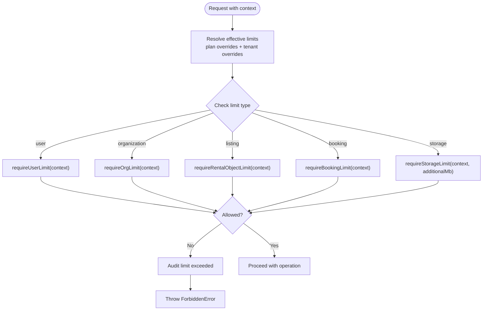
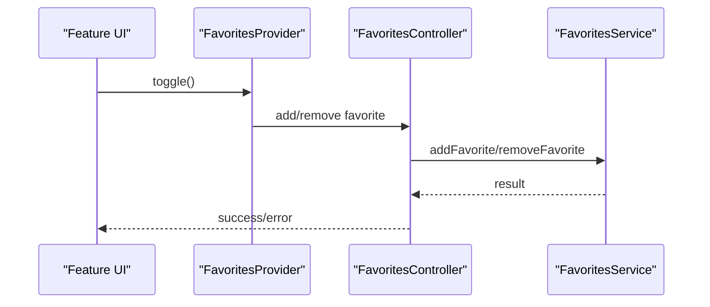
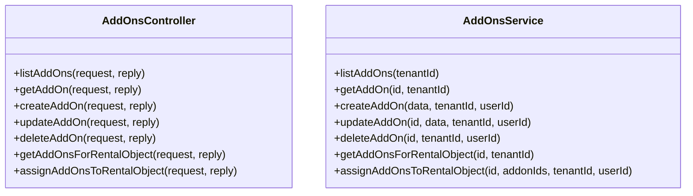
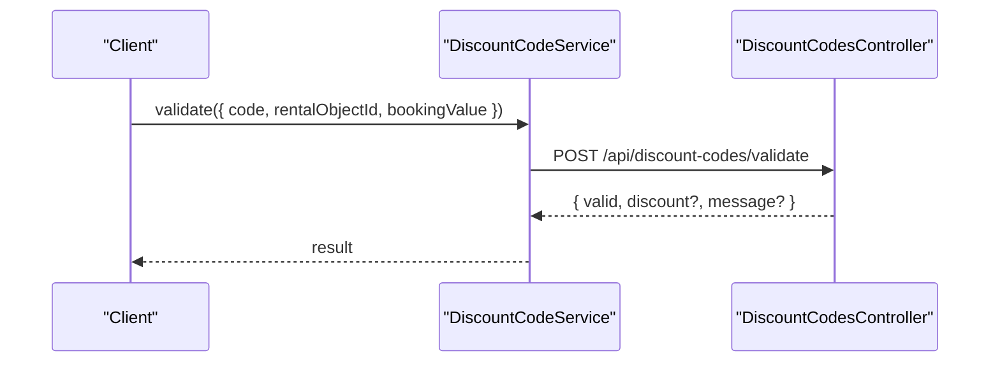
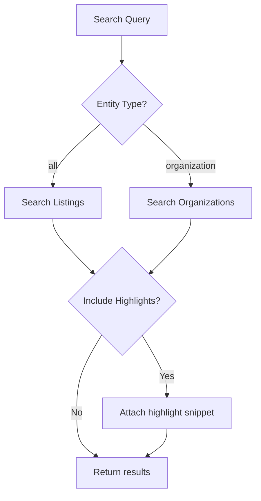
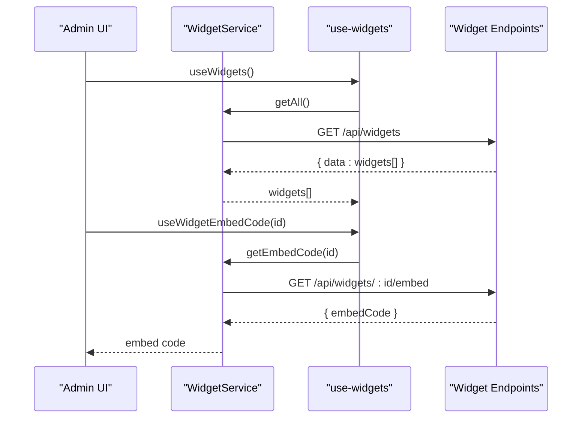
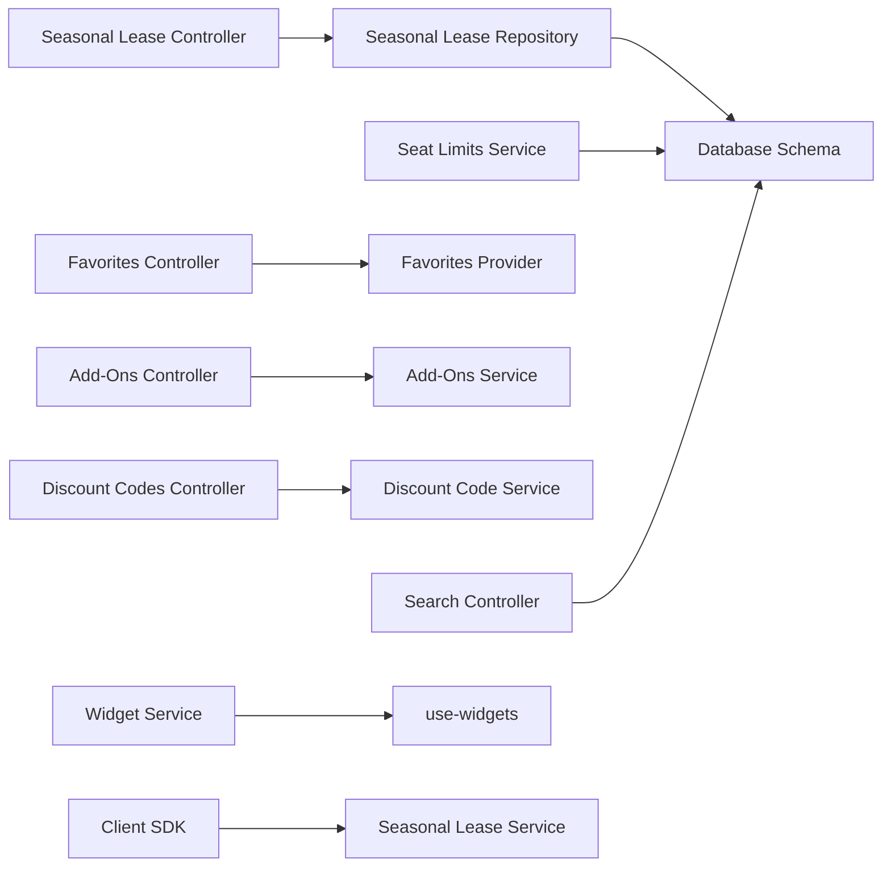

# Specialized Modules

<cite>
**Referenced Files in This Document**
- [seasonal-lease.controller.ts](file://apps/api/src/modules/seasonal-lease/seasonal-lease.controller.ts)
- [seasonal-lease.repository.ts](file://apps/api/src/modules/seasonal-lease/seasonal-lease.repository.ts)
- [seasonal-lease.service.ts](file://packages/client-sdk/src/services/seasonal-lease.service.ts)
- [use-seasonal-leases.ts](file://packages/client-sdk/src/hooks/use-seasonal-leases.ts)
- [seat-limits.service.ts](file://apps/api/src/modules/seat-limits/seat-limits.service.ts)
- [capabilities.service.ts](file://apps/api/src/modules/capabilities/capabilities.service.ts)
- [favorites.controller.ts](file://apps/api/src/modules/favorites/favorites.controller.ts)
- [favoritesProvider.ts](file://apps/web/src/features/rental-object-details/adapters/favoritesProvider.ts)
- [addons.controller.ts](file://apps/api/src/modules/addons/addons.controller.ts)
- [addons.service.ts](file://apps/api/src/modules/addons/addons.service.ts)
- [discount-code.service.ts](file://packages/client-sdk/src/services/discount-code.service.ts)
- [discount-codes.controller.ts](file://apps/api/src/modules/discount-codes/discount-codes.controller.ts)
- [BookingAddOnsSelector.tsx](file://apps/web/src/features/rental-object-details/components/Sidebar/components/BookingAddOnsSelector.tsx)
- [search.controller.ts](file://apps/api/src/modules/search/search.controller.ts)
- [header-parts.tsx](file://packages/ds/src/composed/header-parts.tsx)
- [HelpPanel.tsx](file://packages/ds/src/blocks/help/HelpPanel.tsx)
- [DocsSearchPage.tsx](file://apps/docs-learning/src/routes/DocsSearchPage.tsx)
- [index.legacy.ts](file://apps/api/src/database/schema/index.legacy.ts)
- [widget.service.ts](file://packages/client-sdk/src/services/widget.service.ts)
- [use-widgets.ts](file://packages/client-sdk/src/hooks/use-widgets.ts)
- [query-keys.ts](file://packages/client-sdk/src/hooks/query-keys.ts)
</cite>

## Table of Contents
1. [Introduction](#introduction)
2. [Project Structure](#project-structure)
3. [Core Components](#core-components)
4. [Architecture Overview](#architecture-overview)
5. [Detailed Component Analysis](#detailed-component-analysis)
6. [Dependency Analysis](#dependency-analysis)
7. [Performance Considerations](#performance-considerations)
8. [Troubleshooting Guide](#troubleshooting-guide)
9. [Conclusion](#conclusion)
10. [Appendices](#appendices)

## Introduction
This document explains specialized feature modules that provide unique functionality across the platform:
- Seasons and seasonal lease management for time-based rentals
- Seat limits for capacity management
- Favorites system for user preferences
- Add-ons and discount codes for enhanced booking experiences
- Search functionality and help system
- Widget framework for embeddable UI components

It covers implementation patterns, configuration options, and integration examples for each module, with diagrams and references to concrete source files.

## Project Structure
The specialized modules span backend APIs, client SDKs, and frontend features:
- Backend API modules expose controllers, services, repositories, and schemas
- Client SDK provides typed services and React Query hooks
- Frontend apps implement user-facing components and integration patterns

**Diagram sources**
- [seasonal-lease.controller.ts](file://apps/api/src/modules/seasonal-lease/seasonal-lease.controller.ts#L1-L130)
- [seasonal-lease.repository.ts](file://apps/api/src/modules/seasonal-lease/seasonal-lease.repository.ts#L1-L334)
- [seat-limits.service.ts](file://apps/api/src/modules/seat-limits/seat-limits.service.ts#L1-L692)
- [favorites.controller.ts](file://apps/api/src/modules/favorites/favorites.controller.ts#L1-L188)
- [addons.controller.ts](file://apps/api/src/modules/addons/addons.controller.ts#L1-L136)
- [discount-codes.controller.ts](file://apps/api/src/modules/discount-codes/discount-codes.controller.ts#L157-L208)
- [search.controller.ts](file://apps/api/src/modules/search/search.controller.ts#L167-L212)
- [use-seasonal-leases.ts](file://packages/client-sdk/src/hooks/use-seasonal-leases.ts#L1-L48)
- [seasonal-lease.service.ts](file://packages/client-sdk/src/services/seasonal-lease.service.ts#L1-L323)
- [widget.service.ts](file://packages/client-sdk/src/services/widget.service.ts#L61-L91)
- [use-widgets.ts](file://packages/client-sdk/src/hooks/use-widgets.ts#L1-L112)
- [discount-code.service.ts](file://packages/client-sdk/src/services/discount-code.service.ts#L1-L53)
- [favoritesProvider.ts](file://apps/web/src/features/rental-object-details/adapters/favoritesProvider.ts#L110-L148)
- [BookingAddOnsSelector.tsx](file://apps/web/src/features/rental-object-details/components/Sidebar/components/BookingAddOnsSelector.tsx#L1-L41)
- [HelpPanel.tsx](file://packages/ds/src/blocks/help/HelpPanel.tsx#L373-L411)
- [DocsSearchPage.tsx](file://apps/docs-learning/src/routes/DocsSearchPage.tsx#L36-L68)
- [header-parts.tsx](file://packages/ds/src/composed/header-parts.tsx#L466-L493)

**Section sources**
- [seasonal-lease.controller.ts](file://apps/api/src/modules/seasonal-lease/seasonal-lease.controller.ts#L1-L130)
- [seasonal-lease.repository.ts](file://apps/api/src/modules/seasonal-lease/seasonal-lease.repository.ts#L1-L334)
- [seasonal-lease.service.ts](file://packages/client-sdk/src/services/seasonal-lease.service.ts#L1-L323)
- [use-seasonal-leases.ts](file://packages/client-sdk/src/hooks/use-seasonal-leases.ts#L1-L48)
- [seat-limits.service.ts](file://apps/api/src/modules/seat-limits/seat-limits.service.ts#L1-L692)
- [capabilities.service.ts](file://apps/api/src/modules/capabilities/capabilities.service.ts#L741-L769)
- [favorites.controller.ts](file://apps/api/src/modules/favorites/favorites.controller.ts#L1-L188)
- [favoritesProvider.ts](file://apps/web/src/features/rental-object-details/adapters/favoritesProvider.ts#L110-L148)
- [addons.controller.ts](file://apps/api/src/modules/addons/addons.controller.ts#L1-L136)
- [addons.service.ts](file://apps/api/src/modules/addons/addons.service.ts#L56-L113)
- [discount-code.service.ts](file://packages/client-sdk/src/services/discount-code.service.ts#L1-L53)
- [discount-codes.controller.ts](file://apps/api/src/modules/discount-codes/discount-codes.controller.ts#L157-L208)
- [BookingAddOnsSelector.tsx](file://apps/web/src/features/rental-object-details/components/Sidebar/components/BookingAddOnsSelector.tsx#L1-L41)
- [search.controller.ts](file://apps/api/src/modules/search/search.controller.ts#L167-L212)
- [header-parts.tsx](file://packages/ds/src/composed/header-parts.tsx#L466-L493)
- [HelpPanel.tsx](file://packages/ds/src/blocks/help/HelpPanel.tsx#L373-L411)
- [DocsSearchPage.tsx](file://apps/docs-learning/src/routes/DocsSearchPage.tsx#L36-L68)
- [index.legacy.ts](file://apps/api/src/database/schema/index.legacy.ts#L533-L554)
- [index.legacy.ts](file://apps/api/src/database/schema/index.legacy.ts#L627-L642)
- [widget.service.ts](file://packages/client-sdk/src/services/widget.service.ts#L61-L91)
- [use-widgets.ts](file://packages/client-sdk/src/hooks/use-widgets.ts#L1-L112)
- [query-keys.ts](file://packages/client-sdk/src/hooks/query-keys.ts#L509-L522)

## Core Components
- Seasonal lease management: API endpoints, repository with pagination and suggestions, client service with hooks
- Seat limits: enforcement service with caching, usage stats, and audit logging
- Favorites: controller with CRUD and bulk operations, frontend provider and hook
- Add-ons: admin-only creation/update/delete, per-listing assignment, and frontend selector
- Discount codes: admin-only lifecycle and validation endpoint
- Search: unified search across listings and organizations with highlighting
- Help: DS block with FAQ panel and search input
- Widgets: embeddable UI components with preview and embed code

**Section sources**
- [seasonal-lease.controller.ts](file://apps/api/src/modules/seasonal-lease/seasonal-lease.controller.ts#L1-L130)
- [seasonal-lease.repository.ts](file://apps/api/src/modules/seasonal-lease/seasonal-lease.repository.ts#L1-L334)
- [seasonal-lease.service.ts](file://packages/client-sdk/src/services/seasonal-lease.service.ts#L1-L323)
- [seat-limits.service.ts](file://apps/api/src/modules/seat-limits/seat-limits.service.ts#L1-L692)
- [favorites.controller.ts](file://apps/api/src/modules/favorites/favorites.controller.ts#L1-L188)
- [favoritesProvider.ts](file://apps/web/src/features/rental-object-details/adapters/favoritesProvider.ts#L110-L148)
- [addons.controller.ts](file://apps/api/src/modules/addons/addons.controller.ts#L1-L136)
- [addons.service.ts](file://apps/api/src/modules/addons/addons.service.ts#L56-L113)
- [discount-code.service.ts](file://packages/client-sdk/src/services/discount-code.service.ts#L1-L53)
- [discount-codes.controller.ts](file://apps/api/src/modules/discount-codes/discount-codes.controller.ts#L157-L208)
- [search.controller.ts](file://apps/api/src/modules/search/search.controller.ts#L167-L212)
- [HelpPanel.tsx](file://packages/ds/src/blocks/help/HelpPanel.tsx#L373-L411)
- [widget.service.ts](file://packages/client-sdk/src/services/widget.service.ts#L61-L91)
- [use-widgets.ts](file://packages/client-sdk/src/hooks/use-widgets.ts#L1-L112)

## Architecture Overview
The modules follow layered architecture:
- Controllers orchestrate requests and delegate to services
- Services encapsulate business logic and coordinate repositories
- Repositories manage data access via typed schemas
- Client SDKs provide typed services and React Query hooks for UI integration
- Frontend features consume SDK services and render UI

**Diagram sources**
- [use-seasonal-leases.ts](file://packages/client-sdk/src/hooks/use-seasonal-leases.ts#L24-L30)
- [seasonal-lease.service.ts](file://packages/client-sdk/src/services/seasonal-lease.service.ts#L94-L105)
- [seasonal-lease.controller.ts](file://apps/api/src/modules/seasonal-lease/seasonal-lease.controller.ts#L21-L34)
- [seasonal-lease.repository.ts](file://apps/api/src/modules/seasonal-lease/seasonal-lease.repository.ts#L86-L144)

## Detailed Component Analysis

### Seasonal Lease Management
Implements time-based seasonal agreements with weekly recurring slots, approval workflow, and allocation generation. Includes rule-based suggestions.

**Diagram sources**
- [seasonal-lease.controller.ts](file://apps/api/src/modules/seasonal-lease/seasonal-lease.controller.ts#L1-L130)
- [seasonal-lease.repository.ts](file://apps/api/src/modules/seasonal-lease/seasonal-lease.repository.ts#L1-L334)
- [seasonal-lease.service.ts](file://packages/client-sdk/src/services/seasonal-lease.service.ts#L1-L323)

Implementation highlights:
- Repository supports pagination and joins with related entities
- Controller exposes suggestions endpoint using organization lease history and recent leases
- Client service provides typed DTOs and paginated responses
- Hooks enable caching and invalidation patterns

Integration examples:
- Fetch seasonal leases with filters and pagination
- Generate allocation suggestions for prioritized organizations
- Approve and generate allocations after approval

**Section sources**
- [seasonal-lease.controller.ts](file://apps/api/src/modules/seasonal-lease/seasonal-lease.controller.ts#L77-L128)
- [seasonal-lease.repository.ts](file://apps/api/src/modules/seasonal-lease/seasonal-lease.repository.ts#L86-L144)
- [seasonal-lease.repository.ts](file://apps/api/src/modules/seasonal-lease/seasonal-lease.repository.ts#L269-L295)
- [seasonal-lease.repository.ts](file://apps/api/src/modules/seasonal-lease/seasonal-lease.repository.ts#L300-L319)
- [seasonal-lease.service.ts](file://packages/client-sdk/src/services/seasonal-lease.service.ts#L94-L105)
- [seasonal-lease.service.ts](file://packages/client-sdk/src/services/seasonal-lease.service.ts#L285-L295)
- [use-seasonal-leases.ts](file://packages/client-sdk/src/hooks/use-seasonal-leases.ts#L24-L30)

### Seat Limits for Capacity Management
Enforces tenant-level capacity constraints across users, organizations, listings, bookings, and storage. Provides usage checks, limit resolution, and audit logging.

**Diagram sources**
- [seat-limits.service.ts](file://apps/api/src/modules/seat-limits/seat-limits.service.ts#L314-L324)
- [seat-limits.service.ts](file://apps/api/src/modules/seat-limits/seat-limits.service.ts#L303-L309)
- [capabilities.service.ts](file://apps/api/src/modules/capabilities/capabilities.service.ts#L741-L769)

Configuration options:
- Default seat limits defined centrally
- Plan-level seat limits and tenant overrides
- Optional cache-backed usage stats and limit retrieval

Integration examples:
- Enforce storage usage before uploads
- Validate booking counts per month during checkout
- Invalidate cache when limits change

**Section sources**
- [seat-limits.service.ts](file://apps/api/src/modules/seat-limits/seat-limits.service.ts#L333-L334)
- [seat-limits.service.ts](file://apps/api/src/modules/seat-limits/seat-limits.service.ts#L585-L607)
- [seat-limits.service.ts](file://apps/api/src/modules/seat-limits/seat-limits.service.ts#L666-L671)
- [capabilities.service.ts](file://apps/api/src/modules/capabilities/capabilities.service.ts#L741-L769)

### Favorites System for User Preferences
Provides CRUD and bulk operations for user favorites, with frontend provider abstraction and hooks.

**Diagram sources**
- [favorites.controller.ts](file://apps/api/src/modules/favorites/favorites.controller.ts#L58-L114)
- [favoritesProvider.ts](file://apps/web/src/features/rental-object-details/adapters/favoritesProvider.ts#L110-L148)

Frontend integration:
- Toggle favorites with optimistic updates
- Persist favorites in local storage or backend
- Expose isFavorited flag for listing cards

**Section sources**
- [favorites.controller.ts](file://apps/api/src/modules/favorites/favorites.controller.ts#L1-L188)
- [favoritesProvider.ts](file://apps/web/src/features/rental-object-details/adapters/favoritesProvider.ts#L110-L148)

### Add-ons and Discount Codes
Enhances booking experiences with optional add-ons and promotional discounts.

Add-ons:
- Admin-only create/update/delete
- Per-listing assignment
- Pricing models and quantity limits

**Diagram sources**
- [addons.controller.ts](file://apps/api/src/modules/addons/addons.controller.ts#L1-L136)
- [addons.service.ts](file://apps/api/src/modules/addons/addons.service.ts#L56-L113)

Discount codes:
- Admin-only lifecycle and validation endpoint
- Supports percentage, fixed amount, and free promotions

**Diagram sources**
- [discount-code.service.ts](file://packages/client-sdk/src/services/discount-code.service.ts#L1-L53)
- [discount-codes.controller.ts](file://apps/api/src/modules/discount-codes/discount-codes.controller.ts#L191-L208)

Frontend integration:
- Add-ons selector component for booking forms
- Discount validation feedback during checkout

**Section sources**
- [addons.controller.ts](file://apps/api/src/modules/addons/addons.controller.ts#L1-L136)
- [addons.service.ts](file://apps/api/src/modules/addons/addons.service.ts#L56-L113)
- [discount-code.service.ts](file://packages/client-sdk/src/services/discount-code.service.ts#L1-L53)
- [discount-codes.controller.ts](file://apps/api/src/modules/discount-codes/discount-codes.controller.ts#L157-L208)
- [BookingAddOnsSelector.tsx](file://apps/web/src/features/rental-object-details/components/Sidebar/components/BookingAddOnsSelector.tsx#L1-L41)

### Search Functionality and Help System
Unified search across listings and organizations with optional highlight snippets. Help panel provides FAQ search and close controls.

**Diagram sources**
- [search.controller.ts](file://apps/api/src/modules/search/search.controller.ts#L167-L212)

Help panel:
- Simplified input for searching help articles
- Closeable mode and controlled state handling

**Section sources**
- [search.controller.ts](file://apps/api/src/modules/search/search.controller.ts#L167-L212)
- [header-parts.tsx](file://packages/ds/src/composed/header-parts.tsx#L466-L493)
- [HelpPanel.tsx](file://packages/ds/src/blocks/help/HelpPanel.tsx#L373-L411)
- [DocsSearchPage.tsx](file://apps/docs-learning/src/routes/DocsSearchPage.tsx#L36-L68)

### Widget Framework
Embeddable UI components with preview and embed code generation.

**Diagram sources**
- [widget.service.ts](file://packages/client-sdk/src/services/widget.service.ts#L61-L91)
- [use-widgets.ts](file://packages/client-sdk/src/hooks/use-widgets.ts#L1-L112)
- [query-keys.ts](file://packages/client-sdk/src/hooks/query-keys.ts#L509-L522)

Configuration options:
- Widget list filtering by type and enabled flag
- Embed code and preview endpoints
- Query key namespaces for cache invalidation

**Section sources**
- [widget.service.ts](file://packages/client-sdk/src/services/widget.service.ts#L61-L91)
- [use-widgets.ts](file://packages/client-sdk/src/hooks/use-widgets.ts#L1-L112)
- [query-keys.ts](file://packages/client-sdk/src/hooks/query-keys.ts#L509-L522)

## Dependency Analysis
- Controllers depend on services/repositories; services depend on schemas and audit/logging
- Client SDK services depend on typed DTOs and query keys
- Frontend features depend on SDK hooks and providers
- Database schemas define core entities and indexes

**Diagram sources**
- [seasonal-lease.controller.ts](file://apps/api/src/modules/seasonal-lease/seasonal-lease.controller.ts#L1-L130)
- [seasonal-lease.repository.ts](file://apps/api/src/modules/seasonal-lease/seasonal-lease.repository.ts#L1-L334)
- [index.legacy.ts](file://apps/api/src/database/schema/index.legacy.ts#L533-L554)
- [seat-limits.service.ts](file://apps/api/src/modules/seat-limits/seat-limits.service.ts#L1-L692)
- [favorites.controller.ts](file://apps/api/src/modules/favorites/favorites.controller.ts#L1-L188)
- [favoritesProvider.ts](file://apps/web/src/features/rental-object-details/adapters/favoritesProvider.ts#L110-L148)
- [addons.controller.ts](file://apps/api/src/modules/addons/addons.controller.ts#L1-L136)
- [addons.service.ts](file://apps/api/src/modules/addons/addons.service.ts#L56-L113)
- [discount-codes.controller.ts](file://apps/api/src/modules/discount-codes/discount-codes.controller.ts#L157-L208)
- [discount-code.service.ts](file://packages/client-sdk/src/services/discount-code.service.ts#L1-L53)
- [search.controller.ts](file://apps/api/src/modules/search/search.controller.ts#L167-L212)
- [widget.service.ts](file://packages/client-sdk/src/services/widget.service.ts#L61-L91)
- [use-widgets.ts](file://packages/client-sdk/src/hooks/use-widgets.ts#L1-L112)
- [seasonal-lease.service.ts](file://packages/client-sdk/src/services/seasonal-lease.service.ts#L1-L323)

**Section sources**
- [index.legacy.ts](file://apps/api/src/database/schema/index.legacy.ts#L533-L554)
- [index.legacy.ts](file://apps/api/src/database/schema/index.legacy.ts#L627-L642)

## Performance Considerations
- Seasonal lease repository uses JOINs and LIMIT/OFFSET for pagination; ensure indexes on foreign keys and tenant filters
- Seat limits service caches results; invalidate cache on limit changes
- Search controller iterates mock collections; replace with indexed database queries for production
- Widget service returns HTML previews; consider caching and sanitization
- Favorites provider supports local fallback; ensure consistent hydration on login

[No sources needed since this section provides general guidance]

## Troubleshooting Guide
Common issues and resolutions:
- Seasonal lease suggestions unavailable: verify organization lease history and recent leases queries
- Seat limit exceeded: review plan and tenant overrides; confirm audit logs
- Favorites toggle fails: check provider initialization and user authentication state
- Add-on assignment errors: validate tenant ownership and UUID formats
- Discount code invalid: confirm active status, validity period, and usage limits
- Search returns empty: adjust entity type filter and highlight inclusion

**Section sources**
- [seasonal-lease.controller.ts](file://apps/api/src/modules/seasonal-lease/seasonal-lease.controller.ts#L82-L128)
- [seat-limits.service.ts](file://apps/api/src/modules/seat-limits/seat-limits.service.ts#L609-L630)
- [favorites.controller.ts](file://apps/api/src/modules/favorites/favorites.controller.ts#L68-L79)
- [addons.controller.ts](file://apps/api/src/modules/addons/addons.controller.ts#L125-L134)
- [discount-codes.controller.ts](file://apps/api/src/modules/discount-codes/discount-codes.controller.ts#L191-L208)
- [search.controller.ts](file://apps/api/src/modules/search/search.controller.ts#L167-L212)

## Conclusion
These specialized modules provide robust functionality for time-based rentals, capacity governance, user preferences, add-ons, discounts, search, help, and embeddable widgets. They follow consistent patterns of layered architecture, typed SDK services, and React Query integration, enabling scalable and maintainable implementations across applications.

[No sources needed since this section summarizes without analyzing specific files]

## Appendices
- Database schema references for seasonal leases and add-ons
- Client SDK query keys for widgets

**Section sources**
- [index.legacy.ts](file://apps/api/src/database/schema/index.legacy.ts#L533-L554)
- [index.legacy.ts](file://apps/api/src/database/schema/index.legacy.ts#L627-L642)
- [query-keys.ts](file://packages/client-sdk/src/hooks/query-keys.ts#L509-L522)