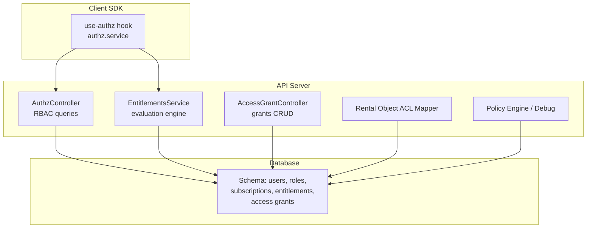
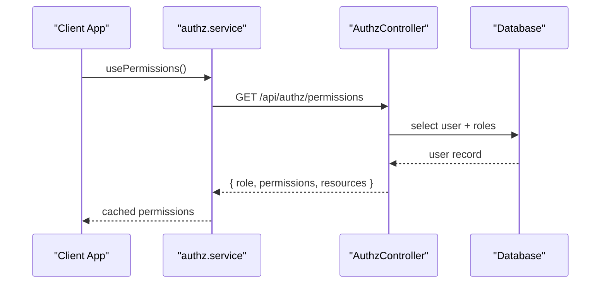
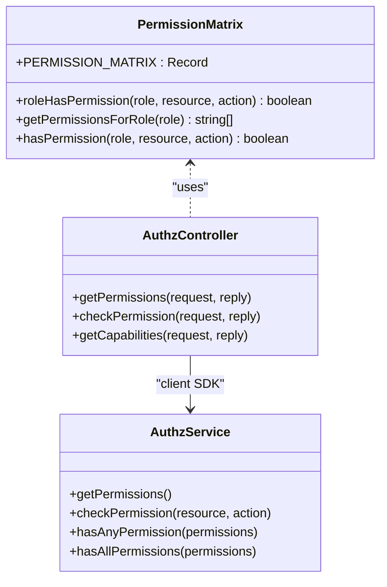
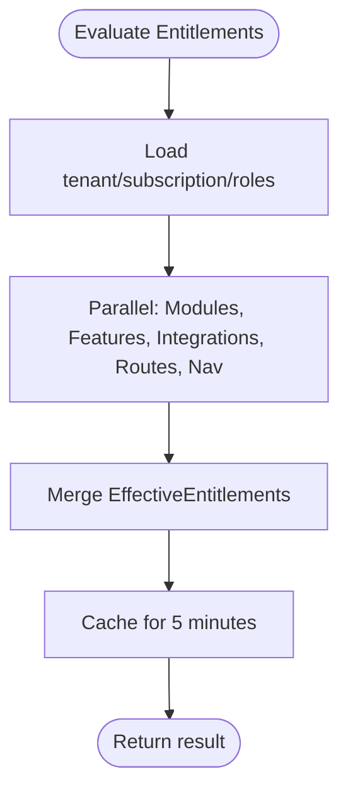
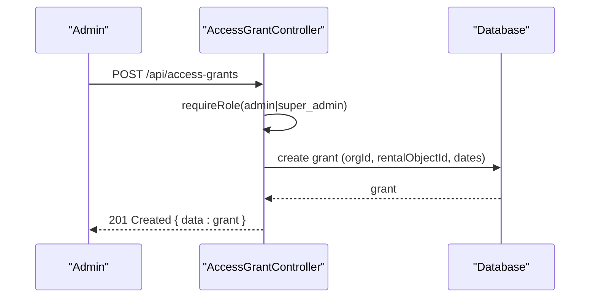
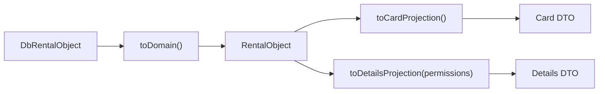
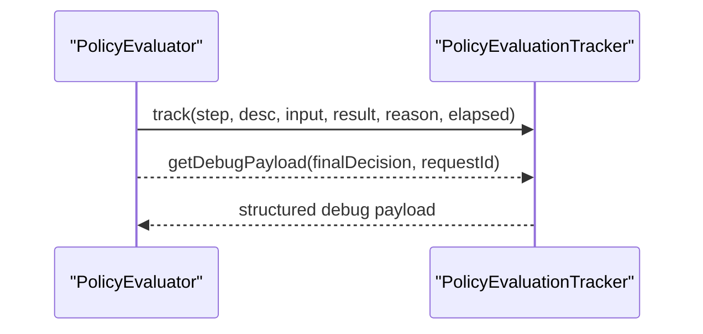
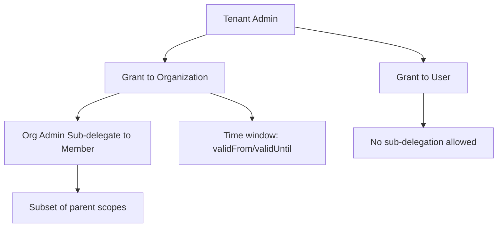
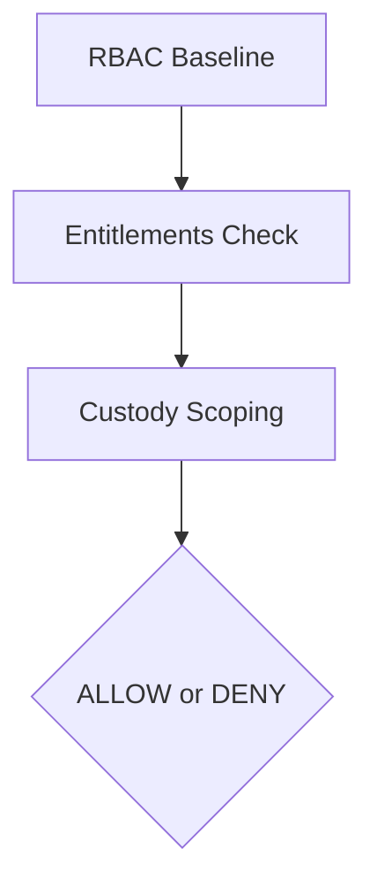
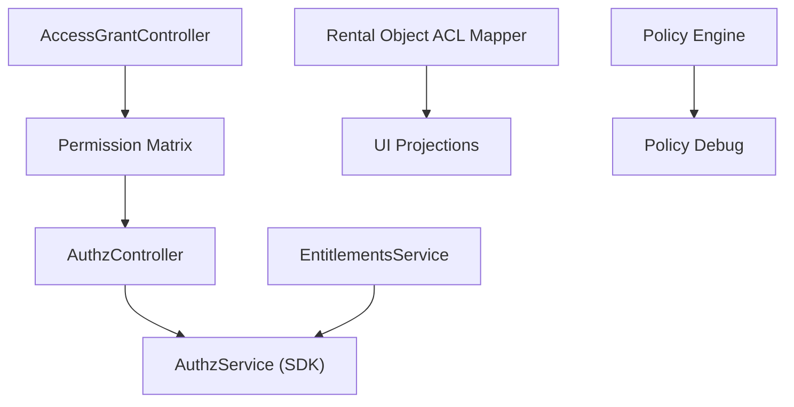

# Access Control

<cite>
**Referenced Files in This Document**
- [apps/api/src/core/rbac/permission-matrix.ts](file://apps/api/src/core/rbac/permission-matrix.ts)
- [apps/api/src/modules/authz/authz.controller.ts](file://apps/api/src/modules/authz/authz.controller.ts)
- [packages/client-sdk/src/services/authz.service.ts](file://packages/client-sdk/src/services/authz.service.ts)
- [packages/client-sdk/src/hooks/use-authz.ts](file://packages/client-sdk/src/hooks/use-authz.ts)
- [apps/api/src/modules/entitlements/entitlements.service.ts](file://apps/api/src/modules/entitlements/entitlements.service.ts)
- [apps/api/src/modules/access-grant/access-grant.controller.ts](file://apps/api/src/modules/access-grant/access-grant.controller.ts)
- [apps/api/src/acl/rental-objects/rental-object.mapper.ts](file://apps/api/src/acl/rental-objects/rental-object.mapper.ts)
- [apps/api/src/core/policy/policy-debug.ts](file://apps/api/src/core/policy/policy-debug.ts)
- [apps/api/src/modules/domain/policy-engine.ts](file://apps/api/src/modules/domain/policy-engine.ts)
- [docs/quality/rbac-entitlements-matrix.md](file://docs/quality/rbac-entitlements-matrix.md)
- [docs/architecture/rental-object-custody-delegation.md](file://docs/architecture/rental-object-custody-delegation.md)
</cite>

## Table of Contents
1. [Introduction](#introduction)
2. [Project Structure](#project-structure)
3. [Core Components](#core-components)
4. [Architecture Overview](#architecture-overview)
5. [Detailed Component Analysis](#detailed-component-analysis)
6. [Dependency Analysis](#dependency-analysis)
7. [Performance Considerations](#performance-considerations)
8. [Troubleshooting Guide](#troubleshooting-guide)
9. [Conclusion](#conclusion)

## Introduction
This document explains the Access Control and Permission Management system across the platform. It covers role-based access control (RBAC), entitlement evaluation, capability projection, access grant management, and the integration with the authorization system. It also documents policy evaluation, auditing, and compliance considerations, including delegation workflows and temporary access grants.

## Project Structure
Access control spans backend APIs, RBAC matrices, entitlement evaluation, and client-side SDK hooks/services. The key areas include:
- RBAC permission matrix and controllers
- Entitlements evaluation engine
- Access grant management
- Rental object ACL mapper and custody delegation
- Policy engine and debugging utilities

**Diagram sources**
- [apps/api/src/modules/authz/authz.controller.ts](file://apps/api/src/modules/authz/authz.controller.ts#L17-L108)
- [apps/api/src/modules/entitlements/entitlements.service.ts](file://apps/api/src/modules/entitlements/entitlements.service.ts#L41-L119)
- [apps/api/src/modules/access-grant/access-grant.controller.ts](file://apps/api/src/modules/access-grant/access-grant.controller.ts#L52-L214)
- [apps/api/src/acl/rental-objects/rental-object.mapper.ts](file://apps/api/src/acl/rental-objects/rental-object.mapper.ts#L1-L8)
- [apps/api/src/core/policy/policy-debug.ts](file://apps/api/src/core/policy/policy-debug.ts#L98-L155)

**Section sources**
- [apps/api/src/core/rbac/permission-matrix.ts](file://apps/api/src/core/rbac/permission-matrix.ts#L1-L262)
- [apps/api/src/modules/authz/authz.controller.ts](file://apps/api/src/modules/authz/authz.controller.ts#L17-L198)
- [apps/api/src/modules/entitlements/entitlements.service.ts](file://apps/api/src/modules/entitlements/entitlements.service.ts#L41-L119)
- [apps/api/src/modules/access-grant/access-grant.controller.ts](file://apps/api/src/modules/access-grant/access-grant.controller.ts#L52-L214)
- [apps/api/src/acl/rental-objects/rental-object.mapper.ts](file://apps/api/src/acl/rental-objects/rental-object.mapper.ts#L1-L8)
- [apps/api/src/core/policy/policy-debug.ts](file://apps/api/src/core/policy/policy-debug.ts#L98-L155)

## Core Components
- RBAC Permission Matrix: Centralized role-to-resource:action mapping used by controllers and middleware.
- AuthZ Controller: Exposes endpoints to fetch permissions and check specific permissions for the current user.
- Entitlements Service: Orchestrates modules, features, integrations, routes, and navigation entitlements with precedence rules.
- Access Grant Controller: Manages access grants for rental objects, enforcing tenant isolation and role-based protection.
- Rental Object ACL Mapper: Anti-corruption layer transforming persistence to domain and display-ready DTOs.
- Policy Engine and Debugging: Provides policy evaluation and structured debug payloads for access decisions.

**Section sources**
- [apps/api/src/core/rbac/permission-matrix.ts](file://apps/api/src/core/rbac/permission-matrix.ts#L45-L215)
- [apps/api/src/modules/authz/authz.controller.ts](file://apps/api/src/modules/authz/authz.controller.ts#L22-L107)
- [apps/api/src/modules/entitlements/entitlements.service.ts](file://apps/api/src/modules/entitlements/entitlements.service.ts#L64-L119)
- [apps/api/src/modules/access-grant/access-grant.controller.ts](file://apps/api/src/modules/access-grant/access-grant.controller.ts#L135-L213)
- [apps/api/src/acl/rental-objects/rental-object.mapper.ts](file://apps/api/src/acl/rental-objects/rental-object.mapper.ts#L81-L407)
- [apps/api/src/core/policy/policy-debug.ts](file://apps/api/src/core/policy/policy-debug.ts#L98-L155)

## Architecture Overview
The system combines RBAC, entitlements, and resource-scoped custody to enforce fine-grained access. The client SDK exposes hooks and services to query permissions and capabilities. The API evaluates entitlements with precedence and enforces RBAC via controllers and middleware. Access grants enable delegated access to rental objects with tenant isolation and optional time windows.

**Diagram sources**
- [packages/client-sdk/src/hooks/use-authz.ts](file://packages/client-sdk/src/hooks/use-authz.ts#L31-L38)
- [packages/client-sdk/src/services/authz.service.ts](file://packages/client-sdk/src/services/authz.service.ts#L1-L208)
- [apps/api/src/modules/authz/authz.controller.ts](file://apps/api/src/modules/authz/authz.controller.ts#L22-L57)

## Detailed Component Analysis

### Role-Based Access Control (RBAC)
- Permission Matrix: Defines roles and their allowed resource:action combinations, including system-level and organization-scoped roles.
- Controllers: Provide endpoints to fetch permissions and check specific permissions for the current user.
- Client SDK: Offers hooks and service methods to query permissions and check for role-based capabilities.

**Diagram sources**
- [apps/api/src/core/rbac/permission-matrix.ts](file://apps/api/src/core/rbac/permission-matrix.ts#L45-L262)
- [apps/api/src/modules/authz/authz.controller.ts](file://apps/api/src/modules/authz/authz.controller.ts#L17-L198)
- [packages/client-sdk/src/services/authz.service.ts](file://packages/client-sdk/src/services/authz.service.ts#L1-L208)

**Section sources**
- [apps/api/src/core/rbac/permission-matrix.ts](file://apps/api/src/core/rbac/permission-matrix.ts#L45-L262)
- [apps/api/src/modules/authz/authz.controller.ts](file://apps/api/src/modules/authz/authz.controller.ts#L22-L107)
- [packages/client-sdk/src/services/authz.service.ts](file://packages/client-sdk/src/services/authz.service.ts#L1-L208)
- [packages/client-sdk/src/hooks/use-authz.ts](file://packages/client-sdk/src/hooks/use-authz.ts#L1-L38)

### Entitlements Evaluation and Capability Management
- Entitlements Service: Evaluates modules, features, integrations, routes, and navigation items with a strict precedence order and caches results.
- Capability Projection: The client SDK’s authz service exposes capability flags derived from RBAC and entitlements for UI gating.

**Diagram sources**
- [apps/api/src/modules/entitlements/entitlements.service.ts](file://apps/api/src/modules/entitlements/entitlements.service.ts#L64-L119)

**Section sources**
- [apps/api/src/modules/entitlements/entitlements.service.ts](file://apps/api/src/modules/entitlements/entitlements.service.ts#L64-L579)
- [packages/client-sdk/src/services/authz.service.ts](file://packages/client-sdk/src/services/authz.service.ts#L1-L208)

### Access Grant Creation and Management
- AccessGrantController: Provides endpoints to list, create, and revoke access grants with tenant isolation and role-based protection.
- Pre-handlers: Enforce RBAC for read/create/delete operations on access grants.

**Diagram sources**
- [apps/api/src/modules/access-grant/access-grant.controller.ts](file://apps/api/src/modules/access-grant/access-grant.controller.ts#L135-L186)

**Section sources**
- [apps/api/src/modules/access-grant/access-grant.controller.ts](file://apps/api/src/modules/access-grant/access-grant.controller.ts#L52-L214)

### Rental Object ACL Mapper and Capability Mapping
- Anti-corruption layer: Transforms persistence records to domain models and display-ready DTOs, ensuring schema evolution safety and consistent UI projections.
- Capability mapping: The mapper supports building card and details projections enriched with permissions computed by the RBAC layer.

**Diagram sources**
- [apps/api/src/acl/rental-objects/rental-object.mapper.ts](file://apps/api/src/acl/rental-objects/rental-object.mapper.ts#L81-L407)

**Section sources**
- [apps/api/src/acl/rental-objects/rental-object.mapper.ts](file://apps/api/src/acl/rental-objects/rental-object.mapper.ts#L81-L407)

### Policy Engine and Debugging
- Policy Debug: Tracks evaluation steps, reasons, and timing for access decisions, enabling observability and troubleshooting.
- Policy Engine: Applies domain-specific rules and returns warnings/applied rules alongside allowed decisions.

**Diagram sources**
- [apps/api/src/core/policy/policy-debug.ts](file://apps/api/src/core/policy/policy-debug.ts#L98-L155)
- [apps/api/src/modules/domain/policy-engine.ts](file://apps/api/src/modules/domain/policy-engine.ts#L239-L293)

**Section sources**
- [apps/api/src/core/policy/policy-debug.ts](file://apps/api/src/core/policy/policy-debug.ts#L98-L155)
- [apps/api/src/modules/domain/policy-engine.ts](file://apps/api/src/modules/domain/policy-engine.ts#L239-L293)

### Delegation Workflows and Temporary Access Grants
- Delegation hierarchy: Tenant Admins delegate custody to organizations or users; organizations can sub-delegate to members under scope constraints.
- Time-windowed grants: Access grants support effectiveFrom/effectiveTo or expiresAt semantics.
- Audit trail: All delegation actions are audited and tenant isolation is enforced.

**Diagram sources**
- [docs/architecture/rental-object-custody-delegation.md](file://docs/architecture/rental-object-custody-delegation.md#L1-L70)

**Section sources**
- [docs/architecture/rental-object-custody-delegation.md](file://docs/architecture/rental-object-custody-delegation.md#L1-L70)

### Permission Assignment Interfaces and Evaluation
- RBAC evaluation: Roles determine baseline permissions; entitlements gate features/modules; custody scoping restricts resource-level actions.
- UI integration: The client SDK exposes capability flags and permission checks for immediate UI gating.

**Diagram sources**
- [apps/api/src/core/rbac/permission-matrix.ts](file://apps/api/src/core/rbac/permission-matrix.ts#L375-L403)
- [apps/api/src/modules/entitlements/entitlements.service.ts](file://apps/api/src/modules/entitlements/entitlements.service.ts#L64-L119)
- [apps/api/src/acl/rental-objects/rental-object.mapper.ts](file://apps/api/src/acl/rental-objects/rental-object.mapper.ts#L282-L407)

**Section sources**
- [apps/api/src/core/rbac/permission-matrix.ts](file://apps/api/src/core/rbac/permission-matrix.ts#L375-L403)
- [apps/api/src/modules/entitlements/entitlements.service.ts](file://apps/api/src/modules/entitlements/entitlements.service.ts#L64-L119)
- [apps/api/src/acl/rental-objects/rental-object.mapper.ts](file://apps/api/src/acl/rental-objects/rental-object.mapper.ts#L282-L407)

## Dependency Analysis
- RBAC depends on the shared permission matrix and is consumed by controllers and client SDK.
- Entitlements service depends on database schemas for modules, plans, subscriptions, and overrides; it caches results and logs entitlement changes.
- Access grants controller depends on RBAC middleware and enforces tenant isolation.
- ACL mapper depends on domain models and DTOs; it is used by presentation layers to render UI safely.
- Policy engine and debug utilities provide observability and structured diagnostics.

**Diagram sources**
- [apps/api/src/core/rbac/permission-matrix.ts](file://apps/api/src/core/rbac/permission-matrix.ts#L45-L215)
- [apps/api/src/modules/authz/authz.controller.ts](file://apps/api/src/modules/authz/authz.controller.ts#L17-L198)
- [packages/client-sdk/src/services/authz.service.ts](file://packages/client-sdk/src/services/authz.service.ts#L1-L208)
- [apps/api/src/modules/entitlements/entitlements.service.ts](file://apps/api/src/modules/entitlements/entitlements.service.ts#L41-L119)
- [apps/api/src/modules/access-grant/access-grant.controller.ts](file://apps/api/src/modules/access-grant/access-grant.controller.ts#L52-L214)
- [apps/api/src/acl/rental-objects/rental-object.mapper.ts](file://apps/api/src/acl/rental-objects/rental-object.mapper.ts#L1-L8)
- [apps/api/src/core/policy/policy-debug.ts](file://apps/api/src/core/policy/policy-debug.ts#L98-L155)
- [apps/api/src/modules/domain/policy-engine.ts](file://apps/api/src/modules/domain/policy-engine.ts#L239-L293)

**Section sources**
- [apps/api/src/core/rbac/permission-matrix.ts](file://apps/api/src/core/rbac/permission-matrix.ts#L45-L215)
- [apps/api/src/modules/entitlements/entitlements.service.ts](file://apps/api/src/modules/entitlements/entitlements.service.ts#L41-L119)
- [apps/api/src/modules/access-grant/access-grant.controller.ts](file://apps/api/src/modules/access-grant/access-grant.controller.ts#L52-L214)
- [apps/api/src/acl/rental-objects/rental-object.mapper.ts](file://apps/api/src/acl/rental-objects/rental-object.mapper.ts#L1-L8)
- [apps/api/src/core/policy/policy-debug.ts](file://apps/api/src/core/policy/policy-debug.ts#L98-L155)
- [apps/api/src/modules/domain/policy-engine.ts](file://apps/api/src/modules/domain/policy-engine.ts#L239-L293)

## Performance Considerations
- Caching: Entitlements are cached for five minutes; client SDK caches permissions for five minutes to reduce repeated network calls.
- Parallel evaluation: Entitlements service computes modules, features, integrations, routes, and navigation concurrently.
- Tenant isolation: Controllers enforce tenant context early to avoid unnecessary downstream processing.

**Section sources**
- [apps/api/src/modules/entitlements/entitlements.service.ts](file://apps/api/src/modules/entitlements/entitlements.service.ts#L70-L119)
- [packages/client-sdk/src/hooks/use-authz.ts](file://packages/client-sdk/src/hooks/use-authz.ts#L31-L38)
- [apps/api/src/modules/access-grant/access-grant.controller.ts](file://apps/api/src/modules/access-grant/access-grant.controller.ts#L67-L99)

## Troubleshooting Guide
- Unauthorized or missing user context: AuthZ endpoints return unauthorized when userId is absent; ensure authentication middleware injects user context.
- Permission mismatches: Use the check endpoint to verify specific resource:action permissions for the current user.
- Entitlement drift: Entitlement changes trigger cache invalidation; if UI reflects stale state, wait for cache TTL or trigger re-fetch.
- Access grant errors: Tenant isolation is enforced; cross-tenant access attempts are blocked with forbidden responses.
- Policy evaluation insights: Use the policy debug payload to inspect evaluation steps, reasons, and timing for access decisions.

**Section sources**
- [apps/api/src/modules/authz/authz.controller.ts](file://apps/api/src/modules/authz/authz.controller.ts#L22-L107)
- [apps/api/src/modules/entitlements/entitlements.service.ts](file://apps/api/src/modules/entitlements/entitlements.service.ts#L542-L579)
- [apps/api/src/modules/access-grant/access-grant.controller.ts](file://apps/api/src/modules/access-grant/access-grant.controller.ts#L107-L120)
- [apps/api/src/core/policy/policy-debug.ts](file://apps/api/src/core/policy/policy-debug.ts#L98-L155)

## Conclusion
The platform implements a robust Access Control system combining RBAC, entitlements, and resource-scoped custody. The client SDK integrates seamlessly with backend endpoints to provide real-time permissions and capabilities. Entitlements evaluation follows strict precedence rules, while access grants and delegation workflows support tenant isolation and time-bound access. The policy engine and debugging utilities enhance observability and troubleshooting, supporting compliance and operational excellence.