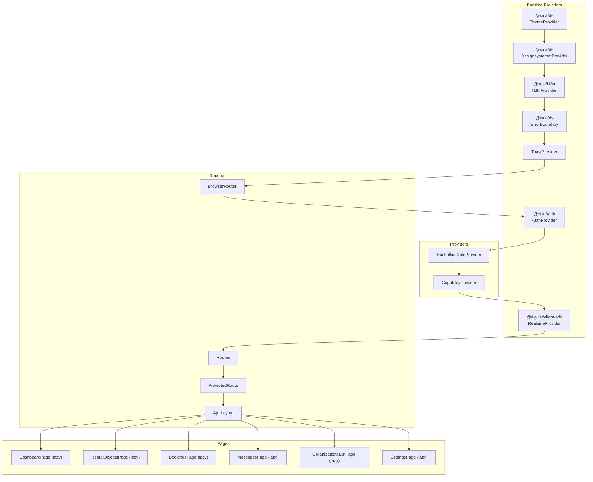
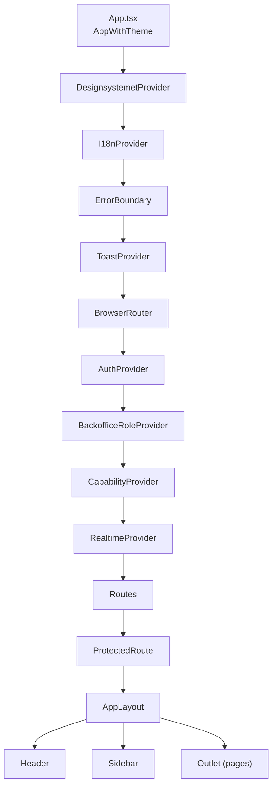
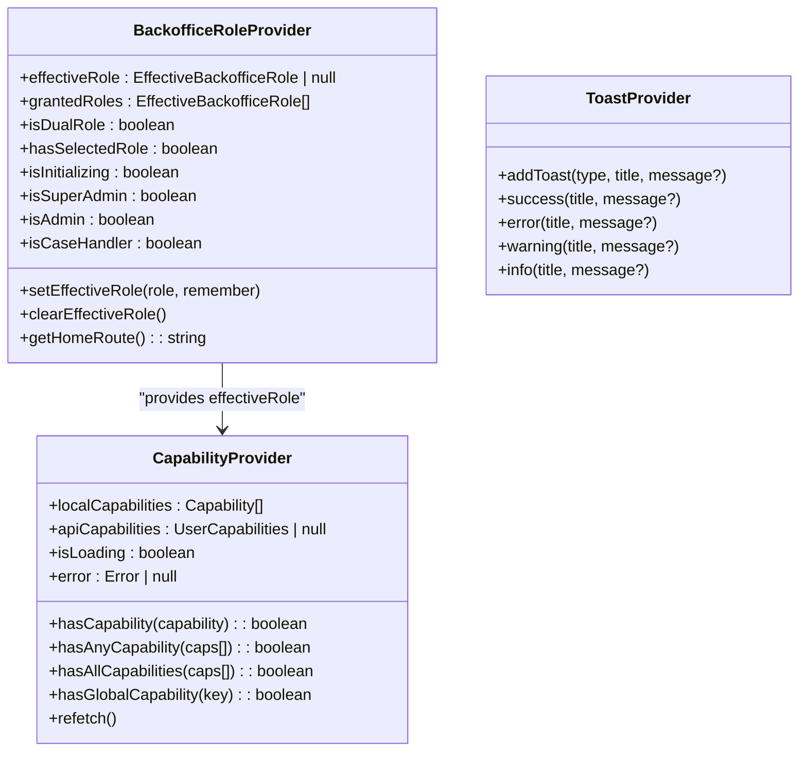
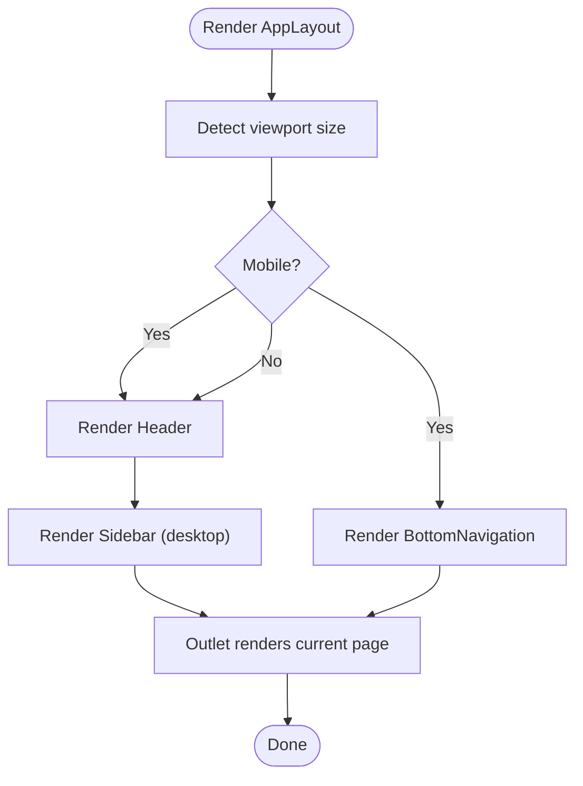
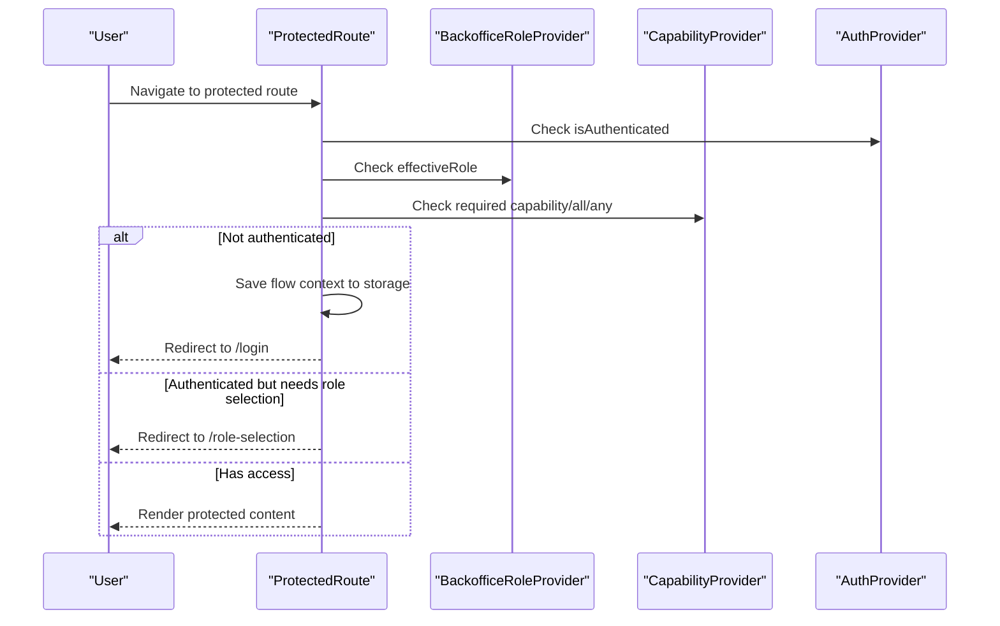
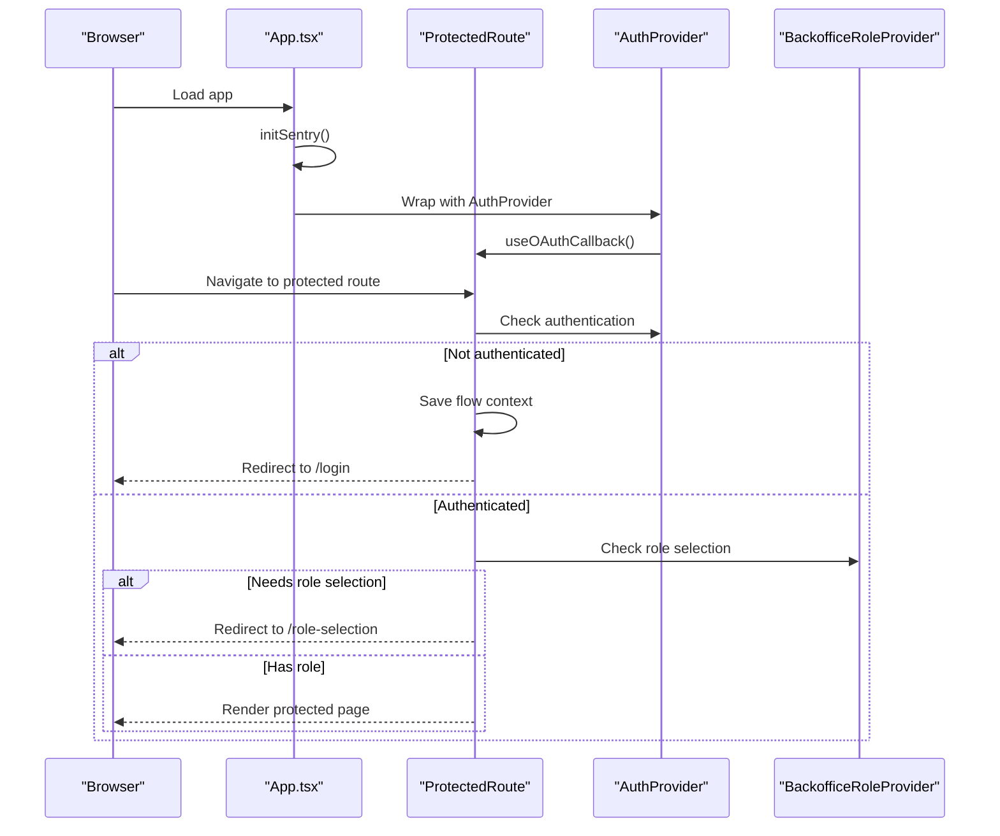
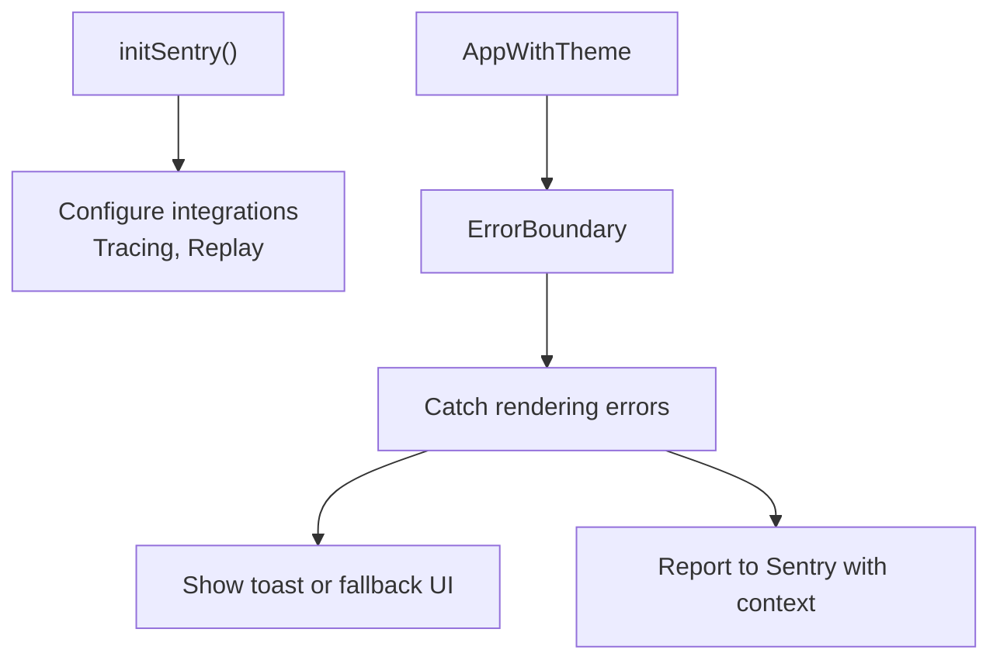
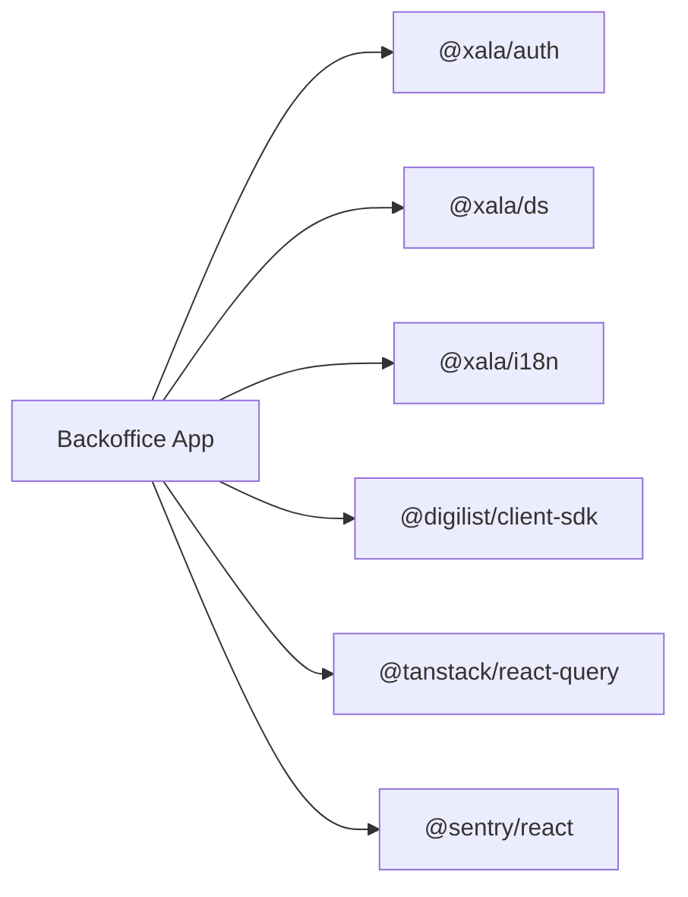

# Application Architecture

<cite>
**Referenced Files in This Document**
- [package.json](file://apps/backoffice/package.json)
- [vite.config.ts](file://apps/backoffice/vite.config.ts)
- [App.tsx](file://apps/backoffice/src/App.tsx)
- [main.tsx](file://apps/backoffice/src/main.tsx)
- [BackofficeRoleProvider.tsx](file://apps/backoffice/src/providers/BackofficeRoleProvider.tsx)
- [CapabilityProvider.tsx](file://apps/backoffice/src/providers/CapabilityProvider.tsx)
- [ToastProvider.tsx](file://apps/backoffice/src/providers/ToastProvider.tsx)
- [AppLayout.tsx](file://apps/backoffice/src/components/layout/AppLayout.tsx)
- [Header.tsx](file://apps/backoffice/src/components/layout/Header.tsx)
- [Sidebar.tsx](file://apps/backoffice/src/components/layout/Sidebar.tsx)
- [ProtectedRoute.tsx](file://apps/backoffice/src/components/ProtectedRoute.tsx)
- [capabilities.ts](file://apps/backoffice/src/lib/capabilities.ts)
- [useBackofficeRole.ts](file://apps/backoffice/src/hooks/useBackofficeRole.ts)
- [useCapabilities.ts](file://apps/backoffice/src/hooks/useCapabilities.ts)
- [sentry.ts](file://apps/backoffice/src/lib/sentry.ts)
- [LoadingFallback.tsx](file://apps/backoffice/src/components/LoadingFallback.tsx)
</cite>

## Table of Contents
1. [Introduction](#introduction)
2. [Project Structure](#project-structure)
3. [Core Components](#core-components)
4. [Architecture Overview](#architecture-overview)
5. [Detailed Component Analysis](#detailed-component-analysis)
6. [Dependency Analysis](#dependency-analysis)
7. [Performance Considerations](#performance-considerations)
8. [Troubleshooting Guide](#troubleshooting-guide)
9. [Conclusion](#conclusion)
10. [Appendices](#appendices)

## Introduction
This document describes the Backoffice Application architecture built with React and Vite. It explains the frontend structure with lazy loading, route protection, and provider-based state management. It documents the layout system (AppLayout, Header, Sidebar), role-based access control via BackofficeRoleProvider, and capability-based routing via CapabilityProvider. It also covers the authentication flow, real-time provider integration, error boundaries and error handling patterns, and build configuration, development workflow, and deployment considerations tailored for this administrative application.

## Project Structure
The Backoffice application is organized as a React SPA using Vite. Providers wrap the routing tree to supply authentication, role selection, capabilities, notifications, theming, and real-time connectivity. Routing is handled by React Router with lazy-loaded page components and protected routes.

**Diagram sources**
- [App.tsx](file://apps/backoffice/src/App.tsx#L87-L444)
- [BackofficeRoleProvider.tsx](file://apps/backoffice/src/providers/BackofficeRoleProvider.tsx#L69-L244)
- [CapabilityProvider.tsx](file://apps/backoffice/src/providers/CapabilityProvider.tsx#L67-L169)
- [ToastProvider.tsx](file://apps/backoffice/src/providers/ToastProvider.tsx#L41-L127)

**Section sources**
- [package.json](file://apps/backoffice/package.json#L1-L36)
- [vite.config.ts](file://apps/backoffice/vite.config.ts#L1-L71)
- [App.tsx](file://apps/backoffice/src/App.tsx#L1-L445)

## Core Components
- Provider stack: Theme, Design System, Internationalization, Error Boundary, Toast, Authentication, Role selection, Capability, Realtime.
- Layout system: AppLayout orchestrating Header and Sidebar; responsive behavior adapts to mobile vs desktop.
- Routing: ProtectedRoute enforces role and capability gates; lazy-loaded page components reduce initial bundle size.
- State hooks: useBackofficeRole and useCapabilities encapsulate role/capability logic for components.
- Error handling: ErrorBoundary wraps the app; Sentry integration initialized early; ToastProvider centralizes notifications.

**Section sources**
- [App.tsx](file://apps/backoffice/src/App.tsx#L87-L120)
- [AppLayout.tsx](file://apps/backoffice/src/components/layout/AppLayout.tsx#L29-L163)
- [ProtectedRoute.tsx](file://apps/backoffice/src/components/ProtectedRoute.tsx#L100-L273)
- [useBackofficeRole.ts](file://apps/backoffice/src/hooks/useBackofficeRole.ts#L95-L150)
- [useCapabilities.ts](file://apps/backoffice/src/hooks/useCapabilities.ts#L143-L178)

## Architecture Overview
The Backoffice application follows a layered provider pattern with React Router for navigation. Authentication is managed by @xala/auth; role selection is handled by BackofficeRoleProvider; capabilities are derived from roles and optionally augmented by API-provided global capabilities. Real-time updates are integrated via @digilist/client-sdk’s RealtimeProvider. Error tracking is initialized early and centralized via Sentry.

**Diagram sources**
- [App.tsx](file://apps/backoffice/src/App.tsx#L95-L120)
- [BackofficeRoleProvider.tsx](file://apps/backoffice/src/providers/BackofficeRoleProvider.tsx#L69-L244)
- [CapabilityProvider.tsx](file://apps/backoffice/src/providers/CapabilityProvider.tsx#L67-L169)
- [AppLayout.tsx](file://apps/backoffice/src/components/layout/AppLayout.tsx#L29-L163)
- [Header.tsx](file://apps/backoffice/src/components/layout/Header.tsx#L25-L293)
- [Sidebar.tsx](file://apps/backoffice/src/components/layout/Sidebar.tsx#L200-L543)

## Detailed Component Analysis

### Provider Stack and State Management
- ThemeProvider and DesignsystemetProvider set up design tokens and theme.
- I18nProvider manages locale.
- ErrorBoundary wraps the app for top-level error handling.
- ToastProvider offers global notifications with auto-dismiss.
- AuthProvider supplies authentication state and callbacks.
- BackofficeRoleProvider persists effective role, supports dual-role users, and exposes helpers for role checks and home route selection.
- CapabilityProvider derives capabilities from effective role and augments with API-provided global capabilities; exposes convenient hooks for capability checks.
- RealtimeProvider integrates WebSocket connectivity for live updates.

**Diagram sources**
- [BackofficeRoleProvider.tsx](file://apps/backoffice/src/providers/BackofficeRoleProvider.tsx#L22-L244)
- [CapabilityProvider.tsx](file://apps/backoffice/src/providers/CapabilityProvider.tsx#L27-L169)
- [ToastProvider.tsx](file://apps/backoffice/src/providers/ToastProvider.tsx#L12-L81)

**Section sources**
- [BackofficeRoleProvider.tsx](file://apps/backoffice/src/providers/BackofficeRoleProvider.tsx#L69-L244)
- [CapabilityProvider.tsx](file://apps/backoffice/src/providers/CapabilityProvider.tsx#L67-L169)
- [ToastProvider.tsx](file://apps/backoffice/src/providers/ToastProvider.tsx#L41-L127)

### Layout System: AppLayout, Header, Sidebar
- AppLayout coordinates responsive layout: desktop shows Sidebar; mobile shows BottomNavigation. It renders the main content area and passes a dynamic title based on the current route.
- Header displays user profile, theme toggle, notifications with unread count, and logout. It adapts between mobile and desktop layouts and integrates GlobalSearch.
- Sidebar constructs navigation sections based on capability checks. It supports badges, active states, and role/capability filters. It also shows user info and app branding.

**Diagram sources**
- [AppLayout.tsx](file://apps/backoffice/src/components/layout/AppLayout.tsx#L29-L163)
- [Header.tsx](file://apps/backoffice/src/components/layout/Header.tsx#L25-L293)
- [Sidebar.tsx](file://apps/backoffice/src/components/layout/Sidebar.tsx#L200-L543)

**Section sources**
- [AppLayout.tsx](file://apps/backoffice/src/components/layout/AppLayout.tsx#L29-L163)
- [Header.tsx](file://apps/backoffice/src/components/layout/Header.tsx#L25-L293)
- [Sidebar.tsx](file://apps/backoffice/src/components/layout/Sidebar.tsx#L200-L543)

### Role-Based Access Control and Capability-Based Routing
- BackofficeRoleProvider manages effective role selection, persistence, and helpers for role checks and home route resolution.
- CapabilityProvider derives local capabilities from the effective role and augments with API-provided global capabilities. It exposes hooks for capability checks.
- ProtectedRoute enforces either legacy role gating or modern capability-based gating (single, all, or any). It preserves navigation context for seamless post-authentication return.
- Sidebar visibility is filtered by capability checks, ensuring users only see accessible navigation items.

**Diagram sources**
- [ProtectedRoute.tsx](file://apps/backoffice/src/components/ProtectedRoute.tsx#L100-L273)
- [BackofficeRoleProvider.tsx](file://apps/backoffice/src/providers/BackofficeRoleProvider.tsx#L69-L244)
- [CapabilityProvider.tsx](file://apps/backoffice/src/providers/CapabilityProvider.tsx#L67-L169)

**Section sources**
- [capabilities.ts](file://apps/backoffice/src/lib/capabilities.ts#L84-L212)
- [useBackofficeRole.ts](file://apps/backoffice/src/hooks/useBackofficeRole.ts#L95-L150)
- [useCapabilities.ts](file://apps/backoffice/src/hooks/useCapabilities.ts#L143-L178)
- [ProtectedRoute.tsx](file://apps/backoffice/src/components/ProtectedRoute.tsx#L100-L273)
- [Sidebar.tsx](file://apps/backoffice/src/components/layout/Sidebar.tsx#L175-L198)

### Authentication Flow
- The app initializes Sentry early, then wraps the routing tree with providers.
- useOAuthCallback is invoked at the router level to handle OAuth/BankID redirects automatically.
- ProtectedRoute saves the intended destination and optional form data to storage, then redirects to /login with minimal state in the URL.
- After successful authentication, users are redirected to either /role-selection (for dual-role users) or their home route determined by effective role.

**Diagram sources**
- [App.tsx](file://apps/backoffice/src/App.tsx#L84-L124)
- [ProtectedRoute.tsx](file://apps/backoffice/src/components/ProtectedRoute.tsx#L192-L219)
- [BackofficeRoleProvider.tsx](file://apps/backoffice/src/providers/BackofficeRoleProvider.tsx#L119-L170)

**Section sources**
- [App.tsx](file://apps/backoffice/src/App.tsx#L84-L124)
- [ProtectedRoute.tsx](file://apps/backoffice/src/components/ProtectedRoute.tsx#L100-L273)
- [BackofficeRoleProvider.tsx](file://apps/backoffice/src/providers/BackofficeRoleProvider.tsx#L119-L170)

### Real-Time Provider Integration
- RealtimeProvider is mounted at the top level inside the provider stack, enabling real-time updates across the application. It reads tenant and WebSocket configuration from environment variables.

**Section sources**
- [App.tsx](file://apps/backoffice/src/App.tsx#L129-L132)

### Error Boundaries and Error Handling Patterns
- ErrorBoundary from @xala/ds wraps the provider chain to catch rendering errors.
- Sentry is initialized early with environment-specific sampling and privacy controls; tenant and user contexts can be set for richer debugging.
- ToastProvider centralizes user-facing notifications for success, info, warning, and error states.

**Diagram sources**
- [App.tsx](file://apps/backoffice/src/App.tsx#L84-L120)
- [sentry.ts](file://apps/backoffice/src/lib/sentry.ts#L17-L87)
- [ToastProvider.tsx](file://apps/backoffice/src/providers/ToastProvider.tsx#L41-L127)

**Section sources**
- [App.tsx](file://apps/backoffice/src/App.tsx#L102-L116)
- [sentry.ts](file://apps/backoffice/src/lib/sentry.ts#L17-L184)
- [ToastProvider.tsx](file://apps/backoffice/src/providers/ToastProvider.tsx#L41-L127)

### Build Configuration, Development Workflow, and Deployment
- Vite configuration:
  - React plugin enabled.
  - Sentry Vite plugin uploads source maps in production.
  - Server port set to 5175.
  - Path aliases for @digilist/client-sdk and related packages.
  - Manual chunking strategy separates vendor-mapbox, vendor-query, vendor-sdk, vendor-ds, and generic vendor chunks.
  - Chunk size warning limit increased to 800 KB.
- Scripts:
  - dev: starts Vite dev server on port 5175.
  - build: produces optimized production bundles with source maps.
  - lint: runs ESLint.
  - preview: serves built assets locally.
- Environment variables:
  - VITE_API_URL, VITE_TENANT_ID, VITE_LICENSE_KEY for SDK initialization.
  - VITE_WS_URL for RealtimeProvider.
  - VITE_SENTRY_* for Sentry configuration.
- Development workflow:
  - Strict mode enabled in main.tsx.
  - React Query configured with default caching and retry behavior.
  - Lazy loading of page components reduces initial load.
  - Suspense boundary with LoadingFallback improves UX during code-split loads.

**Section sources**
- [vite.config.ts](file://apps/backoffice/vite.config.ts#L1-L71)
- [package.json](file://apps/backoffice/package.json#L6-L11)
- [main.tsx](file://apps/backoffice/src/main.tsx#L11-L33)
- [App.tsx](file://apps/backoffice/src/App.tsx#L21-L83)
- [LoadingFallback.tsx](file://apps/backoffice/src/components/LoadingFallback.tsx#L8-L23)

## Dependency Analysis
The Backoffice app depends on several internal and external packages:
- @xala/auth: authentication state and OAuth callback handling.
- @xala/ds: design system, theming, UI primitives, and ErrorBoundary.
- @xala/i18n: internationalization provider.
- @digilist/client-sdk: real-time provider, hooks for capabilities/unread counts, and SDK initialization.
- @tanstack/react-query: caching and background data fetching.
- @sentry/react: error tracking and performance monitoring.

**Diagram sources**
- [package.json](file://apps/backoffice/package.json#L12-L34)

**Section sources**
- [package.json](file://apps/backoffice/package.json#L12-L34)

## Performance Considerations
- Code splitting: Page components are lazy-loaded to minimize initial bundle size.
- Chunking strategy: Vendor libraries (Mapbox GL, React Query, Client SDK, Design System) are separated into dedicated chunks to improve caching and reduce bundle contention.
- React Query defaults: Stale time and retry policies balance freshness and network efficiency.
- Source maps: Enabled in production for debugging while Sentry plugin handles source map uploads.
- Suspense fallback: LoadingFallback provides immediate feedback during route transitions.

[No sources needed since this section provides general guidance]

## Troubleshooting Guide
- Authentication loops: ProtectedRoute prevents redirect loops by checking current path and saved flow context; ensure VITE_TENANT_ID and environment variables are set correctly.
- Role selection issues: BackofficeRoleProvider validates persisted role against granted roles and clears stale selections; confirm localStorage keys and grantedRoles from auth.
- Capability mismatches: CapabilityProvider derives capabilities from effective role and API; verify effectiveRole and that useCapabilities is used within CapabilityProvider.
- Sentry reporting: Ensure VITE_SENTRY_DSN is configured; in development, VITE_SENTRY_SEND_IN_DEV can override default behavior to suppress noisy reports.
- Notifications: ToastProvider auto-dismisses after 5 seconds; verify provider is mounted and not blocked by z-index or layout constraints.

**Section sources**
- [ProtectedRoute.tsx](file://apps/backoffice/src/components/ProtectedRoute.tsx#L237-L270)
- [BackofficeRoleProvider.tsx](file://apps/backoffice/src/providers/BackofficeRoleProvider.tsx#L129-L159)
- [CapabilityProvider.tsx](file://apps/backoffice/src/providers/CapabilityProvider.tsx#L73-L82)
- [sentry.ts](file://apps/backoffice/src/lib/sentry.ts#L17-L87)
- [ToastProvider.tsx](file://apps/backoffice/src/providers/ToastProvider.tsx#L48-L60)

## Conclusion
The Backoffice Application employs a robust provider-based architecture with React Router, lazy loading, and a dual-layer access control system combining roles and capabilities. The layout system is responsive and user-centric, while the provider stack ensures consistent theming, internationalization, error handling, notifications, authentication, role management, capability derivation, and real-time connectivity. The build pipeline and development workflow emphasize performance, observability, and maintainability.

[No sources needed since this section summarizes without analyzing specific files]

## Appendices
- Capability definitions and role mappings are centralized for maintainability and clarity.
- Hooks like useBackofficeRole and useCapabilities encapsulate cross-cutting concerns, enabling clean component logic.

**Section sources**
- [capabilities.ts](file://apps/backoffice/src/lib/capabilities.ts#L84-L212)
- [useBackofficeRole.ts](file://apps/backoffice/src/hooks/useBackofficeRole.ts#L95-L150)
- [useCapabilities.ts](file://apps/backoffice/src/hooks/useCapabilities.ts#L143-L178)