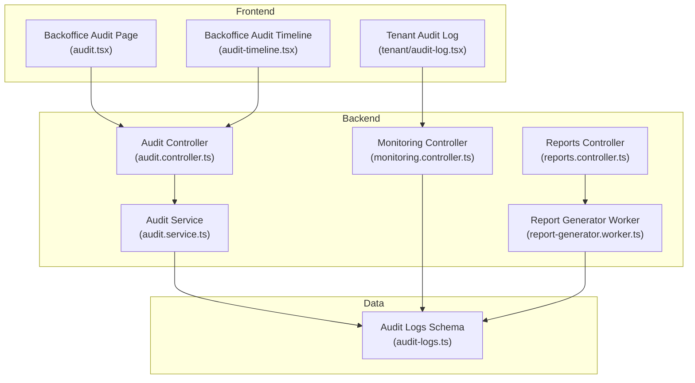
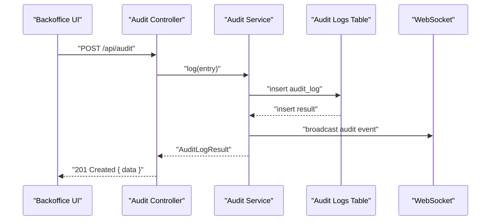
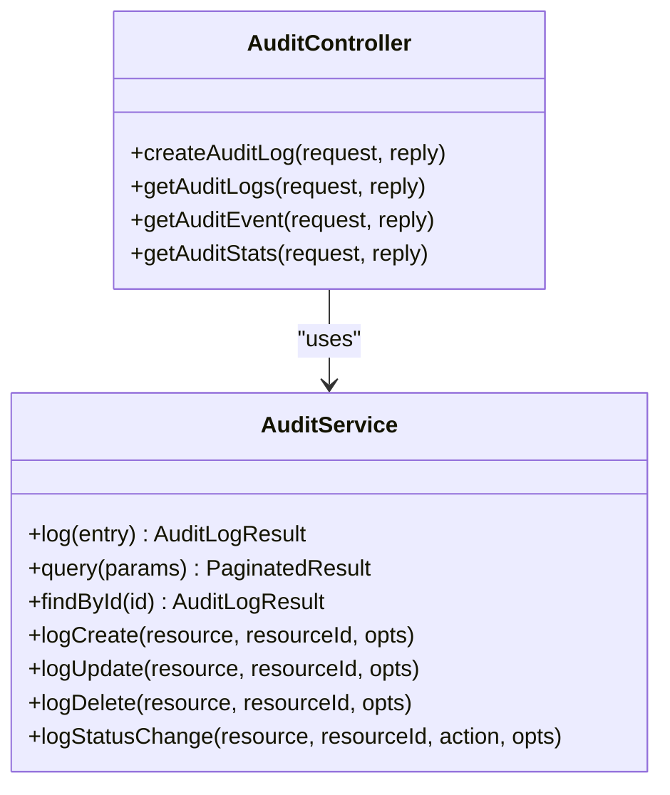
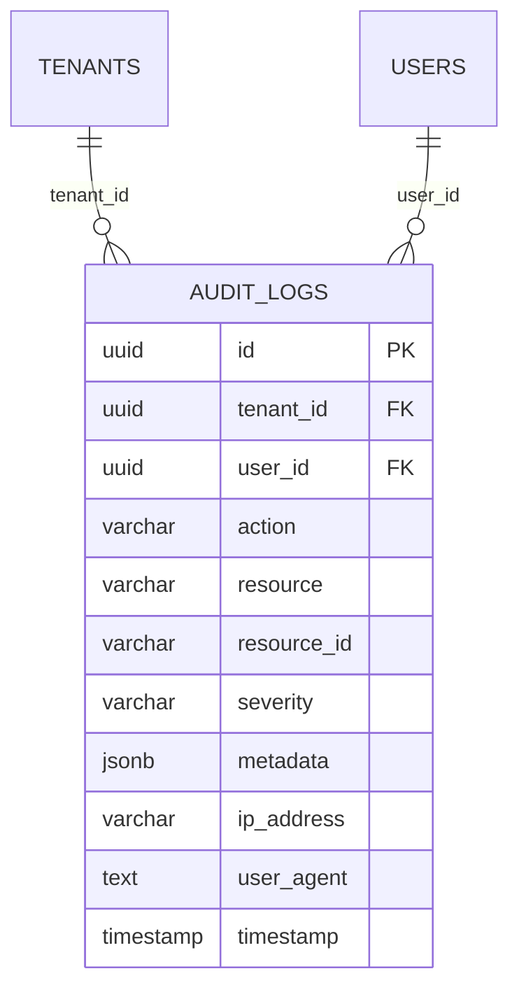
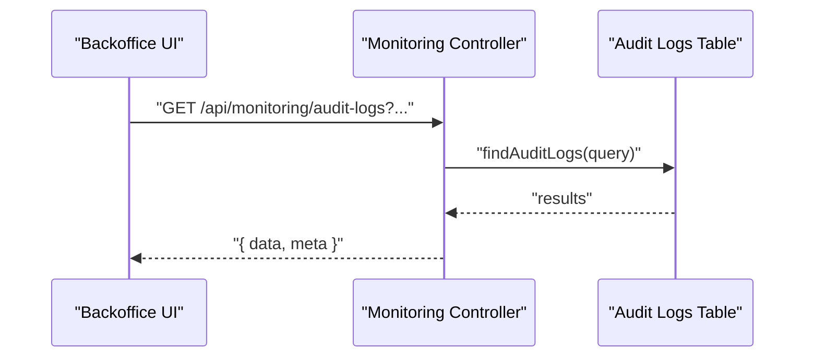
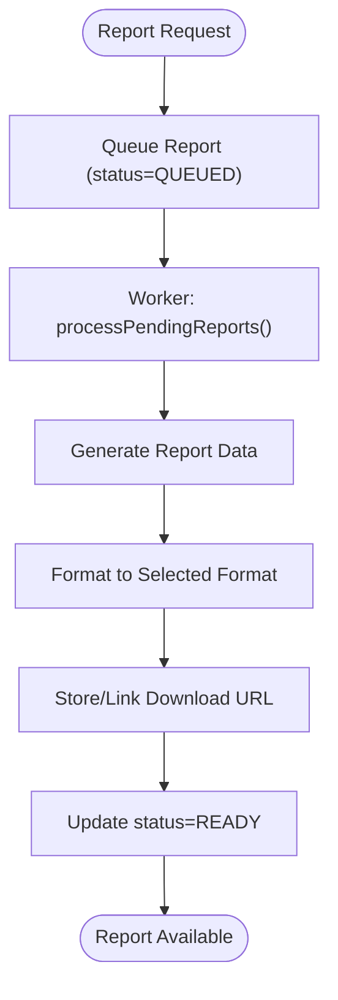
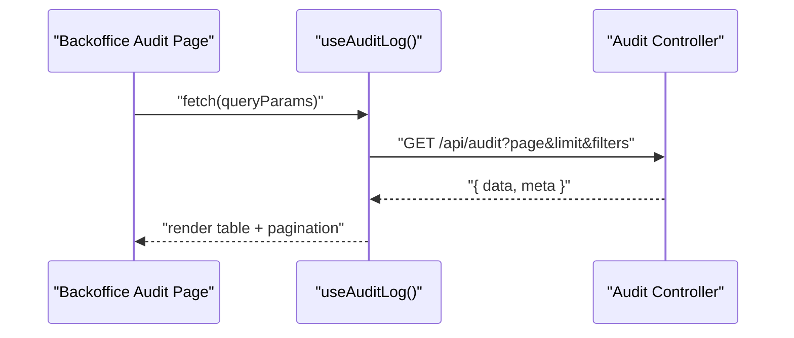
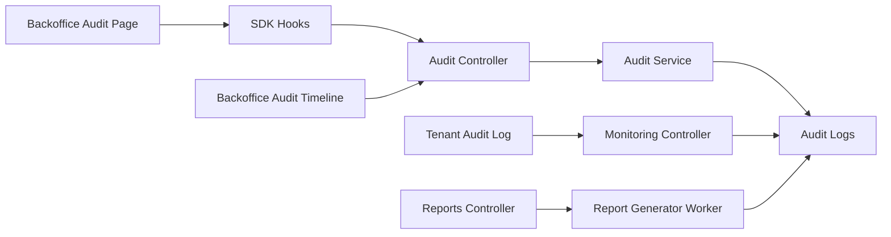

# Audit & Compliance

<cite>
**Referenced Files in This Document**
- [apps/api/src/core/audit/audit.service.ts](file://apps/api/src/core/audit/audit.service.ts)
- [apps/api/src/modules/audit/audit.controller.ts](file://apps/api/src/modules/audit/audit.controller.ts)
- [packages/database-schema/src/compliance/audit-logs.ts](file://packages/database-schema/src/compliance/audit-logs.ts)
- [apps/api/src/modules/monitoring/monitoring.controller.ts](file://apps/api/src/modules/monitoring/monitoring.controller.ts)
- [apps/api/src/modules/reports/reports.controller.ts](file://apps/api/src/modules/reports/reports.controller.ts)
- [apps/api/src/workers/report-generator.worker.ts](file://apps/api/src/workers/report-generator.worker.ts)
- [apps/backoffice/src/routes/audit.tsx](file://apps/backoffice/src/routes/audit.tsx)
- [apps/backoffice/src/routes/audit-timeline.tsx](file://apps/backoffice/src/routes/audit-timeline.tsx)
- [apps/backoffice/src/routes/tenant/audit-log.tsx](file://apps/backoffice/src/routes/tenant/audit-log.tsx)
- [docs/reference/ssa-l-compliance.md](file://docs/reference/ssa-l-compliance.md)
- [docs/digilist-platform/audit.md](file://docs/digilist-platform/audit.md)
- [scripts/scan-compliance.mjs](file://scripts/scan-compliance.mjs)
</cite>

## Table of Contents
1. [Introduction](#introduction)
2. [Project Structure](#project-structure)
3. [Core Components](#core-components)
4. [Architecture Overview](#architecture-overview)
5. [Detailed Component Analysis](#detailed-component-analysis)
6. [Dependency Analysis](#dependency-analysis)
7. [Performance Considerations](#performance-considerations)
8. [Troubleshooting Guide](#troubleshooting-guide)
9. [Conclusion](#conclusion)
10. [Appendices](#appendices)

## Introduction
This document describes the Audit and Compliance capabilities implemented across the platform. It covers audit log viewing, timeline analysis, compliance reporting, audit trail management, activity monitoring, and compliance tracking. It also documents report generation, data export capabilities, regulatory compliance tools, audit timeline visualization, compliance dashboards, and automated reporting features. The documentation explains integration with the audit service, monitoring system, and compliance frameworks, and outlines audit policy enforcement, compliance monitoring, and regulatory reporting features.

## Project Structure
The Audit and Compliance features span backend APIs, database schemas, and frontend dashboards:
- Backend audit service and API endpoints for logging and querying audit events
- Database schema for audit logs with tenant and user isolation
- Frontend dashboards for audit log viewing, timeline analysis, and tenant-wide audit logs
- Reporting and monitoring controllers for compliance dashboards and incident management
- Compliance scanning and SSA-L matrix for regulatory alignment

**Diagram sources**
- [apps/backoffice/src/routes/audit.tsx](file://apps/backoffice/src/routes/audit.tsx#L1-L810)
- [apps/backoffice/src/routes/audit-timeline.tsx](file://apps/backoffice/src/routes/audit-timeline.tsx#L1-L270)
- [apps/backoffice/src/routes/tenant/audit-log.tsx](file://apps/backoffice/src/routes/tenant/audit-log.tsx#L1-L258)
- [apps/api/src/modules/audit/audit.controller.ts](file://apps/api/src/modules/audit/audit.controller.ts#L1-L137)
- [apps/api/src/modules/monitoring/monitoring.controller.ts](file://apps/api/src/modules/monitoring/monitoring.controller.ts#L1-L133)
- [apps/api/src/modules/reports/reports.controller.ts](file://apps/api/src/modules/reports/reports.controller.ts#L1-L201)
- [apps/api/src/workers/report-generator.worker.ts](file://apps/api/src/workers/report-generator.worker.ts#L1-L314)
- [apps/api/src/core/audit/audit.service.ts](file://apps/api/src/core/audit/audit.service.ts#L1-L278)
- [packages/database-schema/src/compliance/audit-logs.ts](file://packages/database-schema/src/compliance/audit-logs.ts#L1-L35)

**Section sources**
- [apps/api/src/core/audit/audit.service.ts](file://apps/api/src/core/audit/audit.service.ts#L1-L278)
- [apps/api/src/modules/audit/audit.controller.ts](file://apps/api/src/modules/audit/audit.controller.ts#L1-L137)
- [packages/database-schema/src/compliance/audit-logs.ts](file://packages/database-schema/src/compliance/audit-logs.ts#L1-L35)
- [apps/api/src/modules/monitoring/monitoring.controller.ts](file://apps/api/src/modules/monitoring/monitoring.controller.ts#L1-L133)
- [apps/api/src/modules/reports/reports.controller.ts](file://apps/api/src/modules/reports/reports.controller.ts#L1-L201)
- [apps/api/src/workers/report-generator.worker.ts](file://apps/api/src/workers/report-generator.worker.ts#L1-L314)
- [apps/backoffice/src/routes/audit.tsx](file://apps/backoffice/src/routes/audit.tsx#L1-L810)
- [apps/backoffice/src/routes/audit-timeline.tsx](file://apps/backoffice/src/routes/audit-timeline.tsx#L1-L270)
- [apps/backoffice/src/routes/tenant/audit-log.tsx](file://apps/backoffice/src/routes/tenant/audit-log.tsx#L1-L258)

## Core Components
- Audit Service: Centralized logging and querying of audit events with WebSocket broadcasting for real-time updates. Supports structured metadata, tenant/user context, and severity levels.
- Audit Controller: REST endpoints for creating audit logs, querying logs with filters, retrieving single events, and computing statistics.
- Audit Logs Schema: Database schema with tenant isolation, indexing for efficient querying, and JSON metadata support.
- Monitoring Controller: Endpoints for audit logs, alerts, and incidents, enabling compliance dashboards and incident tracking.
- Reports Controller and Worker: Endpoints for report templates and generation, plus a background worker supporting multiple formats and scheduled cleanup.
- Frontend Dashboards: Backoffice audit log viewer, timeline analysis, and tenant-wide audit log page with filtering, pagination, and export readiness.

**Section sources**
- [apps/api/src/core/audit/audit.service.ts](file://apps/api/src/core/audit/audit.service.ts#L74-L220)
- [apps/api/src/modules/audit/audit.controller.ts](file://apps/api/src/modules/audit/audit.controller.ts#L14-L136)
- [packages/database-schema/src/compliance/audit-logs.ts](file://packages/database-schema/src/compliance/audit-logs.ts#L16-L31)
- [apps/api/src/modules/monitoring/monitoring.controller.ts](file://apps/api/src/modules/monitoring/monitoring.controller.ts#L25-L131)
- [apps/api/src/modules/reports/reports.controller.ts](file://apps/api/src/modules/reports/reports.controller.ts#L17-L200)
- [apps/api/src/workers/report-generator.worker.ts](file://apps/api/src/workers/report-generator.worker.ts#L20-L128)
- [apps/backoffice/src/routes/audit.tsx](file://apps/backoffice/src/routes/audit.tsx#L102-L220)
- [apps/backoffice/src/routes/audit-timeline.tsx](file://apps/backoffice/src/routes/audit-timeline.tsx#L72-L115)
- [apps/backoffice/src/routes/tenant/audit-log.tsx](file://apps/backoffice/src/routes/tenant/audit-log.tsx#L80-L126)

## Architecture Overview
The audit and compliance architecture integrates backend services, database persistence, and frontend dashboards:
- Audit events are logged via the Audit Service and persisted to the audit logs table.
- Real-time updates are broadcast to WebSocket clients.
- Frontend dashboards query the Audit Controller for filtered views and statistics.
- Monitoring endpoints expose audit logs, alerts, and incidents for compliance dashboards.
- Reports are generated asynchronously by the Report Generator Worker and stored for later retrieval.

**Diagram sources**
- [apps/api/src/modules/audit/audit.controller.ts](file://apps/api/src/modules/audit/audit.controller.ts#L19-L48)
- [apps/api/src/core/audit/audit.service.ts](file://apps/api/src/core/audit/audit.service.ts#L84-L120)
- [packages/database-schema/src/compliance/audit-logs.ts](file://packages/database-schema/src/compliance/audit-logs.ts#L16-L31)

**Section sources**
- [apps/api/src/modules/audit/audit.controller.ts](file://apps/api/src/modules/audit/audit.controller.ts#L14-L136)
- [apps/api/src/core/audit/audit.service.ts](file://apps/api/src/core/audit/audit.service.ts#L74-L220)
- [packages/database-schema/src/compliance/audit-logs.ts](file://packages/database-schema/src/compliance/audit-logs.ts#L16-L31)

## Detailed Component Analysis

### Audit Service and Controller
- Audit Service provides:
  - Structured logging with tenantId, userId, action, resource, resourceId, severity, metadata, IP, and User-Agent
  - Query API with filtering by tenant, user, resource, action, resource ID, severity, and date range
  - Pagination and statistics computation
  - Real-time WebSocket broadcasting for audit events
- Audit Controller exposes:
  - Endpoint to create audit logs from client-side
  - Endpoint to query audit logs with filters and pagination
  - Endpoint to fetch a single event by ID
  - Endpoint to compute audit statistics for the last 24 hours

**Diagram sources**
- [apps/api/src/core/audit/audit.service.ts](file://apps/api/src/core/audit/audit.service.ts#L74-L220)
- [apps/api/src/modules/audit/audit.controller.ts](file://apps/api/src/modules/audit/audit.controller.ts#L14-L136)

**Section sources**
- [apps/api/src/core/audit/audit.service.ts](file://apps/api/src/core/audit/audit.service.ts#L74-L220)
- [apps/api/src/modules/audit/audit.controller.ts](file://apps/api/src/modules/audit/audit.controller.ts#L14-L136)

### Audit Logs Schema
- The audit logs table supports:
  - UUID primary key
  - Tenant and user foreign keys with cascade and set-null behaviors
  - Action, resource, and resourceId fields
  - Severity with default value
  - Metadata as JSONB
  - IP address and user agent
  - Timestamp with default now
  - Indexes on tenantId/timestamp and resource/resourceId for efficient querying

**Diagram sources**
- [packages/database-schema/src/compliance/audit-logs.ts](file://packages/database-schema/src/compliance/audit-logs.ts#L16-L31)

**Section sources**
- [packages/database-schema/src/compliance/audit-logs.ts](file://packages/database-schema/src/compliance/audit-logs.ts#L16-L31)

### Monitoring and Incidents
- Monitoring Controller provides:
  - Query endpoints for audit logs with tenant scoping
  - Alerts CRUD operations (create, acknowledge, resolve)
  - Incidents CRUD operations (create, update status, fetch by ID)
- These endpoints support compliance dashboards and incident tracking workflows.

**Diagram sources**
- [apps/api/src/modules/monitoring/monitoring.controller.ts](file://apps/api/src/modules/monitoring/monitoring.controller.ts#L25-L38)
- [packages/database-schema/src/compliance/audit-logs.ts](file://packages/database-schema/src/compliance/audit-logs.ts#L16-L31)

**Section sources**
- [apps/api/src/modules/monitoring/monitoring.controller.ts](file://apps/api/src/modules/monitoring/monitoring.controller.ts#L25-L131)

### Reports and Export Capabilities
- Reports Controller:
  - Templates and generation endpoints
  - Listing, usage, revenue, booking, and organization reports
  - User-scoped report listing and status retrieval
- Report Generator Worker:
  - Background processing of queued reports
  - Support for multiple formats (PDF, XLSX, CSV, JSON)
  - Cleanup of old reports

**Diagram sources**
- [apps/api/src/modules/reports/reports.controller.ts](file://apps/api/src/modules/reports/reports.controller.ts#L27-L64)
- [apps/api/src/workers/report-generator.worker.ts](file://apps/api/src/workers/report-generator.worker.ts#L31-L128)

**Section sources**
- [apps/api/src/modules/reports/reports.controller.ts](file://apps/api/src/modules/reports/reports.controller.ts#L17-L200)
- [apps/api/src/workers/report-generator.worker.ts](file://apps/api/src/workers/report-generator.worker.ts#L20-L128)

### Frontend Audit Dashboards
- Backoffice Audit Page:
  - Filtering by resource type, action type, and date range
  - Search across user, resource, and resource ID
  - Pagination and drawer-based event details with metadata
- Audit Timeline Page:
  - Timeline visualization of decisions with outcome badges and export readiness
- Tenant Audit Log Page:
  - Tenant-wide audit log with severity and type filters, stats cards, and export readiness

**Diagram sources**
- [apps/backoffice/src/routes/audit.tsx](file://apps/backoffice/src/routes/audit.tsx#L146-L159)
- [apps/api/src/modules/audit/audit.controller.ts](file://apps/api/src/modules/audit/audit.controller.ts#L53-L82)

**Section sources**
- [apps/backoffice/src/routes/audit.tsx](file://apps/backoffice/src/routes/audit.tsx#L102-L220)
- [apps/backoffice/src/routes/audit-timeline.tsx](file://apps/backoffice/src/routes/audit-timeline.tsx#L72-L115)
- [apps/backoffice/src/routes/tenant/audit-log.tsx](file://apps/backoffice/src/routes/tenant/audit-log.tsx#L80-L126)

### Compliance Framework and Regulatory Alignment
- SSA-L Compliance Matrix:
  - Maps statutory agreement requirements to implementation status and roadmap references
  - Highlights areas such as role separation, audit logging, traceability, access control, authentication, availability, GDPR, change management, and documentation
- Compliance Scanning:
  - Automated scanner for design system tokens and accessibility/layout rules
  - Generates reports and action items categorized by severity

**Section sources**
- [docs/reference/ssa-l-compliance.md](file://docs/reference/ssa-l-compliance.md#L28-L91)
- [scripts/scan-compliance.mjs](file://scripts/scan-compliance.mjs#L514-L666)

## Dependency Analysis
The audit and compliance subsystems exhibit clear separation of concerns:
- Frontend dashboards depend on SDK hooks and backend controllers
- Controllers depend on services and repositories
- Services depend on the database adapter and schema
- Workers operate independently and interact with the database and storage abstraction

**Diagram sources**
- [apps/backoffice/src/routes/audit.tsx](file://apps/backoffice/src/routes/audit.tsx#L27-L32)
- [apps/api/src/modules/audit/audit.controller.ts](file://apps/api/src/modules/audit/audit.controller.ts#L14-L136)
- [apps/api/src/core/audit/audit.service.ts](file://apps/api/src/core/audit/audit.service.ts#L74-L220)
- [packages/database-schema/src/compliance/audit-logs.ts](file://packages/database-schema/src/compliance/audit-logs.ts#L16-L31)
- [apps/api/src/modules/monitoring/monitoring.controller.ts](file://apps/api/src/modules/monitoring/monitoring.controller.ts#L25-L131)
- [apps/api/src/modules/reports/reports.controller.ts](file://apps/api/src/modules/reports/reports.controller.ts#L17-L200)
- [apps/api/src/workers/report-generator.worker.ts](file://apps/api/src/workers/report-generator.worker.ts#L20-L128)

**Section sources**
- [apps/api/src/core/audit/audit.service.ts](file://apps/api/src/core/audit/audit.service.ts#L74-L220)
- [apps/api/src/modules/audit/audit.controller.ts](file://apps/api/src/modules/audit/audit.controller.ts#L14-L136)
- [apps/api/src/modules/monitoring/monitoring.controller.ts](file://apps/api/src/modules/monitoring/monitoring.controller.ts#L25-L131)
- [apps/api/src/modules/reports/reports.controller.ts](file://apps/api/src/modules/reports/reports.controller.ts#L17-L200)
- [apps/api/src/workers/report-generator.worker.ts](file://apps/api/src/workers/report-generator.worker.ts#L20-L128)
- [apps/backoffice/src/routes/audit.tsx](file://apps/backoffice/src/routes/audit.tsx#L27-L32)

## Performance Considerations
- Audit Service query performance relies on database indexes on tenantId/timestamp and resource/resourceId.
- Pagination limits reduce payload sizes for large datasets.
- WebSocket broadcasting should be monitored for connection churn and memory usage.
- Report generation runs asynchronously to avoid blocking API responses; consider queue depth and worker concurrency.
- Frontend filtering and search should be debounced to minimize network requests.

[No sources needed since this section provides general guidance]

## Troubleshooting Guide
- Audit events not appearing:
  - Verify Audit Controller endpoint is reachable and tenant/user context is present.
  - Confirm Audit Service logging and database insert operations succeed.
- Real-time audit stream not received:
  - Check WebSocket connection lifecycle and broadcast logic.
- Audit statistics incorrect:
  - Validate date range filters and 24-hour calculation logic.
- Report generation failures:
  - Inspect worker logs for errors and update report status to FAILED with metadata.
- Compliance scanning issues:
  - Review scanner output and action items; ensure design tokens are used consistently.

**Section sources**
- [apps/api/src/core/audit/audit.service.ts](file://apps/api/src/core/audit/audit.service.ts#L58-L72)
- [apps/api/src/modules/audit/audit.controller.ts](file://apps/api/src/modules/audit/audit.controller.ts#L104-L135)
- [apps/api/src/workers/report-generator.worker.ts](file://apps/api/src/workers/report-generator.worker.ts#L110-L127)
- [scripts/scan-compliance.mjs](file://scripts/scan-compliance.mjs#L728-L740)

## Conclusion
The platform implements a robust audit and compliance framework with structured logging, real-time streaming, comprehensive filtering, and frontend dashboards. The monitoring and reporting subsystems enable compliance dashboards, incident tracking, and automated report generation. Regulatory alignment is documented through the SSA-L matrix, while design system compliance scanning ensures adherence to standards. Together, these components provide strong audit trail management, activity monitoring, and compliance tracking capabilities.

[No sources needed since this section summarizes without analyzing specific files]

## Appendices

### Audit and Compliance Features Checklist
- Audit logging for all mutations with tenant/user context
- Real-time audit stream via WebSocket
- Filtering and pagination for audit logs
- Statistics computation for recent activity
- Monitoring endpoints for alerts and incidents
- Reports controller and worker for scheduled exports
- Frontend dashboards for audit viewing and timeline analysis
- Compliance scanning and SSA-L matrix documentation

**Section sources**
- [apps/api/src/core/audit/audit.service.ts](file://apps/api/src/core/audit/audit.service.ts#L84-L120)
- [apps/api/src/modules/audit/audit.controller.ts](file://apps/api/src/modules/audit/audit.controller.ts#L53-L135)
- [apps/api/src/modules/monitoring/monitoring.controller.ts](file://apps/api/src/modules/monitoring/monitoring.controller.ts#L25-L131)
- [apps/api/src/modules/reports/reports.controller.ts](file://apps/api/src/modules/reports/reports.controller.ts#L27-L200)
- [apps/api/src/workers/report-generator.worker.ts](file://apps/api/src/workers/report-generator.worker.ts#L31-L128)
- [apps/backoffice/src/routes/audit.tsx](file://apps/backoffice/src/routes/audit.tsx#L146-L220)
- [apps/backoffice/src/routes/audit-timeline.tsx](file://apps/backoffice/src/routes/audit-timeline.tsx#L116-L181)
- [apps/backoffice/src/routes/tenant/audit-log.tsx](file://apps/backoffice/src/routes/tenant/audit-log.tsx#L174-L254)
- [docs/reference/ssa-l-compliance.md](file://docs/reference/ssa-l-compliance.md#L28-L91)
- [scripts/scan-compliance.mjs](file://scripts/scan-compliance.mjs#L514-L666)