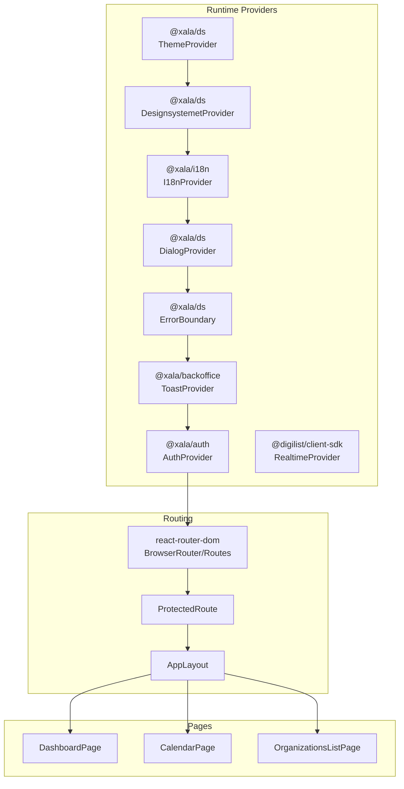
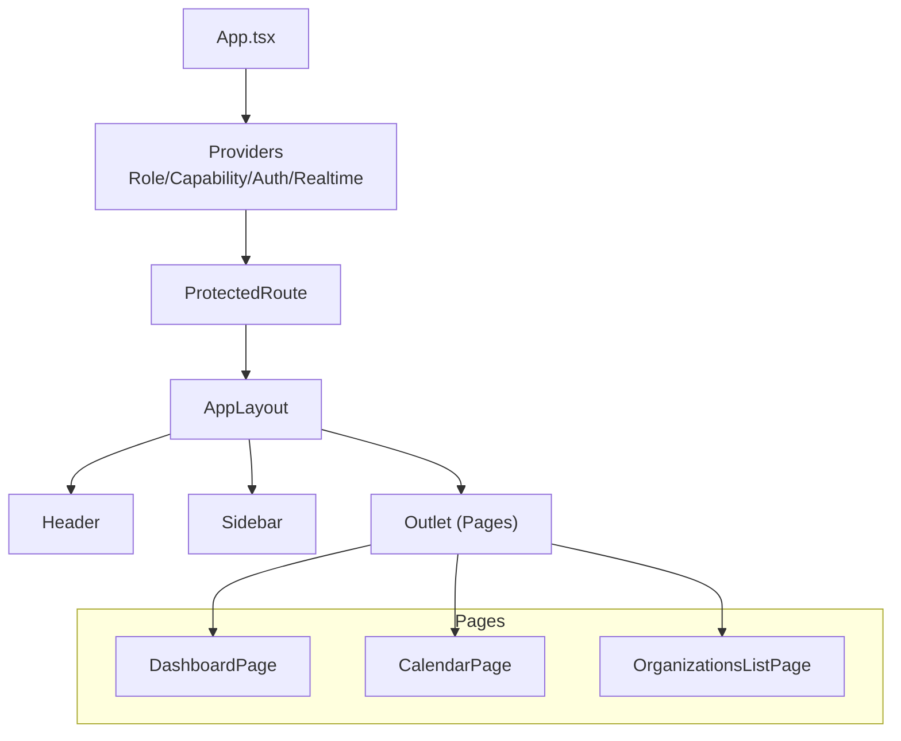
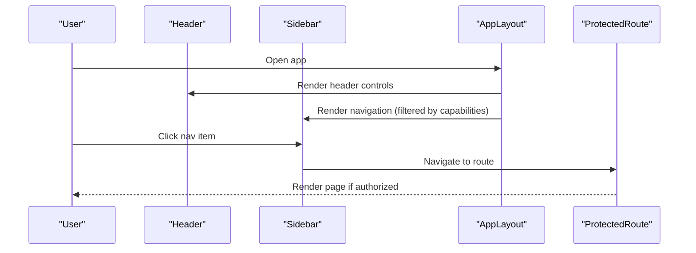
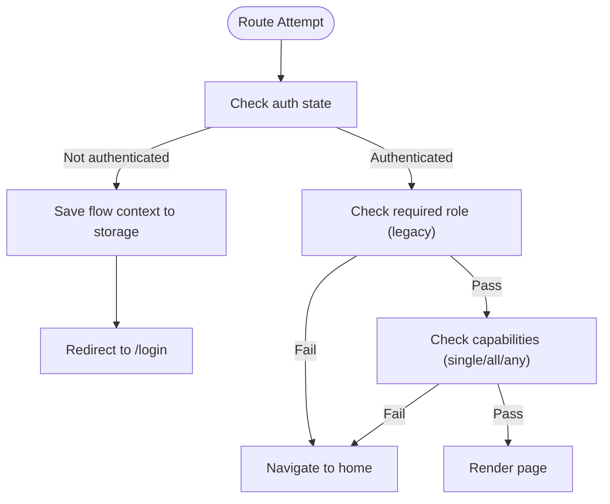
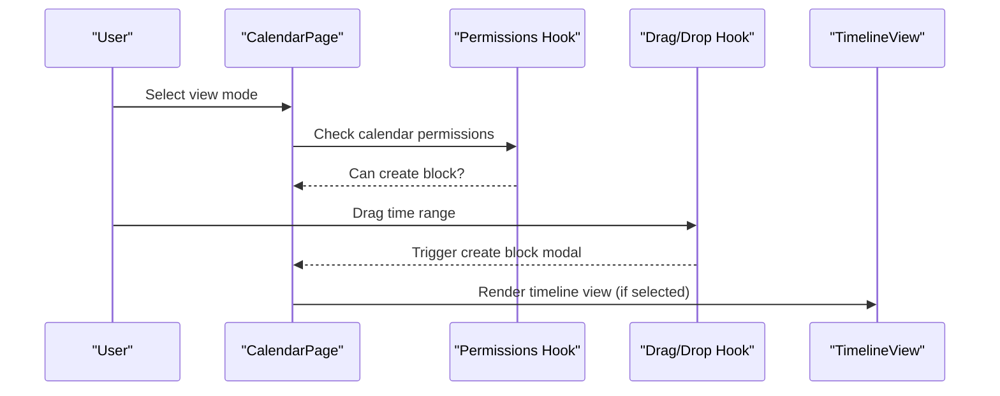
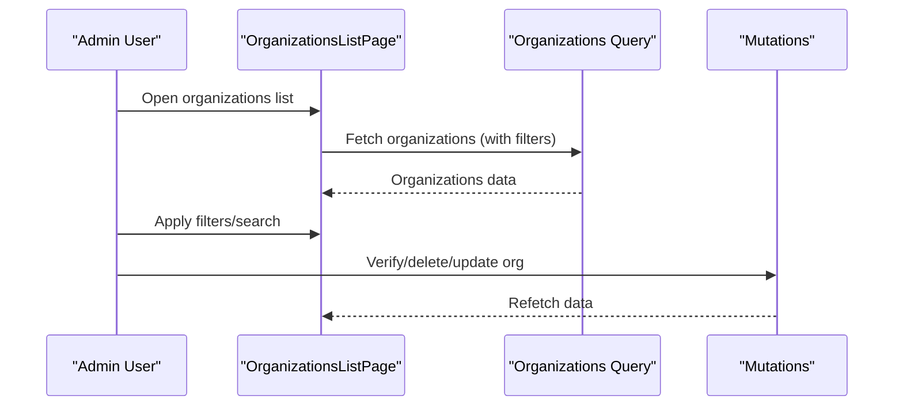
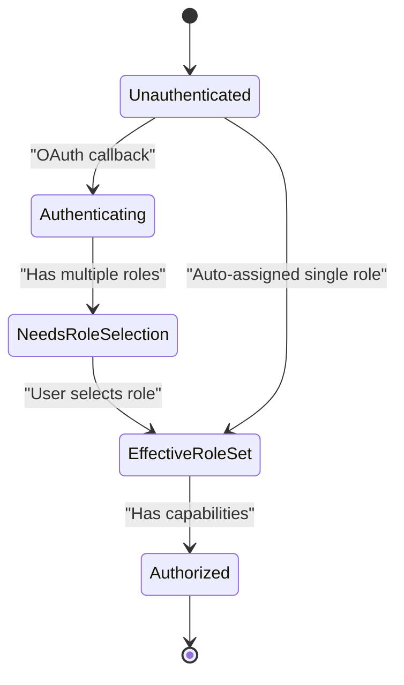
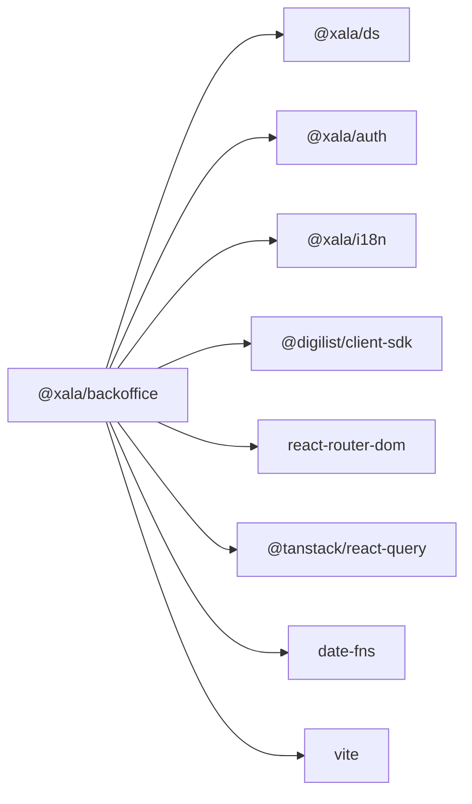

# Backoffice Application

<cite>
**Referenced Files in This Document**
- [package.json](file://apps/backoffice/package.json)
- [App.tsx](file://apps/backoffice/src/App.tsx)
- [main.tsx](file://apps/backoffice/src/main.tsx)
- [AppLayout.tsx](file://apps/backoffice/src/components/layout/AppLayout.tsx)
- [Header.tsx](file://apps/backoffice/src/components/layout/Header.tsx)
- [Sidebar.tsx](file://apps/backoffice/src/components/layout/Sidebar.tsx)
- [ProtectedRoute.tsx](file://apps/backoffice/src/components/ProtectedRoute.tsx)
- [BackofficeRoleProvider.tsx](file://apps/backoffice/src/providers/BackofficeRoleProvider.tsx)
- [CapabilityProvider.tsx](file://apps/backoffice/src/providers/CapabilityProvider.tsx)
- [capabilities.ts](file://apps/backoffice/src/lib/capabilities.ts)
- [useBackofficeRole.ts](file://apps/backoffice/src/hooks/useBackofficeRole.ts)
- [useCapabilities.ts](file://apps/backoffice/src/hooks/useCapabilities.ts)
- [dashboard.tsx](file://apps/backoffice/src/routes/dashboard.tsx)
- [calendar.tsx](file://apps/backoffice/src/routes/calendar.tsx)
- [OrganizationsListPage.tsx](file://apps/backoffice/src/routes/organizations/OrganizationsListPage.tsx)
</cite>

## Table of Contents
1. [Introduction](#introduction)
2. [Project Structure](#project-structure)
3. [Core Components](#core-components)
4. [Architecture Overview](#architecture-overview)
5. [Detailed Component Analysis](#detailed-component-analysis)
6. [Dependency Analysis](#dependency-analysis)
7. [Performance Considerations](#performance-considerations)
8. [Troubleshooting Guide](#troubleshooting-guide)
9. [Conclusion](#conclusion)
10. [Appendices](#appendices)

## Introduction
This document describes the Backoffice Application, the property manager and admin interface for the platform. It covers the admin-focused architecture with sidebar navigation, header controls, and responsive layout management. It explains the feature modules (calendar management, organization administration, user management, notification reports, and settings configuration), the role-based access control (RBAC) and capability-based routing, administrative workflows, component library usage, form handling patterns, data visualization components, and build and deployment specifics for this administrative application.

## Project Structure
The Backoffice application is a React application built with Vite, TypeScript, and the internal Design System (@xala/ds). It integrates authentication, role management, capability-based permissions, and real-time updates via a client SDK. Routing is handled by React Router DOM, with lazy-loaded pages and protected routes.

**Diagram sources**
- [App.tsx](file://apps/backoffice/src/App.tsx#L104-L119)
- [main.tsx](file://apps/backoffice/src/main.tsx#L11-L33)
- [AppLayout.tsx](file://apps/backoffice/src/components/layout/AppLayout.tsx#L102-L162)
- [ProtectedRoute.tsx](file://apps/backoffice/src/components/ProtectedRoute.tsx#L100-L273)

**Section sources**
- [package.json](file://apps/backoffice/package.json#L1-L36)
- [App.tsx](file://apps/backoffice/src/App.tsx#L1-L120)
- [main.tsx](file://apps/backoffice/src/main.tsx#L1-L34)

## Core Components
- Application shell and routing: App.tsx orchestrates providers, routing, and lazy-loaded pages.
- Layout: AppLayout renders a responsive layout with a desktop sidebar and mobile bottom navigation.
- Header: Header provides theme toggle, notifications, settings, and user menu.
- Sidebar: Sidebar builds navigation dynamically from capabilities and roles.
- ProtectedRoute: Enforces authentication, role, and capability-based access checks with session-safe return-to flow.
- Role and capability providers: BackofficeRoleProvider and CapabilityProvider manage effective roles and capability checks.
- Hooks: useBackofficeRole and useCapabilities expose role and capability state and helpers.

**Section sources**
- [App.tsx](file://apps/backoffice/src/App.tsx#L87-L445)
- [AppLayout.tsx](file://apps/backoffice/src/components/layout/AppLayout.tsx#L29-L164)
- [Header.tsx](file://apps/backoffice/src/components/layout/Header.tsx#L25-L294)
- [Sidebar.tsx](file://apps/backoffice/src/components/layout/Sidebar.tsx#L200-L544)
- [ProtectedRoute.tsx](file://apps/backoffice/src/components/ProtectedRoute.tsx#L100-L273)
- [BackofficeRoleProvider.tsx](file://apps/backoffice/src/providers/BackofficeRoleProvider.tsx#L69-L245)
- [CapabilityProvider.tsx](file://apps/backoffice/src/providers/CapabilityProvider.tsx#L67-L170)
- [useBackofficeRole.ts](file://apps/backoffice/src/hooks/useBackofficeRole.ts#L95-L150)
- [useCapabilities.ts](file://apps/backoffice/src/hooks/useCapabilities.ts#L143-L178)

## Architecture Overview
The Backoffice uses a layered architecture:
- Presentation layer: Pages and components (AppLayout, Header, Sidebar, ProtectedRoute).
- Domain layer: Feature modules (calendar, organizations, settings).
- Infrastructure layer: Providers (role, capability, auth, realtime), SDK integration, and routing.
- Data layer: React Query for caching and refetching, with real-time updates.

**Diagram sources**
- [App.tsx](file://apps/backoffice/src/App.tsx#L122-L445)
- [AppLayout.tsx](file://apps/backoffice/src/components/layout/AppLayout.tsx#L29-L164)
- [ProtectedRoute.tsx](file://apps/backoffice/src/components/ProtectedRoute.tsx#L100-L273)

## Detailed Component Analysis

### Layout and Navigation
- Responsive layout: Desktop shows a persistent sidebar; mobile shows a bottom navigation bar.
- Header controls: Theme toggle, notifications, settings, and user menu with logout.
- Sidebar navigation: Built from capability checks; sections are grouped and filtered per user’s capabilities.

**Diagram sources**
- [AppLayout.tsx](file://apps/backoffice/src/components/layout/AppLayout.tsx#L29-L164)
- [Header.tsx](file://apps/backoffice/src/components/layout/Header.tsx#L25-L294)
- [Sidebar.tsx](file://apps/backoffice/src/components/layout/Sidebar.tsx#L200-L544)
- [ProtectedRoute.tsx](file://apps/backoffice/src/components/ProtectedRoute.tsx#L100-L273)

**Section sources**
- [AppLayout.tsx](file://apps/backoffice/src/components/layout/AppLayout.tsx#L29-L164)
- [Header.tsx](file://apps/backoffice/src/components/layout/Header.tsx#L25-L294)
- [Sidebar.tsx](file://apps/backoffice/src/components/layout/Sidebar.tsx#L200-L544)

### Role-Based Access Control and Capability-Based Routing
- Dual-role support: Users can be admin or case_handler; the system persists effective role and supports role switching.
- Capability matrix: Fine-grained capabilities define UI surfaces and feature access.
- ProtectedRoute enforces:
  - Authentication state
  - Role requirement (legacy)
  - Capability requirements (single, all, any)
  - Session-safe return-to flow for seamless auth transitions

**Diagram sources**
- [ProtectedRoute.tsx](file://apps/backoffice/src/components/ProtectedRoute.tsx#L100-L273)
- [BackofficeRoleProvider.tsx](file://apps/backoffice/src/providers/BackofficeRoleProvider.tsx#L69-L245)
- [CapabilityProvider.tsx](file://apps/backoffice/src/providers/CapabilityProvider.tsx#L67-L170)
- [capabilities.ts](file://apps/backoffice/src/lib/capabilities.ts#L84-L193)

**Section sources**
- [BackofficeRoleProvider.tsx](file://apps/backoffice/src/providers/BackofficeRoleProvider.tsx#L69-L245)
- [CapabilityProvider.tsx](file://apps/backoffice/src/providers/CapabilityProvider.tsx#L67-L170)
- [capabilities.ts](file://apps/backoffice/src/lib/capabilities.ts#L84-L193)
- [ProtectedRoute.tsx](file://apps/backoffice/src/components/ProtectedRoute.tsx#L100-L273)

### Feature Modules

#### Calendar Management
- Real-time calendar view with day/week/month/timeline modes.
- Drag-and-drop creation of blocks, conflict detection, and event drawers.
- Permissions gate creation and editing actions.

**Diagram sources**
- [calendar.tsx](file://apps/backoffice/src/routes/calendar.tsx#L59-L800)

**Section sources**
- [calendar.tsx](file://apps/backoffice/src/routes/calendar.tsx#L59-L800)

#### Organization Administration
- Organization listing with filters (status, actor type), search, verification, and actions (view, edit, delete).
- Admin-only routes guarded by ProtectedRoute with required role "admin".

**Diagram sources**
- [OrganizationsListPage.tsx](file://apps/backoffice/src/routes/organizations/OrganizationsListPage.tsx#L59-L311)
- [App.tsx](file://apps/backoffice/src/App.tsx#L182-L237)

**Section sources**
- [OrganizationsListPage.tsx](file://apps/backoffice/src/routes/organizations/OrganizationsListPage.tsx#L59-L311)
- [App.tsx](file://apps/backoffice/src/App.tsx#L182-L237)

#### User Management
- Admin-only user listing and management routes.
- ProtectedRoute enforces role "admin".

**Section sources**
- [App.tsx](file://apps/backoffice/src/App.tsx#L254-L261)

#### Notification Reports
- Admin-only reports and moderation routes.
- ProtectedRoute enforces role "admin".

**Section sources**
- [App.tsx](file://apps/backoffice/src/App.tsx#L166-L181)

#### Settings Configuration
- Admin-only settings routes.
- ProtectedRoute enforces role "admin".

**Section sources**
- [App.tsx](file://apps/backoffice/src/App.tsx#L262-L269)

### Administrative Workflows
- Role selection: Dual-role users are prompted to select an effective role; selections persist locally.
- Capability-driven UI: Sidebar and page-level guards rely on capability checks rather than roles alone.
- Real-time updates: Calendar and messaging leverage real-time provider for live synchronization.

**Diagram sources**
- [BackofficeRoleProvider.tsx](file://apps/backoffice/src/providers/BackofficeRoleProvider.tsx#L119-L160)
- [ProtectedRoute.tsx](file://apps/backoffice/src/components/ProtectedRoute.tsx#L263-L266)

**Section sources**
- [BackofficeRoleProvider.tsx](file://apps/backoffice/src/providers/BackofficeRoleProvider.tsx#L119-L160)
- [ProtectedRoute.tsx](file://apps/backoffice/src/components/ProtectedRoute.tsx#L263-L266)

### Component Library Usage and Form Handling Patterns
- Design System components: Cards, buttons, badges, tables, dropdowns, and modals are used consistently.
- Form handling patterns: Controlled inputs, mutation hooks for create/update/delete, and optimistic updates with refetch.
- Data visualization: Stat cards, activity feeds, and calendar views with status-based coloring and conflict indicators.

**Section sources**
- [dashboard.tsx](file://apps/backoffice/src/routes/dashboard.tsx#L40-L331)
- [calendar.tsx](file://apps/backoffice/src/routes/calendar.tsx#L59-L800)
- [OrganizationsListPage.tsx](file://apps/backoffice/src/routes/organizations/OrganizationsListPage.tsx#L59-L311)

## Dependency Analysis
The Backoffice depends on:
- Internal packages: @xala/ds, @xala/auth, @xala/i18n, @digilist/client-sdk
- Routing and state: react-router-dom, @tanstack/react-query
- Utilities: date-fns
- Build tooling: Vite, TypeScript

**Diagram sources**
- [package.json](file://apps/backoffice/package.json#L12-L24)

**Section sources**
- [package.json](file://apps/backoffice/package.json#L12-L34)

## Performance Considerations
- Lazy loading: Pages are lazy-loaded to reduce initial bundle size.
- Query caching: React Query caches API responses with a 5-minute stale time and retry policy.
- Real-time updates: RealtimeProvider enables efficient synchronization without polling.
- Skeletons and loading states: Dashboard and calendar pages use skeleton loaders to improve perceived performance.

**Section sources**
- [App.tsx](file://apps/backoffice/src/App.tsx#L21-L60)
- [main.tsx](file://apps/backoffice/src/main.tsx#L18-L25)
- [dashboard.tsx](file://apps/backoffice/src/routes/dashboard.tsx#L74-L164)
- [calendar.tsx](file://apps/backoffice/src/routes/calendar.tsx#L782-L800)

## Troubleshooting Guide
- Authentication loops: ProtectedRoute prevents redirect loops by checking current location and saved flow context.
- Capability denials: ProtectedRoute displays a toast and navigates to home when access is denied.
- Role selection prompts: If a dual-role user hasn’t selected a role, they are redirected to role selection.
- Real-time issues: Calendar uses a real-time provider; toast notifications inform about updates.

**Section sources**
- [ProtectedRoute.tsx](file://apps/backoffice/src/components/ProtectedRoute.tsx#L237-L273)
- [BackofficeRoleProvider.tsx](file://apps/backoffice/src/providers/BackofficeRoleProvider.tsx#L119-L160)
- [calendar.tsx](file://apps/backoffice/src/routes/calendar.tsx#L89-L98)

## Conclusion
The Backoffice Application implements a robust, admin-focused interface with a responsive layout, capability-based navigation, and strict access control. Its modular design, real-time updates, and standardized component usage provide a scalable foundation for property managers and administrators.

## Appendices

### Build System Configuration
- Scripts: dev, build, lint, preview.
- Dependencies: React, React Router DOM, TanStack Query, Design System, Auth, i18n, SDK.
- Dev dependencies: Vite, TypeScript, React plugin, ESLint config.

**Section sources**
- [package.json](file://apps/backoffice/package.json#L6-L34)

### Development Workflow
- Initialize SDK client with environment variables.
- Wrap the app with providers: Theme, I18n, Dialog, ErrorBoundary, Toast, Auth, Realtime.
- Define routes with lazy loading and ProtectedRoute wrappers.
- Use capability hooks for UI and feature gating.

**Section sources**
- [main.tsx](file://apps/backoffice/src/main.tsx#L11-L33)
- [App.tsx](file://apps/backoffice/src/App.tsx#L104-L119)

### Deployment Considerations
- Environment variables: API base URL, tenant ID, license key, WebSocket URL.
- Nginx configuration exists for serving the Backoffice under a subdomain.
- Production readiness includes Sentry integration, real-time provider configuration, and cache policies.

**Section sources**
- [main.tsx](file://apps/backoffice/src/main.tsx#L12-L16)
- [App.tsx](file://apps/backoffice/src/App.tsx#L129-L132)