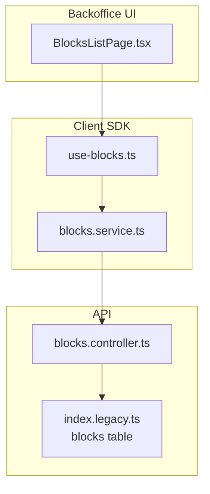
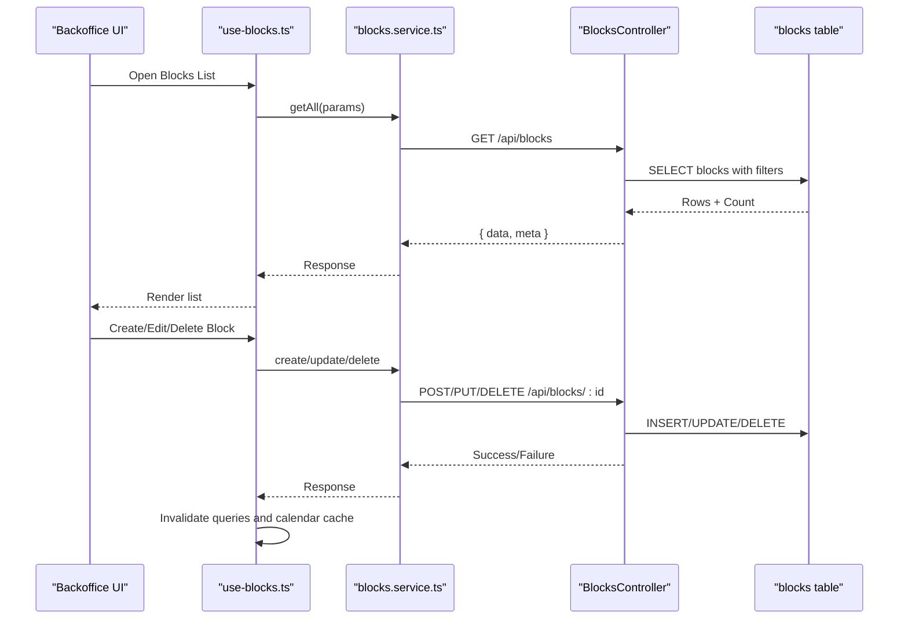
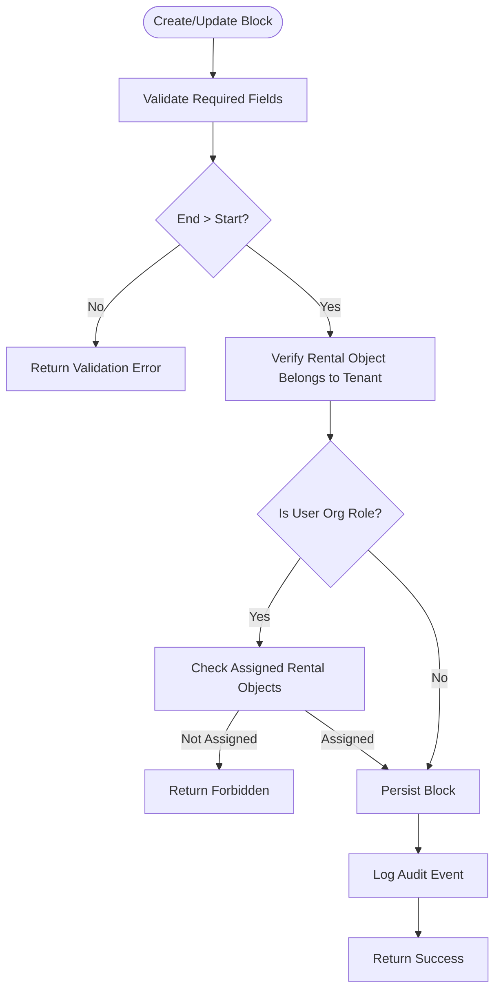
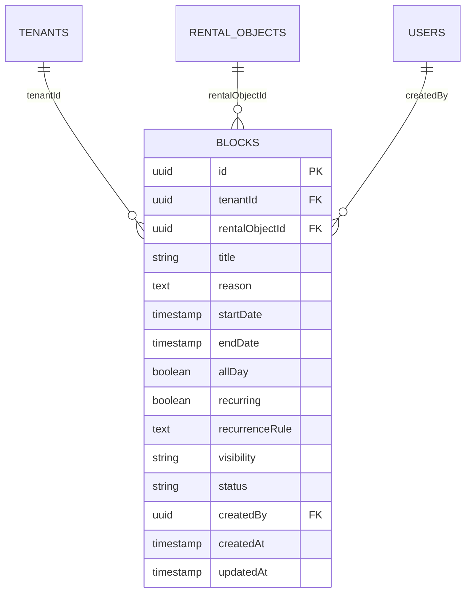
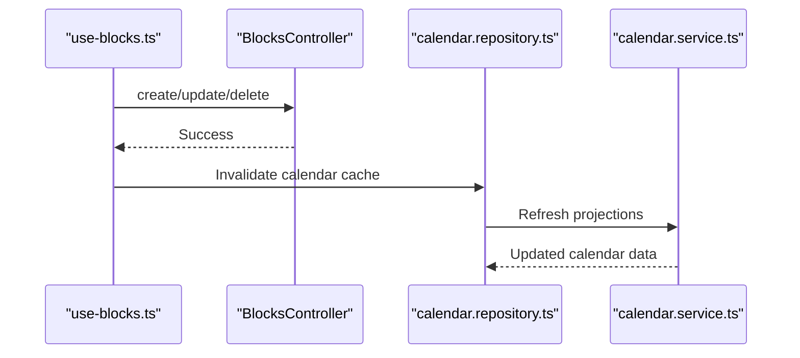
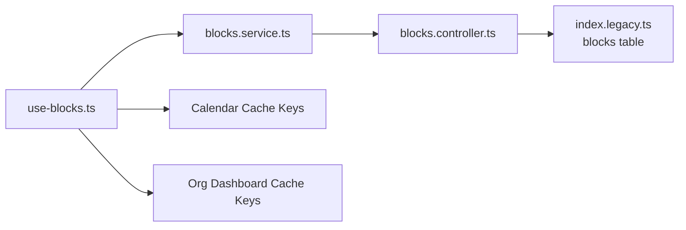

# Blocks Management

<cite>
**Referenced Files in This Document**
- [blocks.controller.ts](file://apps/api/src/modules/blocks/blocks.controller.ts)
- [blocks.service.ts](file://packages/client-sdk/src/services/blocks.service.ts)
- [use-blocks.ts](file://packages/client-sdk/src/hooks/use-blocks.ts)
- [index.legacy.ts](file://apps/api/src/database/schema/index.legacy.ts)
- [index.ts](file://apps/api/src/database/schema/index.ts)
- [BlocksListPage.tsx](file://apps/backoffice/src/routes/blocks/BlocksListPage.tsx)
- [BlocksListPage.tsx](file://apps/backoffice/src/routes/blocks/BlocksListPage.tsx)
- [blocks.spec.ts](file://tests/e2e/backoffice/blur-eye/blocks.spec.ts)
- [org-admin-flow.spec.ts](file://tests/e2e/backoffice/org-admin-flow.spec.ts)
- [calendar.service.ts](file://apps/api/src/modules/calendar/calendar.service.ts)
- [calendar.repository.ts](file://apps/api/src/modules/calendar/calendar.repository.ts)
- [calendar-contracts.spec.ts](file://apps/api/src/modules/calendar/calendar-contracts.spec.ts)
- [permissions.ts](file://apps/api/src/core/permissions.ts)
- [permission-matrix.ts](file://apps/api/src/core/rbac/permission-matrix.ts)
- [types.ts](file://apps/api/sdk/types.ts)
- [api.ts](file://apps/api/sdk/api.ts)
</cite>

## Table of Contents
1. [Introduction](#introduction)
2. [Project Structure](#project-structure)
3. [Core Components](#core-components)
4. [Architecture Overview](#architecture-overview)
5. [Detailed Component Analysis](#detailed-component-analysis)
6. [Dependency Analysis](#dependency-analysis)
7. [Performance Considerations](#performance-considerations)
8. [Troubleshooting Guide](#troubleshooting-guide)
9. [Conclusion](#conclusion)

## Introduction
Blocks Management enables administrators to create, edit, and manage blocking periods and dates for rental objects. These blocks prevent bookings during specified time ranges and integrate with the calendar system to reflect blocked slots as unavailable. The solution supports conflict detection, scope-based filtering for organizational roles, and real-time updates across the calendar feed.

## Project Structure
The Blocks Management feature spans three layers:
- Backend API module exposing CRUD endpoints and conflict checks
- Frontend client SDK providing typed services and React Query hooks
- Backoffice UI pages for listing, viewing, editing, and deleting blocks

**Diagram sources**
- [BlocksListPage.tsx](file://apps/backoffice/src/routes/blocks/BlocksListPage.tsx)
- [blocks.service.ts](file://packages/client-sdk/src/services/blocks.service.ts)
- [use-blocks.ts](file://packages/client-sdk/src/hooks/use-blocks.ts)
- [blocks.controller.ts](file://apps/api/src/modules/blocks/blocks.controller.ts)
- [index.legacy.ts](file://apps/api/src/database/schema/index.legacy.ts)

**Section sources**
- [blocks.controller.ts](file://apps/api/src/modules/blocks/blocks.controller.ts#L1-L563)
- [blocks.service.ts](file://packages/client-sdk/src/services/blocks.service.ts#L1-L100)
- [use-blocks.ts](file://packages/client-sdk/src/hooks/use-blocks.ts#L1-L122)
- [index.legacy.ts](file://apps/api/src/database/schema/index.legacy.ts#L475-L502)
- [BlocksListPage.tsx](file://apps/backoffice/src/routes/blocks/BlocksListPage.tsx)

## Core Components
- BlocksController: Implements endpoints for listing, retrieving, creating, updating, deleting blocks, and checking conflicts. Applies tenant scoping and role-based access controls for org_admin and org_member.
- Blocks Service: Provides typed HTTP client methods for block operations and conflict checks.
- React Query Hooks: Encapsulate caching, invalidation, and optimistic updates for block CRUD and conflict checks.
- Database Schema: Defines the blocks table with tenant isolation, time-range indexing, and foreign key relationships to rental objects and users.

Key capabilities:
- Create blocks with optional recurrence rules and visibility settings
- Edit block metadata and time ranges with validation
- Soft-delete blocks with audit logging
- Conflict detection across active blocks for a given rental object and time window
- Scope filtering for assigned rental objects for organizational roles

**Section sources**
- [blocks.controller.ts](file://apps/api/src/modules/blocks/blocks.controller.ts#L117-L196)
- [blocks.controller.ts](file://apps/api/src/modules/blocks/blocks.controller.ts#L251-L347)
- [blocks.controller.ts](file://apps/api/src/modules/blocks/blocks.controller.ts#L353-L441)
- [blocks.controller.ts](file://apps/api/src/modules/blocks/blocks.controller.ts#L447-L502)
- [blocks.controller.ts](file://apps/api/src/modules/blocks/blocks.controller.ts#L508-L559)
- [blocks.service.ts](file://packages/client-sdk/src/services/blocks.service.ts#L41-L96)
- [use-blocks.ts](file://packages/client-sdk/src/hooks/use-blocks.ts#L27-L121)
- [index.legacy.ts](file://apps/api/src/database/schema/index.legacy.ts#L475-L502)

## Architecture Overview
The Blocks Management workflow integrates with the calendar system so that blocked periods appear as unavailable slots. Conflict checks ensure no overlapping blocks exist for the same rental object within a time window.

**Diagram sources**
- [BlocksListPage.tsx](file://apps/backoffice/src/routes/blocks/BlocksListPage.tsx)
- [use-blocks.ts](file://packages/client-sdk/src/hooks/use-blocks.ts#L58-L105)
- [blocks.service.ts](file://packages/client-sdk/src/services/blocks.service.ts#L41-L96)
- [blocks.controller.ts](file://apps/api/src/modules/blocks/blocks.controller.ts#L117-L196)

## Detailed Component Analysis

### BlocksController
Responsibilities:
- List blocks with optional filters (rental object, date range, status, pagination)
- Retrieve a single block by ID
- Create blocks with validation and tenant/role checks
- Update blocks with validation and tenant/role checks
- Delete blocks with audit logging
- Check conflicts across active blocks for a rental object and time window

Scope enforcement:
- For org_admin and org_member roles, filters results to rental objects assigned via case handler scopes or access grants.

Conflict detection:
- Overlap logic ensures no two active blocks coexist for the same rental object within the queried time window.

Audit logging:
- Logs create/update/delete actions with metadata for traceability.

**Diagram sources**
- [blocks.controller.ts](file://apps/api/src/modules/blocks/blocks.controller.ts#L251-L347)
- [blocks.controller.ts](file://apps/api/src/modules/blocks/blocks.controller.ts#L353-L441)

**Section sources**
- [blocks.controller.ts](file://apps/api/src/modules/blocks/blocks.controller.ts#L117-L196)
- [blocks.controller.ts](file://apps/api/src/modules/blocks/blocks.controller.ts#L251-L347)
- [blocks.controller.ts](file://apps/api/src/modules/blocks/blocks.controller.ts#L353-L441)
- [blocks.controller.ts](file://apps/api/src/modules/blocks/blocks.controller.ts#L447-L502)
- [blocks.controller.ts](file://apps/api/src/modules/blocks/blocks.controller.ts#L508-L559)

### Blocks Service and React Query Hooks
- blocks.service.ts exposes typed methods for:
  - Retrieving lists and details
  - Creating, updating, and deleting blocks
  - Checking conflicts with rental object and time parameters
- use-blocks.ts provides:
  - Queries for blocks lists and details
  - Mutations for create/update/delete with cache invalidation
  - Conflict checks with automatic query enabling when parameters are present

Integration touchpoints:
- After successful mutations, queries are invalidated to refresh the calendar and organization dashboard caches.

**Section sources**
- [blocks.service.ts](file://packages/client-sdk/src/services/blocks.service.ts#L41-L96)
- [use-blocks.ts](file://packages/client-sdk/src/hooks/use-blocks.ts#L27-L121)

### Database Schema: Blocks Table
The blocks table enforces:
- Tenant isolation via tenantId
- Rental object linkage via rentalObjectId
- Time-range constraints with all-day and recurrence support
- Visibility and status fields
- CreatedBy linkage to users
- Indexes for efficient queries by tenant, rental object, time range, and status

**Diagram sources**
- [index.legacy.ts](file://apps/api/src/database/schema/index.legacy.ts#L475-L502)
- [index.ts](file://apps/api/src/database/schema/index.ts#L118-L122)

**Section sources**
- [index.legacy.ts](file://apps/api/src/database/schema/index.legacy.ts#L475-L502)
- [index.ts](file://apps/api/src/database/schema/index.ts#L118-L122)

### Calendar Integration and Availability Management
- Calendar rendering treats blocks as unavailable slots for the affected rental object.
- When blocks are created, updated, or deleted, the calendar cache is invalidated to reflect real-time changes.
- Conflict checks leverage the calendar’s time-window overlap logic to prevent scheduling collisions.

**Diagram sources**
- [use-blocks.ts](file://packages/client-sdk/src/hooks/use-blocks.ts#L63-L103)
- [calendar.repository.ts](file://apps/api/src/modules/calendar/calendar.repository.ts)
- [calendar.service.ts](file://apps/api/src/modules/calendar/calendar.service.ts)

**Section sources**
- [use-blocks.ts](file://packages/client-sdk/src/hooks/use-blocks.ts#L63-L103)
- [calendar.repository.ts](file://apps/api/src/modules/calendar/calendar.repository.ts)
- [calendar.service.ts](file://apps/api/src/modules/calendar/calendar.service.ts)

### Block Detail Views and Editing Workflows
- Backoffice UI provides:
  - BlocksListPage with actions to edit and delete blocks
  - Navigation to edit and detail pages for individual blocks
- The list page supports:
  - Bulk operations via selection and batch actions
  - Filtering by rental object, date range, and status
  - Pagination with limit/offset

**Section sources**
- [BlocksListPage.tsx](file://apps/backoffice/src/routes/blocks/BlocksListPage.tsx#L280-L311)

### Block Types, Visibility, and Recurrence
- Block types:
  - Period-based blocks for date ranges
  - Optional recurrence rules for repeated blocks
- Visibility:
  - Public, internal, private visibility levels influence who can see blocks
- Status:
  - Active blocks are considered unavailable; cancelled blocks are excluded from conflict checks

**Section sources**
- [blocks.controller.ts](file://apps/api/src/modules/blocks/blocks.controller.ts#L41-L63)
- [index.legacy.ts](file://apps/api/src/database/schema/index.legacy.ts#L486-L487)

### Blocking Rules Configuration and Scope Enforcement
- Scope enforcement:
  - For org_admin and org_member, only rental objects in their assigned scope are returned
- Role-based permissions:
  - Permissions include blocks:read, blocks:create, blocks:delete
  - Additional user_blocks:manage permission exists for user-level block management

**Section sources**
- [blocks.controller.ts](file://apps/api/src/modules/blocks/blocks.controller.ts#L76-L108)
- [permissions.ts](file://apps/api/src/core/permissions.ts#L60-L63)
- [permissions.ts](file://apps/api/src/core/permissions.ts#L205)
- [permission-matrix.ts](file://apps/api/src/core/rbac/permission-matrix.ts#L63)
- [permission-matrix.ts](file://apps/api/src/core/rbac/permission-matrix.ts#L82)

### Search, Filtering, and Bulk Operations
- Search and filtering:
  - Query parameters for rentalObjectId, from/to date range, status, scope (all/assigned), limit, and offset
- Bulk operations:
  - The list UI supports selecting multiple blocks for batch deletion or status updates

**Section sources**
- [blocks.controller.ts](file://apps/api/src/modules/blocks/blocks.controller.ts#L31-L39)
- [blocks.service.ts](file://packages/client-sdk/src/services/blocks.service.ts#L14-L22)
- [BlocksListPage.tsx](file://apps/backoffice/src/routes/blocks/BlocksListPage.tsx#L280-L311)

### Block Scheduling, Resource Blocking, and Maintenance Management
- Scheduling:
  - Blocks scheduled via the UI trigger backend creation with validation and conflict checks
- Resource blocking:
  - Blocks apply to specific rental objects; multiple blocks can exist concurrently per object
- Maintenance management:
  - Blocks can represent maintenance windows; visibility and status fields support operational workflows

**Section sources**
- [blocks.controller.ts](file://apps/api/src/modules/blocks/blocks.controller.ts#L251-L347)
- [blocks.controller.ts](file://apps/api/src/modules/blocks/blocks.controller.ts#L508-L559)
- [index.legacy.ts](file://apps/api/src/database/schema/index.legacy.ts#L486-L487)

### Integration with Calendar System and Real-time Updates
- Real-time updates:
  - After block mutations, calendar cache invalidation ensures immediate UI refresh
- Calendar repository/service:
  - Provide the underlying mechanisms to refresh projections and render unavailable slots

**Section sources**
- [use-blocks.ts](file://packages/client-sdk/src/hooks/use-blocks.ts#L63-L103)
- [calendar.repository.ts](file://apps/api/src/modules/calendar/calendar.repository.ts)
- [calendar.service.ts](file://apps/api/src/modules/calendar/calendar.service.ts)

## Dependency Analysis
- Controller depends on:
  - Drizzle ORM schema for blocks, rental objects, users, case handler scopes, and access grants
  - Audit service for logging
- Service depends on:
  - Client factory for HTTP requests
- Hooks depend on:
  - React Query for caching and invalidation
  - Calendar and organization dashboard query keys for cache synchronization

**Diagram sources**
- [use-blocks.ts](file://packages/client-sdk/src/hooks/use-blocks.ts#L58-L105)
- [blocks.service.ts](file://packages/client-sdk/src/services/blocks.service.ts#L41-L96)
- [blocks.controller.ts](file://apps/api/src/modules/blocks/blocks.controller.ts#L117-L196)
- [index.legacy.ts](file://apps/api/src/database/schema/index.legacy.ts#L475-L502)

**Section sources**
- [use-blocks.ts](file://packages/client-sdk/src/hooks/use-blocks.ts#L58-L105)
- [blocks.service.ts](file://packages/client-sdk/src/services/blocks.service.ts#L41-L96)
- [blocks.controller.ts](file://apps/api/src/modules/blocks/blocks.controller.ts#L117-L196)
- [index.legacy.ts](file://apps/api/src/database/schema/index.legacy.ts#L475-L502)

## Performance Considerations
- Index usage:
  - Tenant, rental object, time-range, and status indexes optimize filtering and conflict checks
- Pagination:
  - Limit and offset parameters reduce payload sizes for large datasets
- Conflict checks:
  - Overlap logic leverages indexed time ranges for efficient computation
- Cache invalidation:
  - Minimal, targeted invalidation reduces unnecessary re-fetches while keeping UI consistent

[No sources needed since this section provides general guidance]

## Troubleshooting Guide
Common issues and resolutions:
- Validation errors:
  - Missing required fields or invalid date ranges return structured validation errors
- Not found errors:
  - Attempting to access non-existent blocks returns 404 with error details
- Forbidden errors:
  - Users without permission for a rental object receive 403
- Feature disabled:
  - When blocks module is disabled for a tenant, navigation is protected and UI hides related entries

Testing references:
- E2E tests verify route protection and UI behavior when the blocks feature is disabled
- Calendar contract tests validate soft deletion semantics for blocks

**Section sources**
- [blocks.controller.ts](file://apps/api/src/modules/blocks/blocks.controller.ts#L234-L244)
- [blocks.controller.ts](file://apps/api/src/modules/blocks/blocks.controller.ts#L258-L278)
- [blocks.controller.ts](file://apps/api/src/modules/blocks/blocks.controller.ts#L296-L307)
- [org-admin-flow.spec.ts](file://tests/e2e/backoffice/org-admin-flow.spec.ts#L1292-L1347)
- [blocks.spec.ts](file://tests/e2e/backoffice/blur-eye/blocks.spec.ts)
- [calendar-contracts.spec.ts](file://apps/api/src/modules/calendar/calendar-contracts.spec.ts#L181-L204)

## Conclusion
Blocks Management provides a robust, permission-aware system for scheduling and managing rental object blocks. It integrates tightly with the calendar system, supports conflict detection, and offers real-time updates through cache invalidation. The combination of typed SDK services, React Query hooks, and strict validation ensures reliable workflows for administrators across the platform.