# Booking Management

<cite>
**Referenced Files in This Document**
- [booking.service.ts](file://apps/api/src/modules/booking/booking.service.ts)
- [booking.controller.ts](file://apps/api/src/modules/booking/booking.controller.ts)
- [booking.repository.ts](file://apps/api/src/modules/booking/booking.repository.ts)
- [booking.schema.ts](file://apps/api/src/schemas/booking.schema.ts)
- [booking.mapper.ts](file://apps/api/src/modules/booking/booking.mapper.ts)
- [notification.service.ts](file://apps/api/src/modules/notification-system/notification.service.ts)
- [calendar.service.ts](file://apps/api/src/modules/calendar/calendar.service.ts)
- [availability.service.ts](file://apps/api/src/modules/availability/availability.service.ts)
- [booking-approval.test.ts](file://apps/api/src/modules/booking/__tests__/booking-approval.test.ts)
- [recurring-booking.test.ts](file://apps/api/src/modules/booking/__tests__/recurring-booking.test.ts)
- [booking-flow.spec.ts](file://apps/api/tests/e2e/booking-flow.spec.ts)
</cite>

## Table of Contents
1. [Introduction](#introduction)
2. [Project Structure](#project-structure)
3. [Core Components](#core-components)
4. [Architecture Overview](#architecture-overview)
5. [Detailed Component Analysis](#detailed-component-analysis)
6. [Dependency Analysis](#dependency-analysis)
7. [Performance Considerations](#performance-considerations)
8. [Troubleshooting Guide](#troubleshooting-guide)
9. [Conclusion](#conclusion)

## Introduction
This document provides comprehensive documentation for the Booking Management functionality within the platform. It covers booking approval workflows, pending booking management, state transitions, detail views, approval and rejection processes, integration with the booking service and repository patterns, real-time updates, search and filtering, bulk operations, conflict resolution and availability checking, calendar integration, reporting and receipts, and notification workflows. The goal is to enable both technical and non-technical stakeholders to understand how bookings are created, managed, and integrated across the system.

## Project Structure
The booking management system is implemented as a cohesive module within the API application, following layered architecture principles:
- Controllers define REST endpoints and enforce RBAC permissions
- Services encapsulate business logic, including availability checks, approvals, and recurring booking workflows
- Repositories manage data access with pagination, filtering, and optimistic locking
- Schemas validate request/response payloads
- Mappers transform database entities into UI-ready projections
- Integrations provide calendar, availability, and notification services

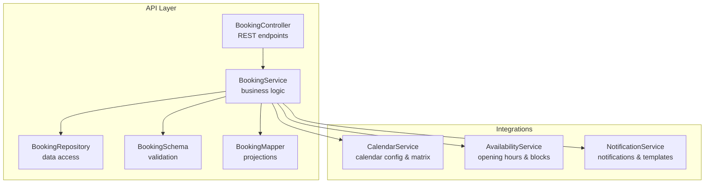

**Diagram sources**
- [booking.controller.ts](file://apps/api/src/modules/booking/booking.controller.ts#L21-L418)
- [booking.service.ts](file://apps/api/src/modules/booking/booking.service.ts#L43-L1240)
- [booking.repository.ts](file://apps/api/src/modules/booking/booking.repository.ts#L12-L288)
- [booking.schema.ts](file://apps/api/src/schemas/booking.schema.ts#L1-L485)
- [booking.mapper.ts](file://apps/api/src/modules/booking/booking.mapper.ts#L1-L654)
- [calendar.service.ts](file://apps/api/src/modules/calendar/calendar.service.ts#L74-L668)
- [availability.service.ts](file://apps/api/src/modules/availability/availability.service.ts#L32-L457)
- [notification.service.ts](file://apps/api/src/modules/notification-system/notification.service.ts#L33-L369)

**Section sources**
- [booking.controller.ts](file://apps/api/src/modules/booking/booking.controller.ts#L21-L418)
- [booking.service.ts](file://apps/api/src/modules/booking/booking.service.ts#L43-L1240)
- [booking.repository.ts](file://apps/api/src/modules/booking/booking.repository.ts#L12-L288)
- [booking.schema.ts](file://apps/api/src/schemas/booking.schema.ts#L1-L485)
- [booking.mapper.ts](file://apps/api/src/modules/booking/booking.mapper.ts#L1-L654)
- [calendar.service.ts](file://apps/api/src/modules/calendar/calendar.service.ts#L74-L668)
- [availability.service.ts](file://apps/api/src/modules/availability/availability.service.ts#L32-L457)
- [notification.service.ts](file://apps/api/src/modules/notification-system/notification.service.ts#L33-L369)

## Core Components
- BookingController: Exposes REST endpoints for listing, retrieving, creating, updating, confirming, cancelling, completing, approving, denying, pricing calculation, recurring previews, and receipts. It enforces RBAC permissions and delegates to the service layer.
- BookingService: Implements core business logic including availability checks with buffer time, optimistic locking, status transitions, case handler scope enforcement, recurring booking creation with conflict policies, and real-time event broadcasting.
- BookingRepository: Provides data access with filters, pagination, joins for organization-scoped access, optimistic locking via version increments, and conflict detection for date ranges.
- BookingSchema: Defines validation schemas for bookings, queries, recurring selections, and preview/result projections.
- BookingMapper: Transforms database entities into UI-ready DTOs for cards, details, receipts, and calendar events.
- CalendarService: Generates calendar configuration and availability matrices for listings, enforcing scope checks for access.
- AvailabilityService: Manages opening hours, exception days, monthly availability calendars, and slot availability checks.
- NotificationService: Handles notification creation, templating, scheduling, and dispatch across channels, integrating with booking lifecycle events.

**Section sources**
- [booking.controller.ts](file://apps/api/src/modules/booking/booking.controller.ts#L21-L418)
- [booking.service.ts](file://apps/api/src/modules/booking/booking.service.ts#L43-L1240)
- [booking.repository.ts](file://apps/api/src/modules/booking/booking.repository.ts#L12-L288)
- [booking.schema.ts](file://apps/api/src/schemas/booking.schema.ts#L1-L485)
- [booking.mapper.ts](file://apps/api/src/modules/booking/booking.mapper.ts#L1-L654)
- [calendar.service.ts](file://apps/api/src/modules/calendar/calendar.service.ts#L74-L668)
- [availability.service.ts](file://apps/api/src/modules/availability/availability.service.ts#L32-L457)
- [notification.service.ts](file://apps/api/src/modules/notification-system/notification.service.ts#L33-L369)

## Architecture Overview
The booking system follows a layered architecture with clear separation of concerns:
- Presentation: Controllers handle HTTP requests and responses, apply RBAC, and validate inputs using schemas.
- Application: Services orchestrate business rules, coordinate repositories, and integrate with external services (calendar, availability, notifications).
- Persistence: Repositories encapsulate data access, provide pagination and filtering, and enforce optimistic locking.
- Integration: Services integrate with calendar and availability services for configuration and conflict detection, and with the notification service for user communications.

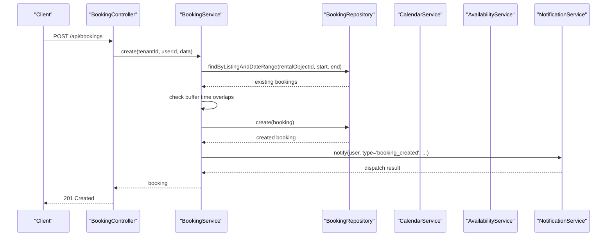

**Diagram sources**
- [booking.controller.ts](file://apps/api/src/modules/booking/booking.controller.ts#L73-L80)
- [booking.service.ts](file://apps/api/src/modules/booking/booking.service.ts#L54-L138)
- [booking.repository.ts](file://apps/api/src/modules/booking/booking.repository.ts#L151-L164)
- [notification.service.ts](file://apps/api/src/modules/notification-system/notification.service.ts#L59-L125)

**Section sources**
- [booking.controller.ts](file://apps/api/src/modules/booking/booking.controller.ts#L21-L418)
- [booking.service.ts](file://apps/api/src/modules/booking/booking.service.ts#L43-L1240)
- [booking.repository.ts](file://apps/api/src/modules/booking/booking.repository.ts#L12-L288)
- [notification.service.ts](file://apps/api/src/modules/notification-system/notification.service.ts#L33-L369)

## Detailed Component Analysis

### Booking Approval Workflows
The approval and rejection workflows are designed for case handlers and administrators with strict scope enforcement:
- Approval endpoint accepts an optional reason and stores approver identity and timestamp in metadata.
- Denial endpoint validates scope via case handler scopes and appends denial reason to notes if provided.
- Both operations trigger audit logs and real-time event broadcasts.

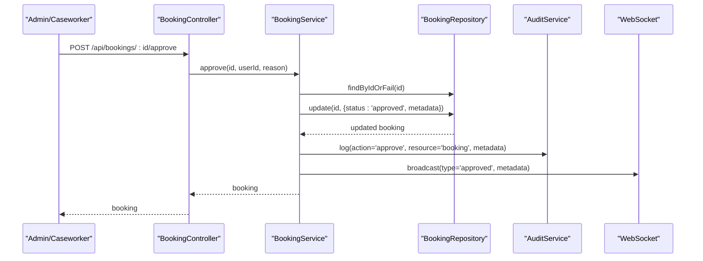

**Diagram sources**
- [booking.controller.ts](file://apps/api/src/modules/booking/booking.controller.ts#L122-L134)
- [booking.service.ts](file://apps/api/src/modules/booking/booking.service.ts#L126-L159)
- [booking.repository.ts](file://apps/api/src/modules/booking/booking.repository.ts#L226-L282)

**Section sources**
- [booking.controller.ts](file://apps/api/src/modules/booking/booking.controller.ts#L110-L161)
- [booking.service.ts](file://apps/api/src/modules/booking/booking.service.ts#L126-L408)
- [booking-approval.test.ts](file://apps/api/src/modules/booking/__tests__/booking-approval.test.ts#L58-L123)

### Pending Booking Management and State Transitions
Pending bookings are subject to approval or rejection. The system supports additional state transitions:
- Confirm: moves from pending to confirmed with optimistic locking
- Cancel: sets status to cancelled with reason stored
- Complete: marks booking as completed with optimistic locking
- Update/Update Status: generic updates with version control

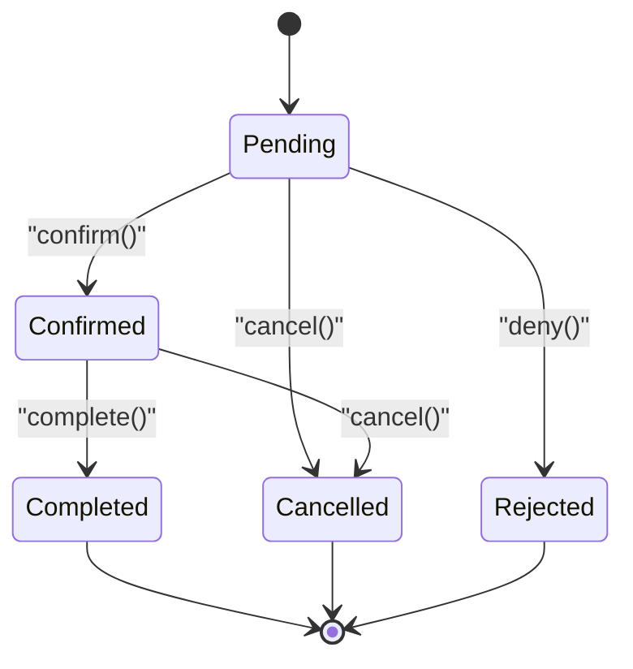

**Diagram sources**
- [booking.service.ts](file://apps/api/src/modules/booking/booking.service.ts#L165-L268)
- [booking.schema.ts](file://apps/api/src/schemas/booking.schema.ts#L10-L34)

**Section sources**
- [booking.service.ts](file://apps/api/src/modules/booking/booking.service.ts#L165-L497)
- [booking.schema.ts](file://apps/api/src/schemas/booking.schema.ts#L10-L34)

### Booking Detail Views and Projections
The mapper layer transforms database records into UI-ready DTOs:
- Card projection: compact view with status, timing, pricing, flags, and permissions
- Details projection: extended view with timeline, documents, and recurring info
- Receipt projection: structured sales receipt for administrative requirements
- Calendar event projection: event rendering for calendar integration

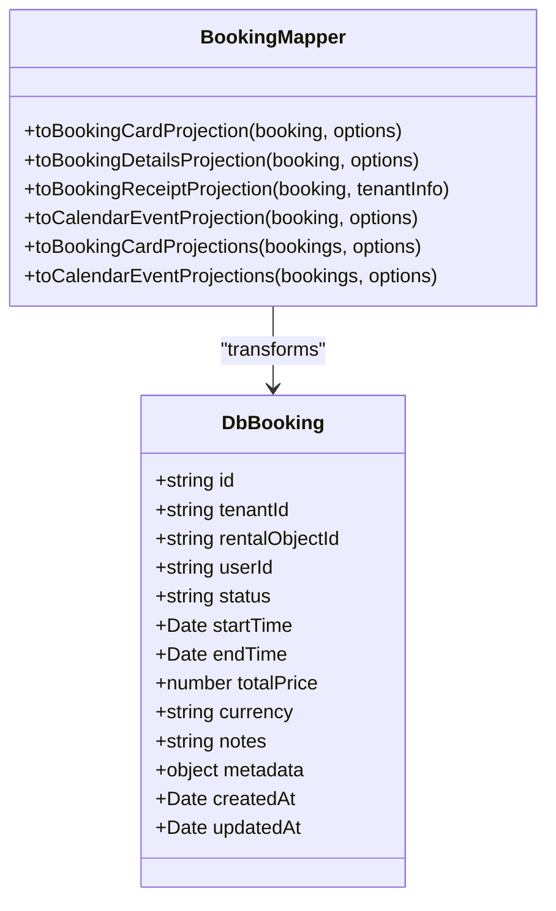

**Diagram sources**
- [booking.mapper.ts](file://apps/api/src/modules/booking/booking.mapper.ts#L429-L654)

**Section sources**
- [booking.mapper.ts](file://apps/api/src/modules/booking/booking.mapper.ts#L429-L654)

### Integration with Booking Service and Repository Patterns
- Service coordinates availability checks, buffer time application, optimistic locking, and event broadcasting
- Repository implements pagination, filters, joins for org-scoped access, and version-based concurrency control
- Schema validations ensure data integrity across endpoints

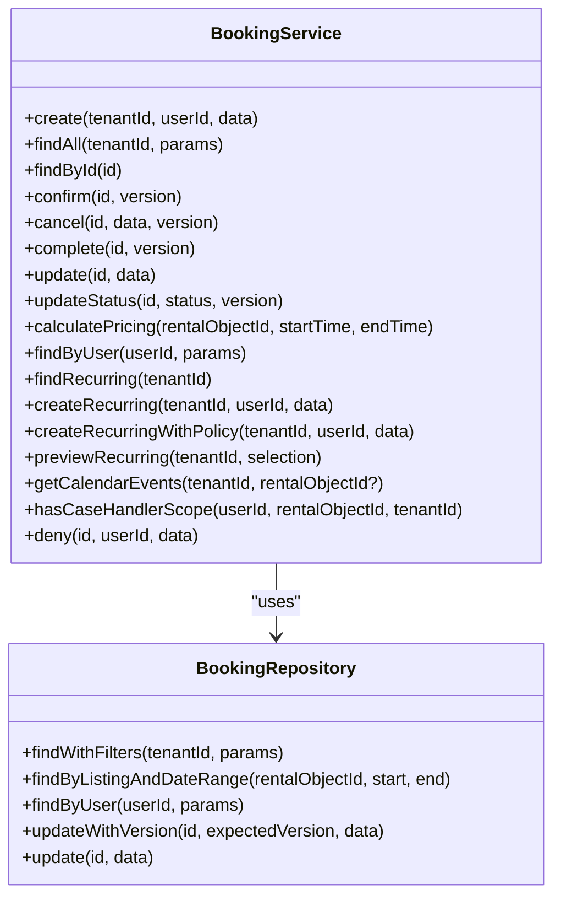

**Diagram sources**
- [booking.service.ts](file://apps/api/src/modules/booking/booking.service.ts#L43-L1240)
- [booking.repository.ts](file://apps/api/src/modules/booking/booking.repository.ts#L12-L288)

**Section sources**
- [booking.service.ts](file://apps/api/src/modules/booking/booking.service.ts#L43-L1240)
- [booking.repository.ts](file://apps/api/src/modules/booking/booking.repository.ts#L12-L288)
- [booking.schema.ts](file://apps/api/src/schemas/booking.schema.ts#L1-L485)

### Real-Time Booking Updates
Real-time updates are broadcasted for booking lifecycle events:
- Creation, confirmation, cancellation, completion, approval, denial, and updates trigger WebSocket broadcasts
- Notifications are dispatched via the notification service with templating and channel routing

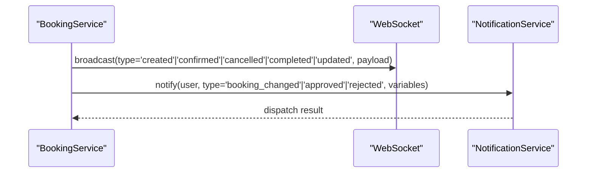

**Diagram sources**
- [booking.service.ts](file://apps/api/src/modules/booking/booking.service.ts#L126-L135)
- [booking.service.ts](file://apps/api/src/modules/booking/booking.service.ts#L181-L190)
- [booking.service.ts](file://apps/api/src/modules/booking/booking.service.ts#L223-L232)
- [booking.service.ts](file://apps/api/src/modules/booking/booking.service.ts#L260-L265)
- [booking.service.ts](file://apps/api/src/modules/booking/booking.service.ts#L395-L405)
- [notification.service.ts](file://apps/api/src/modules/notification-system/notification.service.ts#L59-L125)

**Section sources**
- [booking.service.ts](file://apps/api/src/modules/booking/booking.service.ts#L126-L405)
- [notification.service.ts](file://apps/api/src/modules/notification-system/notification.service.ts#L59-L125)

### Booking Search, Filtering, and Pagination
- Filters include rentalObjectId, userId, orgId (organization-scoped), status, and date range
- Pagination supports page and limit with a maximum limit enforced
- Organization-scoped access leverages joins to listings.organizationId

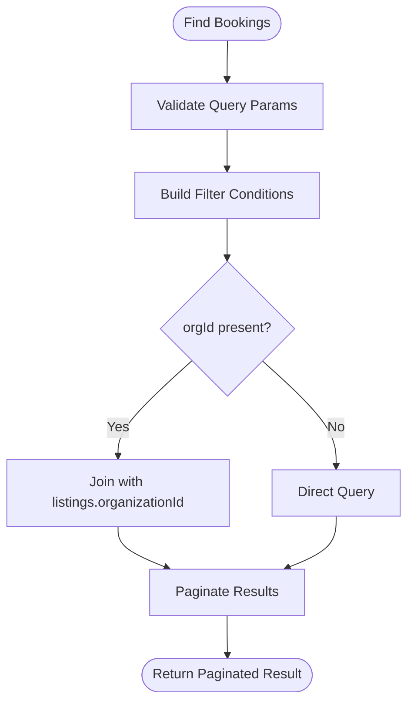

**Diagram sources**
- [booking.repository.ts](file://apps/api/src/modules/booking/booking.repository.ts#L28-L145)
- [booking.schema.ts](file://apps/api/src/schemas/booking.schema.ts#L99-L110)

**Section sources**
- [booking.repository.ts](file://apps/api/src/modules/booking/booking.repository.ts#L28-L145)
- [booking.schema.ts](file://apps/api/src/schemas/booking.schema.ts#L99-L110)

### Bulk Operations and Recurring Bookings
- Recurring preview endpoint generates occurrences with conflict status and summary statistics
- Recurring creation supports policies: stopOnConflict and allowPartial
- Selected occurrence indices can be curated for partial creation
- Series metadata tracks frequency, weekdays, and series identifiers

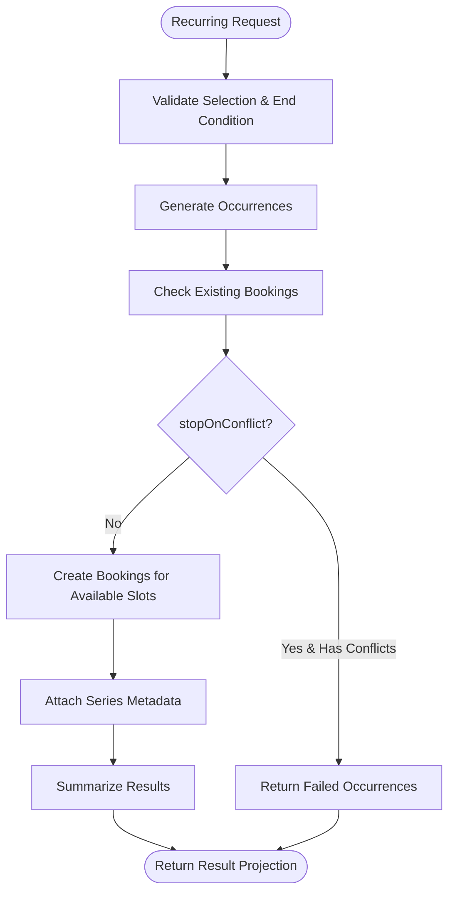

**Diagram sources**
- [booking.service.ts](file://apps/api/src/modules/booking/booking.service.ts#L565-L774)
- [booking.schema.ts](file://apps/api/src/schemas/booking.schema.ts#L283-L424)

**Section sources**
- [booking.service.ts](file://apps/api/src/modules/booking/booking.service.ts#L565-L774)
- [booking.schema.ts](file://apps/api/src/schemas/booking.schema.ts#L283-L424)
- [recurring-booking.test.ts](file://apps/api/src/modules/booking/__tests__/recurring-booking.test.ts#L456-L800)

### Booking Conflict Resolution and Availability Checking
- Availability checks consider buffer time around existing bookings
- Conflict detection compares requested time slots against existing bookings
- Calendar and availability services provide configuration and matrix generation
- Scope enforcement ensures users can only access designated rental objects

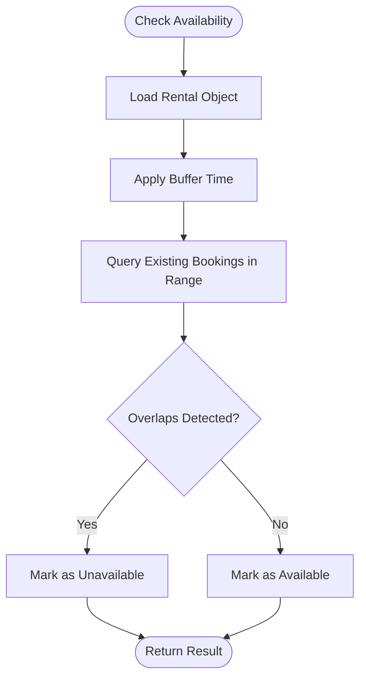

**Diagram sources**
- [booking.service.ts](file://apps/api/src/modules/booking/booking.service.ts#L67-L92)
- [calendar.service.ts](file://apps/api/src/modules/calendar/calendar.service.ts#L195-L288)
- [availability.service.ts](file://apps/api/src/modules/availability/availability.service.ts#L277-L344)

**Section sources**
- [booking.service.ts](file://apps/api/src/modules/booking/booking.service.ts#L67-L92)
- [calendar.service.ts](file://apps/api/src/modules/calendar/calendar.service.ts#L195-L288)
- [availability.service.ts](file://apps/api/src/modules/availability/availability.service.ts#L277-L344)

### Calendar Integration
- Calendar configuration includes granularity, slot sizes, booking windows, opening hours, and UI preferences
- Availability matrix generation considers allocations, bookings, and exceptions
- Scope validation ensures access control for calendar data

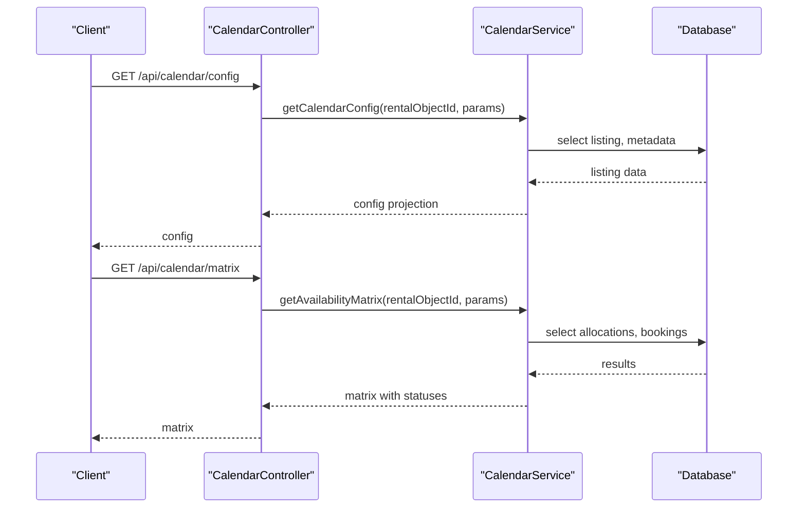

**Diagram sources**
- [calendar.service.ts](file://apps/api/src/modules/calendar/calendar.service.ts#L147-L288)

**Section sources**
- [calendar.service.ts](file://apps/api/src/modules/calendar/calendar.service.ts#L74-L668)

### Reporting, Receipts, and Audit Trail
- Receipt endpoint generates structured booking receipts for administrative requirements
- Audit logs record booking lifecycle actions with metadata
- Notifications are templated and dispatched across channels

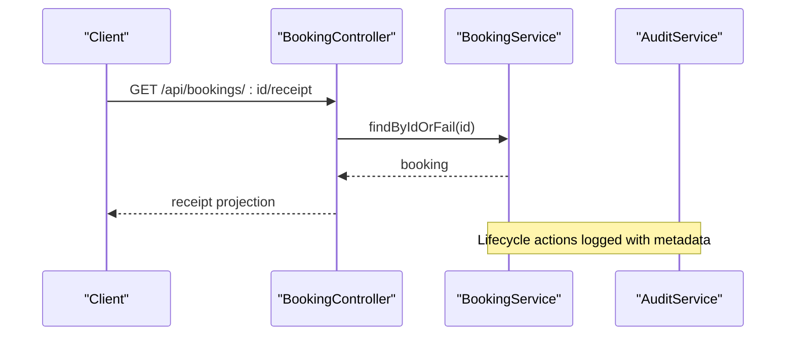

**Diagram sources**
- [booking.controller.ts](file://apps/api/src/modules/booking/booking.controller.ts#L279-L324)
- [booking.service.ts](file://apps/api/src/modules/booking/booking.service.ts#L116-L123)
- [booking.service.ts](file://apps/api/src/modules/booking/booking.service.ts#L172-L178)
- [booking.service.ts](file://apps/api/src/modules/booking/booking.service.ts#L212-L219)
- [booking.service.ts](file://apps/api/src/modules/booking/booking.service.ts#L247-L253)
- [booking.service.ts](file://apps/api/src/modules/booking/booking.service.ts#L380-L392)

**Section sources**
- [booking.controller.ts](file://apps/api/src/modules/booking/booking.controller.ts#L279-L324)
- [booking.service.ts](file://apps/api/src/modules/booking/booking.service.ts#L116-L123)

### Payment Processing and Customer Communication
- Pricing calculation endpoints provide quote projections with constraints and available actions
- Notification service manages templated messages across channels for approvals, denials, cancellations, and reminders
- Action URLs in notifications link to relevant booking or listing pages

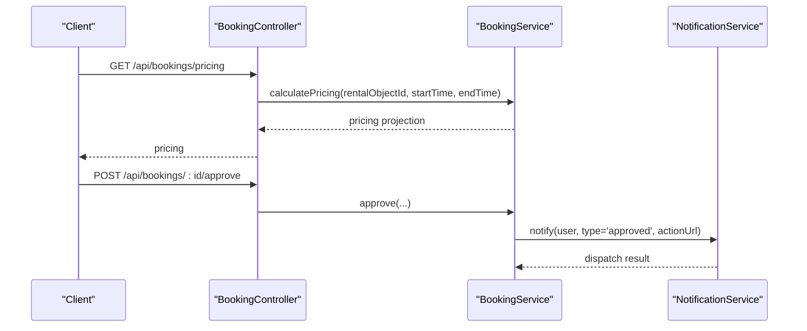

**Diagram sources**
- [booking.controller.ts](file://apps/api/src/modules/booking/booking.controller.ts#L197-L206)
- [booking.controller.ts](file://apps/api/src/modules/booking/booking.controller.ts#L122-L134)
- [notification.service.ts](file://apps/api/src/modules/notification-system/notification.service.ts#L59-L125)

**Section sources**
- [booking.controller.ts](file://apps/api/src/modules/booking/booking.controller.ts#L197-L206)
- [booking.controller.ts](file://apps/api/src/modules/booking/booking.controller.ts#L122-L134)
- [notification.service.ts](file://apps/api/src/modules/notification-system/notification.service.ts#L59-L125)

## Dependency Analysis
The booking module exhibits strong cohesion within its layer and low coupling to external modules:
- Controllers depend on services for business logic
- Services depend on repositories for persistence and on integration services for calendar, availability, and notifications
- Schemas provide shared validation across services and controllers
- Mappers isolate presentation transformations from business logic

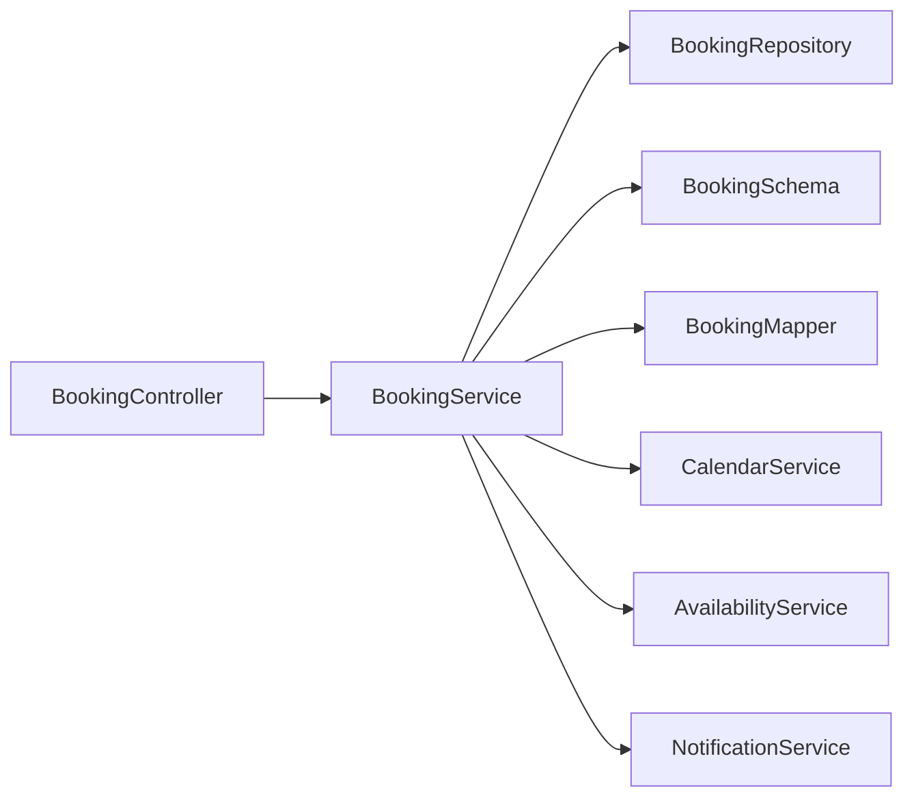

**Diagram sources**
- [booking.controller.ts](file://apps/api/src/modules/booking/booking.controller.ts#L21-L418)
- [booking.service.ts](file://apps/api/src/modules/booking/booking.service.ts#L43-L1240)
- [booking.repository.ts](file://apps/api/src/modules/booking/booking.repository.ts#L12-L288)
- [booking.schema.ts](file://apps/api/src/schemas/booking.schema.ts#L1-L485)
- [booking.mapper.ts](file://apps/api/src/modules/booking/booking.mapper.ts#L1-L654)
- [calendar.service.ts](file://apps/api/src/modules/calendar/calendar.service.ts#L74-L668)
- [availability.service.ts](file://apps/api/src/modules/availability/availability.service.ts#L32-L457)
- [notification.service.ts](file://apps/api/src/modules/notification-system/notification.service.ts#L33-L369)

**Section sources**
- [booking.controller.ts](file://apps/api/src/modules/booking/booking.controller.ts#L21-L418)
- [booking.service.ts](file://apps/api/src/modules/booking/booking.service.ts#L43-L1240)
- [booking.repository.ts](file://apps/api/src/modules/booking/booking.repository.ts#L12-L288)
- [booking.schema.ts](file://apps/api/src/schemas/booking.schema.ts#L1-L485)
- [booking.mapper.ts](file://apps/api/src/modules/booking/booking.mapper.ts#L1-L654)
- [calendar.service.ts](file://apps/api/src/modules/calendar/calendar.service.ts#L74-L668)
- [availability.service.ts](file://apps/api/src/modules/availability/availability.service.ts#L32-L457)
- [notification.service.ts](file://apps/api/src/modules/notification-system/notification.service.ts#L33-L369)

## Performance Considerations
- Optimistic locking reduces contention by validating versions during updates; ensure clients handle conflict errors gracefully
- Pagination limits prevent excessive memory usage; enforce maximum page sizes at the controller level
- Availability checks leverage indexed date ranges and buffer time calculations; cache frequently accessed rental configurations
- Real-time broadcasts should be scoped to relevant tenants/users to minimize network overhead
- Notification queuing supports asynchronous processing; tune queue processing limits and retry policies

## Troubleshooting Guide
Common issues and resolutions:
- Validation errors: Ensure request bodies conform to schemas; review BookingQuerySchema, CreateBookingSchema, and others
- Conflict errors: When updating, handle optimistic locking conflicts by refreshing data and retrying
- Scope denials: Case handlers must have active scope assignments; verify case_handler_scopes entries
- Availability conflicts: Review buffer time settings and existing bookings; adjust rental object metadata accordingly
- Notification failures: Check template availability and channel configurations; inspect dispatch results

**Section sources**
- [booking.repository.ts](file://apps/api/src/modules/booking/booking.repository.ts#L240-L264)
- [booking.service.ts](file://apps/api/src/modules/booking/booking.service.ts#L279-L333)
- [booking.schema.ts](file://apps/api/src/schemas/booking.schema.ts#L99-L110)
- [notification.service.ts](file://apps/api/src/modules/notification-system/notification.service.ts#L152-L194)

## Conclusion
The Booking Management system integrates robust business logic, strict validation, and seamless real-time updates. Its modular design supports scalability, maintainability, and extensibility across approvals, recurring bookings, calendar integration, and notifications. By adhering to the documented patterns and leveraging the provided components, teams can confidently extend and operate the booking domain within the platform.