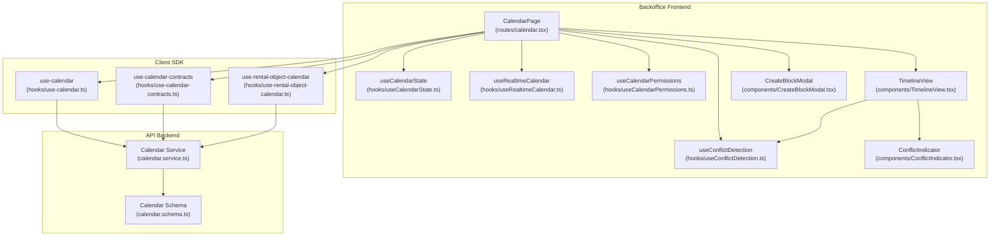
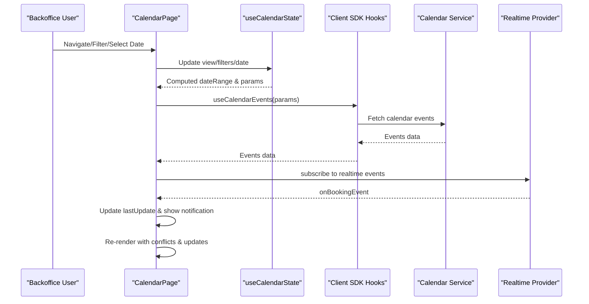
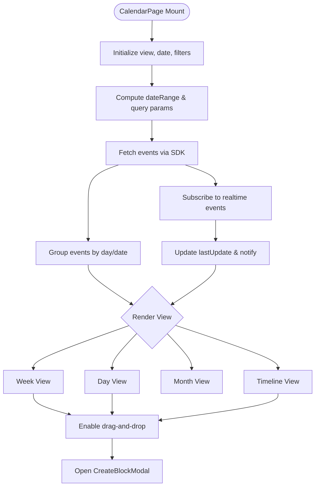
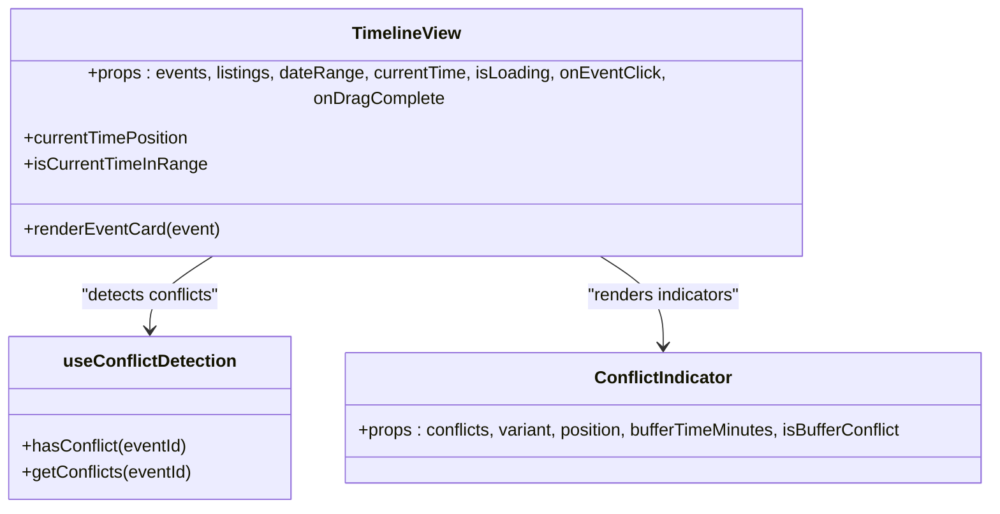
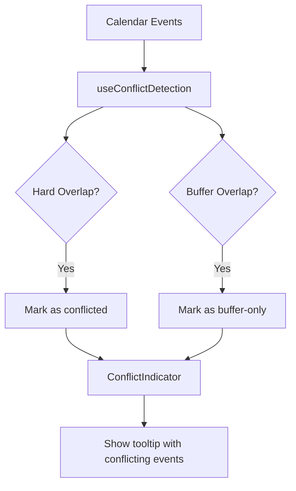
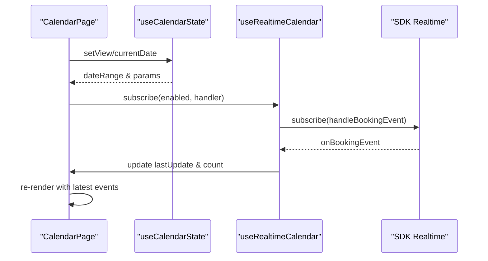
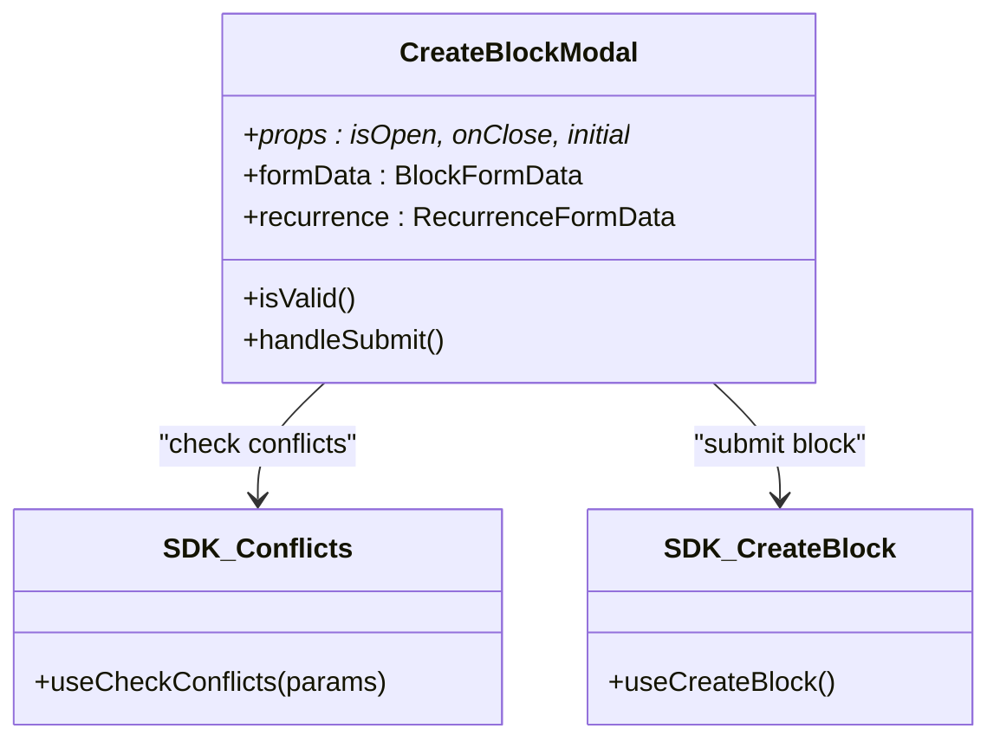
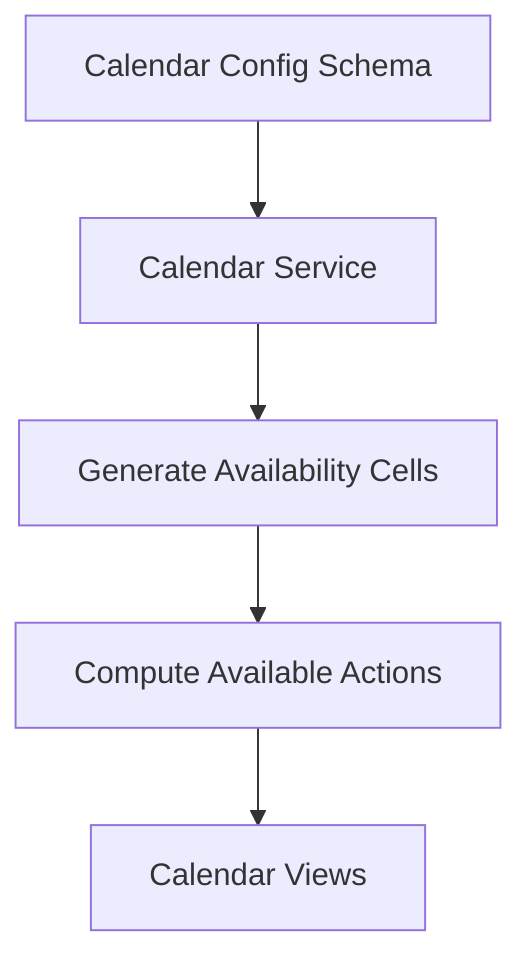
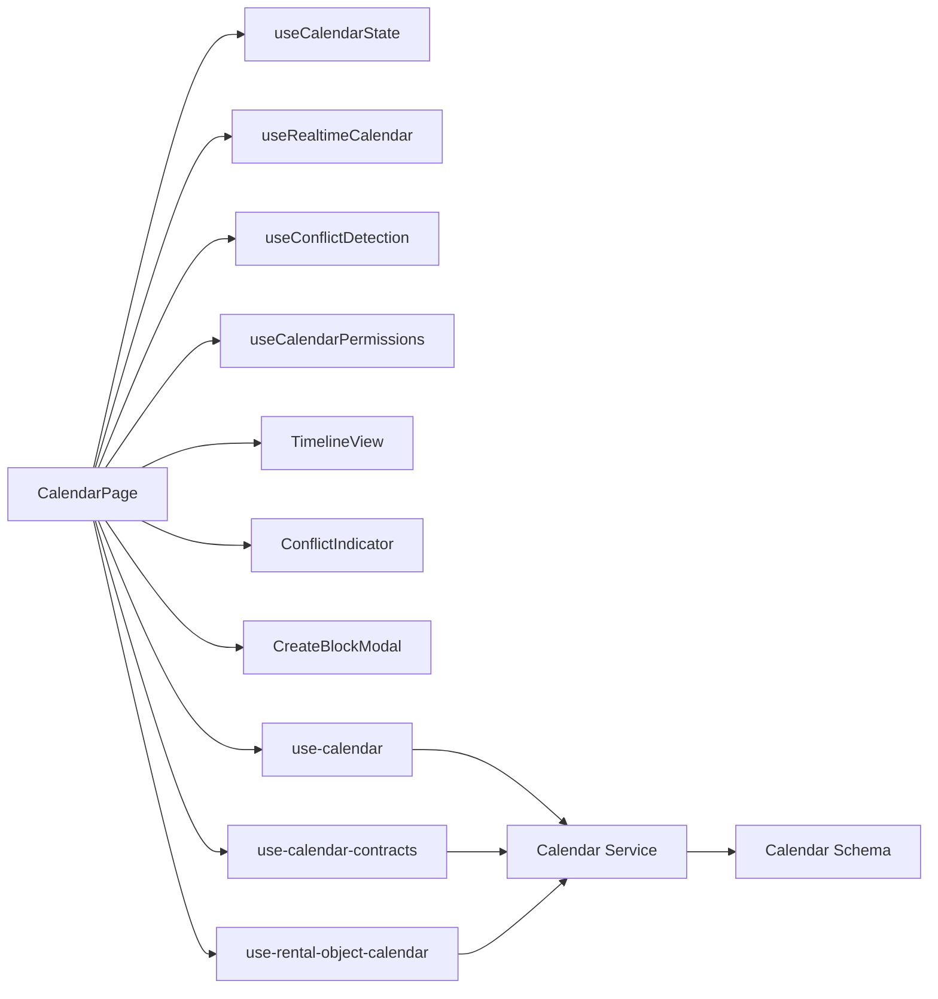

# Calendar System

<cite>
**Referenced Files in This Document**
- [apps/backoffice/src/routes/calendar.tsx](file://apps/backoffice/src/routes/calendar.tsx)
- [apps/backoffice/src/features/calendar/index.ts](file://apps/backoffice/src/features/calendar/index.ts)
- [apps/backoffice/src/features/calendar/types.ts](file://apps/backoffice/src/features/calendar/types.ts)
- [apps/backoffice/src/features/calendar/hooks/useCalendarState.ts](file://apps/backoffice/src/features/calendar/hooks/useCalendarState.ts)
- [apps/backoffice/src/features/calendar/hooks/useRealtimeCalendar.ts](file://apps/backoffice/src/features/calendar/hooks/useRealtimeCalendar.ts)
- [apps/backoffice/src/features/calendar/hooks/useConflictDetection.ts](file://apps/backoffice/src/features/calendar/hooks/useConflictDetection.ts)
- [apps/backoffice/src/features/calendar/hooks/useCalendarPermissions.ts](file://apps/backoffice/src/features/calendar/hooks/useCalendarPermissions.ts)
- [apps/backoffice/src/features/calendar/components/TimelineView.tsx](file://apps/backoffice/src/features/calendar/components/TimelineView.tsx)
- [apps/backoffice/src/features/calendar/components/ConflictIndicator.tsx](file://apps/backoffice/src/features/calendar/components/ConflictIndicator.tsx)
- [apps/backoffice/src/features/calendar/components/CreateBlockModal.tsx](file://apps/backoffice/src/features/calendar/components/CreateBlockModal.tsx)
- [apps/api/src/modules/calendar/calendar.service.ts](file://apps/api/src/modules/calendar/calendar.service.ts)
- [apps/api/src/schemas/calendar.schema.ts](file://apps/api/src/schemas/calendar.schema.ts)
- [packages/client-sdk/src/hooks/use-calendar.ts](file://packages/client-sdk/src/hooks/use-calendar.ts)
- [packages/client-sdk/src/hooks/use-calendar-contracts.ts](file://packages/client-sdk/src/hooks/use-calendar-contracts.ts)
- [packages/client-sdk/src/hooks/use-rental-object-calendar.ts](file://packages/client-sdk/src/hooks/use-rental-object-calendar.ts)
</cite>

## Table of Contents
1. [Introduction](#introduction)
2. [Project Structure](#project-structure)
3. [Core Components](#core-components)
4. [Architecture Overview](#architecture-overview)
5. [Detailed Component Analysis](#detailed-component-analysis)
6. [Dependency Analysis](#dependency-analysis)
7. [Performance Considerations](#performance-considerations)
8. [Troubleshooting Guide](#troubleshooting-guide)
9. [Conclusion](#conclusion)

## Introduction
This document describes the Calendar System within the Backoffice Application. It covers the calendar interface, booking visualization, availability management, real-time updates, conflict detection, RBAC permissions, and integration with the booking system. The system supports multiple calendar views (day, week, month, timeline), filtering, search, and resource allocation visualization. It leverages a real-time provider to keep the calendar synchronized with live booking events and integrates with the client SDK for calendar data retrieval and mutation.

## Project Structure
The calendar feature is organized under the Backoffice application’s features module and integrates with the client SDK and API services. The main calendar page orchestrates state, permissions, real-time updates, conflict detection, and rendering components for different views.

**Diagram sources**
- [apps/backoffice/src/routes/calendar.tsx](file://apps/backoffice/src/routes/calendar.tsx#L59-L800)
- [apps/backoffice/src/features/calendar/hooks/useCalendarState.ts](file://apps/backoffice/src/features/calendar/hooks/useCalendarState.ts#L17-L224)
- [apps/backoffice/src/features/calendar/hooks/useRealtimeCalendar.ts](file://apps/backoffice/src/features/calendar/hooks/useRealtimeCalendar.ts#L24-L79)
- [apps/backoffice/src/features/calendar/hooks/useConflictDetection.ts](file://apps/backoffice/src/features/calendar/hooks/useConflictDetection.ts#L36-L192)
- [apps/backoffice/src/features/calendar/hooks/useCalendarPermissions.ts](file://apps/backoffice/src/features/calendar/hooks/useCalendarPermissions.ts#L40-L107)
- [apps/backoffice/src/features/calendar/components/TimelineView.tsx](file://apps/backoffice/src/features/calendar/components/TimelineView.tsx#L58-L428)
- [apps/backoffice/src/features/calendar/components/ConflictIndicator.tsx](file://apps/backoffice/src/features/calendar/components/ConflictIndicator.tsx#L32-L260)
- [apps/backoffice/src/features/calendar/components/CreateBlockModal.tsx](file://apps/backoffice/src/features/calendar/components/CreateBlockModal.tsx#L47-L661)
- [packages/client-sdk/src/hooks/use-calendar.ts](file://packages/client-sdk/src/hooks/use-calendar.ts)
- [packages/client-sdk/src/hooks/use-calendar-contracts.ts](file://packages/client-sdk/src/hooks/use-calendar-contracts.ts)
- [packages/client-sdk/src/hooks/use-rental-object-calendar.ts](file://packages/client-sdk/src/hooks/use-rental-object-calendar.ts)
- [apps/api/src/modules/calendar/calendar.service.ts](file://apps/api/src/modules/calendar/calendar.service.ts#L488-L511)
- [apps/api/src/schemas/calendar.schema.ts](file://apps/api/src/schemas/calendar.schema.ts#L160-L199)

**Section sources**
- [apps/backoffice/src/routes/calendar.tsx](file://apps/backoffice/src/routes/calendar.tsx#L59-L800)
- [apps/backoffice/src/features/calendar/index.ts](file://apps/backoffice/src/features/calendar/index.ts#L1-L14)

## Core Components
- CalendarPage: Orchestrates calendar views, controls, filters, real-time updates, and event rendering.
- TimelineView: Renders a horizontal timeline across multiple listings with time-aligned events.
- ConflictIndicator: Visual indicator and tooltip for event conflicts and buffer zones.
- CreateBlockModal: Form for creating blocks (maintenance, closed, holds, etc.) with conflict checks and recurrence support.
- useCalendarState: Centralized state for view, date navigation, filters, and computed date ranges.
- useRealtimeCalendar: Subscribes to real-time booking events and tracks update timestamps.
- useConflictDetection: Detects overlapping bookings and buffer conflicts across events.
- useCalendarPermissions: RBAC checks for calendar actions and advanced features.

**Section sources**
- [apps/backoffice/src/features/calendar/types.ts](file://apps/backoffice/src/features/calendar/types.ts#L8-L152)
- [apps/backoffice/src/features/calendar/hooks/useCalendarState.ts](file://apps/backoffice/src/features/calendar/hooks/useCalendarState.ts#L17-L224)
- [apps/backoffice/src/features/calendar/hooks/useRealtimeCalendar.ts](file://apps/backoffice/src/features/calendar/hooks/useRealtimeCalendar.ts#L24-L79)
- [apps/backoffice/src/features/calendar/hooks/useConflictDetection.ts](file://apps/backoffice/src/features/calendar/hooks/useConflictDetection.ts#L36-L192)
- [apps/backoffice/src/features/calendar/hooks/useCalendarPermissions.ts](file://apps/backoffice/src/features/calendar/hooks/useCalendarPermissions.ts#L40-L107)
- [apps/backoffice/src/features/calendar/components/TimelineView.tsx](file://apps/backoffice/src/features/calendar/components/TimelineView.tsx#L58-L428)
- [apps/backoffice/src/features/calendar/components/ConflictIndicator.tsx](file://apps/backoffice/src/features/calendar/components/ConflictIndicator.tsx#L32-L260)
- [apps/backoffice/src/features/calendar/components/CreateBlockModal.tsx](file://apps/backoffice/src/features/calendar/components/CreateBlockModal.tsx#L47-L661)

## Architecture Overview
The calendar system follows a layered architecture:
- Presentation Layer: CalendarPage renders views and delegates to child components.
- State Management: useCalendarState centralizes view state, navigation, and date range computation.
- Real-time Integration: useRealtimeCalendar subscribes to SDK real-time events and triggers UI updates.
- Conflict Detection: useConflictDetection computes overlaps and buffer conflicts for visualization.
- Permissions: useCalendarPermissions enforces RBAC for calendar actions.
- Data Access: Client SDK hooks (use-calendar, use-calendar-contracts, use-rental-object-calendar) fetch calendar data and mutate blocks/bookings.
- Domain Services: API calendar service generates availability cells and computes available actions.

**Diagram sources**
- [apps/backoffice/src/routes/calendar.tsx](file://apps/backoffice/src/routes/calendar.tsx#L118-L147)
- [apps/backoffice/src/features/calendar/hooks/useCalendarState.ts](file://apps/backoffice/src/features/calendar/hooks/useCalendarState.ts#L86-L96)
- [apps/backoffice/src/features/calendar/hooks/useRealtimeCalendar.ts](file://apps/backoffice/src/features/calendar/hooks/useRealtimeCalendar.ts#L54-L56)
- [packages/client-sdk/src/hooks/use-calendar.ts](file://packages/client-sdk/src/hooks/use-calendar.ts)
- [apps/api/src/modules/calendar/calendar.service.ts](file://apps/api/src/modules/calendar/calendar.service.ts#L488-L511)

## Detailed Component Analysis

### CalendarPage
- Responsibilities:
  - Manages view state (day, week, month, timeline).
  - Builds calendar query parameters based on current view and selected listing.
  - Fetches calendar events via SDK and groups them by day/date for rendering.
  - Integrates real-time updates and shows sync indicators.
  - Handles drag-and-drop for quick block creation in week/day views.
  - Renders event cards with conflict indicators and hover effects.
- Views:
  - Week: Grid with time slots and day columns; supports drag preview and current time indicator.
  - Day: Single-day grid with time slots and current time indicator.
  - Month: Grid calendar with event previews per day.
  - Timeline: Side-by-side listings with time-aligned events and drag-and-drop support.
- Filtering and Search:
  - Listing filter dropdown to scope events to a specific rental object.
  - Status-based filtering is defined in types but not explicitly implemented in CalendarPage; can be extended via filters state.
- Real-time Updates:
  - Subscribes to realtime events and updates lastUpdate timestamp and notification.

**Diagram sources**
- [apps/backoffice/src/routes/calendar.tsx](file://apps/backoffice/src/routes/calendar.tsx#L59-L800)

**Section sources**
- [apps/backoffice/src/routes/calendar.tsx](file://apps/backoffice/src/routes/calendar.tsx#L59-L800)

### TimelineView
- Displays multiple listings horizontally with aligned time slots.
- Renders event cards with conflict indicators and hover effects.
- Supports drag-and-drop to quickly create blocks with a selected time range.
- Shows current time indicator if within the visible date range.
- Uses conflict detection and conflict indicator utilities for visual feedback.

**Diagram sources**
- [apps/backoffice/src/features/calendar/components/TimelineView.tsx](file://apps/backoffice/src/features/calendar/components/TimelineView.tsx#L58-L428)
- [apps/backoffice/src/features/calendar/hooks/useConflictDetection.ts](file://apps/backoffice/src/features/calendar/hooks/useConflictDetection.ts#L36-L192)
- [apps/backoffice/src/features/calendar/components/ConflictIndicator.tsx](file://apps/backoffice/src/features/calendar/components/ConflictIndicator.tsx#L32-L260)

**Section sources**
- [apps/backoffice/src/features/calendar/components/TimelineView.tsx](file://apps/backoffice/src/features/calendar/components/TimelineView.tsx#L58-L428)

### Conflict Detection and Visualization
- useConflictDetection:
  - Computes hard overlaps and buffer-only conflicts between events for the same listing.
  - Provides APIs to check conflicts for a specific event and to retrieve conflict details.
- ConflictIndicator:
  - Renders a visual indicator with a tooltip listing conflicting events.
  - Supports buffer-only conflicts with distinct styling.
  - Provides helper functions to compute buffer zone styles for timeline visualization.

**Diagram sources**
- [apps/backoffice/src/features/calendar/hooks/useConflictDetection.ts](file://apps/backoffice/src/features/calendar/hooks/useConflictDetection.ts#L36-L192)
- [apps/backoffice/src/features/calendar/components/ConflictIndicator.tsx](file://apps/backoffice/src/features/calendar/components/ConflictIndicator.tsx#L32-L260)

**Section sources**
- [apps/backoffice/src/features/calendar/hooks/useConflictDetection.ts](file://apps/backoffice/src/features/calendar/hooks/useConflictDetection.ts#L36-L192)
- [apps/backoffice/src/features/calendar/components/ConflictIndicator.tsx](file://apps/backoffice/src/features/calendar/components/ConflictIndicator.tsx#L32-L260)

### Real-time Updates and State Management
- useCalendarState:
  - Manages view, current date, selected listing, and selected event.
  - Computes week/month start/end and date range based on the current view.
  - Exposes navigation functions and formatted view titles.
- useRealtimeCalendar:
  - Subscribes to real-time booking events via the SDK.
  - Tracks last update timestamp and counts updates.
  - Resets tracking and exposes whether updates are enabled.

**Diagram sources**
- [apps/backoffice/src/features/calendar/hooks/useCalendarState.ts](file://apps/backoffice/src/features/calendar/hooks/useCalendarState.ts#L17-L224)
- [apps/backoffice/src/features/calendar/hooks/useRealtimeCalendar.ts](file://apps/backoffice/src/features/calendar/hooks/useRealtimeCalendar.ts#L24-L79)

**Section sources**
- [apps/backoffice/src/features/calendar/hooks/useCalendarState.ts](file://apps/backoffice/src/features/calendar/hooks/useCalendarState.ts#L17-L224)
- [apps/backoffice/src/features/calendar/hooks/useRealtimeCalendar.ts](file://apps/backoffice/src/features/calendar/hooks/useRealtimeCalendar.ts#L24-L79)

### Permissions and RBAC
- useCalendarPermissions:
  - Determines view, block management, allocation, and request management permissions based on user role.
  - Exposes helpers to check single or multiple permissions.

**Section sources**
- [apps/backoffice/src/features/calendar/hooks/useCalendarPermissions.ts](file://apps/backoffice/src/features/calendar/hooks/useCalendarPermissions.ts#L40-L107)

### Booking Visualization and Availability Management
- CalendarPage fetches events via SDK and renders them across views with conflict-aware styling.
- TimelineView groups events by listing and aligns them by time, enabling cross-resource visibility.
- CreateBlockModal:
  - Provides a form to create blocks with type selection, date/time ranges, recurrence, and optional notifications.
  - Performs conflict checks and enforces permission-based overrides.

**Diagram sources**
- [apps/backoffice/src/features/calendar/components/CreateBlockModal.tsx](file://apps/backoffice/src/features/calendar/components/CreateBlockModal.tsx#L47-L661)
- [apps/backoffice/src/features/calendar/hooks/useCalendarPermissions.ts](file://apps/backoffice/src/features/calendar/hooks/useCalendarPermissions.ts#L40-L107)

**Section sources**
- [apps/backoffice/src/features/calendar/components/CreateBlockModal.tsx](file://apps/backoffice/src/features/calendar/components/CreateBlockModal.tsx#L47-L661)

### Integration with Booking System and Availability
- Calendar service:
  - Generates availability cells for a date range considering opening hours, exceptions, and allocations.
  - Computes available actions (e.g., SELECT_SLOT, REQUEST_BOOKING) based on listing status and policies.
- Calendar schema:
  - Defines calendar configuration including granularity, slot behavior, booking windows, opening hours, booking types, UI hints, and permissions.

**Diagram sources**
- [apps/api/src/modules/calendar/calendar.service.ts](file://apps/api/src/modules/calendar/calendar.service.ts#L488-L511)
- [apps/api/src/schemas/calendar.schema.ts](file://apps/api/src/schemas/calendar.schema.ts#L160-L199)

**Section sources**
- [apps/api/src/modules/calendar/calendar.service.ts](file://apps/api/src/modules/calendar/calendar.service.ts#L488-L511)
- [apps/api/src/schemas/calendar.schema.ts](file://apps/api/src/schemas/calendar.schema.ts#L160-L199)

## Dependency Analysis
- CalendarPage depends on:
  - useCalendarState for view and date management.
  - useRealtimeCalendar for live updates.
  - useConflictDetection for conflict visualization.
  - useCalendarPermissions for UI gating.
  - TimelineView and ConflictIndicator for rendering.
  - CreateBlockModal for block creation.
- SDK integration:
  - CalendarPage uses SDK hooks for calendar events and rental objects.
- API backend:
  - Calendar service and schema define availability generation and configuration.

**Diagram sources**
- [apps/backoffice/src/routes/calendar.tsx](file://apps/backoffice/src/routes/calendar.tsx#L59-L800)
- [apps/backoffice/src/features/calendar/hooks/useCalendarState.ts](file://apps/backoffice/src/features/calendar/hooks/useCalendarState.ts#L17-L224)
- [apps/backoffice/src/features/calendar/hooks/useRealtimeCalendar.ts](file://apps/backoffice/src/features/calendar/hooks/useRealtimeCalendar.ts#L24-L79)
- [apps/backoffice/src/features/calendar/hooks/useConflictDetection.ts](file://apps/backoffice/src/features/calendar/hooks/useConflictDetection.ts#L36-L192)
- [apps/backoffice/src/features/calendar/hooks/useCalendarPermissions.ts](file://apps/backoffice/src/features/calendar/hooks/useCalendarPermissions.ts#L40-L107)
- [apps/backoffice/src/features/calendar/components/TimelineView.tsx](file://apps/backoffice/src/features/calendar/components/TimelineView.tsx#L58-L428)
- [apps/backoffice/src/features/calendar/components/ConflictIndicator.tsx](file://apps/backoffice/src/features/calendar/components/ConflictIndicator.tsx#L32-L260)
- [apps/backoffice/src/features/calendar/components/CreateBlockModal.tsx](file://apps/backoffice/src/features/calendar/components/CreateBlockModal.tsx#L47-L661)
- [packages/client-sdk/src/hooks/use-calendar.ts](file://packages/client-sdk/src/hooks/use-calendar.ts)
- [packages/client-sdk/src/hooks/use-calendar-contracts.ts](file://packages/client-sdk/src/hooks/use-calendar-contracts.ts)
- [packages/client-sdk/src/hooks/use-rental-object-calendar.ts](file://packages/client-sdk/src/hooks/use-rental-object-calendar.ts)
- [apps/api/src/modules/calendar/calendar.service.ts](file://apps/api/src/modules/calendar/calendar.service.ts#L488-L511)
- [apps/api/src/schemas/calendar.schema.ts](file://apps/api/src/schemas/calendar.schema.ts#L160-L199)

**Section sources**
- [apps/backoffice/src/routes/calendar.tsx](file://apps/backoffice/src/routes/calendar.tsx#L59-L800)
- [apps/backoffice/src/features/calendar/hooks/useCalendarState.ts](file://apps/backoffice/src/features/calendar/hooks/useCalendarState.ts#L17-L224)
- [apps/backoffice/src/features/calendar/hooks/useRealtimeCalendar.ts](file://apps/backoffice/src/features/calendar/hooks/useRealtimeCalendar.ts#L24-L79)
- [apps/backoffice/src/features/calendar/hooks/useConflictDetection.ts](file://apps/backoffice/src/features/calendar/hooks/useConflictDetection.ts#L36-L192)
- [apps/backoffice/src/features/calendar/hooks/useCalendarPermissions.ts](file://apps/backoffice/src/features/calendar/hooks/useCalendarPermissions.ts#L40-L107)
- [apps/backoffice/src/features/calendar/components/TimelineView.tsx](file://apps/backoffice/src/features/calendar/components/TimelineView.tsx#L58-L428)
- [apps/backoffice/src/features/calendar/components/ConflictIndicator.tsx](file://apps/backoffice/src/features/calendar/components/ConflictIndicator.tsx#L32-L260)
- [apps/backoffice/src/features/calendar/components/CreateBlockModal.tsx](file://apps/backoffice/src/features/calendar/components/CreateBlockModal.tsx#L47-L661)
- [packages/client-sdk/src/hooks/use-calendar.ts](file://packages/client-sdk/src/hooks/use-calendar.ts)
- [packages/client-sdk/src/hooks/use-calendar-contracts.ts](file://packages/client-sdk/src/hooks/use-calendar-contracts.ts)
- [packages/client-sdk/src/hooks/use-rental-object-calendar.ts](file://packages/client-sdk/src/hooks/use-rental-object-calendar.ts)
- [apps/api/src/modules/calendar/calendar.service.ts](file://apps/api/src/modules/calendar/calendar.service.ts#L488-L511)
- [apps/api/src/schemas/calendar.schema.ts](file://apps/api/src/schemas/calendar.schema.ts#L160-L199)

## Performance Considerations
- Efficient grouping: Events are grouped by day/date using memoized computations to minimize re-renders.
- Drag-and-drop previews: Preview rendering avoids heavy DOM manipulation and uses absolute positioning for smooth UX.
- Real-time updates: Subscription is configurable and tracks minimal state to reduce overhead.
- Conflict detection: Algorithm compares each event against others; for large datasets, consider indexing by listing and time ranges to optimize.
- Timeline rendering: Horizontal layout with fixed lane heights and absolute positioning helps maintain performance across many listings.

[No sources needed since this section provides general guidance]

## Troubleshooting Guide
- Real-time updates not appearing:
  - Verify useRealtimeCalendar is enabled and handler is attached.
  - Check that SDK subscription is active and network connectivity is stable.
- Conflicts not detected:
  - Ensure useConflictDetection is enabled and buffer minutes are configured appropriately.
  - Confirm events have valid start/end times and share the same listing ID.
- Permission denials:
  - Review useCalendarPermissions to confirm user role and required capability.
  - Advanced actions (override conflicts, bulk delete) require admin privileges.
- Timeline view issues:
  - Validate date range and current time alignment.
  - Ensure listings are loaded and events are grouped by listing ID.

**Section sources**
- [apps/backoffice/src/features/calendar/hooks/useRealtimeCalendar.ts](file://apps/backoffice/src/features/calendar/hooks/useRealtimeCalendar.ts#L24-L79)
- [apps/backoffice/src/features/calendar/hooks/useConflictDetection.ts](file://apps/backoffice/src/features/calendar/hooks/useConflictDetection.ts#L36-L192)
- [apps/backoffice/src/features/calendar/hooks/useCalendarPermissions.ts](file://apps/backoffice/src/features/calendar/hooks/useCalendarPermissions.ts#L40-L107)
- [apps/backoffice/src/features/calendar/components/TimelineView.tsx](file://apps/backoffice/src/features/calendar/components/TimelineView.tsx#L58-L428)

## Conclusion
The Backoffice Calendar System provides a comprehensive, real-time calendar interface with robust conflict detection, RBAC-driven permissions, and flexible views. It integrates tightly with the client SDK and API to deliver accurate booking visualization and availability insights. The modular design enables extensibility for additional reporting, capacity visualization, and resource allocation features.