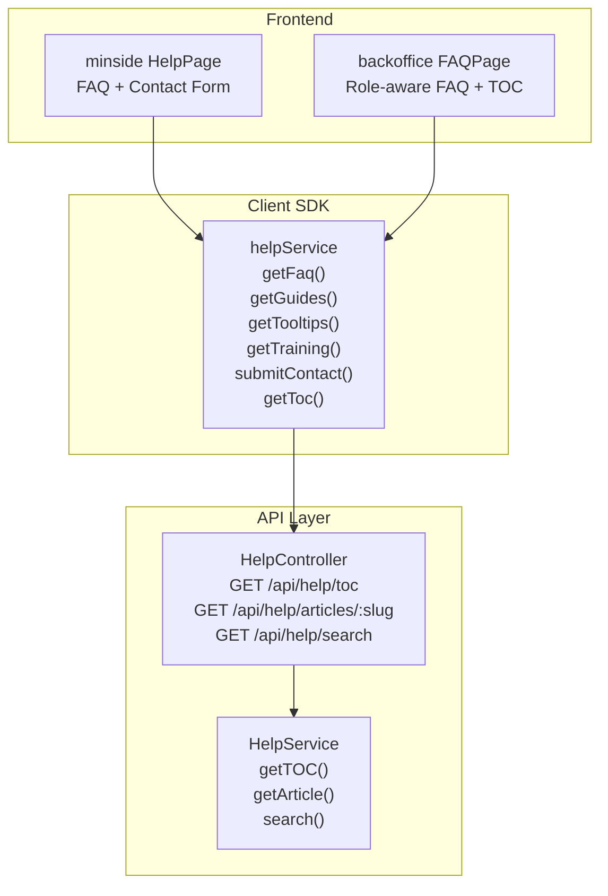
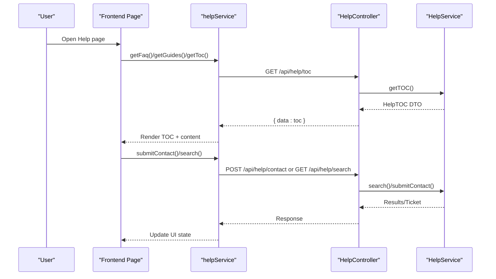
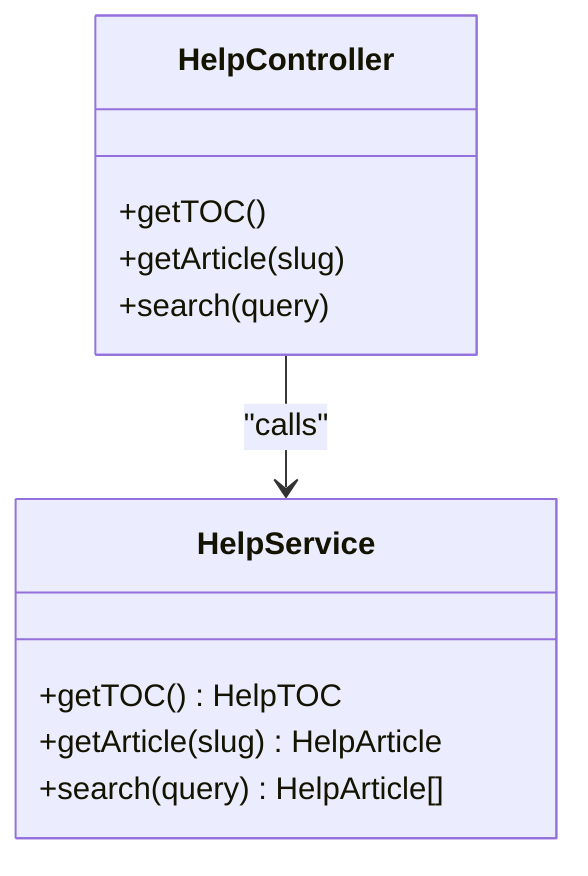
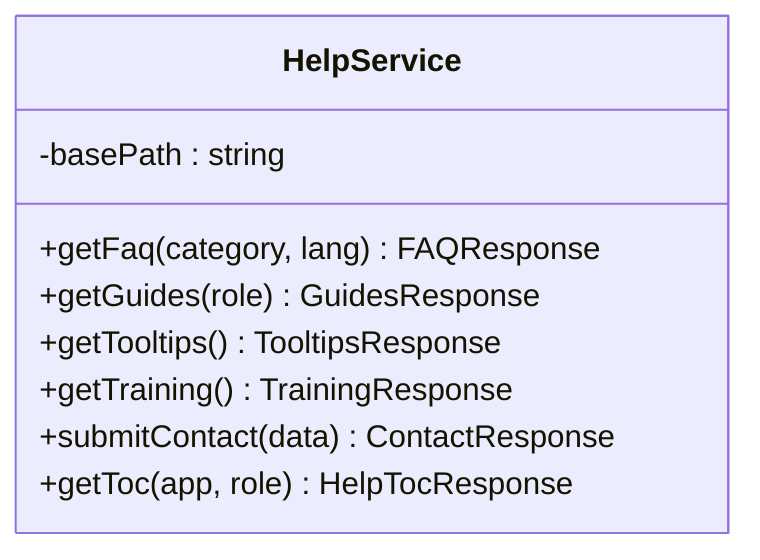
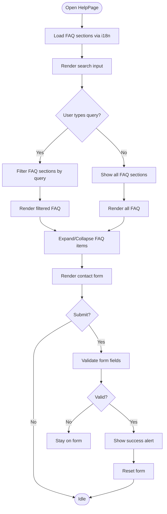
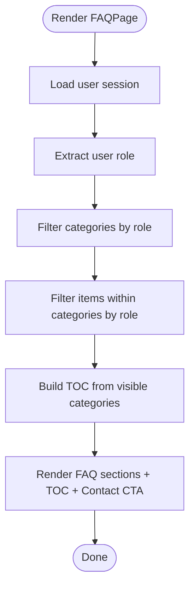
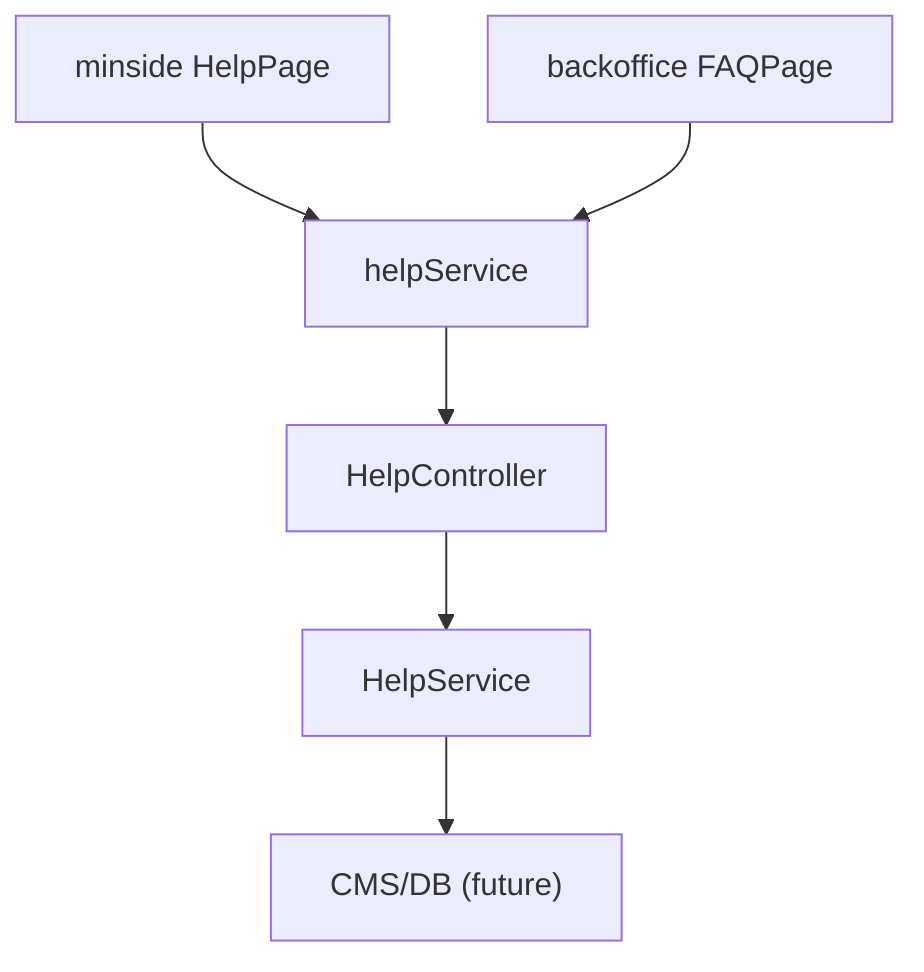

# Help & Support

<cite>
**Referenced Files in This Document**
- [apps/api/src/modules/help/help.controller.ts](file://apps/api/src/modules/help/help.controller.ts)
- [apps/api/src/modules/help/help.service.ts](file://apps/api/src/modules/help/help.service.ts)
- [packages/client-sdk/src/services/help.service.ts](file://packages/client-sdk/src/services/help.service.ts)
- [apps/minside/src/routes/help.tsx](file://apps/minside/src/routes/help.tsx)
- [apps/backoffice/src/routes/help/faq.tsx](file://apps/backoffice/src/routes/help/faq.tsx)
- [docs/reference/03-faq.md](file://docs/reference/03-faq.md)
- [docs/digilist-platform/roles/tenant-admin-backoffice/help-support.md](file://docs/digilist-platform/roles/tenant-admin-backoffice/help-support.md)
- [apps/api/tests/integration/help.controller.test.ts](file://apps/api/tests/integration/help.controller.test.ts)
- [packages/client-sdk/src/__tests__/services/help.service.test.ts](file://packages/client-sdk/src/__tests__/services/help.service.test.ts)
</cite>

## Table of Contents
1. [Introduction](#introduction)
2. [Project Structure](#project-structure)
3. [Core Components](#core-components)
4. [Architecture Overview](#architecture-overview)
5. [Detailed Component Analysis](#detailed-component-analysis)
6. [Dependency Analysis](#dependency-analysis)
7. [Performance Considerations](#performance-considerations)
8. [Troubleshooting Guide](#troubleshooting-guide)
9. [Conclusion](#conclusion)
10. [Appendices](#appendices)

## Introduction
This document describes the Help and Support features implemented across the platform. It covers the help system architecture, user guides, FAQ management, and support resources. It explains help content management, knowledge base integration, and user assistance features, including guide creation, FAQ organization, and support ticket submission. It also documents help search functionality, content categorization, and user feedback collection. Finally, it outlines integration with the help service, content management, user support workflows, multilingual support, accessibility features, and self-service support capabilities.

## Project Structure
The Help and Support system spans backend API endpoints, a client SDK service, and frontend pages for user portals and admin dashboards. The backend exposes endpoints for table of contents (TOC), articles, and search. The client SDK encapsulates API calls for FAQ, guides, tooltips, training, and contact requests. Frontend pages implement user-facing help experiences, including FAQ filtering and a contact form.

**Diagram sources**
- [apps/api/src/modules/help/help.controller.ts](file://apps/api/src/modules/help/help.controller.ts#L12-L48)
- [apps/api/src/modules/help/help.service.ts](file://apps/api/src/modules/help/help.service.ts#L15-L110)
- [packages/client-sdk/src/services/help.service.ts](file://packages/client-sdk/src/services/help.service.ts#L151-L213)
- [apps/minside/src/routes/help.tsx](file://apps/minside/src/routes/help.tsx#L24-L242)
- [apps/backoffice/src/routes/help/faq.tsx](file://apps/backoffice/src/routes/help/faq.tsx#L205-L309)

**Section sources**
- [apps/api/src/modules/help/help.controller.ts](file://apps/api/src/modules/help/help.controller.ts#L1-L49)
- [apps/api/src/modules/help/help.service.ts](file://apps/api/src/modules/help/help.service.ts#L1-L111)
- [packages/client-sdk/src/services/help.service.ts](file://packages/client-sdk/src/services/help.service.ts#L1-L214)
- [apps/minside/src/routes/help.tsx](file://apps/minside/src/routes/help.tsx#L1-L242)
- [apps/backoffice/src/routes/help/faq.tsx](file://apps/backoffice/src/routes/help/faq.tsx#L1-L309)

## Core Components
- HelpController: Exposes endpoints for retrieving the help table of contents, individual articles, and performing help searches.
- HelpService: Implements business logic for TOC retrieval, article retrieval, and search. Currently returns static data with placeholders for future CMS/database integration.
- helpService (client SDK): Provides typed methods for consuming help endpoints, including FAQ, guides, tooltips, training, and contact submissions.
- minside HelpPage: Presents a user-facing help experience with FAQ sections, search, quick links, and a contact form.
- backoffice FAQPage: Delivers role-aware FAQ content with a right-side TOC and a contact support callout.
- Documentation assets: Reference FAQ and Help & Support blueprint define content models, feature flags, and UI patterns.

**Section sources**
- [apps/api/src/modules/help/help.controller.ts](file://apps/api/src/modules/help/help.controller.ts#L12-L48)
- [apps/api/src/modules/help/help.service.ts](file://apps/api/src/modules/help/help.service.ts#L15-L110)
- [packages/client-sdk/src/services/help.service.ts](file://packages/client-sdk/src/services/help.service.ts#L151-L213)
- [apps/minside/src/routes/help.tsx](file://apps/minside/src/routes/help.tsx#L24-L242)
- [apps/backoffice/src/routes/help/faq.tsx](file://apps/backoffice/src/routes/help/faq.tsx#L205-L309)
- [docs/reference/03-faq.md](file://docs/reference/03-faq.md#L1-L1386)
- [docs/digilist-platform/roles/tenant-admin-backoffice/help-support.md](file://docs/digilist-platform/roles/tenant-admin-backoffice/help-support.md#L1-L177)

## Architecture Overview
The Help and Support architecture follows a contract-first API design with a client SDK abstraction layer. The frontend pages consume SDK methods to render help content, while the backend provides endpoints for TOC, articles, and search. Feature flags and role-aware logic govern visibility and content.

**Diagram sources**
- [packages/client-sdk/src/services/help.service.ts](file://packages/client-sdk/src/services/help.service.ts#L159-L210)
- [apps/api/src/modules/help/help.controller.ts](file://apps/api/src/modules/help/help.controller.ts#L22-L47)
- [apps/api/src/modules/help/help.service.ts](file://apps/api/src/modules/help/help.service.ts#L15-L110)

## Detailed Component Analysis

### Backend Help API (Controller and Service)
- Endpoints:
  - GET /api/help/toc: Returns a Help TOC with sections, quick links, and search enablement.
  - GET /api/help/articles/:slug: Returns a help article by slug.
  - GET /api/help/search?q: Returns filtered articles based on query.
- Implementation notes:
  - Current implementation returns hardcoded data with multilingual titles and summaries.
  - Future enhancements include loading from a CMS or database and implementing real search logic.

**Diagram sources**
- [apps/api/src/modules/help/help.controller.ts](file://apps/api/src/modules/help/help.controller.ts#L12-L48)
- [apps/api/src/modules/help/help.service.ts](file://apps/api/src/modules/help/help.service.ts#L15-L110)

**Section sources**
- [apps/api/src/modules/help/help.controller.ts](file://apps/api/src/modules/help/help.controller.ts#L18-L47)
- [apps/api/src/modules/help/help.service.ts](file://apps/api/src/modules/help/help.service.ts#L15-L110)

### Client SDK Help Service
- Methods:
  - getFaq(category?, lang?): Fetches FAQ entries with optional category and language filters.
  - getGuides(role?): Retrieves user guides/tutorials filtered by role.
  - getTooltips(): Returns contextual tooltips organized by section.
  - getTraining(): Returns training plan, resources, and support contact info.
  - submitContact(data): Submits a support contact request.
  - getToc(app?, role?): Retrieves the help TOC with app and role context.
- Data contracts:
  - FAQ, Guides, Training, Tooltips, and SupportTicket types define the shape of responses.

**Diagram sources**
- [packages/client-sdk/src/services/help.service.ts](file://packages/client-sdk/src/services/help.service.ts#L151-L213)

**Section sources**
- [packages/client-sdk/src/services/help.service.ts](file://packages/client-sdk/src/services/help.service.ts#L159-L210)

### minside HelpPage
- Features:
  - Multilingual FAQ sections rendered via i18n keys.
  - Live search across FAQ questions and answers.
  - Expandable/collapsible FAQ items.
  - Contact form with validation and submission feedback.
  - Responsive layout with quick links.
- Accessibility and UX:
  - Uses design system tokens and components.
  - Mobile breakpoint adjusts layout.
  - Clear focus states and readable typography.

**Diagram sources**
- [apps/minside/src/routes/help.tsx](file://apps/minside/src/routes/help.tsx#L24-L242)

**Section sources**
- [apps/minside/src/routes/help.tsx](file://apps/minside/src/routes/help.tsx#L24-L242)

### backoffice FAQPage
- Features:
  - Role-aware FAQ categories and items.
  - Right-side TOC generated from visible categories.
  - Contact support callout with external link.
- Filtering logic:
  - Categories and items are filtered based on user role.
  - TOC items reflect visible categories only.

**Diagram sources**
- [apps/backoffice/src/routes/help/faq.tsx](file://apps/backoffice/src/routes/help/faq.tsx#L205-L309)

**Section sources**
- [apps/backoffice/src/routes/help/faq.tsx](file://apps/backoffice/src/routes/help/faq.tsx#L205-L309)

### Knowledge Base and Content Model
- Content model:
  - Minimum viable: Markdown files per app and role.
  - Later option: Database-driven content managed via a SaaS Admin module.
- UI components:
  - Help shell, index, article, callout, and feedback components are defined for reuse.
- Localization:
  - Titles and navigation items use i18n keys for Norwegian (nb) and English (en).
- Feature flags:
  - Capability keys control visibility of help features (guides, tips, FAQ, contact, system status, RAG assistant).

**Section sources**
- [docs/digilist-platform/roles/tenant-admin-backoffice/help-support.md](file://docs/digilist-platform/roles/tenant-admin-backoffice/help-support.md#L81-L111)
- [docs/digilist-platform/roles/tenant-admin-backoffice/help-support.md](file://docs/digilist-platform/roles/tenant-admin-backoffice/help-support.md#L23-L31)
- [docs/reference/03-faq.md](file://docs/reference/03-faq.md#L1-L1386)

### Self-Service Support and Feedback
- Self-service:
  - Users can search help articles, browse FAQs, and submit contact requests.
  - Role-aware content ensures relevant information is presented.
- Feedback:
  - Feedback components are defined for collecting user satisfaction.
- Accessibility:
  - DS components and tokens ensure WCAG-compliant UIs.
  - SSR-safe rendering and hydration-friendly patterns.

**Section sources**
- [docs/digilist-platform/roles/tenant-admin-backoffice/help-support.md](file://docs/digilist-platform/roles/tenant-admin-backoffice/help-support.md#L106-L111)
- [apps/minside/src/routes/help.tsx](file://apps/minside/src/routes/help.tsx#L77-L103)

## Dependency Analysis
- Frontend depends on the client SDK for API interactions.
- The client SDK depends on the backend HelpController endpoints.
- HelpService currently returns hardcoded data; future iterations will depend on CMS/database.
- Feature flags and role checks gate content visibility in frontend pages.

**Diagram sources**
- [apps/minside/src/routes/help.tsx](file://apps/minside/src/routes/help.tsx#L24-L242)
- [apps/backoffice/src/routes/help/faq.tsx](file://apps/backoffice/src/routes/help/faq.tsx#L205-L309)
- [packages/client-sdk/src/services/help.service.ts](file://packages/client-sdk/src/services/help.service.ts#L151-L213)
- [apps/api/src/modules/help/help.controller.ts](file://apps/api/src/modules/help/help.controller.ts#L12-L48)
- [apps/api/src/modules/help/help.service.ts](file://apps/api/src/modules/help/help.service.ts#L15-L110)

**Section sources**
- [packages/client-sdk/src/services/help.service.ts](file://packages/client-sdk/src/services/help.service.ts#L151-L213)
- [apps/api/src/modules/help/help.controller.ts](file://apps/api/src/modules/help/help.controller.ts#L12-L48)
- [apps/api/src/modules/help/help.service.ts](file://apps/api/src/modules/help/help.service.ts#L15-L110)

## Performance Considerations
- Client SDK caching: Integrate with React Query to cache help data and avoid redundant network calls.
- Search optimization: Implement server-side search with indexing and pagination for large knowledge bases.
- Lazy loading: Load help content on demand and split bundles for large FAQ sets.
- CDN: Serve static help assets via CDN for faster delivery.
- Feature flags: Disable heavy features (e.g., RAG assistant) behind feature flags to reduce payload.

## Troubleshooting Guide
- API endpoint failures:
  - Verify HelpController routes and parameter handling.
  - Confirm HelpService methods return expected DTO shapes.
- Client SDK errors:
  - Check request URLs and query parameters.
  - Validate response parsing and error handling.
- Frontend rendering issues:
  - Ensure i18n keys exist and fallbacks are configured.
  - Confirm role-aware filtering logic matches user session data.
- Testing:
  - Integration tests validate controller endpoints.
  - Unit tests validate SDK service methods.

**Section sources**
- [apps/api/tests/integration/help.controller.test.ts](file://apps/api/tests/integration/help.controller.test.ts)
- [packages/client-sdk/src/__tests__/services/help.service.test.ts](file://packages/client-sdk/src/__tests__/services/help.service.test.ts)

## Conclusion
The Help and Support system provides a modular, contract-first foundation for delivering user assistance across applications. The backend offers TOC, article, and search endpoints, while the client SDK abstracts consumption. Frontend pages implement role-aware, multilingual help experiences with search, FAQs, and contact forms. Future enhancements include database-backed content, robust search, and AI-powered assistance gated by feature flags.

## Appendices
- Feature flags and capability keys:
  - help.enabled, help.guides.enabled, help.tips.enabled, help.faq.enabled, help.contact.enabled, help.systemStatus.enabled, help.ragAssistant.enabled.
- Route patterns:
  - Backoffice: /backoffice/help, /backoffice/help/guides, /backoffice/help/faq, /backoffice/help/contact (if enabled), /backoffice/help/status (if enabled).
  - MinSide: /minside/help, /minside/help/guides, /minside/help/faq, /minside/help/contact (if enabled).
  - SaaS Admin: /saas-admin/help, plus optional management routes.

**Section sources**
- [docs/digilist-platform/roles/tenant-admin-backoffice/help-support.md](file://docs/digilist-platform/roles/tenant-admin-backoffice/help-support.md#L23-L53)