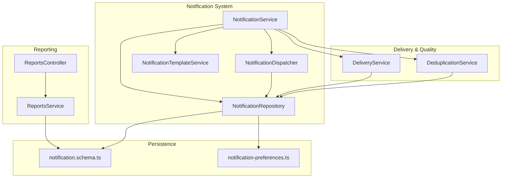
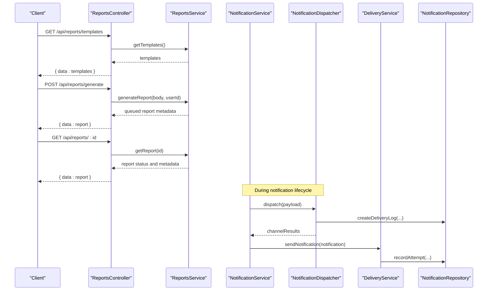
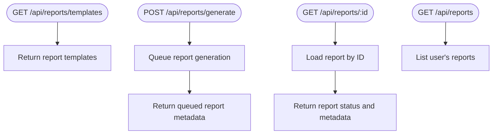
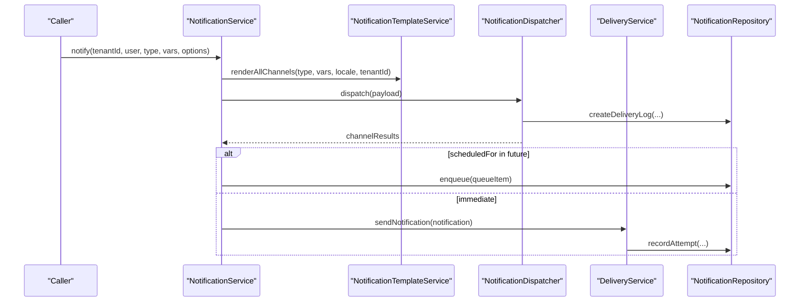
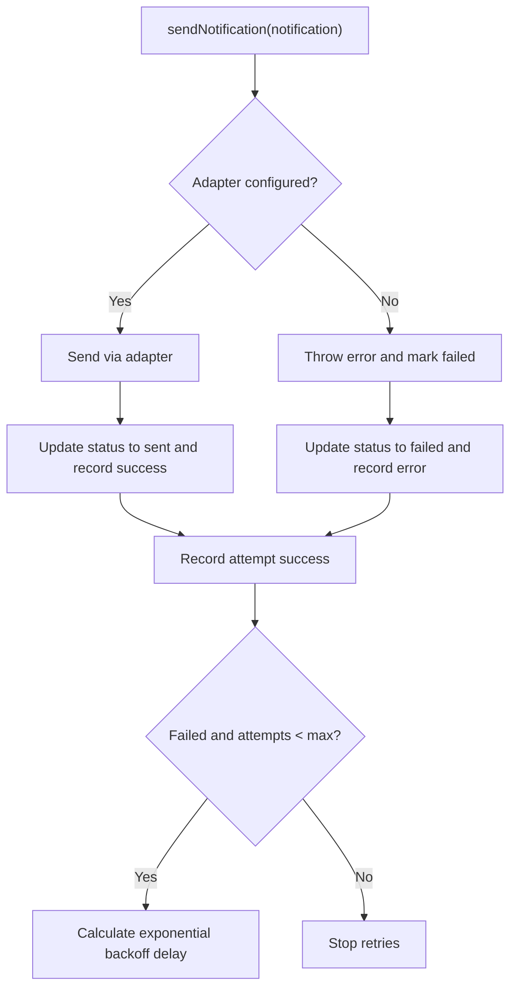
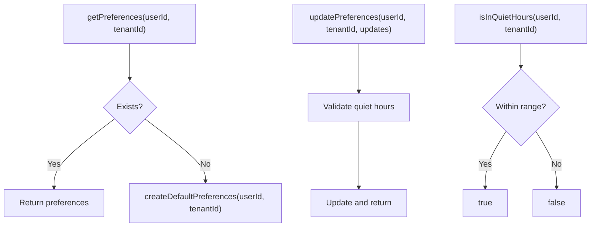
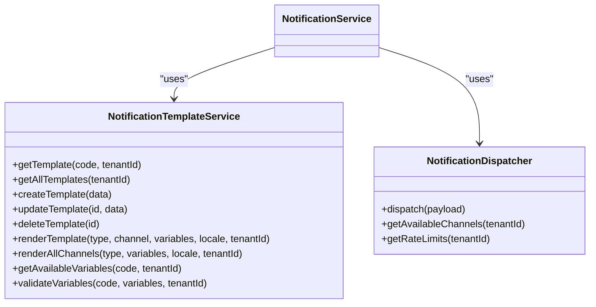
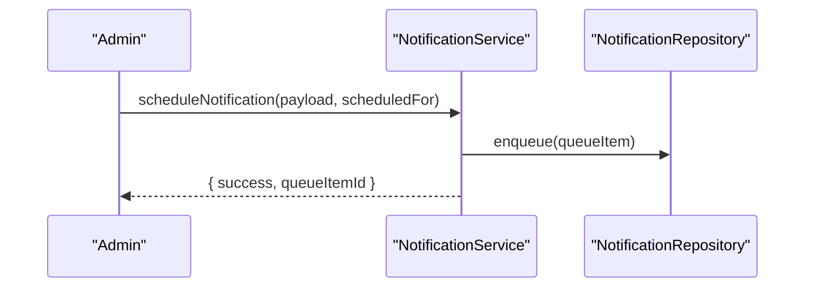
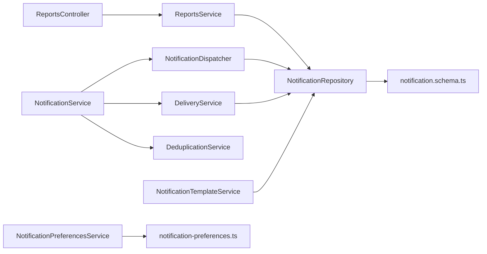

# Notification Reports

<cite>
**Referenced Files in This Document**
- [reports.controller.ts](file://apps/api/src/modules/reports/reports.controller.ts)
- [reports.service.ts](file://apps/api/src/modules/reports/reports.service.ts)
- [notification.service.ts](file://apps/api/src/modules/notification-system/notification.service.ts)
- [notification.dispatcher.ts](file://apps/api/src/modules/notification-system/notification.dispatcher.ts)
- [notification-preferences.service.ts](file://apps/api/src/modules/notification-system/notification-preferences.service.ts)
- [notification-template.service.ts](file://apps/api/src/modules/notification-system/notification-template.service.ts)
- [notification.repository.ts](file://apps/api/src/modules/notification-system/notification.repository.ts)
- [delivery.service.ts](file://apps/api/src/modules/notifications/delivery.service.ts)
- [deduplication.service.ts](file://apps/api/src/modules/notifications/deduplication.service.ts)
- [notification.schema.ts](file://apps/api/src/schemas/notification.schema.ts)
- [notification-preferences.ts](file://apps/api/src/database/schema/notification-preferences.ts)
</cite>

## Table of Contents
1. [Introduction](#introduction)
2. [Project Structure](#project-structure)
3. [Core Components](#core-components)
4. [Architecture Overview](#architecture-overview)
5. [Detailed Component Analysis](#detailed-component-analysis)
6. [Dependency Analysis](#dependency-analysis)
7. [Performance Considerations](#performance-considerations)
8. [Troubleshooting Guide](#troubleshooting-guide)
9. [Conclusion](#conclusion)

## Introduction
This document describes the Notification Reports functionality across the notification system, delivery service, and reporting features. It explains how notifications are delivered, tracked, and reported, including statistics, scheduling, preferences, template analytics, channel performance, and compliance considerations. It also outlines real-time reporting integration points and optimization strategies for delivery rates and recipient engagement.

## Project Structure
The Notification Reports feature spans several modules:
- Reporting module: exposes endpoints for report templates, generation, status, and listing
- Notification system: orchestrates creation, scheduling, dispatching, and tracking
- Delivery service: handles retries, exponential backoff, and delivery attempts
- Deduplication service: prevents duplicate notifications within configurable windows
- Preferences and templates: manage user preferences and template rendering
- Database schemas: define persistence for notifications, preferences, and delivery logs

**Diagram sources**
- [reports.controller.ts](file://apps/api/src/modules/reports/reports.controller.ts#L17-L201)
- [reports.service.ts](file://apps/api/src/modules/reports/reports.service.ts#L21-L140)
- [notification.service.ts](file://apps/api/src/modules/notification-system/notification.service.ts#L33-L369)
- [notification.dispatcher.ts](file://apps/api/src/modules/notification-system/notification.dispatcher.ts#L40-L269)
- [notification-template.service.ts](file://apps/api/src/modules/notification-system/notification-template.service.ts#L14-L235)
- [delivery.service.ts](file://apps/api/src/modules/notifications/delivery.service.ts#L26-L238)
- [deduplication.service.ts](file://apps/api/src/modules/notifications/deduplication.service.ts#L16-L144)
- [notification.schema.ts](file://apps/api/src/schemas/notification.schema.ts)
- [notification-preferences.ts](file://apps/api/src/database/schema/notification-preferences.ts)

**Section sources**
- [reports.controller.ts](file://apps/api/src/modules/reports/reports.controller.ts#L17-L201)
- [reports.service.ts](file://apps/api/src/modules/reports/reports.service.ts#L21-L140)
- [notification.service.ts](file://apps/api/src/modules/notification-system/notification.service.ts#L33-L369)
- [notification.dispatcher.ts](file://apps/api/src/modules/notification-system/notification.dispatcher.ts#L40-L269)
- [notification-template.service.ts](file://apps/api/src/modules/notification-system/notification-template.service.ts#L14-L235)
- [delivery.service.ts](file://apps/api/src/modules/notifications/delivery.service.ts#L26-L238)
- [deduplication.service.ts](file://apps/api/src/modules/notifications/deduplication.service.ts#L16-L144)
- [notification.schema.ts](file://apps/api/src/schemas/notification.schema.ts)
- [notification-preferences.ts](file://apps/api/src/database/schema/notification-preferences.ts)

## Core Components
- ReportsController: exposes endpoints for templates, generation, status, listing, and domain-specific reports (usage, revenue, bookings, organizations).
- ReportsService: defines report templates, queues generation, and resolves report metadata.
- NotificationService: central orchestration for sending, scheduling, user notifications, stats, and delivery logs.
- NotificationDispatcher: routes notifications to channels (email, SMS, in-app, push), records delivery logs, and aggregates channel results.
- DeliveryService: sends notifications via adapters, records attempts, applies exponential backoff, and retries failed deliveries.
- DeduplicationService: computes content hashes and checks for duplicates within a configurable time window.
- NotificationTemplateService: manages templates and renders localized content per channel and locale.
- NotificationPreferencesService: manages user preferences, channel enablement, quiet hours, and type-specific toggles.
- Persistence schemas: define notification records, delivery logs, and preferences.

**Section sources**
- [reports.controller.ts](file://apps/api/src/modules/reports/reports.controller.ts#L17-L201)
- [reports.service.ts](file://apps/api/src/modules/reports/reports.service.ts#L21-L140)
- [notification.service.ts](file://apps/api/src/modules/notification-system/notification.service.ts#L33-L369)
- [notification.dispatcher.ts](file://apps/api/src/modules/notification-system/notification.dispatcher.ts#L40-L269)
- [delivery.service.ts](file://apps/api/src/modules/notifications/delivery.service.ts#L26-L238)
- [deduplication.service.ts](file://apps/api/src/modules/notifications/deduplication.service.ts#L16-L144)
- [notification-template.service.ts](file://apps/api/src/modules/notification-system/notification-template.service.ts#L14-L235)
- [notification-preferences.service.ts](file://apps/api/src/modules/notification-system/notification-preferences.service.ts#L41-L318)
- [notification.schema.ts](file://apps/api/src/schemas/notification.schema.ts)
- [notification-preferences.ts](file://apps/api/src/database/schema/notification-preferences.ts)

## Architecture Overview
The Notification Reports architecture integrates reporting endpoints with the notification pipeline and delivery mechanisms. Real-time dashboards can consume delivery logs and statistics, while scheduled reports provide historical insights.

**Diagram sources**
- [reports.controller.ts](file://apps/api/src/modules/reports/reports.controller.ts#L27-L64)
- [reports.service.ts](file://apps/api/src/modules/reports/reports.service.ts#L87-L128)
- [notification.service.ts](file://apps/api/src/modules/notification-system/notification.service.ts#L59-L125)
- [notification.dispatcher.ts](file://apps/api/src/modules/notification-system/notification.dispatcher.ts#L66-L119)
- [delivery.service.ts](file://apps/api/src/modules/notifications/delivery.service.ts#L41-L91)
- [notification.repository.ts](file://apps/api/src/modules/notification-system/notification.repository.ts)

## Detailed Component Analysis

### Reporting Module
- Templates endpoint returns available report types, formats, parameters, and estimated generation times.
- Generation endpoint queues report creation and returns a report identifier with status.
- Status and listing endpoints resolve report metadata and history.
- Domain-specific reports include usage, revenue, bookings, and organizations.

**Diagram sources**
- [reports.controller.ts](file://apps/api/src/modules/reports/reports.controller.ts#L27-L64)
- [reports.service.ts](file://apps/api/src/modules/reports/reports.service.ts#L87-L138)

**Section sources**
- [reports.controller.ts](file://apps/api/src/modules/reports/reports.controller.ts#L27-L199)
- [reports.service.ts](file://apps/api/src/modules/reports/reports.service.ts#L32-L138)

### Notification Delivery Pipeline
- NotificationService orchestrates creation, scheduling, and dispatching, and maintains user notifications and stats.
- NotificationDispatcher routes to channels, creates delivery logs, and aggregates results.
- DeliveryService sends via adapters, records attempts, and retries with exponential backoff.
- DeduplicationService prevents duplicates within a configurable window.

**Diagram sources**
- [notification.service.ts](file://apps/api/src/modules/notification-system/notification.service.ts#L59-L194)
- [notification.dispatcher.ts](file://apps/api/src/modules/notification-system/notification.dispatcher.ts#L66-L119)
- [delivery.service.ts](file://apps/api/src/modules/notifications/delivery.service.ts#L41-L91)
- [notification-template.service.ts](file://apps/api/src/modules/notification-system/notification-template.service.ts#L131-L155)

**Section sources**
- [notification.service.ts](file://apps/api/src/modules/notification-system/notification.service.ts#L59-L194)
- [notification.dispatcher.ts](file://apps/api/src/modules/notification-system/notification.dispatcher.ts#L66-L119)
- [delivery.service.ts](file://apps/api/src/modules/notifications/delivery.service.ts#L41-L91)
- [notification-template.service.ts](file://apps/api/src/modules/notification-system/notification-template.service.ts#L72-L155)

### Delivery Tracking and Retry Logic
- DeliveryService records attempts, calculates exponential backoff delays, and retries failed notifications.
- DeduplicationService computes SHA-256 hashes and checks for duplicates within a time window.

**Diagram sources**
- [delivery.service.ts](file://apps/api/src/modules/notifications/delivery.service.ts#L41-L182)

**Section sources**
- [delivery.service.ts](file://apps/api/src/modules/notifications/delivery.service.ts#L41-L238)
- [deduplication.service.ts](file://apps/api/src/modules/notifications/deduplication.service.ts#L91-L135)

### Notification Preferences Management
- Preferences include channel enablement (in-app, email, SMS, push), type-specific toggles, and quiet hours.
- Services validate quiet hours, filter enabled channels, and support resetting to defaults.

**Diagram sources**
- [notification-preferences.service.ts](file://apps/api/src/modules/notification-system/notification-preferences.service.ts#L47-L149)

**Section sources**
- [notification-preferences.service.ts](file://apps/api/src/modules/notification-system/notification-preferences.service.ts#L47-L318)

### Template Analytics and Channel Performance
- Template service supports rendering per channel/locale and validates required variables.
- Dispatcher aggregates channel results and logs delivery outcomes for performance analytics.

**Diagram sources**
- [notification-template.service.ts](file://apps/api/src/modules/notification-system/notification-template.service.ts#L21-L195)
- [notification.dispatcher.ts](file://apps/api/src/modules/notification-system/notification.dispatcher.ts#L66-L267)

**Section sources**
- [notification-template.service.ts](file://apps/api/src/modules/notification-system/notification-template.service.ts#L21-L235)
- [notification.dispatcher.ts](file://apps/api/src/modules/notification-system/notification.dispatcher.ts#L66-L267)

### Scheduling Reports and Delivery Rate Monitoring
- NotificationService supports scheduling notifications for future delivery.
- DeliveryService and Dispatcher record delivery logs enabling delivery rate monitoring and channel performance metrics.

**Diagram sources**
- [notification.service.ts](file://apps/api/src/modules/notification-system/notification.service.ts#L130-L147)

**Section sources**
- [notification.service.ts](file://apps/api/src/modules/notification-system/notification.service.ts#L130-L147)
- [notification.dispatcher.ts](file://apps/api/src/modules/notification-system/notification.dispatcher.ts#L96-L110)

### Compliance Reporting Features
- DeduplicationService ensures compliance with anti-spam policies by preventing duplicates within a time window.
- Audit logging is integrated across services for tracking actions and outcomes.

**Section sources**
- [deduplication.service.ts](file://apps/api/src/modules/notifications/deduplication.service.ts#L91-L135)
- [notification.service.ts](file://apps/api/src/modules/notifications/notification.service.ts#L88-L101)

## Dependency Analysis
The following diagram shows key dependencies among components involved in notification reporting and delivery.

**Diagram sources**
- [reports.controller.ts](file://apps/api/src/modules/reports/reports.controller.ts#L17-L201)
- [reports.service.ts](file://apps/api/src/modules/reports/reports.service.ts#L21-L140)
- [notification.service.ts](file://apps/api/src/modules/notification-system/notification.service.ts#L33-L369)
- [notification.dispatcher.ts](file://apps/api/src/modules/notification-system/notification.dispatcher.ts#L40-L269)
- [delivery.service.ts](file://apps/api/src/modules/notifications/delivery.service.ts#L26-L238)
- [deduplication.service.ts](file://apps/api/src/modules/notifications/deduplication.service.ts#L16-L144)
- [notification-template.service.ts](file://apps/api/src/modules/notification-system/notification-template.service.ts#L14-L235)
- [notification-preferences.service.ts](file://apps/api/src/modules/notification-system/notification-preferences.service.ts#L41-L318)
- [notification.schema.ts](file://apps/api/src/schemas/notification.schema.ts)
- [notification-preferences.ts](file://apps/api/src/database/schema/notification-preferences.ts)

**Section sources**
- [reports.controller.ts](file://apps/api/src/modules/reports/reports.controller.ts#L17-L201)
- [reports.service.ts](file://apps/api/src/modules/reports/reports.service.ts#L21-L140)
- [notification.service.ts](file://apps/api/src/modules/notification-system/notification.service.ts#L33-L369)
- [notification.dispatcher.ts](file://apps/api/src/modules/notification-system/notification.dispatcher.ts#L40-L269)
- [delivery.service.ts](file://apps/api/src/modules/notifications/delivery.service.ts#L26-L238)
- [deduplication.service.ts](file://apps/api/src/modules/notifications/deduplication.service.ts#L16-L144)
- [notification-template.service.ts](file://apps/api/src/modules/notification-system/notification-template.service.ts#L14-L235)
- [notification-preferences.service.ts](file://apps/api/src/modules/notification-system/notification-preferences.service.ts#L41-L318)
- [notification.schema.ts](file://apps/api/src/schemas/notification.schema.ts)
- [notification-preferences.ts](file://apps/api/src/database/schema/notification-preferences.ts)

## Performance Considerations
- Exponential backoff reduces load during failures and improves delivery reliability.
- Template rendering is parallelized across channels to minimize latency.
- Deduplication reduces redundant processing and storage overhead.
- Scheduled delivery decouples high-volume bursts from real-time processing.

[No sources needed since this section provides general guidance]

## Troubleshooting Guide
Common issues and resolutions:
- Duplicate notifications: DeduplicationService prevents duplicates within a time window; check content hash and window configuration.
- Delivery failures: DeliveryService records attempts and errors; inspect retry counts and next retry times.
- Channel unavailability: NotificationDispatcher.getAvailableChannels and getRateLimits surface provider constraints.
- Preference conflicts: NotificationPreferencesService filters channels and quiet hours; validate user settings.

**Section sources**
- [deduplication.service.ts](file://apps/api/src/modules/notifications/deduplication.service.ts#L91-L135)
- [delivery.service.ts](file://apps/api/src/modules/notifications/delivery.service.ts#L128-L182)
- [notification.dispatcher.ts](file://apps/api/src/modules/notification-system/notification.dispatcher.ts#L229-L267)
- [notification-preferences.service.ts](file://apps/api/src/modules/notification-system/notification-preferences.service.ts#L212-L265)

## Conclusion
The Notification Reports feature integrates reporting endpoints with a robust notification pipeline that includes scheduling, delivery tracking, deduplication, and preferences management. Real-time dashboards can leverage delivery logs and statistics, while scheduled reports provide historical insights. The system’s modular design enables optimization of delivery rates, channel performance monitoring, and compliance adherence.