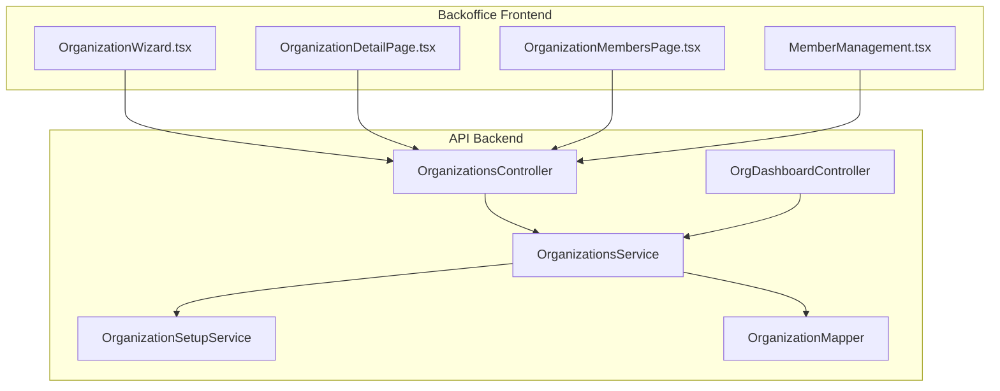
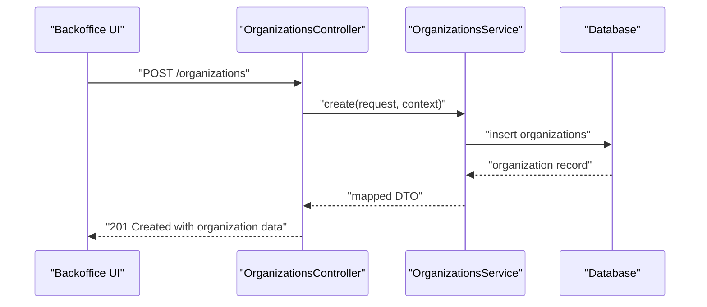
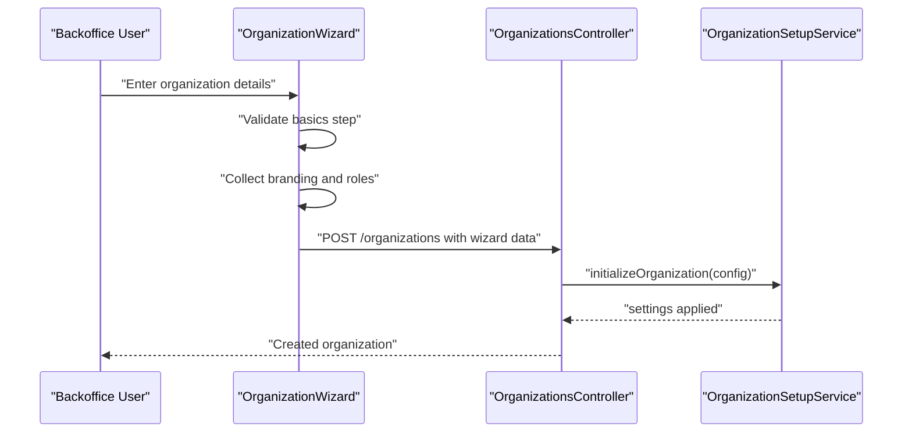
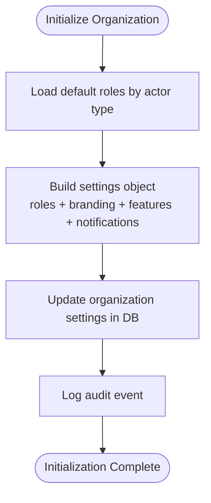
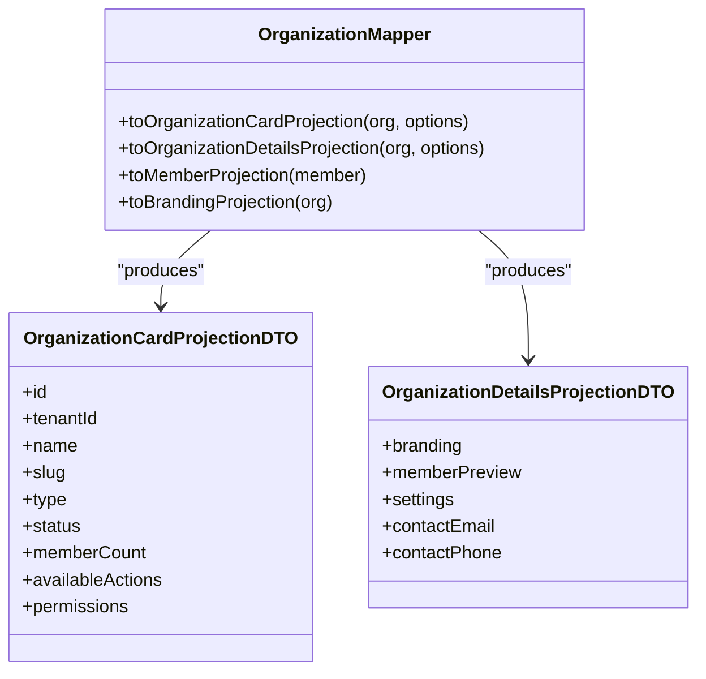
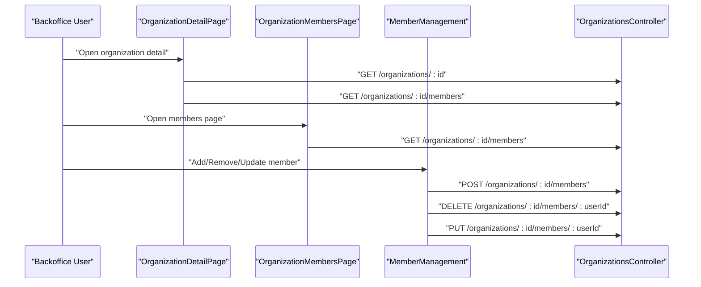
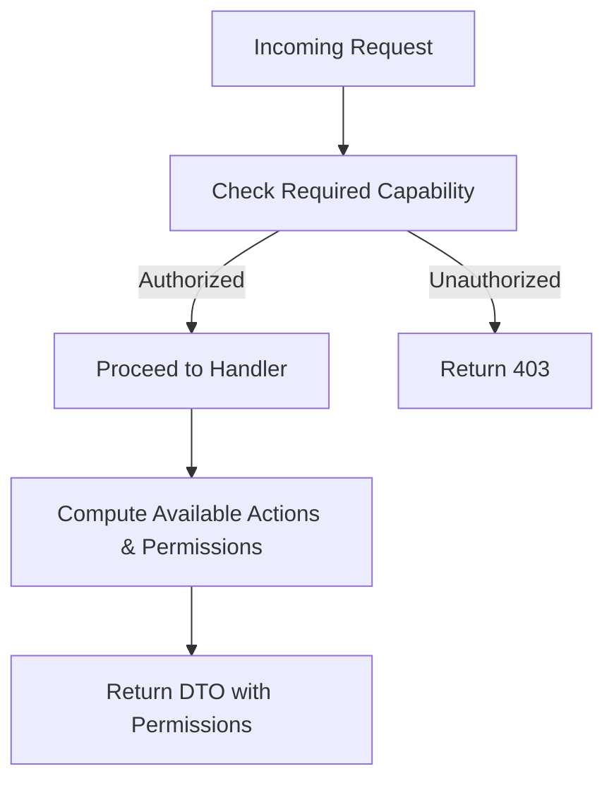
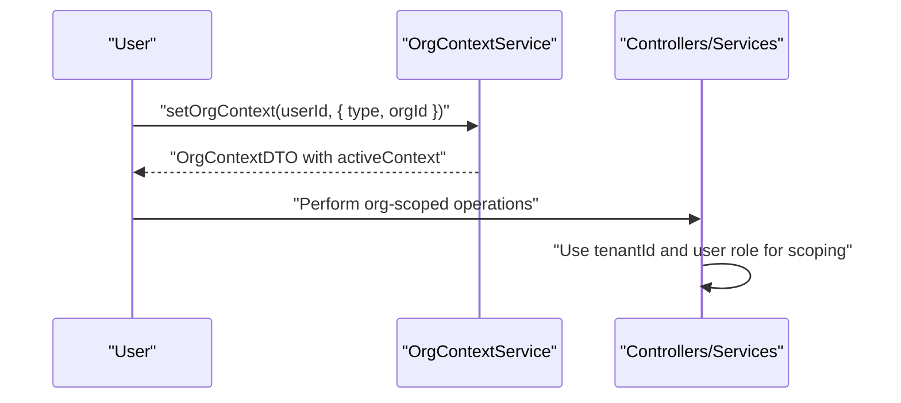
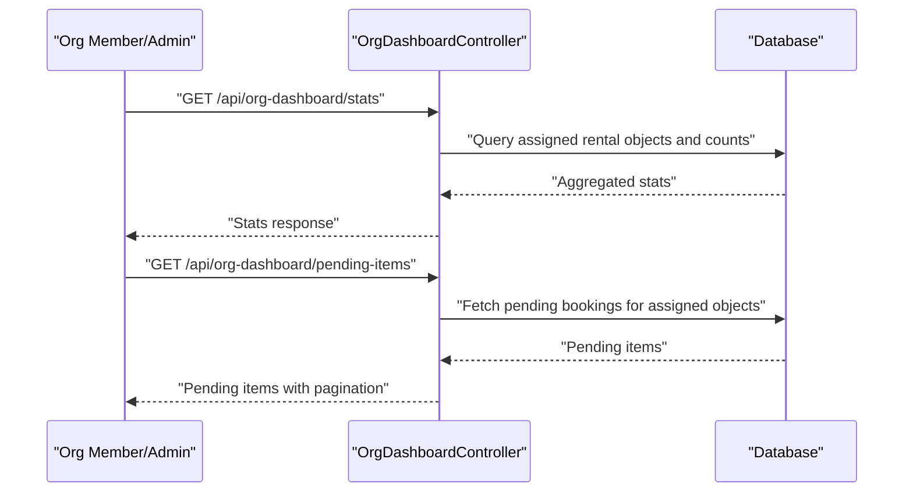
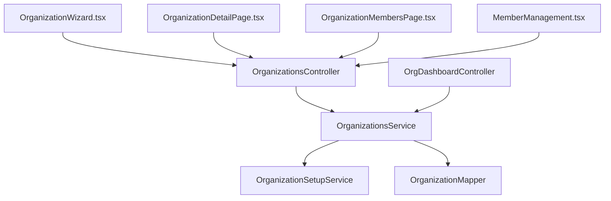

# Organization Administration

<cite>
**Referenced Files in This Document**
- [organizations.controller.ts](file://apps/api/src/modules/organizations/organizations.controller.ts)
- [organizations.service.ts](file://apps/api/src/modules/organizations/organizations.service.ts)
- [organization-setup.service.ts](file://apps/api/src/modules/organizations/organization-setup.service.ts)
- [organization.mapper.ts](file://apps/api/src/modules/organizations/organization.mapper.ts)
- [org-dashboard.controller.ts](file://apps/api/src/modules/dashboard/org-dashboard.controller.ts)
- [OrganizationWizard.tsx](file://apps/backoffice/src/components/organizations/OrganizationWizard.tsx)
- [OrganizationDetailPage.tsx](file://apps/backoffice/src/routes/organizations/OrganizationDetailPage.tsx)
- [OrganizationMembersPage.tsx](file://apps/backoffice/src/routes/organizations/OrganizationMembersPage.tsx)
- [MemberManagement.tsx](file://apps/backoffice/src/components/organizations/MemberManagement.tsx)
- [organization-creation-wizard.spec.ts](file://tests/e2e/organization-creation-wizard.spec.ts)
- [org-context.service.ts](file://apps/api/src/modules/minside/org-context.service.ts)
</cite>

## Table of Contents
1. [Introduction](#introduction)
2. [Project Structure](#project-structure)
3. [Core Components](#core-components)
4. [Architecture Overview](#architecture-overview)
5. [Detailed Component Analysis](#detailed-component-analysis)
6. [Dependency Analysis](#dependency-analysis)
7. [Performance Considerations](#performance-considerations)
8. [Troubleshooting Guide](#troubleshooting-guide)
9. [Conclusion](#conclusion)

## Introduction
This document provides comprehensive documentation for Organization Administration features across the monorepo. It covers the organization creation workflow using the OrganizationWizard, organization setup processes, organizational structure management, detail views, member management interfaces, permission assignment systems, organization context switching, multi-tenant organization handling, and organization-level settings management. It also documents the organization setup service integration, organization mapper functionality, and the org dashboard for organization members and administrators.

## Project Structure
The Organization Administration system spans both the API backend and the Backoffice frontend applications:
- Backend API exposes organization CRUD, member management, branding, and setup services.
- Frontend Backoffice provides wizards, detail pages, and member management UI.
- End-to-end tests validate the organization creation wizard flow.

**Diagram sources**
- [OrganizationWizard.tsx](file://apps/backoffice/src/components/organizations/OrganizationWizard.tsx#L71-L520)
- [OrganizationDetailPage.tsx](file://apps/backoffice/src/routes/organizations/OrganizationDetailPage.tsx#L75-L665)
- [OrganizationMembersPage.tsx](file://apps/backoffice/src/routes/organizations/OrganizationMembersPage.tsx#L43-L191)
- [MemberManagement.tsx](file://apps/backoffice/src/components/organizations/MemberManagement.tsx#L31-L93)
- [organizations.controller.ts](file://apps/api/src/modules/organizations/organizations.controller.ts#L14-L208)
- [organizations.service.ts](file://apps/api/src/modules/organizations/organizations.service.ts#L46-L409)
- [organization-setup.service.ts](file://apps/api/src/modules/organizations/organization-setup.service.ts#L111-L330)
- [organization.mapper.ts](file://apps/api/src/modules/organizations/organization.mapper.ts#L371-L525)
- [org-dashboard.controller.ts](file://apps/api/src/modules/dashboard/org-dashboard.controller.ts#L74-L585)

**Section sources**
- [organizations.controller.ts](file://apps/api/src/modules/organizations/organizations.controller.ts#L14-L208)
- [organizations.service.ts](file://apps/api/src/modules/organizations/organizations.service.ts#L46-L409)
- [organization-setup.service.ts](file://apps/api/src/modules/organizations/organization-setup.service.ts#L111-L330)
- [organization.mapper.ts](file://apps/api/src/modules/organizations/organization.mapper.ts#L371-L525)
- [org-dashboard.controller.ts](file://apps/api/src/modules/dashboard/org-dashboard.controller.ts#L74-L585)
- [OrganizationWizard.tsx](file://apps/backoffice/src/components/organizations/OrganizationWizard.tsx#L71-L520)
- [OrganizationDetailPage.tsx](file://apps/backoffice/src/routes/organizations/OrganizationDetailPage.tsx#L75-L665)
- [OrganizationMembersPage.tsx](file://apps/backoffice/src/routes/organizations/OrganizationMembersPage.tsx#L43-L191)
- [MemberManagement.tsx](file://apps/backoffice/src/components/organizations/MemberManagement.tsx#L31-L93)

## Core Components
- OrganizationsController: Exposes REST endpoints for listing, retrieving, creating, updating, deleting organizations, and managing members and rental object assignments.
- OrganizationsService: Implements business logic for organization lifecycle, member management, and rental object assignment with role-based scoping.
- OrganizationSetupService: Initializes organizations with default roles, branding, and feature flags; updates branding settings; validates roles.
- OrganizationMapper: Transforms database entities to UI-ready DTOs for cards, details, members, and branding.
- OrgDashboardController: Provides organization-scoped dashboards for org members and admins, including stats, pending items, calendar preview, alerts, and assigned objects.
- OrganizationWizard: Multi-step wizard for creating organizations with basics, branding, and roles configuration.
- OrganizationDetailPage and OrganizationMembersPage: Full-page detail and members management UI for organizations.
- MemberManagement: Add/remove/update member roles and manage organization members.

**Section sources**
- [organizations.controller.ts](file://apps/api/src/modules/organizations/organizations.controller.ts#L14-L208)
- [organizations.service.ts](file://apps/api/src/modules/organizations/organizations.service.ts#L46-L409)
- [organization-setup.service.ts](file://apps/api/src/modules/organizations/organization-setup.service.ts#L111-L330)
- [organization.mapper.ts](file://apps/api/src/modules/organizations/organization.mapper.ts#L371-L525)
- [org-dashboard.controller.ts](file://apps/api/src/modules/dashboard/org-dashboard.controller.ts#L74-L585)
- [OrganizationWizard.tsx](file://apps/backoffice/src/components/organizations/OrganizationWizard.tsx#L71-L520)
- [OrganizationDetailPage.tsx](file://apps/backoffice/src/routes/organizations/OrganizationDetailPage.tsx#L75-L665)
- [OrganizationMembersPage.tsx](file://apps/backoffice/src/routes/organizations/OrganizationMembersPage.tsx#L43-L191)
- [MemberManagement.tsx](file://apps/backoffice/src/components/organizations/MemberManagement.tsx#L31-L93)

## Architecture Overview
The system follows a layered architecture:
- Presentation layer: Backoffice React components and pages.
- Application layer: Controllers and Services implementing organization workflows.
- Domain/Infrastructure layer: OrganizationSetupService and OrganizationMapper.
- Data layer: Drizzle ORM queries against the database.

**Diagram sources**
- [organizations.controller.ts](file://apps/api/src/modules/organizations/organizations.controller.ts#L66-L77)
- [organizations.service.ts](file://apps/api/src/modules/organizations/organizations.service.ts#L102-L136)

## Detailed Component Analysis

### Organization Creation Workflow (OrganizationWizard)
The OrganizationWizard provides a guided, multi-step process for creating organizations:
- Basics step: Validates name, email format, organization number, and postal code.
- Branding step: Collects logo, primary/secondary colors, favicon.
- Roles step: Allows selecting default roles per actor type.

**Diagram sources**
- [OrganizationWizard.tsx](file://apps/backoffice/src/components/organizations/OrganizationWizard.tsx#L112-L177)
- [organizations.controller.ts](file://apps/api/src/modules/organizations/organizations.controller.ts#L66-L77)
- [organization-setup.service.ts](file://apps/api/src/modules/organizations/organization-setup.service.ts#L140-L195)

**Section sources**
- [OrganizationWizard.tsx](file://apps/backoffice/src/components/organizations/OrganizationWizard.tsx#L112-L177)
- [organization-creation-wizard.spec.ts](file://tests/e2e/organization-creation-wizard.spec.ts#L22-L275)

### Organization Setup Service Integration
OrganizationSetupService initializes organizations with:
- Default roles based on actor type (municipality vs organization).
- Branding defaults (colors, optional logo).
- Feature flags (bookings, seasonal leases, conversations, reports).
- Audit logging for initialization.

**Diagram sources**
- [organization-setup.service.ts](file://apps/api/src/modules/organizations/organization-setup.service.ts#L140-L195)

**Section sources**
- [organization-setup.service.ts](file://apps/api/src/modules/organizations/organization-setup.service.ts#L111-L330)

### Organization Mapper Functionality
OrganizationMapper transforms database records into UI DTOs:
- OrganizationCardProjectionDTO for list views with permissions and actions.
- OrganizationDetailsProjectionDTO for detail views with branding, member preview, and settings.
- MemberProjectionDTO for member lists.
- BrandingProjectionDTO for branding management.

**Diagram sources**
- [organization.mapper.ts](file://apps/api/src/modules/organizations/organization.mapper.ts#L371-L448)

**Section sources**
- [organization.mapper.ts](file://apps/api/src/modules/organizations/organization.mapper.ts#L371-L525)

### Organization Detail Views and Member Management
- OrganizationDetailPage displays organization information, statistics, members, bookings, seasonal leases, and activity logs.
- OrganizationMembersPage focuses on member statistics and management.
- MemberManagement handles adding/removing members and role updates.

**Diagram sources**
- [OrganizationDetailPage.tsx](file://apps/backoffice/src/routes/organizations/OrganizationDetailPage.tsx#L81-L94)
- [OrganizationMembersPage.tsx](file://apps/backoffice/src/routes/organizations/OrganizationMembersPage.tsx#L47-L51)
- [MemberManagement.tsx](file://apps/backoffice/src/components/organizations/MemberManagement.tsx#L49-L93)
- [organizations.controller.ts](file://apps/api/src/modules/organizations/organizations.controller.ts#L119-L158)

**Section sources**
- [OrganizationDetailPage.tsx](file://apps/backoffice/src/routes/organizations/OrganizationDetailPage.tsx#L75-L665)
- [OrganizationMembersPage.tsx](file://apps/backoffice/src/routes/organizations/OrganizationMembersPage.tsx#L43-L191)
- [MemberManagement.tsx](file://apps/backoffice/src/components/organizations/MemberManagement.tsx#L31-L93)
- [organizations.controller.ts](file://apps/api/src/modules/organizations/organizations.controller.ts#L119-L158)

### Permission Assignment Systems
- Controllers enforce capability-based access control (RBAC) for organization operations.
- OrganizationMapper computes available actions and permissions based on user role and organization status.

**Diagram sources**
- [organizations.controller.ts](file://apps/api/src/modules/organizations/organizations.controller.ts#L27-L43)
- [organization.mapper.ts](file://apps/api/src/modules/organizations/organization.mapper.ts#L287-L316)

**Section sources**
- [organizations.controller.ts](file://apps/api/src/modules/organizations/organizations.controller.ts#L27-L43)
- [organization.mapper.ts](file://apps/api/src/modules/organizations/organization.mapper.ts#L287-L316)

### Organization Context Switching and Multi-Tenant Handling
- Organization context setting is supported via org-context service, enabling switching active organization contexts for users.
- Controllers and services use tenantId and user context to scope operations and enforce role-based access.

**Diagram sources**
- [org-context.service.ts](file://apps/api/src/modules/minside/org-context.service.ts#L66-L80)

**Section sources**
- [org-context.service.ts](file://apps/api/src/modules/minside/org-context.service.ts#L66-L80)
- [organizations.controller.ts](file://apps/api/src/modules/organizations/organizations.controller.ts#L33-L39)

### Organization Dashboard Workflows
- OrgDashboardController provides organization-scoped dashboards for org members and admins:
  - Stats for assigned rental objects.
  - Pending items requiring approval.
  - Calendar preview for bookings and blocks.
  - Alerts for upcoming blocks and pending bookings.
  - Assigned rental objects list.

**Diagram sources**
- [org-dashboard.controller.ts](file://apps/api/src/modules/dashboard/org-dashboard.controller.ts#L80-L208)

**Section sources**
- [org-dashboard.controller.ts](file://apps/api/src/modules/dashboard/org-dashboard.controller.ts#L74-L585)

## Dependency Analysis
The following diagram shows key dependencies among organization administration components:

**Diagram sources**
- [OrganizationWizard.tsx](file://apps/backoffice/src/components/organizations/OrganizationWizard.tsx#L71-L520)
- [OrganizationDetailPage.tsx](file://apps/backoffice/src/routes/organizations/OrganizationDetailPage.tsx#L75-L665)
- [OrganizationMembersPage.tsx](file://apps/backoffice/src/routes/organizations/OrganizationMembersPage.tsx#L43-L191)
- [MemberManagement.tsx](file://apps/backoffice/src/components/organizations/MemberManagement.tsx#L31-L93)
- [organizations.controller.ts](file://apps/api/src/modules/organizations/organizations.controller.ts#L14-L208)
- [organizations.service.ts](file://apps/api/src/modules/organizations/organizations.service.ts#L46-L409)
- [organization-setup.service.ts](file://apps/api/src/modules/organizations/organization-setup.service.ts#L111-L330)
- [organization.mapper.ts](file://apps/api/src/modules/organizations/organization.mapper.ts#L371-L525)
- [org-dashboard.controller.ts](file://apps/api/src/modules/dashboard/org-dashboard.controller.ts#L74-L585)

**Section sources**
- [organizations.controller.ts](file://apps/api/src/modules/organizations/organizations.controller.ts#L14-L208)
- [organizations.service.ts](file://apps/api/src/modules/organizations/organizations.service.ts#L46-L409)
- [organization-setup.service.ts](file://apps/api/src/modules/organizations/organization-setup.service.ts#L111-L330)
- [organization.mapper.ts](file://apps/api/src/modules/organizations/organization.mapper.ts#L371-L525)
- [org-dashboard.controller.ts](file://apps/api/src/modules/dashboard/org-dashboard.controller.ts#L74-L585)
- [OrganizationWizard.tsx](file://apps/backoffice/src/components/organizations/OrganizationWizard.tsx#L71-L520)
- [OrganizationDetailPage.tsx](file://apps/backoffice/src/routes/organizations/OrganizationDetailPage.tsx#L75-L665)
- [OrganizationMembersPage.tsx](file://apps/backoffice/src/routes/organizations/OrganizationMembersPage.tsx#L43-L191)
- [MemberManagement.tsx](file://apps/backoffice/src/components/organizations/MemberManagement.tsx#L31-L93)

## Performance Considerations
- Use paginated queries for listing organizations and members to avoid large payloads.
- Cache frequently accessed organization details and member lists where appropriate.
- Minimize database joins in detail views by precomputing member previews and statistics.
- Apply filters early in queries (e.g., status, tenantId) to reduce result sets.
- Use efficient aggregation queries for dashboard metrics.

## Troubleshooting Guide
Common issues and resolutions:
- Organization creation fails due to missing name or invalid type: Validate input in the wizard and controller.
- Member addition fails if user is already a member: Ensure deduplication checks are enforced.
- Unauthorized access to organization operations: Verify capability checks and user role scoping.
- Dashboard returns empty data: Confirm assigned rental object IDs resolution and user context.

**Section sources**
- [organizations.controller.ts](file://apps/api/src/modules/organizations/organizations.controller.ts#L66-L77)
- [organizations.service.ts](file://apps/api/src/modules/organizations/organizations.service.ts#L224-L271)
- [organization-creation-wizard.spec.ts](file://tests/e2e/organization-creation-wizard.spec.ts#L22-L275)

## Conclusion
The Organization Administration system integrates a robust backend API with comprehensive front-end UI components to support organization creation, setup, management, and dashboards. The modular design with dedicated services and mappers ensures maintainability and scalability while enforcing strict role-based access control and tenant scoping.