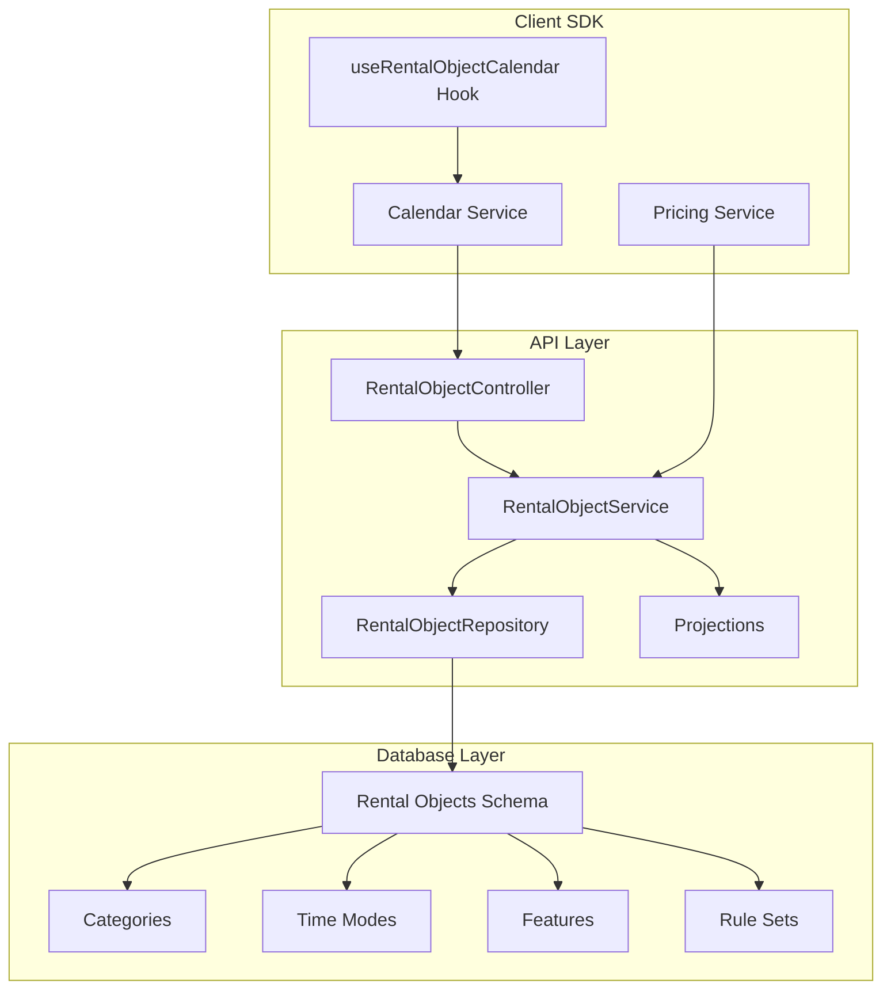
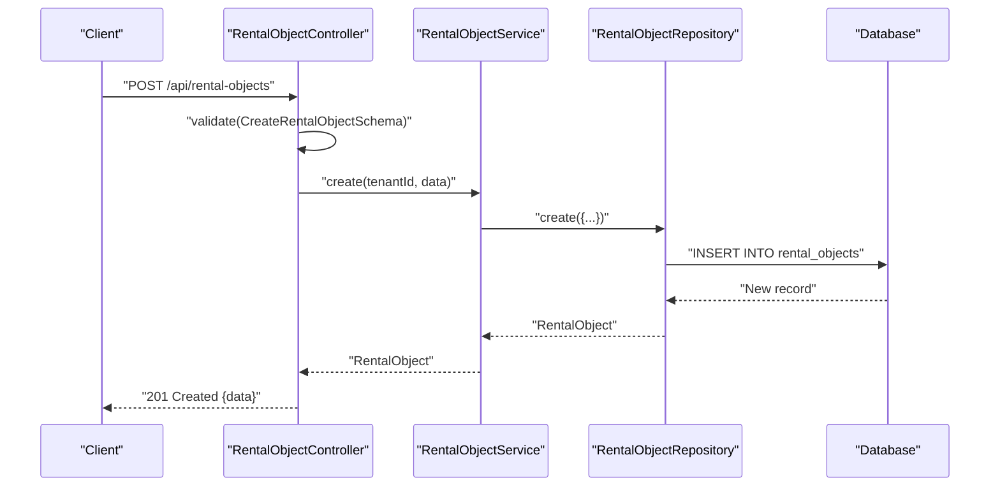
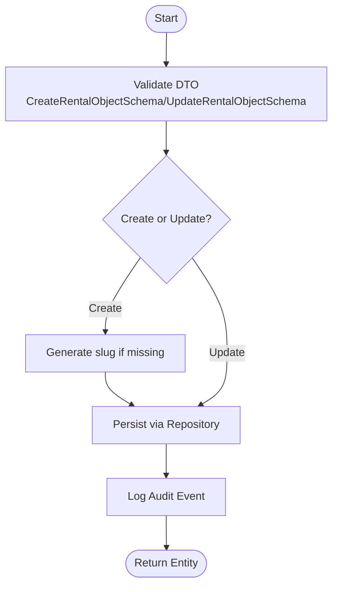
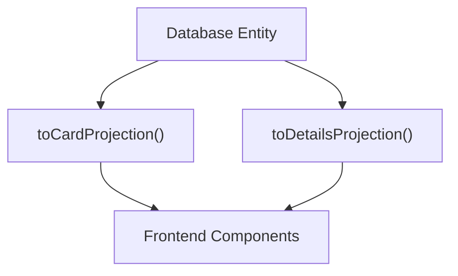
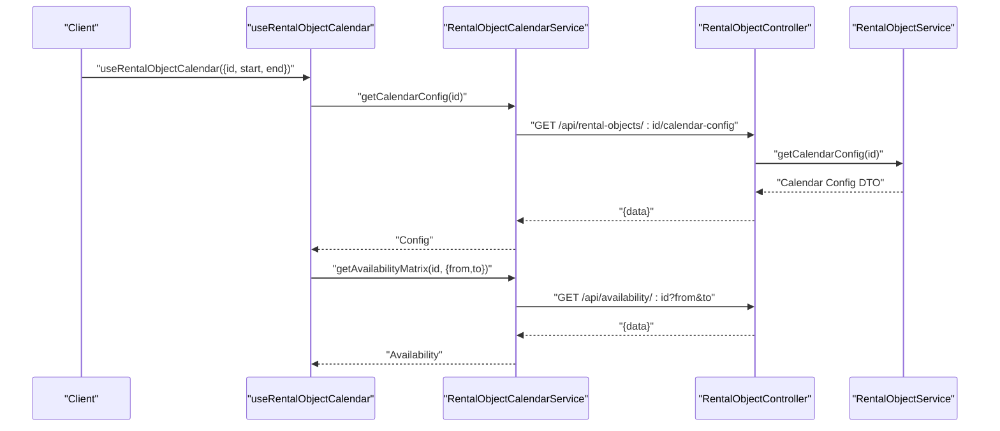
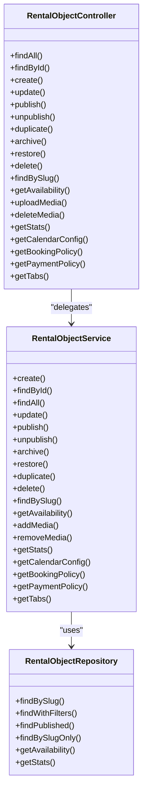

# Rental Objects Management

<cite>
**Referenced Files in This Document**
- [rental-object.controller.ts](file://apps/api/src/modules/rental-objects/rental-object.controller.ts)
- [rental-object.service.ts](file://apps/api/src/modules/rental-objects/rental-object.service.ts)
- [rental-object.repository.ts](file://apps/api/src/modules/rental-objects/rental-object.repository.ts)
- [rental-object.projections.ts](file://apps/api/src/modules/rental-objects/rental-object.projections.ts)
- [rental-object.schema.ts](file://apps/api/src/schemas/rental-object.schema.ts)
- [rental-objects.ts](file://apps/api/src/database/schema/rental-objects.ts)
- [configuration.repository.ts](file://apps/api/src/modules/configuration/configuration.repository.ts)
- [calendar.service.ts](file://packages/client-sdk/src/services/calendar.service.ts)
- [use-rental-object-calendar.ts](file://packages/client-sdk/src/hooks/use-rental-object-calendar.ts)
- [pricing.service.ts](file://packages/client-sdk/src/services/pricing.service.ts)
- [pricing.types.ts](file://packages/client-sdk/src/types/pricing.types.ts)
- [pricing.service.ts](file://apps/api/src/modules/pricing/pricing.service.ts)
- [acl-flow.test.ts](file://tests/integration/acl-flow.test.ts)
- [rental-objects-performance.test.tsx](file://apps/backoffice/src/features/rental-objects/__tests__/performance/rental-objects-performance.test.tsx)
- [rental-objects-penetration.test.tsx](file://apps/backoffice/src/features/rental-objects/__tests__/security/rental-objects-penetration.test.tsx)
- [rental-objects.tsx](file://apps/backoffice/src/routes/rental-objects.tsx)
- [rental-objects.tsx](file://apps/backoffice/src/routes/organizations/rental-objects.tsx)
</cite>

## Table of Contents
1. [Introduction](#introduction)
2. [Project Structure](#project-structure)
3. [Core Components](#core-components)
4. [Architecture Overview](#architecture-overview)
5. [Detailed Component Analysis](#detailed-component-analysis)
6. [Dependency Analysis](#dependency-analysis)
7. [Performance Considerations](#performance-considerations)
8. [Troubleshooting Guide](#troubleshooting-guide)
9. [Conclusion](#conclusion)
10. [Appendices](#appendices)

## Introduction
This document describes the Rental Objects Management functionality across the API backend, database schema, and client SDK. It covers the creation and editing workflows, wizard-based setup, detail views, property categorization, metadata management, categories and subcategories, image management, amenity configuration, availability settings, integration with the rental object service and repository patterns, projection systems, search and filtering, bulk operations, relationships with organizations, pricing integration, and calendar management features.

## Project Structure
The Rental Objects Management system spans three main layers:
- API Layer: Controllers, Services, Repositories, and Projections
- Database Layer: Canonical schema with categories, time modes, features, and rule sets
- Client SDK Layer: Services and hooks for calendar and pricing integration

**Diagram sources**
- [rental-object.controller.ts](file://apps/api/src/modules/rental-objects/rental-object.controller.ts#L1-L379)
- [rental-object.service.ts](file://apps/api/src/modules/rental-objects/rental-object.service.ts#L1-L468)
- [rental-object.repository.ts](file://apps/api/src/modules/rental-objects/rental-object.repository.ts#L1-L185)
- [rental-object.projections.ts](file://apps/api/src/modules/rental-objects/rental-object.projections.ts#L1-L590)
- [rental-objects.ts](file://apps/api/src/database/schema/rental-objects.ts#L1-L152)
- [calendar.service.ts](file://packages/client-sdk/src/services/calendar.service.ts#L1-L104)
- [use-rental-object-calendar.ts](file://packages/client-sdk/src/hooks/use-rental-object-calendar.ts#L75-L123)
- [pricing.service.ts](file://packages/client-sdk/src/services/pricing.service.ts#L93-L130)

**Section sources**
- [rental-object.controller.ts](file://apps/api/src/modules/rental-objects/rental-object.controller.ts#L1-L379)
- [rental-objects.ts](file://apps/api/src/database/schema/rental-objects.ts#L1-L152)

## Core Components
- RentalObjectController: Exposes REST endpoints for listing, retrieving, creating, updating, publishing, duplicating, archiving, and deleting rental objects; also exposes availability, media, stats, and policy endpoints.
- RentalObjectService: Implements business logic for CRUD operations, status transitions, duplication, availability retrieval, media management, statistics, and policy generation (booking, payment, tabs).
- RentalObjectRepository: Provides data access with tenant scoping, filtering, pagination, and availability/statistics stubs.
- Projections: Transforms database entities into card and details DTOs for consistent frontend consumption.
- Schemas: Define validation for create/update DTOs, query parameters, and dynamic enums backed by configuration.
- Database Schema: Defines canonical tables for categories, time modes, features, rule sets, and rental objects with indexes and foreign keys.
- Configuration Repository: Supplies subcategories and configuration-driven enums for categories, time modes, and features.
- Client SDK: Calendar service and hook for calendar configuration and availability; pricing service for rental object pricing.

**Section sources**
- [rental-object.controller.ts](file://apps/api/src/modules/rental-objects/rental-object.controller.ts#L1-L379)
- [rental-object.service.ts](file://apps/api/src/modules/rental-objects/rental-object.service.ts#L1-L468)
- [rental-object.repository.ts](file://apps/api/src/modules/rental-objects/rental-object.repository.ts#L1-L185)
- [rental-object.projections.ts](file://apps/api/src/modules/rental-objects/rental-object.projections.ts#L1-L590)
- [rental-object.schema.ts](file://apps/api/src/schemas/rental-object.schema.ts#L1-L351)
- [rental-objects.ts](file://apps/api/src/database/schema/rental-objects.ts#L1-L152)
- [configuration.repository.ts](file://apps/api/src/modules/configuration/configuration.repository.ts#L97-L132)
- [calendar.service.ts](file://packages/client-sdk/src/services/calendar.service.ts#L1-L104)
- [use-rental-object-calendar.ts](file://packages/client-sdk/src/hooks/use-rental-object-calendar.ts#L75-L123)
- [pricing.service.ts](file://packages/client-sdk/src/services/pricing.service.ts#L93-L130)

## Architecture Overview
The system follows clean architecture with clear separation of concerns:
- Controllers handle HTTP requests and responses, delegating to services.
- Services encapsulate business rules and orchestrate repositories and adapters.
- Repositories abstract persistence and expose typed operations.
- Projections transform domain entities into presentation-ready DTOs.
- Schemas enforce validation and support dynamic configuration.
- Database schema defines canonical models and relationships.

**Diagram sources**
- [rental-object.controller.ts](file://apps/api/src/modules/rental-objects/rental-object.controller.ts#L65-L71)
- [rental-object.service.ts](file://apps/api/src/modules/rental-objects/rental-object.service.ts#L30-L65)
- [rental-object.repository.ts](file://apps/api/src/modules/rental-objects/rental-object.repository.ts#L18-L20)
- [rental-objects.ts](file://apps/api/src/database/schema/rental-objects.ts#L79-L119)

## Detailed Component Analysis

### Rental Object Creation and Editing Workflows
- Creation: Validates input using CreateRentalObjectSchema, generates slug if missing, defaults time mode and pricing, persists via repository, logs audit events, and returns the created entity.
- Editing: Validates updates using UpdateRentalObjectSchema, applies changes via repository, logs audit events, and returns updated entity.
- Publishing/Unpublishing/Archiving/Restoring: Mutates status with audit logging and returns updated entity.
- Duplication: Clones an existing object with a new name and slug, resets timestamps, and logs duplication.

**Diagram sources**
- [rental-object.service.ts](file://apps/api/src/modules/rental-objects/rental-object.service.ts#L30-L113)
- [rental-object.repository.ts](file://apps/api/src/modules/rental-objects/rental-object.repository.ts#L18-L20)
- [rental-object.schema.ts](file://apps/api/src/schemas/rental-object.schema.ts#L237-L284)

**Section sources**
- [rental-object.service.ts](file://apps/api/src/modules/rental-objects/rental-object.service.ts#L27-L233)
- [rental-object.schema.ts](file://apps/api/src/schemas/rental-object.schema.ts#L237-L284)

### Wizard-Based Setup Process
- The system supports a wizard-like setup through the creation endpoint and category/time-mode/feature configuration. The controller exposes category/time-mode/feature endpoints for UI guidance, enabling step-by-step configuration during creation.
- The wizard leverages dynamic configuration from the configuration module to present valid options for categories, time modes, and features.

**Section sources**
- [rental-object.controller.ts](file://apps/api/src/modules/rental-objects/rental-object.controller.ts#L251-L378)
- [configuration.repository.ts](file://apps/api/src/modules/configuration/configuration.repository.ts#L97-L132)

### Rental Object Detail Views and Projections
- Card Projection: Flattens essential fields for listing and preview, including category, time mode, location, pricing, capacity, ratings, and image metadata.
- Details Projection: Expands card projection with images, address, opening hours, rules, FAQ, highlights, booking calendar type, duration constraints, cancellation policy, and permissions.
- Projections handle both string arrays and object arrays for images and normalize metadata for consistent frontend rendering.

**Diagram sources**
- [rental-object.projections.ts](file://apps/api/src/modules/rental-objects/rental-object.projections.ts#L362-L590)

**Section sources**
- [rental-object.projections.ts](file://apps/api/src/modules/rental-objects/rental-object.projections.ts#L362-L590)

### Property Categorization and Metadata Management
- Categories: Four canonical categories with allowed time modes and features defined in the schema.
- Subcategories: Retrieved via configuration repository with optional enablement filtering.
- Metadata: Stored as JSONB and normalized in projections for location, contact info, opening hours, guidelines, FAQ, and booking configuration.

**Section sources**
- [rental-objects.ts](file://apps/api/src/database/schema/rental-objects.ts#L27-L73)
- [configuration.repository.ts](file://apps/api/src/modules/configuration/configuration.repository.ts#L101-L132)
- [rental-object.projections.ts](file://apps/api/src/modules/rental-objects/rental-object.projections.ts#L416-L582)

### Image Management and Amenity Configuration
- Images: Managed via dedicated endpoints for upload and deletion; stored in JSONB array and transformed into absolute URLs in projections.
- Amenities: Extracted from metadata and prefixed for i18n resolution; supports both arrays and object formats.

**Section sources**
- [rental-object.controller.ts](file://apps/api/src/modules/rental-objects/rental-object.controller.ts#L174-L191)
- [rental-object.service.ts](file://apps/api/src/modules/rental-objects/rental-object.service.ts#L262-L275)
- [rental-object.projections.ts](file://apps/api/src/modules/rental-objects/rental-object.projections.ts#L305-L319)

### Availability Settings and Calendar Integration
- Availability Endpoint: Returns availability for a date range.
- Calendar Configuration: Returns granularity, slot durations, allowed modes, permissions, and timezone.
- Client SDK: Provides calendar service and hook to fetch configuration and availability matrices.

**Diagram sources**
- [use-rental-object-calendar.ts](file://packages/client-sdk/src/hooks/use-rental-object-calendar.ts#L94-L119)
- [calendar.service.ts](file://packages/client-sdk/src/services/calendar.service.ts#L51-L99)
- [rental-object.controller.ts](file://apps/api/src/modules/rental-objects/rental-object.controller.ts#L207-L211)
- [rental-object.service.ts](file://apps/api/src/modules/rental-objects/rental-object.service.ts#L287-L314)

**Section sources**
- [rental-object.controller.ts](file://apps/api/src/modules/rental-objects/rental-object.controller.ts#L158-L211)
- [rental-object.service.ts](file://apps/api/src/modules/rental-objects/rental-object.service.ts#L255-L314)
- [calendar.service.ts](file://packages/client-sdk/src/services/calendar.service.ts#L51-L99)

### Integration with Rental Object Service, Repository Patterns, and Projections
- Service orchestrates repository operations, validation, and policy generation.
- Repository abstracts persistence with tenant scoping, filtering, pagination, and JSON field post-processing.
- Projections centralize data shaping for consistent frontend consumption.

**Section sources**
- [rental-object.service.ts](file://apps/api/src/modules/rental-objects/rental-object.service.ts#L20-L25)
- [rental-object.repository.ts](file://apps/api/src/modules/rental-objects/rental-object.repository.ts#L36-L139)
- [rental-object.projections.ts](file://apps/api/src/modules/rental-objects/rental-object.projections.ts#L1-L590)

### Search, Filtering, and Bulk Operations
- Search and Filters: Repository supports category, subcategory, time mode, organization, status, text search, capacity range, city/municipality, and price range filters with post-processing for JSON fields.
- Pagination: Controlled via query parameters with configurable page and limit.
- Bulk Operations: Not exposed as explicit endpoints in the rental objects module; bulk actions would typically be implemented via batch jobs or additional endpoints.

**Section sources**
- [rental-object.repository.ts](file://apps/api/src/modules/rental-objects/rental-object.repository.ts#L36-L139)
- [rental-object.schema.ts](file://apps/api/src/schemas/rental-object.schema.ts#L290-L332)

### Relationship Between Rental Objects and Organizations
- Rental objects can be associated with organizations via organizationId.
- Controllers and services respect tenant isolation and organization scoping where applicable.

**Section sources**
- [rental-objects.ts](file://apps/api/src/database/schema/rental-objects.ts#L82-L82)
- [rental-object.controller.ts](file://apps/api/src/modules/rental-objects/rental-object.controller.ts#L34-L40)

### Pricing Integration
- Rental object pricing is embedded in the rental object entity as JSONB.
- Client SDK provides pricing service methods for retrieving pricing configurations and managing pricing groups.
- Backend pricing module handles pricing group associations, base prices, discounts, and calculations.

**Section sources**
- [rental-objects.ts](file://apps/api/src/database/schema/rental-objects.ts#L107-L107)
- [pricing.service.ts](file://packages/client-sdk/src/services/pricing.service.ts#L128-L129)
- [pricing.types.ts](file://packages/client-sdk/src/types/pricing.types.ts#L47-L71)
- [apps/api/src/modules/pricing/pricing.service.ts](file://apps/api/src/modules/pricing/pricing.service.ts#L126-L145)

### ACL and Permissions
- Access control checks are enforced via decorators and RBAC services; controllers restrict sensitive operations to authorized users.
- Tests demonstrate permission enforcement for viewing and mutating rental objects.

**Section sources**
- [rental-object.controller.ts](file://apps/api/src/modules/rental-objects/rental-object.controller.ts#L77-L77)
- [acl-flow.test.ts](file://tests/integration/acl-flow.test.ts#L211-L229)

## Dependency Analysis

**Diagram sources**
- [rental-object.controller.ts](file://apps/api/src/modules/rental-objects/rental-object.controller.ts#L21-L245)
- [rental-object.service.ts](file://apps/api/src/modules/rental-objects/rental-object.service.ts#L22-L467)
- [rental-object.repository.ts](file://apps/api/src/modules/rental-objects/rental-object.repository.ts#L11-L184)

**Section sources**
- [rental-object.controller.ts](file://apps/api/src/modules/rental-objects/rental-object.controller.ts#L21-L245)
- [rental-object.service.ts](file://apps/api/src/modules/rental-objects/rental-object.service.ts#L22-L467)
- [rental-object.repository.ts](file://apps/api/src/modules/rental-objects/rental-object.repository.ts#L11-L184)

## Performance Considerations
- Indexes: Rental objects table includes indexes on tenantId, categoryKey, timeMode, status, and tenant+slug for efficient lookups.
- Pagination: Repository supports configurable pagination with server-side limits.
- Filtering: JSON field filtering occurs post-query; consider adding GIN indexes for frequently queried JSON fields if performance degrades.
- Projections: Centralized transformation reduces frontend logic and ensures consistent data formatting.

**Section sources**
- [rental-objects.ts](file://apps/api/src/database/schema/rental-objects.ts#L113-L119)
- [rental-object.repository.ts](file://apps/api/src/modules/rental-objects/rental-object.repository.ts#L36-L139)
- [rental-object.projections.ts](file://apps/api/src/modules/rental-objects/rental-object.projections.ts#L1-L590)

## Troubleshooting Guide
- Validation Errors: Ensure DTOs conform to schemas; invalid category/time mode/status codes will fail validation.
- Slug Conflicts: Creating with duplicate slugs within a tenant will require unique slugs; the service generates a slug if omitted.
- Missing Permissions: Protected endpoints require proper RBAC permissions; verify user roles and custody scopes.
- Calendar Config/Availability: Verify rental object time mode and booking features align with calendar configuration expectations.
- Pricing Retrieval: Confirm pricing groups and rental object pricing associations exist in the pricing module.

**Section sources**
- [rental-object.schema.ts](file://apps/api/src/schemas/rental-object.schema.ts#L237-L332)
- [rental-object.controller.ts](file://apps/api/src/modules/rental-objects/rental-object.controller.ts#L67-L67)
- [acl-flow.test.ts](file://tests/integration/acl-flow.test.ts#L211-L229)

## Conclusion
The Rental Objects Management system provides a robust, schema-driven foundation for property categorization, wizard-based setup, detailed views, media and amenity management, availability and calendar integration, and pricing configuration. The layered architecture with strong validation, projections, and repository patterns ensures maintainability and scalability while supporting dynamic configuration and tenant isolation.

## Appendices
- Frontend Integration Points:
  - Backoffice routes for rental objects and organization-scoped lists.
  - Performance and security tests for the rental objects feature.
- Client SDK Hooks:
  - Combined hook for calendar configuration and availability with loading/error states.

**Section sources**
- [rental-objects.tsx](file://apps/backoffice/src/routes/rental-objects.tsx)
- [rental-objects.tsx](file://apps/backoffice/src/routes/organizations/rental-objects.tsx)
- [rental-objects-performance.test.tsx](file://apps/backoffice/src/features/rental-objects/__tests__/performance/rental-objects-performance.test.tsx)
- [rental-objects-penetration.test.tsx](file://apps/backoffice/src/features/rental-objects/__tests__/security/rental-objects-penetration.test.tsx)
- [use-rental-object-calendar.ts](file://packages/client-sdk/src/hooks/use-rental-object-calendar.ts#L94-L119)