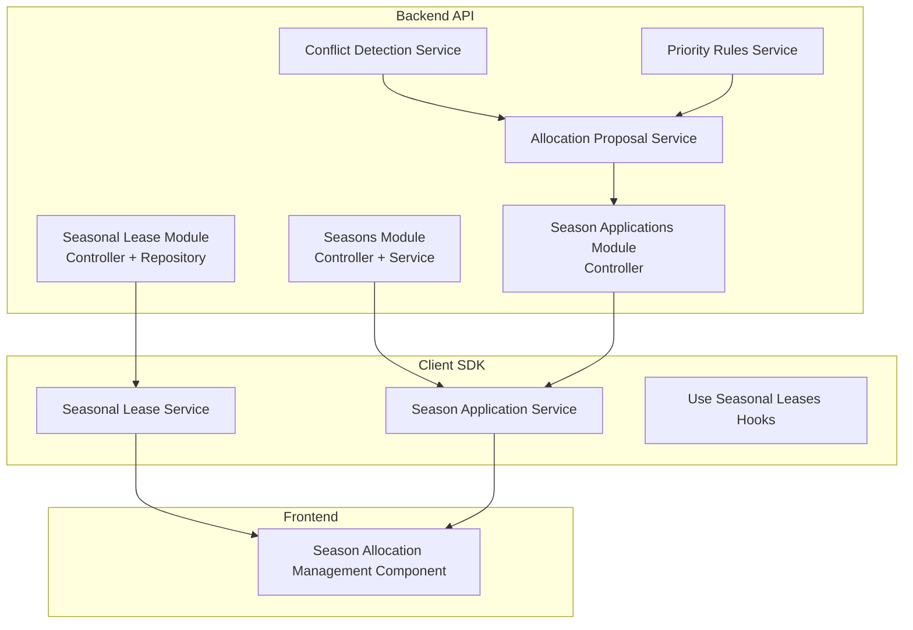
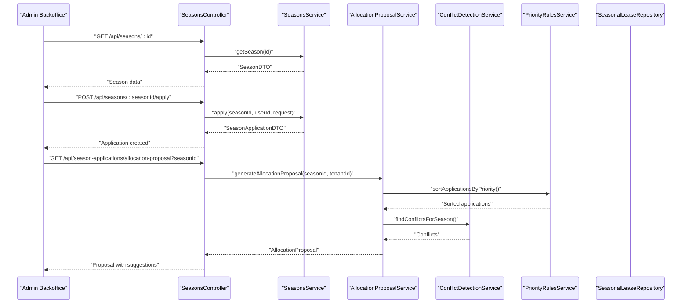
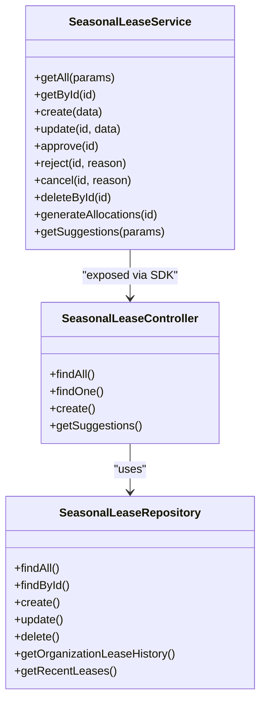
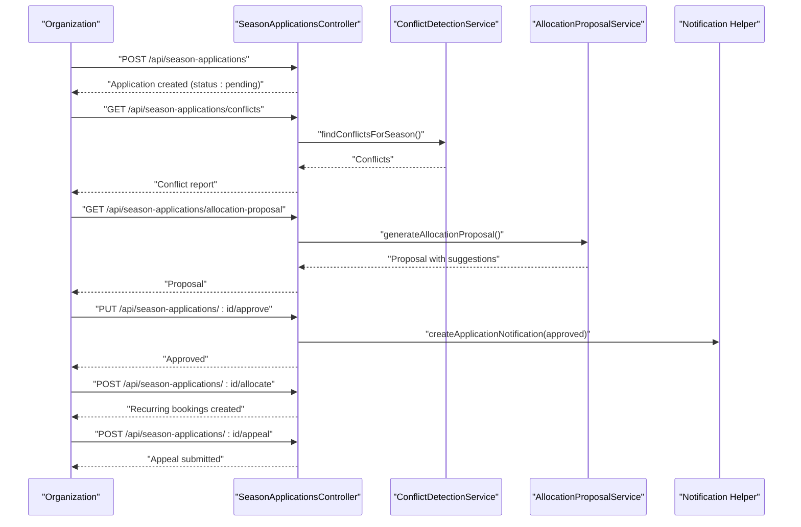
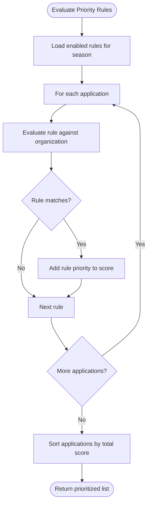
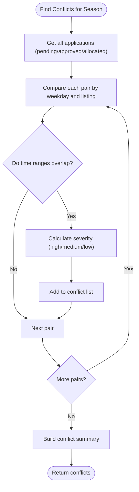
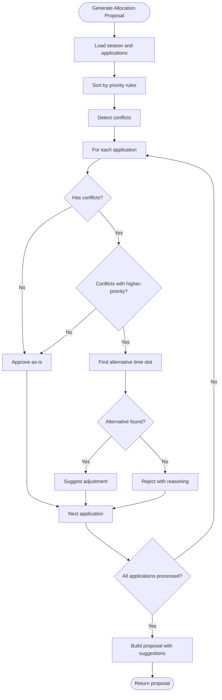
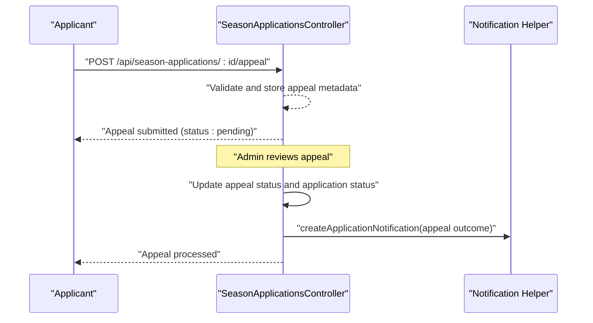
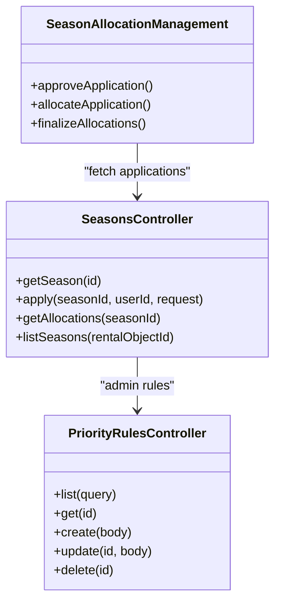
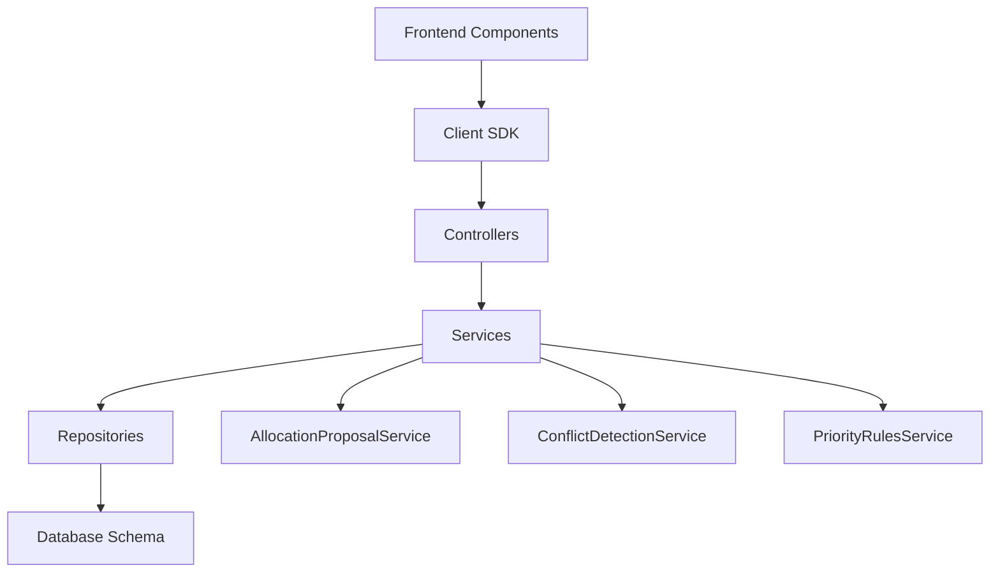

# Seasonal Lease Management

<cite>
**Referenced Files in This Document**
- [seasonal-lease.controller.ts](file://apps/api/src/modules/seasonal-lease/seasonal-lease.controller.ts)
- [seasonal-lease.repository.ts](file://apps/api/src/modules/seasonal-lease/seasonal-lease.repository.ts)
- [seasons.controller.ts](file://apps/api/src/modules/seasons/seasons.controller.ts)
- [allocation-proposal.service.ts](file://apps/api/src/modules/seasons/allocation-proposal.service.ts)
- [conflict-detection.service.ts](file://apps/api/src/modules/seasons/conflict-detection.service.ts)
- [priority-rules.service.ts](file://apps/api/src/modules/seasons/priority-rules.service.ts)
- [seasons.service.ts](file://apps/api/src/modules/seasons/seasons.service.ts)
- [season-applications.controller.ts](file://apps/api/src/modules/season-applications/season-applications.controller.ts)
- [seasonal-lease.service.ts](file://packages/client-sdk/src/services/seasonal-lease.service.ts)
- [use-seasonal-leases.ts](file://packages/client-sdk/src/hooks/use-seasonal-leases.ts)
- [season-application.service.ts](file://packages/client-sdk/src/services/season-application.service.ts)
- [SeasonAllocationManagement.tsx](file://apps/backoffice/src/components/seasons/SeasonAllocationManagement.tsx)
- [index.ts](file://apps/api/src/database/schema/index.ts)
- [seasonal-application-workflow.test.ts](file://tests/e2e/seasonal-application-workflow.test.ts)
</cite>

## Table of Contents
1. [Introduction](#introduction)
2. [Project Structure](#project-structure)
3. [Core Components](#core-components)
4. [Architecture Overview](#architecture-overview)
5. [Detailed Component Analysis](#detailed-component-analysis)
6. [Dependency Analysis](#dependency-analysis)
7. [Performance Considerations](#performance-considerations)
8. [Troubleshooting Guide](#troubleshooting-guide)
9. [Conclusion](#conclusion)

## Introduction
This document provides comprehensive documentation for the Seasonal Lease Management features within the Xala Digdir Monorepo. It covers the end-to-end lifecycle of seasonal lease creation, seasonal application processes, allocation planning workflows, priority rule configuration, conflict detection mechanisms, allocation proposal systems, appeal processes, and decision-making workflows. It also explains the integration with the seasons service, allocation proposal service, and conflict detection service, along with seasonal calendar management, capacity planning, and resource allocation features.

## Project Structure
The Seasonal Lease Management system spans three primary layers:
- Backend API modules for business logic and persistence
- Client SDK for frontend integration and automation
- Frontend components for administrative workflows

**Diagram sources**
- [seasonal-lease.controller.ts](file://apps/api/src/modules/seasonal-lease/seasonal-lease.controller.ts#L1-L130)
- [seasons.controller.ts](file://apps/api/src/modules/seasons/seasons.controller.ts#L1-L293)
- [allocation-proposal.service.ts](file://apps/api/src/modules/seasons/allocation-proposal.service.ts#L1-L517)
- [conflict-detection.service.ts](file://apps/api/src/modules/seasons/conflict-detection.service.ts#L1-L352)
- [priority-rules.service.ts](file://apps/api/src/modules/seasons/priority-rules.service.ts#L1-L333)
- [seasonal-lease.service.ts](file://packages/client-sdk/src/services/seasonal-lease.service.ts#L1-L323)
- [season-application.service.ts](file://packages/client-sdk/src/services/season-application.service.ts#L1-L61)
- [SeasonAllocationManagement.tsx](file://apps/backoffice/src/components/seasons/SeasonAllocationManagement.tsx#L1-L59)

**Section sources**
- [seasonal-lease.controller.ts](file://apps/api/src/modules/seasonal-lease/seasonal-lease.controller.ts#L1-L130)
- [seasons.controller.ts](file://apps/api/src/modules/seasons/seasons.controller.ts#L1-L293)
- [allocation-proposal.service.ts](file://apps/api/src/modules/seasons/allocation-proposal.service.ts#L1-L517)
- [conflict-detection.service.ts](file://apps/api/src/modules/seasons/conflict-detection.service.ts#L1-L352)
- [priority-rules.service.ts](file://apps/api/src/modules/seasons/priority-rules.service.ts#L1-L333)
- [seasonal-lease.service.ts](file://packages/client-sdk/src/services/seasonal-lease.service.ts#L1-L323)
- [season-application.service.ts](file://packages/client-sdk/src/services/season-application.service.ts#L1-L61)
- [SeasonAllocationManagement.tsx](file://apps/backoffice/src/components/seasons/SeasonAllocationManagement.tsx#L1-L59)

## Core Components
- Seasonal Lease Module: Provides CRUD operations for seasonal leases, status transitions, and allocation generation.
- Seasons Module: Manages season lifecycle, application windows, and allocation retrieval.
- Season Applications Module: Handles application submissions, approvals, rejections, allocations, and appeals.
- Allocation Proposal Service: Generates automated allocation suggestions based on priority rules and conflict resolution.
- Conflict Detection Service: Identifies overlapping applications and severity assessment.
- Priority Rules Service: Evaluates and applies configurable priority rules (youth, senior, local, regional).
- Client SDK Services: Exposes typed APIs for seasonal lease and application management.
- Administrative Component: Facilitates manual allocation and proposal review in the backoffice.

**Section sources**
- [seasonal-lease.controller.ts](file://apps/api/src/modules/seasonal-lease/seasonal-lease.controller.ts#L1-L130)
- [seasons.controller.ts](file://apps/api/src/modules/seasons/seasons.controller.ts#L1-L293)
- [season-applications.controller.ts](file://apps/api/src/modules/season-applications/season-applications.controller.ts#L1-L920)
- [allocation-proposal.service.ts](file://apps/api/src/modules/seasons/allocation-proposal.service.ts#L1-L517)
- [conflict-detection.service.ts](file://apps/api/src/modules/seasons/conflict-detection.service.ts#L1-L352)
- [priority-rules.service.ts](file://apps/api/src/modules/seasons/priority-rules.service.ts#L1-L333)
- [seasonal-lease.service.ts](file://packages/client-sdk/src/services/seasonal-lease.service.ts#L1-L323)
- [season-application.service.ts](file://packages/client-sdk/src/services/season-application.service.ts#L1-L61)
- [SeasonAllocationManagement.tsx](file://apps/backoffice/src/components/seasons/SeasonAllocationManagement.tsx#L1-L59)

## Architecture Overview
The system follows a layered architecture:
- Controllers orchestrate requests and delegate to services.
- Services encapsulate business logic and coordinate with repositories.
- Repositories handle data access via Drizzle ORM.
- Client SDK provides typed APIs for frontend consumption.
- E2E tests validate end-to-end workflows.

**Diagram sources**
- [seasons.controller.ts](file://apps/api/src/modules/seasons/seasons.controller.ts#L41-L88)
- [seasons.service.ts](file://apps/api/src/modules/seasons/seasons.service.ts#L19-L126)
- [allocation-proposal.service.ts](file://apps/api/src/modules/seasons/allocation-proposal.service.ts#L163-L374)
- [conflict-detection.service.ts](file://apps/api/src/modules/seasons/conflict-detection.service.ts#L220-L261)
- [priority-rules.service.ts](file://apps/api/src/modules/seasons/priority-rules.service.ts#L185-L220)
- [season-applications.controller.ts](file://apps/api/src/modules/season-applications/season-applications.controller.ts#L1-L920)

## Detailed Component Analysis

### Seasonal Lease Forms and Management
Seasonal leases support:
- Creation with weekly recurring slots (complex scheduling)
- Status transitions: draft → pending → approved → active/expired/cancelled
- Allocation generation from approved leases
- Suggestions based on historical usage and priority queues

**Diagram sources**
- [seasonal-lease.service.ts](file://packages/client-sdk/src/services/seasonal-lease.service.ts#L69-L296)
- [seasonal-lease.controller.ts](file://apps/api/src/modules/seasonal-lease/seasonal-lease.controller.ts#L17-L129)
- [seasonal-lease.repository.ts](file://apps/api/src/modules/seasonal-lease/seasonal-lease.repository.ts#L78-L334)

**Section sources**
- [seasonal-lease.service.ts](file://packages/client-sdk/src/services/seasonal-lease.service.ts#L1-L323)
- [seasonal-lease.controller.ts](file://apps/api/src/modules/seasonal-lease/seasonal-lease.controller.ts#L1-L130)
- [seasonal-lease.repository.ts](file://apps/api/src/modules/seasonal-lease/seasonal-lease.repository.ts#L1-L334)

### Seasonal Application Processes
The application lifecycle includes:
- Submission with preferred time slots
- Conflict detection across applications
- Priority-based sorting and allocation proposals
- Approval/rejection decisions
- Allocation generation (recurring bookings)
- Appeal submission and processing

**Diagram sources**
- [season-applications.controller.ts](file://apps/api/src/modules/season-applications/season-applications.controller.ts#L242-L800)
- [conflict-detection.service.ts](file://apps/api/src/modules/seasons/conflict-detection.service.ts#L220-L261)
- [allocation-proposal.service.ts](file://apps/api/src/modules/seasons/allocation-proposal.service.ts#L163-L374)

**Section sources**
- [season-applications.controller.ts](file://apps/api/src/modules/season-applications/season-applications.controller.ts#L1-L920)
- [conflict-detection.service.ts](file://apps/api/src/modules/seasons/conflict-detection.service.ts#L1-L352)
- [allocation-proposal.service.ts](file://apps/api/src/modules/seasons/allocation-proposal.service.ts#L1-L517)

### Priority Rule Configuration
Priority rules enable configurable weighting for applications:
- Rule types: youth_priority, senior_priority, local_priority, regional_priority, custom
- Evaluation considers organization settings and metadata
- Sorting produces calculated priorities for proposal generation

**Diagram sources**
- [priority-rules.service.ts](file://apps/api/src/modules/seasons/priority-rules.service.ts#L39-L220)

**Section sources**
- [priority-rules.service.ts](file://apps/api/src/modules/seasons/priority-rules.service.ts#L1-L333)

### Conflict Detection Mechanisms
Conflicts are detected by comparing time ranges across applications:
- Overlap detection supports full and partial overlaps
- Severity classification based on overlap type and application statuses
- Conflict summaries by listing and weekday

**Diagram sources**
- [conflict-detection.service.ts](file://apps/api/src/modules/seasons/conflict-detection.service.ts#L220-L300)

**Section sources**
- [conflict-detection.service.ts](file://apps/api/src/modules/seasons/conflict-detection.service.ts#L1-L352)

### Allocation Proposal System
The proposal engine:
- Sorts applications by priority
- Detects conflicts and determines impact
- Suggests actions: approve, reject, adjust
- Generates alternative time slots when conflicts involve higher-priority applications

**Diagram sources**
- [allocation-proposal.service.ts](file://apps/api/src/modules/seasons/allocation-proposal.service.ts#L163-L374)

**Section sources**
- [allocation-proposal.service.ts](file://apps/api/src/modules/seasons/allocation-proposal.service.ts#L1-L517)

### Appeal Processes and Decision-Making Workflows
Rejected applications can be appealed:
- Appeal submission stores metadata and status
- Appeals can be reviewed and approved, potentially changing application status
- Notifications are triggered for approval/rejection outcomes

**Diagram sources**
- [season-applications.controller.ts](file://apps/api/src/modules/season-applications/season-applications.controller.ts#L734-L799)

**Section sources**
- [season-applications.controller.ts](file://apps/api/src/modules/season-applications/season-applications.controller.ts#L730-L800)

### Season Application Management and Administration
Administrative capabilities include:
- Listing and filtering applications
- Approving/rejecting applications
- Allocating approved applications (generating recurring bookings)
- Managing priority rules
- Generating allocation proposals and summaries

**Diagram sources**
- [seasons.controller.ts](file://apps/api/src/modules/seasons/seasons.controller.ts#L41-L293)
- [SeasonAllocationManagement.tsx](file://apps/backoffice/src/components/seasons/SeasonAllocationManagement.tsx#L39-L59)

**Section sources**
- [seasons.controller.ts](file://apps/api/src/modules/seasons/seasons.controller.ts#L1-L293)
- [SeasonAllocationManagement.tsx](file://apps/backoffice/src/components/seasons/SeasonAllocationManagement.tsx#L1-L59)

### Seasonal Reporting Features
Reporting capabilities include:
- Application statistics by status
- Conflict summaries by listing and weekday
- Proposal summaries with estimated outcomes

**Section sources**
- [season-applications.controller.ts](file://apps/api/src/modules/season-applications/season-applications.controller.ts#L694-L728)
- [conflict-detection.service.ts](file://apps/api/src/modules/seasons/conflict-detection.service.ts#L266-L300)
- [allocation-proposal.service.ts](file://apps/api/src/modules/seasons/allocation-proposal.service.ts#L379-L427)

### Integration with Services
- Seasons Service: Contract-first DTOs for season and application data.
- Allocation Proposal Service: Central logic for proposal generation and application.
- Conflict Detection Service: Shared conflict detection and severity calculation.
- Priority Rules Service: Centralized rule evaluation and scoring.

**Section sources**
- [seasons.service.ts](file://apps/api/src/modules/seasons/seasons.service.ts#L1-L126)
- [allocation-proposal.service.ts](file://apps/api/src/modules/seasons/allocation-proposal.service.ts#L1-L517)
- [conflict-detection.service.ts](file://apps/api/src/modules/seasons/conflict-detection.service.ts#L1-L352)
- [priority-rules.service.ts](file://apps/api/src/modules/seasons/priority-rules.service.ts#L1-L333)

### Seasonal Calendar Management, Capacity Planning, and Resource Allocation
- Calendar allocations are generated from approved seasonal leases and applications.
- Recurring bookings are created for each occurrence within the season date range.
- Capacity planning integrates with conflict detection to prevent double-booking.
- Resource allocation aligns with priority rules and conflict resolution.

**Section sources**
- [seasonal-lease.controller.ts](file://apps/api/src/modules/seasonal-lease/seasonal-lease.controller.ts#L78-L128)
- [season-applications.controller.ts](file://apps/api/src/modules/season-applications/season-applications.controller.ts#L463-L585)
- [allocation-proposal.service.ts](file://apps/api/src/modules/seasons/allocation-proposal.service.ts#L299-L358)

## Dependency Analysis
The system exhibits clear separation of concerns:
- Controllers depend on services for business logic.
- Services depend on repositories and shared services.
- Repositories depend on the database schema.
- Client SDK depends on backend endpoints.
- Frontend components depend on SDK services.

**Diagram sources**
- [seasons.controller.ts](file://apps/api/src/modules/seasons/seasons.controller.ts#L41-L88)
- [allocation-proposal.service.ts](file://apps/api/src/modules/seasons/allocation-proposal.service.ts#L163-L374)
- [conflict-detection.service.ts](file://apps/api/src/modules/seasons/conflict-detection.service.ts#L220-L261)
- [priority-rules.service.ts](file://apps/api/src/modules/seasons/priority-rules.service.ts#L185-L220)
- [index.ts](file://apps/api/src/database/schema/index.ts#L114-L121)

**Section sources**
- [index.ts](file://apps/api/src/database/schema/index.ts#L1-L170)

## Performance Considerations
- Conflict detection compares application pairs; complexity grows quadratically with application count. Consider indexing and limiting concurrent operations.
- Proposal generation sorts applications and checks conflicts; batching and caching can improve throughput.
- Allocation generation creates recurring bookings; batch processing and transaction boundaries are essential.
- Use pagination and filtering to reduce payload sizes for listing endpoints.

## Troubleshooting Guide
Common issues and resolutions:
- Applications cannot be allocated if not approved; ensure approval before allocation.
- Allocation failures often stem from time slot conflicts; use conflict detection and proposal summaries to resolve.
- Appeals require rejected applications; verify application status before submitting appeals.
- Priority rules must be enabled and correctly configured; validate rule conditions and priorities.

**Section sources**
- [season-applications.controller.ts](file://apps/api/src/modules/season-applications/season-applications.controller.ts#L463-L585)
- [allocation-proposal.service.ts](file://apps/api/src/modules/seasons/allocation-proposal.service.ts#L432-L516)
- [season-applications.controller.ts](file://apps/api/src/modules/season-applications/season-applications.controller.ts#L734-L799)

## Conclusion
The Seasonal Lease Management system provides a robust framework for managing seasonal facilities, integrating priority rules, conflict detection, and proposal-driven allocation. The modular architecture ensures maintainability and extensibility, while the client SDK and administrative components streamline operational workflows. The included E2E tests demonstrate end-to-end functionality across the entire lifecycle, from season creation to finalization and appeal processing.