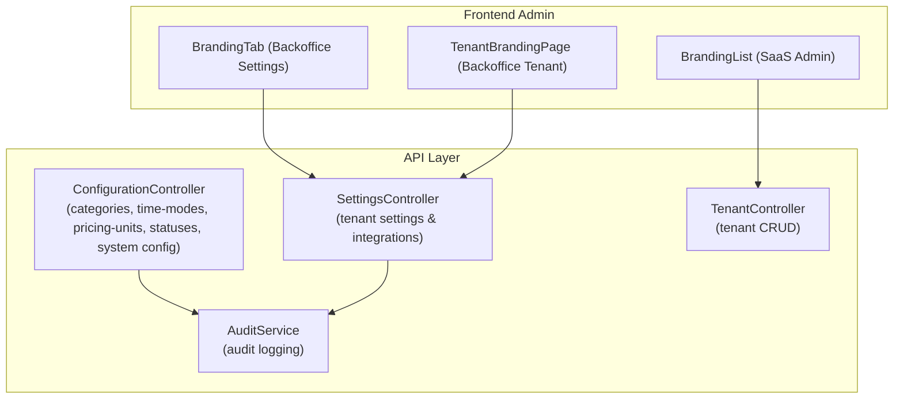
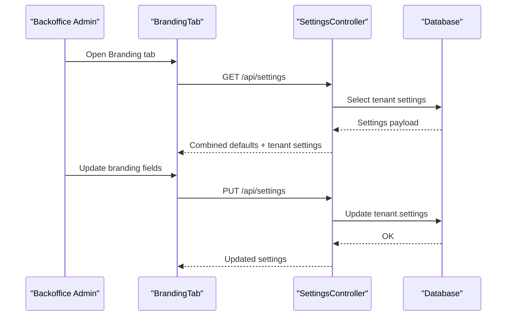
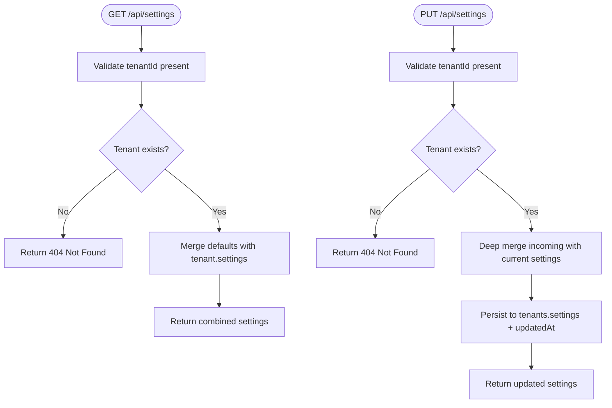
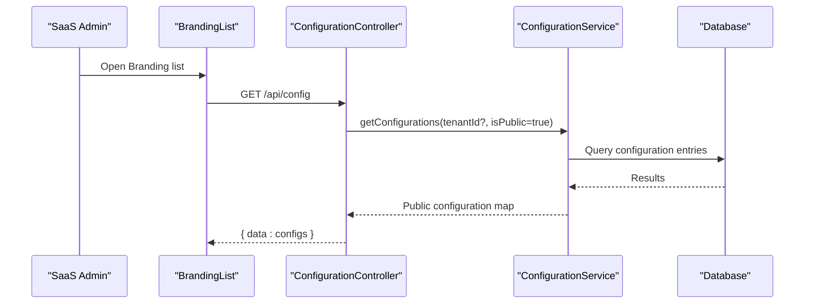
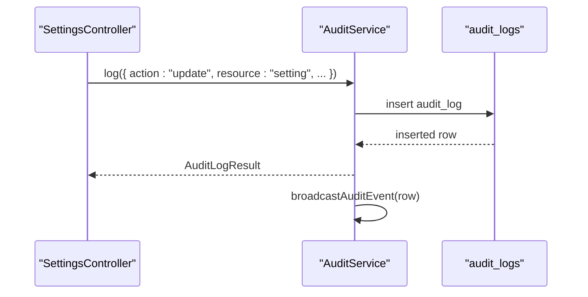
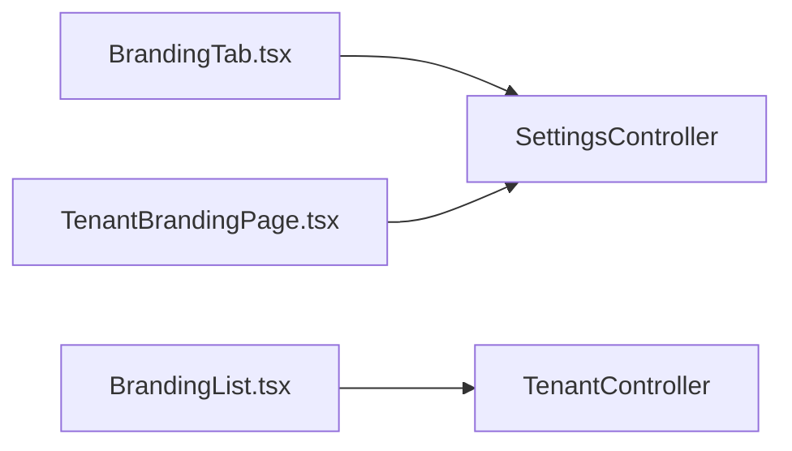
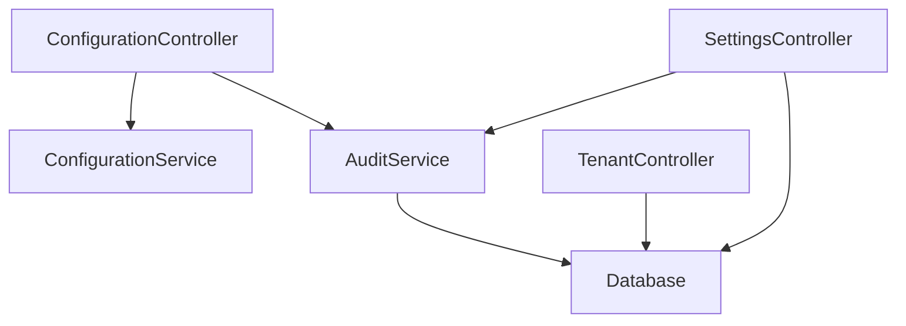

# Settings & Configuration

<cite>
**Referenced Files in This Document**
- [apps/api/src/modules/settings/settings.controller.ts](file://apps/api/src/modules/settings/settings.controller.ts)
- [apps/api/src/modules/configuration/configuration.controller.ts](file://apps/api/src/modules/configuration/configuration.controller.ts)
- [apps/api/src/modules/configuration/configuration.service.ts](file://apps/api/src/modules/configuration/configuration.service.ts)
- [apps/api/src/modules/tenant/tenant.controller.ts](file://apps/api/src/modules/tenant/tenant.controller.ts)
- [apps/api/src/core/audit/audit.service.ts](file://apps/api/src/core/audit/audit.service.ts)
- [apps/backoffice/src/features/settings/components/BrandingTab.tsx](file://apps/backoffice/src/features/settings/components/BrandingTab.tsx)
- [apps/backoffice/src/routes/tenant/branding.tsx](file://apps/backoffice/src/routes/tenant/branding.tsx)
- [apps/saas-admin/src/routes/branding/index.tsx](file://apps/saas-admin/src/routes/branding/index.tsx)
- [apps/api/src/config/index.ts](file://apps/api/src/config/index.ts)
</cite>

## Table of Contents
1. [Introduction](#introduction)
2. [Project Structure](#project-structure)
3. [Core Components](#core-components)
4. [Architecture Overview](#architecture-overview)
5. [Detailed Component Analysis](#detailed-component-analysis)
6. [Dependency Analysis](#dependency-analysis)
7. [Performance Considerations](#performance-considerations)
8. [Troubleshooting Guide](#troubleshooting-guide)
9. [Conclusion](#conclusion)
10. [Appendices](#appendices)

## Introduction
This document explains the Settings and Configuration management system across the platform. It covers:
- Tenant-level settings and integrations
- Centralized configuration for categories, time modes, pricing units, statuses, and system-wide configuration keys
- Branding customization for tenants and SaaS-level branding overview
- Audit logging for administrative actions
- Configuration validation and schema-driven endpoints
- Multi-tenant configuration, centralized settings management, and system-wide customization options

The goal is to provide a practical guide for administrators, developers, and operators to manage settings, validate configuration, and maintain branding across tenants.

## Project Structure
The Settings and Configuration features span backend API controllers and services, and frontend admin pages:
- Backend API exposes REST endpoints for tenant settings, integrations, system configuration, and schema validation
- Frontend admin applications provide UI for branding customization and tenant configuration views

**Diagram sources**
- [apps/api/src/modules/settings/settings.controller.ts](file://apps/api/src/modules/settings/settings.controller.ts#L52-L194)
- [apps/api/src/modules/configuration/configuration.controller.ts](file://apps/api/src/modules/configuration/configuration.controller.ts#L18-L588)
- [apps/api/src/modules/tenant/tenant.controller.ts](file://apps/api/src/modules/tenant/tenant.controller.ts#L16-L82)
- [apps/api/src/core/audit/audit.service.ts](file://apps/api/src/core/audit/audit.service.ts#L74-L210)
- [apps/backoffice/src/features/settings/components/BrandingTab.tsx](file://apps/backoffice/src/features/settings/components/BrandingTab.tsx#L19-L100)
- [apps/backoffice/src/routes/tenant/branding.tsx](file://apps/backoffice/src/routes/tenant/branding.tsx#L33-L323)
- [apps/saas-admin/src/routes/branding/index.tsx](file://apps/saas-admin/src/routes/branding/index.tsx#L27-L190)

**Section sources**
- [apps/api/src/modules/settings/settings.controller.ts](file://apps/api/src/modules/settings/settings.controller.ts#L1-L194)
- [apps/api/src/modules/configuration/configuration.controller.ts](file://apps/api/src/modules/configuration/configuration.controller.ts#L1-L588)
- [apps/api/src/modules/tenant/tenant.controller.ts](file://apps/api/src/modules/tenant/tenant.controller.ts#L1-L82)
- [apps/api/src/core/audit/audit.service.ts](file://apps/api/src/core/audit/audit.service.ts#L1-L278)
- [apps/backoffice/src/features/settings/components/BrandingTab.tsx](file://apps/backoffice/src/features/settings/components/BrandingTab.tsx#L1-L100)
- [apps/backoffice/src/routes/tenant/branding.tsx](file://apps/backoffice/src/routes/tenant/branding.tsx#L1-L323)
- [apps/saas-admin/src/routes/branding/index.tsx](file://apps/saas-admin/src/routes/branding/index.tsx#L1-L190)

## Core Components
- SettingsController: Provides tenant-level settings retrieval and updates, plus per-integration toggles and credentials
- ConfigurationController: Exposes schema-driven configuration for categories, time modes, pricing units, statuses, and system configuration keys
- TenantController: Manages tenant lifecycle and metadata used by branding and settings
- AuditService: Logs administrative actions and broadcasts audit events for real-time visibility
- Frontend Branding components: Allow customization of branding visuals and preview updates

Key responsibilities:
- Tenant settings: booking, notifications, payments, and integrations
- System configuration: public keys, enums, and validation endpoints
- Branding: color schemes, logos, and preview rendering
- Audit: persistent logs and WebSocket broadcast

**Section sources**
- [apps/api/src/modules/settings/settings.controller.ts](file://apps/api/src/modules/settings/settings.controller.ts#L52-L194)
- [apps/api/src/modules/configuration/configuration.controller.ts](file://apps/api/src/modules/configuration/configuration.controller.ts#L18-L588)
- [apps/api/src/modules/tenant/tenant.controller.ts](file://apps/api/src/modules/tenant/tenant.controller.ts#L16-L82)
- [apps/api/src/core/audit/audit.service.ts](file://apps/api/src/core/audit/audit.service.ts#L74-L210)
- [apps/backoffice/src/features/settings/components/BrandingTab.tsx](file://apps/backoffice/src/features/settings/components/BrandingTab.tsx#L19-L100)
- [apps/backoffice/src/routes/tenant/branding.tsx](file://apps/backoffice/src/routes/tenant/branding.tsx#L33-L323)
- [apps/saas-admin/src/routes/branding/index.tsx](file://apps/saas-admin/src/routes/branding/index.tsx#L27-L190)

## Architecture Overview
The system separates concerns across controllers, services, and UI:
- Controllers validate requests and delegate to services
- Services encapsulate business logic and data access
- AuditService persists and streams audit events
- Frontend components call API endpoints and render branding previews

**Diagram sources**
- [apps/api/src/modules/settings/settings.controller.ts](file://apps/api/src/modules/settings/settings.controller.ts#L56-L131)
- [apps/backoffice/src/features/settings/components/BrandingTab.tsx](file://apps/backoffice/src/features/settings/components/BrandingTab.tsx#L19-L100)

**Section sources**
- [apps/api/src/modules/settings/settings.controller.ts](file://apps/api/src/modules/settings/settings.controller.ts#L52-L194)
- [apps/api/src/core/audit/audit.service.ts](file://apps/api/src/core/audit/audit.service.ts#L74-L210)
- [apps/backoffice/src/features/settings/components/BrandingTab.tsx](file://apps/backoffice/src/features/settings/components/BrandingTab.tsx#L19-L100)

## Detailed Component Analysis

### SettingsController: Tenant Settings and Integrations
- Retrieves and merges default settings with tenant overrides
- Updates tenant settings atomically and timestamps changes
- Supports per-integration toggles and partial updates
- Validates presence of tenantId and tenant existence

**Diagram sources**
- [apps/api/src/modules/settings/settings.controller.ts](file://apps/api/src/modules/settings/settings.controller.ts#L56-L131)

**Section sources**
- [apps/api/src/modules/settings/settings.controller.ts](file://apps/api/src/modules/settings/settings.controller.ts#L52-L194)

### ConfigurationController: Schema-Driven Configuration
- Categories: list, get by code, subcategories, create/update/delete
- Time modes: list, get by code, create/update
- Pricing units: list, get by code, create
- Statuses: rental object and booking statuses
- System config: get all public configs, get/set/delete specific keys
- Schema validation: enums and code validation endpoints
- Integrations config: list, get, update (RBAC enforced), test connection

**Diagram sources**
- [apps/api/src/modules/configuration/configuration.controller.ts](file://apps/api/src/modules/configuration/configuration.controller.ts#L352-L415)
- [apps/api/src/modules/configuration/configuration.service.ts](file://apps/api/src/modules/configuration/configuration.service.ts)

**Section sources**
- [apps/api/src/modules/configuration/configuration.controller.ts](file://apps/api/src/modules/configuration/configuration.controller.ts#L18-L588)

### TenantController: Tenant Management
- Lists, retrieves, creates, updates, and deletes tenants
- Enforces validation via Zod schemas
- Used by branding and settings flows to resolve tenant metadata

**Section sources**
- [apps/api/src/modules/tenant/tenant.controller.ts](file://apps/api/src/modules/tenant/tenant.controller.ts#L16-L82)

### AuditService: Audit Logging and Real-Time Events
- Logs actions with resource, severity, metadata, IP, and UA
- Persists to audit logs table and broadcasts via WebSocket
- Provides query, find-by-id, and convenience methods for common actions
- Used across configuration and settings operations to track administrative changes

**Diagram sources**
- [apps/api/src/core/audit/audit.service.ts](file://apps/api/src/core/audit/audit.service.ts#L84-L120)

**Section sources**
- [apps/api/src/core/audit/audit.service.ts](file://apps/api/src/core/audit/audit.service.ts#L74-L210)

### Frontend Branding Components
- BrandingTab (Backoffice Settings): Edits branding fields (logo, colors, favicon) and saves via SettingsController
- TenantBrandingPage (Backoffice Tenant): Full branding customization UI with presets, uploads, and live preview
- BrandingList (SaaS Admin): Lists tenants, branding status, and links to edit per tenant

**Diagram sources**
- [apps/backoffice/src/features/settings/components/BrandingTab.tsx](file://apps/backoffice/src/features/settings/components/BrandingTab.tsx#L19-L100)
- [apps/backoffice/src/routes/tenant/branding.tsx](file://apps/backoffice/src/routes/tenant/branding.tsx#L33-L323)
- [apps/saas-admin/src/routes/branding/index.tsx](file://apps/saas-admin/src/routes/branding/index.tsx#L27-L190)
- [apps/api/src/modules/settings/settings.controller.ts](file://apps/api/src/modules/settings/settings.controller.ts#L52-L194)
- [apps/api/src/modules/tenant/tenant.controller.ts](file://apps/api/src/modules/tenant/tenant.controller.ts#L16-L82)

**Section sources**
- [apps/backoffice/src/features/settings/components/BrandingTab.tsx](file://apps/backoffice/src/features/settings/components/BrandingTab.tsx#L1-L100)
- [apps/backoffice/src/routes/tenant/branding.tsx](file://apps/backoffice/src/routes/tenant/branding.tsx#L1-L323)
- [apps/saas-admin/src/routes/branding/index.tsx](file://apps/saas-admin/src/routes/branding/index.tsx#L1-L190)

## Dependency Analysis
- Controllers depend on services for business logic and on the container for database access
- AuditService is injected into controllers/services to record administrative actions
- Frontend components depend on API endpoints for data and mutation
- ConfigurationController coordinates with ConfigurationService for schema-driven operations

**Diagram sources**
- [apps/api/src/modules/settings/settings.controller.ts](file://apps/api/src/modules/settings/settings.controller.ts#L52-L194)
- [apps/api/src/modules/configuration/configuration.controller.ts](file://apps/api/src/modules/configuration/configuration.controller.ts#L18-L588)
- [apps/api/src/modules/tenant/tenant.controller.ts](file://apps/api/src/modules/tenant/tenant.controller.ts#L16-L82)
- [apps/api/src/core/audit/audit.service.ts](file://apps/api/src/core/audit/audit.service.ts#L74-L210)

**Section sources**
- [apps/api/src/modules/settings/settings.controller.ts](file://apps/api/src/modules/settings/settings.controller.ts#L52-L194)
- [apps/api/src/modules/configuration/configuration.controller.ts](file://apps/api/src/modules/configuration/configuration.controller.ts#L18-L588)
- [apps/api/src/modules/tenant/tenant.controller.ts](file://apps/api/src/modules/tenant/tenant.controller.ts#L16-L82)
- [apps/api/src/core/audit/audit.service.ts](file://apps/api/src/core/audit/audit.service.ts#L74-L210)

## Performance Considerations
- Settings retrieval merges defaults with tenant overrides; keep overrides minimal to reduce payload sizes
- Configuration endpoints support pagination and filtering; use query parameters to limit response sizes
- Audit logging writes to database and broadcasts via WebSocket; ensure appropriate batching and rate limiting in high-volume environments
- Branding preview rendering is client-side; avoid excessive re-renders by debouncing input handlers

## Troubleshooting Guide
Common issues and resolutions:
- Validation errors on settings updates
  - Ensure tenantId is present and valid
  - Verify request body conforms to expected shape
- Not found errors
  - Confirm tenant exists before updating settings
  - Check configuration keys and category codes against schema validation endpoints
- Access control
  - Integration updates require admin or super_admin role
- Audit visibility
  - Use query endpoints to filter by tenantId, action, resource, and date range

**Section sources**
- [apps/api/src/modules/settings/settings.controller.ts](file://apps/api/src/modules/settings/settings.controller.ts#L99-L131)
- [apps/api/src/modules/configuration/configuration.controller.ts](file://apps/api/src/modules/configuration/configuration.controller.ts#L546-L564)
- [apps/api/src/core/audit/audit.service.ts](file://apps/api/src/core/audit/audit.service.ts#L124-L177)

## Conclusion
The Settings and Configuration subsystem provides a robust, schema-driven foundation for multi-tenant customization and system-wide configuration. It balances flexibility with safety through validation, RBAC, and audit logging. Administrators can manage tenant settings, branding, and integrations confidently, while developers can rely on consistent APIs and typed configuration endpoints.

## Appendices

### Settings Interface and Defaults
- Default settings include booking, notification, and payment options
- Integrations include toggles for BankID, Vipps, ID-porten, Visma, Brønnøysundregistrene, RC Online, Outlook, and Google Calendar

**Section sources**
- [apps/api/src/modules/settings/settings.controller.ts](file://apps/api/src/modules/settings/settings.controller.ts#L17-L49)

### Configuration Validation and Schema Endpoints
- Enum lists and code validators ensure data integrity
- Use validation endpoints to confirm category, subcategory, and time-mode codes before persisting

**Section sources**
- [apps/api/src/modules/configuration/configuration.controller.ts](file://apps/api/src/modules/configuration/configuration.controller.ts#L433-L483)

### Audit Log Configuration
- AuditService supports filtering, pagination, and real-time broadcasting
- Administrative actions are logged with metadata for traceability

**Section sources**
- [apps/api/src/core/audit/audit.service.ts](file://apps/api/src/core/audit/audit.service.ts#L124-L177)

### Integration Credentials Management
- Integrations configuration endpoints allow listing, retrieving, updating, and testing provider connections
- RBAC ensures only administrators can modify integration credentials

**Section sources**
- [apps/api/src/modules/configuration/configuration.controller.ts](file://apps/api/src/modules/configuration/configuration.controller.ts#L490-L587)

### Branding Customization
- Backoffice BrandingTab and TenantBrandingPage enable color schemes, logos, favicons, and header/footer text
- SaaS BrandingList provides an overview of branding status across tenants

**Section sources**
- [apps/backoffice/src/features/settings/components/BrandingTab.tsx](file://apps/backoffice/src/features/settings/components/BrandingTab.tsx#L19-L100)
- [apps/backoffice/src/routes/tenant/branding.tsx](file://apps/backoffice/src/routes/tenant/branding.tsx#L33-L323)
- [apps/saas-admin/src/routes/branding/index.tsx](file://apps/saas-admin/src/routes/branding/index.tsx#L27-L190)

### Configuration Service Export
- Configuration module exports are centralized for easy consumption

**Section sources**
- [apps/api/src/config/index.ts](file://apps/api/src/config/index.ts#L1-L5)