# User Management

<cite>
**Referenced Files in This Document**
- [apps/backoffice/src/routes/users.tsx](file://apps/backoffice/src/routes/users.tsx)
- [apps/backoffice/src/routes/users-management.tsx](file://apps/backoffice/src/routes/users-management.tsx)
- [apps/backoffice/src/components/users/UserForm.tsx](file://apps/backoffice/src/components/users/UserForm.tsx)
- [apps/backoffice/src/components/organizations/MemberManagement.tsx](file://apps/backoffice/src/components/organizations/MemberManagement.tsx)
- [apps/backoffice/src/routes/tenant/users/index.tsx](file://apps/backoffice/src/routes/tenant/users/index.tsx)
- [apps/backoffice/src/routes/tenant/users/invite.tsx](file://apps/backoffice/src/routes/tenant/users/invite.tsx)
- [packages/client-sdk/src/services/tenant-admin-user.service.ts](file://packages/client-sdk/src/services/tenant-admin-user.service.ts)
- [packages/client-sdk/src/hooks/use-rbac.ts](file://packages/client-sdk/src/hooks/use-rbac.ts)
- [apps/backoffice/src/hooks/useRBAC.ts](file://apps/backoffice/src/hooks/useRBAC.ts)
- [tests/unit/capabilities.test.ts](file://tests/unit/capabilities.test.ts)
</cite>

## Table of Contents
1. [Introduction](#introduction)
2. [Project Structure](#project-structure)
3. [Core Components](#core-components)
4. [Architecture Overview](#architecture-overview)
5. [Detailed Component Analysis](#detailed-component-analysis)
6. [Dependency Analysis](#dependency-analysis)
7. [Performance Considerations](#performance-considerations)
8. [Troubleshooting Guide](#troubleshooting-guide)
9. [Conclusion](#conclusion)

## Introduction
This document describes the User Management functionality within the Backoffice Application. It covers user CRUD operations, role assignment workflows, and user invitation processes. It also explains the distinction between organization-level user management and tenant-level user administration, documents the user interface components (UserForm, member management screens, and user search/filter capabilities), and details the integration with the RBAC system, capability assignments, and permission management. Finally, it outlines user onboarding workflows, bulk operations, and user status management features.

## Project Structure
The Backoffice Application organizes user management across several pages and components:
- Global users management page for administrative users
- Organization-level member management
- Tenant-level user administration for tenant admins
- Shared form component for creating/editing users
- RBAC integration via SDK hooks and local RBAC helper

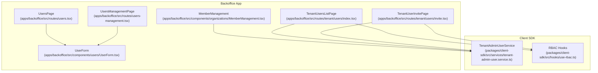

**Diagram sources**
- [apps/backoffice/src/routes/users.tsx](file://apps/backoffice/src/routes/users.tsx#L57-L292)
- [apps/backoffice/src/routes/users-management.tsx](file://apps/backoffice/src/routes/users-management.tsx#L64-L288)
- [apps/backoffice/src/components/organizations/MemberManagement.tsx](file://apps/backoffice/src/components/organizations/MemberManagement.tsx#L31-L257)
- [apps/backoffice/src/components/users/UserForm.tsx](file://apps/backoffice/src/components/users/UserForm.tsx#L29-L238)
- [apps/backoffice/src/routes/tenant/users/index.tsx](file://apps/backoffice/src/routes/tenant/users/index.tsx#L75-L364)
- [apps/backoffice/src/routes/tenant/users/invite.tsx](file://apps/backoffice/src/routes/tenant/users/invite.tsx#L48-L309)
- [packages/client-sdk/src/services/tenant-admin-user.service.ts](file://packages/client-sdk/src/services/tenant-admin-user.service.ts#L126-L320)
- [packages/client-sdk/src/hooks/use-rbac.ts](file://packages/client-sdk/src/hooks/use-rbac.ts#L1-L656)

**Section sources**
- [apps/backoffice/src/routes/users.tsx](file://apps/backoffice/src/routes/users.tsx#L57-L292)
- [apps/backoffice/src/routes/users-management.tsx](file://apps/backoffice/src/routes/users-management.tsx#L64-L288)
- [apps/backoffice/src/components/organizations/MemberManagement.tsx](file://apps/backoffice/src/components/organizations/MemberManagement.tsx#L31-L257)
- [apps/backoffice/src/components/users/UserForm.tsx](file://apps/backoffice/src/components/users/UserForm.tsx#L29-L238)
- [apps/backoffice/src/routes/tenant/users/index.tsx](file://apps/backoffice/src/routes/tenant/users/index.tsx#L75-L364)
- [apps/backoffice/src/routes/tenant/users/invite.tsx](file://apps/backoffice/src/routes/tenant/users/invite.tsx#L48-L309)
- [packages/client-sdk/src/services/tenant-admin-user.service.ts](file://packages/client-sdk/src/services/tenant-admin-user.service.ts#L126-L320)
- [packages/client-sdk/src/hooks/use-rbac.ts](file://packages/client-sdk/src/hooks/use-rbac.ts#L1-L656)

## Core Components
- UsersPage: Lists administrative backoffice users with search, role/status filters, and actions (view, edit, deactivate/reactivate).
- UsersManagementPage: Administrative user management UI with invite form, stats cards, and user table.
- UserForm: Shared form for creating and editing users, including role selection and permission descriptions.
- MemberManagement: Organization-level member management with add/remove/update role actions.
- TenantUsersListPage: Tenant admin view of all users within a tenant, with search, filters, pagination, and actions.
- TenantUserInvitePage: Tenant admin user invitation form with validation and submission.
- TenantAdminUserService: Backend service for tenant-level user operations (invite, role assignment, organization assignment, scopes, status management, bulk operations).
- RBAC integration: SDK hooks for capabilities, permissions, and access grants; local RBAC helper for UI checks.

**Section sources**
- [apps/backoffice/src/routes/users.tsx](file://apps/backoffice/src/routes/users.tsx#L57-L292)
- [apps/backoffice/src/routes/users-management.tsx](file://apps/backoffice/src/routes/users-management.tsx#L64-L288)
- [apps/backoffice/src/components/users/UserForm.tsx](file://apps/backoffice/src/components/users/UserForm.tsx#L29-L238)
- [apps/backoffice/src/components/organizations/MemberManagement.tsx](file://apps/backoffice/src/components/organizations/MemberManagement.tsx#L31-L257)
- [apps/backoffice/src/routes/tenant/users/index.tsx](file://apps/backoffice/src/routes/tenant/users/index.tsx#L75-L364)
- [apps/backoffice/src/routes/tenant/users/invite.tsx](file://apps/backoffice/src/routes/tenant/users/invite.tsx#L48-L309)
- [packages/client-sdk/src/services/tenant-admin-user.service.ts](file://packages/client-sdk/src/services/tenant-admin-user.service.ts#L126-L320)
- [packages/client-sdk/src/hooks/use-rbac.ts](file://packages/client-sdk/src/hooks/use-rbac.ts#L1-L656)

## Architecture Overview
The user management architecture separates concerns across UI pages, shared components, and SDK services:
- UI pages orchestrate state, filters, and navigation.
- Shared components encapsulate forms and reusable UI patterns.
- SDK services abstract backend APIs for user operations.
- RBAC hooks provide capability-driven UI rendering and permission checks.

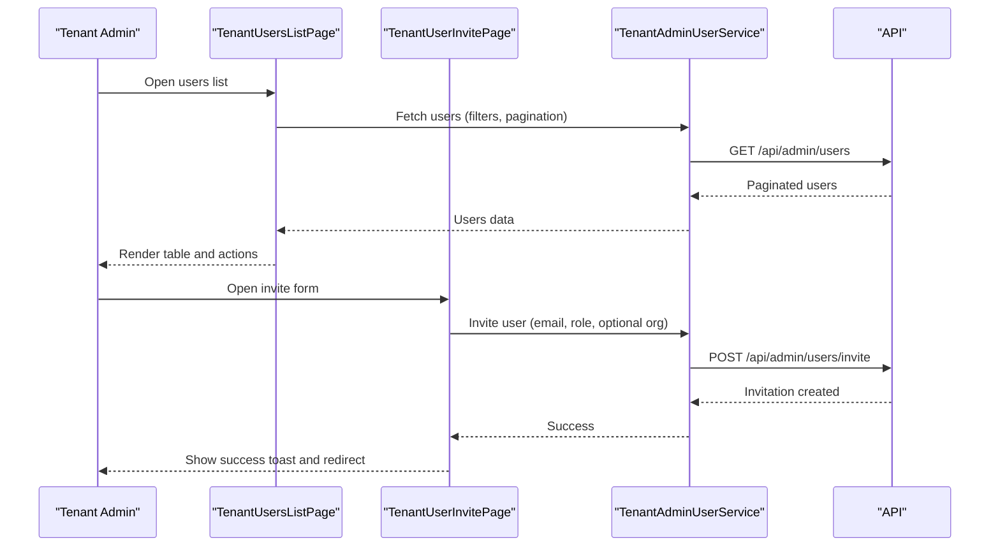

**Diagram sources**
- [apps/backoffice/src/routes/tenant/users/index.tsx](file://apps/backoffice/src/routes/tenant/users/index.tsx#L86-L124)
- [apps/backoffice/src/routes/tenant/users/invite.tsx](file://apps/backoffice/src/routes/tenant/users/invite.tsx#L113-L142)
- [packages/client-sdk/src/services/tenant-admin-user.service.ts](file://packages/client-sdk/src/services/tenant-admin-user.service.ts#L149-L154)

## Detailed Component Analysis

### UsersPage (Administrative Users)
- Purpose: Centralized list of administrative backoffice users with search and filters.
- Features:
  - Search by user name/email.
  - Filter by role and status.
  - Actions: view details, edit, deactivate/activate.
- Data flow:
  - Uses SDK query hook to fetch users with applied filters.
  - Uses mutations to deactivate/reactivate users.

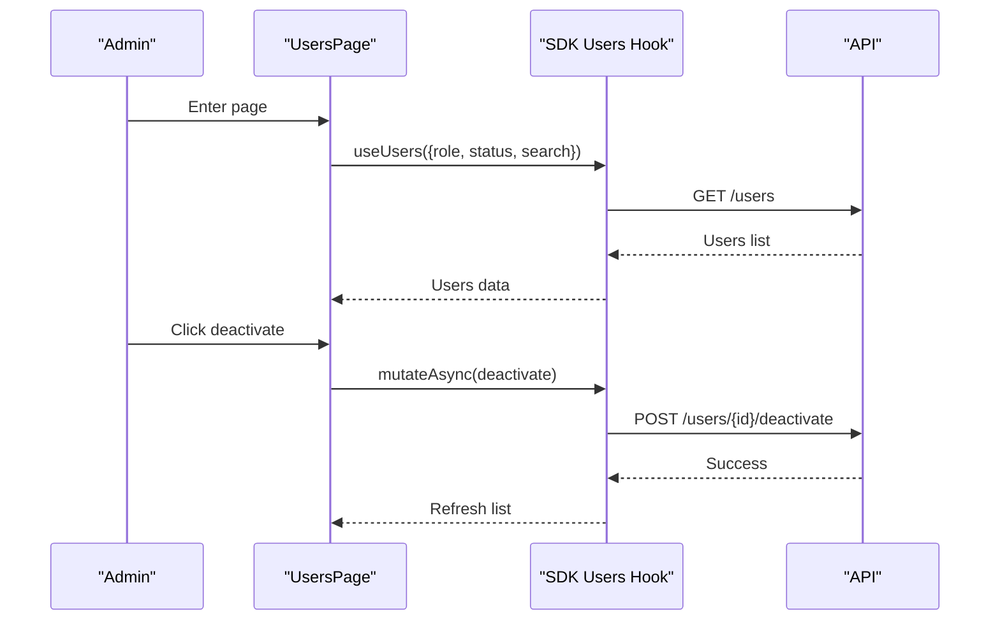

**Diagram sources**
- [apps/backoffice/src/routes/users.tsx](file://apps/backoffice/src/routes/users.tsx#L67-L95)
- [packages/client-sdk/src/hooks/use-rbac.ts](file://packages/client-sdk/src/hooks/use-rbac.ts#L287-L391)

**Section sources**
- [apps/backoffice/src/routes/users.tsx](file://apps/backoffice/src/routes/users.tsx#L57-L292)

### UsersManagementPage (Administrative Management UI)
- Purpose: Administrative UI for inviting users, viewing stats, and managing roles/status.
- Features:
  - Invite user form with email and role selection.
  - Stats cards for totals and counts.
  - Users table with role badges and status toggles.

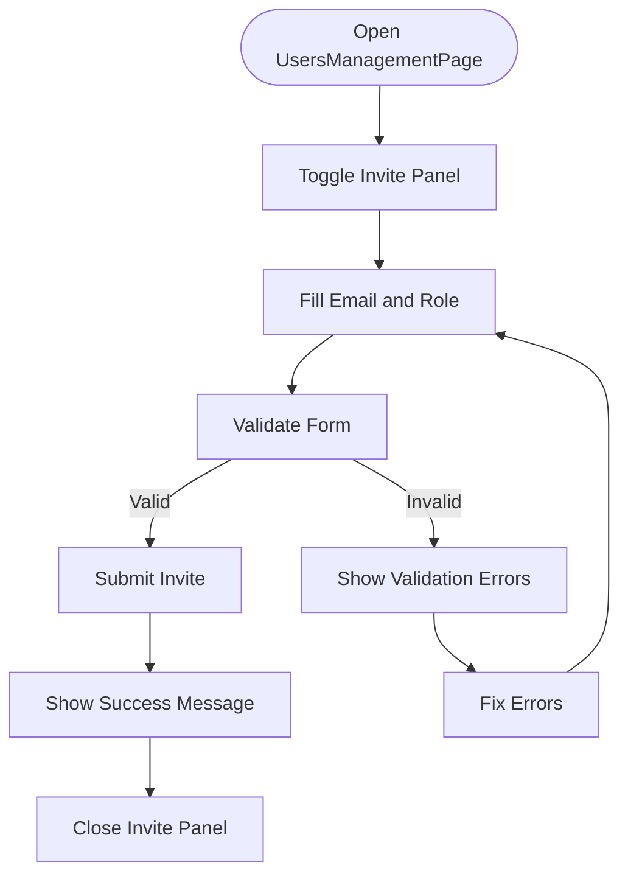

**Diagram sources**
- [apps/backoffice/src/routes/users-management.tsx](file://apps/backoffice/src/routes/users-management.tsx#L94-L98)

**Section sources**
- [apps/backoffice/src/routes/users-management.tsx](file://apps/backoffice/src/routes/users-management.tsx#L64-L288)

### UserForm (Shared User Creation/Edit)
- Purpose: Unified form for creating and editing users with role assignment and validation.
- Features:
  - Basic info: name, email, phone.
  - Role selection with descriptions.
  - Permission summary per role.
  - Validation and submission handling.

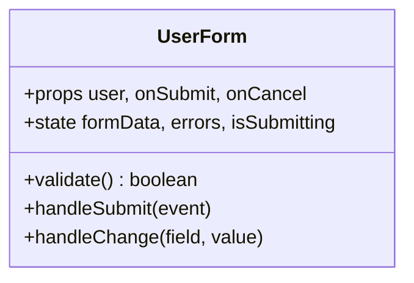

**Diagram sources**
- [apps/backoffice/src/components/users/UserForm.tsx](file://apps/backoffice/src/components/users/UserForm.tsx#L29-L238)

**Section sources**
- [apps/backoffice/src/components/users/UserForm.tsx](file://apps/backoffice/src/components/users/UserForm.tsx#L29-L238)

### MemberManagement (Organization-Level Members)
- Purpose: Manage organization members, add/remove, and update roles.
- Features:
  - Dropdown to select available users not yet in the organization.
  - Role selection (admin/member).
  - Update/remove member actions.
  - Query invalidation to refresh member lists.

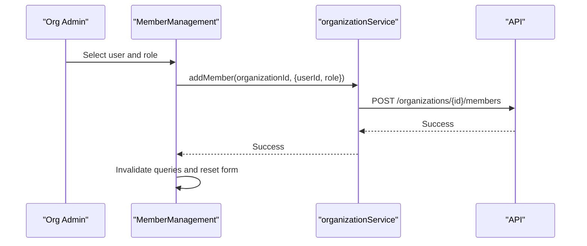

**Diagram sources**
- [apps/backoffice/src/components/organizations/MemberManagement.tsx](file://apps/backoffice/src/components/organizations/MemberManagement.tsx#L49-L71)

**Section sources**
- [apps/backoffice/src/components/organizations/MemberManagement.tsx](file://apps/backoffice/src/components/organizations/MemberManagement.tsx#L31-L257)

### TenantUsersListPage (Tenant-Level Users)
- Purpose: Tenant admin view of all users within the tenant.
- Features:
  - Search, role filter, status filter.
  - Paginated table with actions (view, edit, deactivate/reactivate).
  - Empty state and pagination controls.

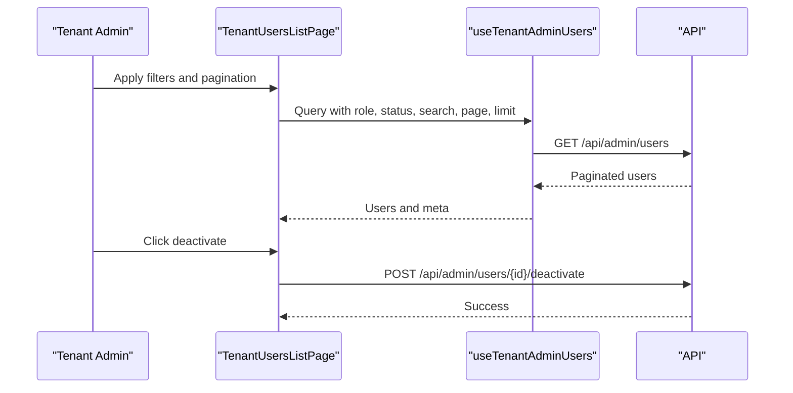

**Diagram sources**
- [apps/backoffice/src/routes/tenant/users/index.tsx](file://apps/backoffice/src/routes/tenant/users/index.tsx#L86-L124)

**Section sources**
- [apps/backoffice/src/routes/tenant/users/index.tsx](file://apps/backoffice/src/routes/tenant/users/index.tsx#L75-L364)

### TenantUserInvitePage (Tenant-Level Invitation)
- Purpose: Invite new users within the tenant with role and optional organization assignment.
- Features:
  - Form validation for email, role, names.
  - Submission via TenantAdminUserService.
  - Success/error feedback and navigation.

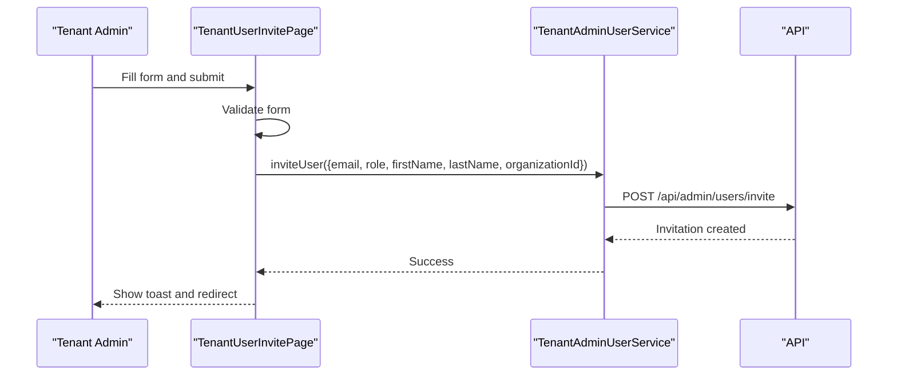

**Diagram sources**
- [apps/backoffice/src/routes/tenant/users/invite.tsx](file://apps/backoffice/src/routes/tenant/users/invite.tsx#L113-L142)
- [packages/client-sdk/src/services/tenant-admin-user.service.ts](file://packages/client-sdk/src/services/tenant-admin-user.service.ts#L149-L154)

**Section sources**
- [apps/backoffice/src/routes/tenant/users/invite.tsx](file://apps/backoffice/src/routes/tenant/users/invite.tsx#L48-L309)

### TenantAdminUserService (Backend Operations)
- Purpose: Backend service for tenant-level user management operations.
- Key operations:
  - Invite user, resend/cancel invitations.
  - Assign role, assign/remove from organization, assign scopes.
  - Deactivate/reactivate/suspend/unsuspend users.
  - Bulk operations: bulk invite, bulk deactivate, bulk assign role.
  - Retrieve effective permissions and activity logs.

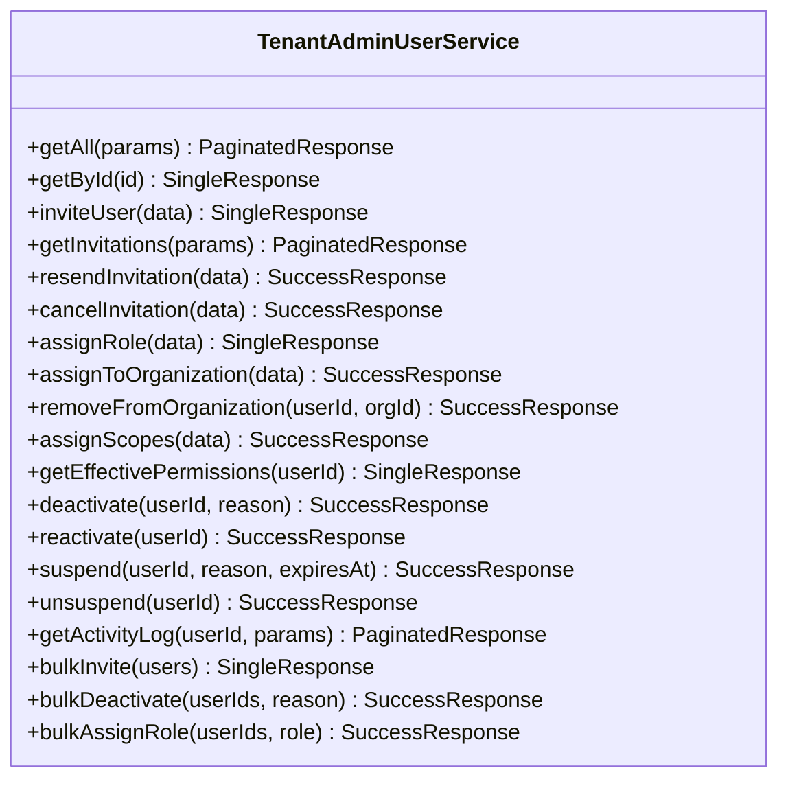

**Diagram sources**
- [packages/client-sdk/src/services/tenant-admin-user.service.ts](file://packages/client-sdk/src/services/tenant-admin-user.service.ts#L126-L320)

**Section sources**
- [packages/client-sdk/src/services/tenant-admin-user.service.ts](file://packages/client-sdk/src/services/tenant-admin-user.service.ts#L126-L320)

### RBAC Integration and Capability Management
- Capability-driven UI:
  - useCapabilities provides the user’s capability projection for rendering UI elements.
  - useHasCapability checks for specific global capabilities.
- Permission assignments and access grants:
  - useAccessGrants, useGrantAccess, useRevokeAccess manage access delegation.
  - usePermissionAssignments, useAssignPermissions, useRevokePermissions manage granular permissions.
- Local RBAC helper:
  - useRBAC provides a lightweight permission checker for UI-level decisions.

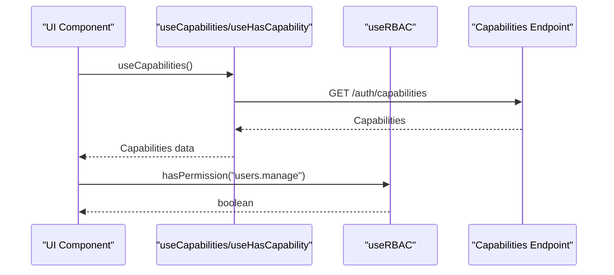

**Diagram sources**
- [packages/client-sdk/src/hooks/use-rbac.ts](file://packages/client-sdk/src/hooks/use-rbac.ts#L38-L90)
- [apps/backoffice/src/hooks/useRBAC.ts](file://apps/backoffice/src/hooks/useRBAC.ts#L51-L83)

**Section sources**
- [packages/client-sdk/src/hooks/use-rbac.ts](file://packages/client-sdk/src/hooks/use-rbac.ts#L1-L656)
- [apps/backoffice/src/hooks/useRBAC.ts](file://apps/backoffice/src/hooks/useRBAC.ts#L1-L83)
- [tests/unit/capabilities.test.ts](file://tests/unit/capabilities.test.ts#L102-L144)

## Dependency Analysis
- UI pages depend on SDK hooks/services for data and mutations.
- MemberManagement depends on organizationService and React Query invalidation.
- TenantUsersListPage and TenantUserInvitePage depend on TenantAdminUserService.
- RBAC hooks provide capability-driven UI rendering and enforce permission checks.

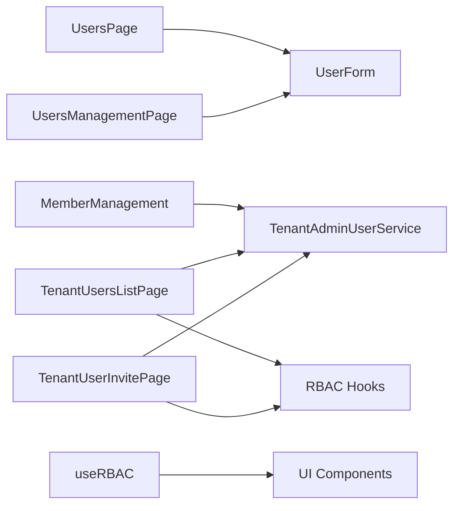

**Diagram sources**
- [apps/backoffice/src/routes/users.tsx](file://apps/backoffice/src/routes/users.tsx#L57-L292)
- [apps/backoffice/src/routes/users-management.tsx](file://apps/backoffice/src/routes/users-management.tsx#L64-L288)
- [apps/backoffice/src/components/organizations/MemberManagement.tsx](file://apps/backoffice/src/components/organizations/MemberManagement.tsx#L31-L257)
- [apps/backoffice/src/routes/tenant/users/index.tsx](file://apps/backoffice/src/routes/tenant/users/index.tsx#L75-L364)
- [apps/backoffice/src/routes/tenant/users/invite.tsx](file://apps/backoffice/src/routes/tenant/users/invite.tsx#L48-L309)
- [packages/client-sdk/src/services/tenant-admin-user.service.ts](file://packages/client-sdk/src/services/tenant-admin-user.service.ts#L126-L320)
- [packages/client-sdk/src/hooks/use-rbac.ts](file://packages/client-sdk/src/hooks/use-rbac.ts#L1-L656)
- [apps/backoffice/src/hooks/useRBAC.ts](file://apps/backoffice/src/hooks/useRBAC.ts#L1-L83)

**Section sources**
- [apps/backoffice/src/routes/users.tsx](file://apps/backoffice/src/routes/users.tsx#L57-L292)
- [apps/backoffice/src/routes/users-management.tsx](file://apps/backoffice/src/routes/users-management.tsx#L64-L288)
- [apps/backoffice/src/components/organizations/MemberManagement.tsx](file://apps/backoffice/src/components/organizations/MemberManagement.tsx#L31-L257)
- [apps/backoffice/src/routes/tenant/users/index.tsx](file://apps/backoffice/src/routes/tenant/users/index.tsx#L75-L364)
- [apps/backoffice/src/routes/tenant/users/invite.tsx](file://apps/backoffice/src/routes/tenant/users/invite.tsx#L48-L309)
- [packages/client-sdk/src/services/tenant-admin-user.service.ts](file://packages/client-sdk/src/services/tenant-admin-user.service.ts#L126-L320)
- [packages/client-sdk/src/hooks/use-rbac.ts](file://packages/client-sdk/src/hooks/use-rbac.ts#L1-L656)
- [apps/backoffice/src/hooks/useRBAC.ts](file://apps/backoffice/src/hooks/useRBAC.ts#L1-L83)

## Performance Considerations
- Use pagination and filtering to reduce payload sizes on user lists.
- Debounce search inputs to avoid excessive API calls.
- Invalidate only affected query keys after mutations to minimize re-fetches.
- Cache capabilities and permissions judiciously to avoid frequent network requests.

## Troubleshooting Guide
- Validation errors in forms:
  - Ensure required fields are present and formatted correctly (email pattern).
- Permission denied errors:
  - Verify current user’s capabilities and roles via RBAC hooks.
- API errors during invites or status changes:
  - Confirm endpoint availability and proper DTO shapes.
- Member management failures:
  - Check that the user is not already a member and that roles are valid.

**Section sources**
- [apps/backoffice/src/components/users/UserForm.tsx](file://apps/backoffice/src/components/users/UserForm.tsx#L54-L73)
- [apps/backoffice/src/routes/tenant/users/invite.tsx](file://apps/backoffice/src/routes/tenant/users/invite.tsx#L87-L111)
- [packages/client-sdk/src/hooks/use-rbac.ts](file://packages/client-sdk/src/hooks/use-rbac.ts#L607-L616)

## Conclusion
The Backoffice Application’s User Management functionality provides a comprehensive, capability-driven system for both administrative and tenant-level user operations. It integrates cleanly with the RBAC system, supports robust search and filtering, and offers clear UI components for user creation, role assignment, invitations, and status management. The separation of concerns across UI pages, shared components, and SDK services ensures maintainability and scalability.