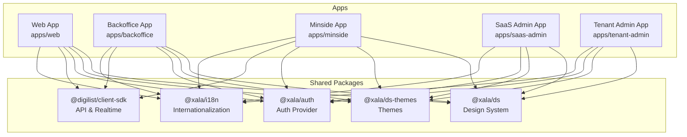
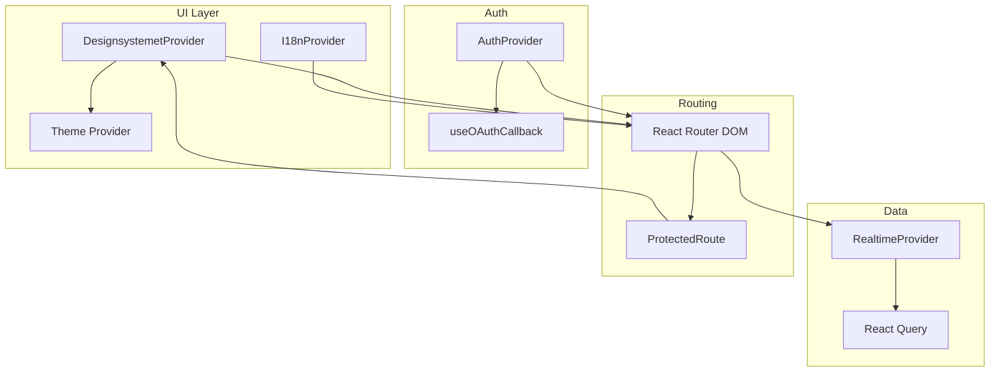
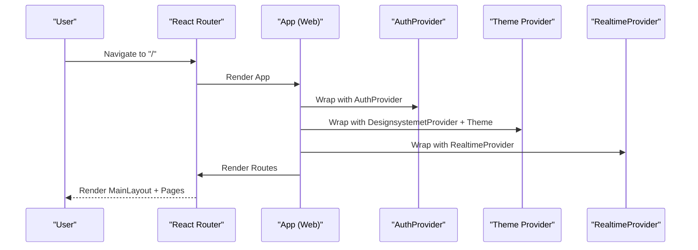
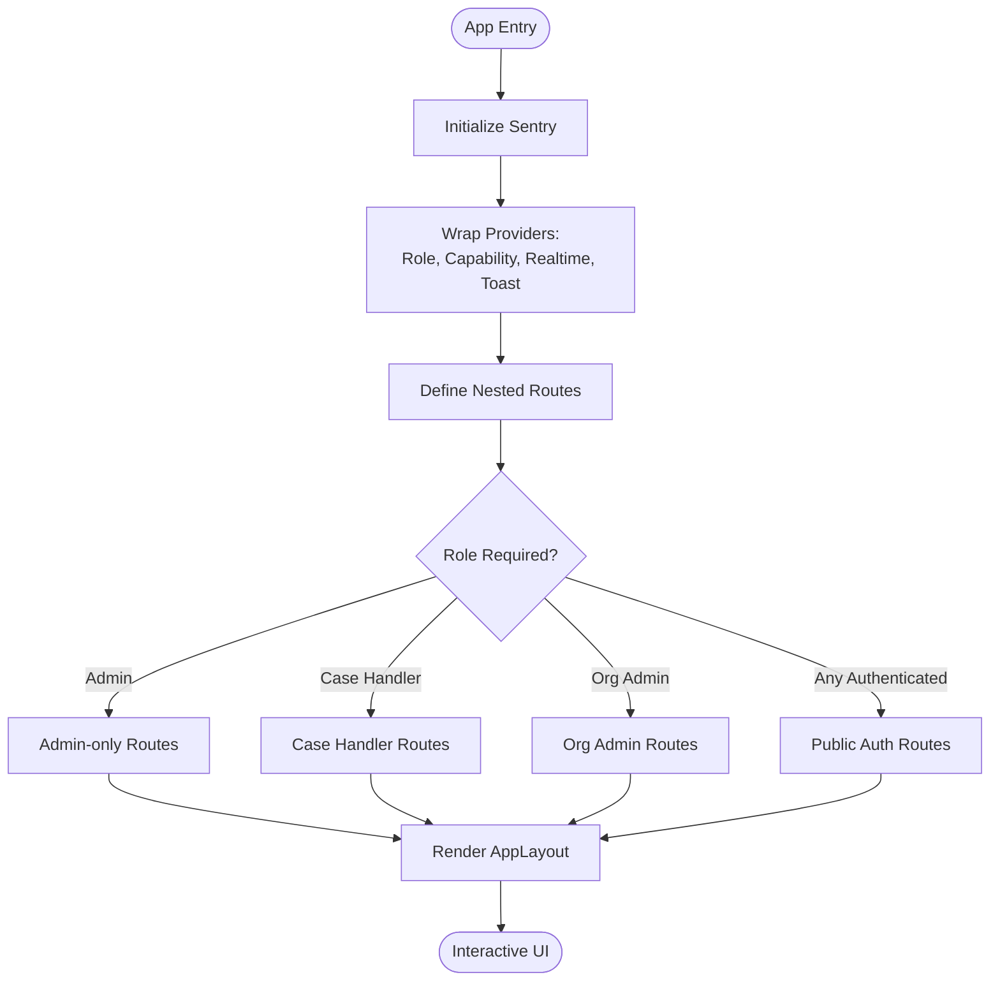
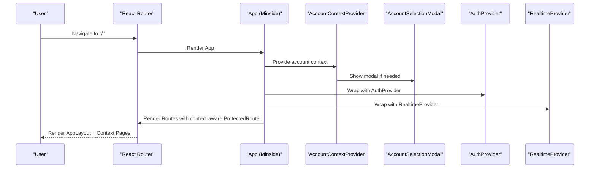
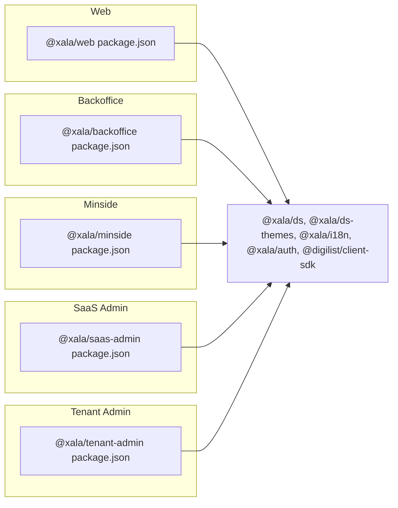

# Frontend Applications

<cite>
**Referenced Files in This Document**
- [apps/web/package.json](file://apps/web/package.json)
- [apps/web/vite.config.ts](file://apps/web/vite.config.ts)
- [apps/web/src/App.tsx](file://apps/web/src/App.tsx)
- [apps/backoffice/package.json](file://apps/backoffice/package.json)
- [apps/backoffice/vite.config.ts](file://apps/backoffice/vite.config.ts)
- [apps/backoffice/src/App.tsx](file://apps/backoffice/src/App.tsx)
- [apps/minside/package.json](file://apps/minside/package.json)
- [apps/minside/vite.config.ts](file://apps/minside/vite.config.ts)
- [apps/minside/src/App.tsx](file://apps/minside/src/App.tsx)
- [apps/saas-admin/package.json](file://apps/saas-admin/package.json)
- [apps/saas-admin/src/App.tsx](file://apps/saas-admin/src/App.tsx)
- [apps/tenant-admin/package.json](file://apps/tenant-admin/package.json)
- [apps/tenant-admin/src/App.tsx](file://apps/tenant-admin/src/App.tsx)
- [packages/ds/src/ThemeProvider.tsx](file://packages/ds/src/ThemeProvider.tsx)
- [packages/ds/src/provider.tsx](file://packages/ds/src/provider.tsx)
- [packages/ds-themes/src/index.ts](file://packages/ds-themes/src/index.ts)
- [packages/auth/src/providers/AuthProvider.tsx](file://packages/auth/src/providers/AuthProvider.tsx)
- [packages/client-sdk/src/realtime/RealtimeProvider.tsx](file://packages/client-sdk/src/realtime/RealtimeProvider.tsx)
- [packages/i18n/src/index.ts](file://packages/i18n/src/index.ts)
- [docker/nginx/web.conf](file://docker/nginx/web.conf)
- [docker/nginx/minside.conf](file://docker/nginx/minside.conf)
- [docker/nginx/backoffice.conf](file://docker/nginx/backoffice.conf)
- [docker/nginx/saas-admin.conf](file://docker/nginx/saas-admin.conf)
- [docker/nginx/tenant-admin.conf](file://docker/nginx/tenant-admin.conf)
</cite>

## Table of Contents
1. [Introduction](#introduction)
2. [Project Structure](#project-structure)
3. [Core Components](#core-components)
4. [Architecture Overview](#architecture-overview)
5. [Detailed Component Analysis](#detailed-component-analysis)
6. [Dependency Analysis](#dependency-analysis)
7. [Performance Considerations](#performance-considerations)
8. [Troubleshooting Guide](#troubleshooting-guide)
9. [Conclusion](#conclusion)
10. [Appendices](#appendices)

## Introduction
This document provides comprehensive documentation for the five React applications in the monorepo:
- Web: Public-facing booking and listing discovery application
- Backoffice: Administrative portal for municipalities and organizations
- Minside: Citizen portal for personal and organizational accounts
- SaaS Admin: Platform-level administration for tenants and plans
- Tenant Admin: Tenant-level administration for branding and settings

It covers architecture, routing patterns, component structure, state management, authentication integration, design system usage, theme switching, navigation patterns, user workflows, build configuration, development setup, and deployment processes. It also highlights shared patterns and application-specific customizations.

## Project Structure
Each application is a standalone React + Vite project under apps/<app-name>, with shared packages under packages/:
- Design System (@xala/ds): UI primitives, components, and theming
- Themes (@xala/ds-themes): Theme definitions and theme switching
- Authentication (@xala/auth): Unified auth provider and hooks
- Client SDK (@digilist/client-sdk): API clients, realtime, and utilities
- Contracts and other shared packages

**Diagram sources**
- [apps/web/package.json](file://apps/web/package.json#L13-L26)
- [apps/backoffice/package.json](file://apps/backoffice/package.json#L12-L23)
- [apps/minside/package.json](file://apps/minside/package.json#L12-L24)
- [apps/saas-admin/package.json](file://apps/saas-admin/package.json#L12-L23)
- [apps/tenant-admin/package.json](file://apps/tenant-admin/package.json#L12-L23)

**Section sources**
- [apps/web/package.json](file://apps/web/package.json#L1-L39)
- [apps/backoffice/package.json](file://apps/backoffice/package.json#L1-L36)
- [apps/minside/package.json](file://apps/minside/package.json#L1-L36)
- [apps/saas-admin/package.json](file://apps/saas-admin/package.json#L1-L35)
- [apps/tenant-admin/package.json](file://apps/tenant-admin/package.json#L1-L35)

## Core Components
- Design System Provider: Centralized theming and layout via @xala/ds
- Theme Provider: Manages color scheme (auto/light/dark) and persists preferences
- Auth Provider: Unified authentication across apps using @xala/auth
- Realtime Provider: WebSocket connectivity for live updates via @digilist/client-sdk
- Internationalization: @xala/i18n for translations and locale management
- Routing: React Router DOM with protected routes and lazy loading where appropriate

Key shared patterns:
- All apps wrap the application with I18nProvider and DesignsystemetProvider
- AuthProvider is configured per app with appType and environment variables
- ProtectedRoute guards routes requiring authentication
- Theme switching is implemented consistently across apps

**Section sources**
- [apps/web/src/App.tsx](file://apps/web/src/App.tsx#L10-L25)
- [apps/web/src/App.tsx](file://apps/web/src/App.tsx#L217-L252)
- [apps/backoffice/src/App.tsx](file://apps/backoffice/src/App.tsx#L87-L119)
- [apps/minside/src/App.tsx](file://apps/minside/src/App.tsx#L103-L183)
- [apps/saas-admin/src/App.tsx](file://apps/saas-admin/src/App.tsx#L39-L92)
- [apps/tenant-admin/src/App.tsx](file://apps/tenant-admin/src/App.tsx#L26-L66)
- [packages/ds/src/ThemeProvider.tsx](file://packages/ds/src/ThemeProvider.tsx)
- [packages/ds/src/provider.tsx](file://packages/ds/src/provider.tsx)
- [packages/ds-themes/src/index.ts](file://packages/ds-themes/src/index.ts)
- [packages/auth/src/providers/AuthProvider.tsx](file://packages/auth/src/providers/AuthProvider.tsx)
- [packages/client-sdk/src/realtime/RealtimeProvider.tsx](file://packages/client-sdk/src/realtime/RealtimeProvider.tsx)
- [packages/i18n/src/index.ts](file://packages/i18n/src/index.ts)

## Architecture Overview
High-level architecture across all apps:
- UI layer built on @xala/ds with theme support
- Authentication managed centrally via @xala/auth
- Data access through @digilist/client-sdk with React Query
- Realtime updates via WebSocket provider
- Internationalization via @xala/i18n
- Build and deployment via Vite with app-specific configurations

**Diagram sources**
- [apps/web/src/App.tsx](file://apps/web/src/App.tsx#L255-L272)
- [apps/backoffice/src/App.tsx](file://apps/backoffice/src/App.tsx#L104-L113)
- [apps/minside/src/App.tsx](file://apps/minside/src/App.tsx#L119-L127)
- [apps/saas-admin/src/App.tsx](file://apps/saas-admin/src/App.tsx#L45-L51)
- [apps/tenant-admin/src/App.tsx](file://apps/tenant-admin/src/App.tsx#L32-L38)

## Detailed Component Analysis

### Web Application
Purpose: Public booking and listing discovery for citizens.

Key characteristics:
- Theme switching with persistent preference
- OAuth/BankID callback handling
- Realtime notifications and toast integration
- Consent popup and error boundary
- PWA caching for offline and performance

Routing highlights:
- Public routes: home, listing/search, detail
- Protected routes: payment callback, privacy settings
- Redirects for legacy listing URLs

State management:
- Theme state with localStorage persistence
- Unread notifications via SDK hook
- Error boundaries and dialogs

Build and PWA:
- Vite PWA plugin with runtime caching for fonts and API
- Manual chunking for Mapbox GL, React Query, SDK, and DS
- Mapbox GL Node polyfills in dev dependencies

**Diagram sources**
- [apps/web/src/App.tsx](file://apps/web/src/App.tsx#L255-L272)
- [apps/web/src/App.tsx](file://apps/web/src/App.tsx#L228-L247)

**Section sources**
- [apps/web/src/App.tsx](file://apps/web/src/App.tsx#L1-L275)
- [apps/web/vite.config.ts](file://apps/web/vite.config.ts#L1-L145)
- [apps/web/package.json](file://apps/web/package.json#L1-L39)

### Backoffice Application
Purpose: Administrative portal for municipalities and organizations with role-based access.

Key characteristics:
- Lazy-loaded routes for performance
- Role-based and capability-based protection
- Sentry integration for source maps in production
- Realtime provider with configurable WS URL and tenant ID
- Comprehensive nested routing for listings, bookings, seasons, organizations, users, and tenant settings

Routing highlights:
- Login and role selection
- Nested routes grouped by functional areas (listings, calendar, bookings, seasons, organizations, access grants, users, reports, audit, reviews, messages, settings, GDPR requests)
- Admin-only and case-handler-only routes
- Legacy redirects for backward compatibility

State management:
- BackofficeRoleProvider and CapabilityProvider orchestrate permissions
- Suspense fallback during route lazy-loading

Build and observability:
- Sentry Vite plugin uploads source maps in production
- Manual chunking for SDK and DS

**Diagram sources**
- [apps/backoffice/src/App.tsx](file://apps/backoffice/src/App.tsx#L84-L85)
- [apps/backoffice/src/App.tsx](file://apps/backoffice/src/App.tsx#L127-L443)

**Section sources**
- [apps/backoffice/src/App.tsx](file://apps/backoffice/src/App.tsx#L1-L445)
- [apps/backoffice/vite.config.ts](file://apps/backoffice/vite.config.ts#L1-L71)
- [apps/backoffice/package.json](file://apps/backoffice/package.json#L1-L36)

### Minside Application
Purpose: Citizen portal supporting personal and organizational contexts with account selection.

Key characteristics:
- Account context provider and selection modal
- Notification center context
- Realtime provider with WS URL and tenant ID
- OAuth callback handler integrated at app level
- Context-aware routing (personal vs organization)

Routing highlights:
- Login
- Personal context: dashboard, bookings, billing, calendar, messages, favorites
- Shared context: settings, preferences, notifications, privacy, help
- Organization context: dashboard, bookings, invoices, members, season rental, settings, activity

State management:
- Account context with persistence and optional "remember choice"
- Notification center open/close state
- Theme via ThemeProvider

Build and PWA:
- Vite PWA plugin with caching strategies including a dedicated cache for bookings
- Manual chunking for SDK and DS

**Diagram sources**
- [apps/minside/src/App.tsx](file://apps/minside/src/App.tsx#L103-L183)
- [apps/minside/src/App.tsx](file://apps/minside/src/App.tsx#L86-L101)

**Section sources**
- [apps/minside/src/App.tsx](file://apps/minside/src/App.tsx#L1-L184)
- [apps/minside/vite.config.ts](file://apps/minside/vite.config.ts#L1-L116)
- [apps/minside/package.json](file://apps/minside/package.json#L1-L36)

### SaaS Admin Application
Purpose: Platform-level administration for managing tenants, plans, billing, users, audit logs, branding, and monitoring.

Key characteristics:
- Minimal routing structure focused on administrative tasks
- Uses DesignsystemetProvider with theme and size configuration
- ProtectedRoute for all admin routes

Routing highlights:
- Login
- Dashboard
- Tenants: list, create, detail, edit
- Plans: list, create, detail
- Feature flags catalog
- Billing, users, audit log, settings
- AI seed generator
- Branding management
- Monitoring

State management:
- ToastProvider for notifications
- ProtectedRoute for access control

**Section sources**
- [apps/saas-admin/src/App.tsx](file://apps/saas-admin/src/App.tsx#L1-L93)
- [apps/saas-admin/package.json](file://apps/saas-admin/package.json#L1-L35)

### Tenant Admin Application
Purpose: Tenant-level administration for subscription, users, feature flags, audit logs, branding, settings, and integrations.

Key characteristics:
- Simple routing focused on tenant administration
- Uses DesignsystemetProvider with theme and size configuration
- ProtectedRoute for all admin routes

Routing highlights:
- Login
- Dashboard
- Subscription
- Users
- Feature flags
- Audit log
- Branding settings
- Settings
- Integrations settings

State management:
- ToastProvider for notifications
- ProtectedRoute for access control

**Section sources**
- [apps/tenant-admin/src/App.tsx](file://apps/tenant-admin/src/App.tsx#L1-L66)
- [apps/tenant-admin/package.json](file://apps/tenant-admin/package.json#L1-L35)

## Dependency Analysis
Shared dependencies across apps:
- @xala/ds, @xala/ds-themes, @xala/i18n for UI, theming, and i18n
- @xala/auth for unified authentication
- @digilist/client-sdk for API and realtime
- @tanstack/react-query for data fetching
- react, react-router-dom, react-dom

Application-specific differences:
- Web: Vite PWA plugin, Mapbox GL dependencies, custom optimizeDeps
- Backoffice: Sentry Vite plugin, role/capability providers
- Minside: PWA caching tailored to bookings, account context
- SaaS Admin and Tenant Admin: minimal dependencies, focused routing

**Diagram sources**
- [apps/web/package.json](file://apps/web/package.json#L13-L26)
- [apps/backoffice/package.json](file://apps/backoffice/package.json#L12-L23)
- [apps/minside/package.json](file://apps/minside/package.json#L12-L24)
- [apps/saas-admin/package.json](file://apps/saas-admin/package.json#L12-L23)
- [apps/tenant-admin/package.json](file://apps/tenant-admin/package.json#L12-L23)

**Section sources**
- [apps/web/package.json](file://apps/web/package.json#L1-L39)
- [apps/backoffice/package.json](file://apps/backoffice/package.json#L1-L36)
- [apps/minside/package.json](file://apps/minside/package.json#L1-L36)
- [apps/saas-admin/package.json](file://apps/saas-admin/package.json#L1-L35)
- [apps/tenant-admin/package.json](file://apps/tenant-admin/package.json#L1-L35)

## Performance Considerations
- Manual chunking in Vite configs separates large vendor libraries (Mapbox GL, React Query, SDK, DS) to improve caching and load performance
- Web and Minside use Vite PWA with runtime caching for fonts and API responses
- Minside adds a dedicated cache for booking data to support offline viewing
- Backoffice enables Sentry source maps only in production builds
- Lazy loading of routes reduces initial bundle size in Backoffice
- Mapbox GL requires Node polyfills in dev; Vite config sets target and defines global

Recommendations:
- Monitor chunk size warnings and adjust manualChunks as needed
- Keep PWA caches aligned with data freshness requirements
- Consider code splitting for infrequently used features
- Validate Sentry source map uploads in CI/CD

**Section sources**
- [apps/web/vite.config.ts](file://apps/web/vite.config.ts#L86-L120)
- [apps/minside/vite.config.ts](file://apps/minside/vite.config.ts#L34-L94)
- [apps/backoffice/vite.config.ts](file://apps/backoffice/vite.config.ts#L34-L69)

## Troubleshooting Guide
Common issues and resolutions:
- Authentication flow
  - Ensure OAuth/BankID callbacks are handled by useOAuthCallback in each app’s App wrapper
  - Verify environment variables for API URL and WS URL are set appropriately per app
- Theme switching
  - Confirm ThemeProvider is wrapping the app and colorScheme is passed to DesignsystemetProvider
  - Check local storage key for theme preference and media query listeners
- Realtime connectivity
  - Verify RealtimeProvider configuration (WS URL, tenant ID) and autoConnect flag
  - Inspect WebSocket connection and error logs
- Routing and permissions
  - For Backoffice, confirm role/capability providers are initialized before routes
  - Ensure ProtectedRoute is applied to protected routes and required roles/capabilities match backend expectations
- PWA caching
  - Clear browser cache or unregister service worker if stale assets persist
  - Adjust cache expiration and patterns for API and static assets as needed
- Sentry source maps
  - Confirm Sentry plugin is enabled only in production and environment variables are present

**Section sources**
- [apps/web/src/App.tsx](file://apps/web/src/App.tsx#L170-L252)
- [apps/backoffice/src/App.tsx](file://apps/backoffice/src/App.tsx#L122-L443)
- [apps/minside/src/App.tsx](file://apps/minside/src/App.tsx#L103-L183)
- [apps/web/vite.config.ts](file://apps/web/vite.config.ts#L11-L84)
- [apps/minside/vite.config.ts](file://apps/minside/vite.config.ts#L11-L99)
- [apps/backoffice/vite.config.ts](file://apps/backoffice/vite.config.ts#L9-L19)

## Conclusion
The five React applications share a cohesive architecture built on a unified design system, authentication, and data access layers. Each app adapts these shared components to its specific user workflows: public listing discovery (Web), administrative operations (Backoffice), citizen dashboards (Minside), platform administration (SaaS Admin), and tenant administration (Tenant Admin). The build configurations emphasize performance, reliability, and developer experience through Vite, PWA caching, Sentry integration, and careful chunking strategies.

## Appendices

### Build Configuration and Development Setup
- Development servers
  - Web: port defaults to standard Vite port
  - Backoffice: port 5175
  - Minside: port 5174
  - SaaS Admin: port defaults to standard Vite port
  - Tenant Admin: port defaults to standard Vite port
- Scripts
  - dev, build, lint, preview available in each app’s package.json
- Environment variables
  - API URL, WS URL, tenant ID, Sentry credentials are referenced in app configs
- PWA
  - Web and Minside include Vite PWA plugin with runtime caching
- Sentry
  - Backoffice and Minside include Sentry Vite plugin for source maps in production

**Section sources**
- [apps/web/package.json](file://apps/web/package.json#L6-L11)
- [apps/backoffice/package.json](file://apps/backoffice/package.json#L6-L10)
- [apps/minside/package.json](file://apps/minside/package.json#L6-L10)
- [apps/saas-admin/package.json](file://apps/saas-admin/package.json#L6-L10)
- [apps/tenant-admin/package.json](file://apps/tenant-admin/package.json#L6-L10)
- [apps/web/vite.config.ts](file://apps/web/vite.config.ts#L1-L145)
- [apps/minside/vite.config.ts](file://apps/minside/vite.config.ts#L1-L116)
- [apps/backoffice/vite.config.ts](file://apps/backoffice/vite.config.ts#L1-L71)

### Deployment Processes
- Nginx configuration
  - Separate virtual hosts for each app under docker/nginx/
- Multi-app deployment
  - Apps are deployed behind Nginx with subdomain or path routing
- Production readiness
  - Sentry source maps uploaded only in production builds (Backoffice)
  - PWA manifests and caching strategies optimized for performance and offline usage

**Section sources**
- [docker/nginx/web.conf](file://docker/nginx/web.conf)
- [docker/nginx/minside.conf](file://docker/nginx/minside.conf)
- [docker/nginx/backoffice.conf](file://docker/nginx/backoffice.conf)
- [docker/nginx/saas-admin.conf](file://docker/nginx/saas-admin.conf)
- [docker/nginx/tenant-admin.conf](file://docker/nginx/tenant-admin.conf)