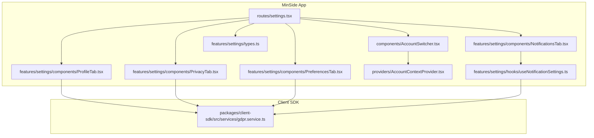
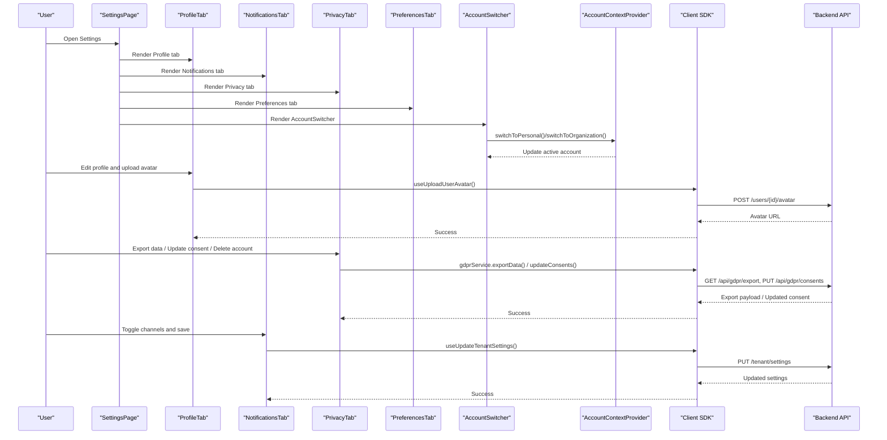
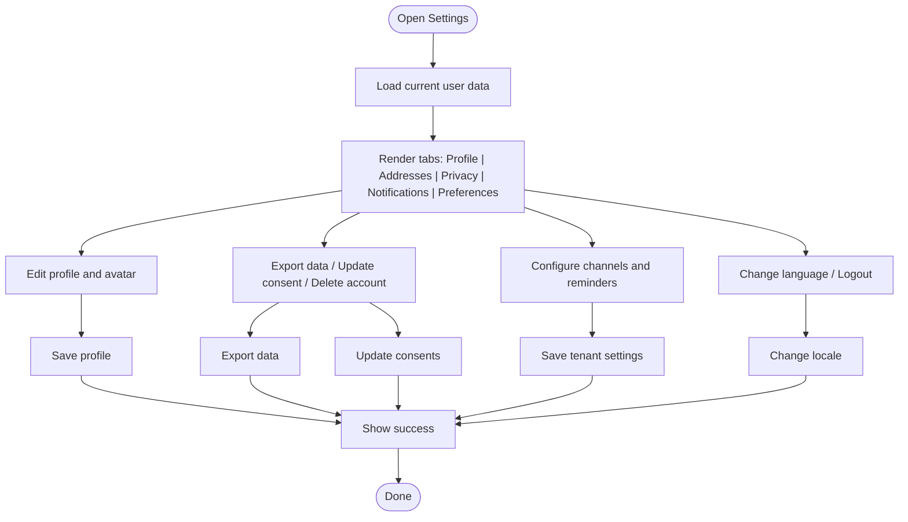
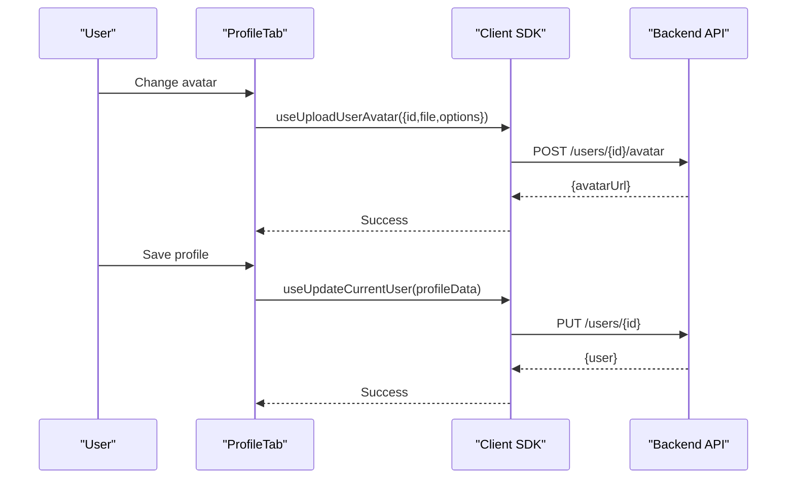
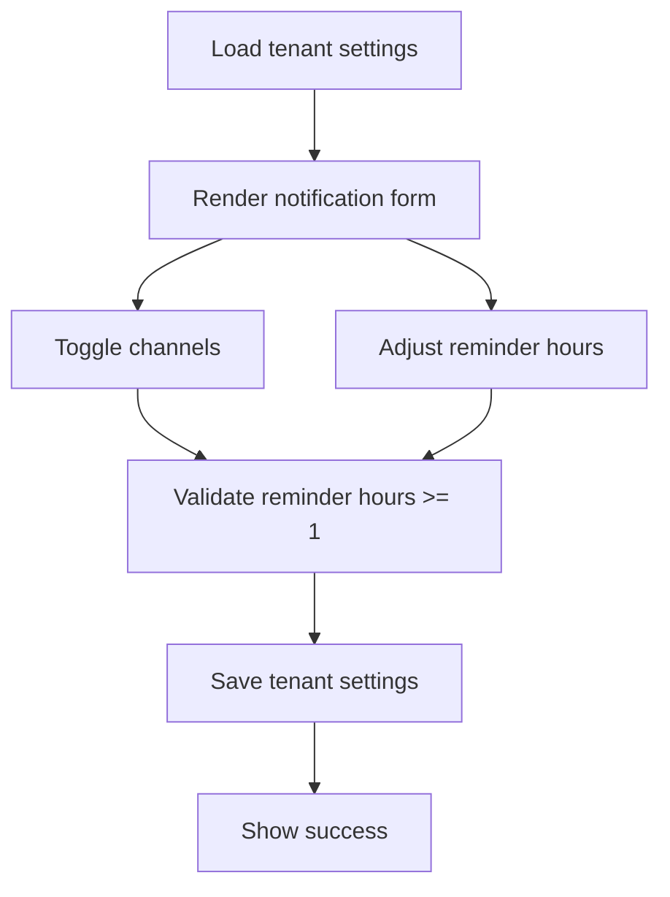
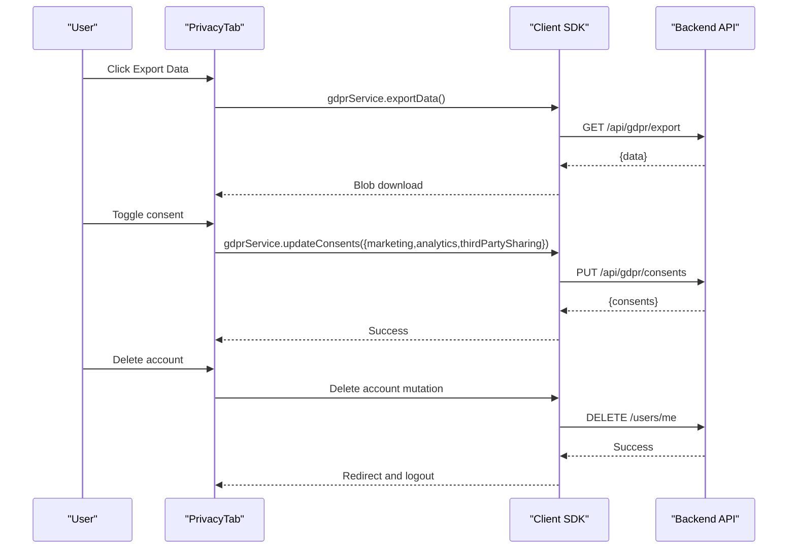
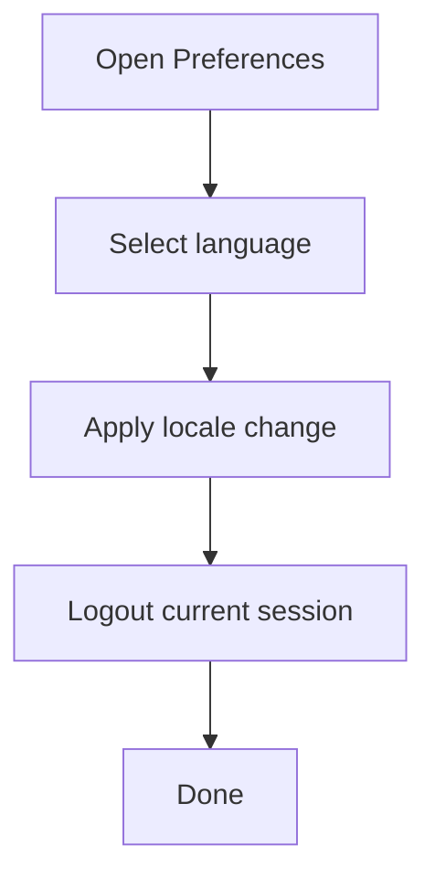
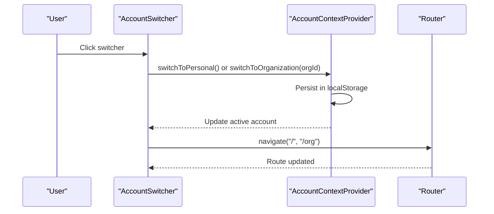
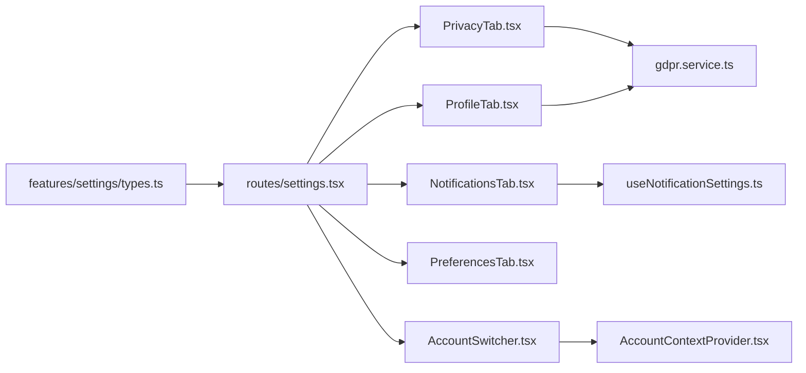

# Account & Settings

<cite>
**Referenced Files in This Document**
- [apps/minside/src/routes/settings.tsx](file://apps/minside/src/routes/settings.tsx)
- [apps/minside/src/features/settings/types.ts](file://apps/minside/src/features/settings/types.ts)
- [apps/minside/src/features/settings/components/ProfileTab.tsx](file://apps/minside/src/features/settings/components/ProfileTab.tsx)
- [apps/minside/src/features/settings/components/NotificationsTab.tsx](file://apps/minside/src/features/settings/components/NotificationsTab.tsx)
- [apps/minside/src/features/settings/components/PrivacyTab.tsx](file://apps/minside/src/features/settings/components/PrivacyTab.tsx)
- [apps/minside/src/features/settings/components/PreferencesTab.tsx](file://apps/minside/src/features/settings/components/PreferencesTab.tsx)
- [apps/minside/src/features/settings/hooks/useNotificationSettings.ts](file://apps/minside/src/features/settings/hooks/useNotificationSettings.ts)
- [apps/minside/src/components/AccountSwitcher.tsx](file://apps/minside/src/components/AccountSwitcher.tsx)
- [apps/minside/src/providers/AccountContextProvider.tsx](file://apps/minside/src/providers/AccountContextProvider.tsx)
- [packages/client-sdk/src/services/gdpr.service.ts](file://packages/client-sdk/src/services/gdpr.service.ts)
</cite>

## Table of Contents
1. [Introduction](#introduction)
2. [Project Structure](#project-structure)
3. [Core Components](#core-components)
4. [Architecture Overview](#architecture-overview)
5. [Detailed Component Analysis](#detailed-component-analysis)
6. [Dependency Analysis](#dependency-analysis)
7. [Performance Considerations](#performance-considerations)
8. [Troubleshooting Guide](#troubleshooting-guide)
9. [Conclusion](#conclusion)

## Introduction
This document describes the account settings and preferences system implemented in the MinSide application. It covers user profile management, personal information editing, notification preferences, privacy controls, language selection, and account switching across personal and organizational contexts. It also explains integration with backend services for GDPR data export and consent management, along with local persistence and UX behaviors.

## Project Structure
The settings system is primarily implemented in the MinSide application under the routes and features folders. Components are organized by functional areas (Profile, Notifications, Privacy, Preferences) and supported by shared types and hooks. Account switching spans a dedicated component and a context provider that manages multi-tenant and organization membership state.

**Diagram sources**
- [apps/minside/src/routes/settings.tsx](file://apps/minside/src/routes/settings.tsx#L46-L977)
- [apps/minside/src/features/settings/components/ProfileTab.tsx](file://apps/minside/src/features/settings/components/ProfileTab.tsx#L38-L267)
- [apps/minside/src/features/settings/components/NotificationsTab.tsx](file://apps/minside/src/features/settings/components/NotificationsTab.tsx#L19-L131)
- [apps/minside/src/features/settings/components/PrivacyTab.tsx](file://apps/minside/src/features/settings/components/PrivacyTab.tsx#L34-L264)
- [apps/minside/src/features/settings/components/PreferencesTab.tsx](file://apps/minside/src/features/settings/components/PreferencesTab.tsx#L18-L107)
- [apps/minside/src/components/AccountSwitcher.tsx](file://apps/minside/src/components/AccountSwitcher.tsx#L71-L415)
- [apps/minside/src/providers/AccountContextProvider.tsx](file://apps/minside/src/providers/AccountContextProvider.tsx#L83-L334)
- [apps/minside/src/features/settings/types.ts](file://apps/minside/src/features/settings/types.ts#L11-L168)
- [apps/minside/src/features/settings/hooks/useNotificationSettings.ts](file://apps/minside/src/features/settings/hooks/useNotificationSettings.ts#L26-L179)
- [packages/client-sdk/src/services/gdpr.service.ts](file://packages/client-sdk/src/services/gdpr.service.ts#L17-L88)

**Section sources**
- [apps/minside/src/routes/settings.tsx](file://apps/minside/src/routes/settings.tsx#L46-L977)
- [apps/minside/src/features/settings/types.ts](file://apps/minside/src/features/settings/types.ts#L11-L168)

## Core Components
- Settings page with tabbed navigation for Profile, Addresses, Privacy, Notifications, and Preferences.
- Profile tab for avatar upload and personal information editing.
- Notifications tab for channel toggles and automatic reminders.
- Privacy tab for data export, consent management, and account deletion.
- Preferences tab for language selection and session/logout actions.
- AccountSwitcher component and AccountContextProvider for multi-tenant and organization membership handling.
- useNotificationSettings hook for tenant-level notification preferences.
- GDPR service integration for data export, consent retrieval/update, and administrative request management.

**Section sources**
- [apps/minside/src/routes/settings.tsx](file://apps/minside/src/routes/settings.tsx#L288-L977)
- [apps/minside/src/features/settings/components/ProfileTab.tsx](file://apps/minside/src/features/settings/components/ProfileTab.tsx#L38-L267)
- [apps/minside/src/features/settings/components/NotificationsTab.tsx](file://apps/minside/src/features/settings/components/NotificationsTab.tsx#L19-L131)
- [apps/minside/src/features/settings/components/PrivacyTab.tsx](file://apps/minside/src/features/settings/components/PrivacyTab.tsx#L34-L264)
- [apps/minside/src/features/settings/components/PreferencesTab.tsx](file://apps/minside/src/features/settings/components/PreferencesTab.tsx#L18-L107)
- [apps/minside/src/components/AccountSwitcher.tsx](file://apps/minside/src/components/AccountSwitcher.tsx#L71-L415)
- [apps/minside/src/providers/AccountContextProvider.tsx](file://apps/minside/src/providers/AccountContextProvider.tsx#L83-L334)
- [apps/minside/src/features/settings/hooks/useNotificationSettings.ts](file://apps/minside/src/features/settings/hooks/useNotificationSettings.ts#L26-L179)
- [packages/client-sdk/src/services/gdpr.service.ts](file://packages/client-sdk/src/services/gdpr.service.ts#L17-L88)

## Architecture Overview
The settings system follows a layered pattern:
- UI layer: Tabbed settings page and dedicated components for each section.
- State and logic: Hooks encapsulate tenant and user-specific settings operations.
- Persistence and integration: Local storage for account context and SDK services for backend operations.
- Backend services: GDPR service handles data export, consent retrieval, and consent updates.

**Diagram sources**
- [apps/minside/src/routes/settings.tsx](file://apps/minside/src/routes/settings.tsx#L46-L977)
- [apps/minside/src/features/settings/components/ProfileTab.tsx](file://apps/minside/src/features/settings/components/ProfileTab.tsx#L91-L122)
- [apps/minside/src/features/settings/components/PrivacyTab.tsx](file://apps/minside/src/features/settings/components/PrivacyTab.tsx#L65-L103)
- [apps/minside/src/features/settings/components/NotificationsTab.tsx](file://apps/minside/src/features/settings/components/NotificationsTab.tsx#L19-L131)
- [apps/minside/src/features/settings/hooks/useNotificationSettings.ts](file://apps/minside/src/features/settings/hooks/useNotificationSettings.ts#L90-L113)
- [apps/minside/src/components/AccountSwitcher.tsx](file://apps/minside/src/components/AccountSwitcher.tsx#L102-L116)
- [apps/minside/src/providers/AccountContextProvider.tsx](file://apps/minside/src/providers/AccountContextProvider.tsx#L232-L252)
- [packages/client-sdk/src/services/gdpr.service.ts](file://packages/client-sdk/src/services/gdpr.service.ts#L67-L83)

## Detailed Component Analysis

### Settings Page and Tabs
- The SettingsPage renders a tabbed interface with Profile, Addresses, Privacy, Notifications, and Preferences.
- It orchestrates loading user data, managing save states, and coordinating cross-tab actions like scroll indicators and success feedback.
- Each tab encapsulates its own concerns: profile editing, address management, privacy controls, notification configuration, and preferences.

**Diagram sources**
- [apps/minside/src/routes/settings.tsx](file://apps/minside/src/routes/settings.tsx#L46-L977)

**Section sources**
- [apps/minside/src/routes/settings.tsx](file://apps/minside/src/routes/settings.tsx#L288-L977)

### Profile Management
- Loads current user data into the form and supports avatar preview and upload.
- Provides save action for profile updates and address copy functionality.
- Integrates with SDK hooks for updating user info and uploading avatar.

**Diagram sources**
- [apps/minside/src/features/settings/components/ProfileTab.tsx](file://apps/minside/src/features/settings/components/ProfileTab.tsx#L91-L122)
- [apps/minside/src/routes/settings.tsx](file://apps/minside/src/routes/settings.tsx#L132-L170)

**Section sources**
- [apps/minside/src/features/settings/components/ProfileTab.tsx](file://apps/minside/src/features/settings/components/ProfileTab.tsx#L38-L267)
- [apps/minside/src/routes/settings.tsx](file://apps/minside/src/routes/settings.tsx#L132-L170)

### Notification Preferences
- Uses a dedicated hook to load and persist tenant-level notification settings.
- Supports enabling/disabling channels and configuring automatic reminders with validation.
- Persists changes via tenant settings mutation.

**Diagram sources**
- [apps/minside/src/features/settings/hooks/useNotificationSettings.ts](file://apps/minside/src/features/settings/hooks/useNotificationSettings.ts#L26-L179)
- [apps/minside/src/features/settings/components/NotificationsTab.tsx](file://apps/minside/src/features/settings/components/NotificationsTab.tsx#L19-L131)

**Section sources**
- [apps/minside/src/features/settings/hooks/useNotificationSettings.ts](file://apps/minside/src/features/settings/hooks/useNotificationSettings.ts#L26-L179)
- [apps/minside/src/features/settings/components/NotificationsTab.tsx](file://apps/minside/src/features/settings/components/NotificationsTab.tsx#L19-L131)

### Privacy Settings and GDPR Compliance
- Provides data export, consent management, and account deletion flows.
- Integrates with GDPR service for exporting user data and updating consent preferences.
- Includes confirmation dialogs and success feedback.

**Diagram sources**
- [apps/minside/src/features/settings/components/PrivacyTab.tsx](file://apps/minside/src/features/settings/components/PrivacyTab.tsx#L65-L103)
- [packages/client-sdk/src/services/gdpr.service.ts](file://packages/client-sdk/src/services/gdpr.service.ts#L67-L83)

**Section sources**
- [apps/minside/src/features/settings/components/PrivacyTab.tsx](file://apps/minside/src/features/settings/components/PrivacyTab.tsx#L34-L264)
- [packages/client-sdk/src/services/gdpr.service.ts](file://packages/client-sdk/src/services/gdpr.service.ts#L17-L88)

### Preferences and Language Selection
- Allows changing the application language via locale provider.
- Provides a logout action for the current session.
- Notes on future theme customization availability.

**Diagram sources**
- [apps/minside/src/features/settings/components/PreferencesTab.tsx](file://apps/minside/src/features/settings/components/PreferencesTab.tsx#L18-L107)

**Section sources**
- [apps/minside/src/features/settings/components/PreferencesTab.tsx](file://apps/minside/src/features/settings/components/PreferencesTab.tsx#L18-L107)

### Account Switching and Multi-Tenant Context
- The AccountSwitcher displays personal and organization accounts and allows switching between them.
- The AccountContextProvider manages account type, selected organization, persistence in local storage, and validation of organization membership.
- On switch, navigates to appropriate dashboards and persists choices.

**Diagram sources**
- [apps/minside/src/components/AccountSwitcher.tsx](file://apps/minside/src/components/AccountSwitcher.tsx#L102-L116)
- [apps/minside/src/providers/AccountContextProvider.tsx](file://apps/minside/src/providers/AccountContextProvider.tsx#L232-L252)

**Section sources**
- [apps/minside/src/components/AccountSwitcher.tsx](file://apps/minside/src/components/AccountSwitcher.tsx#L71-L415)
- [apps/minside/src/providers/AccountContextProvider.tsx](file://apps/minside/src/providers/AccountContextProvider.tsx#L83-L334)

## Dependency Analysis
- Settings components depend on shared types for settings sections and DTOs.
- Notification preferences rely on a dedicated hook and tenant settings mutations.
- Privacy features integrate with the GDPR service for data export and consent management.
- Account switching depends on the AccountContextProvider for state and persistence.

**Diagram sources**
- [apps/minside/src/features/settings/types.ts](file://apps/minside/src/features/settings/types.ts#L11-L168)
- [apps/minside/src/routes/settings.tsx](file://apps/minside/src/routes/settings.tsx#L46-L977)
- [apps/minside/src/features/settings/components/NotificationsTab.tsx](file://apps/minside/src/features/settings/components/NotificationsTab.tsx#L19-L131)
- [apps/minside/src/features/settings/hooks/useNotificationSettings.ts](file://apps/minside/src/features/settings/hooks/useNotificationSettings.ts#L26-L179)
- [apps/minside/src/features/settings/components/PrivacyTab.tsx](file://apps/minside/src/features/settings/components/PrivacyTab.tsx#L34-L264)
- [packages/client-sdk/src/services/gdpr.service.ts](file://packages/client-sdk/src/services/gdpr.service.ts#L17-L88)
- [apps/minside/src/components/AccountSwitcher.tsx](file://apps/minside/src/components/AccountSwitcher.tsx#L71-L415)
- [apps/minside/src/providers/AccountContextProvider.tsx](file://apps/minside/src/providers/AccountContextProvider.tsx#L83-L334)

**Section sources**
- [apps/minside/src/features/settings/types.ts](file://apps/minside/src/features/settings/types.ts#L11-L168)
- [apps/minside/src/features/settings/hooks/useNotificationSettings.ts](file://apps/minside/src/features/settings/hooks/useNotificationSettings.ts#L26-L179)
- [packages/client-sdk/src/services/gdpr.service.ts](file://packages/client-sdk/src/services/gdpr.service.ts#L17-L88)

## Performance Considerations
- Debounce or batch saves for frequent preference toggles to reduce backend calls.
- Lazy-load heavy tabs (e.g., Privacy) to minimize initial render cost.
- Use optimistic updates for quick feedback during avatar upload and consent changes, with rollback on failure.
- Cache tenant settings locally to avoid repeated fetches during a session.

## Troubleshooting Guide
- Avatar upload fails: Verify file type and size limits; confirm network connectivity; check SDK response handling.
- Notification settings not saving: Ensure tenant settings are loaded; validate reminder hours; inspect mutation error callbacks.
- Privacy export/download issues: Confirm user is logged in; verify backend endpoint availability; check browser download permissions.
- Account switch does nothing: Confirm organizations are fetched; check local storage keys; ensure organization membership is valid.
- Consent updates not reflected: Refresh page or re-fetch consent data; verify backend response.

**Section sources**
- [apps/minside/src/features/settings/components/ProfileTab.tsx](file://apps/minside/src/features/settings/components/ProfileTab.tsx#L146-L170)
- [apps/minside/src/features/settings/hooks/useNotificationSettings.ts](file://apps/minside/src/features/settings/hooks/useNotificationSettings.ts#L90-L113)
- [apps/minside/src/features/settings/components/PrivacyTab.tsx](file://apps/minside/src/features/settings/components/PrivacyTab.tsx#L65-L103)
- [apps/minside/src/components/AccountSwitcher.tsx](file://apps/minside/src/components/AccountSwitcher.tsx#L102-L116)
- [apps/minside/src/providers/AccountContextProvider.tsx](file://apps/minside/src/providers/AccountContextProvider.tsx#L195-L229)

## Conclusion
The settings system provides a cohesive, modular approach to user profile management, preferences, privacy controls, and account switching. It leverages SDK services for backend integration, maintains state with hooks, and persists critical selections locally. The architecture supports extensibility for additional preferences and theme customization while ensuring GDPR-aligned data handling and user control.