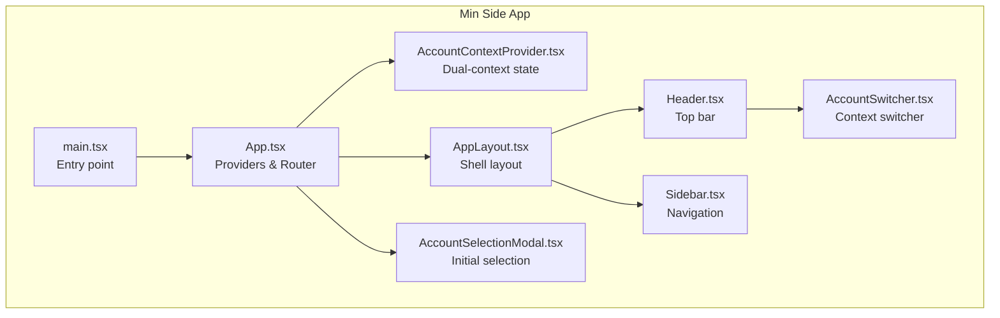
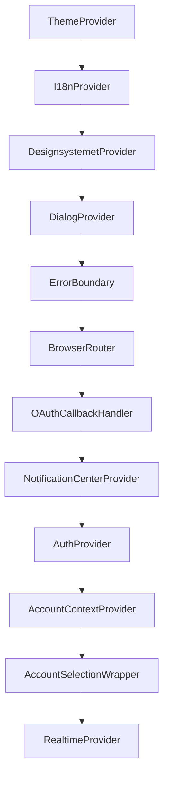
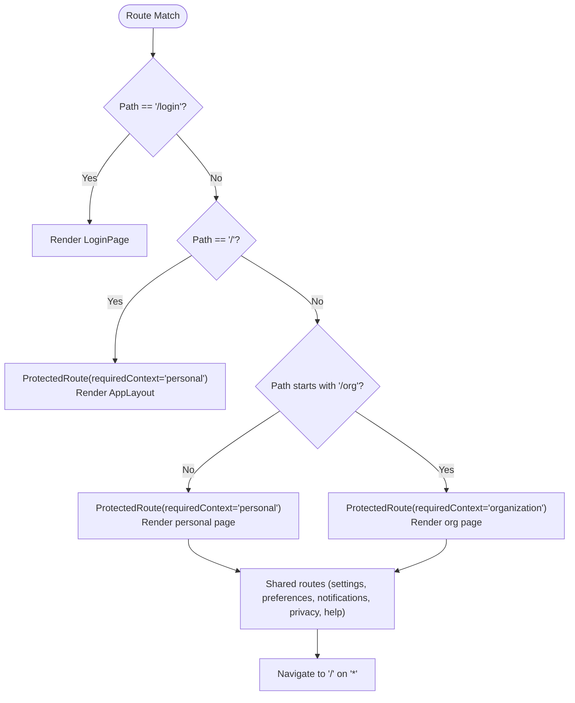
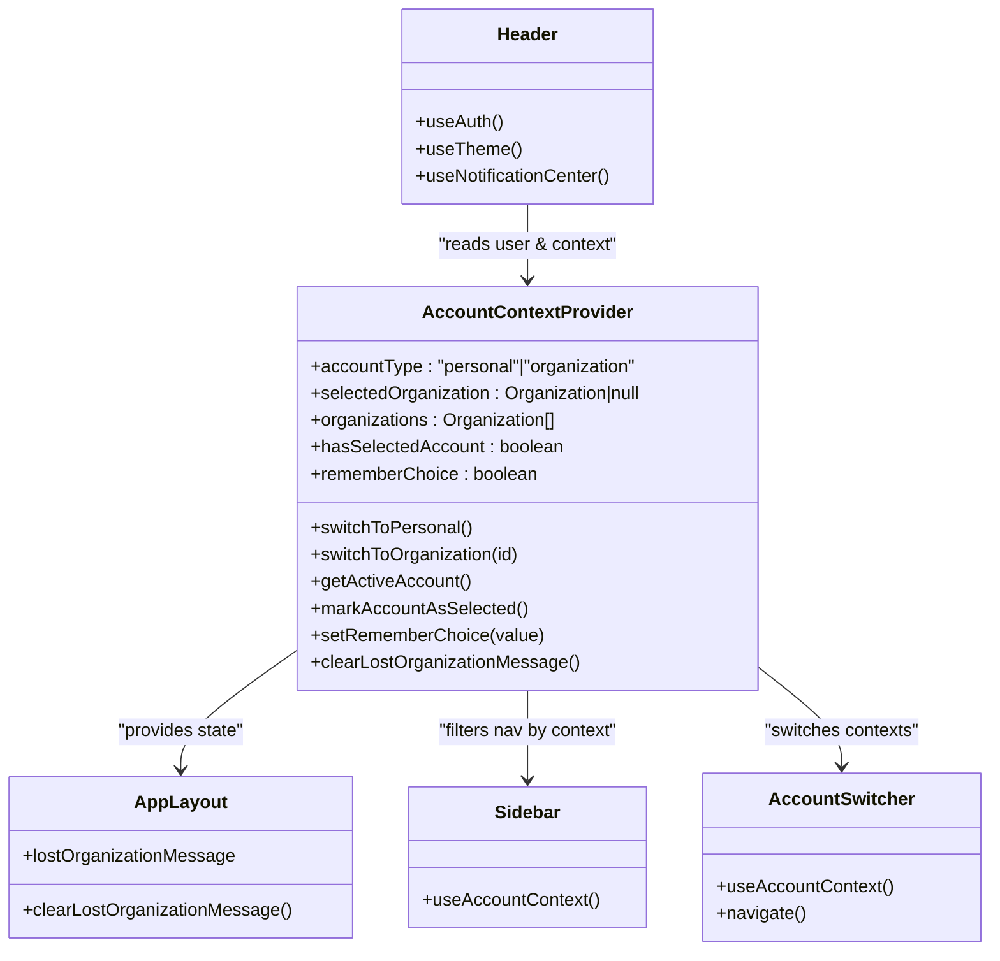
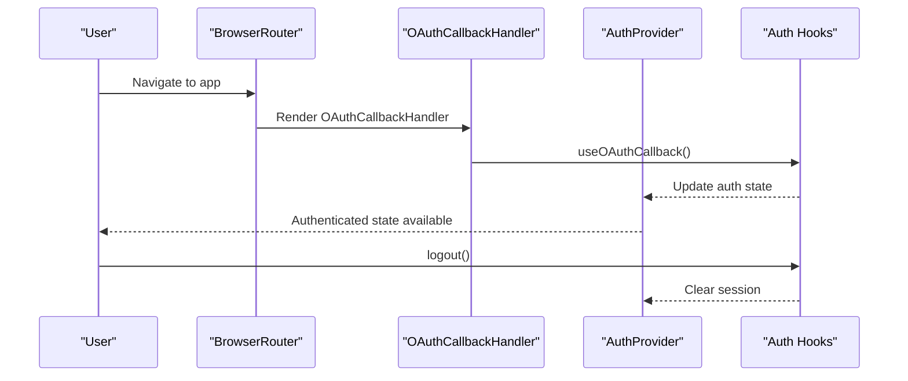
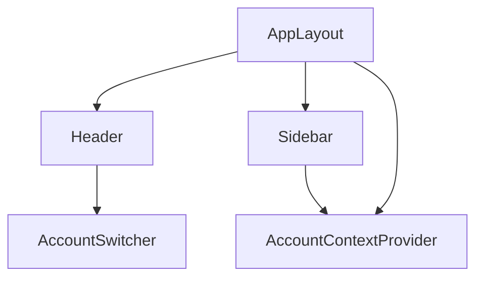
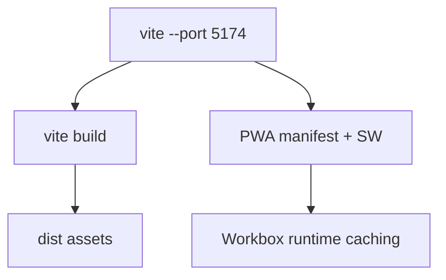
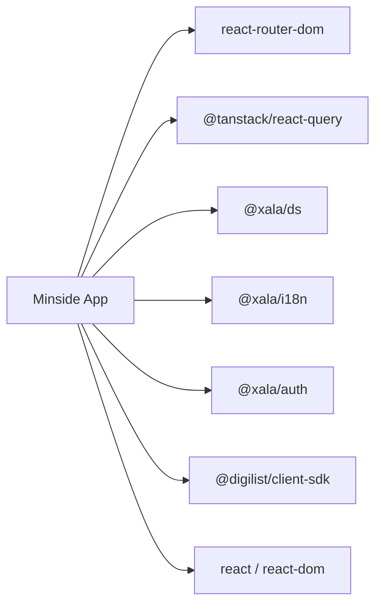

# Application Architecture

<cite>
**Referenced Files in This Document**
- [apps/minside/src/App.tsx](file://apps/minside/src/App.tsx)
- [apps/minside/src/main.tsx](file://apps/minside/src/main.tsx)
- [apps/minside/package.json](file://apps/minside/package.json)
- [apps/minside/vite.config.ts](file://apps/minside/vite.config.ts)
- [apps/minside/tsconfig.json](file://apps/minside/tsconfig.json)
- [apps/minside/src/providers/AccountContextProvider.tsx](file://apps/minside/src/providers/AccountContextProvider.tsx)
- [apps/minside/src/components/layout/AppLayout.tsx](file://apps/minside/src/components/layout/AppLayout.tsx)
- [apps/minside/src/components/layout/Header.tsx](file://apps/minside/src/components/layout/Header.tsx)
- [apps/minside/src/components/layout/Sidebar.tsx](file://apps/minside/src/components/layout/Sidebar.tsx)
- [apps/minside/src/components/AccountSwitcher.tsx](file://apps/minside/src/components/AccountSwitcher.tsx)
- [apps/minside/src/components/AccountSelectionModal.tsx](file://apps/minside/src/components/AccountSelectionModal.tsx)
- [apps/minside/public/manifest.json](file://apps/minside/public/manifest.json)
</cite>

## Table of Contents
1. [Introduction](#introduction)
2. [Project Structure](#project-structure)
3. [Core Components](#core-components)
4. [Architecture Overview](#architecture-overview)
5. [Detailed Component Analysis](#detailed-component-analysis)
6. [Dependency Analysis](#dependency-analysis)
7. [Performance Considerations](#performance-considerations)
8. [Troubleshooting Guide](#troubleshooting-guide)
9. [Conclusion](#conclusion)
10. [Appendices](#appendices)

## Introduction
This document describes the architecture of the Min Side (Minside) application, a React-based single-page application built with React Router v6. It explains the provider chain, routing model, protected routes, dual-context (personal and organization) support, authentication integration, OAuth callback handling, error boundary usage, dialog provider integration, and Progressive Web App (PWA) configuration. It also covers build configuration, development setup, and deployment-related artifacts.

## Project Structure
Min Side resides under apps/minside and follows a conventional React + Vite setup with TypeScript. Key areas:
- Entry point initializes React Query, SDK client, and renders the root App.
- App composes providers and defines routes with protected segments.
- Layout components implement responsive navigation and context-aware menus.
- Providers encapsulate cross-cutting concerns like theming, i18n, auth, account context, and real-time updates.
- PWA configuration and manifest are configured via Vite and public assets.

**Diagram sources**
- [apps/minside/src/main.tsx](file://apps/minside/src/main.tsx#L1-L40)
- [apps/minside/src/App.tsx](file://apps/minside/src/App.tsx#L103-L183)
- [apps/minside/src/providers/AccountContextProvider.tsx](file://apps/minside/src/providers/AccountContextProvider.tsx#L83-L319)
- [apps/minside/src/components/layout/AppLayout.tsx](file://apps/minside/src/components/layout/AppLayout.tsx#L116-L323)
- [apps/minside/src/components/layout/Header.tsx](file://apps/minside/src/components/layout/Header.tsx#L100-L383)
- [apps/minside/src/components/layout/Sidebar.tsx](file://apps/minside/src/components/layout/Sidebar.tsx#L318-L498)
- [apps/minside/src/components/AccountSwitcher.tsx](file://apps/minside/src/components/AccountSwitcher.tsx#L71-L414)
- [apps/minside/src/components/AccountSelectionModal.tsx](file://apps/minside/src/components/AccountSelectionModal.tsx#L70-L452)

**Section sources**
- [apps/minside/src/main.tsx](file://apps/minside/src/main.tsx#L1-L40)
- [apps/minside/src/App.tsx](file://apps/minside/src/App.tsx#L103-L183)
- [apps/minside/package.json](file://apps/minside/package.json#L1-L36)
- [apps/minside/vite.config.ts](file://apps/minside/vite.config.ts#L1-L116)
- [apps/minside/tsconfig.json](file://apps/minside/tsconfig.json#L1-L30)

## Core Components
- App shell and router: Compose providers, wrap routes with ProtectedRoute, and render AppLayout for authenticated users.
- Layout: Responsive shell with Header and Sidebar; mobile bottom navigation; context-aware notifications and alerts.
- Dual-context provider: Manages personal vs organization mode, persists selections, validates organization membership, and exposes helpers to switch contexts.
- Authentication and OAuth: Uses AuthProvider and a dedicated OAuth callback handler to process redirects.
- Real-time updates: RealtimeProvider wired to environment variables for WebSocket connectivity.
- Dialog and error boundaries: DialogProvider and ErrorBoundary wrap the app for consistent UX and resilience.
- PWA: VitePWA plugin generates service worker, caching strategies, and manifest.

**Section sources**
- [apps/minside/src/App.tsx](file://apps/minside/src/App.tsx#L103-L183)
- [apps/minside/src/providers/AccountContextProvider.tsx](file://apps/minside/src/providers/AccountContextProvider.tsx#L83-L319)
- [apps/minside/src/components/layout/AppLayout.tsx](file://apps/minside/src/components/layout/AppLayout.tsx#L116-L323)
- [apps/minside/src/components/layout/Header.tsx](file://apps/minside/src/components/layout/Header.tsx#L100-L383)
- [apps/minside/src/components/layout/Sidebar.tsx](file://apps/minside/src/components/layout/Sidebar.tsx#L318-L498)
- [apps/minside/src/components/AccountSwitcher.tsx](file://apps/minside/src/components/AccountSwitcher.tsx#L71-L414)
- [apps/minside/src/components/AccountSelectionModal.tsx](file://apps/minside/src/components/AccountSelectionModal.tsx#L70-L452)
- [apps/minside/vite.config.ts](file://apps/minside/vite.config.ts#L11-L116)

## Architecture Overview
The provider chain establishes a layered cross-cutting concern stack:
- ThemeProvider: Provides theme tokens and color scheme.
- I18nProvider: Supplies translations.
- DesignsystemetProvider: Applies design system theme and sizing.
- DialogProvider: Centralizes dialogs.
- ErrorBoundary: Wraps the app for graceful error handling.
- BrowserRouter: Enables client-side routing.
- OAuthCallbackHandler: Processes OAuth/BankID callbacks.
- NotificationCenterProvider: Manages notification center visibility.
- AuthProvider: Handles authentication state and session lifecycle.
- AccountContextProvider: Manages personal/organization context and persistence.
- AccountSelectionWrapper: Conditionally renders the AccountSelectionModal.
- RealtimeProvider: Connects to real-time backend.

**Diagram sources**
- [apps/minside/src/App.tsx](file://apps/minside/src/App.tsx#L111-L183)

**Section sources**
- [apps/minside/src/App.tsx](file://apps/minside/src/App.tsx#L103-L183)

## Detailed Component Analysis

### Routing and Protected Routes
- Root routes include a login page and a protected root that renders AppLayout.
- Personal context routes are guarded by ProtectedRoute with requiredContext set to personal.
- Shared routes (settings, preferences, notifications, privacy, help) are available in any context.
- Organization context routes are guarded by ProtectedRoute with requiredContext set to organization.
- A catch-all route navigates to the root.

**Diagram sources**
- [apps/minside/src/App.tsx](file://apps/minside/src/App.tsx#L134-L171)

**Section sources**
- [apps/minside/src/App.tsx](file://apps/minside/src/App.tsx#L134-L171)

### Provider Chain and Dual-Context Architecture
- AccountContextProvider manages:
  - Account type: personal or organization.
  - Selected organization and available organizations fetched from the SDK.
  - Persistence via localStorage keys for account type, selected org, selection state, and remember-choice.
  - Validation logic to force personal mode if no organizations or if remembered org is unavailable.
  - Helpers to switch contexts, mark selection, and clear lost organization messages.
- AppLayout integrates with AccountContextProvider to:
  - Show context redirect notifications when switching modes unintentionally.
  - Display a warning alert if organization membership was lost.
  - Adjust navigation and content based on current context.
- Header and Sidebar consume AccountContextProvider to:
  - Render context-aware navigation items.
  - Provide AccountSwitcher for seamless switching between personal and organization modes.

**Diagram sources**
- [apps/minside/src/providers/AccountContextProvider.tsx](file://apps/minside/src/providers/AccountContextProvider.tsx#L28-L319)
- [apps/minside/src/components/layout/AppLayout.tsx](file://apps/minside/src/components/layout/AppLayout.tsx#L116-L323)
- [apps/minside/src/components/layout/Header.tsx](file://apps/minside/src/components/layout/Header.tsx#L100-L383)
- [apps/minside/src/components/layout/Sidebar.tsx](file://apps/minside/src/components/layout/Sidebar.tsx#L318-L498)
- [apps/minside/src/components/AccountSwitcher.tsx](file://apps/minside/src/components/AccountSwitcher.tsx#L71-L414)

**Section sources**
- [apps/minside/src/providers/AccountContextProvider.tsx](file://apps/minside/src/providers/AccountContextProvider.tsx#L83-L319)
- [apps/minside/src/components/layout/AppLayout.tsx](file://apps/minside/src/components/layout/AppLayout.tsx#L116-L323)
- [apps/minside/src/components/layout/Sidebar.tsx](file://apps/minside/src/components/layout/Sidebar.tsx#L318-L498)
- [apps/minside/src/components/AccountSwitcher.tsx](file://apps/minside/src/components/AccountSwitcher.tsx#L71-L414)

### Authentication Integration and OAuth Callback Handling
- AuthProvider is configured with appType and debug flags.
- OAuthCallbackHandler invokes useOAuthCallback inside BrowserRouter to process redirects automatically.
- Logout is exposed via the Header component using the auth hook.

**Diagram sources**
- [apps/minside/src/App.tsx](file://apps/minside/src/App.tsx#L71-L74)
- [apps/minside/src/App.tsx](file://apps/minside/src/App.tsx#L127-L128)
- [apps/minside/src/components/layout/Header.tsx](file://apps/minside/src/components/layout/Header.tsx#L101-L104)

**Section sources**
- [apps/minside/src/App.tsx](file://apps/minside/src/App.tsx#L71-L74)
- [apps/minside/src/App.tsx](file://apps/minside/src/App.tsx#L127-L128)
- [apps/minside/src/components/layout/Header.tsx](file://apps/minside/src/components/layout/Header.tsx#L101-L104)

### Layout Components: AppLayout, Header, and Sidebar
- AppLayout:
  - Mobile-first responsive layout with desktop sidebar and mobile bottom navigation.
  - Integrates Header and Sidebar; manages context redirect notifications and lost organization alerts.
- Header:
  - Provides theme toggle, notification bell, settings link, and user menu with logout.
  - Uses notification unread count from the SDK.
- Sidebar:
  - Context-aware navigation items; filters items based on current account type.
  - Supports mobile drawer and desktop sidebar.

**Diagram sources**
- [apps/minside/src/components/layout/AppLayout.tsx](file://apps/minside/src/components/layout/AppLayout.tsx#L116-L323)
- [apps/minside/src/components/layout/Header.tsx](file://apps/minside/src/components/layout/Header.tsx#L100-L383)
- [apps/minside/src/components/layout/Sidebar.tsx](file://apps/minside/src/components/layout/Sidebar.tsx#L318-L498)
- [apps/minside/src/components/AccountSwitcher.tsx](file://apps/minside/src/components/AccountSwitcher.tsx#L71-L414)
- [apps/minside/src/providers/AccountContextProvider.tsx](file://apps/minside/src/providers/AccountContextProvider.tsx#L83-L319)

**Section sources**
- [apps/minside/src/components/layout/AppLayout.tsx](file://apps/minside/src/components/layout/AppLayout.tsx#L116-L323)
- [apps/minside/src/components/layout/Header.tsx](file://apps/minside/src/components/layout/Header.tsx#L100-L383)
- [apps/minside/src/components/layout/Sidebar.tsx](file://apps/minside/src/components/layout/Sidebar.tsx#L318-L498)
- [apps/minside/src/components/AccountSwitcher.tsx](file://apps/minside/src/components/AccountSwitcher.tsx#L71-L414)

### Dialog Provider and Error Boundary Integration
- DialogProvider wraps the app to centralize dialog rendering.
- ErrorBoundary wraps the app to gracefully handle errors and present recoverable states.

**Section sources**
- [apps/minside/src/App.tsx](file://apps/minside/src/App.tsx#L117-L118)

### Build Configuration, Development Setup, and PWA
- Vite configuration:
  - Loads environment variables from the monorepo root.
  - React plugin and PWA plugin with auto-update registration.
  - Manifest configuration and Workbox runtime caching for fonts, API, and bookings.
  - Aliases for client SDK modules and optimized dependency settings.
- TypeScript configuration extends the repo base tsconfig with strictness and JSX transform.
- Package scripts include dev, build, lint, and preview.
- PWA manifest is served from public assets.

**Diagram sources**
- [apps/minside/vite.config.ts](file://apps/minside/vite.config.ts#L6-L116)
- [apps/minside/package.json](file://apps/minside/package.json#L6-L11)
- [apps/minside/public/manifest.json](file://apps/minside/public/manifest.json#L1-L24)

**Section sources**
- [apps/minside/vite.config.ts](file://apps/minside/vite.config.ts#L1-L116)
- [apps/minside/tsconfig.json](file://apps/minside/tsconfig.json#L1-L30)
- [apps/minside/package.json](file://apps/minside/package.json#L1-L36)
- [apps/minside/public/manifest.json](file://apps/minside/public/manifest.json#L1-L24)

## Dependency Analysis
- Runtime dependencies include React, React Router DOM, TanStack React Query, Xala design system and i18n packages, Xala auth, and Digilist client SDK.
- Dev dependencies include Vite, React plugin, ESLint config, TypeScript, and PWA plugin.
- The app initializes the SDK client with environment variables and sets default headers for user-specific endpoints.

**Diagram sources**
- [apps/minside/package.json](file://apps/minside/package.json#L12-L25)

**Section sources**
- [apps/minside/package.json](file://apps/minside/package.json#L12-L25)
- [apps/minside/src/main.tsx](file://apps/minside/src/main.tsx#L14-L22)

## Performance Considerations
- React Query defaults:
  - Stale time of 5 minutes for queries.
  - Retry attempts set to 1.
- PWA caching:
  - Fonts cached with long TTLs.
  - API endpoints cached with NetworkFirst strategy and timeouts.
  - Bookings endpoint cached for offline viewing with a day-long TTL.
- Recommendations:
  - Tune staleTime and retry based on data volatility.
  - Monitor cache sizes and adjust expiration windows.
  - Consider background sync for real-time updates via RealtimeProvider.

[No sources needed since this section provides general guidance]

## Troubleshooting Guide
- OAuth/BankID redirects:
  - Ensure OAuthCallbackHandler is rendered inside BrowserRouter.
  - Verify appType and debug flags in AuthProvider configuration.
- Authentication state:
  - Use auth hooks to check user presence and trigger logout.
- Context switching:
  - Confirm AccountContextProvider is mounted above components that depend on it.
  - Check localStorage keys for persisted choices and organization availability.
- Real-time updates:
  - Validate wsUrl and tenantId environment variables for RealtimeProvider.
- PWA:
  - Inspect service worker registration and cache entries.
  - Review Workbox runtime caching configuration.

**Section sources**
- [apps/minside/src/App.tsx](file://apps/minside/src/App.tsx#L71-L74)
- [apps/minside/src/App.tsx](file://apps/minside/src/App.tsx#L127-L133)
- [apps/minside/src/providers/AccountContextProvider.tsx](file://apps/minside/src/providers/AccountContextProvider.tsx#L66-L71)
- [apps/minside/vite.config.ts](file://apps/minside/vite.config.ts#L33-L95)

## Conclusion
Min Side employs a clean provider chain, robust routing with protected routes, and a dual-context architecture to serve both personal and organization dashboards. Authentication is integrated with automatic OAuth callback handling, while the design system and PWA tooling deliver a modern, responsive, and offline-capable experience. The architecture balances maintainability and scalability, with clear separation of concerns across providers, layout components, and routing.

## Appendices
- Environment variables consumed by the app:
  - VITE_API_URL, VITE_TENANT_ID, VITE_LICENSE_KEY, VITE_WS_URL.
- SDK initialization:
  - Default headers include X-User-Id for user-specific endpoints.

**Section sources**
- [apps/minside/src/main.tsx](file://apps/minside/src/main.tsx#L14-L22)
- [apps/minside/src/App.tsx](file://apps/minside/src/App.tsx#L130-L133)