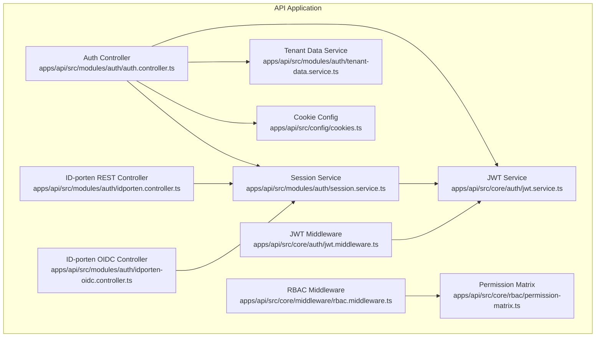
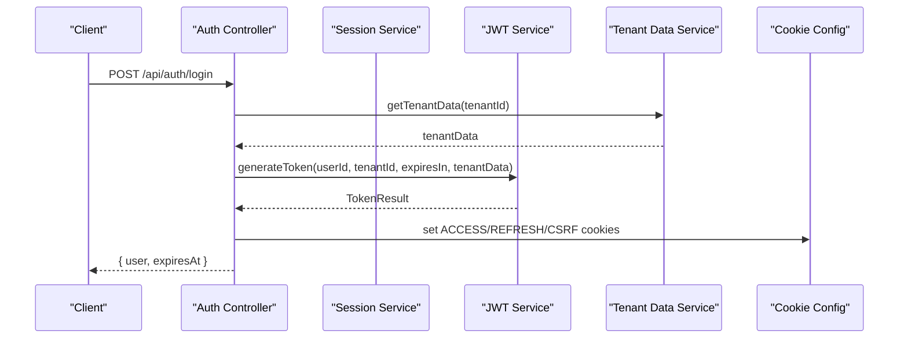
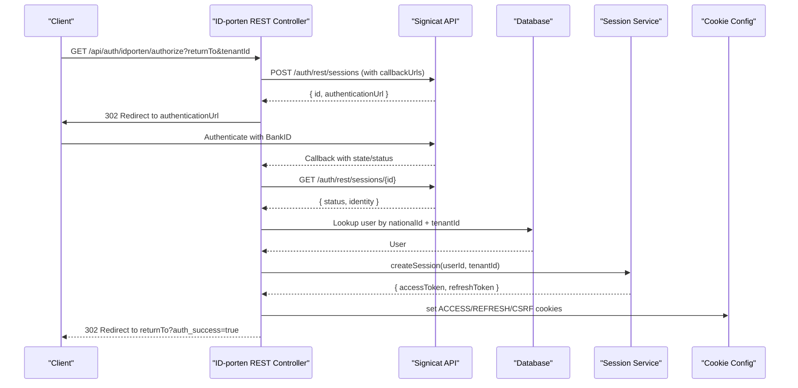
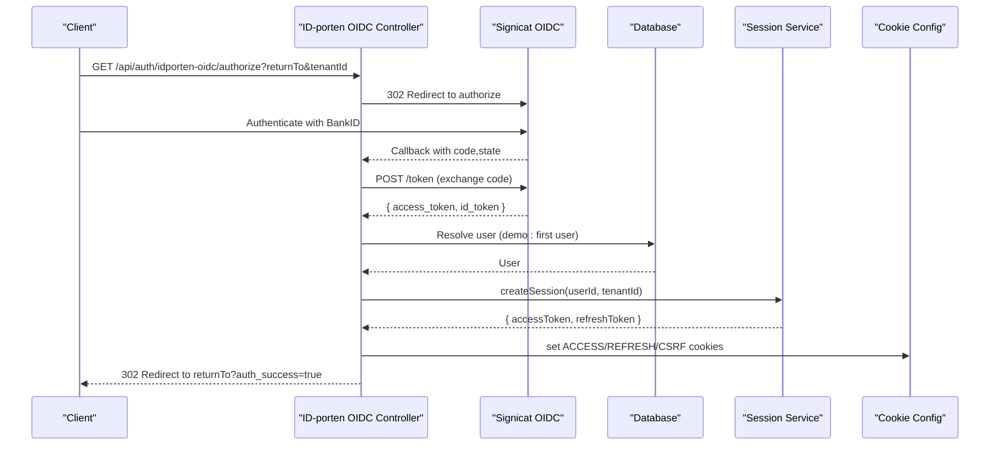
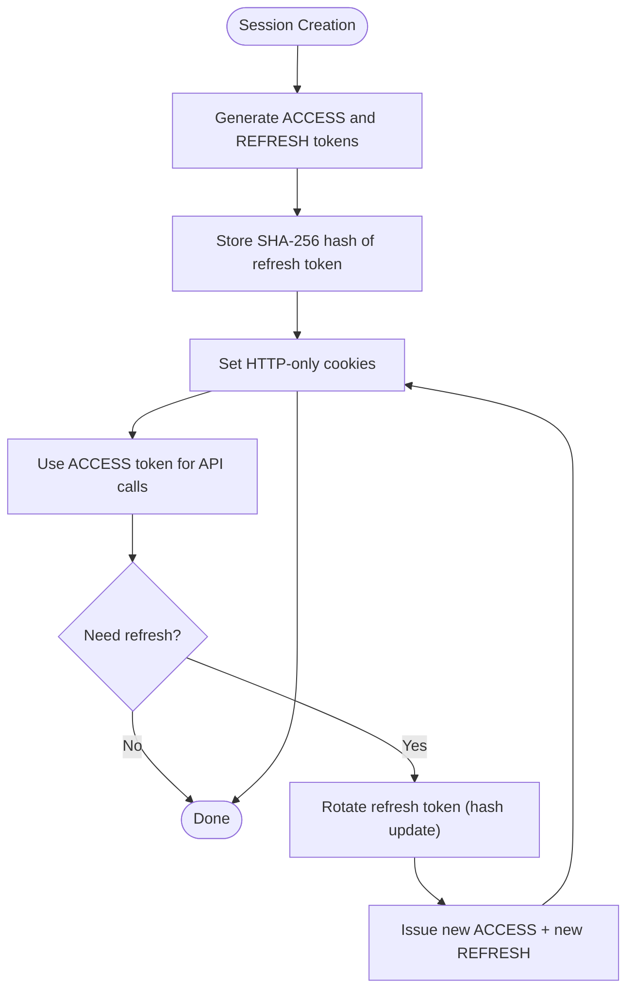
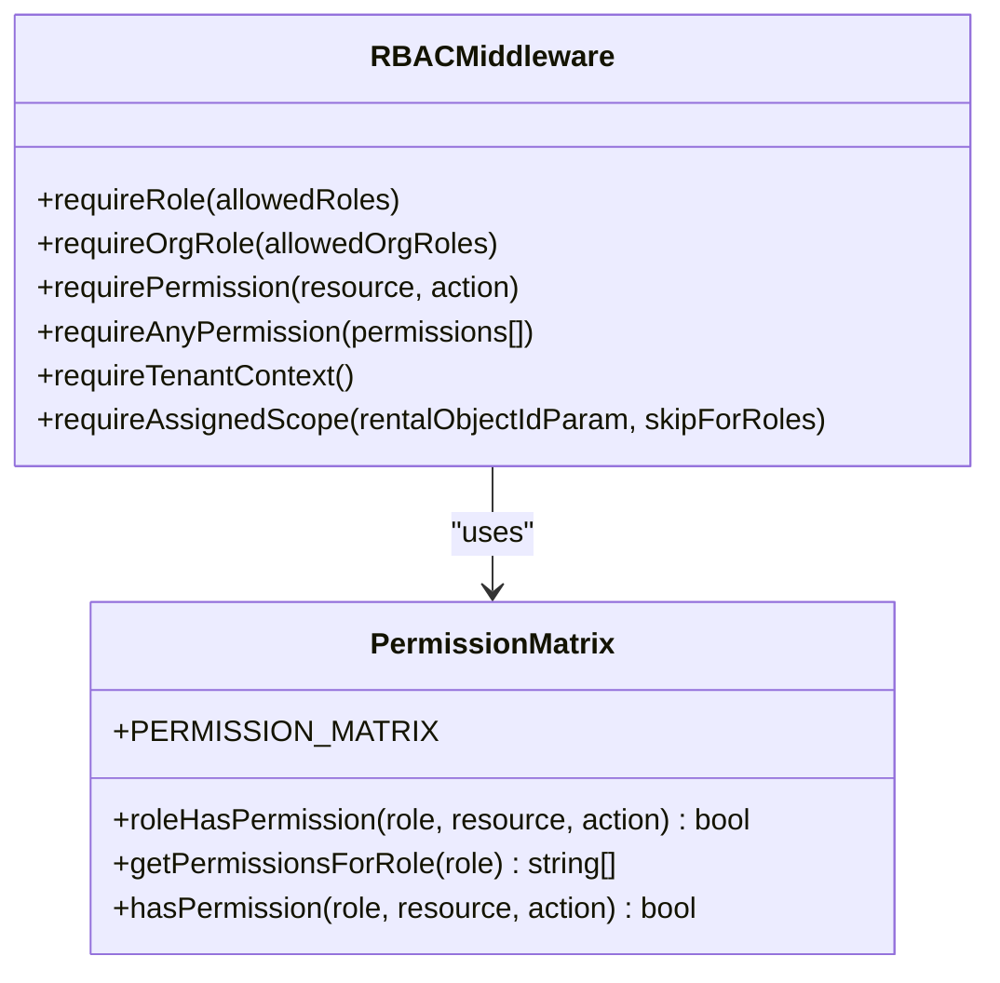
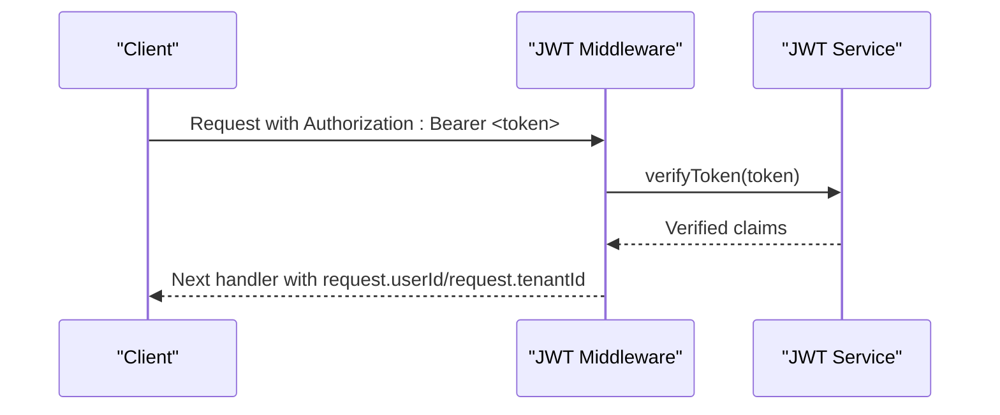
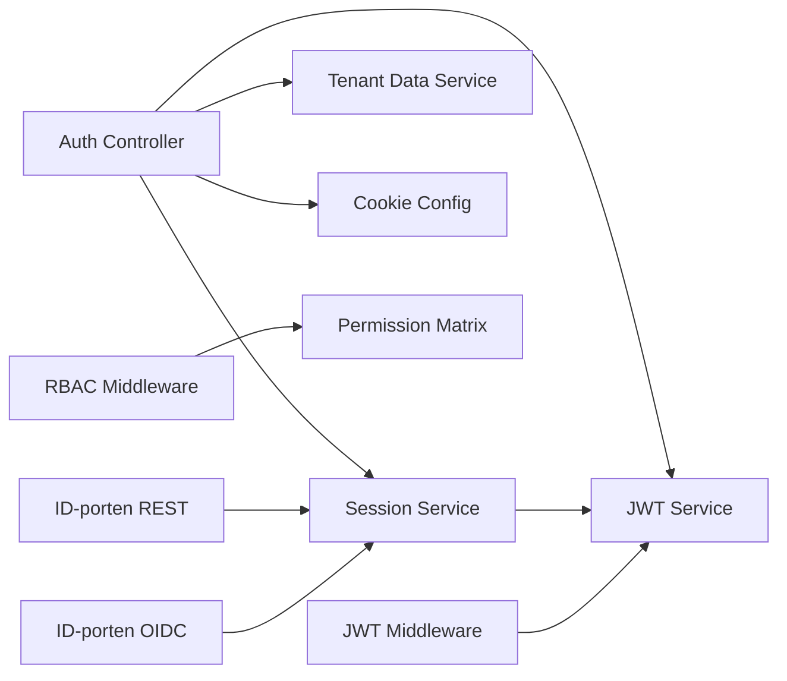

# Authentication & Security

<cite>
**Referenced Files in This Document**
- [apps/api/src/core/auth/jwt.service.ts](file://apps/api/src/core/auth/jwt.service.ts)
- [apps/api/src/core/auth/jwt.middleware.ts](file://apps/api/src/core/auth/jwt.middleware.ts)
- [apps/api/src/modules/auth/auth.controller.ts](file://apps/api/src/modules/auth/auth.controller.ts)
- [apps/api/src/modules/auth/idporten.controller.ts](file://apps/api/src/modules/auth/idporten.controller.ts)
- [apps/api/src/modules/auth/idporten-oidc.controller.ts](file://apps/api/src/modules/auth/idporten-oidc.controller.ts)
- [apps/api/src/modules/auth/session.service.ts](file://apps/api/src/modules/auth/session.service.ts)
- [apps/api/src/modules/auth/tenant-data.service.ts](file://apps/api/src/modules/auth/tenant-data.service.ts)
- [apps/api/src/config/cookies.ts](file://apps/api/src/config/cookies.ts)
- [apps/api/src/core/middleware/rbac.middleware.ts](file://apps/api/src/core/middleware/rbac.middleware.ts)
- [apps/api/src/core/rbac/permission-matrix.ts](file://apps/api/src/core/rbac/permission-matrix.ts)
- [apps/api/src/middleware/rbac.ts](file://apps/api/src/middleware/rbac.ts)
</cite>

## Table of Contents
1. [Introduction](#introduction)
2. [Project Structure](#project-structure)
3. [Core Components](#core-components)
4. [Architecture Overview](#architecture-overview)
5. [Detailed Component Analysis](#detailed-component-analysis)
6. [Dependency Analysis](#dependency-analysis)
7. [Performance Considerations](#performance-considerations)
8. [Troubleshooting Guide](#troubleshooting-guide)
9. [Conclusion](#conclusion)

## Introduction
This document describes the authentication and security system for the Min Side application within the Xala-Digdir monorepo. It covers OAuth-based authentication flows, ID-porten integration, BankID support, session and token management, RBAC implementation, tenant isolation, and security headers. It also documents the demo login functionality, authentication testing, and best practices for protecting routes and handling unauthorized access.

## Project Structure
The authentication and security logic is primarily implemented in the API application under the modules and core directories:
- JWT token generation and verification
- OAuth callbacks and session management
- ID-porten REST and OIDC controllers
- RBAC middleware and permission matrices
- Cookie configuration for secure HTTP-only cookies

**Diagram sources**
- [apps/api/src/core/auth/jwt.service.ts](file://apps/api/src/core/auth/jwt.service.ts#L45-L259)
- [apps/api/src/core/auth/jwt.middleware.ts](file://apps/api/src/core/auth/jwt.middleware.ts#L14-L53)
- [apps/api/src/modules/auth/auth.controller.ts](file://apps/api/src/modules/auth/auth.controller.ts#L24-L703)
- [apps/api/src/modules/auth/session.service.ts](file://apps/api/src/modules/auth/session.service.ts#L56-L323)
- [apps/api/src/modules/auth/tenant-data.service.ts](file://apps/api/src/modules/auth/tenant-data.service.ts#L16-L88)
- [apps/api/src/modules/auth/idporten.controller.ts](file://apps/api/src/modules/auth/idporten.controller.ts#L196-L789)
- [apps/api/src/modules/auth/idporten-oidc.controller.ts](file://apps/api/src/modules/auth/idporten-oidc.controller.ts#L53-L343)
- [apps/api/src/core/middleware/rbac.middleware.ts](file://apps/api/src/core/middleware/rbac.middleware.ts#L108-L398)
- [apps/api/src/core/rbac/permission-matrix.ts](file://apps/api/src/core/rbac/permission-matrix.ts#L45-L262)
- [apps/api/src/config/cookies.ts](file://apps/api/src/config/cookies.ts#L12-L152)

**Section sources**
- [apps/api/src/core/auth/jwt.service.ts](file://apps/api/src/core/auth/jwt.service.ts#L1-L259)
- [apps/api/src/core/auth/jwt.middleware.ts](file://apps/api/src/core/auth/jwt.middleware.ts#L1-L54)
- [apps/api/src/modules/auth/auth.controller.ts](file://apps/api/src/modules/auth/auth.controller.ts#L1-L743)
- [apps/api/src/modules/auth/session.service.ts](file://apps/api/src/modules/auth/session.service.ts#L1-L323)
- [apps/api/src/modules/auth/tenant-data.service.ts](file://apps/api/src/modules/auth/tenant-data.service.ts#L1-L88)
- [apps/api/src/modules/auth/idporten.controller.ts](file://apps/api/src/modules/auth/idporten.controller.ts#L1-L789)
- [apps/api/src/modules/auth/idporten-oidc.controller.ts](file://apps/api/src/modules/auth/idporten-oidc.controller.ts#L1-L343)
- [apps/api/src/core/middleware/rbac.middleware.ts](file://apps/api/src/core/middleware/rbac.middleware.ts#L1-L398)
- [apps/api/src/core/rbac/permission-matrix.ts](file://apps/api/src/core/rbac/permission-matrix.ts#L1-L262)
- [apps/api/src/config/cookies.ts](file://apps/api/src/config/cookies.ts#L1-L152)

## Core Components
- JWT Service: Generates and verifies signed tokens with issuer/audience constraints, validates UUID tenant IDs, and supports token decoding and refresh.
- JWT Middleware: Extracts Bearer tokens from Authorization headers, verifies them, and attaches user/tenant claims to the request.
- Auth Controller: Provides login, OAuth callback, session retrieval, logout, refresh, demo token, and national ID login endpoints. Uses HTTP-only cookies for tokens and CSRF protection.
- Session Service: Creates sessions with access/refresh tokens, implements refresh token rotation, and supports session revocation and cleanup.
- Tenant Data Service: Loads tenant subscription and feature flags for inclusion in JWT payloads.
- ID-porten Controllers: REST and OIDC implementations for Norwegian eID integration via Signicat/BankID.
- RBAC Middleware and Permission Matrix: Enforce role-based access control across system, tenant, commune, and organization scopes.
- Cookie Configuration: Defines secure, HTTP-only cookie policies for access, refresh, and CSRF tokens.

**Section sources**
- [apps/api/src/core/auth/jwt.service.ts](file://apps/api/src/core/auth/jwt.service.ts#L45-L259)
- [apps/api/src/core/auth/jwt.middleware.ts](file://apps/api/src/core/auth/jwt.middleware.ts#L14-L53)
- [apps/api/src/modules/auth/auth.controller.ts](file://apps/api/src/modules/auth/auth.controller.ts#L24-L703)
- [apps/api/src/modules/auth/session.service.ts](file://apps/api/src/modules/auth/session.service.ts#L56-L323)
- [apps/api/src/modules/auth/tenant-data.service.ts](file://apps/api/src/modules/auth/tenant-data.service.ts#L16-L88)
- [apps/api/src/modules/auth/idporten.controller.ts](file://apps/api/src/modules/auth/idporten.controller.ts#L196-L789)
- [apps/api/src/modules/auth/idporten-oidc.controller.ts](file://apps/api/src/modules/auth/idporten-oidc.controller.ts#L53-L343)
- [apps/api/src/core/middleware/rbac.middleware.ts](file://apps/api/src/core/middleware/rbac.middleware.ts#L108-L398)
- [apps/api/src/core/rbac/permission-matrix.ts](file://apps/api/src/core/rbac/permission-matrix.ts#L45-L262)
- [apps/api/src/config/cookies.ts](file://apps/api/src/config/cookies.ts#L12-L152)

## Architecture Overview
The authentication system centers around:
- Stateless JWT tokens for session identity with short-lived access tokens and long-lived rotated refresh tokens.
- HTTP-only cookies for secure token storage and SameSite=Lax CSRF protection.
- ID-porten REST/OIDC flows for Norwegian eID (BankID) with tenant-aware session creation and return-to validation.
- RBAC enforcement via middleware and permission matrices for granular access control.
- Tenant data injection into tokens for subscription and feature flag validation.

**Diagram sources**
- [apps/api/src/modules/auth/auth.controller.ts](file://apps/api/src/modules/auth/auth.controller.ts#L30-L102)
- [apps/api/src/modules/auth/session.service.ts](file://apps/api/src/modules/auth/session.service.ts#L87-L131)
- [apps/api/src/core/auth/jwt.service.ts](file://apps/api/src/core/auth/jwt.service.ts#L66-L103)
- [apps/api/src/modules/auth/tenant-data.service.ts](file://apps/api/src/modules/auth/tenant-data.service.ts#L22-L63)
- [apps/api/src/config/cookies.ts](file://apps/api/src/config/cookies.ts#L41-L77)

## Detailed Component Analysis

### OAuth Authentication Flow (ID-porten REST)
The ID-porten REST controller implements a two-stage authentication:
- Authorize: Creates a session with Signicat, stores state/returnTo, and redirects the user to the eID provider.
- Callback: Validates state, fetches session status, extracts national ID, resolves user, creates session, sets cookies, and redirects back with success markers.

**Diagram sources**
- [apps/api/src/modules/auth/idporten.controller.ts](file://apps/api/src/modules/auth/idporten.controller.ts#L206-L336)
- [apps/api/src/modules/auth/idporten.controller.ts](file://apps/api/src/modules/auth/idporten.controller.ts#L346-L735)
- [apps/api/src/modules/auth/session.service.ts](file://apps/api/src/modules/auth/session.service.ts#L87-L131)
- [apps/api/src/config/cookies.ts](file://apps/api/src/config/cookies.ts#L41-L77)

**Section sources**
- [apps/api/src/modules/auth/idporten.controller.ts](file://apps/api/src/modules/auth/idporten.controller.ts#L196-L789)

### OAuth Authentication Flow (ID-porten OIDC)
The ID-porten OIDC controller follows the standard OAuth2/OIDC flow:
- Authorize: Builds authorization URL with state/nonce and redirects to Signicat.
- Callback: Exchanges code for tokens, decodes/validates ID token, resolves user, creates session, sets cookies, and redirects with success markers.

**Diagram sources**
- [apps/api/src/modules/auth/idporten-oidc.controller.ts](file://apps/api/src/modules/auth/idporten-oidc.controller.ts#L59-L113)
- [apps/api/src/modules/auth/idporten-oidc.controller.ts](file://apps/api/src/modules/auth/idporten-oidc.controller.ts#L119-L290)
- [apps/api/src/modules/auth/session.service.ts](file://apps/api/src/modules/auth/session.service.ts#L87-L131)
- [apps/api/src/config/cookies.ts](file://apps/api/src/config/cookies.ts#L41-L77)

**Section sources**
- [apps/api/src/modules/auth/idporten-oidc.controller.ts](file://apps/api/src/modules/auth/idporten-oidc.controller.ts#L53-L343)

### Session Management and Token Handling
- Access tokens are short-lived (15 minutes) and stored in HTTP-only cookies.
- Refresh tokens are long-lived (7 days), hashed in the database, and rotated on each refresh.
- CSRF tokens are set as HTTP-only cookies for double-submit protection.
- Logout revokes sessions and clears cookies.

**Diagram sources**
- [apps/api/src/modules/auth/session.service.ts](file://apps/api/src/modules/auth/session.service.ts#L87-L198)
- [apps/api/src/config/cookies.ts](file://apps/api/src/config/cookies.ts#L41-L77)

**Section sources**
- [apps/api/src/modules/auth/session.service.ts](file://apps/api/src/modules/auth/session.service.ts#L56-L323)
- [apps/api/src/config/cookies.ts](file://apps/api/src/config/cookies.ts#L12-L152)

### RBAC Implementation and Permission Management
- System-level roles (super_admin, admin, saksbehandler, user) and organization-level roles (COMMUNE_ADMIN, ORG_ADMIN, etc.) are defined.
- Permission matrix maps roles to resource:action permissions.
- RBAC middleware enforces:
  - requireRole: one of system roles
  - requireOrgRole: organization-level roles with membership lookup
  - requirePermission: single permission check
  - requireAnyPermission: any of multiple permissions
  - requireTenantContext: ensures tenant context
  - requireAssignedScope: scope checks for case handlers

**Diagram sources**
- [apps/api/src/core/middleware/rbac.middleware.ts](file://apps/api/src/core/middleware/rbac.middleware.ts#L108-L398)
- [apps/api/src/core/rbac/permission-matrix.ts](file://apps/api/src/core/rbac/permission-matrix.ts#L45-L262)

**Section sources**
- [apps/api/src/core/middleware/rbac.middleware.ts](file://apps/api/src/core/middleware/rbac.middleware.ts#L1-L398)
- [apps/api/src/core/rbac/permission-matrix.ts](file://apps/api/src/core/rbac/permission-matrix.ts#L1-L262)

### JWT Service and Middleware
- JWT Service signs tokens with HS256, issuer, and audience constraints; validates UUID tenant IDs and optional subscription data.
- JWT Middleware extracts Bearer tokens, verifies them, and attaches userId/tenantId to requests.

**Diagram sources**
- [apps/api/src/core/auth/jwt.middleware.ts](file://apps/api/src/core/auth/jwt.middleware.ts#L17-L52)
- [apps/api/src/core/auth/jwt.service.ts](file://apps/api/src/core/auth/jwt.service.ts#L112-L158)

**Section sources**
- [apps/api/src/core/auth/jwt.service.ts](file://apps/api/src/core/auth/jwt.service.ts#L45-L259)
- [apps/api/src/core/auth/jwt.middleware.ts](file://apps/api/src/core/auth/jwt.middleware.ts#L1-L54)

### Demo Login Functionality
- Demo token login: Authenticates via a demo token stored in the database and issues session cookies.
- National ID login: Authenticates using a Norwegian national ID and issues session cookies.
- Email login: Alias to password-based login for demo environments.

**Section sources**
- [apps/api/src/modules/auth/auth.controller.ts](file://apps/api/src/modules/auth/auth.controller.ts#L459-L561)
- [apps/api/src/modules/auth/auth.controller.ts](file://apps/api/src/modules/auth/auth.controller.ts#L582-L685)
- [apps/api/src/modules/auth/auth.controller.ts](file://apps/api/src/modules/auth/auth.controller.ts#L566-L575)

### Authentication Guards and Protected Routes
- JWT middleware protects routes by verifying tokens and attaching user context.
- RBAC middleware protects routes by enforcing role and permission constraints.
- Example usage patterns:
  - requireRole for system roles
  - requireOrgRole for organization-level roles
  - requirePermission for fine-grained controls
  - requireAnyPermission for alternative permission sets
  - requireTenantContext for tenant scoping
  - requireAssignedScope for per-rental-object scope checks

**Section sources**
- [apps/api/src/core/auth/jwt.middleware.ts](file://apps/api/src/core/auth/jwt.middleware.ts#L1-L54)
- [apps/api/src/core/middleware/rbac.middleware.ts](file://apps/api/src/core/middleware/rbac.middleware.ts#L108-L398)

### Multi-Tenant Authentication and Tenant Isolation
- Tenant context is derived from request headers or session claims.
- ID-porten flows accept tenantId via query/header and enforce tenant-aware user lookup.
- Tenant data service injects subscription and feature flags into tokens for validation.

**Section sources**
- [apps/api/src/modules/auth/idporten.controller.ts](file://apps/api/src/modules/auth/idporten.controller.ts#L211-L211)
- [apps/api/src/modules/auth/tenant-data.service.ts](file://apps/api/src/modules/auth/tenant-data.service.ts#L22-L63)
- [apps/api/src/core/auth/jwt.service.ts](file://apps/api/src/core/auth/jwt.service.ts#L135-L143)

### Security Headers and Best Practices
- HTTP-only cookies for ACCESS/REFRESH/CSRF to mitigate XSS.
- Secure flag enabled in production; SameSite=Lax for cross-app SSO compatibility.
- Access tokens short-lived (15 minutes); refresh tokens rotated.
- Return-to URL validation to prevent open redirect vulnerabilities.
- Audit logging for auth events (initiation, success, failure, refresh, logout).

**Section sources**
- [apps/api/src/config/cookies.ts](file://apps/api/src/config/cookies.ts#L41-L77)
- [apps/api/src/modules/auth/auth.controller.ts](file://apps/api/src/modules/auth/auth.controller.ts#L32-L35)
- [apps/api/src/modules/auth/idporten.controller.ts](file://apps/api/src/modules/auth/idporten.controller.ts#L214-L237)

## Dependency Analysis
Key dependencies and relationships:
- Auth Controller depends on Session Service, Tenant Data Service, JWT Service, and Cookie Config.
- Session Service depends on JWT Service and database schema for session records.
- ID-porten controllers depend on Session Service and Tenant Data Service.
- RBAC Middleware depends on Permission Matrix and database for user/org membership.
- JWT Middleware depends on JWT Service.

**Diagram sources**
- [apps/api/src/modules/auth/auth.controller.ts](file://apps/api/src/modules/auth/auth.controller.ts#L30-L102)
- [apps/api/src/modules/auth/session.service.ts](file://apps/api/src/modules/auth/session.service.ts#L87-L131)
- [apps/api/src/modules/auth/tenant-data.service.ts](file://apps/api/src/modules/auth/tenant-data.service.ts#L22-L63)
- [apps/api/src/modules/auth/idporten.controller.ts](file://apps/api/src/modules/auth/idporten.controller.ts#L206-L336)
- [apps/api/src/modules/auth/idporten-oidc.controller.ts](file://apps/api/src/modules/auth/idporten-oidc.controller.ts#L59-L113)
- [apps/api/src/core/middleware/rbac.middleware.ts](file://apps/api/src/core/middleware/rbac.middleware.ts#L108-L398)
- [apps/api/src/core/rbac/permission-matrix.ts](file://apps/api/src/core/rbac/permission-matrix.ts#L45-L262)
- [apps/api/src/core/auth/jwt.middleware.ts](file://apps/api/src/core/auth/jwt.middleware.ts#L17-L52)

**Section sources**
- [apps/api/src/modules/auth/auth.controller.ts](file://apps/api/src/modules/auth/auth.controller.ts#L1-L743)
- [apps/api/src/modules/auth/session.service.ts](file://apps/api/src/modules/auth/session.service.ts#L1-L323)
- [apps/api/src/modules/auth/tenant-data.service.ts](file://apps/api/src/modules/auth/tenant-data.service.ts#L1-L88)
- [apps/api/src/modules/auth/idporten.controller.ts](file://apps/api/src/modules/auth/idporten.controller.ts#L1-L789)
- [apps/api/src/modules/auth/idporten-oidc.controller.ts](file://apps/api/src/modules/auth/idporten-oidc.controller.ts#L1-L343)
- [apps/api/src/core/middleware/rbac.middleware.ts](file://apps/api/src/core/middleware/rbac.middleware.ts#L1-L398)
- [apps/api/src/core/rbac/permission-matrix.ts](file://apps/api/src/core/rbac/permission-matrix.ts#L1-L262)
- [apps/api/src/core/auth/jwt.middleware.ts](file://apps/api/src/core/auth/jwt.middleware.ts#L1-L54)

## Performance Considerations
- Short-lived access tokens reduce risk and require frequent refresh; ensure clients implement efficient refresh strategies.
- Refresh token rotation adds minimal overhead while improving security.
- Database queries for user/session lookups should be indexed on userId, tenantId, and refresh token hash.
- Audit logging should be asynchronous to minimize latency.

## Troubleshooting Guide
Common issues and resolutions:
- Missing or invalid Authorization header: Ensure Bearer token is present and formatted correctly.
- Expired tokens: Trigger refresh flow using refresh cookie; if unavailable, re-authenticate.
- Invalid token signature or malformed claims: Verify issuer/audience and token structure.
- Session not found or expired: Validate state parameter and session storage.
- Return-to validation failures: Confirm returnTo is sanitized and allowed; fallback to default redirect.
- Logout not clearing cookies: Verify cookie path/domain and clear options.

**Section sources**
- [apps/api/src/core/auth/jwt.middleware.ts](file://apps/api/src/core/auth/jwt.middleware.ts#L22-L51)
- [apps/api/src/modules/auth/auth.controller.ts](file://apps/api/src/modules/auth/auth.controller.ts#L387-L442)
- [apps/api/src/modules/auth/idporten.controller.ts](file://apps/api/src/modules/auth/idporten.controller.ts#L214-L237)

## Conclusion
The Min Side authentication and security system integrates robust JWT-based session management, secure HTTP-only cookies, and comprehensive RBAC enforcement. ID-porten REST and OIDC flows enable Norwegian eID (BankID) authentication with tenant-aware user resolution and strict return-to validation. The system emphasizes security through short-lived access tokens, refresh token rotation, CSRF protection, and detailed audit logging, while supporting multi-tenant isolation and scalable permission management.