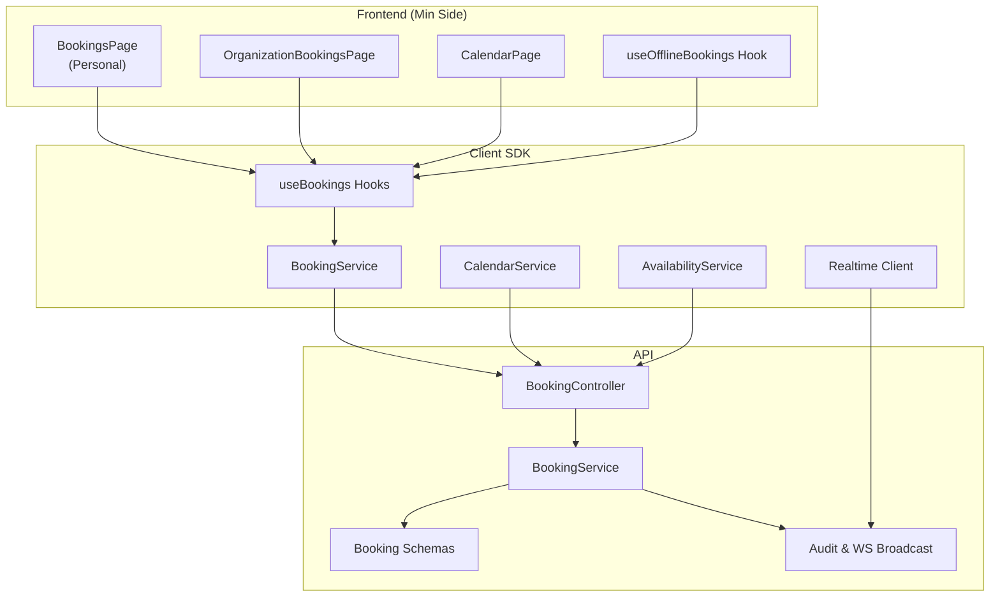
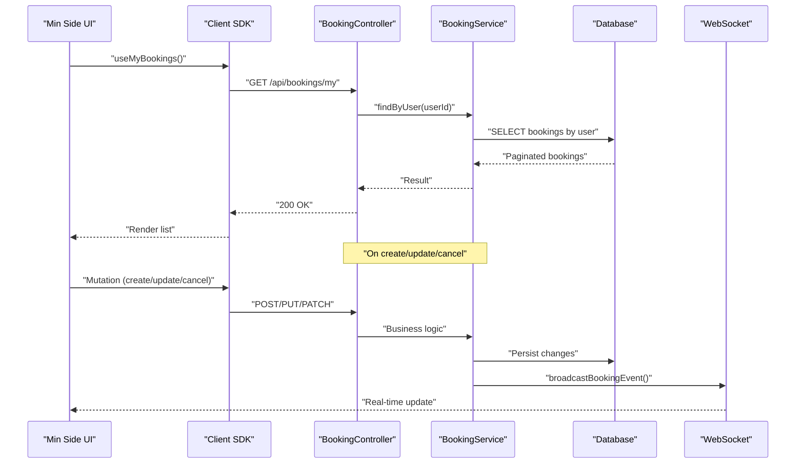
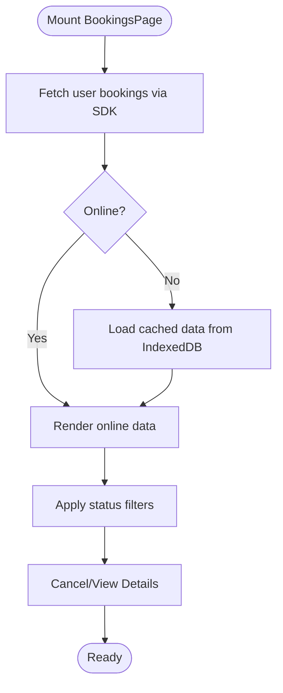
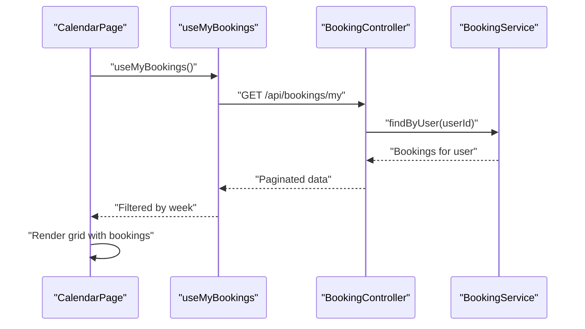
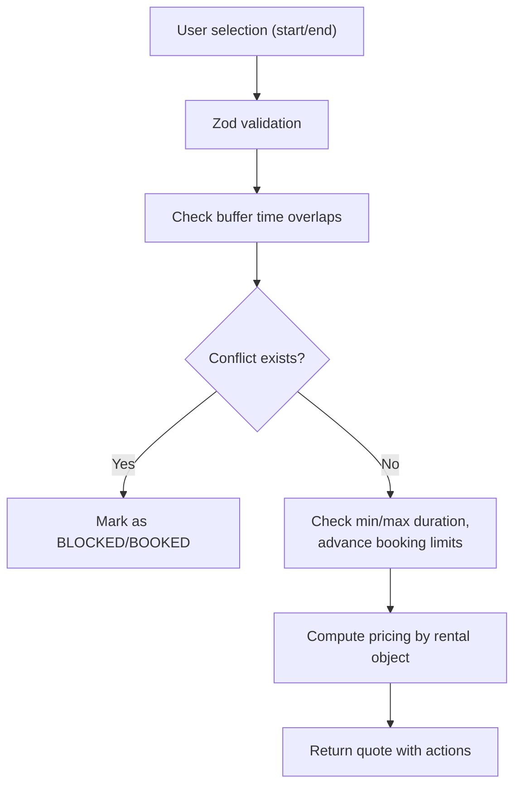
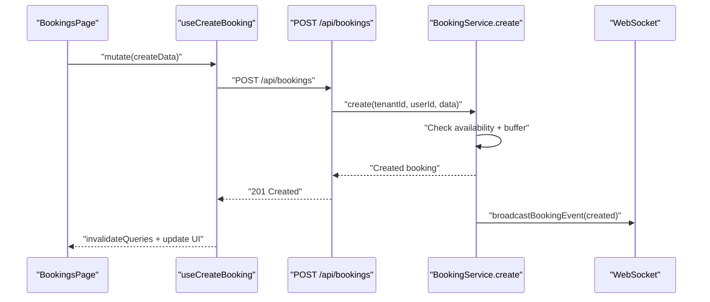
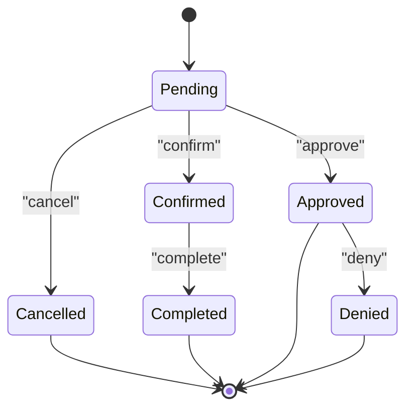
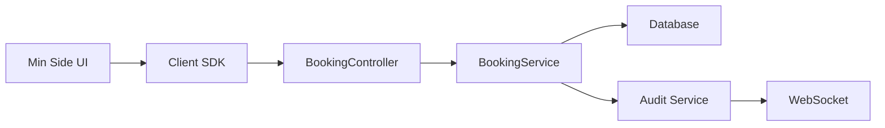

# Booking Management

<cite>
**Referenced Files in This Document**
- [apps/minside/src/routes/bookings.tsx](file://apps/minside/src/routes/bookings.tsx)
- [apps/minside/src/routes/org/bookings.tsx](file://apps/minside/src/routes/org/bookings.tsx)
- [apps/minside/src/routes/calendar.tsx](file://apps/minside/src/routes/calendar.tsx)
- [apps/minside/src/hooks/useOfflineBookings.ts](file://apps/minside/src/hooks/useOfflineBookings.ts)
- [packages/client-sdk/src/hooks/use-bookings.ts](file://packages/client-sdk/src/hooks/use-bookings.ts)
- [packages/client-sdk/src/services/booking.service.ts](file://packages/client-sdk/src/services/booking.service.ts)
- [apps/api/src/modules/booking/booking.controller.ts](file://apps/api/src/modules/booking/booking.controller.ts)
- [apps/api/src/modules/booking/booking.service.ts](file://apps/api/src/modules/booking/booking.service.ts)
- [apps/api/src/schemas/booking.schema.ts](file://apps/api/src/schemas/booking.schema.ts)
- [apps/api/src/core/audit/audit.service.ts](file://apps/api/src/core/audit/audit.service.ts)
- [packages/client-sdk/src/realtime/index.ts](file://packages/client-sdk/src/realtime/index.ts)
</cite>

## Table of Contents
1. [Introduction](#introduction)
2. [Project Structure](#project-structure)
3. [Core Components](#core-components)
4. [Architecture Overview](#architecture-overview)
5. [Detailed Component Analysis](#detailed-component-analysis)
6. [Dependency Analysis](#dependency-analysis)
7. [Performance Considerations](#performance-considerations)
8. [Troubleshooting Guide](#troubleshooting-guide)
9. [Conclusion](#conclusion)

## Introduction
This document describes the booking management system in the Min Side application, focusing on the booking listing interface, creation workflow, modification processes, calendar-based visualization, availability checking, conflict detection, status tracking, approval workflows, cancellation procedures, organization-level management, real-time updates, notification integration, and booking history tracking. It also covers the booking forms, validation rules, and user experience patterns for both personal and organizational contexts.

## Project Structure
The booking system spans three primary layers:
- Frontend (Min Side app): User interfaces for booking lists, calendar, and organization views, plus offline caching and real-time subscriptions.
- Client SDK: React Query hooks and service abstractions for booking operations, calendar, availability, and allocations.
- API (Back end): REST endpoints, business logic, validation, and audit/event broadcasting.

**Diagram sources**
- [apps/minside/src/routes/bookings.tsx](file://apps/minside/src/routes/bookings.tsx#L44-L507)
- [apps/minside/src/routes/org/bookings.tsx](file://apps/minside/src/routes/org/bookings.tsx#L46-L189)
- [apps/minside/src/routes/calendar.tsx](file://apps/minside/src/routes/calendar.tsx#L28-L255)
- [apps/minside/src/hooks/useOfflineBookings.ts](file://apps/minside/src/hooks/useOfflineBookings.ts#L133-L205)
- [packages/client-sdk/src/hooks/use-bookings.ts](file://packages/client-sdk/src/hooks/use-bookings.ts#L29-L356)
- [packages/client-sdk/src/services/booking.service.ts](file://packages/client-sdk/src/services/booking.service.ts#L24-L340)
- [apps/api/src/modules/booking/booking.controller.ts](file://apps/api/src/modules/booking/booking.controller.ts#L21-L418)
- [apps/api/src/modules/booking/booking.service.ts](file://apps/api/src/modules/booking/booking.service.ts#L43-L1240)
- [apps/api/src/schemas/booking.schema.ts](file://apps/api/src/schemas/booking.schema.ts#L1-L485)
- [apps/api/src/core/audit/audit.service.ts](file://apps/api/src/core/audit/audit.service.ts#L227-L278)

**Section sources**
- [apps/minside/src/routes/bookings.tsx](file://apps/minside/src/routes/bookings.tsx#L1-L507)
- [apps/minside/src/routes/org/bookings.tsx](file://apps/minside/src/routes/org/bookings.tsx#L1-L189)
- [apps/minside/src/routes/calendar.tsx](file://apps/minside/src/routes/calendar.tsx#L1-L255)
- [apps/minside/src/hooks/useOfflineBookings.ts](file://apps/minside/src/hooks/useOfflineBookings.ts#L1-L217)
- [packages/client-sdk/src/hooks/use-bookings.ts](file://packages/client-sdk/src/hooks/use-bookings.ts#L1-L356)
- [packages/client-sdk/src/services/booking.service.ts](file://packages/client-sdk/src/services/booking.service.ts#L1-L497)
- [apps/api/src/modules/booking/booking.controller.ts](file://apps/api/src/modules/booking/booking.controller.ts#L1-L418)
- [apps/api/src/modules/booking/booking.service.ts](file://apps/api/src/modules/booking/booking.service.ts#L1-L1240)
- [apps/api/src/schemas/booking.schema.ts](file://apps/api/src/schemas/booking.schema.ts#L1-L485)
- [apps/api/src/core/audit/audit.service.ts](file://apps/api/src/core/audit/audit.service.ts#L1-L278)

## Core Components
- Personal booking listing and filtering: responsive cards/table with offline support, status badges, and cancellation flow.
- Organization booking listing: organization-scoped view with status filtering.
- Calendar visualization: weekly grid showing personal bookings with color-coded statuses.
- Availability and conflict detection: schema-driven validation, buffer time, and recurring preview with conflict policy.
- Approval workflows: admin/case handler approvals and denials with scope enforcement.
- Real-time updates: WebSocket broadcasting for booking lifecycle events.
- History and receipts: receipt generation and payment reconciliation endpoints.

**Section sources**
- [apps/minside/src/routes/bookings.tsx](file://apps/minside/src/routes/bookings.tsx#L44-L507)
- [apps/minside/src/routes/org/bookings.tsx](file://apps/minside/src/routes/org/bookings.tsx#L46-L189)
- [apps/minside/src/routes/calendar.tsx](file://apps/minside/src/routes/calendar.tsx#L28-L255)
- [apps/api/src/modules/booking/booking.service.ts](file://apps/api/src/modules/booking/booking.service.ts#L54-L138)
- [apps/api/src/modules/booking/booking.controller.ts](file://apps/api/src/modules/booking/booking.controller.ts#L122-L161)
- [apps/api/src/core/audit/audit.service.ts](file://apps/api/src/core/audit/audit.service.ts#L247-L276)

## Architecture Overview
The system follows a layered architecture:
- UI layer (React) renders booking lists, calendar, and organization views.
- SDK layer encapsulates API calls and caching.
- API layer validates requests, enforces RBAC, runs business logic, and broadcasts real-time events.
- Database layer persists bookings, allocations, and audit logs.

**Diagram sources**
- [packages/client-sdk/src/hooks/use-bookings.ts](file://packages/client-sdk/src/hooks/use-bookings.ts#L50-L55)
- [packages/client-sdk/src/services/booking.service.ts](file://packages/client-sdk/src/services/booking.service.ts#L207-L209)
- [apps/api/src/modules/booking/booking.controller.ts](file://apps/api/src/modules/booking/booking.controller.ts#L211-L224)
- [apps/api/src/modules/booking/booking.service.ts](file://apps/api/src/modules/booking/booking.service.ts#L143-L193)
- [apps/api/src/core/audit/audit.service.ts](file://apps/api/src/core/audit/audit.service.ts#L247-L276)

## Detailed Component Analysis

### Personal Booking Listing Interface
- Responsive design: stacks on mobile, cards on small screens, table on desktop.
- Filters: status-based filtering with live counts.
- Offline support: IndexedDB caching with online/offline detection.
- Actions: cancel booking with confirmation dialog; view details link.

**Diagram sources**
- [apps/minside/src/routes/bookings.tsx](file://apps/minside/src/routes/bookings.tsx#L92-L130)
- [apps/minside/src/hooks/useOfflineBookings.ts](file://apps/minside/src/hooks/useOfflineBookings.ts#L133-L205)

**Section sources**
- [apps/minside/src/routes/bookings.tsx](file://apps/minside/src/routes/bookings.tsx#L44-L507)
- [apps/minside/src/hooks/useOfflineBookings.ts](file://apps/minside/src/hooks/useOfflineBookings.ts#L1-L217)

### Organization-Level Booking Management
- Organization view displays bookings filtered by organization scope.
- Status filtering and responsive card/table layouts.
- Navigation back to organization dashboard.

**Section sources**
- [apps/minside/src/routes/org/bookings.tsx](file://apps/minside/src/routes/org/bookings.tsx#L46-L189)

### Calendar-Based Booking Visualization
- Weekly calendar view centered around current week.
- Color-coded booking blocks by status.
- Navigation controls for week progression and "today".
- Data sourced from personal bookings for the visible week.

**Diagram sources**
- [apps/minside/src/routes/calendar.tsx](file://apps/minside/src/routes/calendar.tsx#L44-L79)
- [apps/api/src/modules/booking/booking.controller.ts](file://apps/api/src/modules/booking/booking.controller.ts#L211-L224)
- [apps/api/src/modules/booking/booking.service.ts](file://apps/api/src/modules/booking/booking.service.ts#L523-L525)

**Section sources**
- [apps/minside/src/routes/calendar.tsx](file://apps/minside/src/routes/calendar.tsx#L28-L255)

### Availability Checking and Conflict Detection
- Schema-driven validation ensures start time precedes end time and enforces field limits.
- Buffer time applied during availability checks to prevent adjacent bookings.
- Recurring preview generates occurrences, detects conflicts, and proposes actions (create all, create available, modify selection).
- Quote endpoint computes slot status, pricing, and constraints from rental object configuration.

**Diagram sources**
- [apps/api/src/schemas/booking.schema.ts](file://apps/api/src/schemas/booking.schema.ts#L31-L52)
- [apps/api/src/modules/booking/booking.service.ts](file://apps/api/src/modules/booking/booking.service.ts#L67-L92)
- [apps/api/src/modules/booking/booking.service.ts](file://apps/api/src/modules/booking/booking.service.ts#L780-L824)
- [apps/api/src/modules/booking/booking.service.ts](file://apps/api/src/modules/booking/booking.service.ts#L980-L1131)

**Section sources**
- [apps/api/src/schemas/booking.schema.ts](file://apps/api/src/schemas/booking.schema.ts#L1-L485)
- [apps/api/src/modules/booking/booking.service.ts](file://apps/api/src/modules/booking/booking.service.ts#L54-L138)
- [apps/api/src/modules/booking/booking.service.ts](file://apps/api/src/modules/booking/booking.service.ts#L780-L824)
- [apps/api/src/modules/booking/booking.service.ts](file://apps/api/src/modules/booking/booking.service.ts#L980-L1131)

### Booking Creation Workflow
- Client SDK exposes create mutation; backend validates and enforces buffer time and availability.
- On success, audit log is recorded and WebSocket event is broadcast.

**Diagram sources**
- [packages/client-sdk/src/hooks/use-bookings.ts](file://packages/client-sdk/src/hooks/use-bookings.ts#L81-L91)
- [packages/client-sdk/src/services/booking.service.ts](file://packages/client-sdk/src/services/booking.service.ts#L90-L92)
- [apps/api/src/modules/booking/booking.controller.ts](file://apps/api/src/modules/booking/booking.controller.ts#L73-L80)
- [apps/api/src/modules/booking/booking.service.ts](file://apps/api/src/modules/booking/booking.service.ts#L54-L138)
- [apps/api/src/core/audit/audit.service.ts](file://apps/api/src/core/audit/audit.service.ts#L247-L276)

**Section sources**
- [packages/client-sdk/src/hooks/use-bookings.ts](file://packages/client-sdk/src/hooks/use-bookings.ts#L81-L91)
- [packages/client-sdk/src/services/booking.service.ts](file://packages/client-sdk/src/services/booking.service.ts#L90-L92)
- [apps/api/src/modules/booking/booking.controller.ts](file://apps/api/src/modules/booking/booking.controller.ts#L73-L80)
- [apps/api/src/modules/booking/booking.service.ts](file://apps/api/src/modules/booking/booking.service.ts#L54-L138)

### Booking Modification Processes
- Update booking details (notes, metadata) with optimistic locking via version.
- Change time for user-initiated rescheduling; server enforces cancellation deadlines and availability.
- Request change for bookings requiring approval for modifications.

**Section sources**
- [packages/client-sdk/src/hooks/use-bookings.ts](file://packages/client-sdk/src/hooks/use-bookings.ts#L96-L108)
- [packages/client-sdk/src/hooks/use-bookings.ts](file://packages/client-sdk/src/hooks/use-bookings.ts#L297-L317)
- [packages/client-sdk/src/services/booking.service.ts](file://packages/client-sdk/src/services/booking.service.ts#L109-L111)
- [packages/client-sdk/src/services/booking.service.ts](file://packages/client-sdk/src/services/booking.service.ts#L301-L316)
- [apps/api/src/modules/booking/booking.service.ts](file://apps/api/src/modules/booking/booking.service.ts#L428-L463)

### Booking Status Tracking and Approval Workflows
- Status transitions: pending → confirmed → completed; cancellations and denials.
- Approval/denial restricted to authorized roles with scope enforcement for case handlers.
- Audit logging and real-time broadcasting for all status changes.

**Diagram sources**
- [apps/api/src/schemas/booking.schema.ts](file://apps/api/src/schemas/booking.schema.ts#L10-L11)
- [apps/api/src/modules/booking/booking.controller.ts](file://apps/api/src/modules/booking/booking.controller.ts#L122-L161)
- [apps/api/src/modules/booking/booking.service.ts](file://apps/api/src/modules/booking/booking.service.ts#L165-L268)
- [apps/api/src/core/audit/audit.service.ts](file://apps/api/src/core/audit/audit.service.ts#L247-L276)

**Section sources**
- [apps/api/src/modules/booking/booking.controller.ts](file://apps/api/src/modules/booking/booking.controller.ts#L122-L161)
- [apps/api/src/modules/booking/booking.service.ts](file://apps/api/src/modules/booking/booking.service.ts#L165-L268)
- [apps/api/src/core/audit/audit.service.ts](file://apps/api/src/core/audit/audit.service.ts#L247-L276)

### Cancellation Procedures
- Cancellation endpoint accepts optional reason; logs audit event and broadcasts real-time update.
- Optimistic locking supported for cancellation operations.

**Section sources**
- [packages/client-sdk/src/hooks/use-bookings.ts](file://packages/client-sdk/src/hooks/use-bookings.ts#L128-L140)
- [packages/client-sdk/src/services/booking.service.ts](file://packages/client-sdk/src/services/booking.service.ts#L144-L146)
- [apps/api/src/modules/booking/booking.controller.ts](file://apps/api/src/modules/booking/booking.controller.ts#L94-L99)
- [apps/api/src/modules/booking/booking.service.ts](file://apps/api/src/modules/booking/booking.service.ts#L198-L235)

### Organization-Level Booking Management
- Organization view aggregates bookings for organization-scoped access.
- Filtering by status and responsive layout for mobile and desktop.

**Section sources**
- [apps/minside/src/routes/org/bookings.tsx](file://apps/minside/src/routes/org/bookings.tsx#L46-L189)

### Real-Time Booking Updates and Notification Integration
- WebSocket broadcast for booking lifecycle events (created, updated, approved, rejected, cancelled, completed, confirmed).
- Realtime client exposes subscription methods for booking events.
- Audit service maintains WebSocket connections and logs events for debugging.

**Section sources**
- [apps/api/src/core/audit/audit.service.ts](file://apps/api/src/core/audit/audit.service.ts#L247-L276)
- [packages/client-sdk/src/realtime/index.ts](file://packages/client-sdk/src/realtime/index.ts#L185-L243)

### Booking History Tracking
- Receipt endpoint returns booking receipt with customer, service, location, and timing details.
- Payment reconciliation and payment history endpoints for administrative reporting.

**Section sources**
- [apps/api/src/modules/booking/booking.controller.ts](file://apps/api/src/modules/booking/booking.controller.ts#L279-L324)
- [packages/client-sdk/src/services/booking.service.ts](file://packages/client-sdk/src/services/booking.service.ts#L251-L272)
- [packages/client-sdk/src/services/booking.service.ts](file://packages/client-sdk/src/services/booking.service.ts#L278-L295)

### Booking Forms and Validation Rules
- Create/Update DTOs validated by Zod schemas with constraints on time ranges, sizes, and enums.
- Recurring booking schemas define frequencies, end conditions, and conflict policies.
- Quote endpoint returns slot status, pricing breakdown, and available actions.

**Section sources**
- [apps/api/src/schemas/booking.schema.ts](file://apps/api/src/schemas/booking.schema.ts#L39-L94)
- [apps/api/src/schemas/booking.schema.ts](file://apps/api/src/schemas/booking.schema.ts#L202-L247)
- [apps/api/src/schemas/booking.schema.ts](file://apps/api/src/schemas/booking.schema.ts#L325-L376)
- [apps/api/src/schemas/booking.schema.ts](file://apps/api/src/schemas/booking.schema.ts#L437-L484)

### User Experience Patterns
- Personal context: mobile-first responsive design, offline-first caching, clear status badges, and intuitive cancellation flow.
- Organizational context: organization-scoped filtering and simplified layout for admin users.

**Section sources**
- [apps/minside/src/routes/bookings.tsx](file://apps/minside/src/routes/bookings.tsx#L4-L12)
- [apps/minside/src/routes/org/bookings.tsx](file://apps/minside/src/routes/org/bookings.tsx#L1-L8)

## Dependency Analysis
The booking module exhibits clear separation of concerns:
- UI depends on SDK hooks/services.
- SDK depends on API endpoints.
- API depends on repositories and schemas; broadcasts events via audit service.

**Diagram sources**
- [apps/minside/src/routes/bookings.tsx](file://apps/minside/src/routes/bookings.tsx#L14-L36)
- [packages/client-sdk/src/hooks/use-bookings.ts](file://packages/client-sdk/src/hooks/use-bookings.ts#L29-L356)
- [packages/client-sdk/src/services/booking.service.ts](file://packages/client-sdk/src/services/booking.service.ts#L24-L340)
- [apps/api/src/modules/booking/booking.controller.ts](file://apps/api/src/modules/booking/booking.controller.ts#L21-L418)
- [apps/api/src/modules/booking/booking.service.ts](file://apps/api/src/modules/booking/booking.service.ts#L43-L1240)
- [apps/api/src/core/audit/audit.service.ts](file://apps/api/src/core/audit/audit.service.ts#L227-L278)

**Section sources**
- [apps/minside/src/routes/bookings.tsx](file://apps/minside/src/routes/bookings.tsx#L14-L36)
- [packages/client-sdk/src/hooks/use-bookings.ts](file://packages/client-sdk/src/hooks/use-bookings.ts#L29-L356)
- [packages/client-sdk/src/services/booking.service.ts](file://packages/client-sdk/src/services/booking.service.ts#L24-L340)
- [apps/api/src/modules/booking/booking.controller.ts](file://apps/api/src/modules/booking/booking.controller.ts#L21-L418)
- [apps/api/src/modules/booking/booking.service.ts](file://apps/api/src/modules/booking/booking.service.ts#L43-L1240)
- [apps/api/src/core/audit/audit.service.ts](file://apps/api/src/core/audit/audit.service.ts#L227-L278)

## Performance Considerations
- Client-side caching reduces network dependency and improves perceived performance.
- Pagination and filtering minimize payload sizes on listing pages.
- Real-time updates via WebSocket reduce polling overhead.
- Audit and broadcasting are lightweight and scoped to relevant events.

[No sources needed since this section provides general guidance]

## Troubleshooting Guide
- Offline mode: Verify IndexedDB availability and cache keys; ensure online/offline detection triggers cache loading.
- Conflicts: Review buffer time configuration and rental object constraints; use recurring preview to identify conflicts.
- Approval scope: Case handlers must have active scope entries for specific rental objects; verify role and scope records.
- Real-time updates: Confirm WebSocket connectivity and event subscriptions; check audit service logs for broadcast events.

**Section sources**
- [apps/minside/src/hooks/useOfflineBookings.ts](file://apps/minside/src/hooks/useOfflineBookings.ts#L133-L205)
- [apps/api/src/modules/booking/booking.service.ts](file://apps/api/src/modules/booking/booking.service.ts#L279-L333)
- [apps/api/src/core/audit/audit.service.ts](file://apps/api/src/core/audit/audit.service.ts#L247-L276)

## Conclusion
The Min Side booking management system integrates a responsive UI, robust client SDK, and comprehensive API with strong validation, conflict detection, approval workflows, and real-time updates. The architecture supports both personal and organizational contexts, with offline-first capabilities and clear audit trails.